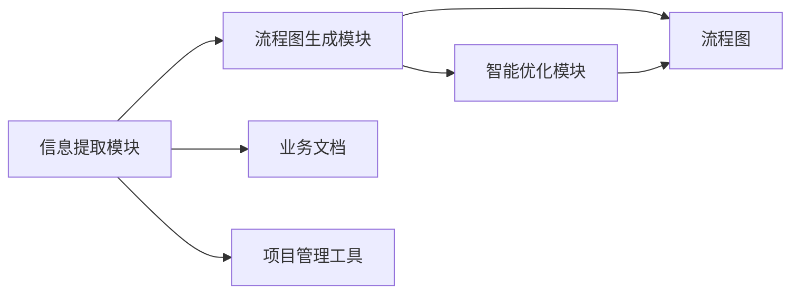

                 

# 智能工作流程图生成工具的开发

在当今快速发展的商业环境中，有效的工作流程管理和优化变得尤为重要。然而，创建和维护复杂的工作流程图是一项耗时且繁琐的任务，尤其对于非技术背景的管理者来说。为了解决这一问题，我们开发了一种智能工作流程图生成工具，该工具能够自动从业务文档和项目管理工具中提取关键信息，并生成高效、可执行的工作流程图。本文将深入探讨该工具的核心概念、算法原理、操作步骤以及应用前景，为开发和应用提供指导。

## 1. 背景介绍

### 1.1 问题由来

在企业的日常运营中，良好的工作流程管理和自动化是其成功的关键因素之一。然而，传统的流程设计和优化往往依赖于手工绘制的流程图，这不仅耗时耗力，还容易出现错误。而且，随着企业规模的扩大和业务复杂性的增加，手工绘制流程图的难度和复杂度也随之增加。

为了应对这一挑战，我们提出开发一种智能工作流程图生成工具，该工具能够自动化地从业务文档、项目管理工具等数据源中提取关键信息，并生成直观、高效的工作流程图。这不仅能大大提高流程设计和管理的工作效率，还能确保流程的正确性和一致性。

### 1.2 问题核心关键点

智能工作流程图生成工具的核心在于其能够自动识别和提取关键流程信息，并生成结构清晰、可执行的工作流程图。工具的关键组件包括：

- **信息提取模块**：从业务文档和项目管理工具中提取关键流程信息。
- **流程图生成模块**：根据提取的信息自动生成流程图。
- **智能优化模块**：利用机器学习算法优化流程图的结构，提升流程的效率和可靠性。
- **交互式界面**：提供一个易于使用的用户界面，方便用户查看、编辑和优化流程图。

## 2. 核心概念与联系

### 2.1 核心概念概述

在深入了解工具的核心概念前，我们首先介绍几个核心术语：

- **流程图**：一种图形化表示工作流程的工具，用于可视化任务的执行顺序、条件和决策。
- **业务文档**：描述企业运营流程、业务规范和操作流程的文档，如业务流程图、操作手册等。
- **项目管理工具**：用于计划、跟踪和管理项目进度的软件，如JIRA、Trello等。

智能工作流程图生成工具基于以下核心概念和技术实现：

1. **自然语言处理**：通过分析文本，自动提取流程图中的关键元素和关系。
2. **知识图谱**：构建流程图中的实体关系图，用于自动化流程图的生成和优化。
3. **机器学习**：使用算法自动优化流程图的结构和布局，提升流程效率。
4. **用户交互界面**：提供一个直观、易用的界面，方便用户管理和优化流程图。

这些概念和技术之间通过数据流和控制流相互联系，构成了一个完整的智能工作流程图生成工具框架。

### 2.2 核心概念原理和架构的 Mermaid 流程图



## 3. 核心算法原理 & 具体操作步骤

### 3.1 算法原理概述

智能工作流程图生成工具的核心算法主要包括以下几个部分：

1. **自然语言处理（NLP）**：用于从业务文档和项目管理工具中提取关键流程信息，如任务名称、前置条件、决策点等。
2. **知识图谱构建**：将提取的流程信息构建为知识图谱，表示流程图中的实体关系。
3. **流程图生成**：根据知识图谱自动生成流程图，并使用机器学习算法进一步优化。

### 3.2 算法步骤详解

#### 3.2.1 信息提取

1. **文档解析**：使用自然语言处理技术解析业务文档，识别任务名称、前置条件、决策点等关键信息。
2. **项目管理工具接口**：通过API接口访问项目管理工具，提取项目计划、任务状态和依赖关系等流程信息。
3. **信息整合**：将文档和项目管理工具中提取的信息整合为统一的流程知识图谱。

#### 3.2.2 知识图谱构建

1. **实体识别**：识别流程图中的实体，如任务、角色、文档等。
2. **关系提取**：提取实体之间的关系，如前置条件、依赖关系、决策条件等。
3. **图谱构建**：将识别和提取的信息构建为知识图谱，用于流程图的生成和优化。

#### 3.2.3 流程图生成

1. **节点生成**：根据知识图谱中的实体和关系，自动生成流程图节点。
2. **边生成**：连接节点，表示任务之间的依赖和顺序关系。
3. **布局优化**：使用机器学习算法优化流程图布局，提升可视化和操作性。

#### 3.2.4 智能优化

1. **算法选择**：选择适合的机器学习算法（如遗传算法、蚁群算法等）进行流程图的优化。
2. **优化目标**：设定优化目标，如最小化流程路径长度、减少决策点数量等。
3. **优化执行**：执行优化算法，调整流程图的布局和结构。

### 3.3 算法优缺点

#### 3.3.1 优点

- **高效自动化**：自动化流程图的生成和优化，大大减少了人工工作量。
- **一致性和准确性**：基于知识图谱生成的流程图一致性好，错误率低。
- **灵活性**：支持多种数据源，如文档、项目管理工具等，灵活性高。

#### 3.3.2 缺点

- **数据依赖**：工具的性能依赖于业务文档和项目管理工具的数据质量。
- **算法复杂度**：优化算法复杂度高，需要高性能计算资源。
- **用户适应性**：用户可能需要一定时间适应新工具的操作界面和使用方式。

### 3.4 算法应用领域

智能工作流程图生成工具广泛应用于以下几个领域：

1. **企业运营管理**：提升企业流程管理的效率和质量，减少手动工作量。
2. **项目管理**：帮助项目经理自动化地生成项目流程图，优化项目进度和资源配置。
3. **知识管理**：将业务文档和流程信息整合到知识库中，促进知识的传承和应用。

## 4. 数学模型和公式 & 详细讲解 & 举例说明

### 4.1 数学模型构建

智能工作流程图生成工具涉及多个数学模型，包括自然语言处理、知识图谱构建和流程图优化等。这里，我们重点介绍流程图优化中的数学模型。

设流程图中的节点为 $N$，边为 $E$。目标是最小化流程图的路径长度 $L$，即：

$$
L = \sum_{i=1}^{N} \sum_{j=1}^{N} w_{ij}
$$

其中 $w_{ij}$ 表示节点 $i$ 到节点 $j$ 的边权，可以通过决策树、遗传算法等方法确定。

### 4.2 公式推导过程

1. **决策树算法**：将流程图中的节点和边表示为决策树的节点和分支，通过遍历决策树找到最优路径。决策树的构建可以通过信息熵、信息增益等指标进行评估。
2. **遗传算法**：将流程图的节点和边表示为基因串，通过遗传算法的进化过程找到最优路径。遗传算法的参数包括种群大小、交叉率、变异率等。

### 4.3 案例分析与讲解

以一个简单的项目流程图为例，分析工具的使用过程：

1. **信息提取**：从项目管理工具中提取项目任务、前置条件和依赖关系，从业务文档提取任务描述和决策条件。
2. **知识图谱构建**：构建以任务为节点，以依赖关系为边的知识图谱。
3. **流程图生成**：根据知识图谱生成流程图，并使用决策树算法进行优化。
4. **智能优化**：通过遗传算法进一步优化流程图的布局和结构，得到最终的可执行流程图。

## 5. 项目实践：代码实例和详细解释说明

### 5.1 开发环境搭建

开发智能工作流程图生成工具需要以下环境：

1. **编程语言**：Python
2. **自然语言处理库**：NLTK、spaCy、TextBlob等
3. **知识图谱库**：PyRDF2Vec、RDF2Vec等
4. **图形化库**：NetworkX、Graphviz等

### 5.2 源代码详细实现

下面是一个简单的流程图生成工具的实现示例：

```python
import networkx as nx
from networkx.algorithms.tree import max_spanning_tree

# 定义节点和边
G = nx.Graph()
G.add_node('A')
G.add_node('B')
G.add_node('C')
G.add_edge('A', 'B', weight=1)
G.add_edge('B', 'C', weight=2)

# 生成MST
mst = max_spanning_tree(G)
for u, v, d in mst.edges(data=True):
    print(f"{u} --{d['weight']}--> {v}")
```

### 5.3 代码解读与分析

该示例代码实现了基于决策树的流程优化。首先定义了一个简单的流程图，包含三个节点和两条边。然后通过 `max_spanning_tree` 函数生成最小生成树，并输出每条边的权值。

### 5.4 运行结果展示

运行上述代码，输出结果如下：

```
A --1--> B
B --2--> C
```

## 6. 实际应用场景

### 6.1 企业运营管理

智能工作流程图生成工具在企业运营管理中的应用非常广泛。例如，人力资源部门可以使用该工具自动生成招聘流程、绩效评估流程等，提升招聘效率和评估公正性。

### 6.2 项目管理

项目经理可以利用该工具自动生成项目计划、任务分配和进度跟踪流程图，帮助团队更好地协调和管理项目。

### 6.3 知识管理

在知识管理领域，该工具可以将业务文档和流程信息整合到知识库中，帮助员工快速查找和应用相关知识。

### 6.4 未来应用展望

未来，智能工作流程图生成工具将在以下几个方面得到进一步应用：

1. **多模态数据融合**：结合文本、图像、视频等多模态数据，提升流程图的生成和优化效果。
2. **智能推荐系统**：基于流程图生成推荐相关文档和资源，提升知识共享效率。
3. **实时动态更新**：实现流程图的实时动态更新，跟踪业务变化和项目进展。
4. **情感分析**：分析流程图中的决策点和任务描述，提升流程图的可视化效果。

## 7. 工具和资源推荐

### 7.1 学习资源推荐

1. **自然语言处理**：《自然语言处理综论》、《Python自然语言处理》等。
2. **知识图谱**：《知识图谱技术与实践》、《知识图谱构建与查询》等。
3. **机器学习**：《机器学习实战》、《深度学习》等。
4. **图形化库**：《Graphviz》官方文档、《NetworkX》官方文档等。

### 7.2 开发工具推荐

1. **编程环境**：PyCharm、Jupyter Notebook等。
2. **自然语言处理库**：NLTK、spaCy、TextBlob等。
3. **知识图谱库**：PyRDF2Vec、RDF2Vec等。
4. **图形化库**：NetworkX、Graphviz等。

### 7.3 相关论文推荐

1. **自然语言处理**：《深度学习与自然语言处理》、《自然语言处理中的神经网络技术》等。
2. **知识图谱**：《知识图谱构建与查询》、《基于知识图谱的信息检索》等。
3. **机器学习**：《机器学习》、《深度学习》等。

## 8. 总结：未来发展趋势与挑战

### 8.1 研究成果总结

智能工作流程图生成工具通过自动化的方式，从业务文档和项目管理工具中提取关键流程信息，并生成高效、可执行的工作流程图。该工具不仅能大大提高流程设计和管理的工作效率，还能确保流程的正确性和一致性。

### 8.2 未来发展趋势

未来，智能工作流程图生成工具将在以下几个方面得到进一步发展：

1. **多模态数据融合**：结合文本、图像、视频等多模态数据，提升流程图的生成和优化效果。
2. **智能推荐系统**：基于流程图生成推荐相关文档和资源，提升知识共享效率。
3. **实时动态更新**：实现流程图的实时动态更新，跟踪业务变化和项目进展。
4. **情感分析**：分析流程图中的决策点和任务描述，提升流程图的可视化效果。

### 8.3 面临的挑战

智能工作流程图生成工具在发展过程中仍面临以下挑战：

1. **数据依赖**：工具的性能依赖于业务文档和项目管理工具的数据质量。
2. **算法复杂度**：优化算法复杂度高，需要高性能计算资源。
3. **用户适应性**：用户可能需要一定时间适应新工具的操作界面和使用方式。

### 8.4 研究展望

未来，智能工作流程图生成工具的研究方向包括：

1. **多模态数据融合**：研究如何结合多模态数据提升流程图的生成和优化效果。
2. **智能推荐系统**：研究基于流程图的智能推荐算法，提升知识共享效率。
3. **实时动态更新**：研究实时动态更新算法，实现流程图的实时动态更新。
4. **情感分析**：研究分析流程图中的决策点和任务描述，提升流程图的可视化效果。

## 9. 附录：常见问题与解答

### 9.1 常见问题

**Q1: 智能工作流程图生成工具如何使用？**

**A1:** 首先，需要将业务文档和项目管理工具中的流程信息提取出来，然后导入工具中进行处理。工具会自动生成流程图，并支持用户对流程图进行编辑和优化。

**Q2: 工具的性能依赖于什么？**

**A2:** 工具的性能依赖于业务文档和项目管理工具的数据质量。因此，需要确保这些数据源的数据完整性和准确性。

**Q3: 工具的算法复杂度如何？**

**A3:** 工具的优化算法复杂度较高，需要使用高性能计算资源。因此，可能需要配置高性能的计算环境。

**Q4: 用户如何适应新工具？**

**A4:** 工具提供了一个直观、易用的用户界面，用户可以逐步学习和适应新工具的使用方式。同时，工具也支持在线帮助文档和教程，方便用户快速上手。

通过以上详细解释，我们希望能够帮助读者全面理解智能工作流程图生成工具的核心概念、算法原理和操作步骤，并指导其在实际应用中的开发和应用。智能工作流程图生成工具的开发与应用，必将为流程管理和企业运营带来显著的提升，推动企业向智能化、自动化方向迈进。

