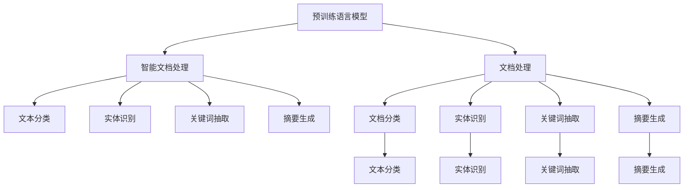

                 

# 智能文档处理：LLM在办公自动化中的应用

## 1. 背景介绍

### 1.1 问题由来
随着信息化的不断推进，现代办公环境中产生了海量的文档和资料。无论是企业的商业报告、客户合同、员工邮件，还是学术研究论文、实验室实验记录，文档处理已经成为了办公自动化的一个重要环节。然而，传统文档处理依赖于人工手动操作，耗时耗力，容易出错。如何提高文档处理的自动化水平，提升办公效率，成为当前亟待解决的问题。

### 1.2 问题核心关键点
当前文档处理的主要问题在于数据规模庞大、文档结构复杂、语义信息丰富，如何自动处理和理解这些文档，成为了难点。基于大规模语言模型（Large Language Model，简称LLM）的技术，特别是预训练语言模型，为解决这些问题提供了新的解决方案。

### 1.3 问题研究意义
利用预训练语言模型对文档进行自动处理和理解，可以有效提高文档处理的效率和准确性，降低人工成本。特别在企业文档管理、政府文档归档、学术文献检索等场景中，预训练语言模型能够极大提升文档处理的自动化水平，为办公自动化系统提供有力支持。

## 2. 核心概念与联系

### 2.1 核心概念概述

为了更好地理解LLM在文档处理中的应用，本节将介绍几个关键概念：

- **预训练语言模型(Pre-trained Language Model, LLM)**：以自回归（如GPT）或自编码（如BERT）模型为代表的大规模预训练语言模型。通过在大规模无标签文本语料上进行预训练，学习通用的语言表示，具备强大的语言理解和生成能力。

- **文档处理(Document Processing)**：包括文档分类、实体识别、关键词抽取、摘要生成等任务。利用预训练语言模型对文档进行自动化的处理，实现文档信息的提取和利用。

- **智能文档处理(Intelligent Document Processing, IDP)**：在文档处理的基础上，结合人工智能技术，实现文档的自动化理解和应用，如自动化文本分类、实体链接、信息检索、知识图谱构建等。

- **自然语言处理(Natural Language Processing, NLP)**：是AI领域的一个重要分支，专注于如何让计算机理解和处理人类语言。预训练语言模型是NLP的重要工具。

- **办公自动化(Office Automation)**：利用先进的信息技术，将人工操作转变为计算机自动化操作，提升工作效率和准确性。

这些核心概念之间的逻辑关系可以通过以下Mermaid流程图来展示：



这个流程图展示了大语言模型在文档处理中的应用过程：

1. 预训练语言模型通过大规模无标签文本数据获得语言表示。
2. 文档处理任务基于预训练语言模型，实现文档的分类、实体识别、关键词抽取、摘要生成等。
3. 智能文档处理则在此基础上，结合人工智能技术，实现文档的自动化理解和应用。

这些概念共同构成了LLM在文档处理中的应用框架，使其能够有效地处理和理解复杂文档信息。

## 3. 核心算法原理 & 具体操作步骤
### 3.1 算法原理概述

基于LLM的文档处理，本质上是一个语言理解与生成过程。其核心思想是：利用预训练语言模型的通用语言知识，对文档进行自动化的分类、实体识别、关键词抽取、摘要生成等处理。

形式化地，假设预训练模型为 $M_{\theta}$，其中 $\theta$ 为预训练得到的模型参数。给定文档 $D$，处理任务 $T$，处理后的文档表示为 $D'$。处理任务 $T$ 可以包括分类、实体识别、关键词抽取等。预训练语言模型 $M_{\theta}$ 在文档 $D$ 上进行处理，得到处理后的文档 $D'$。处理过程可以表示为：

$$
D' = M_{\theta}(D)
$$

处理任务的目的是使得 $D'$ 能够匹配任务标签或提取关键信息。因此，需要设计针对任务 $T$ 的损失函数，用于衡量处理结果 $D'$ 与任务标签或关键信息的差异。常见的处理任务及其对应的损失函数包括：

- 文本分类：分类损失函数，如交叉熵损失、对数损失等。
- 实体识别：序列标注损失函数，如条件随机场损失、标签平滑交叉熵等。
- 关键词抽取：二元分类损失函数，如F1-score等。
- 摘要生成：序列生成损失函数，如BLEU、ROUGE等。

通过梯度下降等优化算法，模型不断更新参数 $\theta$，最小化损失函数，使得处理结果 $D'$ 逼近任务标签或关键信息。

### 3.2 算法步骤详解

基于LLM的文档处理一般包括以下几个关键步骤：

**Step 1: 准备预训练模型和数据集**
- 选择合适的预训练语言模型 $M_{\theta}$，如BERT、GPT等。
- 准备文档处理任务的标注数据集 $D=\{(D_i, T_i)\}_{i=1}^N$，其中 $D_i$ 为文档，$T_i$ 为任务标签或关键信息。

**Step 2: 任务适配层设计**
- 根据任务类型，设计合适的任务适配层。对于分类任务，通常添加线性分类器；对于序列标注任务，使用条件随机场或Transformer结构。
- 对于摘要生成任务，通常使用基于Transformer的序列生成模型。

**Step 3: 微调模型**
- 在预训练模型的基础上，使用标注数据集 $D$ 进行微调，最小化损失函数 $\mathcal{L}$。
- 选择合适的优化算法及其参数，如Adam、SGD等，设置学习率、批大小、迭代轮数等。
- 设置正则化技术及强度，包括权重衰减、Dropout、Early Stopping等。

**Step 4: 测试和评估**
- 在测试集上评估微调后模型的性能，对比微调前后的效果提升。
- 使用微调后的模型对新文档进行推理，输出处理结果。
- 持续收集新数据，定期重新微调模型，以适应数据分布的变化。

以上是基于LLM的文档处理的一般流程。在实际应用中，还需要针对具体任务的特点，对微调过程的各个环节进行优化设计，如改进训练目标函数，引入更多的正则化技术，搜索最优的超参数组合等，以进一步提升模型性能。

### 3.3 算法优缺点

基于LLM的文档处理具有以下优点：

- 简单高效。只需准备少量标注数据，即可对预训练模型进行快速适配，获得较大的性能提升。
- 通用适用。适用于各种文档处理任务，包括文本分类、实体识别、关键词抽取、摘要生成等。
- 效果好。微调使得通用预训练模型更好地适应特定任务，在应用场景中取得更优表现。
- 鲁棒性强。基于预训练语言模型的知识，文档处理模型对于噪声和干扰具有一定的鲁棒性。

同时，该方法也存在一定的局限性：

- 依赖标注数据。文档处理的效果很大程度上取决于标注数据的质量和数量，获取高质量标注数据的成本较高。
- 模型泛化能力有限。当文档数据与预训练数据的分布差异较大时，微调的性能提升有限。
- 可解释性不足。微调模型的决策过程通常缺乏可解释性，难以对其推理逻辑进行分析和调试。
- 计算资源需求大。预训练语言模型和微调模型通常需要大量的计算资源，硬件设备需求较高。

尽管存在这些局限性，但就目前而言，基于LLM的文档处理仍然是大规模文档自动化处理的有效方法。未来相关研究的重点在于如何进一步降低微调对标注数据的依赖，提高模型的少样本学习和跨领域迁移能力，同时兼顾可解释性和计算资源需求等因素。

### 3.4 算法应用领域

基于LLM的文档处理在NLP领域已经得到了广泛的应用，覆盖了几乎所有常见任务，例如：

- 文本分类：如情感分析、主题分类、意图识别等。利用预训练语言模型，可以自动对文档进行分类，判断其主题和情感倾向。
- 实体识别：识别文档中的人名、地名、机构名等特定实体。预训练语言模型能够自动标注文档中的实体，提升信息抽取的准确性。
- 关键词抽取：从文档文本中自动抽取关键词，用于文档索引和检索。利用预训练语言模型，可以自动提取文档中的重要信息。
- 摘要生成：将长文档压缩成简短摘要，提高文档阅读效率。预训练语言模型可以自动生成文档摘要，保留关键信息。
- 文本翻译：将文档翻译成多种语言。利用预训练语言模型，可以实现高效的文档翻译。

除了上述这些经典任务外，预训练语言模型在文档处理领域的创新性应用还在不断涌现，如文档聚类、知识图谱构建、文档自动摘要等，为文档处理技术带来了新的突破。

## 4. 数学模型和公式 & 详细讲解  
### 4.1 数学模型构建

本节将使用数学语言对基于LLM的文档处理过程进行更加严格的刻画。

记预训练语言模型为 $M_{\theta}$，其中 $\theta$ 为预训练得到的模型参数。假设文档处理任务的标注数据集为 $D=\{(D_i, T_i)\}_{i=1}^N$，其中 $D_i$ 为文档，$T_i$ 为任务标签或关键信息。

定义模型 $M_{\theta}$ 在文档 $D$ 上的处理函数为 $F_{\theta}(D)$，其中 $F_{\theta}(D)$ 为文档 $D$ 经过模型 $M_{\theta}$ 处理后的结果。处理任务的目的是使得 $F_{\theta}(D)$ 能够匹配任务标签或提取关键信息。因此，需要设计针对任务 $T$ 的损失函数 $\mathcal{L}$，用于衡量处理结果 $F_{\theta}(D)$ 与任务标签或关键信息的差异。

常见的处理任务及其对应的损失函数包括：

- 文本分类：分类损失函数，如交叉熵损失 $\mathcal{L}_{CE}$：

$$
\mathcal{L}_{CE} = -\frac{1}{N}\sum_{i=1}^N T_i \log M_{\theta}(D_i)
$$

- 实体识别：序列标注损失函数，如条件随机场损失 $\mathcal{L}_{CRF}$：

$$
\mathcal{L}_{CRF} = -\frac{1}{N}\sum_{i=1}^N T_i \log P(T_i | D_i)
$$

- 关键词抽取：二元分类损失函数，如F1-score：

$$
\mathcal{L}_{F1} = -\frac{1}{N}\sum_{i=1}^N (T_i \times \text{F1-score}(F_{\theta}(D_i), T_i) + (1-T_i) \times \text{F1-score}(F_{\theta}(D_i), 1-T_i))
$$

- 摘要生成：序列生成损失函数，如BLEU：

$$
\mathcal{L}_{BLEU} = -\frac{1}{N}\sum_{i=1}^N \text{BLEU}(F_{\theta}(D_i), T_i)
$$

在得到损失函数后，即可带入参数更新公式，完成模型的迭代优化。重复上述过程直至收敛，最终得到适应文档处理任务的最优模型参数 $\theta^*$。

### 4.2 公式推导过程

以下我们以文本分类任务为例，推导交叉熵损失函数及其梯度的计算公式。

假设模型 $M_{\theta}$ 在文档 $D$ 上的输出为 $\hat{y}=M_{\theta}(D) \in [0,1]$，表示文档属于某一类别的概率。真实标签 $T_i \in \{0,1\}$。则二分类交叉熵损失函数定义为：

$$
\mathcal{L}_{CE} = -\frac{1}{N}\sum_{i=1}^N T_i \log \hat{y_i} + (1-T_i) \log (1-\hat{y_i})
$$

将其代入经验风险公式，得：

$$
\mathcal{L}(\theta) = -\frac{1}{N}\sum_{i=1}^N T_i \log M_{\theta}(D_i) + (1-T_i) \log (1-M_{\theta}(D_i))
$$

根据链式法则，损失函数对参数 $\theta_k$ 的梯度为：

$$
\frac{\partial \mathcal{L}(\theta)}{\partial \theta_k} = -\frac{1}{N}\sum_{i=1}^N \frac{T_i}{M_{\theta}(D_i)} - \frac{1-T_i}{1-M_{\theta}(D_i)} \frac{\partial M_{\theta}(D_i)}{\partial \theta_k}
$$

其中 $\frac{\partial M_{\theta}(D_i)}{\partial \theta_k}$ 可进一步递归展开，利用自动微分技术完成计算。

在得到损失函数的梯度后，即可带入参数更新公式，完成模型的迭代优化。重复上述过程直至收敛，最终得到适应文档分类任务的最优模型参数 $\theta^*$。

## 5. 项目实践：代码实例和详细解释说明
### 5.1 开发环境搭建

在进行文档处理实践前，我们需要准备好开发环境。以下是使用Python进行PyTorch开发的环境配置流程：

1. 安装Anaconda：从官网下载并安装Anaconda，用于创建独立的Python环境。

2. 创建并激活虚拟环境：
```bash
conda create -n pytorch-env python=3.8 
conda activate pytorch-env
```

3. 安装PyTorch：根据CUDA版本，从官网获取对应的安装命令。例如：
```bash
conda install pytorch torchvision torchaudio cudatoolkit=11.1 -c pytorch -c conda-forge
```

4. 安装TensorFlow：
```bash
conda install tensorflow
```

5. 安装各类工具包：
```bash
pip install numpy pandas scikit-learn matplotlib tqdm jupyter notebook ipython
```

完成上述步骤后，即可在`pytorch-env`环境中开始文档处理实践。

### 5.2 源代码详细实现

下面我们以实体识别任务为例，给出使用Transformers库对BERT模型进行微调的PyTorch代码实现。

首先，定义实体识别任务的数据处理函数：

```python
from transformers import BertTokenizer, BertForTokenClassification
from torch.utils.data import Dataset
import torch

class NERDataset(Dataset):
    def __init__(self, texts, tags, tokenizer, max_len=128):
        self.texts = texts
        self.tags = tags
        self.tokenizer = tokenizer
        self.max_len = max_len
        
    def __len__(self):
        return len(self.texts)
    
    def __getitem__(self, item):
        text = self.texts[item]
        tags = self.tags[item]
        
        encoding = self.tokenizer(text, return_tensors='pt', max_length=self.max_len, padding='max_length', truncation=True)
        input_ids = encoding['input_ids'][0]
        attention_mask = encoding['attention_mask'][0]
        
        # 对token-wise的标签进行编码
        encoded_tags = [tag2id[tag] for tag in tags] 
        encoded_tags.extend([tag2id['O']] * (self.max_len - len(encoded_tags)))
        labels = torch.tensor(encoded_tags, dtype=torch.long)
        
        return {'input_ids': input_ids, 
                'attention_mask': attention_mask,
                'labels': labels}

# 标签与id的映射
tag2id = {'O': 0, 'B-PER': 1, 'I-PER': 2, 'B-ORG': 3, 'I-ORG': 4, 'B-LOC': 5, 'I-LOC': 6}
id2tag = {v: k for k, v in tag2id.items()}

# 创建dataset
tokenizer = BertTokenizer.from_pretrained('bert-base-cased')

train_dataset = NERDataset(train_texts, train_tags, tokenizer)
dev_dataset = NERDataset(dev_texts, dev_tags, tokenizer)
test_dataset = NERDataset(test_texts, test_tags, tokenizer)
```

然后，定义模型和优化器：

```python
from transformers import BertForTokenClassification, AdamW

model = BertForTokenClassification.from_pretrained('bert-base-cased', num_labels=len(tag2id))

optimizer = AdamW(model.parameters(), lr=2e-5)
```

接着，定义训练和评估函数：

```python
from torch.utils.data import DataLoader
from tqdm import tqdm
from sklearn.metrics import classification_report

device = torch.device('cuda') if torch.cuda.is_available() else torch.device('cpu')
model.to(device)

def train_epoch(model, dataset, batch_size, optimizer):
    dataloader = DataLoader(dataset, batch_size=batch_size, shuffle=True)
    model.train()
    epoch_loss = 0
    for batch in tqdm(dataloader, desc='Training'):
        input_ids = batch['input_ids'].to(device)
        attention_mask = batch['attention_mask'].to(device)
        labels = batch['labels'].to(device)
        model.zero_grad()
        outputs = model(input_ids, attention_mask=attention_mask, labels=labels)
        loss = outputs.loss
        epoch_loss += loss.item()
        loss.backward()
        optimizer.step()
    return epoch_loss / len(dataloader)

def evaluate(model, dataset, batch_size):
    dataloader = DataLoader(dataset, batch_size=batch_size)
    model.eval()
    preds, labels = [], []
    with torch.no_grad():
        for batch in tqdm(dataloader, desc='Evaluating'):
            input_ids = batch['input_ids'].to(device)
            attention_mask = batch['attention_mask'].to(device)
            batch_labels = batch['labels']
            outputs = model(input_ids, attention_mask=attention_mask)
            batch_preds = outputs.logits.argmax(dim=2).to('cpu').tolist()
            batch_labels = batch_labels.to('cpu').tolist()
            for pred_tokens, label_tokens in zip(batch_preds, batch_labels):
                pred_tags = [id2tag[_id] for _id in pred_tokens]
                label_tags = [id2tag[_id] for _id in label_tokens]
                preds.append(pred_tags[:len(label_tags)])
                labels.append(label_tags)
                
    print(classification_report(labels, preds))
```

最后，启动训练流程并在测试集上评估：

```python
epochs = 5
batch_size = 16

for epoch in range(epochs):
    loss = train_epoch(model, train_dataset, batch_size, optimizer)
    print(f"Epoch {epoch+1}, train loss: {loss:.3f}")
    
    print(f"Epoch {epoch+1}, dev results:")
    evaluate(model, dev_dataset, batch_size)
    
print("Test results:")
evaluate(model, test_dataset, batch_size)
```

以上就是使用PyTorch对BERT进行命名实体识别任务微调的完整代码实现。可以看到，得益于Transformers库的强大封装，我们可以用相对简洁的代码完成BERT模型的加载和微调。

### 5.3 代码解读与分析

让我们再详细解读一下关键代码的实现细节：

**NERDataset类**：
- `__init__`方法：初始化文本、标签、分词器等关键组件。
- `__len__`方法：返回数据集的样本数量。
- `__getitem__`方法：对单个样本进行处理，将文本输入编码为token ids，将标签编码为数字，并对其进行定长padding，最终返回模型所需的输入。

**tag2id和id2tag字典**：
- 定义了标签与数字id之间的映射关系，用于将token-wise的预测结果解码回真实的标签。

**训练和评估函数**：
- 使用PyTorch的DataLoader对数据集进行批次化加载，供模型训练和推理使用。
- 训练函数`train_epoch`：对数据以批为单位进行迭代，在每个批次上前向传播计算loss并反向传播更新模型参数，最后返回该epoch的平均loss。
- 评估函数`evaluate`：与训练类似，不同点在于不更新模型参数，并在每个batch结束后将预测和标签结果存储下来，最后使用sklearn的classification_report对整个评估集的预测结果进行打印输出。

**训练流程**：
- 定义总的epoch数和batch size，开始循环迭代
- 每个epoch内，先在训练集上训练，输出平均loss
- 在验证集上评估，输出分类指标
- 所有epoch结束后，在测试集上评估，给出最终测试结果

可以看到，PyTorch配合Transformers库使得BERT微调的代码实现变得简洁高效。开发者可以将更多精力放在数据处理、模型改进等高层逻辑上，而不必过多关注底层的实现细节。

当然，工业级的系统实现还需考虑更多因素，如模型的保存和部署、超参数的自动搜索、更灵活的任务适配层等。但核心的微调范式基本与此类似。

## 6. 实际应用场景
### 6.1 智能文档分类

智能文档分类系统能够自动将大量文档进行自动分类，减少人工分类的工作量，提升文档管理的效率和准确性。例如，在企业文档管理中，可以将员工邮件、合同、报告等文档自动分类为不同的业务领域，如销售、市场、研发等。

在技术实现上，可以利用预训练语言模型对文档进行自动分类，设计合适的任务适配层，对模型进行微调，使得模型能够根据文档内容自动标注分类标签。具体实现可以参考文本分类任务的处理方式，在损失函数和任务适配层的设计上进行调整。

### 6.2 文档摘要生成

文档摘要生成系统能够自动将长文档压缩成简短摘要，提高文档阅读效率。例如，在新闻编辑、学术论文撰写等场景中，需要从长文本中提取关键信息，生成简洁的摘要。

在技术实现上，可以利用预训练语言模型对文档进行自动摘要生成，设计合适的任务适配层，对模型进行微调，使得模型能够根据文档内容自动生成摘要。具体实现可以参考摘要生成任务的处理方式，在损失函数和任务适配层的设计上进行调整。

### 6.3 知识图谱构建

知识图谱构建系统能够自动从文档信息中抽取实体和关系，构建结构化的知识图谱，方便信息的检索和分析。例如，在企业知识管理中，需要从大量的文档和报告中抽取关键实体和关系，构建知识图谱，方便员工检索相关知识。

在技术实现上，可以利用预训练语言模型对文档进行实体识别和关系抽取，设计合适的任务适配层，对模型进行微调，使得模型能够自动标注文档中的实体和关系。具体实现可以参考实体识别任务的处理方式，在损失函数和任务适配层的设计上进行调整。

### 6.4 未来应用展望

随着预训练语言模型和微调方法的不断发展，基于LLM的文档处理技术将在更多领域得到应用，为信息处理和管理带来新的变革。

在智慧医疗领域，基于预训练语言模型的智能文档处理系统，可以自动对医疗报告、病历进行分类、实体识别、摘要生成等处理，提升医疗信息的自动化管理和分析能力。

在智能教育领域，利用预训练语言模型的文档处理技术，可以自动对学术论文、课程讲义等文档进行分类、摘要生成、知识图谱构建等处理，提升学术研究和教学的效率和质量。

在智慧城市治理中，基于预训练语言模型的智能文档处理系统，可以自动对城市文档、政务信息等进行分类、摘要生成、知识图谱构建等处理，提升城市管理的自动化和智能化水平，构建更安全、高效的未来城市。

此外，在企业文档管理、政府文档归档、学术文献检索等众多领域，基于LLM的文档处理技术也将不断涌现，为文档处理带来新的突破。相信随着技术的日益成熟，LLM在文档处理中的应用前景将更加广阔，为信息处理和管理带来更多的可能性。

## 7. 工具和资源推荐
### 7.1 学习资源推荐

为了帮助开发者系统掌握LLM在文档处理中的应用，这里推荐一些优质的学习资源：

1. 《Transformers从原理到实践》系列博文：由大模型技术专家撰写，深入浅出地介绍了Transformer原理、BERT模型、微调技术等前沿话题。

2. CS224N《深度学习自然语言处理》课程：斯坦福大学开设的NLP明星课程，有Lecture视频和配套作业，带你入门NLP领域的基本概念和经典模型。

3. 《Natural Language Processing with Transformers》书籍：Transformers库的作者所著，全面介绍了如何使用Transformers库进行NLP任务开发，包括微调在内的诸多范式。

4. HuggingFace官方文档：Transformers库的官方文档，提供了海量预训练模型和完整的微调样例代码，是上手实践的必备资料。

5. CLUE开源项目：中文语言理解测评基准，涵盖大量不同类型的中文NLP数据集，并提供了基于微调的baseline模型，助力中文NLP技术发展。

通过对这些资源的学习实践，相信你一定能够快速掌握LLM在文档处理中的应用，并用于解决实际的NLP问题。
### 7.2 开发工具推荐

高效的开发离不开优秀的工具支持。以下是几款用于LLM文档处理开发的常用工具：

1. PyTorch：基于Python的开源深度学习框架，灵活动态的计算图，适合快速迭代研究。大部分预训练语言模型都有PyTorch版本的实现。

2. TensorFlow：由Google主导开发的开源深度学习框架，生产部署方便，适合大规模工程应用。同样有丰富的预训练语言模型资源。

3. Transformers库：HuggingFace开发的NLP工具库，集成了众多SOTA语言模型，支持PyTorch和TensorFlow，是进行文档处理任务开发的利器。

4. Weights & Biases：模型训练的实验跟踪工具，可以记录和可视化模型训练过程中的各项指标，方便对比和调优。与主流深度学习框架无缝集成。

5. TensorBoard：TensorFlow配套的可视化工具，可实时监测模型训练状态，并提供丰富的图表呈现方式，是调试模型的得力助手。

6. Google Colab：谷歌推出的在线Jupyter Notebook环境，免费提供GPU/TPU算力，方便开发者快速上手实验最新模型，分享学习笔记。

合理利用这些工具，可以显著提升LLM在文档处理任务中的开发效率，加快创新迭代的步伐。

### 7.3 相关论文推荐

LLM和文档处理技术的发展源于学界的持续研究。以下是几篇奠基性的相关论文，推荐阅读：

1. Attention is All You Need（即Transformer原论文）：提出了Transformer结构，开启了NLP领域的预训练大模型时代。

2. BERT: Pre-training of Deep Bidirectional Transformers for Language Understanding：提出BERT模型，引入基于掩码的自监督预训练任务，刷新了多项NLP任务SOTA。

3. Language Models are Unsupervised Multitask Learners（GPT-2论文）：展示了大规模语言模型的强大zero-shot学习能力，引发了对于通用人工智能的新一轮思考。

4. Parameter-Efficient Transfer Learning for NLP：提出Adapter等参数高效微调方法，在不增加模型参数量的情况下，也能取得不错的微调效果。

5. Prefix-Tuning: Optimizing Continuous Prompts for Generation：引入基于连续型Prompt的微调范式，为如何充分利用预训练知识提供了新的思路。

6. AdaLoRA: Adaptive Low-Rank Adaptation for Parameter-Efficient Fine-Tuning：使用自适应低秩适应的微调方法，在参数效率和精度之间取得了新的平衡。

这些论文代表了大语言模型和文档处理技术的发展脉络。通过学习这些前沿成果，可以帮助研究者把握学科前进方向，激发更多的创新灵感。

## 8. 总结：未来发展趋势与挑战
### 8.1 总结

本文对基于LLM的文档处理方法进行了全面系统的介绍。首先阐述了LLM和文档处理技术的研究背景和意义，明确了微调在拓展预训练模型应用、提升文档处理效率和准确性方面的独特价值。其次，从原理到实践，详细讲解了基于LLM的文档处理过程，包括预训练模型选择、任务适配层设计、微调算法等关键步骤。同时，本文还广泛探讨了LLM在文档处理中的实际应用场景，展示了LLM在文档处理技术中的广阔前景。

通过本文的系统梳理，可以看到，基于LLM的文档处理技术正在成为文档自动化处理的有效方法，极大地提高了文档处理的效率和准确性，降低了人工成本。未来，伴随预训练语言模型和微调方法的持续演进，基于LLM的文档处理技术必将进一步拓展其应用边界，为文档处理带来更多的创新和突破。

### 8.2 未来发展趋势

展望未来，基于LLM的文档处理技术将呈现以下几个发展趋势：

1. 模型规模持续增大。随着算力成本的下降和数据规模的扩张，预训练语言模型的参数量还将持续增长。超大规模语言模型蕴含的丰富语言知识，有望支撑更加复杂多变的文档处理任务。

2. 微调方法日趋多样。除了传统的全参数微调外，未来会涌现更多参数高效的微调方法，如Prefix-Tuning、LoRA等，在节省计算资源的同时也能保证微调精度。

3. 持续学习成为常态。随着数据分布的不断变化，微调模型也需要持续学习新知识以保持性能。如何在不遗忘原有知识的同时，高效吸收新样本信息，将成为重要的研究课题。

4. 标注样本需求降低。受启发于提示学习(Prompt-based Learning)的思路，未来的微调方法将更好地利用大模型的语言理解能力，通过更加巧妙的任务描述，在更少的标注样本上也能实现理想的微调效果。

5. 文档处理技术与其他AI技术的融合。例如，与知识图谱、逻辑规则等专家知识结合，加强不同模态数据的整合，实现视觉、语音等多模态信息与文本信息的协同建模。

6. 面向领域微调。根据特定领域的文档特点，设计针对性的预训练任务和微调策略，提升文档处理的精准度和泛化能力。

以上趋势凸显了基于LLM的文档处理技术的广阔前景。这些方向的探索发展，必将进一步提升文档处理的自动化水平，为信息处理和管理带来更多的可能性。

### 8.3 面临的挑战

尽管基于LLM的文档处理技术已经取得了瞩目成就，但在迈向更加智能化、普适化应用的过程中，它仍面临诸多挑战：

1. 标注成本瓶颈。尽管微调大大降低了标注数据的需求，但对于长尾应用场景，难以获得充足的高质量标注数据，成为制约微调性能的瓶颈。如何进一步降低微调对标注样本的依赖，将是一大难题。

2. 模型鲁棒性不足。当前微调模型面对域外数据时，泛化性能往往大打折扣。对于测试样本的微小扰动，微调模型的预测也容易发生波动。如何提高微调模型的鲁棒性，避免灾难性遗忘，还需要更多理论和实践的积累。

3. 推理效率有待提高。大规模语言模型虽然精度高，但在实际部署时往往面临推理速度慢、内存占用大等效率问题。如何在保证性能的同时，简化模型结构，提升推理速度，优化资源占用，将是重要的优化方向。

4. 可解释性亟需加强。当前微调模型更像是"黑盒"系统，难以解释其内部工作机制和决策逻辑。对于医疗、金融等高风险应用，算法的可解释性和可审计性尤为重要。如何赋予微调模型更强的可解释性，将是亟待攻克的难题。

5. 安全性有待保障。预训练语言模型难免会学习到有偏见、有害的信息，通过微调传递到下游任务，产生误导性、歧视性的输出，给实际应用带来安全隐患。如何从数据和算法层面消除模型偏见，避免恶意用途，确保输出的安全性，也将是重要的研究课题。

6. 知识整合能力不足。现有的微调模型往往局限于任务内数据，难以灵活吸收和运用更广泛的先验知识。如何让微调过程更好地与外部知识库、规则库等专家知识结合，形成更加全面、准确的信息整合能力，还有很大的想象空间。

正视基于LLM的文档处理面临的这些挑战，积极应对并寻求突破，将是大语言模型在文档处理技术中走向成熟的必由之路。相信随着学界和产业界的共同努力，这些挑战终将一一被克服，基于LLM的文档处理技术必将在构建智能文档处理系统中扮演越来越重要的角色。

### 8.4 研究展望

面对基于LLM的文档处理所面临的种种挑战，未来的研究需要在以下几个方面寻求新的突破：

1. 探索无监督和半监督微调方法。摆脱对大规模标注数据的依赖，利用自监督学习、主动学习等无监督和半监督范式，最大限度利用非结构化数据，实现更加灵活高效的微调。

2. 研究参数高效和计算高效的微调范式。开发更加参数高效的微调方法，在固定大部分预训练参数的同时，只更新极少量的任务相关参数。同时优化微调模型的计算图，减少前向传播和反向传播的资源消耗，实现更加轻量级、实时性的部署。

3. 融合因果和对比学习范式。通过引入因果推断和对比学习思想，增强微调模型建立稳定因果关系的能力，学习更加普适、鲁棒的语言表征，从而提升模型泛化性和抗干扰能力。

4. 引入更多先验知识。将符号化的先验知识，如知识图谱、逻辑规则等，与神经网络模型进行巧妙融合，引导微调过程学习更准确、合理的语言模型。同时加强不同模态数据的整合，实现视觉、语音等多模态信息与文本信息的协同建模。

5. 结合因果分析和博弈论工具。将因果分析方法引入微调模型，识别出模型决策的关键特征，增强输出解释的因果性和逻辑性。借助博弈论工具刻画人机交互过程，主动探索并规避模型的脆弱点，提高系统稳定性。

6. 纳入伦理道德约束。在模型训练目标中引入伦理导向的评估指标，过滤和惩罚有偏见、有害的输出倾向。同时加强人工干预和审核，建立模型行为的监管机制，确保输出符合人类价值观和伦理道德。

这些研究方向的探索，必将引领基于LLM的文档处理技术迈向更高的台阶，为构建安全、可靠、可解释、可控的智能系统铺平道路。面向未来，基于LLM的文档处理技术还需要与其他人工智能技术进行更深入的融合，如知识表示、因果推理、强化学习等，多路径协同发力，共同推动自然语言理解和智能交互系统的进步。只有勇于创新、敢于突破，才能不断拓展语言模型的边界，让智能技术更好地造福人类社会。

## 9. 附录：常见问题与解答

**Q1：预训练语言模型是否适用于所有文档处理任务？**

A: 预训练语言模型在大多数文档处理任务上都能取得不错的效果，特别是对于数据量较大的任务。但对于一些特定领域的任务，如医学、法律等，仅仅依靠通用语料预训练的模型可能难以很好地适应。此时需要在特定领域语料上进一步预训练，再进行微调，才能获得理想效果。此外，对于一些需要时效性、个性化很强的任务，如对话、推荐等，微调方法也需要针对性的改进优化。

**Q2：微调过程中如何选择合适的学习率？**

A: 微调的学习率一般要比预训练时小1-2个数量级，如果使用过大的学习率，容易破坏预训练权重，导致过拟合。一般建议从1e-5开始调参，逐步减小学习率，直至收敛。也可以使用warmup策略，在开始阶段使用较小的学习率，再逐渐过渡到预设值。需要注意的是，不同的优化器(如AdamW、Adafactor等)以及不同的学习率调度策略，可能需要设置不同的学习率阈值。

**Q3：采用预训练语言模型微调时会面临哪些资源瓶颈？**

A: 目前主流的预训练语言模型动辄以亿计的参数规模，对算力、内存、存储都提出了很高的要求。GPU/TPU等高性能设备是必不可少的，但即便如此，超大批次的训练和推理也可能遇到显存不足的问题。因此需要采用一些资源优化技术，如梯度积累、混合精度训练、模型并行等，来突破硬件瓶颈。同时，模型的存储和读取也可能占用大量时间和空间，需要采用模型压缩、稀疏化存储等方法进行优化。

**Q4：如何缓解微调过程中的过拟合问题？**

A: 过拟合是微调面临的主要挑战，尤其是在标注数据不足的情况下。常见的缓解策略包括：
1. 数据增强：通过回译、近义替换等方式扩充训练集
2. 正则化：使用L2正则、Dropout、Early Stopping等避免过拟合
3. 对抗训练：引入对抗样本，提高模型鲁棒性
4. 参数高效微调：只调整少量参数(如Adapter、Prefix等)，减小过拟合风险
5. 多模型集成：训练多个微调模型，取平均输出，抑制过拟合

这些策略往往需要根据具体任务和数据特点进行灵活组合。只有在数据、模型、训练、推理等各环节进行全面优化，才能最大限度地发挥预训练语言模型的优势。

**Q5：预训练语言模型在文档处理中的安全性如何保障？**

A: 预训练语言模型可能学习到有害的偏见和信息，这些信息通过微调传递到下游任务中，可能会带来安全隐患。为了保障模型安全性，可以采取以下措施：
1. 数据清洗：在数据预处理阶段，过滤掉有害的训练样本，避免模型学习到有害信息。
2. 模型监控：在模型部署后，持续监控模型输出，及时发现和纠正有害的输出。
3. 模型审计：定期对模型进行审计，检查模型的输出是否符合伦理道德规范。
4. 用户干预：在关键应用场景中，设置人工干预机制，由用户对模型的输出进行审核和纠正。

这些措施可以从数据、模型、应用等多个层面保障预训练语言模型的安全性，减少模型有害输出的风险。

---

作者：禅与计算机程序设计艺术 / Zen and the Art of Computer Programming

