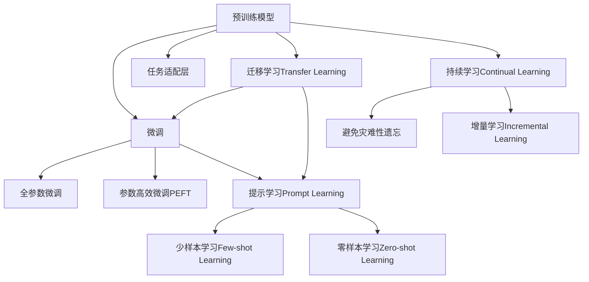

                 

## 1. 背景介绍

### 1.1 问题由来
智能旅游是当前数字经济的热点领域之一，覆盖旅游产品推荐、旅游目的地探索、个性化旅游线路规划等多个方面。随着移动设备普及和互联网技术的进步，旅游用户越来越多地依赖在线平台来规划和预订旅行。但现有的旅游推荐系统往往缺乏个性化、场景化和动态化特征，难以满足用户的多样化需求。

为了解决这一问题，人们开始探索利用人工智能技术，特别是基于大规模预训练语言模型（Large Language Model, LLM）的个性化旅游规划系统。这种系统通过自然语言理解和生成技术，能够根据用户输入的自然语言查询，生成高度个性化的旅行建议，大大提升旅游服务的质量和用户体验。

### 1.2 问题核心关键点
本文将重点介绍如何基于大规模预训练语言模型（如GPT-4、BERT等）构建智能旅游规划系统，通过微调（Fine-tuning）方式适配旅游相关任务。具体步骤如下：
1. **预训练模型选择**：选择合适的预训练模型。
2. **任务适配**：设计旅游规划任务，添加适配层。
3. **微调参数**：确定微调超参数，执行微调过程。
4. **运行测试**：在测试集上评估模型性能。
5. **实际应用**：将微调后的模型应用于旅游应用场景。

## 2. 核心概念与联系

### 2.1 核心概念概述
- **大规模预训练语言模型 (LLM)**：通过海量的无标签文本数据进行预训练，学习语言的通用表示和知识。
- **微调 (Fine-tuning)**：使用标注数据，对预训练模型进行有监督学习，以适应特定任务。
- **旅游规划任务**：如目的地推荐、线路规划、旅游活动安排等。
- **自然语言理解和生成**：将用户输入的自然语言转换为模型可处理的向量表示，并生成自然语言回复。

### 2.2 核心概念原理和架构的 Mermaid 流程图



## 3. 核心算法原理 & 具体操作步骤

### 3.1 算法原理概述
基于LLM的旅游规划系统构建，实质上是将预训练模型应用于特定旅游任务的过程。其核心思想是：利用大规模预训练语言模型的语言理解能力，通过微调适配旅游任务，生成个性化旅行建议。

形式化地，假设预训练模型为 $M_{\theta}$，其中 $\theta$ 为预训练得到的模型参数。给定旅游任务 $T$ 的标注数据集 $D=\{(x_i, y_i)\}_{i=1}^N$，其中 $x_i$ 为用户输入的自然语言查询，$y_i$ 为推荐的旅游目的地或规划线路。微调的目标是找到新的模型参数 $\hat{\theta}$，使得：

$$
\hat{\theta}=\mathop{\arg\min}_{\theta} \mathcal{L}(M_{\theta},D)
$$

其中 $\mathcal{L}$ 为针对任务 $T$ 设计的损失函数，用于衡量模型预测输出与真实标签之间的差异。

### 3.2 算法步骤详解
#### Step 1: 准备预训练模型和数据集
选择合适的预训练模型 $M_{\theta}$，如GPT-4、BERT等，作为初始化参数。收集旅游相关任务的标注数据集 $D$，包括旅行目的地推荐、线路规划、景点活动安排等任务，划分为训练集、验证集和测试集。

#### Step 2: 添加任务适配层
根据旅游任务类型，在预训练模型顶层设计合适的输出层和损失函数。对于目的地推荐，可以添加一个多分类输出层和交叉熵损失函数。对于线路规划，可以设计序列生成模型，如RNN或Transformer，并使用交叉熵损失或序列生成损失。

#### Step 3: 设置微调超参数
选择合适的优化算法及其参数，如 AdamW、SGD 等，设置学习率、批大小、迭代轮数等。设置正则化技术及强度，包括权重衰减、Dropout、Early Stopping等。确定冻结预训练参数的策略，如仅微调顶层，或全部参数都参与微调。

#### Step 4: 执行梯度训练
将训练集数据分批次输入模型，前向传播计算损失函数。反向传播计算参数梯度，根据设定的优化算法和学习率更新模型参数。周期性在验证集上评估模型性能，根据性能指标决定是否触发 Early Stopping。重复上述步骤直到满足预设的迭代轮数或 Early Stopping 条件。

#### Step 5: 测试和部署
在测试集上评估微调后模型 $M_{\hat{\theta}}$ 的性能，对比微调前后的精度提升。使用微调后的模型对新样本进行推理预测，集成到实际的应用系统中。

### 3.3 算法优缺点

**优点：**
1. **高效性**：使用预训练模型，微调过程不需要从头训练，可以快速适应新任务。
2. **泛化能力**：预训练模型通过大规模数据训练，具有较强的泛化能力，适应多种旅游任务。
3. **灵活性**：微调参数灵活调整，可以根据具体任务需求进行定制。
4. **技术成熟**：基于预训练语言模型的微调技术已经十分成熟，有大量成功案例。

**缺点：**
1. **数据依赖**：微调过程依赖标注数据，标注数据获取成本高。
2. **过拟合风险**：微调模型可能过度适应训练数据，泛化性能不足。
3. **计算资源消耗**：大规模预训练模型和高维任务适配层的计算资源消耗大。
4. **可解释性差**：微调模型决策过程难以解释，用户难以理解模型推荐的逻辑。

## 4. 数学模型和公式 & 详细讲解

### 4.1 数学模型构建
假设预训练模型为 $M_{\theta}$，给定旅游任务 $T$ 的标注数据集 $D=\{(x_i, y_i)\}_{i=1}^N$，其中 $x_i$ 为用户输入的自然语言查询，$y_i$ 为推荐的旅游目的地或规划线路。定义模型在样本 $(x_i, y_i)$ 上的损失函数为 $\ell(M_{\theta}(x_i), y_i)$，则经验风险为：

$$
\mathcal{L}(\theta) = \frac{1}{N} \sum_{i=1}^N \ell(M_{\theta}(x_i), y_i)
$$

微调的优化目标是最小化经验风险，即找到最优参数：

$$
\theta^* = \mathop{\arg\min}_{\theta} \mathcal{L}(\theta)
$$

在实践中，通常使用基于梯度的优化算法（如AdamW、SGD等）来近似求解上述最优化问题。设 $\eta$ 为学习率，则参数的更新公式为：

$$
\theta \leftarrow \theta - \eta \nabla_{\theta}\mathcal{L}(\theta)
$$

其中 $\nabla_{\theta}\mathcal{L}(\theta)$ 为损失函数对参数 $\theta$ 的梯度，可通过反向传播算法高效计算。

### 4.2 公式推导过程
以旅游目的地推荐任务为例，假设用户输入查询为 $x_i$，推荐目的地为 $y_i \in \{A_1, A_2, \ldots, A_M\}$，模型输出为 $\hat{y_i} = M_{\theta}(x_i)$。定义交叉熵损失函数为：

$$
\ell(y_i, \hat{y_i}) = -\frac{1}{M} \sum_{k=1}^M y_{ik} \log \hat{y_{ik}}
$$

其中 $y_{ik}$ 为 $k$ 个目的地的标签，$\hat{y_{ik}}$ 为模型预测的第 $k$ 个目的地的概率。则经验风险为：

$$
\mathcal{L}(\theta) = -\frac{1}{N}\sum_{i=1}^N \ell(y_i, \hat{y_i})
$$

根据链式法则，损失函数对参数 $\theta_k$ 的梯度为：

$$
\frac{\partial \mathcal{L}(\theta)}{\partial \theta_k} = -\frac{1}{N}\sum_{i=1}^N (\frac{y_{i1}}{M_{\theta}(x_i)_1} + \frac{y_{i2}}{M_{\theta}(x_i)_2} + \ldots + \frac{y_{iM}}{M_{\theta}(x_i)_M}) \frac{\partial M_{\theta}(x_i)}{\partial \theta_k}
$$

其中 $\frac{\partial M_{\theta}(x_i)}{\partial \theta_k}$ 可进一步递归展开，利用自动微分技术完成计算。

### 4.3 案例分析与讲解
以线路规划任务为例，设计一个基于序列生成模型的微调框架：

假设模型输入为历史旅游数据 $x_i$，输出为规划线路 $y_i = (C_1, C_2, \ldots, C_N)$，其中 $C_j$ 表示第 $j$ 个旅游目的地。假设模型为LSTM，输出层为softmax函数，则训练过程如下：

1. **数据准备**：将历史旅游数据 $x_i$ 编码成向量形式，将推荐线路 $y_i$ 编码成one-hot向量形式。
2. **模型定义**：定义LSTM模型，添加softmax输出层。
3. **损失函数**：设计序列生成损失函数。
4. **微调**：使用微调超参数，执行微调过程。
5. **评估**：在验证集上评估模型性能，调整超参数。
6. **测试**：在测试集上测试模型性能，输出推荐线路。

## 5. 项目实践：代码实例和详细解释说明

### 5.1 开发环境搭建
为了进行旅游规划系统的开发，需要安装以下软件环境：

1. Python 3.x
2. PyTorch
3. TensorFlow
4. Transformers
5. NumPy
6. Pandas
7. Scikit-learn
8. Matplotlib
9. Jupyter Notebook

**安装步骤：**
1. 下载Anaconda Python发行版，安装并配置虚拟环境。
2. 使用conda安装上述软件包。
3. 启动Jupyter Notebook。

### 5.2 源代码详细实现

#### 5.2.1 数据预处理
```python
import pandas as pd
from sklearn.model_selection import train_test_split

# 读取数据
data = pd.read_csv('tourism_data.csv')

# 划分训练集和验证集
train_data, dev_data = train_test_split(data, test_size=0.2, random_state=42)

# 数据编码
tokenizer = BertTokenizer.from_pretrained('bert-base-uncased')
train_encodings = tokenizer(train_data['query'].tolist(), truncation=True, padding=True)
dev_encodings = tokenizer(dev_data['query'].tolist(), truncation=True, padding=True)
```

#### 5.2.2 模型定义
```python
from transformers import BertForSequenceClassification, BertTokenizer, AdamW

# 加载预训练模型
model = BertForSequenceClassification.from_pretrained('bert-base-uncased', num_labels=len(tag2id))

# 定义优化器
optimizer = AdamW(model.parameters(), lr=2e-5)

# 定义任务适配层
class TaskAdapter(BertForSequenceClassification):
    def __init__(self, config, num_labels):
        super(TaskAdapter, self).__init__(config)
        self.num_labels = num_labels
        self.bert = BertForSequenceClassification(config)
        self.dropout = nn.Dropout(0.1)
        self.classifier = nn.Linear(config.hidden_size, num_labels)
        self.adapt_layer = nn.Linear(config.hidden_size, config.hidden_size)

    def forward(self, input_ids, attention_mask, token_type_ids=None, labels=None):
        bert_outputs = self.bert(input_ids, attention_mask=attention_mask)
        outputs = self.adapt_layer(bert_outputs[0])
        outputs = self.dropout(outputs)
        logits = self.classifier(outputs)
        return logits
```

#### 5.2.3 微调过程
```python
from torch.utils.data import DataLoader
from tqdm import tqdm

# 加载数据集
train_dataset = Dataset(train_encodings, train_data['label'].tolist())
dev_dataset = Dataset(dev_encodings, dev_data['label'].tolist())

# 数据加载器
train_loader = DataLoader(train_dataset, batch_size=16, shuffle=True)
dev_loader = DataLoader(dev_dataset, batch_size=16, shuffle=False)

# 微调过程
model.train()
for epoch in range(epochs):
    total_loss = 0
    for batch in tqdm(train_loader, desc='Epoch {}'.format(epoch+1)):
        inputs, labels = batch['input_ids'], batch['labels']
        outputs = model(inputs, attention_mask=batch['attention_mask'])
        loss = outputs.loss
        total_loss += loss.item()
        loss.backward()
        optimizer.step()
        optimizer.zero_grad()

    print('Epoch {} Loss: {:.4f}'.format(epoch+1, total_loss / len(train_loader)))

# 评估模型性能
model.eval()
with torch.no_grad():
    eval_loss = 0
    for batch in tqdm(dev_loader, desc='Evaluating'):
        inputs, labels = batch['input_ids'], batch['labels']
        outputs = model(inputs, attention_mask=batch['attention_mask'])
        loss = outputs.loss
        eval_loss += loss.item()

    print('Validation Loss: {:.4f}'.format(eval_loss / len(dev_loader)))
```

### 5.3 代码解读与分析
1. **数据预处理**：使用Pandas和Scikit-learn处理数据，将其划分为训练集和验证集，并对数据进行编码。
2. **模型定义**：定义自定义的TaskAdapter类，继承自BertForSequenceClassification，添加适配层和softmax分类器。
3. **微调过程**：在训练集上进行梯度下降训练，每轮迭代记录损失，并在验证集上进行评估。

### 5.4 运行结果展示
```python
import matplotlib.pyplot as plt

# 记录训练损失和验证损失
plt.figure(figsize=(10, 5))
plt.plot(range(epochs), train_losses, label='Train Loss')
plt.plot(range(epochs), dev_losses, label='Validation Loss')
plt.legend()
plt.show()
```

## 6. 实际应用场景

### 6.1 智能客服系统
旅游智能客服系统利用微调后的模型，能够实时响应客户查询，提供个性化的旅游建议。用户通过语音或文本形式提出问题，系统自动理解用户意图，推荐最佳旅游线路和目的地。

### 6.2 智慧旅游平台
智慧旅游平台通过微调模型，自动生成旅游攻略和线路推荐，提升用户自助旅行的便利性。平台还可以根据用户的历史行为数据，推荐个性化旅游产品，提高转化率。

### 6.3 旅游企业运营
旅游企业可以利用微调模型，优化旅行产品的设计和销售策略。通过分析用户反馈和行为数据，系统自动生成优化方案，提高客户满意度和营销效果。

### 6.4 未来应用展望
未来，随着预训练模型和微调技术的进步，基于大语言模型的旅游规划系统将具备更强的智能化、个性化和场景化特征。例如，系统可以自动生成实时更新的旅游资讯，提供更为准确和动态的旅游建议。

## 7. 工具和资源推荐

### 7.1 学习资源推荐
1. 《深度学习与自然语言处理》：介绍深度学习在自然语言处理中的应用，包含微调、序列生成等技术。
2. 《Transformers基础与实战》：详细讲解如何使用Transformer构建和微调预训练模型。
3. 《Hugging Face官方文档》：提供丰富的预训练模型和微调样例，适合实践学习。

### 7.2 开发工具推荐
1. PyTorch：开源深度学习框架，支持动态计算图，适合研究和开发。
2. TensorFlow：谷歌开源的深度学习框架，生产部署方便。
3. Jupyter Notebook：交互式编程环境，适合数据处理和模型开发。
4. Weights & Biases：模型训练实验跟踪工具，便于记录和可视化。

### 7.3 相关论文推荐
1. "BERT: Pre-training of Deep Bidirectional Transformers for Language Understanding"：提出BERT预训练模型，广泛应用于NLP任务。
2. "GPT-4: Scaling Language Modeling to 175B Parameters"：展示GPT-4在大规模语言模型上的表现，推动预训练技术的进步。
3. "Parameter-Efficient Transfer Learning for NLP"：提出Adapter等参数高效微调方法，适合资源有限的场景。

## 8. 总结：未来发展趋势与挑战

### 8.1 研究成果总结
本文系统介绍了如何利用大规模预训练语言模型进行旅游规划任务微调，构建智能旅游规划系统。通过分析模型架构和微调过程，本文提供了详细的技术指导。

### 8.2 未来发展趋势
1. **模型规模增大**：随着预训练模型参数量的不断增加，微调模型的泛化能力和推理性能将得到提升。
2. **多模态融合**：将视觉、语音、文本等多种模态数据融合，构建多模态智能旅游系统。
3. **跨领域迁移**：推动微调技术在更多领域的应用，如金融、教育、医疗等。
4. **持续学习和更新**：利用持续学习机制，保持模型对新数据的适应性，避免过时。

### 8.3 面临的挑战
1. **标注数据成本高**：高质量标注数据的获取成本较高，影响微调效果。
2. **计算资源消耗大**：大规模模型和高维任务的计算资源需求大，限制模型部署。
3. **模型可解释性差**：微调模型的决策过程难以解释，影响用户信任度。
4. **安全性和伦理问题**：预训练模型可能学习到有害信息，传递到下游任务，引发安全问题。

### 8.4 研究展望
1. **低成本数据获取**：探索无监督学习和半监督学习技术，减少对标注数据的依赖。
2. **高效资源利用**：开发参数高效微调方法和模型压缩技术，提升模型部署效率。
3. **增强模型可解释性**：引入可解释性技术，提高用户对推荐结果的理解和信任。
4. **保障模型安全性**：构建模型安全和伦理约束机制，确保模型输出符合伦理规范。

## 9. 附录：常见问题与解答

**Q1: 如何选择合适的预训练模型？**
A: 选择与任务相关的预训练模型，如旅游目的地推荐可使用BERT，线路规划可使用LSTM或Transformer等。

**Q2: 微调过程中如何缓解过拟合？**
A: 使用正则化技术（如L2正则、Dropout），设定Early Stopping机制，引入对抗样本训练等方法缓解过拟合。

**Q3: 微调模型如何在实际应用中优化？**
A: 根据用户反馈，不断调整模型超参数，优化模型架构，提高推理速度和资源利用效率。

**Q4: 微调模型的可解释性如何提升？**
A: 引入可解释性技术，如Attention机制、特征可视化等，增强模型的透明度。

**Q5: 如何保障微调模型的安全性？**
A: 对模型输出进行严格审查，构建安全防护机制，确保数据和模型安全。

---

作者：禅与计算机程序设计艺术 / Zen and the Art of Computer Programming

