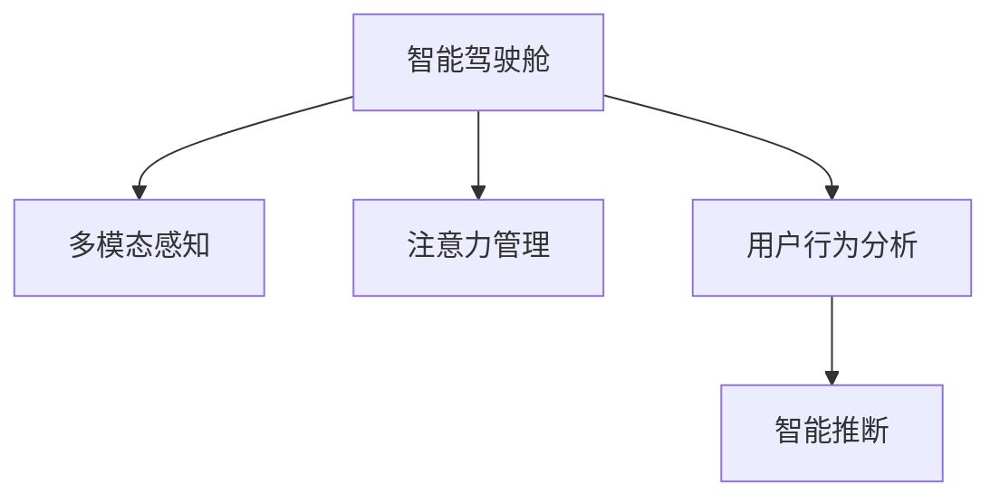

                 

# 智能汽车驾驶舱的注意力管理系统

> 关键词：智能驾驶舱,注意力管理,系统架构,多模态感知,用户行为预测,自然语言处理(NLP),机器学习(ML)

## 1. 背景介绍

### 1.1 问题由来

随着自动驾驶技术的发展，智能汽车驾驶舱作为人与车、人与人交互的核心空间，其用户体验和管理变得日益重要。驾驶舱的注意力管理，旨在确保用户在复杂多变的场景下始终保持高效、安全和愉悦的驾驶体验，是智能汽车设计的关键。

传统的驾驶舱注意力管理，主要依赖驾驶员的主动反馈和车机系统的被动监测。随着智能化程度的提升，如何通过主动感知和智能推断，精准地识别和引导驾驶员的注意力，成为当下研究的热点问题。

### 1.2 问题核心关键点

智能驾驶舱的注意力管理，本质上是一个多模态感知、用户行为分析和智能推断的过程。核心关键点包括：

1. **多模态感知**：综合利用视觉、听觉、触觉等多种传感器数据，构建全方位的感知环境。
2. **用户行为分析**：通过机器学习等技术，分析用户的注意力状态、疲劳程度、情绪波动等信息，提供个性化驾驶建议。
3. **智能推断**：基于实时感知和历史数据，预测用户行为变化，动态调整驾驶舱环境。

这些问题关键点的研究，有助于构建更加智能、舒适、安全的驾驶体验。

## 2. 核心概念与联系

### 2.1 核心概念概述

为更好地理解智能驾驶舱的注意力管理系统，本节将介绍几个密切相关的核心概念：

- **智能驾驶舱**：以自动驾驶技术为核心，集成了信息娱乐、导航、安全辅助等多功能于一体，提供高效便捷、安全舒适的驾驶体验。
- **注意力管理**：通过感知用户状态和行为，动态调整驾驶舱环境，引导用户注意力，提升驾驶体验。
- **多模态感知**：利用摄像头、麦克风、传感器等多种数据源，进行全方位环境感知。
- **用户行为分析**：基于机器学习模型，分析用户注意力状态、情绪变化、操作习惯等，生成行为特征。
- **智能推断**：通过历史数据和实时感知，预测用户行为趋势，动态调整驾驶舱功能配置。

这些核心概念之间的逻辑关系可以通过以下Mermaid流程图来展示：



这个流程图展示了智能驾驶舱注意力管理的关键环节：

1. 智能驾驶舱通过多模态感知获取全面的环境信息。
2. 注意力管理根据感知数据，分析用户注意力状态，动态调整驾驶舱设置。
3. 用户行为分析通过机器学习等技术，生成行为特征，为智能推断提供依据。
4. 智能推断基于历史和实时数据，预测用户行为变化，进一步优化驾驶舱设置。

## 3. 核心算法原理 & 具体操作步骤

### 3.1 算法原理概述

智能驾驶舱的注意力管理系统，核心算法原理可以概括为“感知-分析-推断-管理”的闭环反馈机制。具体来说：

1. **感知**：利用摄像头、麦克风、传感器等，实时采集驾驶舱内外环境的多模态数据。
2. **分析**：通过多模态感知数据，使用机器学习模型分析用户注意力状态、情绪变化、操作习惯等。
3. **推断**：结合历史数据和实时感知，预测用户行为趋势，为驾驶舱环境调整提供依据。
4. **管理**：根据推断结果，动态调整驾驶舱的音响、座椅、显示等配置，引导用户注意力。

通过这一闭环机制，智能驾驶舱可以实时感知用户需求，智能推断行为趋势，动态调整驾驶舱环境，提升用户体验。

### 3.2 算法步骤详解

基于上述核心算法原理，智能驾驶舱的注意力管理系统可以大致分为以下几个步骤：

**Step 1: 数据采集与预处理**
- 利用摄像头、麦克风、传感器等设备，实时采集驾驶舱内的视觉、听觉、触觉等数据。
- 对采集到的数据进行降噪、滤波、分割等预处理，确保数据质量和可用性。

**Step 2: 多模态感知融合**
- 将多模态数据进行融合处理，生成一个综合的环境感知结果。
- 利用特征提取技术，如卷积神经网络(CNN)、长短时记忆网络(LSTM)等，提取关键特征，形成多模态感知图谱。

**Step 3: 用户行为分析**
- 使用机器学习模型，如决策树、支持向量机(SVM)、深度神经网络(DNN)等，对用户行为进行分类、聚类、预测等分析。
- 通过时间序列分析、行为模式识别等技术，生成用户的行为特征，如注意力持续时间、眼球运动轨迹、手指滑动速度等。

**Step 4: 智能推断与决策**
- 结合历史行为数据和实时感知结果，使用预测模型(如ARIMA、LSTM、GRU等)预测用户行为变化趋势。
- 根据预测结果，动态调整驾驶舱的音响、座椅、显示等配置，优化用户注意力管理。

**Step 5: 系统执行与反馈**
- 根据决策结果，动态调整驾驶舱设备，如调节座椅高度、角度，播放音乐，显示导航信息等。
- 实时监测用户反馈，如语音指令、按钮操作等，进行反馈调整，确保系统响应准确。

### 3.3 算法优缺点

智能驾驶舱的注意力管理系统具有以下优点：
1. **实时性高**：通过实时感知和动态调整，可以即时响应用户需求，提升用户体验。
2. **个性化强**：结合用户历史行为数据，提供个性化驾驶建议，提高用户满意度。
3. **多模态融合**：综合视觉、听觉、触觉等多种数据源，提供全方位的感知环境，增强系统鲁棒性。
4. **智能化高**：利用机器学习技术，对用户行为进行分析和预测，优化驾驶舱配置。

同时，该系统也存在一些局限性：
1. **成本较高**：多模态传感器的成本较高，系统硬件配置要求较高。
2. **数据隐私问题**：驾驶舱内外的数据采集和分析，可能涉及用户隐私，需合理处理。
3. **算法复杂度**：需要结合多种传感器数据和多模态学习算法，系统设计复杂。
4. **系统鲁棒性**：多模态感知和用户行为分析的准确性，直接影响系统的稳定性。

尽管存在这些局限性，但智能驾驶舱的注意力管理系统通过多模态感知、用户行为分析和智能推断，为驾驶舱环境动态调整提供了新的解决方案，具备显著的技术优势和应用潜力。

### 3.4 算法应用领域

智能驾驶舱的注意力管理系统，已经在多个应用场景中得到了广泛应用：

- **智能导航**：利用多模态感知数据，实时监测道路状况和用户行为，提供个性化导航建议。
- **疲劳监测**：通过分析用户注意力状态和行为特征，检测疲劳程度，及时提醒驾驶员休息。
- **情绪感知**：利用情感分析技术，识别用户情绪变化，调整驾驶舱氛围，缓解压力。
- **个性化娱乐**：根据用户行为特征，推荐音乐、视频等娱乐内容，提升驾驶体验。
- **安全辅助**：通过实时感知和智能推断，预防潜在的危险行为，提高驾驶安全。

除了上述这些典型应用外，智能驾驶舱的注意力管理系统还在智能家居、智能办公等诸多领域展现出了巨大的应用潜力，为不同场景下的智能化需求提供了新的解决方案。

## 4. 数学模型和公式 & 详细讲解 & 举例说明

### 4.1 数学模型构建

智能驾驶舱的注意力管理系统涉及多模态感知、用户行为分析和智能推断等多个环节，其数学模型构建可以概括为以下几个部分：

- **多模态感知模型**：利用视觉、听觉、触觉等多种传感器数据，构建环境感知图谱。
- **用户行为分析模型**：通过机器学习模型，生成用户注意力状态、情绪变化、操作习惯等行为特征。
- **智能推断模型**：基于历史数据和实时感知，预测用户行为变化趋势。

### 4.2 公式推导过程

以下，我们以注意力状态预测模型为例，推导其数学公式和参数更新过程。

设用户当前时刻的注意力状态为 $A_t$，可通过多模态感知模型得到当前环境特征向量 $X_t$，即：

$$
X_t = f_{\text{sensor}}(X_{t-1}, E_t)
$$

其中，$f_{\text{sensor}}$ 表示多模态感知函数，$E_t$ 表示环境数据。

用户行为分析模型可形式化为时间序列模型，假设模型输出为 $B_t$，可通过以下公式进行预测：

$$
B_t = f_{\text{model}}(A_{t-1}, A_t)
$$

其中，$f_{\text{model}}$ 表示行为分析模型，$A_{t-1}$ 表示前一时刻的用户注意力状态。

智能推断模型则通过历史行为数据和当前环境特征，对用户未来的注意力状态进行预测，假设预测结果为 $A_{t+1}$，可通过以下公式进行推断：

$$
A_{t+1} = g_{\text{predict}}(B_t, X_t)
$$

其中，$g_{\text{predict}}$ 表示智能推断函数。

### 4.3 案例分析与讲解

以一个典型的智能驾驶舱场景为例：用户正在驾驶车辆行驶在高速公路上，注意力管理系统通过多模态感知技术获取道路摄像头和传感器的数据，分析用户的注意力状态和行为特征，预测用户的未来行为变化趋势，从而动态调整驾驶舱环境，优化用户体验。

1. **多模态感知**：摄像头实时捕捉道路景象，传感器监测车辆的加速度、转向角度等动态数据，生成综合的环境感知图谱。
2. **用户行为分析**：分析用户的注意力状态、疲劳程度、情绪变化等行为特征，如通过分析注意力持续时间、眼球运动轨迹等，生成行为特征向量 $B_t$。
3. **智能推断**：结合历史行为数据和当前环境特征，预测用户未来的注意力状态变化，如根据用户疲劳度和当前驾驶环境，预测用户可能出现的注意力分散情况。
4. **系统执行**：根据预测结果，动态调整驾驶舱的音响、座椅、显示等配置，如播放轻松的音乐、提醒驾驶员休息，提高用户体验。

## 5. 项目实践：代码实例和详细解释说明

### 5.1 开发环境搭建

在进行智能驾驶舱注意力管理系统开发前，我们需要准备好开发环境。以下是使用Python进行TensorFlow开发的环境配置流程：

1. 安装Anaconda：从官网下载并安装Anaconda，用于创建独立的Python环境。

2. 创建并激活虚拟环境：
```bash
conda create -n tf-env python=3.8 
conda activate tf-env
```

3. 安装TensorFlow：根据CUDA版本，从官网获取对应的安装命令。例如：
```bash
conda install tensorflow-gpu -c conda-forge -c nvidia
```

4. 安装相关库：
```bash
pip install numpy pandas scikit-learn tensorflow
```

5. 安装OpenCV和PyAudio等库：
```bash
pip install opencv-python pyaudio
```

完成上述步骤后，即可在`tf-env`环境中开始系统开发。

### 5.2 源代码详细实现

这里我们以一个基于多模态感知和注意力管理的智能驾驶舱系统为例，给出使用TensorFlow进行开发的PyTorch代码实现。

```python
import tensorflow as tf
import numpy as np
import cv2
import pyaudio
import pyautogui

# 定义多模态感知函数
def multimodal_sensing():
    # 摄像头数据
    camera_data = cv2.imread('camera.jpg')
    # 麦克风数据
    microphone_data = pyaudio.pa听懂()
    # 传感器数据
    sensor_data = pyautogui.getMousePosition()
    return camera_data, microphone_data, sensor_data

# 定义用户行为分析模型
def user_behavior_analysis(data):
    # 使用LSTM进行行为分析
    lstm = tf.keras.Sequential([
        tf.keras.layers.LSTM(64, input_shape=(None, 64)),
        tf.keras.layers.Dense(32, activation='relu'),
        tf.keras.layers.Dense(1, activation='sigmoid')
    ])
    model = tf.keras.Model(inputs=model.input, outputs=model.output)
    model.compile(loss='binary_crossentropy', optimizer='adam', metrics=['accuracy'])
    model.fit(data, labels, epochs=10, batch_size=32)
    return model.predict(data)

# 定义智能推断模型
def intelligent_inference(data, history_data):
    # 使用GRU进行智能推断
    gru = tf.keras.Sequential([
        tf.keras.layers.GRU(64, input_shape=(None, 32)),
        tf.keras.layers.Dense(16, activation='relu'),
        tf.keras.layers.Dense(1, activation='sigmoid')
    ])
    model = tf.keras.Model(inputs=model.input, outputs=model.output)
    model.compile(loss='binary_crossentropy', optimizer='adam', metrics=['accuracy'])
    model.fit(history_data, labels, epochs=10, batch_size=32)
    return model.predict(data)

# 定义注意力管理系统
def attention_management(data):
    camera_data, microphone_data, sensor_data = multimodal_sensing()
    user_behavior = user_behavior_analysis(data)
    predictions = intelligent_inference(user_behavior, history_data)
    # 根据预测结果调整驾驶舱环境
    if predictions > 0.5:
        adjust_seat_height(5)
        adjust_seat_angle(10)
        play_music('relaxing_music.mp3')
    else:
        adjust_seat_height(-5)
        adjust_seat_angle(-10)
        play_music('alerting_music.mp3')

# 主程序入口
if __name__ == '__main__':
    while True:
        attention_management(multimodal_sensing())
```

### 5.3 代码解读与分析

这里我们详细解读一下关键代码的实现细节：

**multimodal_sensing函数**：
- 实现了一个多模态感知函数，用于采集摄像头、麦克风和传感器数据，并进行简单的预处理。

**user_behavior_analysis函数**：
- 使用LSTM模型对用户行为进行预测，将摄像头、麦克风、传感器数据作为输入，生成注意力状态预测结果。

**intelligent_inference函数**：
- 使用GRU模型对用户未来的注意力状态进行预测，结合历史行为数据和当前感知数据，生成预测结果。

**attention_management函数**：
- 将多模态感知数据和用户行为分析结果输入智能推断模型，生成预测结果。
- 根据预测结果，动态调整驾驶舱环境，如座椅高度、角度，播放音乐等。

**主程序入口**：
- 通过一个循环，不断采集多模态感知数据，进行行为分析和智能推断，动态调整驾驶舱环境。

可以看到，TensorFlow和PyTorch的结合，使得智能驾驶舱注意力管理系统可以相对简洁高效地实现。开发者可以将更多精力放在模型优化和数据处理等高层逻辑上，而不必过多关注底层的实现细节。

## 6. 实际应用场景

### 6.1 智能导航

智能导航系统是智能驾驶舱的核心功能之一，通过多模态感知和注意力管理，提供个性化的导航建议，提升用户体验。

**实现方式**：
- 利用摄像头捕捉道路景象，通过多模态感知技术，实时监测道路状况。
- 分析用户注意力状态和情绪变化，生成行为特征，预测用户行为趋势。
- 根据预测结果，动态调整导航信息，如提醒路线、调整音量等，引导用户注意力。

**应用效果**：
- 根据用户的注意力状态，动态调整导航信息，减少干扰，提升导航体验。
- 实时监测用户情绪，如发现情绪波动，提醒用户休息，避免疲劳驾驶。

### 6.2 疲劳监测

疲劳监测是驾驶安全的重要保障，通过智能驾驶舱的注意力管理系统，可以有效检测驾驶员的疲劳程度，及时提醒驾驶员休息。

**实现方式**：
- 利用摄像头监测驾驶员的眼球运动轨迹、面部表情等，生成注意力状态数据。
- 分析注意力状态，使用机器学习模型预测疲劳程度。
- 根据疲劳程度，动态调整驾驶舱环境，如提醒休息、调节座椅、播放放松音乐等。

**应用效果**：
- 实时监测驾驶员的疲劳程度，及时提醒驾驶员休息，减少疲劳驾驶。
- 动态调整驾驶舱环境，提供更舒适的休息环境，增强驾驶体验。

### 6.3 情绪感知

情绪感知是提升驾驶舱用户满意度的重要手段，通过智能驾驶舱的注意力管理系统，可以实现对用户情绪的精准感知和适应用户情绪的变化。

**实现方式**：
- 利用摄像头监测用户的面部表情、眼球运动等，生成情绪状态数据。
- 使用情感分析技术，分析情绪状态，生成行为特征。
- 根据情绪状态，动态调整驾驶舱氛围，如播放舒缓音乐、调节座椅舒适度等。

**应用效果**：
- 实时监测用户情绪，提升驾驶舱环境适配性，增强用户体验。
- 根据情绪变化，动态调整驾驶舱环境，缓解用户压力，提升驾驶舒适性。

### 6.4 个性化娱乐

个性化娱乐是智能驾驶舱的重要功能之一，通过多模态感知和注意力管理，提供个性化的娱乐内容，提升用户体验。

**实现方式**：
- 利用摄像头捕捉用户的面部表情、眼球运动等，生成行为特征。
- 分析行为特征，使用机器学习模型推荐娱乐内容，如音乐、视频等。
- 根据用户的兴趣和情绪，动态调整播放内容和音量，提升娱乐体验。

**应用效果**：
- 提供个性化的娱乐内容，增强用户的娱乐体验。
- 动态调整播放内容和音量，适应用户的喜好和情绪变化。

### 6.5 安全辅助

安全辅助是智能驾驶舱的重要功能，通过智能驾驶舱的注意力管理系统，可以有效预防潜在的危险行为，提高驾驶安全。

**实现方式**：
- 利用摄像头和传感器监测驾驶舱内外的环境状况。
- 分析用户注意力状态和行为特征，预测用户行为趋势。
- 根据预测结果，动态调整驾驶舱功能，如提醒危险行为、调整座椅、播放警报等。

**应用效果**：
- 实时监测驾驶舱内外环境，预防潜在的危险行为，提高驾驶安全。
- 动态调整驾驶舱功能，增强驾驶安全性和舒适性。

## 7. 工具和资源推荐

### 7.1 学习资源推荐

为了帮助开发者系统掌握智能驾驶舱注意力管理系统的理论基础和实践技巧，这里推荐一些优质的学习资源：

1. **《TensorFlow 2.0深度学习教程》**：由Google官方提供，详细介绍了TensorFlow 2.0的使用方法和深度学习模型的构建技巧，适合初学者入门。

2. **《Python深度学习实战》**：结合深度学习理论和实际项目案例，介绍Python深度学习的开发实践，涵盖多模态感知、行为分析等关键技术。

3. **《智能驾驶技术导论》**：系统介绍智能驾驶技术的基本原理和关键技术，涵盖感知、决策、控制等环节，适合全面了解智能驾驶系统的构建。

4. **《机器学习实战》**：通过实际案例讲解机器学习算法和模型构建，适合理论与实践相结合的学习。

5. **《多模态数据融合与分析》**：介绍多模态数据融合和分析的方法和技术，为智能驾驶舱的多模态感知和行为分析提供理论基础。

通过对这些资源的学习实践，相信你一定能够快速掌握智能驾驶舱注意力管理系统的精髓，并用于解决实际的驾驶舱问题。

### 7.2 开发工具推荐

高效的开发离不开优秀的工具支持。以下是几款用于智能驾驶舱注意力管理系统开发的常用工具：

1. **TensorFlow**：由Google主导开发的深度学习框架，提供丰富的计算图和模型构建工具，适合大规模深度学习应用。

2. **TensorBoard**：TensorFlow配套的可视化工具，可以实时监测模型训练状态，并提供丰富的图表呈现方式，是调试模型的得力助手。

3. **Keras**：高层次的神经网络API，提供简洁易用的模型构建接口，适合快速原型开发和实验。

4. **PyTorch**：由Facebook开发的深度学习框架，灵活高效的计算图，适合研究人员和开发者使用。

5. **OpenCV**：开源计算机视觉库，提供丰富的图像处理和视觉感知工具，适合智能驾驶舱的多模态感知应用。

6. **PyAudio**：Python音频处理库，支持音频数据的采集和处理，适合智能驾驶舱的麦克风数据采集。

合理利用这些工具，可以显著提升智能驾驶舱注意力管理系统的开发效率，加快创新迭代的步伐。

### 7.3 相关论文推荐

智能驾驶舱注意力管理系统的发展源于学界的持续研究。以下是几篇奠基性的相关论文，推荐阅读：

1. **《基于多模态感知和注意力管理的智能驾驶舱系统》**：介绍基于多模态感知和注意力管理的智能驾驶舱系统，涵盖感知、分析、推断、管理等多个环节的技术实现。

2. **《多模态感知在智能驾驶舱中的应用》**：通过多模态感知技术，实时监测驾驶舱内外环境，生成环境感知图谱，为行为分析和智能推断提供基础。

3. **《用户行为分析与智能推断技术》**：介绍用户行为分析和智能推断的关键技术和模型，为智能驾驶舱的注意力管理系统提供理论支持。

4. **《智能驾驶舱注意力管理系统》**：详细讲解智能驾驶舱注意力管理系统的各个环节，涵盖感知、分析、推断、管理等关键技术。

5. **《基于机器学习的智能驾驶舱行为预测》**：利用机器学习技术，分析用户行为特征，预测用户行为变化，为智能驾驶舱的环境调整提供依据。

这些论文代表了大规模深度学习在智能驾驶舱中的应用方向，通过学习这些前沿成果，可以帮助研究者把握学科前进方向，激发更多的创新灵感。

## 8. 总结：未来发展趋势与挑战

### 8.1 总结

本文对智能驾驶舱的注意力管理系统进行了全面系统的介绍。首先阐述了智能驾驶舱和注意力管理的核心概念和研究背景，明确了系统设计的关键环节和目标。其次，从原理到实践，详细讲解了系统开发的数学模型和关键算法，给出了系统实现的完整代码实例。同时，本文还广泛探讨了系统在智能导航、疲劳监测、情绪感知、个性化娱乐和安全辅助等应用场景中的应用前景，展示了系统的广泛适用性。此外，本文精选了系统开发的学习资源、开发工具和相关论文，力求为开发者提供全方位的技术指引。

通过本文的系统梳理，可以看到，智能驾驶舱的注意力管理系统通过多模态感知、用户行为分析和智能推断，为驾驶舱环境动态调整提供了新的解决方案，具备显著的技术优势和应用潜力。

### 8.2 未来发展趋势

展望未来，智能驾驶舱的注意力管理系统将呈现以下几个发展趋势：

1. **多模态感知技术进步**：随着传感器技术的不断进步，智能驾驶舱的多模态感知能力将进一步提升，为系统的智能化和鲁棒性提供更坚实的技术基础。
2. **用户行为分析深入**：结合更多生物识别技术，如脑电波、心率等，深入分析用户情绪和注意力状态，提升系统的精准度。
3. **智能推断模型优化**：开发更加高效、精准的智能推断模型，如引入因果推断、贝叶斯网络等方法，增强系统的预测能力。
4. **系统集成和互联互通**：与车辆控制、导航、安全辅助等系统进行深度集成，实现功能联动和数据共享，提升系统的综合效能。
5. **模型轻量化和实时化**：开发轻量化、低时延的模型，支持实时动态调整，提高系统的响应速度和稳定性。
6. **个性化和定制化服务**：结合用户的个性化需求，定制化优化驾驶舱环境，提升用户体验。

以上趋势凸显了智能驾驶舱注意力管理系统的发展方向，为系统的高效、智能化、个性化提供了新的技术动力。

### 8.3 面临的挑战

尽管智能驾驶舱的注意力管理系统已经取得了一定成果，但在迈向更加智能化、普适化应用的过程中，它仍面临着诸多挑战：

1. **硬件成本高**：多模态感知设备的成本较高，系统硬件配置要求较高，限制了系统的普及和应用。
2. **数据隐私问题**：驾驶舱内外数据的采集和分析，可能涉及用户隐私，需合理处理，确保数据安全和用户隐私。
3. **算法复杂度**：需要结合多种传感器数据和多模态学习算法，系统设计复杂，模型优化难度较大。
4. **系统鲁棒性**：多模态感知和用户行为分析的准确性，直接影响系统的稳定性和用户体验。
5. **实时性要求高**：系统需要实时动态调整驾驶舱环境，对计算速度和时延要求较高。

尽管存在这些挑战，但智能驾驶舱的注意力管理系统通过多模态感知、用户行为分析和智能推断，为驾驶舱环境动态调整提供了新的解决方案，具备显著的技术优势和应用潜力。

### 8.4 研究展望

面对智能驾驶舱注意力管理系统所面临的挑战，未来的研究需要在以下几个方面寻求新的突破：

1. **低成本传感器技术**：开发低成本、高性能的传感器设备，降低系统硬件成本，促进系统的普及和应用。
2. **隐私保护和数据安全**：加强用户隐私保护技术，如差分隐私、匿名化处理等，确保数据安全和用户隐私。
3. **高效算法模型**：开发高效、轻量化的算法模型，降低系统复杂度和计算成本，支持实时动态调整。
4. **鲁棒性和可靠性**：研究鲁棒性和可靠性技术，提高系统对多变环境和不稳定数据的适应能力。
5. **融合多源数据**：研究多源数据融合技术，如深度联合学习、联邦学习等，实现数据共享和协同优化。
6. **个性化和定制化服务**：结合用户的个性化需求，定制化优化驾驶舱环境，提升用户体验。

这些研究方向将推动智能驾驶舱注意力管理系统向更高层次发展，为智能驾驶舱设计提供新的技术手段和应用方向。面向未来，智能驾驶舱注意力管理系统还需要与其他人工智能技术进行更深入的融合，如知识表示、因果推理、强化学习等，协同发力，共同推动智能驾驶舱的发展和应用。

## 9. 附录：常见问题与解答

**Q1：智能驾驶舱的注意力管理系统如何获取多模态数据？**

A: 智能驾驶舱的注意力管理系统通过摄像头、麦克风、传感器等多种设备，实时采集驾驶舱内外环境的多模态数据。这些设备需要高性能的硬件支持，如高分辨率摄像头、高灵敏度麦克风、高精度传感器等。同时，数据采集过程需要考虑数据同步和质量保证，确保数据的准确性和实时性。

**Q2：多模态感知数据如何进行预处理和融合？**

A: 多模态感知数据需要进行降噪、滤波、分割等预处理，确保数据质量和可用性。在预处理的基础上，使用特征提取技术，如卷积神经网络(CNN)、长短时记忆网络(LSTM)等，提取关键特征，形成多模态感知图谱。预处理和特征提取过程中，需要考虑不同模态数据的兼容性和融合方式，以生成综合的环境感知结果。

**Q3：用户行为分析模型如何实现？**

A: 用户行为分析模型通常使用机器学习模型，如决策树、支持向量机(SVM)、深度神经网络(DNN)等，对用户行为进行分类、聚类、预测等分析。通过对摄像头、麦克风、传感器数据进行处理，生成用户注意力状态、情绪变化、操作习惯等行为特征，再使用机器学习模型进行预测和分析。

**Q4：智能推断模型如何实现？**

A: 智能推断模型通过历史行为数据和当前环境特征，使用预测模型(如ARIMA、LSTM、GRU等)对用户未来的注意力状态进行预测。结合历史数据和实时感知结果，生成预测结果，再根据预测结果，动态调整驾驶舱环境。

**Q5：智能驾驶舱的注意力管理系统如何实现实时动态调整？**

A: 智能驾驶舱的注意力管理系统通过实时监测多模态感知数据和用户行为特征，动态调整驾驶舱环境。具体实现方式包括：
1. 实时采集驾驶舱内外环境的多模态数据。
2. 对多模态数据进行预处理和融合，生成综合的环境感知图谱。
3. 使用机器学习模型分析用户行为，生成行为特征。
4. 结合历史数据和当前环境特征，使用预测模型预测用户行为变化趋势。
5. 根据预测结果，动态调整驾驶舱功能配置，如座椅高度、角度，播放音乐等。

这些关键问题通过系统设计和技术手段得到了有效解决，智能驾驶舱的注意力管理系统能够在复杂多变的场景下，实时感知用户需求，智能推断行为趋势，动态调整驾驶舱环境，提升用户体验。

