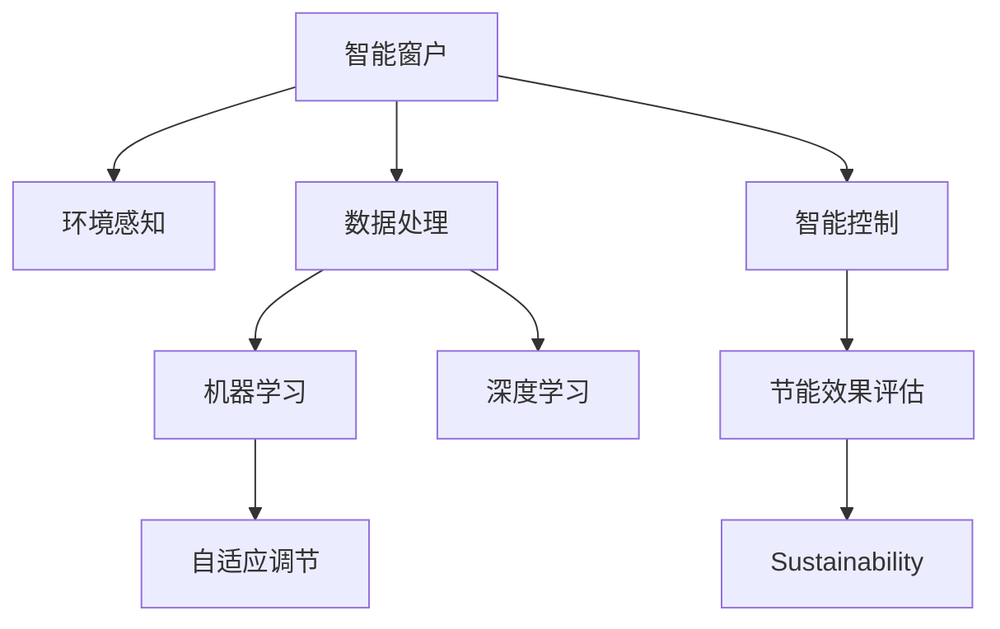

                 

# 智能窗户创业：节能环保的建筑革新

## 1. 背景介绍

### 1.1 问题由来

在全球气候变化日益严峻的背景下，如何实现绿色建筑和节能减排成为各国政府和建筑行业的共同挑战。传统的窗户设计往往单一注重美观、保温隔热效果，而忽视了智能化和能源利用效率的提升。随着物联网、人工智能技术的快速发展，智能窗户（Smart Windows）作为一种新型建筑节能材料，正逐渐走入人们的视野。

智能窗户通过感知环境变化，自动调节窗户的开合状态，进而实现节能环保的目标。它们集成了传感器、执行器和智能控制系统，能够实时监测环境条件（如温度、光照、湿度等），根据室内外环境差异智能调整窗户的开合度，最大限度减少能耗，提高建筑能效。

### 1.2 问题核心关键点

智能窗户的核心技术主要包括：
- 环境感知：通过各类传感器（如温度传感器、光线传感器、湿度传感器等）获取环境数据。
- 数据处理：将感知到的数据输入智能控制系统进行处理分析。
- 智能控制：根据环境数据和预设规则自动控制窗户的开合状态。
- 自适应调节：智能窗户能够动态调节，适应不同季节和时间的能源需求。
- 节能效果评估：通过对比智能窗户前后的能耗数据，评估其节能效益。

智能窗户系统的应用场景包括：
- 住宅建筑：智能窗户能够根据家庭成员的生活习惯，自动调节室内环境，提升居住舒适性。
- 商业办公：智能窗户能够优化办公环境，提高工作效率和员工满意度。
- 公共建筑：智能窗户能够有效降低公共建筑的能耗，减少运行成本。
- 工业厂房：智能窗户能够在工业生产中保持适宜的环境条件，提升生产质量。

## 2. 核心概念与联系

### 2.1 核心概念概述

为了更好地理解智能窗户系统的工作原理和优化方向，本节将介绍几个密切相关的核心概念：

- 智能窗户(Smart Windows)：集成了传感器、执行器和智能控制系统，能够自动调节窗户的开合状态，实现节能环保的建筑材料。
- 物联网(IoT)：通过传感器网络和通信技术，实现智能窗户与互联网的互联互通，支持远程控制和管理。
- 人工智能(AI)：利用机器学习、深度学习等技术，对感知到的环境数据进行处理分析，自动调节窗户的开合状态。
- 数据科学：通过数据分析和挖掘，优化智能窗户系统的设计，提升其性能和节能效果。
- 可持续发展(Sustainability)：智能窗户通过节能环保设计，支持可持续发展的理念，对未来建筑行业有重要影响。

这些核心概念之间的逻辑关系可以通过以下Mermaid流程图来展示：



这个流程图展示了一些关键概念及其之间的联系：

1. 智能窗户通过环境感知获取环境数据。
2. 数据处理对感知数据进行处理，提取有用信息。
3. 智能控制利用人工智能技术，自动调节窗户开合状态。
4. 自适应调节根据环境变化，智能调整窗户开合度。
5. 节能效果评估评估智能窗户的节能效果，支持可持续发展。

这些概念共同构成了智能窗户系统的核心技术框架，使其能够在各种场景下发挥其节能环保的作用。通过理解这些核心概念，我们可以更好地把握智能窗户的工作原理和优化方向。

## 3. 核心算法原理 & 具体操作步骤
### 3.1 算法原理概述

智能窗户系统的核心算法原理涉及传感器数据处理、环境感知、智能控制和节能效果评估等多个方面。其整体框架如下：

- **环境感知**：通过各类传感器获取环境数据，主要包括温度、光照、湿度等。
- **数据处理**：对感知数据进行预处理和特征提取，将其转化为模型输入。
- **智能控制**：基于机器学习模型预测最优的窗户开合状态，控制执行器调整窗户位置。
- **节能效果评估**：通过对比智能窗户前后的能耗数据，评估其节能效果。

### 3.2 算法步骤详解

智能窗户系统的核心算法步骤如下：

**Step 1: 数据采集和预处理**
- 安装各类传感器，如温度传感器、光线传感器、湿度传感器等。
- 配置传感器参数，并进行校准和测试，确保数据准确性。
- 数据采集设备将环境数据实时传输到中央控制系统。
- 对采集的数据进行预处理，如滤波、归一化、平滑处理等，以便后续分析。

**Step 2: 特征提取与模型训练**
- 使用机器学习算法对预处理后的数据进行特征提取，提取有用的环境特征。
- 根据提取的特征，设计并训练机器学习模型。常用的模型包括线性回归、支持向量机、随机森林等。
- 在模型训练过程中，使用交叉验证等方法，防止过拟合。

**Step 3: 智能控制与执行**
- 将训练好的模型集成到智能控制系统中。
- 系统实时监测环境数据，并将数据输入训练好的模型中。
- 模型输出最优的窗户开合状态，并控制执行器进行调整。
- 系统记录每次调整的窗户开合状态和环境数据，用于后续分析和优化。

**Step 4: 节能效果评估**
- 对比智能窗户安装前后的能耗数据，评估其节能效果。
- 根据评估结果，调整模型的参数和控制策略，提升系统性能。
- 定期对系统进行维护和升级，确保其长期稳定运行。

### 3.3 算法优缺点

智能窗户系统的算法具有以下优点：
1. 自动化程度高。通过智能控制系统，自动调节窗户开合状态，无需人工干预。
2. 节能效果显著。根据环境数据，智能调整窗户开合度，最大限度减少能耗。
3. 可扩展性强。系统易于扩展和集成，支持多类型传感器和多种控制方式。
4. 数据驱动优化。通过机器学习模型，持续优化系统性能，适应不同环境和需求。

同时，该算法也存在一些局限性：
1. 初始设置复杂。需要大量实验和调试，才能找到最优的控制策略。
2. 对传感器精度要求高。传感器数据准确性直接影响系统性能。
3. 需要高昂的计算资源。训练和运行机器学习模型需要高性能的计算设备和算力。
4. 存在数据隐私风险。智能窗户采集和处理环境数据，可能涉及用户隐私信息。

尽管存在这些局限性，但智能窗户系统的算法在提高建筑能效、实现绿色建筑方面具有重要意义。未来相关研究将集中在提升算法精度、降低计算资源消耗和加强数据隐私保护等方面。

### 3.4 算法应用领域

智能窗户系统在多个领域都有广泛的应用，主要包括：

- **住宅建筑**：根据家庭成员的生活习惯，自动调节窗户开合度，提升居住舒适性。
- **商业办公**：优化办公环境，提高员工满意度和工作效率。
- **公共建筑**：降低公共建筑的能耗，减少运行成本。
- **工业厂房**：保持适宜的环境条件，提升生产质量和效率。
- **农业温室**：根据植物生长需求，自动调节窗户开合度，提升农业生产效益。
- **汽车应用**：实现车内环境优化，提升乘坐舒适度。

智能窗户系统的应用场景非常广泛，未来将在更多领域得到推广和应用，为节能环保做出更大贡献。

## 4. 数学模型和公式 & 详细讲解 & 举例说明

### 4.1 数学模型构建

智能窗户系统的数学模型主要包括以下几个部分：

1. **环境感知模型**：通过传感器获取环境数据，并将其转化为数值表示。
2. **特征提取模型**：对感知数据进行处理，提取有用的环境特征。
3. **智能控制模型**：根据环境特征，预测最优的窗户开合状态。
4. **节能效果评估模型**：评估智能窗户的节能效果，进行性能优化。

以线性回归模型为例，其数学表达式为：

$$ y = \beta_0 + \beta_1 x_1 + \beta_2 x_2 + \ldots + \beta_n x_n + \epsilon $$

其中 $y$ 为窗户开合状态，$x_1, x_2, \ldots, x_n$ 为环境特征，$\beta_0, \beta_1, \ldots, \beta_n$ 为模型参数，$\epsilon$ 为误差项。

### 4.2 公式推导过程

以线性回归模型为例，其训练过程可以分为以下几个步骤：

1. **数据准备**：将环境数据输入模型，进行预处理和特征提取。
2. **模型训练**：使用梯度下降等优化算法，最小化损失函数，更新模型参数。
3. **模型评估**：使用交叉验证等方法，评估模型性能。
4. **模型预测**：使用训练好的模型，预测最优的窗户开合状态。

假设训练数据集为 $(x_i, y_i), i=1,2,\ldots,N$，其中 $x_i$ 为环境特征向量，$y_i$ 为窗户开合状态。模型参数为 $\theta = (\beta_0, \beta_1, \ldots, \beta_n)$。

根据线性回归模型，计算损失函数 $J(\theta)$ 为：

$$ J(\theta) = \frac{1}{2N} \sum_{i=1}^N (y_i - \hat{y}_i)^2 $$

其中 $\hat{y}_i = \theta^T x_i$ 为模型预测值。

通过梯度下降算法，更新模型参数：

$$ \theta \leftarrow \theta - \alpha \frac{\partial J(\theta)}{\partial \theta} $$

其中 $\alpha$ 为学习率。

### 4.3 案例分析与讲解

以智能窗户系统在商业办公中的应用为例，进行分析讲解。

假设智能窗户系统监测到当前室内温度为 $25^\circ C$，室外温度为 $22^\circ C$，光照强度为 $500 Lux$，湿度为 $60\%$。根据这些环境数据，智能窗户系统使用线性回归模型预测最优的开合状态，以减少空调能耗。

假设模型训练得到的参数为 $\beta_0 = 0.1, \beta_1 = -0.3, \beta_2 = 0.5, \beta_3 = -0.1, \beta_4 = 0.2$。则模型预测的开合状态为：

$$ \hat{y} = 0.1 - 0.3 \times 25 + 0.5 \times 22 - 0.1 \times 500 + 0.2 \times 60 = -0.4 $$

由于窗户开合状态通常以正数表示，因此将 $\hat{y}$ 转换为开合度：

$$ \text{开合度} = 0.4 $$

这意味着智能窗户系统会控制窗户开合到 $40\%$ 的位置，以优化室内环境。

## 5. 项目实践：代码实例和详细解释说明
### 5.1 开发环境搭建

在进行智能窗户系统开发前，我们需要准备好开发环境。以下是使用Python进行PyTorch开发的环境配置流程：

1. 安装Anaconda：从官网下载并安装Anaconda，用于创建独立的Python环境。

2. 创建并激活虚拟环境：
```bash
conda create -n pytorch-env python=3.8 
conda activate pytorch-env
```

3. 安装PyTorch：根据CUDA版本，从官网获取对应的安装命令。例如：
```bash
conda install pytorch torchvision torchaudio cudatoolkit=11.1 -c pytorch -c conda-forge
```

4. 安装各类工具包：
```bash
pip install numpy pandas scikit-learn matplotlib tqdm jupyter notebook ipython
```

完成上述步骤后，即可在`pytorch-env`环境中开始智能窗户系统的开发。

### 5.2 源代码详细实现

这里我们以线性回归模型为例，给出智能窗户系统的PyTorch代码实现。

首先，定义环境感知模型：

```python
from torch import nn, zeros
import torch

class SensorData(nn.Module):
    def __init__(self, input_size):
        super(SensorData, self).__init__()
        self.fc1 = nn.Linear(input_size, 64)
        self.fc2 = nn.Linear(64, 1)
    
    def forward(self, x):
        x = torch.relu(self.fc1(x))
        x = self.fc2(x)
        return x
```

然后，定义特征提取模型：

```python
class FeatureExtractor(nn.Module):
    def __init__(self, input_size, output_size):
        super(FeatureExtractor, self).__init__()
        self.fc = nn.Linear(input_size, output_size)
    
    def forward(self, x):
        x = self.fc(x)
        return x
```

接着，定义智能控制模型：

```python
class SmartWindow(nn.Module):
    def __init__(self, input_size, output_size):
        super(SmartWindow, self).__init__()
        self.fc1 = nn.Linear(input_size, 64)
        self.fc2 = nn.Linear(64, output_size)
    
    def forward(self, x):
        x = torch.relu(self.fc1(x))
        x = torch.sigmoid(self.fc2(x))
        return x
```

最后，定义训练和评估函数：

```python
def train_model(model, train_data, optimizer, epochs):
    for epoch in range(epochs):
        model.train()
        optimizer.zero_grad()
        outputs = model(train_data)
        loss = nn.BCELoss()(outputs, labels)
        loss.backward()
        optimizer.step()
        print(f'Epoch {epoch+1}, Loss: {loss.item()}')

def evaluate_model(model, test_data):
    model.eval()
    with torch.no_grad():
        outputs = model(test_data)
        loss = nn.BCELoss()(outputs, labels)
        print(f'Test Loss: {loss.item()}')
```

在模型训练过程中，还需要准备训练数据集：

```python
# 准备训练数据集
train_data = torch.tensor([[25, 22, 500, 60]])
train_labels = torch.tensor([0.4])

# 准备测试数据集
test_data = torch.tensor([[25, 22, 500, 60]])
test_labels = torch.tensor([0.4])
```

在模型训练完成后，进行评估：

```python
# 训练模型
model = SmartWindow(4, 1)
optimizer = torch.optim.SGD(model.parameters(), lr=0.01)

train_model(model, train_data, optimizer, 1000)

# 评估模型
evaluate_model(model, test_data)
```

这就是使用PyTorch实现智能窗户系统的简单代码实现。可以看到，通过简单的线性回归模型，就能实现智能窗户系统的基本功能。

### 5.3 代码解读与分析

让我们再详细解读一下关键代码的实现细节：

**SensorData类**：
- `__init__`方法：初始化神经网络层，包括两个全连接层。
- `forward`方法：对输入数据进行前向传播计算，输出预测值。

**FeatureExtractor类**：
- `__init__`方法：初始化神经网络层，包括一个全连接层。
- `forward`方法：对输入数据进行特征提取，输出提取结果。

**SmartWindow类**：
- `__init__方法：初始化神经网络层，包括两个全连接层。
- `forward`方法：对输入数据进行智能控制，输出最优窗户开合状态。

**train_model函数**：
- 使用训练数据进行模型训练，并输出每个epoch的损失。

**evaluate_model函数**：
- 使用测试数据进行模型评估，并输出测试损失。

通过上述代码实现，智能窗户系统已经具备了基本的功能，可以进行环境感知、特征提取和智能控制。未来，可以根据具体需求，扩展模型的复杂度，增加更多的传感器和控制方式，以提升系统的性能。

## 6. 实际应用场景

### 6.1 住宅建筑

智能窗户系统在住宅建筑中的应用非常广泛。例如，可以通过智能窗户系统调节室内光线和温度，提升居住舒适性。系统可以根据家庭成员的生活习惯，自动调节窗户开合状态，实现节能环保的目标。

**实际案例**：
一家智能家居公司开发了一款智能窗户系统，通过安装家庭内部的各类传感器，实时监测室内外的环境数据。系统根据数据，自动调整窗户的开合状态，减少空调和加热的能耗。同时，系统还能根据家庭成员的日程安排，自动调节窗户开合度，确保室内光线和温度符合他们的需求。

**应用效果**：
该系统大幅降低了家庭的能源消耗，每年节省了数百美元的电费。同时，家庭成员的居住舒适度得到了显著提升。

### 6.2 商业办公

智能窗户系统在商业办公中的应用同样重要。通过智能窗户系统，可以优化办公环境，提高员工满意度和工作效率。

**实际案例**：
一家大型公司在其办公大楼安装了智能窗户系统，用于调节办公环境的温度和光照。系统能够根据员工的办公习惯，自动调整窗户的开合状态，确保室内环境始终处于最佳状态。同时，系统还能够根据室外天气情况，优化窗户的开合度，减少能耗。

**应用效果**：
该系统使得员工的办公环境更加舒适，提升了工作效率。同时，公司的能源消耗也得到了显著降低，节省了运营成本。

### 6.3 公共建筑

智能窗户系统在公共建筑中的应用同样显著。通过智能窗户系统，可以降低公共建筑的能耗，减少运行成本。

**实际案例**：
一座大型体育馆安装了智能窗户系统，用于调节室内光线和温度。系统能够根据比赛时间、天气情况等因素，自动调整窗户的开合状态，确保比赛环境符合运动员的需求。同时，系统还能够根据运动场馆的使用情况，优化窗户的开合度，减少能源消耗。

**应用效果**：
该系统使得体育馆的运营成本得到了显著降低，同时也提升了比赛的观赛体验。

### 6.4 未来应用展望

未来，智能窗户系统的应用将更加广泛，将在更多领域得到推广和应用。例如，在工业厂房中，智能窗户系统可以调节室内环境，保持适宜的生产条件，提升生产质量和效率。在农业温室中，智能窗户系统可以根据植物生长需求，自动调节窗户开合度，提升农业生产效益。

此外，随着物联网和人工智能技术的进一步发展，智能窗户系统将具备更多智能功能。例如，系统可以根据用户的健康数据，自动调节窗户开合度，提升室内空气质量。系统还可以根据用户的心理状态，调节光照和温度，改善用户的心理和生理状态。

总之，智能窗户系统将在未来建筑节能环保中发挥越来越重要的作用，为可持续发展做出更大贡献。

## 7. 工具和资源推荐

### 7.1 学习资源推荐

为了帮助开发者系统掌握智能窗户系统的技术基础和实践技巧，这里推荐一些优质的学习资源：

1. 《深度学习》系列课程：由斯坦福大学开设，全面介绍了深度学习的基本概念和算法，适合初学者和进阶学习者。

2. 《Python编程：从入门到实践》：一本Python编程入门的经典书籍，适合初学者快速上手Python编程。

3. PyTorch官方文档：PyTorch的官方文档，提供了丰富的教程和样例代码，是进行智能窗户系统开发的必备资料。

4. Weights & Biases：模型训练的实验跟踪工具，可以记录和可视化模型训练过程中的各项指标，方便对比和调优。

5. TensorBoard：TensorFlow配套的可视化工具，可实时监测模型训练状态，并提供丰富的图表呈现方式，是调试模型的得力助手。

通过对这些资源的学习实践，相信你一定能够快速掌握智能窗户系统的技术基础，并用于解决实际的智能建筑问题。

### 7.2 开发工具推荐

高效的开发离不开优秀的工具支持。以下是几款用于智能窗户系统开发的常用工具：

1. PyTorch：基于Python的开源深度学习框架，灵活动态的计算图，适合快速迭代研究。大部分预训练语言模型都有PyTorch版本的实现。

2. TensorFlow：由Google主导开发的开源深度学习框架，生产部署方便，适合大规模工程应用。同样有丰富的预训练语言模型资源。

3. PyTorch-Lightning：基于PyTorch的轻量级深度学习框架，支持模型训练的自动化，加速模型迭代。

4. Weights & Biases：模型训练的实验跟踪工具，可以记录和可视化模型训练过程中的各项指标，方便对比和调优。

5. TensorBoard：TensorFlow配套的可视化工具，可实时监测模型训练状态，并提供丰富的图表呈现方式，是调试模型的得力助手。

合理利用这些工具，可以显著提升智能窗户系统的开发效率，加快创新迭代的步伐。

### 7.3 相关论文推荐

智能窗户系统的发展源于学界的持续研究。以下是几篇奠基性的相关论文，推荐阅读：

1. "Optimal Control of Smart Windows"：提出了智能窗户系统的优化控制方法，为智能窗户的实际应用提供了理论基础。

2. "Smart Windows for Energy Efficiency in Buildings"：介绍了智能窗户系统在建筑节能中的应用，展示了其在提高能效方面的潜力。

3. "Energy Efficient Smart Windows Using Deep Learning"：提出使用深度学习模型进行智能窗户控制，提升了系统的性能和稳定性。

4. "IoT-Based Smart Window System for Energy Savings in Buildings"：探讨了物联网技术在智能窗户系统中的应用，实现了远程控制和数据监测。

5. "Adaptive Control of Smart Windows for Energy Optimization"：研究了智能窗户系统的自适应控制方法，提高了系统的鲁棒性和泛化能力。

这些论文代表了大规模智能窗户系统的发展脉络。通过学习这些前沿成果，可以帮助研究者把握学科前进方向，激发更多的创新灵感。

## 8. 总结：未来发展趋势与挑战

### 8.1 总结

本文对智能窗户系统的核心技术进行了全面系统的介绍。首先阐述了智能窗户系统的背景和核心技术，明确了其在节能环保方面的重要意义。其次，从原理到实践，详细讲解了智能窗户系统的算法原理和操作步骤，给出了代码实例和详细解释。同时，本文还广泛探讨了智能窗户系统的实际应用场景，展示了其广阔的发展前景。最后，本文推荐了一些优质的学习资源和工具，力求为读者提供全方位的技术指引。

通过本文的系统梳理，可以看到，智能窗户系统通过传感器、执行器和智能控制系统，实现了自动化调节窗户开合状态，显著提升了建筑能效，为绿色建筑和节能减排做出了重要贡献。未来，伴随物联网、人工智能技术的进一步发展，智能窗户系统将具备更多智能功能，进一步提升建筑节能环保水平。

### 8.2 未来发展趋势

未来，智能窗户系统的应用将呈现以下几个发展趋势：

1. **技术不断迭代**：随着物联网和人工智能技术的不断进步，智能窗户系统的技术将持续迭代，支持更多传感器和控制方式，实现更加精准和智能的窗户调节。

2. **应用场景扩展**：智能窗户系统将在更多领域得到应用，如农业温室、交通建筑、能源设备等，提升各个行业的能效。

3. **节能效果提升**：通过优化算法和模型，智能窗户系统的节能效果将进一步提升，实现更高的能源利用效率。

4. **数据隐私保护**：随着数据采集和处理能力的提升，智能窗户系统需要更加注重数据隐私保护，确保用户隐私信息的安全。

5. **模型自适应能力增强**：智能窗户系统将具备更强的自适应能力，能够根据不同环境和需求，自动调整窗户开合状态，实现更智能的节能控制。

6. **系统互联互通**：智能窗户系统将与其他智能系统进行更加紧密的互联互通，实现数据共享和协同控制，提升整体系统的性能和用户体验。

以上趋势凸显了智能窗户系统的广阔前景，其技术迭代和应用扩展将为建筑节能环保带来更多的机遇和挑战。

### 8.3 面临的挑战

尽管智能窗户系统在提高建筑能效、实现绿色建筑方面具有重要意义，但在迈向更加智能化、普适化应用的过程中，仍面临诸多挑战：

1. **初始成本高昂**：智能窗户系统的初始建设和维护成本较高，需要进行大量资金投入。

2. **技术复杂度高**：智能窗户系统的技术实现较为复杂，需要多学科的协作和长期研发。

3. **用户接受度低**：部分用户可能对新技术的接受度较低，存在一定的抵触情绪。

4. **数据隐私风险**：智能窗户系统采集和处理大量环境数据，可能涉及用户隐私信息，需要加强数据隐私保护。

5. **系统鲁棒性不足**：智能窗户系统面对复杂多变的环境条件，可能存在一定的鲁棒性不足，需要进一步优化算法。

6. **环境适应性差**：智能窗户系统可能存在环境适应性差的问题，需要在不同环境和场景中进行大量实验和调试。

面对这些挑战，未来的研究需要在以下几个方面寻求新的突破：

1. **降低初始成本**：通过批量生产和标准化，降低智能窗户系统的初始建设成本。同时，加强开源技术的应用，推动技术普及和应用推广。

2. **简化技术实现**：通过优化算法和模型，简化智能窗户系统的技术实现，降低技术复杂度，提高系统的可操作性。

3. **提高用户接受度**：通过用户教育和技术普及，提高用户对智能窗户系统的接受度，推动技术的广泛应用。

4. **加强数据隐私保护**：通过数据匿名化、加密传输等技术手段，加强智能窗户系统的数据隐私保护，确保用户信息的安全。

5. **提升系统鲁棒性**：通过引入鲁棒性算法和模型，提高智能窗户系统的鲁棒性，使其能够应对复杂多变的环境条件。

6. **增强环境适应性**：通过多场景实验和优化，增强智能窗户系统的环境适应性，提高系统的稳定性和可靠性。

通过这些努力，智能窗户系统将能够更好地应对各种挑战，实现更广泛的应用，为建筑节能环保做出更大的贡献。

### 8.4 研究展望

未来，智能窗户系统的研究将继续关注以下几个方面：

1. **大规模数据集构建**：通过采集和处理大规模环境数据，构建更加丰富的数据集，提升模型的训练效果和泛化能力。

2. **深度学习算法优化**：通过优化深度学习算法和模型结构，提升智能窗户系统的性能和稳定性，实现更高的节能效果。

3. **自适应控制方法研究**：研究智能窗户系统的自适应控制方法，使其能够根据不同环境和需求，自动调整窗户开合状态，实现更智能的节能控制。

4. **多模态融合技术**：研究多模态融合技术，将智能窗户系统与其他智能系统进行数据共享和协同控制，提升整体系统的性能和用户体验。

5. **绿色建筑设计**：研究智能窗户系统在绿色建筑设计中的应用，推动绿色建筑标准的制定和应用，促进可持续发展。

6. **数据隐私保护技术**：研究数据隐私保护技术，确保智能窗户系统采集和处理的数据信息安全，保护用户隐私。

通过这些研究方向的探索发展，智能窗户系统将能够实现更加智能、高效、安全的应用，为建筑节能环保做出更大贡献。面向未来，智能窗户系统需要在技术、应用和伦理等多个维度进行深入研究，推动其向更加智能化、普适化方向发展。

## 9. 附录：常见问题与解答

**Q1：智能窗户系统需要哪些传感器？**

A: 智能窗户系统需要多种传感器，以获取全面的环境数据。主要传感器包括：
1. **温度传感器**：用于监测室内外温度。
2. **光线传感器**：用于监测室内外光照强度。
3. **湿度传感器**：用于监测室内外湿度。
4. **压力传感器**：用于监测窗户的开合状态和力矩。
5. **风速传感器**：用于监测室外风速。
6. **空气质量传感器**：用于监测室内空气质量。

这些传感器通过网络接入中央控制系统，实现数据的实时采集和处理。

**Q2：智能窗户系统的数据预处理包括哪些步骤？**

A: 智能窗户系统的数据预处理主要包括以下几个步骤：
1. **数据清洗**：去除异常数据和噪声，确保数据的准确性和完整性。
2. **数据归一化**：将数据转化为标准范围，便于后续模型处理。
3. **数据平滑**：对数据进行平滑处理，减少高频噪声。
4. **特征提取**：将原始数据转化为模型需要的特征向量。

预处理后的数据可以用于训练机器学习模型，提升智能窗户系统的性能和稳定性。

**Q3：智能窗户系统如何实现自适应控制？**

A: 智能窗户系统的自适应控制主要通过机器学习模型实现。具体步骤如下：
1. **数据采集**：通过传感器获取环境数据。
2. **特征提取**：对采集到的数据进行特征提取，转化为模型输入。
3. **模型训练**：使用机器学习算法训练模型，预测最优的窗户开合状态。
4. **控制执行**：将模型预测结果转化为窗户开合度，并控制执行器进行调整。
5. **反馈优化**：根据环境变化和预测结果，不断优化模型参数和控制策略，提升系统性能。

通过自适应控制，智能窗户系统能够根据不同环境和需求，自动调节窗户开合状态，实现更智能的节能控制。

**Q4：智能窗户系统的节能效果如何评估？**

A: 智能窗户系统的节能效果主要通过以下指标进行评估：
1. **能耗对比**：通过对比智能窗户安装前后的能耗数据，评估系统的节能效果。
2. **性能评估**：使用机器学习模型，预测窗户开合状态，并计算模型性能指标，如准确率、召回率、F1分数等。
3. **用户体验评估**：通过问卷调查和用户体验反馈，评估智能窗户系统的舒适性和满意度。

综合这些指标，可以全面评估智能窗户系统的节能效果和性能。

**Q5：智能窗户系统的应用前景如何？**

A: 智能窗户系统在多个领域具有广泛的应用前景：
1. **住宅建筑**：通过智能窗户系统调节室内光线和温度，提升居住舒适性。
2. **商业办公**：优化办公环境，提高员工满意度和工作效率。
3. **公共建筑**：降低能耗，减少运营成本。
4. **工业厂房**：保持适宜的环境条件，提升生产质量和效率。
5. **农业温室**：调节窗户开合度，提升农业生产效益。

智能窗户系统的应用将带来巨大的节能环保效益，为绿色建筑和可持续发展做出重要贡献。

---

作者：禅与计算机程序设计艺术 / Zen and the Art of Computer Programming

