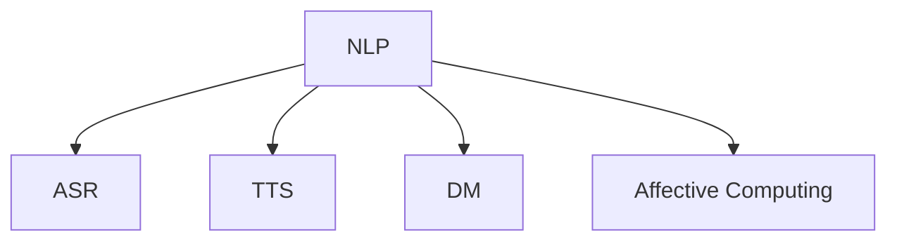

                 

## 1. 背景介绍

在数字时代，计算机用户界面（CUI）正逐渐从传统的键盘、鼠标交互方式，向更自然、更智能的语音和自然语言交互方式转变。这一趋势不仅改变了用户与计算机的交互方式，更带来了新的技术挑战和机遇。本文将深入探讨未来CUI在数字产品中的详细应用趋势，结合实际案例分析，为开发者和行业从业人员提供全面、深刻的视角。

### 1.1 数字产品的用户交互演进

过去几十年间，数字产品的用户界面经历了显著的演变，从早期的图形用户界面（GUI）到移动互联网时代的触摸屏幕交互，再到今天的CUI，这种变化反映了技术进步与用户需求的双重驱动。CUI通过自然语言处理（NLP）和语音识别（ASR）技术，使用户能够通过语言和声音与计算机进行交互，极大地提升了用户体验和互动效率。

### 1.2 CUI的重要性

CUI的重要性和潜力在于其能提供更加自然、人性化的交互方式。无论是语音助手、聊天机器人、智能音箱，还是未来的全息对话系统，CUI都在以新的方式连接人类与机器，开拓了交互的无限可能。在面向未来的产品设计中，CUI将扮演核心角色，推动技术创新和用户体验的革新。

## 2. 核心概念与联系

### 2.1 核心概念概述

为更好地理解CUI的未来趋势，本节将介绍几个关键概念：

- **自然语言处理（NLP）**：研究如何使计算机理解、解释和生成人类语言，是CUI的基础技术之一。
- **语音识别（ASR）**：将语音信号转化为文本，是CUI实现语音交互的关键技术。
- **语音合成（TTS）**：将文本转化为语音，用于语音交互系统的输出。
- **对话管理（DM）**：负责管理对话流程，确保对话系统能够连贯、正确地响应用户。
- **情感计算（Affective Computing）**：研究如何通过NLP和机器学习识别用户的情感状态，提高交互的情感共鸣。

这些概念之间的逻辑关系可以通过以下Mermaid流程图来展示：



这个流程图展示了几项核心技术的联系：

1. **NLP** 通过理解用户输入的文本，为 **ASR** 提供输入文本，同时与 **DM** 配合，管理对话流程。
2. **TTS** 用于语音输出，将 **NLP** 处理后的文本转化为语音，提高用户的交互体验。
3. **情感计算** 可以增强 **NLP** 对用户情感的识别，进一步提升交互的自然性和情感共鸣。

### 2.2 核心算法原理

CUI的核心算法原理主要围绕着NLP和ASR技术展开。以下是几个核心原理的概述：

- **语言模型**：使用统计或神经网络模型预测给定单词序列的概率，是NLP的基础。
- **序列到序列（Seq2Seq）模型**：使用循环神经网络（RNN）或Transformer模型，将输入序列映射到输出序列，如机器翻译。
- **注意力机制（Attention）**：在Seq2Seq模型中，通过注意力机制，模型可以关注输入序列中的关键部分，提升翻译质量。
- **Transformer模型**：使用自注意力机制，大幅提高了NLP任务的性能，是当前最先进的NLP模型之一。

## 3. 核心算法原理 & 具体操作步骤

### 3.1 算法原理概述

CUI的核心算法原理主要涉及以下几个方面：

- **语言模型**：预测给定单词序列的概率。
- **序列到序列（Seq2Seq）模型**：将输入序列映射到输出序列，如机器翻译。
- **注意力机制（Attention）**：在Seq2Seq模型中，通过注意力机制，模型可以关注输入序列中的关键部分，提升翻译质量。
- **Transformer模型**：使用自注意力机制，大幅提高了NLP任务的性能。

### 3.2 算法步骤详解

CUI的算法步骤主要包括以下几个方面：

1. **文本预处理**：将用户输入的文本进行分词、词性标注等处理。
2. **语音识别（ASR）**：将语音信号转化为文本。
3. **NLP处理**：通过语言模型和Transformer模型，对输入文本进行处理和理解。
4. **对话管理（DM）**：根据上下文，生成合适的响应。
5. **语音合成（TTS）**：将响应文本转化为语音。
6. **反馈与优化**：根据用户反馈，不断优化对话系统。

### 3.3 算法优缺点

CUI算法的主要优点包括：

- **自然交互**：用户可以自然地与计算机交互，无需学习复杂的按键操作。
- **高效便捷**：提升了交互效率，特别是在需要多任务处理时。
- **普适性强**：适应各种残障用户，如视觉障碍者。

缺点则包括：

- **噪音敏感**：在嘈杂环境中，ASR的准确率可能下降。
- **技术复杂**：涉及到NLP、ASR等多个技术领域，开发和维护成本高。
- **隐私风险**：语音和文本数据可能存在隐私泄露的风险。

### 3.4 算法应用领域

CUI算法广泛应用于以下几个领域：

- **智能音箱**：如Amazon Echo、Google Home，通过语音助手实现自然交互。
- **智能家居**：通过语音控制家电设备，如智能电视、智能灯光。
- **客户服务**：如智能客服机器人，通过语音聊天处理客户咨询。
- **车载交互**：如车载语音助手，提供导航、娱乐等功能。
- **医疗健康**：如智能健康设备，通过语音与患者互动，记录健康数据。

## 4. 数学模型和公式 & 详细讲解

### 4.1 数学模型构建

CUI的核心数学模型主要包括NLP和ASR模型。

#### NLP模型

**语言模型**：使用softmax函数计算输入文本的概率分布。

$$
P(x_1, x_2, ..., x_n) = \frac{e^{s(x_1, x_2, ..., x_n)}}{Z}
$$

其中，$s(x_1, x_2, ..., x_n)$ 为模型对输入文本的打分，$Z$ 为归一化常数。

#### ASR模型

**CTC（Connectionist Temporal Classification）损失函数**：

$$
L = -\sum_{t=1}^T y_t \log \hat{y}_t
$$

其中，$y_t$ 为实际标签，$\hat{y}_t$ 为模型预测结果。

### 4.2 公式推导过程

#### NLP公式推导

**注意力机制**：

$$
\text{Attention}(Q, K, V) = \text{Softmax}(QK^T)V
$$

其中，$Q$ 为查询向量，$K$ 为键向量，$V$ 为值向量。

**Transformer模型**：

$$
\text{Transformer}(x, M) = \text{softmax}(\text{Attention}(Q, K, V))W
$$

其中，$M$ 为模型参数，$W$ 为权重矩阵。

#### ASR公式推导

**CTC损失函数推导**：

$$
L = -\sum_{t=1}^T y_t \log \hat{y}_t + \lambda\log \left(\frac{1}{Z}\right)
$$

其中，$\lambda$ 为正则化参数。

### 4.3 案例分析与讲解

以智能音箱为例，展示CUI的核心算法流程：

1. **文本预处理**：将用户语音信号转化为文本。
2. **语言模型**：对输入文本进行分词、词性标注。
3. **Transformer模型**：将文本转化为向量表示。
4. **对话管理**：根据上下文生成合适的响应。
5. **语音合成**：将响应文本转化为语音输出。

## 5. 项目实践：代码实例和详细解释说明

### 5.1 开发环境搭建

在开始CUI项目的开发之前，需要准备相应的开发环境。以下是Python开发环境搭建的步骤：

1. **安装Python和PyTorch**：
```
pip install torch torchvision torchaudio
```

2. **安装相关库**：
```
pip install transformers datasets transformers SpeechRecognition pydub
```

3. **搭建虚拟环境**：
```
python -m venv env
source env/bin/activate
```

### 5.2 源代码详细实现

以下是一个简单的NLP模型的Python代码实现：

```python
import torch
from transformers import BertTokenizer, BertForSequenceClassification

# 初始化模型和分词器
model = BertForSequenceClassification.from_pretrained('bert-base-uncased')
tokenizer = BertTokenizer.from_pretrained('bert-base-uncased')

# 定义文本预处理函数
def preprocess(text):
    inputs = tokenizer.encode(text, add_special_tokens=True)
    inputs = torch.tensor(inputs).unsqueeze(0)
    return inputs

# 定义模型预测函数
def predict(inputs):
    outputs = model(inputs)
    logits = outputs.logits
    probs = torch.softmax(logits, dim=1)
    return probs[0]

# 测试代码
text = "今天天气怎么样"
inputs = preprocess(text)
probs = predict(inputs)
print(probs)
```

### 5.3 代码解读与分析

在上述代码中，我们使用了Bert模型进行文本分类任务。以下是代码的详细解读：

- **分词器初始化**：使用`BertTokenizer`初始化分词器，将输入文本转化为模型可以处理的向量形式。
- **模型初始化**：使用`BertForSequenceClassification`初始化模型，用于进行文本分类任务。
- **文本预处理**：通过`preprocess`函数，将输入文本转化为模型所需的输入格式。
- **模型预测**：通过`predict`函数，将预处理后的输入输入模型，获取模型预测的类别概率。

### 5.4 运行结果展示

运行上述代码后，将输出模型对输入文本的分类概率。例如，对于输入文本“今天天气怎么样”，模型可能会预测其为“晴天”的概率较高。

## 6. 实际应用场景

### 6.1 智能音箱

智能音箱通过CUI实现了语音助手的交互功能，用户可以通过语音指令控制音乐播放、查询天气、设置闹钟等。以下是智能音箱的主要应用场景：

- **音乐控制**：如播放、暂停、跳过、音量调节等。
- **日常查询**：如天气预报、新闻资讯、股票信息等。
- **家居控制**：如智能灯光、空调、窗帘等。

### 6.2 智能家居

智能家居通过CUI实现了语音控制家居设备的功能，用户可以通过语音指令控制灯光、电视、空调等。以下是智能家居的主要应用场景：

- **灯光控制**：如开灯、关灯、调节亮度等。
- **电视控制**：如播放、暂停、音量调节等。
- **空调控制**：如温度调节、开关机等。

### 6.3 客户服务

智能客服通过CUI实现了自然语言交互，用户可以通过语音或文本形式与客服机器人进行对话。以下是智能客服的主要应用场景：

- **常见问题解答**：如账户注册、订单查询、退换货等。
- **技术支持**：如软件安装、系统故障排查等。
- **个性化推荐**：如推荐产品、活动优惠等。

### 6.4 未来应用展望

未来，CUI将进一步融入各类数字产品中，推动技术创新和用户体验的革新。以下是几个未来应用展望：

- **全息对话系统**：通过AR/VR技术，实现3D全息对话，提升用户体验。
- **多模态交互**：结合视觉、触觉等多模态信息，实现更自然的交互方式。
- **情感识别**：通过情感计算技术，增强CUI的情感共鸣，提供更加人性化的服务。

## 7. 工具和资源推荐

### 7.1 学习资源推荐

为了帮助开发者系统掌握CUI技术，以下是几个推荐的学习资源：

- **Deep Learning with PyTorch**：一本介绍深度学习及PyTorch的书籍，涵盖了NLP和ASR技术。
- **CS224N: Natural Language Processing with Deep Learning**：斯坦福大学开设的NLP课程，涵盖NLP领域的核心技术和最新研究。
- **Transformers by Hugging Face**：Hugging Face官方的Transformer介绍，包含模型和代码实现。
- **SpeechRecognition by Julius Odutola**：介绍Python语音识别库的书籍，适合入门和实践。

### 7.2 开发工具推荐

以下是几个常用的CUI开发工具：

- **PyTorch**：深度学习框架，支持NLP和ASR任务开发。
- **SpeechRecognition**：Python语音识别库，支持多种语音识别引擎。
- **pydub**：音频处理库，用于处理音频文件和信号。
- **PyTorch Lightning**：简化PyTorch应用的库，提升模型开发效率。

### 7.3 相关论文推荐

以下是几篇关于CUI技术的重要论文，推荐阅读：

- **Attention is All You Need**：Transformer模型，开创了NLP预训练模型的先河。
- **Speech and Language Processing with Deep Learning**：介绍深度学习在语音和自然语言处理中的应用。
- **Towards Data-Efficient Representation Learning with Unsupervised Learning Methods**：探索无监督学习在CUI中的应用。

## 8. 总结：未来发展趋势与挑战

### 8.1 研究成果总结

CUI技术的发展，从早期的GUI到现在的智能语音交互，已经取得了显著的进展。未来，CUI将在更多的数字产品中得到广泛应用，提升用户体验和技术水平。

### 8.2 未来发展趋势

未来CUI的发展趋势包括以下几个方面：

- **个性化交互**：通过深度学习和情感计算，实现更加个性化的用户交互。
- **跨模态交互**：结合视觉、触觉等多模态信息，提升交互的自然性和丰富性。
- **情感共鸣**：通过情感计算技术，增强CUI的情感共鸣，提升用户体验。
- **多语言支持**：实现多语言支持，拓展CUI的应用范围。

### 8.3 面临的挑战

CUI技术在未来的发展中，仍面临以下挑战：

- **隐私保护**：语音和文本数据的隐私保护是CUI技术的重要挑战。
- **噪音鲁棒性**：在嘈杂环境中，CUI系统的准确性需要进一步提升。
- **跨领域应用**：CUI技术在不同领域的应用需要针对性的优化。

### 8.4 研究展望

未来，CUI技术需要重点关注以下几个方面：

- **隐私保护**：通过差分隐私、联邦学习等技术，保护用户隐私。
- **噪音鲁棒性**：引入语音增强技术，提升CUI系统在嘈杂环境中的准确性。
- **跨领域应用**：结合不同领域的特定需求，优化CUI系统。

## 9. 附录：常见问题与解答

**Q1: CUI在实际应用中面临哪些挑战？**

A: CUI在实际应用中面临以下挑战：

- **隐私保护**：语音和文本数据的隐私保护是CUI技术的重要挑战。
- **噪音鲁棒性**：在嘈杂环境中，CUI系统的准确性需要进一步提升。
- **跨领域应用**：CUI技术在不同领域的应用需要针对性的优化。

**Q2: 如何提升CUI系统的准确性？**

A: 提升CUI系统的准确性可以从以下几个方面入手：

- **数据增强**：通过回译、改写等方式扩充训练集，提升模型鲁棒性。
- **正则化**：使用L2正则、Dropout等技术，防止过拟合。
- **多任务学习**：结合多个任务进行训练，提高模型的泛化能力。
- **迁移学习**：将预训练模型应用于新任务，减少训练时间。

**Q3: 如何实现CUI系统的个性化交互？**

A: 实现CUI系统的个性化交互可以从以下几个方面入手：

- **深度学习**：使用深度学习模型，对用户行为和偏好进行建模。
- **情感计算**：通过情感计算技术，识别用户的情感状态，增强交互的情感共鸣。
- **推荐系统**：结合用户的历史行为和偏好，提供个性化的推荐服务。

**Q4: 如何保护CUI系统的隐私？**

A: 保护CUI系统的隐私可以从以下几个方面入手：

- **差分隐私**：使用差分隐私技术，保护用户数据的隐私。
- **联邦学习**：在分布式环境中，通过联邦学习保护用户隐私。
- **加密技术**：使用加密技术，保护用户数据的传输和存储安全。

通过不断优化和改进，CUI技术将为数字产品的交互带来更加自然、高效、个性化的体验，推动技术的创新和应用的发展。

---

作者：禅与计算机程序设计艺术 / Zen and the Art of Computer Programming

