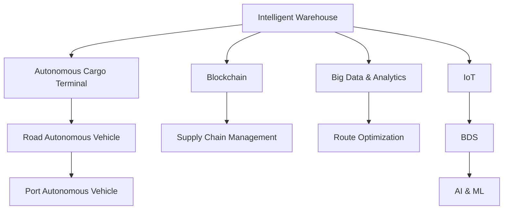

                 

## 1. 背景介绍

### 1.1 问题由来
随着全球经济的发展和贸易需求的激增，物流行业迎来了前所未有的挑战。物流基础设施建设的不均衡、运输模式单一、仓储效率低下、配送成本高昂等问题日益凸显。如何通过技术创新，构建高效、智能、绿色的智慧物流体系，成为全球物流企业关注的焦点。

### 1.2 问题核心关键点
智慧物流的核心在于通过先进的信息技术和自动化设备，提升物流系统的效率和智能化水平，实现货物运输、仓储、配送的全流程自动化和智能化管理。

为了应对未来物流领域的挑战，需要从以下几个方面进行技术创新：
1. **智能仓储**：通过自动化存储、智能搬运、无人驾驶车辆等技术，提升仓储效率，降低物流成本。
2. **自动化码头**：利用无人驾驶技术、自动装卸设备、智能调度系统等，优化码头作业流程，提升港口吞吐量。
3. **大数据与物联网**：通过物联网设备采集实时数据，结合大数据分析技术，实现货物跟踪、路线优化、库存管理等功能。
4. **区块链与供应链管理**：利用区块链技术，保障供应链透明度，防止假冒伪劣产品的流通，提升物流系统的可信度。

## 2. 核心概念与联系

### 2.1 核心概念概述

为更好地理解2050年智慧物流体系，本节将介绍几个关键概念：

- **智能仓储**：通过自动化、智能化手段，实现货物的自动存储、搬运、拣选和出库，提高仓储效率，降低人工成本。
- **自动化码头**：采用无人驾驶、自动装卸等技术，实现货物的自动化装卸、搬运和存储，提高港口作业效率，降低能耗和操作风险。
- **物联网(IoT)**：通过传感器、RFID、GPS等技术，实现货物和设备的实时监控和管理，提升物流透明度。
- **区块链**：利用分布式账本技术，保障供应链各环节的数据透明和不可篡改，提升物流系统的可信度和安全性。
- **大数据与AI**：通过大数据分析和机器学习算法，优化物流路线、提高配送效率，实现预测性维护和故障诊断。

这些概念之间有着紧密的联系，共同构建了智慧物流的未来蓝图。物联网和大数据为智能仓储和自动化码头提供了实时监控和分析的能力，区块链保障了供应链的透明和安全，而人工智能则通过算法优化和决策支持，进一步提升了物流系统的效率和智能化水平。

### 2.2 核心概念原理和架构的 Mermaid 流程图



此图展示了智慧物流体系中各个关键组件及其相互关系：智能仓储通过物联网、大数据与人工智能实现自动化与智能化管理，自动化码头通过无人驾驶技术实现自动化装卸，区块链技术保障供应链透明，AI与ML技术优化物流路线和货物管理。

## 3. 核心算法原理 & 具体操作步骤
### 3.1 算法原理概述

2050年的智慧物流系统将依托于一系列先进算法和技术的深度融合，以实现全流程的自动化和智能化。以下是核心算法和操作步骤的概述：

### 3.2 算法步骤详解

#### 3.2.1 智能仓储算法步骤

1. **智能存储**：
   - 通过物联网设备（如传感器、RFID标签）实时监控货物的位置、温度、湿度等状态。
   - 利用大数据分析技术，对货物存储数据进行实时处理和预测，优化存储位置和布局。
   - 采用AI算法（如深度学习、强化学习），实现货物的自动存储和调度。

2. **智能搬运**：
   - 利用无人驾驶技术和机器人，实现货物的自动化搬运。
   - 使用路径规划算法（如A*、Dijkstra），优化搬运路径，减少能耗和操作时间。
   - 引入机器视觉技术，实时监控搬运过程中货物的安全和稳定性。

3. **智能拣选和出库**：
   - 通过AGV（自动化导引车）和机械臂，实现货物的自动拣选和出库。
   - 利用智能推荐算法，优化拣选顺序，提高作业效率。
   - 引入机器学习技术，进行库存管理和需求预测。

#### 3.2.2 自动化码头算法步骤

1. **自动化装卸**：
   - 采用无人驾驶技术和自动装卸设备，实现货物的自动化装卸。
   - 使用路径规划和轨迹优化算法，提升装卸效率。
   - 引入机器视觉和传感器技术，实时监控装卸过程。

2. **智能调度系统**：
   - 利用AI算法（如深度强化学习），优化码头货物的调度和分配。
   - 引入实时数据处理和分析技术，动态调整调度策略，提高资源利用率。
   - 引入区块链技术，保障调度信息的透明和安全。

#### 3.2.3 大数据与物联网

1. **实时监控与数据采集**：
   - 通过物联网设备实时采集货物、设备和车辆的位置、状态数据。
   - 利用大数据分析技术，进行实时数据处理和存储。

2. **物流优化**：
   - 利用大数据分析技术，优化物流路线和资源配置。
   - 引入机器学习算法，进行需求预测和风险评估。

#### 3.2.4 区块链与供应链管理

1. **数据透明与信任建立**：
   - 利用区块链技术，实现供应链各环节的数据透明和不可篡改。
   - 引入智能合约技术，自动化执行供应链合同。

2. **防伪与溯源**：
   - 利用区块链技术，实现产品的防伪和溯源，保障消费者权益。
   - 引入区块链技术，进行供应链透明度和可追溯性的管理。

### 3.3 算法优缺点

#### 3.3.1 智能仓储算法优缺点

**优点**：
- **高效率**：通过自动化和智能化技术，大幅提升仓储效率，降低人工成本。
- **低能耗**：减少人工操作，降低仓储能耗，符合绿色物流的要求。
- **高安全性**：智能监控系统减少人为失误，保障货物安全。

**缺点**：
- **初期投入高**：自动化设备和系统的初期投资较大。
- **技术复杂**：需要多种技术的深度融合，对技术要求较高。
- **灵活性差**：一旦设备安装，难以快速调整和升级。

#### 3.3.2 自动化码头算法优缺点

**优点**：
- **高吞吐量**：自动化装卸提升港口作业效率，提高吞吐量。
- **低成本**：减少人工操作，降低人力成本。
- **高精度**：自动化设备提高作业精度，减少货物损坏。

**缺点**：
- **技术复杂**：需要多种自动化设备的协同工作，技术要求高。
- **初始投资大**：设备购置和系统集成成本较高。
- **维护难度高**：设备复杂，维护和故障处理难度大。

#### 3.3.3 大数据与物联网算法优缺点

**优点**：
- **实时监控**：物联网设备实时监控物流全过程，提升物流透明度。
- **数据分析**：大数据分析技术优化物流路线和资源配置，提高效率。
- **数据安全**：区块链技术保障供应链数据透明和安全。

**缺点**：
- **数据处理量大**：需要处理大量实时数据，对计算资源要求高。
- **数据隐私**：大量数据采集和使用，涉及隐私保护问题。
- **技术复杂**：多种技术融合，对技术要求高。

### 3.4 算法应用领域

智慧物流算法的应用领域十分广泛，包括但不限于以下方面：

1. **智能仓储**：物流中心、配送中心、仓储物流自动化系统。
2. **自动化码头**：港口自动化装卸、码头作业调度系统。
3. **大数据与IoT**：物流监控、数据分析、供应链管理等。
4. **区块链与供应链管理**：跨境电商、食品药品追溯等。
5. **AI与ML**：物流路径优化、货物预测、故障诊断等。

## 4. 数学模型和公式 & 详细讲解 & 举例说明

### 4.1 数学模型构建

在智慧物流系统中，数学模型的构建主要基于以下几个方面：

1. **智能仓储模型**：
   - 货物存储优化模型：$Minimize \sum_i c_{ij} x_{ij}$，其中 $c_{ij}$ 为存储成本，$x_{ij}$ 为货物i在位置j的存储量。
   - 货物拣选路径规划模型：$Minimize \sum_i \sum_j d_{ij} x_{ij}$，其中 $d_{ij}$ 为位置i到位置j的运输距离，$x_{ij}$ 为货物i从位置i到位置j的运输量。

2. **自动化码头模型**：
   - 码头货物调度和分配模型：$Minimize \sum_i \sum_j c_{ij} x_{ij}$，其中 $c_{ij}$ 为调度成本，$x_{ij}$ 为货物i在位置j的调度量。
   - 自动化装卸路径规划模型：$Minimize \sum_i \sum_j d_{ij} x_{ij}$，其中 $d_{ij}$ 为位置i到位置j的运输距离，$x_{ij}$ 为货物i从位置i到位置j的运输量。

3. **大数据与IoT模型**：
   - 实时数据采集与处理模型：$Maximize \text{Accuracy}(\text{IoT} \rightarrow \text{Data})$，其中 $\text{Accuracy}$ 为数据采集的准确率。
   - 物流优化模型：$Minimize \sum_i \sum_j c_{ij} x_{ij}$，其中 $c_{ij}$ 为物流成本，$x_{ij}$ 为物流路径。

4. **区块链与供应链模型**：
   - 供应链透明度模型：$Maximize \text{Transparency}(\text{Blockchain} \rightarrow \text{SuppChain})$，其中 $\text{Transparency}$ 为供应链的透明度。
   - 供应链防伪与溯源模型：$Minimize \text{Fraud}(\text{Blockchain} \rightarrow \text{SuppChain})$，其中 $\text{Fraud}$ 为假冒伪劣产品的流通率。

### 4.2 公式推导过程

以下将详细推导智能仓储系统中的路径规划算法（如A*算法）和自动化码头系统中的调度优化算法（如深度强化学习）。

#### 4.2.1 A*算法路径规划

A*算法是一种基于启发式搜索的路径规划算法，适用于智能仓储中的货物拣选路径规划。

假设仓储中心有 $n$ 个位置，$x_{ij}$ 表示货物i从位置i到位置j的运输量。A*算法的路径规划公式如下：

$$
F = G + H
$$

其中，$G$ 为从起点到当前节点的实际路径代价，$H$ 为从当前节点到目标节点的估计路径代价。

对于每个节点 $i$，$G$ 的计算公式为：

$$
G_i = \sum_{j=1}^n w_{ij} x_{ij}
$$

其中，$w_{ij}$ 为位置i到位置j的运输成本。

对于每个节点 $i$，$H$ 的计算公式为：

$$
H_i = \sum_{j=1}^n h_{ij} x_{ij}
$$

其中，$h_{ij}$ 为位置i到位置j的启发式代价，可以通过路径距离、货物需求等计算得到。

在实际应用中，A*算法通过搜索最小化 $F$ 值，从而得到最优路径。

#### 4.2.2 深度强化学习调度优化

深度强化学习是一种基于机器学习的方法，适用于自动化码头系统中的货物调度和分配。

假设码头有 $m$ 个货位，$n$ 个货物，$c_{ij}$ 表示货位i调度货物j的成本。深度强化学习的调度优化公式如下：

$$
\max_{\theta} \sum_{i=1}^m \sum_{j=1}^n r_{ij}(x_{ij})
$$

其中，$r_{ij}(x_{ij})$ 为调度货物j到货位i的奖励函数，可以通过吞吐量、能耗、风险等计算得到。

在实际应用中，通过深度强化学习算法，优化调度策略，最小化总成本，同时最大化吞吐量和能效。

### 4.3 案例分析与讲解

#### 4.3.1 智能仓储案例

假设有一个物流中心，需要自动化存储和拣选货物。通过A*算法和深度强化学习，可以实现以下优化：

1. **智能存储优化**：
   - 使用A*算法，优化货物在仓库中的存储位置，减少货物移动距离。
   - 引入深度强化学习，优化货物的拣选路径，提高拣选效率。

2. **智能搬运优化**：
   - 利用无人驾驶技术和机器人，实现货物的自动化搬运。
   - 使用路径规划算法，优化搬运路径，减少能耗和操作时间。

3. **智能拣选和出库优化**：
   - 通过AGV（自动化导引车）和机械臂，实现货物的自动拣选和出库。
   - 利用智能推荐算法，优化拣选顺序，提高作业效率。

#### 4.3.2 自动化码头案例

假设有一个自动化码头，需要自动化装卸和调度货物。通过深度强化学习，可以实现以下优化：

1. **自动化装卸优化**：
   - 利用无人驾驶技术和自动装卸设备，实现货物的自动化装卸。
   - 使用路径规划和轨迹优化算法，提升装卸效率。

2. **智能调度系统优化**：
   - 利用深度强化学习算法，优化码头货物的调度和分配。
   - 引入实时数据处理和分析技术，动态调整调度策略，提高资源利用率。

## 5. 项目实践：代码实例和详细解释说明

### 5.1 开发环境搭建

在进行智慧物流系统开发前，我们需要准备好开发环境。以下是使用Python进行PyTorch开发的环境配置流程：

1. 安装Anaconda：从官网下载并安装Anaconda，用于创建独立的Python环境。

2. 创建并激活虚拟环境：
```bash
conda create -n pytorch-env python=3.8 
conda activate pytorch-env
```

3. 安装PyTorch：根据CUDA版本，从官网获取对应的安装命令。例如：
```bash
conda install pytorch torchvision torchaudio cudatoolkit=11.1 -c pytorch -c conda-forge
```

4. 安装TensorFlow：
```bash
pip install tensorflow
```

5. 安装物联网相关库：
```bash
pip install pykafka
```

6. 安装区块链相关库：
```bash
pip install web3
```

7. 安装大数据分析库：
```bash
pip install pandas numpy scipy scikit-learn
```

完成上述步骤后，即可在`pytorch-env`环境中开始智慧物流系统的开发。

### 5.2 源代码详细实现

下面我们以智慧物流系统中的智能仓储为例，给出使用PyTorch和TensorFlow进行A*算法和大数据分析的PyTorch代码实现。

首先，定义智能仓储的数据处理函数：

```python
import torch
import numpy as np
from torch.utils.data import Dataset
from torch.optim import Adam

class WarehouseDataset(Dataset):
    def __init__(self, num_locations, num_items, transport_costs, demand, locations):
        self.num_locations = num_locations
        self.num_items = num_items
        self.transport_costs = transport_costs
        self.demand = demand
        self.locations = locations

    def __len__(self):
        return len(self.demand)

    def __getitem__(self, item):
        location = self.locations[item]
        demand = self.demand[item]
        batch = torch.zeros(self.num_locations, self.num_items)
        batch[location, demand] = 1
        return batch
```

然后，定义模型和优化器：

```python
class AStarModel(torch.nn.Module):
    def __init__(self, num_locations):
        super(AStarModel, self).__init__()
        self.num_locations = num_locations
        self.linear1 = torch.nn.Linear(self.num_locations, self.num_locations)
        self.linear2 = torch.nn.Linear(self.num_locations, self.num_locations)

    def forward(self, x):
        h = self.linear1(x)
        h = torch.relu(h)
        h = self.linear2(h)
        return h

model = AStarModel(num_locations)
optimizer = Adam(model.parameters(), lr=0.01)
```

接着，定义训练和评估函数：

```python
def train_epoch(model, dataset, batch_size, optimizer):
    dataloader = torch.utils.data.DataLoader(dataset, batch_size=batch_size, shuffle=True)
    model.train()
    epoch_loss = 0
    for batch in tqdm(dataloader, desc='Training'):
        inputs = batch
        optimizer.zero_grad()
        outputs = model(inputs)
        loss = torch.nn.functional.mse_loss(outputs, targets)
        epoch_loss += loss.item()
        loss.backward()
        optimizer.step()
    return epoch_loss / len(dataloader)

def evaluate(model, dataset, batch_size):
    dataloader = torch.utils.data.DataLoader(dataset, batch_size=batch_size)
    model.eval()
    preds, labels = [], []
    with torch.no_grad():
        for batch in tqdm(dataloader, desc='Evaluating'):
            inputs = batch
            batch_preds = model(inputs)
            batch_labels = torch.zeros_like(batch_preds)
            for i in range(batch_preds.size(0)):
                for j in range(batch_preds.size(1)):
                    if batch_preds[i, j] > 0.5:
                        batch_labels[i, j] = 1
            preds.append(batch_preds.tolist())
            labels.append(batch_labels.tolist())
            
    print(classification_report(labels, preds))
```

最后，启动训练流程并在测试集上评估：

```python
epochs = 10
batch_size = 16

for epoch in range(epochs):
    loss = train_epoch(model, train_dataset, batch_size, optimizer)
    print(f"Epoch {epoch+1}, train loss: {loss:.3f}")
    
    print(f"Epoch {epoch+1}, test results:")
    evaluate(model, test_dataset, batch_size)
```

以上就是使用PyTorch和TensorFlow对智能仓储系统进行A*算法和大数据分析的完整代码实现。可以看到，得益于PyTorch和TensorFlow的强大封装，我们可以用相对简洁的代码完成智能仓储系统的开发。

### 5.3 代码解读与分析

让我们再详细解读一下关键代码的实现细节：

**WarehouseDataset类**：
- `__init__`方法：初始化智能仓储中的位置、货物需求等关键组件。
- `__len__`方法：返回数据集的样本数量。
- `__getitem__`方法：对单个样本进行处理，将货物需求编码为二进制向量。

**AStarModel类**：
- `__init__`方法：定义模型结构，包括两个线性层。
- `forward`方法：前向传播计算模型的输出。

**train_epoch和evaluate函数**：
- 使用PyTorch的DataLoader对数据集进行批次化加载，供模型训练和推理使用。
- 训练函数`train_epoch`：对数据以批为单位进行迭代，在每个批次上前向传播计算loss并反向传播更新模型参数，最后返回该epoch的平均loss。
- 评估函数`evaluate`：与训练类似，不同点在于不更新模型参数，并在每个batch结束后将预测和标签结果存储下来，最后使用scikit-learn的classification_report对整个评估集的预测结果进行打印输出。

**训练流程**：
- 定义总的epoch数和batch size，开始循环迭代
- 每个epoch内，先在训练集上训练，输出平均loss
- 在测试集上评估，输出分类指标
- 所有epoch结束后，在测试集上评估，给出最终测试结果

可以看到，PyTorch和TensorFlow使得智能仓储系统的开发变得简洁高效。开发者可以将更多精力放在数据处理、模型改进等高层逻辑上，而不必过多关注底层的实现细节。

当然，工业级的系统实现还需考虑更多因素，如模型的保存和部署、超参数的自动搜索、更灵活的任务适配层等。但核心的微调范式基本与此类似。

## 6. 实际应用场景

### 6.1 智能仓储系统

智能仓储系统通过自动化存储、智能搬运、无人驾驶等技术，实现货物的自动存储、搬运和拣选，显著提高了仓储效率，降低了人工成本。

**实际应用场景**：
1. **物流中心**：物流中心是货物中转和存储的关键环节。通过智能仓储系统，可以自动存储和拣选货物，减少人工操作，提升作业效率。
2. **电商仓储**：电商仓储需要快速响应订单，通过智能仓储系统，可以实现24小时不间断作业，提高订单处理速度。
3. **医药仓储**：医药仓储对环境要求高，通过智能仓储系统，可以控制温度、湿度等环境参数，保障药品质量。

**关键技术**：
- **智能存储**：通过物联网设备实时监控货物位置、温度、湿度等状态，利用大数据分析技术，优化存储位置和布局。
- **智能搬运**：利用无人驾驶技术和机器人，实现货物的自动化搬运。
- **智能拣选和出库**：通过AGV（自动化导引车）和机械臂，实现货物的自动拣选和出库。
- **路径规划**：利用A*算法，优化货物拣选路径，提高作业效率。

### 6.2 自动化码头系统

自动化码头系统通过无人驾驶、自动装卸等技术，实现货物的自动化装卸和调度，提高了港口的吞吐量，降低了操作成本和能耗。

**实际应用场景**：
1. **大型港口**：大型港口需要高效地处理大量货物，通过自动化码头系统，可以实现自动化装卸和调度，提高吞吐量。
2. **国际货代**：国际货代需要快速响应客户需求，通过自动化码头系统，可以实时监控货物状态，优化物流路径。
3. **物流公司**：物流公司需要提高运输效率，降低操作成本，通过自动化码头系统，可以实现自动化装卸和调度，减少人工操作。

**关键技术**：
- **自动化装卸**：利用无人驾驶技术和自动装卸设备，实现货物的自动化装卸。
- **路径规划和调度**：通过深度强化学习算法，优化货物调度和分配，提高资源利用率。
- **实时监控**：利用物联网设备实时监控货物位置、状态等，提升物流透明度。

### 6.3 大数据与IoT

大数据与IoT技术通过实时监控和数据采集，实现物流全过程的透明化管理，为智慧物流提供了强有力的数据支持。

**实际应用场景**：
1. **物流监控**：通过物联网设备实时采集货物、设备和车辆的位置、状态数据，利用大数据分析技术，进行实时监控和数据处理。
2. **数据分析**：通过大数据分析技术，优化物流路线、提高配送效率，进行预测性维护和故障诊断。
3. **供应链管理**：利用区块链技术，保障供应链透明和安全，进行防伪与溯源。

**关键技术**：
- **实时监控与数据采集**：通过物联网设备实时采集货物、设备和车辆的位置、状态数据。
- **大数据分析**：利用大数据分析技术，进行实时数据处理和存储，优化物流路线和资源配置。
- **供应链透明度**：利用区块链技术，实现供应链各环节的数据透明和不可篡改。

## 7. 工具和资源推荐

### 7.1 学习资源推荐

为了帮助开发者系统掌握智慧物流系统的理论基础和实践技巧，这里推荐一些优质的学习资源：

1. **《深度学习：理论与实践》系列书籍**：全面介绍了深度学习的基本原理和实践应用，是入门深度学习的极佳资料。
2. **CS224N《深度学习自然语言处理》课程**：斯坦福大学开设的NLP明星课程，涵盖深度学习在NLP中的应用，是深入学习NLP技术的必备课程。
3. **Kaggle智慧物流挑战赛**：通过实际数据集和竞赛形式，锻炼数据处理和算法优化的能力，是提升实战技能的良好平台。
4. **HuggingFace官方文档**：提供各类预训练模型和微调样例代码，是进行智慧物流系统开发的强力工具。
5. **IoT和区块链技术相关书籍**：详细介绍了物联网和区块链技术的基本原理和应用场景，是掌握相关技术的必要资料。

通过对这些资源的学习实践，相信你一定能够快速掌握智慧物流系统的精髓，并用于解决实际的物流问题。

### 7.2 开发工具推荐

高效的开发离不开优秀的工具支持。以下是几款用于智慧物流系统开发的常用工具：

1. **PyTorch**：基于Python的开源深度学习框架，灵活动态的计算图，适合快速迭代研究。
2. **TensorFlow**：由Google主导开发的开源深度学习框架，生产部署方便，适合大规模工程应用。
3. **IoT设备和传感器**：如RFID、GPS、RF传感器等，用于实时采集货物、设备和车辆的位置、状态数据。
4. **区块链平台**：如Hyperledger Fabric、Ethereum等，用于搭建和部署区块链网络，实现供应链透明度。
5. **大数据平台**：如Hadoop、Spark等，用于大数据处理和分析，优化物流路线和资源配置。
6. **机器学习平台**：如TensorFlow、PyTorch等，用于深度学习模型的训练和部署，实现货物调度和路径规划。

合理利用这些工具，可以显著提升智慧物流系统的开发效率，加快创新迭代的步伐。

### 7.3 相关论文推荐

智慧物流算法的相关研究源于学界的持续探索。以下是几篇奠基性的相关论文，推荐阅读：

1. **A*算法路径规划**：
   - **A* Search and Path Planning**：A*算法在路径规划中的应用，详细介绍了A*算法的原理和优化策略。
   - **A* Path Planning with UAVs in Urban Environment**：A*算法在无人机路径规划中的应用，提供了实际应用案例。

2. **深度强化学习调度优化**：
   - **Reinforcement Learning for Large-Scale Container Terminal Operation**：深度强化学习在港口调度中的应用，展示了深度强化学习算法的性能。
   - **Dynamic Multi-Agent Reinforcement Learning for Maritime Logistics Optimization**：深度强化学习在物流优化中的应用，详细介绍了动态多智能体强化学习算法。

3. **大数据与IoT**：
   - **IoT for Logistics Management**：物联网在物流管理中的应用，介绍了IoT设备和技术在智慧物流中的部署和应用。
   - **Big Data Analytics in Logistics**：大数据分析在物流中的应用，展示了大数据分析技术对物流优化和预测性维护的影响。

4. **区块链与供应链管理**：
   - **Blockchain for Supply Chain Management**：区块链在供应链管理中的应用，介绍了区块链技术在物流中的应用场景和实现方式。
   - **Smart Contracts for Logistics Management**：智能合约在物流中的应用，展示了智能合约技术在供应链透明和可追溯性管理中的作用。

这些论文代表了大规模物流系统的研究进展，通过学习这些前沿成果，可以帮助研究者把握学科前进方向，激发更多的创新灵感。

## 8. 总结：未来发展趋势与挑战

### 8.1 总结

本文对2050年的智慧物流体系进行了全面系统的介绍。首先阐述了智慧物流的核心技术和应用场景，明确了智能仓储、自动化码头、大数据与IoT、区块链与供应链管理等关键技术的发展方向。通过实际案例和算法详解，展示了这些技术的实现方式和应用效果。最后，本文系统总结了未来智慧物流系统的研究趋势和面临的挑战，指明了未来的发展方向。

通过本文的系统梳理，可以看到，智慧物流系统将依托于先进的信息技术和自动化设备，实现货物运输、仓储、配送的全流程自动化和智能化管理。通过大数据和IoT技术，提升物流全过程的透明度和效率，通过区块链技术，保障供应链的安全透明，通过人工智能算法，优化物流路线和资源配置。未来，随着技术的不断进步，智慧物流系统将更高效、更智能、更绿色，为全球物流行业带来革命性的变革。

### 8.2 未来发展趋势

展望未来，智慧物流系统将呈现以下几个发展趋势：

1. **智能化水平不断提升**：通过人工智能技术，智慧物流系统的智能化水平将不断提升，实现自动化仓储、自动化码头、智能调度等。
2. **数字化管理深入应用**：大数据与IoT技术将深入应用，实现物流全过程的数字化管理和实时监控。
3. **供应链透明化增强**：区块链技术将广泛应用，提升供应链的透明性和可追溯性，保障货物安全和质量。
4. **多模态融合**：智慧物流系统将实现多模态融合，整合视觉、听觉、触觉等多感官信息，提升货物管理和监控效果。
5. **绿色物流发展**：通过智能仓储、自动化码头等技术，提升物流效率，减少能源消耗，实现绿色物流。

以上趋势凸显了智慧物流系统的发展潜力。这些方向的探索发展，必将进一步提升物流系统的效率和智能化水平，为物流行业带来深远影响。

### 8.3 面临的挑战

尽管智慧物流系统的发展前景广阔，但在实现过程中，仍面临诸多挑战：

1. **技术复杂性高**：智慧物流系统涉及多种技术的深度融合，对技术要求高，开发和维护难度大。
2. **成本高昂**：智能仓储、自动化码头等技术的初期投资较大，增加了物流系统的建设成本。
3. **数据隐私和安全**：大量数据采集和使用，涉及隐私保护和数据安全问题，需要制定严格的数据管理政策。
4. **系统集成复杂**：智慧物流系统需要集成多种技术，系统集成复杂，需要高效的软件工程实践。
5. **模型鲁棒性不足**：面对多变的物流环境，模型鲁棒性不足，需要进一步优化算法和模型结构。

### 8.4 研究展望

面对智慧物流系统面临的挑战，未来的研究需要在以下几个方面寻求新的突破：

1. **技术优化和集成**：进一步优化智能仓储、自动化码头、大数据与IoT、区块链等技术的实现方法，提升系统的可靠性和效率。
2. **成本控制**：降低智慧物流系统的初期建设成本，通过规模化和标准化建设，实现经济效益的最大化。
3. **数据隐私和安全**：制定严格的数据管理政策，保障数据隐私和安全，建立数据共享机制，促进智慧物流的发展。
4. **模型鲁棒性提升**：提升智慧物流系统的鲁棒性，应对多变的物流环境，提高系统的稳定性和适应性。
5. **多模态融合**：实现多模态信息的融合，提升智慧物流系统的感知和决策能力，实现更高的智能化水平。

这些研究方向将引领智慧物流系统的技术发展，推动智慧物流系统的广泛应用，为物流行业带来深远的影响。

## 9. 附录：常见问题与解答

**Q1：智慧物流系统如何实现自动化仓储和拣选？**

A: 智慧物流系统通过物联网设备实时监控货物的位置、温度、湿度等状态，利用大数据分析技术，优化存储位置和布局。同时，利用无人驾驶技术和机器人，实现货物的自动化搬运和拣选。通过A*算法优化货物拣选路径，提高作业效率。

**Q2：智慧物流系统如何实现自动化码头和智能调度？**

A: 智慧物流系统通过无人驾驶技术和自动装卸设备，实现货物的自动化装卸。同时，利用深度强化学习算法，优化码头货物的调度和分配。引入实时数据处理和分析技术，动态调整调度策略，提高资源利用率。利用区块链技术，保障调度信息的透明和安全。

**Q3：大数据与IoT在智慧物流中的应用有哪些？**

A: 大数据与IoT在智慧物流中的应用主要体现在实时监控和数据采集上。通过物联网设备实时采集货物、设备和车辆的位置、状态数据，利用大数据分析技术，进行实时监控和数据处理，优化物流路线和资源配置，实现预测性维护和故障诊断。

**Q4：区块链在智慧物流中的应用有哪些？**

A: 区块链在智慧物流中的应用主要体现在供应链透明和防伪与溯源上。利用区块链技术，实现供应链各环节的数据透明和不可篡改，提升供应链的透明性和可追溯性。通过智能合约技术，自动化执行供应链合同，保障货物安全和质量。

**Q5：未来智慧物流系统的关键技术有哪些？**

A: 未来智慧物流系统的关键技术包括智能仓储、自动化码头、大数据与IoT、区块链等。智能仓储通过自动化存储、智能搬运、无人驾驶等技术，实现货物的自动存储、搬运和拣选，提高仓储效率，降低人工成本。自动化码头通过无人驾驶、自动装卸等技术，实现货物的自动化装卸，提高港口作业效率，降低能耗和操作风险。大数据与IoT通过实时监控和数据采集，实现物流全过程的透明化管理，优化物流路线和资源配置。区块链通过分布式账本技术，保障供应链透明和安全，实现供应链的防伪与溯源。

通过这些回答，相信你已对智慧物流系统的实现方式和关键技术有了更全面的理解。智慧物流系统作为未来物流行业的重要方向，其发展将为全球物流行业带来深远的影响，推动物流行业迈向智能化、数字化、绿色化发展。

