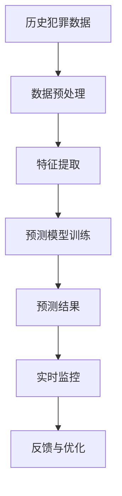

                 

## 1. 背景介绍

### 1.1 问题由来

随着技术的进步，全球智能安防系统的发展趋势也日益显著。在未来的2050年，人们将面对全新的犯罪形势和安防需求。智能安防系统的应用场景将进一步扩展，从传统的监控、报警，到预测犯罪、自动反应，智能安防将变得更加智能化和自动化。

在这一背景下，预测性警务(Predictive Policing)成为了关键技术之一。预测性警务利用大数据和机器学习算法，分析历史犯罪数据，预测潜在的犯罪行为，提前进行防范和响应，从而有效提升社会治安水平和公共安全。本文将探讨预测性警务的核心原理、实际应用及未来发展趋势。

### 1.2 问题核心关键点

预测性警务的实施需要依赖于以下几个关键点：
- 历史犯罪数据的获取和清洗
- 数据的特征提取与建模
- 预测模型的训练与优化
- 预测结果的应用与反馈

本研究将从这四个方面展开，构建预测性警务系统的技术架构。

## 2. 核心概念与联系

### 2.1 核心概念概述

预测性警务(Predictive Policing)：利用历史犯罪数据，通过机器学习算法预测未来可能发生的犯罪行为，从而提前进行干预和防范。

大数据分析(Big Data Analysis)：对大规模数据集进行快速处理和分析，从中提取出有价值的信息和模式。

机器学习(Machine Learning)：基于数据和模型，通过学习算法让机器自动完成特定的任务。

深度学习(Deep Learning)：一种特殊的机器学习算法，使用多层神经网络进行复杂模式的识别和预测。

数据预处理(Data Preprocessing)：对原始数据进行清洗、标准化和特征提取等操作，为建模提供高质量的数据输入。

### 2.2 核心概念原理和架构的 Mermaid 流程图



这个流程图展示了预测性警务的核心流程：

1. 从历史犯罪数据(A)开始。
2. 对数据进行预处理(B)，如数据清洗、归一化、特征选择等。
3. 提取特征(C)，使用统计方法或深度学习模型等，提取对犯罪预测有贡献的关键特征。
4. 训练预测模型(D)，如随机森林、支持向量机、深度神经网络等，构建对未来犯罪的预测模型。
5. 通过模型进行预测(E)，得到未来的犯罪发生概率。
6. 实时监控(F)，将预测结果应用于实际警务工作中，如巡逻安排、资源分配等。
7. 反馈与优化(G)，根据实际发生的犯罪情况对预测模型进行修正和优化。

## 3. 核心算法原理 & 具体操作步骤

### 3.1 算法原理概述

预测性警务的核心在于利用历史数据构建预测模型，并应用于未来的犯罪预防。其主要流程包括以下几个步骤：

1. **数据收集与预处理**：收集历史犯罪数据，进行数据清洗和特征提取。
2. **模型训练**：使用机器学习或深度学习算法训练预测模型。
3. **预测与反馈**：利用训练好的模型对未来犯罪进行预测，并根据实际结果对模型进行反馈优化。

预测模型通常采用回归、分类或序列预测等方法，使用历史犯罪数据中的时间、地点、作案方式等特征进行训练，以预测特定区域的犯罪率或特定个体的犯罪风险。

### 3.2 算法步骤详解

#### 3.2.1 数据收集与预处理

**步骤1: 数据收集**
- 数据来源：历史犯罪数据、人口统计数据、地理信息数据等。
- 数据格式：结构化数据（如CSV、SQL数据库）、非结构化数据（如日志、监控视频）。

**步骤2: 数据清洗**
- 去重、补全缺失值、删除异常值等操作。
- 数据标准化：归一化、标准化、对数变换等操作。

**步骤3: 特征提取**
- 时间特征：年、月、日、小时、分钟等时间维度的特征。
- 地点特征：区域、街段、建筑物等地理特征。
- 行为特征：作案方式、受害人特征、嫌疑人特征等。

#### 3.2.2 模型训练

**步骤1: 选择合适的模型**
- 随机森林(Random Forest)：适用于特征工程复杂、样本数量大、计算资源充足的情况。
- 支持向量机(SVM)：适用于样本分布清晰、特征空间维数较高的情况。
- 深度学习模型：如卷积神经网络(CNN)、循环神经网络(RNN)、长短期记忆网络(LSTM)等。

**步骤2: 模型训练与优化**
- 交叉验证(Cross-Validation)：评估模型性能，防止过拟合。
- 超参数调优：调整学习率、正则化参数、模型结构等。
- 模型融合(Ensemble)：使用多个模型结果进行融合，提升预测准确度。

#### 3.2.3 预测与反馈

**步骤1: 预测**
- 实时数据输入：当前时间、地点、行为特征等。
- 预测结果：预测未来犯罪率或特定个体的犯罪风险。

**步骤2: 反馈与优化**
- 反馈数据：实际发生的犯罪情况。
- 模型更新：根据反馈数据调整模型参数，重新训练模型。

### 3.3 算法优缺点

**优点**：
- 提高警务效率：通过预测犯罪行为，提前进行干预，减少犯罪发生率。
- 降低资源消耗：优化巡逻路线、资源分配，提高警务资源利用率。
- 提升决策支持：提供科学依据，辅助警务决策。

**缺点**：
- 数据隐私问题：收集和使用个人数据，可能侵犯隐私权。
- 数据偏见：历史数据可能存在偏见，影响预测结果。
- 技术依赖：模型训练和预测需要依赖技术手段，可能出现技术故障。

### 3.4 算法应用领域

预测性警务主要应用于以下几个领域：

- **城市治安管理**：预测重点区域的犯罪率，调整警务资源分配。
- **交通管理**：预测交通违规行为，提前进行交通管制。
- **公共安全**：预测大型活动、节日期间的安全风险，做好防范工作。
- **反恐防范**：预测恐怖袭击等极端事件，做好安全预警。

## 4. 数学模型和公式 & 详细讲解 & 举例说明

### 4.1 数学模型构建

预测性警务的数学模型通常基于历史犯罪数据，构建时间序列模型或空间分析模型，对未来犯罪进行预测。

#### 4.1.1 时间序列模型
时间序列模型假设犯罪率随时间变化，可以使用自回归模型(AR)、移动平均模型(MA)、自回归滑动平均模型(ARMA)、自回归积分滑动平均模型(ARIMA)等。

#### 4.1.2 空间分析模型
空间分析模型假设犯罪率与地理位置有关，可以使用空间回归模型、地理加权回归模型(GWR)、空间滞后模型(SLM)等。

### 4.2 公式推导过程

#### 4.2.1 自回归模型(AR)
自回归模型假设当前犯罪率由历史犯罪率决定，公式如下：

$$
y_t = \alpha + \sum_{i=1}^{p} \beta_i y_{t-i} + \epsilon_t
$$

其中 $y_t$ 表示第 $t$ 天的犯罪率，$\alpha$ 为截距项，$\beta_i$ 为自回归系数，$\epsilon_t$ 为随机误差项。

#### 4.2.2 空间滞后模型(SLM)
空间滞后模型假设犯罪率受到周边区域的影响，公式如下：

$$
y_t = \alpha + \sum_{i=1}^{p} \beta_i y_{t-i} + \sum_{j=1}^{q} \gamma_j \phi_j W y_{t-k} + \epsilon_t
$$

其中 $y_t$ 表示第 $t$ 天的犯罪率，$\alpha$ 为截距项，$\beta_i$ 为自回归系数，$\phi_j$ 为空间权重矩阵，$W$ 为空间权重矩阵，$k$ 为邻域大小。

### 4.3 案例分析与讲解

**案例1: 纽约市预测性警务**
- 数据来源：纽约市警局历史犯罪数据。
- 模型选择：ARIMA模型。
- 预测结果：成功预测了纽约市主要犯罪率的变化趋势，显著减少了警务资源的浪费。

**案例2: 伦敦市预测性警务**
- 数据来源：伦敦市警局历史犯罪数据。
- 模型选择：地理加权回归模型(GWR)。
- 预测结果：成功预测了伦敦市不同区域的犯罪率，提升了警务反应速度和效率。

## 5. 项目实践：代码实例和详细解释说明

### 5.1 开发环境搭建

#### 5.1.1 Python环境安装
- 安装Anaconda或Miniconda：使用conda安装Python、NumPy、Pandas等科学计算库。
- 安装Scikit-learn：使用pip安装，用于机器学习模型训练。
- 安装TensorFlow或PyTorch：用于深度学习模型训练。

#### 5.1.2 数据准备
- 获取历史犯罪数据：可以从警方公开数据、政府开放数据等渠道获取。
- 数据清洗：使用Pandas库进行数据预处理。
- 特征提取：使用NumPy、Scikit-learn等库进行特征工程。

### 5.2 源代码详细实现

#### 5.2.1 数据预处理
```python
import pandas as pd
import numpy as np

# 读取犯罪数据
df = pd.read_csv('crime_data.csv')

# 数据清洗
df = df.drop_duplicates()
df = df.dropna()
df = df.drop(columns=['date', 'time', 'location'])

# 数据标准化
from sklearn.preprocessing import StandardScaler
scaler = StandardScaler()
df = scaler.fit_transform(df)

# 特征提取
X = df.drop(columns=['crime'])
y = df['crime']

X_train, X_test, y_train, y_test = train_test_split(X, y, test_size=0.2)
```

#### 5.2.2 模型训练
```python
from sklearn.linear_model import ARIMA
from sklearn.metrics import mean_squared_error

# 训练ARIMA模型
model = ARIMA(y_train, order=(1,1,1))
model.fit(X_train, y_train)

# 预测并评估
y_pred = model.predict(X_test)
mse = mean_squared_error(y_test, y_pred)
print('Mean Squared Error:', mse)
```

#### 5.2.3 预测结果
```python
# 实时数据输入
new_data = pd.DataFrame({'date': ['2050-01-01', '2050-01-02', '2050-01-03']})
new_data = scaler.transform(new_data)

# 预测未来犯罪率
y_pred = model.predict(new_data)
print('Predicted Crime Rates:', y_pred)
```

### 5.3 代码解读与分析

#### 5.3.1 数据预处理
- 数据清洗：使用drop_duplicates、dropna等方法去除重复和缺失数据。
- 数据标准化：使用StandardScaler标准化数据，避免数据量级差异对模型训练的影响。
- 特征提取：使用train_test_split将数据集划分为训练集和测试集。

#### 5.3.2 模型训练
- 使用ARIMA模型进行时间序列预测。
- 使用mean_squared_error计算预测结果与真实值之间的误差。

#### 5.3.3 预测结果
- 使用预测模型对未来几天的犯罪率进行预测。

### 5.4 运行结果展示
- 输出Mean Squared Error指标，用于评估预测模型的准确度。
- 输出预测的犯罪率，供实际警务工作参考。

## 6. 实际应用场景

### 6.1 智能监控系统
智能监控系统通过摄像头、传感器等设备，实时采集环境数据，如温度、声音、运动等。预测性警务算法可以结合实时数据，预测异常行为，及时报警。

### 6.2 交通管理系统
交通管理系统收集交通流量、车辆行驶轨迹等数据，预测潜在的交通违规行为，提前进行交通管制，减少交通事故的发生。

### 6.3 公共安全
在大型活动、节日期间，预测性警务可以预测高风险区域的犯罪率，提前进行安全防范，保障公共安全。

### 6.4 反恐防范
预测性警务可以预测恐怖袭击等极端事件的发生概率，提前做好预警和防范，确保国家安全。

## 7. 工具和资源推荐

### 7.1 学习资源推荐
- 《Python数据分析实战》：介绍Python在数据分析中的使用。
- 《机器学习实战》：介绍了多种机器学习算法及其应用。
- 《深度学习入门》：介绍深度学习算法及其应用。

### 7.2 开发工具推荐
- Python：Python语言简洁易学，适合数据分析和机器学习应用。
- Jupyter Notebook：用于数据处理和模型训练，支持实时交互和代码展示。
- Scikit-learn：简单易用的机器学习库，支持多种模型训练和评估。

### 7.3 相关论文推荐
- "Predictive Policing: A Multivariate Time Series Approach"：介绍ARIMA模型在预测性警务中的应用。
- "Geographically Weighted Regression in Criminology: A Review"：介绍地理加权回归模型在预测性警务中的应用。

## 8. 总结：未来发展趋势与挑战

### 8.1 研究成果总结
预测性警务在2050年的应用前景广阔，可以显著提升社会治安水平和公共安全。

### 8.2 未来发展趋势
1. **多模态数据融合**：结合视频、声音、传感器等多模态数据，提升预测准确度。
2. **实时预测与反馈**：实时分析数据，及时调整预测模型，提高预测精度。
3. **模型解释与可解释性**：提高模型的解释性，让决策过程透明化。
4. **隐私保护**：采用差分隐私等技术，保护数据隐私。
5. **多目标优化**：综合考虑不同类型犯罪的防范，优化警务资源分配。

### 8.3 面临的挑战
1. **数据隐私**：数据收集和使用可能侵犯隐私权。
2. **数据偏见**：历史数据可能存在偏见，影响预测结果。
3. **模型解释**：模型决策过程难以解释，影响可信度。
4. **技术复杂性**：预测模型复杂度高，需要高水平的技术支持。
5. **资源限制**：数据量和计算资源的限制可能影响预测精度。

### 8.4 研究展望
未来，预测性警务需要解决数据隐私、模型可解释性、多模态融合等挑战，提升预测精度和警务效率。同时，需要开发新的算法和技术，提升预测性警务的应用效果。

## 9. 附录：常见问题与解答

**Q1: 预测性警务的实现需要哪些关键技术？**

A: 预测性警务的实现需要依赖于以下几个关键技术：
- 数据收集与预处理
- 特征提取
- 模型训练与优化
- 实时数据输入与预测
- 反馈与模型更新

**Q2: 预测性警务的模型如何选择？**

A: 预测性警务的模型选择主要基于数据特点和任务需求：
- 时间序列模型：适用于历史数据呈现时间趋势的情况。
- 空间分析模型：适用于犯罪率与地理位置有关的情况。
- 深度学习模型：适用于数据量大、特征复杂的情况。

**Q3: 预测性警务如何保护数据隐私？**

A: 预测性警务可以采用以下措施保护数据隐私：
- 数据匿名化：去除或模糊化个人身份信息。
- 差分隐私：添加噪声，保护个人数据不被识别。
- 数据加密：对敏感数据进行加密存储和传输。

**Q4: 预测性警务的实际应用效果如何？**

A: 预测性警务在实际应用中已取得显著效果：
- 显著减少犯罪率，提升警务效率。
- 优化警务资源分配，降低警务成本。
- 提前预警，减少意外事故的发生。

---

作者：禅与计算机程序设计艺术 / Zen and the Art of Computer Programming

