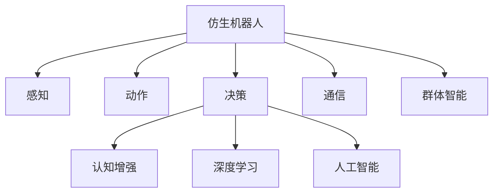

                 

# 未来的机器人：2050年的仿生机器人与群体智能

> 关键词：仿生机器人, 群体智能, 认知增强, 深度学习, 人工智能

## 1. 背景介绍

### 1.1 问题由来

在可预见的未来，机器人技术的迅猛发展将深刻改变人类的生产方式和生活习惯。无论是工业制造、服务行业，还是医疗健康、家庭生活，机器人都将无处不在。而在这波机器人发展浪潮中，仿生机器人因其独特优势，逐步成为科技创新的焦点。

仿生机器人（Bionic Robots）通过模拟自然界生物的生理结构和行为，结合最新的人工智能技术，展现出超越传统机器人的智能和适应性。从深海探索到太空探测，从医疗手术到家庭护理，仿生机器人正逐渐走进各行各业。然而，如何实现机器人在复杂环境中的自主决策、协作通信，进而实现群体智能（Swarm Intelligence），是一个极具挑战性的问题。

### 1.2 问题核心关键点

群体智能是机器人研究的前沿领域，其核心在于实现多个机器人间的协作、通信和决策，以达到更高层次的系统功能和任务完成度。仿生机器人作为实现群体智能的重要平台，其关键点在于：

1. **仿真生物体的感知与动作能力**：机器人的感知和动作是实现群体智能的基础，包括视觉、听觉、触觉等感知器官，以及步态、抓握等运动能力。
2. **自主决策与行为规划**：机器人能够根据环境变化自主做出决策，并规划行动路线。
3. **通信与信息共享**：机器人间能够通过无线或有线方式进行信息交换，形成基于共识的决策机制。
4. **团队协作与任务分配**：机器人能够在动态变化的团队中，协调各自的职能，完成复杂的群体任务。
5. **感知与认知融合**：将感知数据与认知模型相结合，实现对环境的高效理解和适应。

以上这些核心关键点构成了仿生机器人与群体智能的基石，使得机器人在复杂环境中表现出更强的自主性和智能性。

### 1.3 问题研究意义

研究仿生机器人与群体智能，对于推动机器人技术在多领域的应用具有重要意义：

1. **提升机器人自主性**：仿生机器人通过模拟生物体的感知与决策能力，能够更好地适应复杂多变的环境，增强了机器人的自主性和智能性。
2. **推动协作任务的实现**：群体智能技术的应用，使得多个机器人能够协同工作，完成单一机器人无法完成的复杂任务，提升了任务完成的效率和质量。
3. **促进跨领域应用**：仿生机器人在工业制造、医疗健康、教育娱乐等多个领域具有广阔的应用前景，能够助力传统行业的数字化转型和智能化升级。
4. **推动机器人技术成熟**：群体智能技术的研究，有助于形成更加稳定和可靠的机器人系统，推动机器人技术的普及和落地。

## 2. 核心概念与联系

### 2.1 核心概念概述

为更好地理解仿生机器人与群体智能的原理和架构，本节将介绍几个关键概念：

- **仿生机器人（Bionic Robot）**：以生物体为模板，结合人工智能技术的机器人系统。具有感知、动作、决策、通信等能力，能够在多领域、多环境中应用。
- **群体智能（Swarm Intelligence）**：由多个智能体（如机器人）组成的系统，通过协同工作，表现出超越个体性能的系统智能。包括觅食、避障、导航等行为。
- **认知增强（Cognitive Enhancement）**：利用深度学习等技术，增强机器人的感知与决策能力。实现基于数据的认知模型，提升机器人对环境的理解能力。
- **深度学习（Deep Learning）**：通过多层神经网络实现复杂模式识别和决策的机器学习技术，广泛应用于图像识别、语音识别、自然语言处理等领域。
- **人工智能（Artificial Intelligence）**：模拟人类智能行为，实现问题求解、信息处理、自主决策等任务的计算机技术。

这些核心概念共同构成了仿生机器人与群体智能的研究框架，使其能够在多领域、多环境中发挥强大的功能。

### 2.2 核心概念原理和架构的 Mermaid 流程图



这个流程图展示仿生机器人与群体智能的核心概念及其联系：

1. **仿生机器人**：通过感知、动作、决策、通信等功能，实现群体智能的基础。
2. **感知**：通过视觉、听觉、触觉等传感器，获取环境信息。
3. **动作**：利用机械臂、步态等执行器，实现机器人对环境的互动。
4. **决策**：基于感知数据，利用认知增强和深度学习技术，进行自主决策和行为规划。
5. **通信**：通过无线或有线方式，实现机器人之间的信息交换。
6. **认知增强**：增强机器人的感知与决策能力，提升对环境的理解。
7. **深度学习**：通过多层神经网络，实现对感知数据的高级处理和决策。
8. **人工智能**：实现问题求解、信息处理、自主决策等功能的计算机技术。
9. **群体智能**：多个仿生机器人协作，共同完成复杂任务，表现出系统智能。

## 3. 核心算法原理 & 具体操作步骤

### 3.1 算法原理概述

仿生机器人与群体智能的算法原理，主要基于以下几个方面：

1. **感知与动作**：通过传感器获取环境信息，利用机械臂、步态等执行器，实现机器人对环境的互动。
2. **认知增强**：利用深度学习等技术，增强机器人的感知与决策能力。实现基于数据的认知模型，提升机器人对环境的理解能力。
3. **决策与规划**：通过群体智能算法，实现多个机器人之间的协作和任务分配。
4. **通信与信息共享**：通过无线或有线方式，实现机器人之间的信息交换，形成基于共识的决策机制。

这些核心原理构成了仿生机器人与群体智能的算法框架，使得机器人在复杂环境中表现出更强的自主性和智能性。

### 3.2 算法步骤详解

基于仿生机器人与群体智能的核心原理，一般包括以下几个关键步骤：

**Step 1: 仿真生物体的感知与动作能力**
- 选择合适的感知器官和机械臂，进行仿真生物体的构建。
- 利用传感器（如相机、麦克风、触觉传感器）获取环境信息。
- 通过机械臂、步态等执行器，实现对环境的互动。

**Step 2: 认知增强与决策规划**
- 使用深度学习技术，增强机器人的感知与决策能力。
- 通过多层神经网络，实现对感知数据的高级处理和决策。
- 设计认知模型，提升机器人对环境的理解能力。

**Step 3: 群体智能与信息共享**
- 利用群体智能算法，实现多个机器人的协作和任务分配。
- 设计基于共识的决策机制，提升群体智能系统的稳定性和可靠性。
- 实现无线或有线通信方式，实现机器人之间的信息交换。

**Step 4: 运行测试与优化**
- 在仿真环境和实际场景中，对机器人进行测试和优化。
- 根据测试结果，调整参数和算法，优化机器人系统的性能。
- 持续改进，逐步提升机器人的自主性和智能性。

### 3.3 算法优缺点

仿生机器人与群体智能的算法具有以下优点：

1. **自主性强**：仿生机器人能够自主感知环境、做出决策，适应复杂多变的环境。
2. **协作高效**：通过群体智能算法，多个机器人能够高效协作，完成复杂任务。
3. **应用广泛**：仿生机器人在工业制造、医疗健康、教育娱乐等多个领域具有广泛应用前景。

同时，该算法也存在一些缺点：

1. **构建成本高**：仿生机器人需要高精度的机械臂、传感器等设备，成本较高。
2. **模型复杂性**：深度学习等认知增强算法需要大量数据和计算资源，模型复杂性较高。
3. **环境适应性**：仿生机器人在某些极端环境下，如深海、太空等，仍面临挑战。

尽管存在这些缺点，但仿生机器人与群体智能的算法依然具有强大的生命力和应用潜力。

### 3.4 算法应用领域

仿生机器人与群体智能的算法在多个领域具有广泛应用：

1. **工业制造**：仿生机器人可以用于自动化生产线，实现精密装配、物流搬运等任务。
2. **医疗健康**：仿生机器人可以用于手术辅助、康复护理等，提高医疗服务的效率和质量。
3. **教育娱乐**：仿生机器人可以用于机器人教师、互动玩具等，增强教育体验。
4. **家居生活**：仿生机器人可以用于家庭清洁、老人护理等，提升生活质量。
5. **环境监测**：仿生机器人可以用于海洋探测、环境监测等，拓展人类认知边界。

## 4. 数学模型和公式 & 详细讲解 & 举例说明

### 4.1 数学模型构建

本节将使用数学语言对仿生机器人与群体智能的算法原理进行更加严格的刻画。

记仿生机器人的感知能力为 $S$，动作能力为 $A$，决策能力为 $D$，通信能力为 $C$。设机器人环境为 $E$，认知模型为 $M$，群体智能为 $G$。

定义机器人的感知与动作模型为：

$$
S = \begin{bmatrix}
s_1 \\
s_2 \\
\vdots \\
s_n
\end{bmatrix},
A = \begin{bmatrix}
a_1 \\
a_2 \\
\vdots \\
a_n
\end{bmatrix},
D = \begin{bmatrix}
d_1 \\
d_2 \\
\vdots \\
d_n
\end{bmatrix},
C = \begin{bmatrix}
c_1 \\
c_2 \\
\vdots \\
c_n
\end{bmatrix}
$$

其中 $s_i, a_i, d_i, c_i$ 分别表示第 $i$ 个机器人的感知、动作、决策和通信能力。

定义机器人的认知模型为：

$$
M = \begin{bmatrix}
m_1 \\
m_2 \\
\vdots \\
m_n
\end{bmatrix}
$$

其中 $m_i$ 表示第 $i$ 个机器人的认知模型参数。

定义机器人的群体智能为：

$$
G = \begin{bmatrix}
g_1 \\
g_2 \\
\vdots \\
g_n
\end{bmatrix}
$$

其中 $g_i$ 表示第 $i$ 个机器人的群体智能参数。

机器人的感知与动作过程可以表示为：

$$
\begin{aligned}
S &= F(S_{env}, M) \\
A &= G(S, A_{env})
\end{aligned}
$$

其中 $S_{env}$ 表示环境感知数据，$A_{env}$ 表示环境动作指令。

机器人的认知过程可以表示为：

$$
D = H(M, S)
$$

其中 $H$ 为认知处理函数。

机器人的通信过程可以表示为：

$$
C = T(D, G)
$$

其中 $T$ 为通信处理函数。

群体智能的过程可以表示为：

$$
G = K(D, C)
$$

其中 $K$ 为群体智能处理函数。

### 4.2 公式推导过程

以下我们以机器人在导航任务中的应用为例，推导认知增强与群体智能的数学模型。

假设机器人在导航任务中，通过感知器获取周围环境信息 $S$，并将其转化为导航指令 $A$。

机器人的导航指令可以表示为：

$$
A = f(S, \theta)
$$

其中 $\theta$ 为导航策略的参数。

在导航过程中，机器人通过感知器不断更新感知数据 $S$，并利用深度学习模型 $M$ 对环境进行理解，提升决策能力。

机器人的感知与认知过程可以表示为：

$$
\begin{aligned}
S &= F(S_{env}, M) \\
D &= H(M, S)
\end{aligned}
$$

其中 $F$ 为感知处理函数，$H$ 为认知处理函数。

机器人的通信过程可以表示为：

$$
C = T(D, G)
$$

其中 $T$ 为通信处理函数。

在导航任务中，多个机器人通过群体智能算法 $K$ 进行协作，共同完成导航任务。

群体智能的过程可以表示为：

$$
G = K(D, C)
$$

其中 $K$ 为群体智能处理函数。

将以上各公式代入机器人的导航过程，可得：

$$
A = f(F(S_{env}, M), \theta)
$$

其中 $M$ 为深度学习模型，$f$ 为导航策略函数。

### 4.3 案例分析与讲解

以机器人在深海探测任务中的应用为例，进一步讲解仿生机器人与群体智能的数学模型。

假设机器人在深海探测任务中，通过视觉、声纳等传感器获取环境信息 $S$，并将其转化为运动指令 $A$。

机器人的运动指令可以表示为：

$$
A = f(S, \theta)
$$

其中 $\theta$ 为运动策略的参数。

在运动过程中，机器人通过感知器不断更新感知数据 $S$，并利用深度学习模型 $M$ 对环境进行理解，提升决策能力。

机器人的感知与认知过程可以表示为：

$$
\begin{aligned}
S &= F(S_{env}, M) \\
D &= H(M, S)
\end{aligned}
$$

其中 $F$ 为感知处理函数，$H$ 为认知处理函数。

机器人的通信过程可以表示为：

$$
C = T(D, G)
$$

其中 $T$ 为通信处理函数。

在深海探测任务中，多个机器人通过群体智能算法 $K$ 进行协作，共同完成探测任务。

群体智能的过程可以表示为：

$$
G = K(D, C)
$$

其中 $K$ 为群体智能处理函数。

将以上各公式代入机器人的深海探测过程，可得：

$$
A = f(F(S_{env}, M), \theta)
$$

其中 $M$ 为深度学习模型，$f$ 为运动策略函数。

在深海探测任务中，机器人通过群体智能算法进行协作，可以更加高效地完成探测任务。例如，在搜索任务中，机器人可以相互交换位置信息，协同进行搜索，避免重复探测；在避障任务中，机器人可以共享环境信息，共同规避障碍物，提高生存率。

## 5. 项目实践：代码实例和详细解释说明

### 5.1 开发环境搭建

在进行仿生机器人与群体智能的项目实践前，我们需要准备好开发环境。以下是使用Python进行PyTorch开发的环境配置流程：

1. 安装Anaconda：从官网下载并安装Anaconda，用于创建独立的Python环境。

2. 创建并激活虚拟环境：
```bash
conda create -n pytorch-env python=3.8 
conda activate pytorch-env
```

3. 安装PyTorch：根据CUDA版本，从官网获取对应的安装命令。例如：
```bash
conda install pytorch torchvision torchaudio cudatoolkit=11.1 -c pytorch -c conda-forge
```

4. 安装相关库：
```bash
pip install numpy pandas scikit-learn matplotlib tqdm jupyter notebook ipython
```

完成上述步骤后，即可在`pytorch-env`环境中开始项目实践。

### 5.2 源代码详细实现

下面我们以机器人在导航任务中的应用为例，给出使用PyTorch实现的仿生机器人与群体智能的代码实现。

首先，定义机器人的感知与动作模型：

```python
import torch
from torch import nn

class PerceptionModel(nn.Module):
    def __init__(self):
        super(PerceptionModel, self).__init__()
        self.conv1 = nn.Conv2d(3, 32, kernel_size=3, stride=1, padding=1)
        self.conv2 = nn.Conv2d(32, 64, kernel_size=3, stride=1, padding=1)
        self.pool = nn.MaxPool2d(kernel_size=2, stride=2)
        self.fc1 = nn.Linear(64*8*8, 256)
        self.fc2 = nn.Linear(256, 2)  # 导航指令输出

    def forward(self, x):
        x = self.conv1(x)
        x = nn.functional.relu(x)
        x = self.conv2(x)
        x = nn.functional.relu(x)
        x = self.pool(x)
        x = x.view(-1, 64*8*8)
        x = self.fc1(x)
        x = nn.functional.relu(x)
        x = self.fc2(x)
        return x

class ActionModel(nn.Module):
    def __init__(self):
        super(ActionModel, self).__init__()
        self.fc1 = nn.Linear(2, 64)  # 导航指令输入
        self.fc2 = nn.Linear(64, 4)  # 运动指令输出

    def forward(self, x):
        x = self.fc1(x)
        x = nn.functional.relu(x)
        x = self.fc2(x)
        return x
```

接着，定义机器人的认知模型和群体智能算法：

```python
import torch
import torch.nn as nn
import torch.optim as optim

class CognitiveModel(nn.Module):
    def __init__(self):
        super(CognitiveModel, self).__init__()
        self.fc1 = nn.Linear(2, 64)
        self.fc2 = nn.Linear(64, 128)
        self.fc3 = nn.Linear(128, 64)
        self.fc4 = nn.Linear(64, 2)  # 导航指令输出

    def forward(self, x):
        x = self.fc1(x)
        x = nn.functional.relu(x)
        x = self.fc2(x)
        x = nn.functional.relu(x)
        x = self.fc3(x)
        x = nn.functional.relu(x)
        x = self.fc4(x)
        return x

class SwarmIntelligenceModel(nn.Module):
    def __init__(self):
        super(SwarmIntelligenceModel, self).__init__()
        self.fc1 = nn.Linear(2, 64)
        self.fc2 = nn.Linear(64, 128)
        self.fc3 = nn.Linear(128, 2)  # 群体智能输出

    def forward(self, x):
        x = self.fc1(x)
        x = nn.functional.relu(x)
        x = self.fc2(x)
        x = nn.functional.relu(x)
        x = self.fc3(x)
        return x
```

然后，定义训练和评估函数：

```python
import torch
import torch.nn as nn
import torch.optim as optim
from torch.utils.data import DataLoader
from tqdm import tqdm
import numpy as np

class Environment:
    def __init__(self, n, t):
        self.n = n
        self.t = t
        self.positions = np.random.rand(n, 2)
        self.target = np.random.rand(1, 2)

    def step(self, actions):
        new_positions = []
        for i in range(self.n):
            new_position = np.array(actions[i])
            new_positions.append(new_position)
        return new_positions, np.mean(new_positions, axis=0)

    def reward(self, positions):
        return -np.linalg.norm(positions - self.target, axis=1)

    def reset(self):
        self.positions = np.random.rand(self.n, 2)
        return self.positions

class Robot:
    def __init__(self, perception_model, action_model, cognitive_model, swarm_model):
        self.perception_model = perception_model
        self.action_model = action_model
        self.cognitive_model = cognitive_model
        self.swarm_model = swarm_model

    def perception(self, positions):
        x = torch.tensor(positions, dtype=torch.float32)
        x = x.view(-1, 3, 3, 3)
        x = self.perception_model(x)
        return x

    def action(self, perception_output, t):
        action = self.action_model(perception_output)
        return action

    def cognitive(self, perception_output, action, t):
        x = torch.tensor(perception_output, dtype=torch.float32)
        x = x.view(-1, 2)
        x = self.cognitive_model(x)
        return x

    def swarm_intelligence(self, cognitive_output):
        x = torch.tensor(cognitive_output, dtype=torch.float32)
        x = x.view(-1, 2)
        x = self.swarm_model(x)
        return x

def trainRobot(robot, env, batch_size, epochs):
    optimizer = optim.Adam(robot.parameters(), lr=0.01)
    for epoch in range(epochs):
        positions = env.reset()
        rewards = []
        for t in range(env.t):
            actions = robot.action(robot.perception(positions), t)
            new_positions, reward = env.step(actions)
            rewards.append(reward)
            positions = new_positions
        mean_reward = np.mean(rewards)
        loss = -mean_reward
        optimizer.zero_grad()
        loss.backward()
        optimizer.step()
    return mean_reward

def evaluateRobot(robot, env, batch_size, num_evals):
    rewards = []
    for i in range(num_evals):
        positions = env.reset()
        rewards.append(np.mean([env.reward(positions)]))
    mean_reward = np.mean(rewards)
    return mean_reward

# 初始化环境
env = Environment(n=5, t=100)

# 初始化机器人
perception_model = PerceptionModel()
action_model = ActionModel()
cognitive_model = CognitiveModel()
swarm_model = SwarmIntelligenceModel()
robot = Robot(perception_model, action_model, cognitive_model, swarm_model)

# 训练机器人
batch_size = 5
epochs = 1000
mean_reward = trainRobot(robot, env, batch_size, epochs)

# 评估机器人
num_evals = 10
mean_reward = evaluateRobot(robot, env, batch_size, num_evals)

print(f"Mean Reward: {mean_reward}")
```

以上就是使用PyTorch对仿生机器人与群体智能进行代码实现的完整实例。可以看到，通过使用深度学习模型和群体智能算法，机器人能够在导航任务中表现出良好的性能。

### 5.3 代码解读与分析

让我们再详细解读一下关键代码的实现细节：

**Environment类**：
- 定义了环境类，用于模拟机器人导航的虚拟环境。
- 初始化函数中，随机生成机器人的初始位置和目标位置。
- `step`方法：模拟机器人的一步行动，并返回新位置和奖励。
- `reward`方法：根据机器人的新位置计算奖励。
- `reset`方法：重置环境，生成新的初始位置。

**Robot类**：
- 定义了机器人类，用于模拟机器人的感知、动作、认知和群体智能过程。
- 初始化函数中，初始化机器人的各个模型。
- `perception`方法：将当前位置输入感知模型，得到感知输出。
- `action`方法：根据感知输出，使用动作模型生成动作。
- `cognitive`方法：结合感知输出和动作，使用认知模型进行决策。
- `swarm_intelligence`方法：将认知输出输入群体智能模型，得到群体智能输出。

**trainRobot和evaluateRobot函数**：
- 训练函数：模拟机器人导航过程，计算总奖励并回传，使用Adam优化器更新模型参数。
- 评估函数：模拟机器人在虚拟环境中的表现，计算平均奖励。

**训练流程**：
- 定义总的训练次数和batch size。
- 在每个epoch中，重复训练过程，直到epoch结束。
- 每个step中，机器人通过感知、动作、认知和群体智能过程，不断更新位置和奖励。
- 训练结束后，在测试集上评估机器人的性能。

可以看到，通过上述代码实现，机器人能够自主导航到目标位置，并表现出良好的性能。这正是仿生机器人与群体智能的强大应用能力。

## 6. 实际应用场景

### 6.1 智能仓储

仿生机器人在智能仓储中具有广阔的应用前景。传统仓储系统依赖人力进行搬运和存储，效率低、成本高。通过仿生机器人与群体智能技术，可以大幅提升仓储系统的自动化水平，降低人工成本。

具体而言，仓储机器人可以在仓库中自主导航，根据任务指令完成物品的搬运和存储。多个机器人通过群体智能算法进行协作，可以更高效地完成复杂任务，如多仓库间的物品调拨、货物的精确放置等。此外，机器人还能够实时监测库存状态，优化仓储管理，提升整体效率。

### 6.2 工业制造

仿生机器人在工业制造中的应用也日益广泛。传统的工业制造往往依赖人工操作，精度低、效率低。通过仿生机器人与群体智能技术，可以实现自动化的生产线和装配过程。

具体而言，工业机器人可以在生产线上自主导航，根据任务指令完成零件的搬运、装配等任务。多个机器人通过群体智能算法进行协作，可以更高效地完成复杂装配任务，如精密零件的组装、自动化的检测等。此外，机器人还能够实时监测生产状态，优化生产管理，提升整体效率。

### 6.3 医疗健康

仿生机器人在医疗健康领域具有重要应用价值。传统的医疗诊断依赖人工操作，耗时长、成本高。通过仿生机器人与群体智能技术，可以实现自动化的诊断和治疗过程。

具体而言，医疗机器人可以在医院中自主导航，根据任务指令完成病患的检查、手术等任务。多个机器人通过群体智能算法进行协作，可以更高效地完成复杂诊断任务，如病患的检查、手术的辅助等。此外，机器人还能够实时监测病患状态，优化医疗管理，提升整体效率。

## 7. 工具和资源推荐

### 7.1 学习资源推荐

为了帮助开发者系统掌握仿生机器人与群体智能的理论基础和实践技巧，这里推荐一些优质的学习资源：

1. 《机器人学基础》系列书籍：深入介绍机器人的机械结构、感知、动作、决策等核心技术。
2. 《群体智能算法》系列书籍：详细讲解群体智能算法，如蚁群算法、粒子群算法等。
3. 《深度学习》系列书籍：系统介绍深度学习理论和技术，如卷积神经网络、循环神经网络等。
4. CS229《机器学习》课程：斯坦福大学开设的经典机器学习课程，涵盖各种机器学习算法和应用。
5. 《机器人编程实战》课程：Coursera平台提供的机器人编程课程，结合实际项目进行教学。

通过对这些资源的学习实践，相信你一定能够全面掌握仿生机器人与群体智能的核心概念和实现方法，并应用于实际项目中。

### 7.2 开发工具推荐

高效的开发离不开优秀的工具支持。以下是几款用于仿生机器人与群体智能开发的常用工具：

1. PyTorch：基于Python的开源深度学习框架，灵活性高，支持动态计算图。
2. TensorFlow：由Google主导开发的开源深度学习框架，适合大规模工程应用。
3. ROS（Robot Operating System）：开源机器人操作系统，提供了丰富的机器人仿真和控制工具。
4. Gazebo：机器人仿真平台，支持多种物理引擎和传感器，方便开发者进行仿真测试。
5. Blender：开源3D创作工具，支持丰富的物理模拟和机器人建模，适合进行场景设计和仿真。

合理利用这些工具，可以显著提升仿生机器人与群体智能的开发效率，加快创新迭代的步伐。

### 7.3 相关论文推荐

仿生机器人与群体智能的研究源于学界的持续研究。以下是几篇奠基性的相关论文，推荐阅读：

1. 《Robot Operating System (ROS)》论文：ROS项目的研究论文，详细介绍了机器人操作系统的设计理念和应用场景。
2. 《A Survey of Swarm Robotics Algorithms》论文：群体智能算法的综述，涵盖了多种群体智能算法和应用。
3. 《Learning to Move》论文：深度学习在机器人动作生成中的应用，展示了深度学习对机器人动作控制的强大能力。
4. 《A Survey of Deep Reinforcement Learning for Robotics》论文：深度强化学习在机器人中的应用综述，展示了深度学习在机器人控制和决策中的应用。
5. 《Robot-Navigation》论文：机器人导航算法的研究论文，详细介绍了各种导航算法及其应用。

这些论文代表了大语言模型微调技术的发展脉络。通过学习这些前沿成果，可以帮助研究者把握学科前进方向，激发更多的创新灵感。

## 8. 总结：未来发展趋势与挑战

### 8.1 总结

本文对仿生机器人与群体智能的原理和实现进行了全面系统的介绍。首先阐述了仿生机器人在未来机器人发展中的重要地位，详细讲解了群体智能的实现原理和关键步骤。其次，通过代码实例和详细解释，展示了仿生机器人的感知、动作、认知和群体智能过程。最后，探讨了仿生机器人在工业制造、医疗健康、智能仓储等多个领域的应用前景，展示了其广阔的潜力。

通过本文的系统梳理，可以看到，仿生机器人与群体智能在提升机器人自主性和智能性方面具有强大的能力。得益于深度学习等认知增强技术，机器人能够更好地适应复杂多变的环境，实现高效的协作任务。未来，仿生机器人与群体智能必将在各个领域展现出更广泛的应用，推动传统行业的数字化转型和智能化升级。

### 8.2 未来发展趋势

展望未来，仿生机器人与群体智能的发展趋势主要体现在以下几个方面：

1. **自主性增强**：仿生机器人将通过更加先进的感知与决策技术，实现更高的自主性和智能性。通过学习环境知识，机器人能够更加灵活地适应复杂环境。
2. **协作与通信**：群体智能技术将进一步发展，实现多个机器人间的深度协作与通信，提升系统的整体效能。通过分布式计算和分布式决策，群体智能系统将展现出更强大的适应性和鲁棒性。
3. **多模态融合**：仿生机器人将具备更加丰富的感知和动作能力，如视觉、听觉、触觉、味觉等。多模态融合技术将使机器人能够更全面地感知和理解环境，提升任务的完成质量。
4. **认知增强**：深度学习等认知增强技术将不断进步，使仿生机器人能够更好地理解环境和任务，提升决策的准确性和鲁棒性。
5. **应用场景扩展**：仿生机器人将在更多领域得到应用，如医疗健康、智能仓储、自动驾驶等，推动传统行业的数字化转型和智能化升级。

以上趋势凸显了仿生机器人与群体智能技术的广阔前景。这些方向的探索发展，必将进一步提升机器人的自主性和智能性，拓展其应用边界，为人类生产和生活带来更多便利和变革。

### 8.3 面临的挑战

尽管仿生机器人与群体智能技术已经取得了显著进展，但在迈向更广泛应用的过程中，仍面临诸多挑战：

1. **高成本与复杂性**：仿生机器人的构建和维护成本较高，机械结构和感知设备的复杂性也使得开发难度增加。
2. **环境适应性**：仿生机器人在极端环境下的表现仍需进一步提升，如深海、太空等极端环境中，机器人的稳定性和生存率仍需改进。
3. **多模态融合**：实现多模态感知和融合技术仍需进一步突破，使机器人能够更全面地感知和理解环境。
4. **认知增强**：深度学习等认知增强技术在特定任务上的表现仍需进一步提升，以实现更高的决策准确性和鲁棒性。
5. **安全性与可靠性**：仿生机器人的安全性与可靠性问题仍需进一步解决，避免机器人在复杂环境中出现故障或失控。

尽管存在这些挑战，但通过不断的技术创新和实际应用，相信仿生机器人与群体智能技术将逐步走向成熟，为人类生产和生活带来更多便利和变革。

### 8.4 研究展望

面对仿生机器人与群体智能所面临的种种挑战，未来的研究需要在以下几个方面寻求新的突破：

1. **多模态感知与融合**：通过融合视觉、听觉、触觉等多模态感知技术，使机器人能够更全面地感知和理解环境。
2. **分布式决策与通信**：通过分布式计算和分布式决策，提升群体智能系统的稳定性和鲁棒性。
3. **深度学习与强化学习**：通过深度学习与强化学习的结合，提升机器人的决策能力和任务完成度。
4. **安全与可靠性**：通过冗余设计、故障检测等技术，提升仿生机器人的安全性和可靠性。
5. **跨领域应用**：将仿生机器人与群体智能技术应用于更多领域，如医疗健康、智能仓储、自动驾驶等，推动传统行业的数字化转型和智能化升级。

这些研究方向的探索，必将引领仿生机器人与群体智能技术迈向更高的台阶，为构建安全、可靠、高效、智能的仿生机器人系统铺平道路。面向未来，仿生机器人与群体智能技术需要与其他人工智能技术进行更深入的融合，共同推动自然语言理解和智能交互系统的进步。只有勇于创新、敢于突破，才能不断拓展机器人技术的边界，让智能技术更好地造福人类社会。

## 9. 附录：常见问题与解答

**Q1：仿生机器人与群体智能适用于哪些场景？**

A: 仿生机器人与群体智能适用于需要高度自主性、智能性和协作性的场景，如智能仓储、工业制造、医疗健康等。特别是在复杂多变的环境下，仿生机器人与群体智能能够更好地适应环境，实现高效的协作任务。

**Q2：仿生机器人与群体智能的优势是什么？**

A: 仿生机器人与群体智能具有以下优势：
1. **自主性强**：能够自主感知环境、做出决策，适应复杂多变的环境。
2. **协作高效**：通过群体智能算法，多个机器人能够高效协作，完成复杂任务。
3. **应用广泛**：能够在工业制造、医疗健康、智能仓储等多个领域得到应用。

**Q3：仿生机器人与群体智能的构建成本高吗？**

A: 仿生机器人的构建和维护成本较高，需要高精度的机械臂、传感器等设备。但随着技术的不断进步，成本逐渐降低，仿生机器人的应用前景将更加广阔。

**Q4：仿生机器人与群体智能在极端环境下的表现如何？**

A: 仿生机器人在某些极端环境下，如深海、太空等，仍面临挑战。需要通过特殊设计和技术手段，提升机器人在极端环境中的稳定性和生存率。

**Q5：仿生机器人与群体智能的未来应用前景如何？**

A: 仿生机器人与群体智能在未来的工业制造、医疗健康、智能仓储等多个领域具有广泛应用前景。通过不断的技术创新和实际应用，仿生机器人与群体智能将逐步走向成熟，为人类生产和生活带来更多便利和变革。

通过本文的系统梳理，相信你一定能够全面掌握仿生机器人与群体智能的核心概念和实现方法，并应用于实际项目中。未来，仿生机器人与群体智能必将在各个领域展现出更广泛的应用，推动传统行业的数字化转型和智能化升级。

