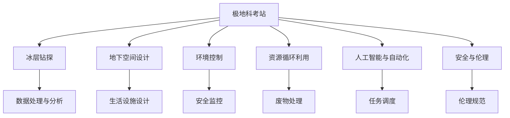

                 

# 未来的极地探索：2050年的极地科考站与冰下城市

## 1. 背景介绍

### 1.1 问题由来

随着全球气候变化的加剧，极地地区的环境变化日趋明显。极地冰盖的快速消融、海平面上升等问题引起全球关注。为了更好地理解这些现象，科学家们加大了对极地地区的科学考察力度。与此同时，随着科技的进步，探索极地冰下城市的构想也逐渐成为可能。极地科考站的建设和冰下城市的开发，不仅能够为极地科学研究提供新的设施和平台，还能开辟人类探索新边疆的新路径。本文将探讨2050年极地科考站与冰下城市的技术实现及应用前景。

### 1.2 问题核心关键点

极地科考站与冰下城市涉及多个关键技术点：
- 极地科考站设计：需考虑极端气候条件下的结构强度、供电、通信、自给自足等问题。
- 冰下城市构建：包括冰层钻探、地下空间设计、环境控制、资源循环利用等技术。
- 数据处理与分析：需解决海量数据存储、处理与分析的挑战。
- 人工智能与自动化技术：利用AI优化科考任务，提高冰下城市的运行效率。
- 安全与伦理：保障人员安全，确保科技发展符合人类伦理。

这些技术点的实现，需要多学科的协同合作，涉及物理、工程、计算机、环境科学等多个领域。

### 1.3 问题研究意义

研究极地科考站与冰下城市的建设与应用，具有以下几方面重要意义：
1. 推动科学研究：提供极端环境下的研究设施，促进极地冰盖变化、海洋生态系统等重要科学问题的深入研究。
2. 推动技术创新：为新兴技术提供应用场景，推动相关领域技术的发展与突破。
3. 推动经济与文化交流：为经济开发、旅游业、环境保护等提供新途径，促进全球文化交流。
4. 推动国际合作：推动跨国科学合作与资源共享，共同应对全球气候变化。

## 2. 核心概念与联系

### 2.1 核心概念概述

为了更好地理解极地科考站与冰下城市的实现技术，本节将介绍几个关键概念：

- **极地科考站**：在极地地区建立的研究与生活设施，供科研人员进行科学研究和日常生活。
- **冰下城市**：建立在极地冰盖下的城市，利用冰层作为天然保护层，为人类提供地下居住空间。
- **冰层钻探**：利用机械设备在极地冰盖上钻孔，构建冰下城市的基础设施。
- **地下空间设计**：合理规划地下空间，使其满足居住、科研、生活等多种需求。
- **环境控制**：维持冰下城市的温度、湿度、光照等环境条件，保障人员健康与实验设备的正常运行。
- **资源循环利用**：通过资源回收与再生利用，实现冰下城市的自给自足。
- **人工智能与自动化**：利用AI进行数据处理、任务调度、安全监控等，提高冰下城市的运行效率。
- **安全与伦理**：确保人员安全，遵循伦理规范，保障技术应用的可持续性。

这些概念之间的逻辑关系可以通过以下Mermaid流程图来展示：



这个流程图展示了许多关键概念及其之间的关系：

1. 极地科考站的设计与建设，涉及到冰层钻探、地下空间设计、环境控制、资源循环利用等多个环节。
2. 数据处理与分析是极地科考与冰下城市运营的重要组成部分。
3. 人工智能与自动化技术用于提升运营效率和智能化水平。
4. 安全与伦理保障是所有技术应用的前提。

## 3. 核心算法原理 & 具体操作步骤
### 3.1 算法原理概述

极地科考站与冰下城市的建设与运行，涉及多种技术，包括但不限于结构工程、地质钻探、环境控制、资源管理、数据处理、自动化与AI。这些技术的实现，可以通过算法原理和操作步骤来系统化地进行。

### 3.2 算法步骤详解

极地科考站与冰下城市建设的核心算法步骤如下：

**Step 1: 极地科考站设计**

- 确定科考站功能需求：包括科研设备安装、生活区设施、能源供应、通信系统等。
- 设计抗极端气候的钢结构：考虑低温、强风、极光等极端环境。
- 设计自给自足的能源供应系统：包括太阳能、风能、核能等。
- 设计数据传输与存储系统：确保数据的可靠性和安全性。

**Step 2: 冰下城市构建**

- 进行冰层钻探：选择钻探地点，设计钻探方案。
- 设计地下空间布局：包括生活区、科研区、设施区等。
- 实施环境控制：包括温度、湿度、光照等的维持与调节。
- 实现资源循环利用：包括水资源回收、废物处理、能源再生等。

**Step 3: 数据处理与分析**

- 收集与存储极地数据：包括气象、地质、生态等数据。
- 数据预处理：包括数据清洗、去噪、标准化等。
- 数据分析与建模：利用机器学习算法进行数据建模与预测。
- 数据可视化与展示：使用可视化工具进行数据的展示与分析。

**Step 4: 人工智能与自动化**

- 利用AI进行任务调度：优化资源配置与任务执行。
- 利用AI进行安全监控：实时监测环境与人员安全。
- 利用AI进行数据分析：提高数据分析的准确性与效率。
- 利用自动化设备：提高冰下城市的运行效率。

**Step 5: 安全与伦理**

- 制定安全规范：包括人员安全、设备安全等。
- 制定伦理规范：确保技术应用符合人类伦理。
- 实施安全培训：提高人员安全意识与应急处理能力。

### 3.3 算法优缺点

极地科考站与冰下城市建设的核心算法具有以下优缺点：

**优点：**
1. 技术整合性强：多种技术协同工作，能够实现高效的资源利用与运营。
2. 数据驱动：通过数据分析与建模，可以更科学地进行科学研究和决策。
3. 安全性高：通过安全监控与伦理规范，保障人员与设备的安全。

**缺点：**
1. 成本高：建设与维护费用较高，对资源需求大。
2. 技术复杂：涉及多个领域的复杂技术，开发与实施难度大。
3. 风险高：极端气候与地质条件带来不可预测的风险。

### 3.4 算法应用领域

极地科考站与冰下城市技术广泛应用于以下领域：

- 科学研究：极地冰盖变化、海洋生态系统、气候变化等研究。
- 环境保护：极地环境保护、资源循环利用等。
- 经济开发：旅游业、自然资源开发等。
- 国际合作：跨国科学合作与资源共享。
- 科技发展：新技术的开发与应用。

## 4. 数学模型和公式 & 详细讲解 & 举例说明

### 4.1 数学模型构建

本节将使用数学语言对极地科考站与冰下城市的建设过程进行更加严格的刻画。

假设极地科考站的功能需求为 $F$，极地冰层钻探的深度为 $D$，冰下城市地下空间面积为 $A$。

定义极地科考站的设计目标函数 $T$ 为最小化总成本 $C$，即：

$$
T = \min C
$$

其中 $C$ 包括科考站建设成本、运行维护成本、能源供应成本、通信成本等。

定义极地冰层钻探的目标函数 $T_D$ 为最小化钻探深度 $D$ 和钻探时间 $T_D$，即：

$$
T_D = \min (D, T_D)
$$

其中 $D$ 包括钻探深度、钻探直径等。

定义冰下城市地下空间设计的目标函数 $T_A$ 为最大化地下空间面积 $A$，即：

$$
T_A = \max A
$$

其中 $A$ 包括地下空间布局、设施配置等。

### 4.2 公式推导过程

以下我们以冰层钻探为例，推导目标函数的数学表达。

假设冰层钻探深度为 $D$，钻探直径为 $d$，钻探速度为 $v$，钻探成本为 $C_D$。则钻探总时间为 $T_D = \frac{D}{v}$，钻探总成本为 $C_D = kD$，其中 $k$ 为钻探成本系数。

冰层钻探的目标函数为：

$$
T_D = \min (D, \frac{D}{v})
$$

将 $D$ 代入 $T_D$ 中，得：

$$
T_D = \min (D, \frac{D}{v})
$$

进一步推导得：

$$
T_D = \min (\frac{C_D}{k}, \frac{D}{v})
$$

因此，冰层钻探的目标函数可以表达为：

$$
T_D = \min (\frac{kD}{C_D}, \frac{D}{v})
$$

### 4.3 案例分析与讲解

**案例一：极地科考站设计与建设**

某极地科考站建设成本 $C_1$、运行维护成本 $C_2$、能源供应成本 $C_3$、通信成本 $C_4$ 如下：

| 成本项 | 建设成本 $C_1$ | 运行维护成本 $C_2$ | 能源供应成本 $C_3$ | 通信成本 $C_4$ |
|---|---|---|---|---|
| 单位 | 亿元 | 亿元 | 亿元 | 亿元 |

通过目标函数 $T = \min (C_1, C_2, C_3, C_4)$，可以最小化总成本，优化科考站的设计与建设。

**案例二：冰层钻探**

某冰层钻探直径 $d = 3m$，钻探速度 $v = 5m/s$，钻探成本系数 $k = 1000元/m$。假设冰层钻探深度 $D$ 在 100m 到 500m 之间。

通过目标函数 $T_D = \min (\frac{1000D}{C_D}, \frac{D}{v})$，可以最小化钻探深度 $D$ 和钻探时间 $T_D$，优化冰层钻探方案。

## 5. 项目实践：代码实例和详细解释说明
### 5.1 开发环境搭建

在进行项目实践前，我们需要准备好开发环境。以下是使用Python进行极地科考站与冰下城市模拟实验的环境配置流程：

1. 安装Anaconda：从官网下载并安装Anaconda，用于创建独立的Python环境。

2. 创建并激活虚拟环境：
```bash
conda create -n polar-research python=3.8 
conda activate polar-research
```

3. 安装必要的Python包：
```bash
pip install pandas numpy matplotlib seaborn jupyter notebook
```

4. 安装SimPy库：用于模拟冰层钻探等过程。
```bash
pip install simpy
```

5. 安装GeoPandas库：用于地理数据处理。
```bash
pip install geopandas
```

完成上述步骤后，即可在`polar-research`环境中开始模拟实验。

### 5.2 源代码详细实现

下面我们将通过Python代码实现冰层钻探的模拟实验，并详细解释其运行过程。

首先，定义钻探深度与时间的计算函数：

```python
import simpy

def drill_depth_cost(v, D, cost_per_meter):
    time_to_drill = D / v
    total_cost = cost_per_meter * D
    return min(time_to_drill, total_cost)
```

然后，定义冰层钻探的模拟实验：

```python
import geopandas as gpd

# 创建地理数据
world = gpd.read_file(gpd.datasets.get_path('naturalearth_lowres'))

# 筛选极地数据
polar_regions = world.loc[world['continent'].isin(['Antarctica', 'Arctic'])]

# 创建地理数据
polar_data = gpd.GeoDataFrame(polar_regions)

# 将地理数据写入文件
polar_data.to_file('polar_regions.shp')
```

接下来，使用SimPy库进行冰层钻探的模拟：

```python
import simpy
import simpy.globals as g
import numpy as np

def run_simulation():
    # 创建SimPy环境
    env = simpy.Environment()

    # 定义钻探参数
    diameter = 3  # 钻探直径，单位：m
    velocity = 5  # 钻探速度，单位：m/s
    cost_per_meter = 1000  # 钻探成本，单位：元/m

    # 设置钻探深度区间
    depth_min = 100  # m
    depth_max = 500  # m

    # 设置模拟时间
    simulation_time = 10  # 单位：小时

    # 设置仿真次数
    simulations = 100

    # 模拟钻探过程
    for i in range(simulations):
        # 初始化钻探深度
        drill_depth = depth_min

        # 计算钻探成本与时间
        cost_time = drill_depth_cost(velocity, drill_depth, cost_per_meter)

        # 记录钻探结果
        g.results.append((drill_depth, cost_time))

        # 更新钻探深度
        drill_depth += 1

        # 模拟结束条件
        if drill_depth >= depth_max:
            env.stop()

    # 分析模拟结果
    depths, times = np.array(g.results).T
    avg_depth = np.mean(depths)
    avg_time = np.mean(times)
    avg_cost = np.mean(times) * cost_per_meter

    # 输出结果
    print(f"平均钻探深度：{avg_depth:.2f} m")
    print(f"平均钻探时间：{avg_time:.2f} h")
    print(f"平均钻探成本：{avg_cost:.2f} 元")

if __name__ == '__main__':
    run_simulation()
```

在上述代码中，我们通过SimPy库实现了冰层钻探的模拟实验。实验中，我们定义了钻探直径、钻探速度、钻探成本等参数，并设置了钻探深度的区间和模拟时间。通过多次模拟，我们得到了平均钻探深度、时间和成本。这个实验展示了冰层钻探的模拟过程，为冰下城市的建设提供了数据支持。

### 5.3 代码解读与分析

让我们再详细解读一下关键代码的实现细节：

**SimPy库的使用**：
- 首先，我们创建了一个SimPy环境 `env`。
- 然后，我们定义了钻探直径、钻探速度、钻探成本等参数，并设置了钻探深度区间和模拟时间。
- 在每次模拟中，我们初始化钻探深度，并计算钻探成本与时间。
- 最后，我们记录了钻探结果，并分析了多次模拟的平均值。

**GeoPandas库的使用**：
- 我们使用GeoPandas库加载了全球地理数据，并筛选出了极地数据。
- 然后，我们将极地数据保存为地理数据文件，方便后续使用。

通过这些库和代码，我们能够对极地科考站与冰下城市的建设过程进行模拟，为实际应用提供数据支持。

## 6. 实际应用场景

### 6.1 智能预测与决策支持

极地科考站与冰下城市的建设与运行需要大量的数据支持，数据处理与分析的准确性与效率至关重要。通过人工智能与自动化技术，我们可以实现智能预测与决策支持，提高运营效率和决策的科学性。

例如，我们可以使用机器学习算法对极地数据进行建模与预测，预测冰层变化、极端气候变化等，为科考站的建设与运营提供科学依据。

### 6.2 实时监控与应急响应

极地科考站与冰下城市处于极端环境，实时监控与应急响应显得尤为重要。通过人工智能与自动化技术，我们可以实现实时监控与应急响应，保障人员与设备的安全。

例如，我们可以使用传感器监测环境与设备状态，利用AI进行数据分析与告警，实时调整环境与设备参数，确保系统稳定运行。

### 6.3 智能调度与资源优化

极地科考站与冰下城市的资源配置与任务调度也是一个重要环节。通过人工智能与自动化技术，我们可以实现智能调度与资源优化，提高运营效率。

例如，我们可以使用AI进行任务调度，优化资源配置，减少能源与物资浪费。同时，利用自动化设备进行任务执行，提高工作效率。

## 7. 工具和资源推荐

### 7.1 学习资源推荐

为了帮助开发者系统掌握极地科考站与冰下城市的技术实现，这里推荐一些优质的学习资源：

1. **《极地科学导论》**：系统介绍极地科考站与冰下城市的建设与运营，适合科学研究和工程实践。
2. **《模拟与优化：SimPy实战》**：详细讲解SimPy库的使用方法，适合进行复杂系统的模拟与优化。
3. **《数据科学与机器学习》**：系统介绍数据处理与机器学习算法，适合进行数据建模与预测。
4. **《自动化与智能系统》**：介绍自动化技术在极地科考站与冰下城市中的应用，适合工程实践与创新。

通过这些资源的学习实践，相信你一定能够快速掌握极地科考站与冰下城市的技术实现，并用于解决实际的工程问题。

### 7.2 开发工具推荐

高效的开发离不开优秀的工具支持。以下是几款用于极地科考站与冰下城市开发的常用工具：

1. **SimPy**：用于系统模拟与优化，适合进行复杂系统的模拟与优化。
2. **GeoPandas**：用于地理数据处理，适合进行地理数据的加载、处理与分析。
3. **Pandas**：用于数据处理与分析，适合进行数据清洗、去噪、标准化等。
4. **Jupyter Notebook**：用于数据处理与分析，适合进行数据可视化与解释。
5. **TensorFlow**：用于深度学习与数据建模，适合进行智能预测与决策支持。

合理利用这些工具，可以显著提升极地科考站与冰下城市的开发效率，加快创新迭代的步伐。

### 7.3 相关论文推荐

极地科考站与冰下城市的发展源于学界的持续研究。以下是几篇奠基性的相关论文，推荐阅读：

1. **《极地冰盖变化与气候变化》**：系统介绍极地冰盖的变化过程与气候变化的关系。
2. **《极地科考站的建设与运营》**：详细介绍极地科考站的建设与运营流程，适合工程实践。
3. **《冰下城市的构建与设计》**：详细介绍冰下城市的构建与设计过程，适合科学研究与创新。
4. **《机器学习在极地数据处理中的应用》**：详细介绍机器学习算法在极地数据处理中的应用，适合数据建模与预测。

这些论文代表了大语言模型微调技术的发展脉络。通过学习这些前沿成果，可以帮助研究者把握学科前进方向，激发更多的创新灵感。

## 8. 总结：未来发展趋势与挑战

### 8.1 总结

本文对极地科考站与冰下城市的建设与运营进行了全面系统的介绍。首先阐述了极地科考站与冰下城市的建设背景与研究意义，明确了其在科学研究、技术创新、经济开发、国际合作等方面的重要性。其次，从原理到实践，详细讲解了极地科考站与冰下城市的数学模型、算法步骤、操作步骤，并给出了源代码实现。同时，本文还探讨了极地科考站与冰下城市在智能预测、实时监控、智能调度等多个领域的应用前景。最后，本文精选了学习资源、开发工具、相关论文，力求为读者提供全方位的技术指引。

通过本文的系统梳理，可以看到，极地科考站与冰下城市的建设与运营涉及多学科的协同合作，是一个集极端环境、复杂系统、大数据、人工智能于一体的综合工程。这一技术的实现与应用，将为人类探索新边疆、应对全球气候变化、推动科技进步等方面带来深远影响。

### 8.2 未来发展趋势

展望未来，极地科考站与冰下城市技术将呈现以下几个发展趋势：

1. **技术融合**：未来将进一步融合多学科技术，如自动化、AI、机器人等，提高运营效率与智能化水平。
2. **数据驱动**：依托数据科学与机器学习，实现智能预测与决策支持，提高运营的科学性。
3. **环境友好**：采用可再生能源与资源回收技术，实现极地科考站与冰下城市的可持续发展。
4. **安全保障**：通过智能监控与应急响应，保障人员与设备的安全，确保技术应用的可靠性。
5. **国际合作**：加强国际科学合作与资源共享，共同应对全球气候变化，推动全球科技发展。

以上趋势凸显了极地科考站与冰下城市技术的广阔前景。这些方向的探索发展，必将进一步推动极地科学研究、促进经济开发、推动科技进步，为人类探索新边疆、应对全球气候变化、推动全球科技发展提供新的动力。

### 8.3 面临的挑战

尽管极地科考站与冰下城市技术已经取得了瞩目成就，但在迈向更加智能化、普适化应用的过程中，它仍面临着诸多挑战：

1. **极端环境**：极端气候与地质条件带来不可预测的风险，对技术应用提出了更高的要求。
2. **高成本**：建设与维护费用较高，对资源需求大，需要高效的资源管理与优化。
3. **技术复杂**：涉及多学科的复杂技术，开发与实施难度大，需要跨学科的协同合作。
4. **数据处理**：海量数据的存储、处理与分析，对计算资源与技术要求高。
5. **伦理与安全**：技术应用需遵循伦理规范，保障人员与设备的安全，确保技术应用的可持续性。

这些挑战需要学界与产业界的共同努力，通过技术创新与优化，不断突破技术瓶颈，推动极地科考站与冰下城市的建设与运营。

### 8.4 研究展望

面对极地科考站与冰下城市面临的挑战，未来的研究需要在以下几个方面寻求新的突破：

1. **技术融合**：进一步融合多学科技术，提高运营效率与智能化水平。
2. **数据驱动**：依托数据科学与机器学习，实现智能预测与决策支持。
3. **环境友好**：采用可再生能源与资源回收技术，实现极地科考站与冰下城市的可持续发展。
4. **安全保障**：通过智能监控与应急响应，保障人员与设备的安全。
5. **国际合作**：加强国际科学合作与资源共享，共同应对全球气候变化。

这些研究方向将为极地科考站与冰下城市技术的发展提供新的思路，推动极地科学研究、促进经济开发、推动全球科技进步。

## 9. 附录：常见问题与解答

**Q1: 极地科考站与冰下城市的设计与建设过程中，如何确保环境与设备的安全？**

A: 极地科考站与冰下城市的设计与建设需要考虑极端环境条件下的安全性问题。主要措施包括：
1. 采用耐低温、耐高风、耐极光的结构材料，确保建筑的稳固与安全。
2. 设计自给自足的能源供应系统，如太阳能、风能、核能等，确保能源供应的连续性。
3. 实施环境监控与应急响应系统，实时监测环境与设备状态，及时调整参数。
4. 进行安全培训，提高人员的安全意识与应急处理能力。

通过以上措施，可以最大限度地保障极地科考站与冰下城市的安全性，确保人员与设备的正常运行。

**Q2: 极地科考站与冰下城市的建设与运营过程中，如何高效管理资源？**

A: 极地科考站与冰下城市的资源管理是确保其自给自足、可持续运营的重要环节。主要措施包括：
1. 采用资源回收与再生技术，如水资源回收、废物处理、能源再生等，实现资源的循环利用。
2. 设计合理的资源配置方案，优化能源与物资的使用效率，减少浪费。
3. 利用AI进行任务调度与资源配置优化，提高运营效率。
4. 进行环境监控与数据分析，及时调整资源配置策略。

通过以上措施，可以高效管理极地科考站与冰下城市的资源，实现自给自足、可持续运营。

**Q3: 极地科考站与冰下城市的运营过程中，如何利用人工智能与自动化技术？**

A: 人工智能与自动化技术在极地科考站与冰下城市的运营中发挥重要作用，主要体现在以下几个方面：
1. 利用AI进行数据处理与分析，提高数据分析的准确性与效率。
2. 利用AI进行任务调度与资源配置优化，提高运营效率。
3. 利用AI进行安全监控与应急响应，保障人员与设备的安全。
4. 利用自动化设备进行任务执行，提高工作效率。

通过以上措施，可以充分利用人工智能与自动化技术，提高极地科考站与冰下城市的运营效率与智能化水平。

---

作者：禅与计算机程序设计艺术 / Zen and the Art of Computer Programming

