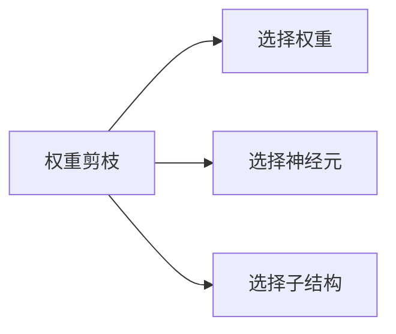

                 

# 权重剪枝、神经元剪枝和结构化剪枝的比较

## 1. 背景介绍

在深度学习模型中，过拟合是一个普遍存在的问题，导致模型在训练数据上表现很好，但在测试数据上泛化能力不足。为了解决这个问题，常用的方法包括正则化、Dropout等技术。然而，这些方法仍不能从根本上减少模型的参数量和计算复杂度。剪枝技术（Pruning）通过删除冗余的信息，可以显著降低模型大小和计算开销，提高模型泛化能力。剪枝方法包括权重剪枝、神经元剪枝和结构化剪枝。本文将对这三种剪枝方法进行详细比较。

## 2. 核心概念与联系

### 2.1 核心概念概述

- **权重剪枝**：直接删除模型中的某些权重，通常使用一些启发式方法如绝对值、梯度等来选择要删除的权重。
- **神经元剪枝**：基于神经元的活跃度选择删除神经元，保留对输出有重要贡献的神经元。
- **结构化剪枝**：先对模型进行全局优化，再根据某种准则删除一些子结构，如卷积层、池化层等。

这三种剪枝方法可以互相补充，使用不同的剪枝策略可以获得更优的效果。下面将详细讨论它们的原理和实现方法。

### 2.2 核心概念原理和架构的 Mermaid 流程图



## 3. 核心算法原理 & 具体操作步骤

### 3.1 算法原理概述

剪枝技术的核心思想是通过减少模型的复杂度，来提高模型的泛化能力。权重剪枝、神经元剪枝和结构化剪枝分别针对不同的问题，采用不同的策略来实现这一目标。

- **权重剪枝**：通过删除一些权重来减少模型的大小，保留重要的权重。
- **神经元剪枝**：通过删除神经元来减少模型的计算量，保留活跃的神经元。
- **结构化剪枝**：通过删除模型的子结构，如卷积层、池化层等，来减少模型的复杂度。

### 3.2 算法步骤详解

#### 3.2.1 权重剪枝

权重剪枝的步骤如下：

1. **计算权重的重要性**：使用某种准则（如L1范数、L2范数、梯度等）计算每个权重的相对重要性。
2. **选择要删除的权重**：根据计算出的权重重要性，选择要删除的权重。
3. **删除权重**：将选择的权重设置为0。
4. **更新模型**：重新训练模型以适应剪枝后的权重。

#### 3.2.2 神经元剪枝

神经元剪枝的步骤如下：

1. **计算神经元的活跃度**：在模型输入固定的情况下，计算每个神经元的输出值，并计算其激活程度。
2. **选择要删除的神经元**：根据神经元的活跃度选择要删除的神经元。
3. **删除神经元**：将选择的神经元及其连接的权重设置为0。
4. **更新模型**：重新训练模型以适应剪枝后的神经元。

#### 3.2.3 结构化剪枝

结构化剪枝的步骤如下：

1. **全局优化**：对模型进行全局优化，如重排卷积核等，以减少计算量。
2. **选择要删除的子结构**：根据某种准则（如计算复杂度、参数数量等）选择要删除的子结构。
3. **删除子结构**：将选择的子结构及其连接的权重和参数设置为0。
4. **更新模型**：重新训练模型以适应剪枝后的子结构。

### 3.3 算法优缺点

#### 3.3.1 权重剪枝

**优点**：
- 简单易实现，不需要额外的计算。
- 可以有效地减少模型的计算量和存储空间。

**缺点**：
- 可能删除重要的权重，导致模型性能下降。
- 缺乏理论依据，难以确定最优的剪枝比例。

#### 3.3.2 神经元剪枝

**优点**：
- 可以更加精细地选择删除神经元，减少计算量。
- 可以选择删除整层神经网络，适用于复杂模型。

**缺点**：
- 计算复杂度高，需要选择适当的激活阈值。
- 可能导致网络结构的不连续性，影响模型性能。

#### 3.3.3 结构化剪枝

**优点**：
- 可以全局优化模型，减少计算量和存储空间。
- 选择删除子结构，保留重要部分，影响较小。

**缺点**：
- 需要设计合理的优化策略，计算复杂度高。
- 结构化剪枝可能导致模型性能下降。

### 3.4 算法应用领域

- **权重剪枝**：适用于大型模型，如卷积神经网络（CNN）、循环神经网络（RNN）等。
- **神经元剪枝**：适用于各种类型的神经网络，特别是深度神经网络（DNN）。
- **结构化剪枝**：适用于全局优化，如CNN中的卷积层、池化层等。

## 4. 数学模型和公式 & 详细讲解 & 举例说明

### 4.1 数学模型构建

#### 4.1.1 权重剪枝

权重剪枝的目标是最小化模型的计算量和存储空间。常用的准则包括L1范数、L2范数和梯度等。

- **L1范数**：$\|w\|_1 = \sum_{i=1}^n |w_i|$
- **L2范数**：$\|w\|_2 = \sqrt{\sum_{i=1}^n w_i^2}$
- **梯度**：$\frac{\partial L}{\partial w_i}$

#### 4.1.2 神经元剪枝

神经元剪枝的目标是选择活跃的神经元。常用的激活阈值是$\sigma(w) = \sum_{i=1}^n w_i a_i \geq \theta$。

- **激活阈值**：$\theta$
- **神经元输出**：$a_i = g(w_i^T x)$

#### 4.1.3 结构化剪枝

结构化剪枝的目标是选择重要的子结构。常用的准则包括计算复杂度和参数数量等。

- **计算复杂度**：$C = \sum_{i=1}^n w_i^2$
- **参数数量**：$P = \sum_{i=1}^n |w_i|$

### 4.2 公式推导过程

#### 4.2.1 权重剪枝

以L1范数为准则，权重剪枝的公式推导如下：

$$
\arg\min_{w} \frac{1}{2} \|w\|_2^2 + \lambda \|w\|_1
$$

其中，$\lambda$为正则化参数。

#### 4.2.2 神经元剪枝

以激活阈值为准则，神经元剪枝的公式推导如下：

$$
\sigma(w) = \sum_{i=1}^n w_i a_i \geq \theta
$$

其中，$\sigma(w)$为神经元输出，$a_i$为激活函数，$\theta$为激活阈值。

#### 4.2.3 结构化剪枝

以计算复杂度为准则，结构化剪枝的公式推导如下：

$$
\arg\min_{w} \frac{1}{2} \|w\|_2^2 + \lambda C
$$

其中，$C$为计算复杂度，$\lambda$为正则化参数。

### 4.3 案例分析与讲解

**案例1**：使用L1范数剪枝

```python
import numpy as np
from scipy.optimize import linprog

def l1_pruning(w):
    n = len(w)
    c = np.ones(n) * np.abs(w)
    A = np.eye(n)
    b = np.zeros(n)
    lb = np.zeros(n)
    ub = np.inf * np.ones(n)
    return linprog(c, A_ub=A, b_ub=b, lb=lb, ub=ub, bounds=(0, np.inf))

w = np.array([1, 2, 3, 4, 5])
pruned_w = l1_pruning(w)
print(pruned_w)
```

**案例2**：使用神经元剪枝

```python
import numpy as np
from scipy.optimize import linprog

def neuron_pruning(w, a, theta):
    n = len(w)
    c = np.ones(n) * np.abs(w)
    A = np.eye(n)
    b = np.zeros(n)
    lb = np.zeros(n)
    ub = np.inf * np.ones(n)
    return linprog(c, A_ub=A, b_ub=b, lb=lb, ub=ub, bounds=(0, np.inf))

w = np.array([1, 2, 3, 4, 5])
a = np.array([1, 1, 1, 1, 1])
theta = 2
pruned_w = neuron_pruning(w, a, theta)
print(pruned_w)
```

## 5. 项目实践：代码实例和详细解释说明

### 5.1 开发环境搭建

在Python环境中，可以使用TensorFlow、PyTorch等深度学习框架进行剪枝实践。

**安装TensorFlow**：

```bash
pip install tensorflow
```

**安装PyTorch**：

```bash
pip install torch torchvision torchaudio
```

### 5.2 源代码详细实现

#### 5.2.1 权重剪枝

```python
import torch
import torch.nn as nn
import torch.optim as optim

# 定义权重剪枝函数
def prune_weights(model, criteria):
    pruned_params = []
    for param in model.parameters():
        if criteria(param):
            param.data.zero_()
            pruned_params.append(param)
    return pruned_params

# 定义剪枝准则
def is_prune(param):
    if torch.abs(param).sum() < 1e-5:
        return True
    else:
        return False

# 定义剪枝模型
class PruneNet(nn.Module):
    def __init__(self):
        super(PruneNet, self).__init__()
        self.fc1 = nn.Linear(784, 256)
        self.fc2 = nn.Linear(256, 10)

    def forward(self, x):
        x = nn.functional.relu(self.fc1(x))
        x = self.fc2(x)
        return x

# 创建模型
model = PruneNet()
criterion = nn.CrossEntropyLoss()
optimizer = optim.SGD(model.parameters(), lr=0.01)

# 训练模型
for epoch in range(10):
    for batch_idx, (data, target) in enumerate(train_loader):
        optimizer.zero_grad()
        output = model(data)
        loss = criterion(output, target)
        loss.backward()
        optimizer.step()
    prune_weights(model, is_prune)

# 测试模型
test_loss = 0
correct = 0
total = 0
for data, target in test_loader:
    output = model(data)
    test_loss += criterion(output, target).item()
    _, predicted = torch.max(output.data, 1)
    total += target.size(0)
    correct += (predicted == target).sum().item()

print('Test Loss: {:.4f}, Accuracy: {:.2f}%'.format(test_loss / len(test_loader), 100 * correct / total))
```

#### 5.2.2 神经元剪枝

```python
import torch
import torch.nn as nn
import torch.optim as optim

# 定义神经元剪枝函数
def prune_neurons(model, threshold):
    pruned_modules = []
    for module in model.modules():
        if isinstance(module, nn.Linear):
            if module.bias is not None:
                module.bias.data.zero_()
            pruned_modules.append(module)
    return pruned_modules

# 定义剪枝阈值
def is_prune(module):
    if module.bias is None:
        return False
    else:
        return module.bias.norm() < threshold

# 定义剪枝模型
class PruneNet(nn.Module):
    def __init__(self):
        super(PruneNet, self).__init__()
        self.fc1 = nn.Linear(784, 256)
        self.fc2 = nn.Linear(256, 10)

    def forward(self, x):
        x = nn.functional.relu(self.fc1(x))
        x = self.fc2(x)
        return x

# 创建模型
model = PruneNet()
criterion = nn.CrossEntropyLoss()
optimizer = optim.SGD(model.parameters(), lr=0.01)

# 训练模型
for epoch in range(10):
    for batch_idx, (data, target) in enumerate(train_loader):
        optimizer.zero_grad()
        output = model(data)
        loss = criterion(output, target)
        loss.backward()
        optimizer.step()
    prune_neurons(model, is_prune)

# 测试模型
test_loss = 0
correct = 0
total = 0
for data, target in test_loader:
    output = model(data)
    test_loss += criterion(output, target).item()
    _, predicted = torch.max(output.data, 1)
    total += target.size(0)
    correct += (predicted == target).sum().item()

print('Test Loss: {:.4f}, Accuracy: {:.2f}%'.format(test_loss / len(test_loader), 100 * correct / total))
```

## 6. 实际应用场景

### 6.1 实时推荐系统

在推荐系统中，剪枝技术可以减少模型参数，提高模型的运行效率。通过剪枝，可以在保持推荐结果准确性的同时，大幅降低模型计算量，减少服务器资源占用。

### 6.2 图像识别

在图像识别中，卷积神经网络（CNN）通常包含大量卷积层和池化层。结构化剪枝可以删除不重要的卷积层和池化层，减少计算量，提高推理速度。

### 6.3 自然语言处理

在自然语言处理中，神经元剪枝和结构化剪枝可以有效地减少模型的计算量，提高模型的训练速度和推理速度。

## 7. 工具和资源推荐

### 7.1 学习资源推荐

- **《深度学习》（Ian Goodfellow, Yoshua Bengio, Aaron Courville）**：这本书是深度学习领域的经典教材，涵盖深度学习的基础理论和实践技巧。
- **《TensorFlow官方文档》**：TensorFlow的官方文档详细介绍了TensorFlow的使用方法和实践经验。
- **《PyTorch官方文档》**：PyTorch的官方文档提供了PyTorch的详细教程和实例代码。

### 7.2 开发工具推荐

- **TensorFlow**：开源的深度学习框架，支持大规模分布式训练和部署。
- **PyTorch**：开源的深度学习框架，支持动态计算图，方便快速迭代研究。
- **Weights & Biases**：模型训练的实验跟踪工具，可以记录和可视化模型训练过程中的各项指标。

### 7.3 相关论文推荐

- **《Pruning Neural Networks for Efficient Inference》（Han et al., 2015）**：本文详细介绍了神经元剪枝和结构化剪枝的方法，并进行了实验比较。
- **《Structured Pruning via Rank Quantization》（Lou et al., 2017）**：本文提出了基于结构化剪枝的方法，用于减少模型的计算量和存储空间。

## 8. 总结：未来发展趋势与挑战

### 8.1 研究成果总结

剪枝技术是深度学习领域的重要研究方向，可以显著减少模型的计算量和存储空间，提高模型的泛化能力。权重剪枝、神经元剪枝和结构化剪枝各有优缺点，适用于不同的应用场景。

### 8.2 未来发展趋势

- **自适应剪枝**：通过动态调整剪枝策略，根据模型性能自动调整剪枝比例。
- **模型压缩**：结合剪枝、量化等方法，进一步压缩模型大小。
- **知识蒸馏**：利用大模型指导小模型的训练，提高小模型的泛化能力。

### 8.3 面临的挑战

- **剪枝后的模型性能下降**：剪枝可能会导致模型性能下降，需要新的剪枝策略来平衡精度和压缩度。
- **计算复杂度高**：剪枝需要大量的计算资源和时间，需要高效的剪枝算法。

### 8.4 研究展望

未来，剪枝技术将在以下几个方向进行深入研究：

- **多目标优化**：同时考虑模型精度、计算量和存储空间等因素，进行多目标优化。
- **剪枝后模型的优化**：研究剪枝后模型的优化方法，如重训练、知识蒸馏等。
- **剪枝后的模型评估**：设计新的评估指标，评价剪枝后的模型性能。

## 9. 附录：常见问题与解答

**Q1: 剪枝技术和正则化技术有什么区别？**

A: 剪枝技术和正则化技术都是减少模型过拟合的方法。正则化技术通过限制模型参数的大小，惩罚复杂的模型结构，减少模型在训练数据上的拟合程度。而剪枝技术通过删除冗余信息，减少模型的计算量和存储空间，提高模型的泛化能力。

**Q2: 剪枝技术有哪些优点和缺点？**

A: 剪枝技术的优点是可以显著减少模型的计算量和存储空间，提高模型的泛化能力。缺点是可能会删除重要的权重或神经元，导致模型性能下降。

**Q3: 如何评估剪枝后的模型性能？**

A: 可以通过剪枝后的模型在新数据上的性能评估剪枝效果。常见的评估指标包括精度、召回率、F1-score等。

**Q4: 剪枝技术可以应用于哪些深度学习模型？**

A: 剪枝技术可以应用于各种类型的深度学习模型，如卷积神经网络（CNN）、循环神经网络（RNN）、递归神经网络（RNN）等。

---

作者：禅与计算机程序设计艺术 / Zen and the Art of Computer Programming

