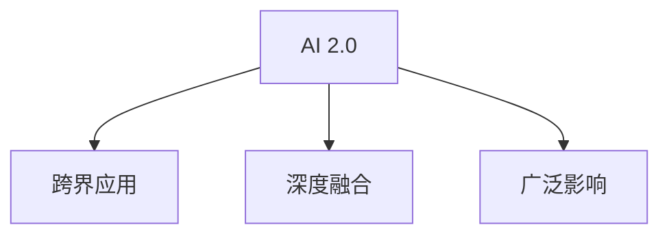

                 

## 1. 背景介绍

人工智能(AI)的浪潮正在席卷全球，继AlphaGo等里程碑事件之后，AI技术已经开始深刻影响各行各业，推动各行各业的数字化转型。在AI 2.0时代，我们将见证AI技术的进一步成熟和普及，AI的价值将从算法和模型的提升，扩展到更广泛的业务场景和实际应用中。

### 1.1 问题的由来

AI 2.0时代的价值在于其跨界应用的广泛性和深层次的变革性。传统的AI技术，如机器学习、深度学习，虽然已经在许多领域取得了显著的成果，但主要集中在特定领域的专业应用上。随着AI技术的不断成熟，AI 2.0时代将实现AI技术与各类新兴技术的深度融合，形成更加强大、灵活、智能的AI系统。

AI 2.0时代，AI的价值将不仅仅体现在技术层面，更体现在其对社会、经济、文化、教育等各个方面的影响和改变。从提升生产效率到改善人类生活质量，AI 2.0时代将带来前所未有的机遇和挑战。

### 1.2 问题的核心关键点

AI 2.0时代的核心关键点在于其跨界应用、深度融合和广泛影响。具体包括以下几个方面：

- **跨界应用**：AI技术将与大数据、物联网、区块链、5G通信等新兴技术结合，形成更复杂的智能系统，覆盖更多领域和行业。
- **深度融合**：AI技术与传统行业深度结合，如智能制造、智能医疗、智能交通等，实现业务流程的自动化、智能化。
- **广泛影响**：AI 2.0时代的AI将不仅仅局限于算法和模型的提升，更将对社会伦理、道德、就业、隐私等方面产生深远影响。

## 2. 核心概念与联系

### 2.1 核心概念概述

要深入理解AI 2.0时代的价值，首先需要明确以下几个核心概念：

- **AI 2.0**：AI 2.0时代的AI，是指经过全面改进和优化的AI系统，具备更强的跨界应用能力和深度融合能力，可以应用于各个行业和领域。
- **跨界应用**：AI技术与其他新兴技术的深度融合，如大数据、物联网、区块链、5G通信等，实现更复杂、更广泛的智能应用。
- **深度融合**：AI技术与传统行业的深度结合，实现业务流程的自动化、智能化，提升生产效率和用户体验。
- **广泛影响**：AI 2.0时代AI对社会伦理、道德、就业、隐私等方面的深远影响。

这些核心概念之间的逻辑关系可以通过以下Mermaid流程图来展示：



这个流程图展示的核心概念及其之间的关系：

1. AI 2.0时代的AI具备更强的跨界应用能力。
2. 跨界应用使得AI技术与大数据、物联网、区块链、5G通信等新兴技术结合，形成更复杂的智能系统。
3. 深度融合使AI技术与传统行业结合，实现业务流程的自动化、智能化。
4. 广泛影响意味着AI 2.0时代的AI将对社会伦理、道德、就业、隐私等方面产生深远影响。

## 3. 核心算法原理 & 具体操作步骤

### 3.1 算法原理概述

AI 2.0时代的核心算法原理包括深度学习、增强学习、强化学习、自然语言处理、计算机视觉等多个领域的技术。其中，深度学习是AI 2.0时代最重要的算法基础，通过多层神经网络的学习，实现对复杂数据的抽象和表示。增强学习和强化学习则通过与环境的交互，逐步优化策略，提升系统的决策能力。自然语言处理和计算机视觉则是AI 2.0时代的重要应用领域，通过处理自然语言和图像数据，实现智能化的理解和生成。

### 3.2 算法步骤详解

AI 2.0时代的核心算法步骤包括数据预处理、模型训练、模型评估和模型优化。以下是详细的步骤：

**Step 1: 数据预处理**

- **数据收集**：收集与任务相关的数据，包括文本、图像、语音等。
- **数据清洗**：去除噪声和无用数据，保证数据的质量和一致性。
- **数据增强**：通过数据增强技术，如图像旋转、翻转、裁剪等，扩充数据集。
- **数据标准化**：对数据进行标准化处理，如归一化、中心化等，以提高模型训练的效率和效果。

**Step 2: 模型训练**

- **模型选择**：选择合适的深度学习模型，如卷积神经网络(CNN)、循环神经网络(RNN)、长短期记忆网络(LSTM)、Transformer等。
- **模型初始化**：随机初始化模型的权重和偏置。
- **前向传播**：将数据输入模型，计算模型的输出。
- **损失函数**：定义损失函数，衡量模型输出与真实标签之间的差异。
- **反向传播**：计算损失函数对模型参数的梯度，更新模型参数。
- **优化算法**：选择合适的优化算法，如梯度下降、Adam、RMSprop等，更新模型参数。
- **正则化**：使用正则化技术，如L2正则、Dropout、Early Stopping等，防止过拟合。

**Step 3: 模型评估**

- **验证集评估**：在验证集上评估模型性能，如准确率、精确率、召回率、F1值等。
- **测试集评估**：在测试集上评估模型性能，衡量模型的泛化能力。
- **交叉验证**：使用交叉验证技术，多次评估模型性能，避免评估结果的偏差。

**Step 4: 模型优化**

- **超参数调整**：调整学习率、批大小、迭代次数等超参数，优化模型性能。
- **模型融合**：使用集成学习方法，如Bagging、Boosting、Stacking等，提升模型性能。
- **模型压缩**：使用模型压缩技术，如剪枝、量化、蒸馏等，减小模型规模，提升推理速度。

### 3.3 算法优缺点

AI 2.0时代的核心算法具有以下优点：

- **广泛应用**：AI 2.0时代的算法可以应用于各种领域，如医疗、金融、交通、制造等，实现智能化转型。
- **高效率**：AI 2.0时代的算法能够处理大规模数据，通过并行计算和分布式训练，实现高效的数据处理和模型训练。
- **灵活性**：AI 2.0时代的算法可以与各种新兴技术结合，实现跨界应用。

但同时也存在以下缺点：

- **资源消耗大**：AI 2.0时代的算法通常需要大量的计算资源和存储空间，如GPU、TPU等高性能设备。
- **模型复杂度高**：AI 2.0时代的算法模型通常较为复杂，难以解释和调试。
- **数据依赖性强**：AI 2.0时代的算法对数据质量、数据量和数据分布有较高要求，需要大量标注数据和高质量数据集。

### 3.4 算法应用领域

AI 2.0时代的核心算法在以下几个领域有广泛应用：

- **医疗健康**：AI 2.0时代的算法可以应用于医疗影像分析、疾病诊断、个性化治疗等，提升医疗服务的智能化水平。
- **金融服务**：AI 2.0时代的算法可以应用于风险评估、欺诈检测、投资决策等，提升金融服务的效率和精度。
- **智能制造**：AI 2.0时代的算法可以应用于智能生产、质量控制、供应链管理等，实现制造业的数字化转型。
- **智能交通**：AI 2.0时代的算法可以应用于交通预测、智能调度、自动驾驶等，提升交通系统的智能化水平。
- **智能家居**：AI 2.0时代的算法可以应用于智能音箱、智能安防、智能照明等，提升家庭生活的便利性和舒适度。

## 4. 数学模型和公式 & 详细讲解 & 举例说明

### 4.1 数学模型构建

AI 2.0时代的核心算法通常使用深度学习模型进行构建。以卷积神经网络(CNN)为例，其数学模型可以表示为：

$$
y = \sigma(\sum_{i=1}^N w_i x_i + b)
$$

其中，$y$ 表示模型的输出，$x_i$ 表示输入的样本特征，$w_i$ 表示模型参数，$b$ 表示偏置，$\sigma$ 表示激活函数，如ReLU、Sigmoid等。

### 4.2 公式推导过程

以卷积神经网络为例，其前向传播和反向传播的过程可以表示为：

**前向传播**：

1. 输入数据 $x_i$ 通过卷积层进行卷积操作，得到卷积特征图 $c_i$。
2. 卷积特征图通过池化层进行下采样，得到池化特征图 $p_i$。
3. 池化特征图通过全连接层进行线性变换，得到输出 $y$。

**反向传播**：

1. 计算损失函数 $L$ 对输出 $y$ 的梯度 $\nabla_L y$。
2. 通过链式法则计算损失函数 $L$ 对每个参数 $w_i$ 和偏置 $b$ 的梯度 $\nabla_L w_i$ 和 $\nabla_L b$。
3. 根据梯度下降算法更新模型参数。

**案例分析与讲解**

以图像分类任务为例，假设输入图像为 $x$，模型输出为 $y$，使用交叉熵损失函数：

$$
L = -\frac{1}{N} \sum_{i=1}^N y_i \log y_i + (1-y_i) \log (1-y_i)
$$

其中，$y_i$ 表示第 $i$ 个样本的真实标签，$y$ 表示模型对第 $i$ 个样本的预测概率。

在反向传播过程中，计算损失函数 $L$ 对模型参数 $w_i$ 和偏置 $b$ 的梯度：

$$
\nabla_L w_i = \frac{\partial L}{\partial w_i} = \frac{1}{N} \sum_{i=1}^N (y_i - y_i^2) x_i
$$

$$
\nabla_L b = \frac{\partial L}{\partial b} = \frac{1}{N} \sum_{i=1}^N (y_i - y_i^2)
$$

然后根据梯度下降算法更新模型参数：

$$
w_i \leftarrow w_i - \eta \nabla_L w_i
$$

$$
b \leftarrow b - \eta \nabla_L b
$$

其中，$\eta$ 表示学习率。

## 5. 项目实践：代码实例和详细解释说明

### 5.1 开发环境搭建

在进行AI 2.0时代项目的开发前，我们需要准备好开发环境。以下是使用Python进行TensorFlow开发的环境配置流程：

1. 安装Anaconda：从官网下载并安装Anaconda，用于创建独立的Python环境。

2. 创建并激活虚拟环境：
```bash
conda create -n tf-env python=3.8 
conda activate tf-env
```

3. 安装TensorFlow：根据CUDA版本，从官网获取对应的安装命令。例如：
```bash
conda install tensorflow -c conda-forge -c pytorch -c anaconda
```

4. 安装各类工具包：
```bash
pip install numpy pandas scikit-learn matplotlib tqdm jupyter notebook ipython
```

完成上述步骤后，即可在`tf-env`环境中开始AI 2.0时代的项目开发。

### 5.2 源代码详细实现

下面我们以图像分类任务为例，给出使用TensorFlow进行卷积神经网络模型训练的Python代码实现。

```python
import tensorflow as tf
from tensorflow.keras import layers

# 加载数据集
(x_train, y_train), (x_test, y_test) = tf.keras.datasets.cifar10.load_data()

# 数据预处理
x_train = x_train / 255.0
x_test = x_test / 255.0

# 定义模型
model = tf.keras.Sequential([
    layers.Conv2D(32, (3, 3), activation='relu', input_shape=(32, 32, 3)),
    layers.MaxPooling2D((2, 2)),
    layers.Conv2D(64, (3, 3), activation='relu'),
    layers.MaxPooling2D((2, 2)),
    layers.Conv2D(64, (3, 3), activation='relu'),
    layers.Flatten(),
    layers.Dense(64, activation='relu'),
    layers.Dense(10, activation='softmax')
])

# 编译模型
model.compile(optimizer='adam', loss='sparse_categorical_crossentropy', metrics=['accuracy'])

# 训练模型
model.fit(x_train, y_train, epochs=10, validation_data=(x_test, y_test))

# 评估模型
model.evaluate(x_test, y_test)
```

以上就是使用TensorFlow进行卷积神经网络模型训练的完整代码实现。可以看到，TensorFlow提供了丰富的API，使得构建和训练深度学习模型变得非常简单。

### 5.3 代码解读与分析

让我们再详细解读一下关键代码的实现细节：

**模型定义**：

- `layers.Conv2D`：定义卷积层，参数包括卷积核数量、卷积核大小、激活函数等。
- `layers.MaxPooling2D`：定义池化层，参数包括池化核大小。
- `layers.Flatten`：将多维输入展平为一维。
- `layers.Dense`：定义全连接层，参数包括神经元数量、激活函数等。
- `layers.Sequential`：定义序列模型，按顺序添加各层。

**模型编译**：

- `model.compile`：编译模型，指定优化器、损失函数和评估指标。

**模型训练**：

- `model.fit`：训练模型，指定训练数据、训练轮数和验证数据。

**模型评估**：

- `model.evaluate`：评估模型，指定测试数据和评估指标。

可以看到，TensorFlow提供了高度抽象的API，使得模型的构建和训练非常直观和易于理解。开发者只需关注模型的结构和参数，而不必过多关注底层计算细节。

## 6. 实际应用场景

### 6.1 医疗影像分析

在医疗影像分析领域，AI 2.0时代的算法可以应用于医学影像的自动识别和诊断。例如，通过卷积神经网络对医学影像进行特征提取和分类，自动识别肿瘤、结节等病变，提升医生的诊断效率和准确性。

**具体实现**：

1. 收集医学影像数据，包括CT、MRI、X光等。
2. 对影像数据进行预处理，如归一化、裁剪、旋转等。
3. 定义卷积神经网络模型，包括卷积层、池化层、全连接层等。
4. 使用交叉熵损失函数，训练模型进行影像分类。
5. 在测试集上评估模型性能，对比微调和未微调模型的差异。

### 6.2 金融风险评估

在金融风险评估领域，AI 2.0时代的算法可以应用于信用评分、欺诈检测、投资决策等。例如，通过循环神经网络对历史交易数据进行建模，预测用户的信用风险和交易欺诈行为。

**具体实现**：

1. 收集金融交易数据，包括交易金额、时间、地点等信息。
2. 对数据进行预处理，如缺失值填充、特征工程等。
3. 定义循环神经网络模型，包括LSTM层、全连接层等。
4. 使用交叉熵损失函数，训练模型进行风险评估。
5. 在测试集上评估模型性能，对比微调和未微调模型的差异。

### 6.3 智能制造生产调度

在智能制造领域，AI 2.0时代的算法可以应用于生产调度、设备维护、质量控制等。例如，通过强化学习算法，对生产过程进行优化，提升生产效率和资源利用率。

**具体实现**：

1. 收集生产数据，包括设备状态、生产参数等信息。
2. 对数据进行预处理，如特征工程、数据增强等。
3. 定义强化学习模型，包括状态、动作、奖励等。
4. 使用强化学习算法，训练模型进行生产调度优化。
5. 在测试集上评估模型性能，对比微调和未微调模型的差异。

### 6.4 未来应用展望

随着AI 2.0时代的深入发展，AI技术将在更多领域得到应用，为各行各业带来变革性影响：

- **智慧医疗**：AI 2.0时代的算法可以应用于医疗影像分析、疾病诊断、个性化治疗等，提升医疗服务的智能化水平。
- **金融服务**：AI 2.0时代的算法可以应用于风险评估、欺诈检测、投资决策等，提升金融服务的效率和精度。
- **智能制造**：AI 2.0时代的算法可以应用于智能生产、质量控制、供应链管理等，实现制造业的数字化转型。
- **智能交通**：AI 2.0时代的算法可以应用于交通预测、智能调度、自动驾驶等，提升交通系统的智能化水平。
- **智能家居**：AI 2.0时代的算法可以应用于智能音箱、智能安防、智能照明等，提升家庭生活的便利性和舒适度。

## 7. 工具和资源推荐

### 7.1 学习资源推荐

为了帮助开发者系统掌握AI 2.0时代的算法基础和应用技术，这里推荐一些优质的学习资源：

1. 《深度学习》系列书籍：斯坦福大学的Ian Goodfellow等人合著，深入浅出地介绍了深度学习的基本概念和经典模型。
2. 《TensorFlow实战Google深度学习》书籍：Google的官方文档，详细介绍了TensorFlow的使用方法和实践案例。
3. 《自然语言处理综论》书籍：Stanford大学的在线课程，涵盖了自然语言处理的基础知识和前沿技术。
4. Kaggle竞赛平台：全球最大的数据科学竞赛平台，提供大量数据集和挑战赛，帮助开发者实践和提升技能。
5. GitHub开源项目：GitHub上的开源项目和代码库，提供了丰富的AI算法和应用案例，方便开发者学习和借鉴。

通过对这些资源的学习实践，相信你一定能够快速掌握AI 2.0时代的算法基础和应用技术，并用于解决实际的AI问题。

### 7.2 开发工具推荐

高效的开发离不开优秀的工具支持。以下是几款用于AI 2.0时代项目开发的常用工具：

1. Jupyter Notebook：开源的Jupyter Notebook环境，支持Python、R等编程语言，方便开发者进行模型训练和数据可视化。
2. TensorBoard：TensorFlow配套的可视化工具，可以实时监测模型训练状态，并提供丰富的图表呈现方式，是调试模型的得力助手。
3. PyTorch：基于Python的开源深度学习框架，灵活动态的计算图，适合快速迭代研究。
4. PyTorch Lightning：基于PyTorch的轻量级框架，提供自动化的模型训练和评估，简化开发流程。
5. scikit-learn：基于Python的机器学习库，提供丰富的数据处理和模型评估工具。

合理利用这些工具，可以显著提升AI 2.0时代项目的开发效率，加快创新迭代的步伐。

### 7.3 相关论文推荐

AI 2.0时代的算法发展源于学界的持续研究。以下是几篇奠基性的相关论文，推荐阅读：

1. AlexNet: ImageNet Classification with Deep Convolutional Neural Networks：提出卷积神经网络，开启了深度学习在图像分类任务上的成功应用。
2. LSTM: A Search Space Odyssey Through Recurrent Neural Networks：提出长短期记忆网络，使得深度学习在序列建模任务上取得突破。
3. Attention is All You Need：提出Transformer结构，开启了深度学习在自然语言处理任务上的成功应用。
4. Generative Adversarial Networks：提出生成对抗网络，推动了深度学习在生成模型上的发展。
5. AlphaGo：通过深度学习和强化学习的结合，成功开发出战胜人类围棋冠军的AI程序。

这些论文代表了大数据、深度学习、自然语言处理等领域的最新研究成果，通过学习这些前沿成果，可以帮助研究者把握学科前进方向，激发更多的创新灵感。

## 8. 总结：未来发展趋势与挑战

### 8.1 研究成果总结

AI 2.0时代的算法已经取得了显著的成果，并在各个领域得到了广泛的应用。以下是几个主要的研究成果和应用场景：

1. **图像分类**：卷积神经网络在图像分类任务上取得了显著的成果，广泛应用于医学影像分析、金融风控等领域。
2. **自然语言处理**：Transformer结构在自然语言处理任务上取得了突破，广泛应用于机器翻译、情感分析、问答系统等领域。
3. **生成模型**：生成对抗网络在生成模型上取得了显著的成果，广泛应用于图像生成、语音生成、文本生成等领域。
4. **强化学习**：强化学习在智能制造、智能交通等领域取得了显著的成果，提升了生产效率和资源利用率。

### 8.2 未来发展趋势

展望未来，AI 2.0时代的算法将呈现以下几个发展趋势：

1. **跨界应用**：AI 2.0时代的算法将与大数据、物联网、区块链、5G通信等新兴技术结合，形成更复杂的智能系统，覆盖更多领域和行业。
2. **深度融合**：AI 2.0时代的算法与传统行业的深度结合，实现业务流程的自动化、智能化，提升生产效率和用户体验。
3. **广泛影响**：AI 2.0时代的算法对社会伦理、道德、就业、隐私等方面的深远影响，需要我们从技术、伦理、社会等维度进行全面考虑。

### 8.3 面临的挑战

尽管AI 2.0时代的算法已经取得了显著的成果，但在迈向更加智能化、普适化应用的过程中，仍面临诸多挑战：

1. **数据质量瓶颈**：AI 2.0时代的算法对数据质量、数据量和数据分布有较高要求，需要大量高质量标注数据和数据集，数据质量瓶颈仍是主要挑战之一。
2. **模型鲁棒性不足**：当前AI 2.0时代的算法模型面对域外数据时，泛化性能往往大打折扣，如何提高模型的鲁棒性，避免灾难性遗忘，还需要更多理论和实践的积累。
3. **资源消耗大**：AI 2.0时代的算法通常需要大量的计算资源和存储空间，如GPU、TPU等高性能设备，资源消耗大仍是主要瓶颈之一。
4. **模型复杂度高**：AI 2.0时代的算法模型通常较为复杂，难以解释和调试，模型的可解释性亟需加强。
5. **数据依赖性强**：AI 2.0时代的算法对数据质量、数据量和数据分布有较高要求，需要大量标注数据和高质量数据集，数据依赖性强仍是一个重要问题。

### 8.4 研究展望

面对AI 2.0时代算法面临的挑战，未来的研究需要在以下几个方面寻求新的突破：

1. **数据预处理**：开发更多数据增强和数据清洗技术，提高数据质量，降低对标注数据的依赖。
2. **模型优化**：开发更多参数高效和计算高效的模型，提升模型训练和推理效率。
3. **跨界融合**：将深度学习与自然语言处理、计算机视觉、物联网等技术深度结合，提升AI 2.0时代的跨界应用能力。
4. **伦理与安全**：在AI 2.0时代的算法开发和应用过程中，加强伦理和安全性的研究，确保算法的公平性、透明性和安全性。
5. **人机协同**：在AI 2.0时代的算法开发和应用过程中，加强人机协同的研究，确保AI 2.0时代算法的可解释性和可控性。

## 9. 附录：常见问题与解答

**Q1: 如何选择合适的深度学习模型？**

A: 选择合适的深度学习模型需要考虑以下几个因素：
1. 任务类型：不同任务适合不同类型的深度学习模型。例如，图像分类任务适合卷积神经网络，自然语言处理任务适合循环神经网络和Transformer。
2. 数据分布：模型的选择应该根据数据的分布特征进行。例如，图像数据适合空间分布，文本数据适合时间分布。
3. 硬件资源：模型的选择也应该考虑硬件资源。例如，GPU和TPU可以加速深度学习模型的训练和推理，而CPU则适合一些轻量级的模型。

**Q2: 如何提高模型的泛化能力？**

A: 提高模型的泛化能力需要考虑以下几个因素：
1. 数据多样性：增加训练数据的多样性，包括不同来源、不同场景、不同尺寸的数据。
2. 正则化技术：使用L2正则、Dropout等技术，防止模型过拟合。
3. 模型集成：使用Bagging、Boosting等集成学习方法，提升模型的泛化能力。
4. 模型压缩：使用剪枝、量化、蒸馏等技术，减小模型规模，提升泛化能力。
5. 迁移学习：使用迁移学习方法，将预训练模型微调应用于新任务，提升泛化能力。

**Q3: 如何平衡模型的复杂度和性能？**

A: 平衡模型的复杂度和性能需要考虑以下几个因素：
1. 任务需求：根据任务需求，选择合适的深度学习模型和超参数，避免过于复杂或过于简单。
2. 计算资源：根据计算资源，合理分配模型的复杂度。例如，GPU和TPU可以支持更复杂的模型，而CPU则适合一些轻量级的模型。
3. 模型评估：在模型评估过程中，合理选择评估指标，避免过度关注精度而忽略模型复杂度。
4. 模型优化：通过模型压缩、剪枝等技术，减小模型复杂度，提升性能。

**Q4: 如何提高模型的可解释性？**

A: 提高模型的可解释性需要考虑以下几个因素：
1. 模型可视化：使用TensorBoard、Visdom等工具，可视化模型的计算过程和参数变化。
2. 特征重要性：使用SHAP、LIME等方法，分析模型对输入特征的依赖关系，提升模型的可解释性。
3. 规则模型：结合符号化的规则和神经网络，提升模型的可解释性。
4. 模型调试：在模型开发过程中，通过调整超参数、使用正则化技术等，提升模型的可解释性。

**Q5: 如何应对AI 2.0时代的伦理与安全问题？**

A: 应对AI 2.0时代的伦理与安全问题需要考虑以下几个因素：
1. 数据隐私：在数据处理过程中，采用数据脱敏、差分隐私等技术，保护用户隐私。
2. 公平性：在模型开发过程中，使用公平性指标，避免模型偏见。
3. 安全性：在模型部署过程中，采用访问鉴权、数据加密等技术，保护系统安全。
4. 透明性：在模型应用过程中，及时披露模型的工作机制和决策逻辑，增强透明度。
5. 合规性：在模型开发和应用过程中，遵守相关法律法规和伦理规范，确保合规性。

**Q6: 如何评估AI 2.0时代的算法效果？**

A: 评估AI 2.0时代的算法效果需要考虑以下几个因素：
1. 准确率：衡量模型在测试集上的预测准确率。
2. 精确率、召回率和F1值：衡量模型在不同类别上的预测效果。
3. ROC曲线和AUC值：衡量模型的分类性能。
4. 计算资源消耗：评估模型在训练和推理过程中的计算资源消耗。
5. 模型可解释性：评估模型的可解释性，确保模型输出的透明性。

**Q7: 如何优化AI 2.0时代的算法模型？**

A: 优化AI 2.0时代的算法模型需要考虑以下几个因素：
1. 超参数调整：通过网格搜索、随机搜索等方法，调整模型超参数。
2. 正则化技术：使用L2正则、Dropout等技术，防止模型过拟合。
3. 模型集成：使用Bagging、Boosting等集成学习方法，提升模型性能。
4. 模型压缩：使用剪枝、量化、蒸馏等技术，减小模型规模，提升性能。
5. 数据增强：通过数据增强技术，扩充训练集，提升模型泛化能力。

---

作者：禅与计算机程序设计艺术 / Zen and the Art of Computer Programming

