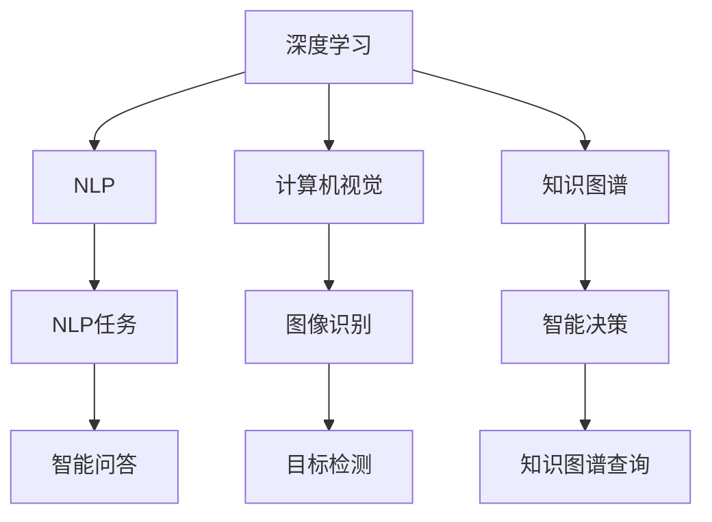

                 

# 李开复：AI 2.0 时代的商业价值

在人工智能（AI）迅猛发展的今天，我们正处在一个前所未有的历史节点——AI 2.0 时代。AI 2.0 不仅是技术的突破，更是商业模式的革命。本文将深入探讨AI 2.0时代的商业价值，揭示其对各行各业的影响和潜力。

## 1. 背景介绍

### 1.1 什么是AI 2.0
AI 1.0 时代主要关注于机器学习算法的研发，而AI 2.0 则是在AI 1.0的基础上，通过更深层次的AI技术（如深度学习、自然语言处理、计算机视觉等），实现更加智能的自动化、自主学习和复杂决策能力。AI 2.0的核心在于知识的表达、推理和应用，旨在构建更加通用和泛化的智能系统。

### 1.2 为什么AI 2.0具有商业价值
AI 2.0 通过提供更加智能化的解决方案，能够显著提升企业的生产效率、降低成本、增强竞争力。具体而言，AI 2.0 可以从以下几个方面创造商业价值：

- **效率提升**：通过自动化和智能化操作，减少人工干预，大幅提高生产和服务效率。
- **成本节约**：利用AI算法优化资源配置，降低运营成本，实现节能减排。
- **市场拓展**：通过个性化推荐、精准营销等手段，扩大市场覆盖和用户粘性。
- **风险控制**：利用预测分析和异常检测，提前识别和防范潜在风险，降低企业损失。
- **创新驱动**：AI 2.0 技术推动了产品和服务的创新，为市场带来新的增长点。

## 2. 核心概念与联系

### 2.1 核心概念概述

AI 2.0 技术体系包括但不限于以下概念：

- **深度学习**：通过多层神经网络结构，模拟人脑神经元处理信息的过程，实现复杂的模式识别和特征提取。
- **自然语言处理（NLP）**：使机器能够理解和生成人类语言，实现自动翻译、摘要、情感分析等功能。
- **计算机视觉**：使机器能够理解和分析图像、视频等视觉信息，实现图像识别、目标检测等任务。
- **知识图谱**：通过语义网络结构，将大量结构化或非结构化数据整合在一起，形成知识网络，辅助智能决策。
- **强化学习**：通过智能体与环境的交互，逐步优化决策策略，实现自主学习和智能控制。
- **多模态学习**：结合文本、图像、音频等多种数据模态，提高模型的感知能力和泛化能力。

### 2.2 核心概念联系
这些核心概念之间存在紧密的联系，共同构成了AI 2.0 的技术基础。例如，深度学习是AI 2.0的核心算法基础，用于模型训练和特征提取；NLP和计算机视觉是AI 2.0 在应用层面的重要分支，用于解决具体问题；知识图谱和强化学习则扩展了AI 2.0 的知识结构和决策能力。

以下Mermaid流程图展示了这些核心概念之间的联系：



## 3. 核心算法原理 & 具体操作步骤

### 3.1 算法原理概述
AI 2.0 的核心算法原理可以归纳为以下几个方面：

- **神经网络**：通过多层神经网络实现复杂的特征提取和模式识别。
- **卷积神经网络（CNN）**：适用于图像处理和计算机视觉任务，通过卷积操作提取局部特征。
- **循环神经网络（RNN）**：适用于序列数据的处理，如自然语言处理和语音识别。
- **注意力机制（Attention）**：用于增强模型对重要信息的关注，提升模型的性能。
- **自监督学习（Self-Supervised Learning）**：利用未标注数据进行预训练，提高模型的泛化能力。
- **迁移学习（Transfer Learning）**：将在大规模数据集上训练的模型应用于新任务，提高模型的适应性。

### 3.2 算法步骤详解

AI 2.0 的开发和应用步骤通常包括以下几个环节：

1. **数据收集**：根据应用场景收集相关的数据集，进行预处理和清洗。
2. **模型训练**：选择合适的算法模型，利用标注数据进行训练，优化模型参数。
3. **模型评估**：在测试集上评估模型的性能，通过各种指标（如准确率、召回率、F1分数等）评估模型效果。
4. **模型部署**：将训练好的模型部署到生产环境中，进行实时推理和决策。
5. **模型监控**：实时监控模型的性能，根据反馈数据进行调整和优化。

### 3.3 算法优缺点

AI 2.0 技术具有以下优点：

- **高效性**：通过自动化和智能化的方式，显著提升生产和服务效率。
- **灵活性**：可根据不同应用场景，灵活选择和组合算法，实现定制化解决方案。
- **可扩展性**：能够随着数据和技术的进步，持续进行模型更新和迭代。

同时，AI 2.0 也存在一些缺点：

- **数据依赖**：需要大量的高质量标注数据进行训练，数据获取和处理成本较高。
- **模型复杂度**：模型结构复杂，训练和推理过程中需要较高的计算资源。
- **解释性不足**：部分AI 2.0 模型，如深度学习模型，难以解释其内部决策过程，增加了模型的可信度问题。
- **安全风险**：AI 2.0 模型可能存在偏见和歧视，在特定应用场景中可能产生不利影响。

### 3.4 算法应用领域

AI 2.0 技术广泛应用于各个行业，包括但不限于：

- **金融**：利用AI 2.0 技术进行风险控制、信用评估、投资决策等。
- **医疗**：通过AI 2.0 技术进行疾病预测、诊断、个性化治疗等。
- **制造**：利用AI 2.0 技术进行智能制造、质量控制、供应链优化等。
- **零售**：通过AI 2.0 技术进行客户分析、个性化推荐、库存管理等。
- **交通**：利用AI 2.0 技术进行智能交通管理、自动驾驶、车辆维护等。

## 4. 数学模型和公式 & 详细讲解 & 举例说明

### 4.1 数学模型构建

AI 2.0 技术涉及的数学模型非常广泛，这里以深度学习中的卷积神经网络（CNN）为例，介绍其基本模型结构。

CNN 主要由卷积层、池化层、全连接层等组成，其数学模型可以表示为：

$$
f(x) = W_1 \sigma_1(g(x)) + b_1
$$

其中，$g(x)$ 表示卷积核操作，$\sigma_1$ 表示激活函数，$W_1$ 和 $b_1$ 表示卷积层的权重和偏置。

### 4.2 公式推导过程

CNN 中最重要的部分是卷积层和池化层的操作。卷积层的公式推导如下：

$$
g(x) = \sum_{i=1}^{K} \sum_{j=1}^{K} w_{ij} x_{ij} + b
$$

其中，$K$ 表示卷积核的大小，$w_{ij}$ 表示卷积核的权重，$x_{ij}$ 表示输入数据的特征值，$b$ 表示偏置项。

池化层的主要目的是降低特征图的空间大小，公式推导如下：

$$
p = \frac{\max_i (f(x))}{\max_i (g(x))}
$$

其中，$p$ 表示池化后的输出值，$g(x)$ 表示卷积层的输出，$f(x)$ 表示池化层的输出。

### 4.3 案例分析与讲解

以图像分类任务为例，CNN 可以通过多层的卷积操作，逐步提取出图像的特征，并通过池化操作降低特征图的空间大小，最终通过全连接层进行分类预测。

## 5. 项目实践：代码实例和详细解释说明

### 5.1 开发环境搭建

在进行AI 2.0 项目实践前，我们需要准备好开发环境。以下是使用Python进行TensorFlow开发的配置流程：

1. 安装Anaconda：从官网下载并安装Anaconda，用于创建独立的Python环境。
2. 创建并激活虚拟环境：
```bash
conda create -n tf-env python=3.7 
conda activate tf-env
```
3. 安装TensorFlow：根据CUDA版本，从官网获取对应的安装命令。例如：
```bash
conda install tensorflow==2.4 -c conda-forge
```
4. 安装各类工具包：
```bash
pip install numpy pandas scikit-learn matplotlib tqdm jupyter notebook ipython
```

完成上述步骤后，即可在`tf-env`环境中开始AI 2.0项目实践。

### 5.2 源代码详细实现

这里我们以图像分类任务为例，给出使用TensorFlow实现CNN模型的代码实现。

首先，定义CNN模型：

```python
import tensorflow as tf
from tensorflow.keras import layers

model = tf.keras.Sequential([
    layers.Conv2D(32, (3, 3), activation='relu', input_shape=(32, 32, 3)),
    layers.MaxPooling2D((2, 2)),
    layers.Conv2D(64, (3, 3), activation='relu'),
    layers.MaxPooling2D((2, 2)),
    layers.Flatten(),
    layers.Dense(64, activation='relu'),
    layers.Dense(10)
])
```

然后，编译模型：

```python
model.compile(optimizer='adam',
              loss=tf.keras.losses.SparseCategoricalCrossentropy(from_logits=True),
              metrics=['accuracy'])
```

接着，训练模型：

```python
model.fit(train_images, train_labels, epochs=10, 
          validation_data=(val_images, val_labels))
```

最后，评估模型：

```python
test_loss, test_acc = model.evaluate(test_images, test_labels)
print('Test accuracy:', test_acc)
```

以上就是使用TensorFlow进行CNN图像分类任务的完整代码实现。可以看到，TensorFlow提供了丰富的API和工具，可以方便地实现各种AI 2.0模型。

### 5.3 代码解读与分析

让我们再详细解读一下关键代码的实现细节：

**Sequential类**：
- 定义了模型的层级结构，逐层构建模型。
- 可以使用add()方法添加新的层，或使用LayerList()手动定义模型层级。

**Conv2D层**：
- 定义了二维卷积层，提取图像的局部特征。
- 通过指定卷积核大小、激活函数、输入形状等参数，实现卷积操作。

**MaxPooling2D层**：
- 定义了最大池化层，用于降低特征图的空间大小。
- 通过指定池化窗口大小等参数，实现池化操作。

**Flatten层**：
- 定义了展平层，将二维特征图展成一维向量。
- 通过指定输出维度等参数，实现展平操作。

**Dense层**：
- 定义了全连接层，进行特征的线性变换。
- 通过指定节点数、激活函数等参数，实现全连接操作。

可以看到，TensorFlow的API设计非常简洁，开发者可以轻松地构建各种AI 2.0模型。

## 6. 实际应用场景

### 6.1 智能客服系统

AI 2.0技术可以广泛应用于智能客服系统，通过自然语言处理和机器学习技术，实现智能对话和问题解答。例如，可以构建智能问答系统，实时响应客户咨询，自动生成个性化推荐，提升客户满意度。

在技术实现上，可以收集企业内部的历史客服对话记录，将问题和最佳答复构建成监督数据，在此基础上对预训练模型进行微调。微调后的模型能够自动理解用户意图，匹配最合适的答案模板进行回复。对于客户提出的新问题，还可以接入检索系统实时搜索相关内容，动态组织生成回答。如此构建的智能客服系统，能大幅提升客户咨询体验和问题解决效率。

### 6.2 金融舆情监测

AI 2.0技术在金融舆情监测方面也有重要应用。金融机构需要实时监测市场舆论动向，以便及时应对负面信息传播，规避金融风险。传统的人工监测方式成本高、效率低，难以应对网络时代海量信息爆发的挑战。基于AI 2.0 技术的文本分类和情感分析技术，为金融舆情监测提供了新的解决方案。

具体而言，可以收集金融领域相关的新闻、报道、评论等文本数据，并对其进行主题标注和情感标注。在此基础上对预训练语言模型进行微调，使其能够自动判断文本属于何种主题，情感倾向是正面、中性还是负面。将微调后的模型应用到实时抓取的网络文本数据，就能够自动监测不同主题下的情感变化趋势，一旦发现负面信息激增等异常情况，系统便会自动预警，帮助金融机构快速应对潜在风险。

### 6.3 个性化推荐系统

AI 2.0技术还可以用于个性化推荐系统。当前的推荐系统往往只依赖用户的历史行为数据进行物品推荐，无法深入理解用户的真实兴趣偏好。基于AI 2.0 技术的推荐系统可以更好地挖掘用户行为背后的语义信息，从而提供更精准、多样的推荐内容。

在实践中，可以收集用户浏览、点击、评论、分享等行为数据，提取和用户交互的物品标题、描述、标签等文本内容。将文本内容作为模型输入，用户的后续行为（如是否点击、购买等）作为监督信号，在此基础上微调预训练语言模型。微调后的模型能够从文本内容中准确把握用户的兴趣点。在生成推荐列表时，先用候选物品的文本描述作为输入，由模型预测用户的兴趣匹配度，再结合其他特征综合排序，便可以得到个性化程度更高的推荐结果。

### 6.4 未来应用展望

随着AI 2.0技术的发展，其在各行各业的应用前景将更加广阔。未来，AI 2.0 技术将进一步推动产业数字化、智能化转型，带来以下趋势：

1. **智能化程度提升**：AI 2.0 技术将使更多行业实现智能化，提升生产效率和服务质量。
2. **跨行业融合**：AI 2.0 技术将打破行业壁垒，实现跨行业的协同创新。
3. **人机协同**：AI 2.0 技术将使人类与机器协同工作，提升决策水平和工作效率。
4. **边缘计算普及**：AI 2.0 技术将推动边缘计算的发展，实现实时数据处理和决策。
5. **数据治理加强**：AI 2.0 技术将促进数据治理，提升数据质量和安全性。

## 7. 工具和资源推荐

### 7.1 学习资源推荐

为了帮助开发者系统掌握AI 2.0技术的理论基础和实践技巧，这里推荐一些优质的学习资源：

1. **《深度学习》书籍**：Ian Goodfellow 等人著作的经典教材，深入浅出地介绍了深度学习的基本概念和应用。
2. **CS231n《深度学习课程》**：斯坦福大学开设的计算机视觉课程，涵盖图像分类、目标检测等热门主题。
3. **NLPIR平台**：中文自然语言处理工具包，提供分词、词性标注、命名实体识别等自然语言处理功能。
4. **TensorFlow官方文档**：提供丰富的API文档和教程，方便开发者上手实践。
5. **Kaggle竞赛平台**：提供各种AI 2.0 领域的竞赛，帮助开发者提升实战能力。

通过对这些资源的学习实践，相信你一定能够快速掌握AI 2.0技术的精髓，并用于解决实际的商业问题。

### 7.2 开发工具推荐

高效的开发离不开优秀的工具支持。以下是几款用于AI 2.0项目开发的常用工具：

1. **PyTorch**：基于Python的开源深度学习框架，灵活动态的计算图，适合快速迭代研究。大部分预训练语言模型都有PyTorch版本的实现。
2. **TensorFlow**：由Google主导开发的开源深度学习框架，生产部署方便，适合大规模工程应用。同样有丰富的预训练语言模型资源。
3. **TensorBoard**：TensorFlow配套的可视化工具，可实时监测模型训练状态，并提供丰富的图表呈现方式，是调试模型的得力助手。
4. **Weights & Biases**：模型训练的实验跟踪工具，可以记录和可视化模型训练过程中的各项指标，方便对比和调优。
5. **Jupyter Notebook**：提供交互式的Python编程环境，便于开发者进行实验和交流。

合理利用这些工具，可以显著提升AI 2.0项目的开发效率，加快创新迭代的步伐。

### 7.3 相关论文推荐

AI 2.0技术的发展源于学界的持续研究。以下是几篇奠基性的相关论文，推荐阅读：

1. **ImageNet Classification with Deep Convolutional Neural Networks**：AlexNet论文，展示了深度卷积神经网络在图像分类任务中的巨大潜力。
2. **Attention is All You Need**：Transformer原论文，提出了自注意力机制，开创了基于Transformer的模型时代。
3. **BERT: Pre-training of Deep Bidirectional Transformers for Language Understanding**：BERT论文，提出预训练语言模型BERT，推动了自然语言处理技术的发展。
4. **SELU: A Self-Regularized Neural Network Activation Function**：提出SELU激活函数，解决了深度神经网络训练中的梯度消失问题。
5. **AlphaGo Zero: Mastering the Game of Go without Human Knowledge**：展示了AI 2.0在强化学习中的应用，AlphaGo Zero在零知识的情况下，通过自我对弈，达到了围棋世界冠军水平。

这些论文代表了大规模AI 2.0技术的发展脉络。通过学习这些前沿成果，可以帮助研究者把握学科前进方向，激发更多的创新灵感。

## 8. 总结：未来发展趋势与挑战

### 8.1 研究成果总结

AI 2.0技术在过去十年中取得了巨大的突破，已经广泛应用于各个行业，推动了产业的数字化、智能化转型。主要研究成果包括：

- **深度学习模型**：通过多层神经网络，实现了复杂的特征提取和模式识别。
- **自然语言处理**：使机器能够理解和生成人类语言，实现自动翻译、摘要、情感分析等功能。
- **计算机视觉**：使机器能够理解和分析图像、视频等视觉信息，实现图像识别、目标检测等任务。
- **知识图谱**：通过语义网络结构，将大量结构化或非结构化数据整合在一起，辅助智能决策。
- **强化学习**：通过智能体与环境的交互，逐步优化决策策略，实现自主学习和智能控制。
- **多模态学习**：结合文本、图像、音频等多种数据模态，提高模型的感知能力和泛化能力。

### 8.2 未来发展趋势

展望未来，AI 2.0技术将呈现以下几个发展趋势：

1. **高效性提升**：通过优化算法和模型结构，进一步提高AI 2.0模型的训练和推理效率。
2. **模型可解释性增强**：引入更多可解释的模型架构和工具，提升AI 2.0模型的可信度和透明性。
3. **跨领域融合**：将AI 2.0技术与物联网、大数据、区块链等技术进行深度融合，实现更广泛的应用场景。
4. **人机协作**：推动人机协作的新范式，提升AI 2.0系统在复杂环境下的决策能力。
5. **伦理和安全**：引入伦理和安全机制，确保AI 2.0系统的公平性、透明性和安全性。
6. **普适化应用**：推动AI 2.0技术在更多行业的应用，促进社会的可持续发展。

### 8.3 面临的挑战

尽管AI 2.0技术已经取得了显著成就，但在迈向更加智能化、普适化应用的过程中，仍面临诸多挑战：

1. **数据稀缺**：部分行业的数据获取和标注成本较高，难以获得充足的标注数据。
2. **模型复杂度**：AI 2.0模型结构复杂，训练和推理过程中需要较高的计算资源。
3. **解释性不足**：部分AI 2.0模型，如深度学习模型，难以解释其内部决策过程，增加了模型的可信度问题。
4. **安全风险**：AI 2.0模型可能存在偏见和歧视，在特定应用场景中可能产生不利影响。
5. **资源消耗大**：AI 2.0模型训练和推理需要消耗大量计算资源，导致成本较高。

### 8.4 研究展望

未来的研究需要在以下几个方面寻求新的突破：

1. **数据增强**：通过数据增强技术，提升数据的多样性和覆盖范围，降低数据稀缺问题。
2. **模型简化**：引入更加简单的模型架构和算法，提高模型的训练和推理效率。
3. **模型解释**：引入更多可解释的模型架构和工具，提升AI 2.0模型的透明性和可信度。
4. **跨模态融合**：将AI 2.0技术与多种模态数据进行融合，实现更广泛的应用场景。
5. **伦理和安全**：引入伦理和安全机制，确保AI 2.0系统的公平性、透明性和安全性。
6. **普适化应用**：推动AI 2.0技术在更多行业的应用，促进社会的可持续发展。

总之，AI 2.0技术将引领新一代人工智能的浪潮，推动各行业的数字化、智能化转型，带来全新的商业模式和应用场景。然而，AI 2.0技术的发展也面临着诸多挑战，需要各界共同努力，不断突破技术瓶颈，推动AI 2.0技术的普及和应用。

## 9. 附录：常见问题与解答

**Q1：AI 2.0与AI 1.0有何区别？**

A: AI 2.0与AI 1.0的主要区别在于模型的深度、复杂度和功能。AI 2.0使用深度学习等先进算法，能够处理更加复杂的数据和任务，具备自主学习和智能决策能力，而AI 1.0则主要依赖于规则和简单的统计模型。

**Q2：AI 2.0技术是否适合所有行业？**

A: AI 2.0技术适合大多数行业，但不同的行业需要根据自身特点，选择适合的AI 2.0技术和应用场景。例如，制造业适合使用AI 2.0进行质量控制和智能制造，而医疗行业适合使用AI 2.0进行疾病预测和个性化治疗。

**Q3：AI 2.0技术的难点在哪里？**

A: AI 2.0技术的难点主要在于数据获取、模型训练、模型解释和伦理安全等方面。数据获取需要耗费大量人力物力，模型训练需要高性能计算资源，模型解释需要更多的可解释性架构和工具，伦理安全则需要引入更多的机制和约束。

**Q4：AI 2.0技术的未来发展方向是什么？**

A: AI 2.0技术的未来发展方向包括高效性提升、模型可解释性增强、跨领域融合、人机协作、伦理和安全、普适化应用等方面。随着技术的不断进步，AI 2.0技术将进一步推动各行业的数字化、智能化转型，带来更多的应用场景和商业价值。

**Q5：AI 2.0技术的商业应用前景如何？**

A: AI 2.0技术的商业应用前景广阔，涉及智能客服、金融舆情、个性化推荐、智能制造等多个领域。随着技术的不断成熟和普及，AI 2.0技术将在更多行业得到应用，推动企业的数字化、智能化转型，带来更多的商业价值。

---

作者：禅与计算机程序设计艺术 / Zen and the Art of Computer Programming

