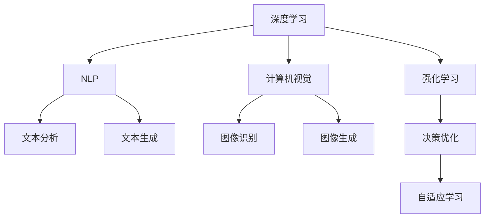

                 

## 1. 背景介绍

随着人工智能技术的飞速发展，AI已经从1.0时代的弱人工智能，逐步过渡到2.0时代的强人工智能。AI 2.0时代，人工智能不再局限于特定的应用领域，而是通过更强大的通用能力，支持各类创新应用，展现出更广泛的潜在价值。本文将从AI 2.0的背景和现状入手，探讨其在实际应用场景中的广泛前景。

## 2. 核心概念与联系

### 2.1 核心概念概述

AI 2.0时代，人工智能技术通过深度学习、自然语言处理、计算机视觉等前沿技术的融合，具备了更强大的自主学习能力和问题解决能力。以下是几个核心概念：

- **深度学习**：通过构建多层神经网络，模拟人脑的学习机制，从数据中自动学习到数据中的模式和规律。
- **自然语言处理(NLP)**：使机器能够理解、处理和生成人类语言，实现文本分析和生成。
- **计算机视觉(CV)**：使机器能够识别、理解图像和视频内容，并进行高精度的图像处理和分析。
- **强化学习**：通过与环境的交互，智能体通过不断的试错学习，优化决策策略，以达到最佳性能。

这些技术相互补充，共同构建了AI 2.0的技术基础。

### 2.2 核心概念原理和架构的 Mermaid 流程图



这个流程图展示了AI 2.0时代的关键技术及其相互关系。深度学习是基础，NLP和CV为关键应用，强化学习则扩展了机器学习的应用场景。

## 3. 核心算法原理 & 具体操作步骤

### 3.1 算法原理概述

AI 2.0时代，核心算法原理以深度学习和强化学习为主，兼顾NLP和CV等技术。深度学习通过多层神经网络学习数据特征，自然语言处理则利用语言模型、词向量等技术实现对自然语言的理解和生成，计算机视觉通过卷积神经网络等技术实现图像和视频的高精度识别和处理，强化学习通过与环境的交互，优化智能体的决策策略。

### 3.2 算法步骤详解

AI 2.0的应用开发通常遵循以下步骤：

1. **数据收集与预处理**：收集与任务相关的数据，并进行数据清洗、标注等预处理工作。
2. **模型选择与设计**：根据任务需求选择合适的深度学习模型或框架，并进行适当的修改和设计。
3. **模型训练与验证**：使用训练集对模型进行训练，并在验证集上验证模型性能，调整超参数。
4. **模型评估与部署**：在测试集上评估模型效果，并将模型部署到实际应用中。
5. **持续优化与迭代**：根据实际应用反馈，不断优化模型，迭代改进。

### 3.3 算法优缺点

AI 2.0技术具有以下优点：

- **强大的学习能力**：深度学习和强化学习算法具备强大的自适应学习能力，能够在大量数据下自动学习到复杂的特征和模式。
- **广泛的应用场景**：NLP、CV等技术的应用场景广泛，可以应用于语音识别、图像识别、自然语言处理等多个领域。
- **高效性**：AI 2.0模型往往使用GPU、TPU等高性能硬件，能够高效处理大规模数据。

同时，AI 2.0技术也存在以下缺点：

- **数据依赖性高**：AI 2.0模型需要大量的标注数据进行训练，标注成本较高。
- **可解释性不足**：深度学习模型通常被视为“黑盒”，难以解释其内部工作机制。
- **计算资源需求高**：大规模深度学习模型的训练和推理需要大量计算资源，成本较高。

### 3.4 算法应用领域

AI 2.0技术的应用领域广泛，涵盖医疗、金融、教育、制造等多个行业。以下是几个典型应用案例：

- **医疗诊断**：利用深度学习技术，对医学影像进行高精度分析和诊断，辅助医生进行疾病预测和治疗决策。
- **金融风险管理**：使用强化学习技术，对市场数据进行分析和预测，帮助金融机构识别风险并制定风险管理策略。
- **智能教育**：通过NLP技术，实现智能作业批改、智能推荐等教育辅助功能，提升教育效率和质量。
- **智能制造**：结合计算机视觉和机器学习技术，实现生产线的自动化监测和优化，提升生产效率和质量。

## 4. 数学模型和公式 & 详细讲解 & 举例说明

### 4.1 数学模型构建

AI 2.0的核心数学模型包括深度学习模型、卷积神经网络(CNN)、循环神经网络(RNN)、长短时记忆网络(LSTM)等。以卷积神经网络为例，其数学模型可以表示为：

$$
h_i = g(W_i^{(1)}x_i + b_i^{(1)})\\
o_i = \sigma(W_i^{(2)}h_i + b_i^{(2)})
$$

其中，$h_i$ 表示卷积层输出的特征图，$o_i$ 表示卷积层输出的特征图，$x_i$ 表示输入数据，$W_i^{(1)}$ 和 $b_i^{(1)}$ 表示卷积核和偏置项，$g$ 表示激活函数，$\sigma$ 表示Sigmoid激活函数。

### 4.2 公式推导过程

以深度学习中的反向传播算法为例，推导其核心公式：

1. **前向传播**：将输入数据 $x$ 依次通过每一层神经网络，计算输出 $y$。
2. **误差计算**：将 $y$ 与真实标签 $t$ 进行比较，计算误差 $\delta$。
3. **反向传播**：将误差 $\delta$ 依次通过每一层神经网络，计算每一层参数的梯度。

反向传播的公式推导如下：

$$
\delta^{(L)} = (y - t) \frac{\partial C}{\partial y}\\
\delta^{(l)} = \delta^{(l+1)} * \frac{\partial C}{\partial o^{(l+1)}}\\
w^{(l)} = w^{(l)} - \eta * \frac{1}{m} * \delta^{(l)} * x^{(l)}
$$

其中，$L$ 表示网络层数，$l$ 表示当前层数，$C$ 表示损失函数，$\eta$ 表示学习率，$m$ 表示训练样本数量。

### 4.3 案例分析与讲解

以图像识别为例，假设有一个简单的卷积神经网络，包含两个卷积层和两个全连接层。其输入为 $28 \times 28$ 的灰度图像，输出为10个类别的概率。使用MNIST数据集进行训练，损失函数为交叉熵。

1. **模型构建**：首先定义网络结构，包括卷积层、池化层、全连接层和激活函数等。
2. **数据预处理**：将MNIST数据集进行归一化、扩充、随机打乱等预处理操作。
3. **训练**：使用训练集进行前向传播和反向传播，更新模型参数。
4. **验证**：使用验证集评估模型性能，调整超参数。
5. **测试**：使用测试集评估模型最终效果。

## 5. 项目实践：代码实例和详细解释说明

### 5.1 开发环境搭建

AI 2.0项目开发通常需要使用深度学习框架，如TensorFlow、PyTorch等。以下以TensorFlow为例，介绍开发环境搭建过程：

1. **安装Python**：从官网下载并安装Python，推荐使用Anaconda。
2. **安装TensorFlow**：使用pip安装TensorFlow，设置版本。
3. **配置环境**：配置Python路径和环境变量，确保TensorFlow能够顺利运行。
4. **安装依赖库**：安装TensorFlow的依赖库，如numpy、scikit-learn等。

### 5.2 源代码详细实现

以图像识别为例，使用TensorFlow实现一个简单的卷积神经网络：

```python
import tensorflow as tf
from tensorflow.keras import layers

# 定义模型
model = tf.keras.Sequential([
    layers.Conv2D(32, (3, 3), activation='relu', input_shape=(28, 28, 1)),
    layers.MaxPooling2D((2, 2)),
    layers.Flatten(),
    layers.Dense(10, activation='softmax')
])

# 编译模型
model.compile(optimizer='adam', loss='sparse_categorical_crossentropy', metrics=['accuracy'])

# 训练模型
model.fit(train_images, train_labels, epochs=10, validation_data=(test_images, test_labels))

# 评估模型
test_loss, test_acc = model.evaluate(test_images, test_labels)
print('Test accuracy:', test_acc)
```

### 5.3 代码解读与分析

1. **模型定义**：使用Sequential模型定义卷积神经网络，包含卷积层、池化层和全连接层。
2. **模型编译**：选择Adam优化器，交叉熵损失函数，准确率作为评估指标。
3. **模型训练**：使用训练集进行前向传播和反向传播，更新模型参数，共训练10个epoch。
4. **模型评估**：使用测试集评估模型效果，输出准确率。

## 6. 实际应用场景

### 6.1 医疗诊断

AI 2.0技术在医疗诊断中得到广泛应用，通过深度学习算法对医学影像进行高精度分析和诊断。例如，使用卷积神经网络对肺部CT图像进行分类，能够快速识别肺癌等疾病，提高诊断效率和准确率。

### 6.2 金融风险管理

AI 2.0技术在金融风险管理中也具有重要应用。通过强化学习算法，对市场数据进行分析和预测，帮助金融机构识别风险并制定风险管理策略。例如，使用深度学习算法对股票价格进行预测，能够及时发现市场异常波动，降低投资风险。

### 6.3 智能教育

AI 2.0技术在智能教育中也有广泛应用。通过NLP技术，实现智能作业批改、智能推荐等教育辅助功能，提升教育效率和质量。例如，使用BERT模型对学生的作业进行批改，能够快速识别语法错误、语义错误等，提高批改效率和准确率。

### 6.4 智能制造

AI 2.0技术在智能制造中也有广泛应用。结合计算机视觉和机器学习技术，实现生产线的自动化监测和优化，提升生产效率和质量。例如，使用卷积神经网络对生产线上的产品质量进行检测，能够快速识别缺陷产品，提高生产线的自动化水平。

## 7. 工具和资源推荐

### 7.1 学习资源推荐

1. **《深度学习》（Ian Goodfellow等著）**：深度学习领域的经典教材，全面介绍了深度学习的基本概念和算法。
2. **《TensorFlow官方文档》**：TensorFlow的官方文档，提供了详细的API说明和示例代码。
3. **《PyTorch官方文档》**：PyTorch的官方文档，提供了详细的API说明和示例代码。
4. **《NLP综述》（Sebastian Ruder等著）**：NLP领域的综述文章，介绍了自然语言处理的基本概念和最新研究进展。
5. **《强化学习：一种现代方法》（Richard S. Sutton等著）**：强化学习领域的经典教材，介绍了强化学习的基本概念和算法。

### 7.2 开发工具推荐

1. **TensorFlow**：由Google开发的深度学习框架，支持GPU加速，适用于大规模深度学习模型。
2. **PyTorch**：由Facebook开发的深度学习框架，灵活高效，适用于研究和原型开发。
3. **Keras**：高层API，简化了深度学习模型的搭建和训练过程，适用于快速原型开发和实验。
4. **Jupyter Notebook**：交互式开发环境，支持Python代码的运行和展示。

### 7.3 相关论文推荐

1. **《ImageNet Classification with Deep Convolutional Neural Networks》**（Alex Krizhevsky等著）：深度学习领域的经典论文，介绍了使用卷积神经网络对图像进行分类的基本方法。
2. **《Attention Is All You Need》**（Ashish Vaswani等著）：自然语言处理领域的经典论文，介绍了Transformer模型的基本架构。
3. **《Playing Atari with Deep Reinforcement Learning》**（Vlad Mnih等著）：强化学习领域的经典论文，介绍了使用深度强化学习算法进行游戏AI的基本方法。

## 8. 总结：未来发展趋势与挑战

### 8.1 研究成果总结

AI 2.0技术在深度学习、自然语言处理、计算机视觉、强化学习等领域取得了诸多重要成果，广泛应用于医疗、金融、教育、制造等多个行业。其核心思想是通过强大的自主学习能力，解决复杂的任务和问题。

### 8.2 未来发展趋势

1. **模型的融合与优化**：未来AI 2.0技术将更加注重模型的融合与优化，将深度学习、自然语言处理、计算机视觉、强化学习等技术进行整合，提升模型的性能和应用效果。
2. **模型的可解释性**：未来AI 2.0技术将更加注重模型的可解释性，通过引入符号化的先验知识、因果分析等方法，提高模型的可解释性和可审计性。
3. **模型的自适应性**：未来AI 2.0技术将更加注重模型的自适应性，通过持续学习和在线学习等方法，提高模型的动态适应能力。
4. **模型的安全性**：未来AI 2.0技术将更加注重模型的安全性，通过引入伦理道德约束和风险管理机制，确保模型输出的安全性。

### 8.3 面临的挑战

1. **数据依赖性高**：AI 2.0模型需要大量的标注数据进行训练，标注成本较高。
2. **可解释性不足**：深度学习模型通常被视为“黑盒”，难以解释其内部工作机制。
3. **计算资源需求高**：大规模深度学习模型的训练和推理需要大量计算资源，成本较高。
4. **模型的安全性**：AI 2.0模型可能学习到有偏见、有害的信息，通过输出传递到实际应用，产生误导性、歧视性的输出，带来安全隐患。

### 8.4 研究展望

1. **无监督学习和半监督学习**：探索无监督学习和半监督学习方法，摆脱对大规模标注数据的依赖，利用自监督学习、主动学习等无监督和半监督范式，最大限度利用非结构化数据，实现更加灵活高效的微调。
2. **多模态学习**：将符号化的先验知识，如知识图谱、逻辑规则等，与神经网络模型进行巧妙融合，引导微调过程学习更准确、合理的语言模型。同时加强不同模态数据的整合，实现视觉、语音等多模态信息与文本信息的协同建模。
3. **伦理与安全性**：在模型训练目标中引入伦理导向的评估指标，过滤和惩罚有偏见、有害的输出倾向。同时加强人工干预和审核，建立模型行为的监管机制，确保输出符合人类价值观和伦理道德。

## 9. 附录：常见问题与解答

**Q1：AI 2.0技术是否适用于所有行业？**

A: AI 2.0技术可以应用于医疗、金融、教育、制造等多个行业，但其应用效果和可行性需要根据具体业务需求进行评估。

**Q2：AI 2.0技术开发过程中需要注意哪些问题？**

A: AI 2.0技术开发过程中需要注意以下几个问题：
1. 数据收集与预处理：确保数据的质量和多样性，避免数据泄露和偏见。
2. 模型选择与设计：根据业务需求选择合适的模型和算法，并进行适当的修改和设计。
3. 模型训练与验证：选择合适的超参数，避免过拟合和欠拟合。
4. 模型评估与部署：选择合适的评估指标，进行充分的测试和验证，确保模型的稳定性和准确性。
5. 持续优化与迭代：根据实际应用反馈，不断优化模型，迭代改进。

**Q3：AI 2.0技术在落地应用过程中需要注意哪些问题？**

A: AI 2.0技术在落地应用过程中需要注意以下几个问题：
1. 模型的裁剪与量化：去除不必要的层和参数，减小模型尺寸，加快推理速度。
2. 模型的服务化封装：将模型封装为标准化服务接口，便于集成调用。
3. 模型的弹性伸缩：根据请求流量动态调整资源配置，平衡服务质量和成本。
4. 模型的监控告警：实时采集系统指标，设置异常告警阈值，确保服务稳定性。
5. 模型的安全防护：采用访问鉴权、数据脱敏等措施，保障数据和模型安全。

作者：禅与计算机程序设计艺术 / Zen and the Art of Computer Programming

