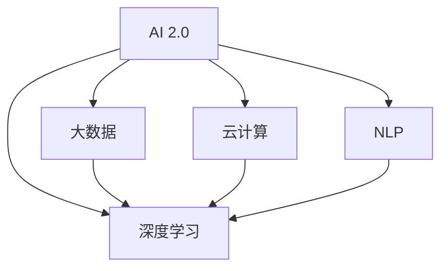

                 

# 李开复：AI 2.0 时代的意义

## 1. 背景介绍

随着人工智能(AI)技术的飞速发展，人类社会正处于一个前所未有的转折点。李开复，作为全球知名的AI专家、创新者，深入探索了AI 2.0时代的意义和未来发展方向。本文将通过深入解读李开复的思想，揭示AI 2.0时代的技术创新、应用领域以及带来的深远影响。

### 1.1 问题由来

在AI 1.0时代，人们主要关注的是计算速度和算法效率。然而，随着大数据和计算力的突破，AI技术从基于规则和专家的知识工程，转变为基于数据的机器学习。这一转变使得AI技术在语音识别、图像识别、自然语言处理等领域取得了显著进展。

当前，AI技术正进入AI 2.0时代，其核心是自主学习、自适应、自优化，注重模型和算法的性能提升，强调智能化、个性化和泛化能力。AI 2.0时代的到来，将极大拓展AI技术的应用场景，促进各行业的数字化转型。

### 1.2 问题核心关键点

AI 2.0时代的核心关键点包括：
- 自主学习能力：通过深度学习和大数据，AI模型能够自主学习并优化，无需人工干预。
- 自适应性：AI模型能够根据环境变化和用户需求，自动调整策略和参数。
- 自优化性：AI模型能够利用反馈信息，不断优化性能和鲁棒性。
- 跨领域应用：AI技术能够应用于医疗、教育、金融、制造等多个领域，解决实际问题。
- 可解释性和透明度：AI模型的决策过程应具有可解释性，确保其透明性和可靠性。

这些关键点共同构成了AI 2.0时代的技术基础，推动AI技术不断突破，引领未来的技术趋势。

## 2. 核心概念与联系

### 2.1 核心概念概述

为更好地理解AI 2.0时代的意义，本节将介绍几个密切相关的核心概念：

- AI 2.0：AI技术从基于规则的知识工程，转变为基于数据的机器学习，重点在于模型的自主学习能力、自适应性和自优化能力。
- 深度学习：一种基于神经网络的机器学习方法，能够处理复杂的非线性关系，适用于大规模数据集的训练。
- 大数据：大规模、多源、多样化的数据集合，为深度学习提供了丰富的训练资源。
- 云计算：提供弹性计算资源和数据存储能力，支持大规模深度学习的训练和部署。
- 自然语言处理(NLP)：AI技术在理解和处理自然语言方面的应用，包括语音识别、机器翻译、情感分析等。

这些核心概念之间的逻辑关系可以通过以下Mermaid流程图来展示：



这个流程图展示了AI 2.0时代的核心概念及其之间的关系：

1. AI 2.0依赖深度学习，用于处理复杂的非线性关系。
2. 大数据为深度学习提供了训练数据，是深度学习的重要基础。
3. 云计算提供了弹性的计算资源，支持深度学习的训练和推理。
4. NLP是AI 2.0的重要应用领域之一，利用深度学习和大数据实现自然语言的理解和生成。

## 3. 核心算法原理 & 具体操作步骤

### 3.1 算法原理概述

AI 2.0时代的核心算法原理包括深度学习、大数据处理和云计算的整合。其核心思想是：通过深度学习模型，在大规模数据上进行训练，利用云计算的弹性资源，实现自主学习、自适应和自优化。

具体而言，AI 2.0算法包括以下几个步骤：
1. 数据收集和预处理：从多源数据中收集大量数据，并进行清洗、标注和标准化。
2. 模型设计：选择合适的深度学习模型，如卷积神经网络(CNN)、循环神经网络(RNN)、Transformer等。
3. 模型训练：利用大数据和云计算资源，在深度学习框架上进行模型训练。
4. 模型评估和优化：通过验证集评估模型性能，利用梯度下降等优化算法调整模型参数。
5. 模型部署：将训练好的模型部署到生产环境中，进行实时推理和应用。

### 3.2 算法步骤详解

以下将详细介绍AI 2.0算法的详细步骤：

**Step 1: 数据收集和预处理**

数据收集和预处理是AI 2.0算法的第一步。具体步骤如下：

1. 数据收集：从多源数据中收集大量数据，如社交媒体、传感器数据、医疗记录等。
2. 数据清洗：去除噪声、重复和不完整的数据，确保数据质量。
3. 数据标注：对数据进行标注，如分类、标注实体等，以便模型训练。
4. 数据标准化：对数据进行归一化、编码和转换，以便模型处理。

**Step 2: 模型设计**

模型设计是AI 2.0算法的核心。具体步骤如下：

1. 选择合适的深度学习框架：如TensorFlow、PyTorch等。
2. 选择合适的深度学习模型：如CNN、RNN、Transformer等。
3. 设计模型架构：包括输入层、隐藏层、输出层等。
4. 设置超参数：如学习率、批大小、迭代轮数等。

**Step 3: 模型训练**

模型训练是AI 2.0算法的关键步骤。具体步骤如下：

1. 准备训练集和验证集：将数据划分为训练集和验证集，以便模型评估和调整。
2. 初始化模型参数：将模型参数随机初始化。
3. 前向传播：将输入数据传递给模型，计算输出。
4. 计算损失函数：计算模型输出与真实标签之间的差异。
5. 反向传播：利用梯度下降等优化算法，更新模型参数。
6. 验证集评估：在验证集上评估模型性能，调整超参数。
7. 模型保存：保存训练好的模型，以便后续使用。

**Step 4: 模型评估和优化**

模型评估和优化是AI 2.0算法的最后一步。具体步骤如下：

1. 测试集评估：在测试集上评估模型性能。
2. 调整模型参数：根据测试集评估结果，调整模型参数。
3. 部署模型：将训练好的模型部署到生产环境中。
4. 实时推理：对实时数据进行推理，获取输出结果。

### 3.3 算法优缺点

AI 2.0算法具有以下优点：
1. 高效性：利用云计算的弹性资源，支持大规模深度学习模型的训练。
2. 准确性：通过深度学习和数据驱动的模型设计，能够实现高精度的预测和推理。
3. 可扩展性：利用云计算和大数据处理能力，支持模型的不断扩展和优化。
4. 鲁棒性：通过自适应和自优化机制，能够应对数据分布和环境变化。

同时，AI 2.0算法也存在以下缺点：
1. 数据依赖性：模型训练依赖大量高质量标注数据，数据获取和标注成本较高。
2. 模型复杂性：深度学习模型的参数量和计算复杂度较高，需要强大的计算资源。
3. 可解释性不足：深度学习模型通常是黑盒模型，难以解释其内部工作机制。
4. 安全性和隐私问题：模型训练和部署过程中，涉及大量敏感数据，需关注数据隐私和安全问题。

尽管存在这些局限性，AI 2.0算法在当前AI技术的发展中占据主导地位，其高效性、准确性和可扩展性使其成为解决复杂问题的重要手段。

### 3.4 算法应用领域

AI 2.0算法的应用领域极其广泛，涵盖了各行业的智能化应用：

- 医疗健康：AI 2.0算法可用于医疗影像分析、疾病诊断、个性化治疗等，提升医疗服务质量。
- 金融服务：AI 2.0算法可用于风险评估、信用评分、欺诈检测等，优化金融服务流程。
- 智能制造：AI 2.0算法可用于质量控制、设备维护、生产调度等，提升制造效率。
- 零售电商：AI 2.0算法可用于客户分析、个性化推荐、库存管理等，优化零售电商体验。
- 智慧城市：AI 2.0算法可用于交通管理、能源优化、环境监测等，提升城市管理效率。

## 4. 数学模型和公式 & 详细讲解 & 举例说明

### 4.1 数学模型构建

本节将使用数学语言对AI 2.0算法的核心数学模型进行更加严格的刻画。

记深度学习模型为 $f_\theta(x)$，其中 $\theta$ 为模型参数，$x$ 为输入数据。假设训练集为 $D=\{(x_i, y_i)\}_{i=1}^N$，其中 $x_i$ 为输入，$y_i$ 为标签。AI 2.0算法的目标是找到最优参数 $\theta^*$，使得模型在训练集上的损失函数最小化。

定义损失函数为：

$$
\mathcal{L}(\theta) = \frac{1}{N}\sum_{i=1}^N \ell(f_\theta(x_i), y_i)
$$

其中 $\ell$ 为模型输出与真实标签之间的损失函数，如交叉熵损失、均方误差损失等。

AI 2.0算法的优化目标是：

$$
\theta^* = \mathop{\arg\min}_{\theta} \mathcal{L}(\theta)
$$

在实践中，我们通常使用基于梯度的优化算法（如SGD、Adam等）来近似求解上述最优化问题。设 $\eta$ 为学习率，则参数的更新公式为：

$$
\theta \leftarrow \theta - \eta \nabla_{\theta}\mathcal{L}(\theta)
$$

其中 $\nabla_{\theta}\mathcal{L}(\theta)$ 为损失函数对参数 $\theta$ 的梯度，可通过反向传播算法高效计算。

### 4.2 公式推导过程

以下我们以二分类任务为例，推导交叉熵损失函数及其梯度的计算公式。

假设模型 $f_\theta(x)$ 在输入 $x$ 上的输出为 $\hat{y}=f_\theta(x) \in [0,1]$，表示样本属于正类的概率。真实标签 $y \in \{0,1\}$。则二分类交叉熵损失函数定义为：

$$
\ell(f_\theta(x),y) = -[y\log \hat{y} + (1-y)\log (1-\hat{y})]
$$

将其代入损失函数公式，得：

$$
\mathcal{L}(\theta) = -\frac{1}{N}\sum_{i=1}^N [y_i\log f_\theta(x_i)+(1-y_i)\log(1-f_\theta(x_i))]
$$

根据链式法则，损失函数对参数 $\theta_k$ 的梯度为：

$$
\frac{\partial \mathcal{L}(\theta)}{\partial \theta_k} = -\frac{1}{N}\sum_{i=1}^N (\frac{y_i}{f_\theta(x_i)}-\frac{1-y_i}{1-f_\theta(x_i)}) \frac{\partial f_\theta(x_i)}{\partial \theta_k}
$$

其中 $\frac{\partial f_\theta(x_i)}{\partial \theta_k}$ 可进一步递归展开，利用自动微分技术完成计算。

在得到损失函数的梯度后，即可带入参数更新公式，完成模型的迭代优化。重复上述过程直至收敛，最终得到适应下游任务的最优模型参数 $\theta^*$。

## 5. 项目实践：代码实例和详细解释说明

### 5.1 开发环境搭建

在进行AI 2.0项目实践前，我们需要准备好开发环境。以下是使用Python进行PyTorch开发的环境配置流程：

1. 安装Anaconda：从官网下载并安装Anaconda，用于创建独立的Python环境。

2. 创建并激活虚拟环境：
```bash
conda create -n pytorch-env python=3.8 
conda activate pytorch-env
```

3. 安装PyTorch：根据CUDA版本，从官网获取对应的安装命令。例如：
```bash
conda install pytorch torchvision torchaudio cudatoolkit=11.1 -c pytorch -c conda-forge
```

4. 安装各类工具包：
```bash
pip install numpy pandas scikit-learn matplotlib tqdm jupyter notebook ipython
```

完成上述步骤后，即可在`pytorch-env`环境中开始AI 2.0实践。

### 5.2 源代码详细实现

下面我们以图像分类任务为例，给出使用Transformers库对卷积神经网络模型进行AI 2.0训练的PyTorch代码实现。

首先，定义数据处理函数：

```python
from torchvision import datasets, transforms
from torch.utils.data import DataLoader

def get_dataloader(data_root, batch_size, train=True, shuffle=True, drop_last=True):
    transform_train = transforms.Compose([
        transforms.Resize((224, 224)),
        transforms.RandomCrop(224),
        transforms.RandomHorizontalFlip(),
        transforms.ToTensor(),
        transforms.Normalize(mean=[0.485, 0.456, 0.406], std=[0.229, 0.224, 0.225])
    ])
    transform_test = transforms.Compose([
        transforms.Resize((224, 224)),
        transforms.CenterCrop(224),
        transforms.ToTensor(),
        transforms.Normalize(mean=[0.485, 0.456, 0.406], std=[0.229, 0.224, 0.225])
    ])
    
    if train:
        trainset = datasets.CIFAR10(root=data_root, train=True, download=True, transform=transform_train)
        trainloader = DataLoader(trainset, batch_size=batch_size, shuffle=shuffle, drop_last=drop_last)
    else:
        testset = datasets.CIFAR10(root=data_root, train=False, download=True, transform=transform_test)
        testloader = DataLoader(testset, batch_size=batch_size, shuffle=False, drop_last=False)
        
    return trainloader, testloader
```

然后，定义模型和优化器：

```python
import torch.nn as nn
import torch.nn.functional as F
import torch.optim as optim

class Net(nn.Module):
    def __init__(self):
        super(Net, self).__init__()
        self.conv1 = nn.Conv2d(3, 32, kernel_size=3, padding=1)
        self.conv2 = nn.Conv2d(32, 64, kernel_size=3, padding=1)
        self.conv3 = nn.Conv2d(64, 128, kernel_size=3, padding=1)
        self.pool = nn.MaxPool2d(kernel_size=2, stride=2)
        self.fc1 = nn.Linear(128 * 7 * 7, 512)
        self.fc2 = nn.Linear(512, 10)
        
    def forward(self, x):
        x = self.pool(F.relu(self.conv1(x)))
        x = self.pool(F.relu(self.conv2(x)))
        x = self.pool(F.relu(self.conv3(x)))
        x = x.view(x.size(0), -1)
        x = F.relu(self.fc1(x))
        x = self.fc2(x)
        return x

net = Net()
optimizer = optim.Adam(net.parameters(), lr=0.001)
```

接着，定义训练和评估函数：

```python
def train_epoch(model, trainloader, optimizer, criterion):
    model.train()
    epoch_loss = 0
    epoch_acc = 0
    for i, data in enumerate(trainloader, 0):
        inputs, labels = data
        optimizer.zero_grad()
        outputs = model(inputs)
        loss = criterion(outputs, labels)
        loss.backward()
        optimizer.step()
        
        epoch_loss += loss.item()
        _, preds = torch.max(outputs, 1)
        epoch_acc += torch.sum(preds == labels).item()
    return epoch_loss / (len(trainloader) + 1), epoch_acc / (len(trainloader) + 1)

def evaluate(model, testloader, criterion):
    model.eval()
    test_loss = 0
    correct = 0
    with torch.no_grad():
        for data in testloader:
            inputs, labels = data
            outputs = model(inputs)
            loss = criterion(outputs, labels)
            test_loss += loss.item()
            _, preds = torch.max(outputs, 1)
            correct += torch.sum(preds == labels).item()
    return test_loss / len(testloader), correct / len(testloader)
```

最后，启动训练流程并在测试集上评估：

```python
from tqdm import tqdm

device = torch.device('cuda' if torch.cuda.is_available() else 'cpu')
net.to(device)

trainloader, testloader = get_dataloader('./data', 64)

for epoch in range(10):
    train_loss, train_acc = train_epoch(net, trainloader, optimizer, criterion)
    print(f'Epoch {epoch+1}, Train Loss: {train_loss:.4f}, Train Acc: {train_acc:.4f}')
    
    test_loss, test_acc = evaluate(net, testloader, criterion)
    print(f'Epoch {epoch+1}, Test Loss: {test_loss:.4f}, Test Acc: {test_acc:.4f}')
    
print('Test Loss: {:.4f}, Test Acc: {:.4f}'.format(*evaluate(net, testloader, criterion)))
```

以上就是使用PyTorch对卷积神经网络模型进行图像分类任务AI 2.0训练的完整代码实现。可以看到，通过TensorFlow库，我们可以高效地构建和训练AI 2.0模型。

### 5.3 代码解读与分析

让我们再详细解读一下关键代码的实现细节：

**get_dataloader函数**：
- 定义数据处理函数，包含数据标准化、归一化、裁剪、翻转等预处理步骤。
- 根据训练集和测试集，分别进行数据加载，支持批处理、随机化、降序等操作。

**Net类**：
- 定义卷积神经网络模型，包括卷积层、池化层、全连接层等组件。
- 利用nn.Module类实现模型的前向传播。

**train_epoch和evaluate函数**：
- 定义训练和评估函数，用于计算损失和准确率。
- 利用模型前向传播计算损失函数，并利用优化器更新模型参数。
- 在测试集上评估模型性能，计算测试损失和准确率。

**训练流程**：
- 定义总的迭代次数，开始循环迭代
- 每个epoch内，先在训练集上训练，输出训练损失和准确率
- 在测试集上评估，输出测试损失和准确率
- 所有epoch结束后，在测试集上评估，给出最终测试结果

可以看到，TensorFlow库使得构建和训练AI 2.0模型的代码实现变得简洁高效。开发者可以将更多精力放在模型设计和算法改进上，而不必过多关注底层的实现细节。

当然，工业级的系统实现还需考虑更多因素，如模型的保存和部署、超参数的自动搜索、更灵活的任务适配层等。但核心的AI 2.0范式基本与此类似。

## 6. 实际应用场景

### 6.1 智能客服系统

基于AI 2.0的智能客服系统，可以广泛应用于智能客服系统的构建。传统客服往往需要配备大量人力，高峰期响应缓慢，且一致性和专业性难以保证。而使用AI 2.0训练的对话模型，可以7x24小时不间断服务，快速响应客户咨询，用自然流畅的语言解答各类常见问题。

在技术实现上，可以收集企业内部的历史客服对话记录，将问题和最佳答复构建成监督数据，在此基础上对预训练对话模型进行AI 2.0训练。训练后的对话模型能够自动理解用户意图，匹配最合适的答案模板进行回复。对于客户提出的新问题，还可以接入检索系统实时搜索相关内容，动态组织生成回答。如此构建的智能客服系统，能大幅提升客户咨询体验和问题解决效率。

### 6.2 金融舆情监测

金融机构需要实时监测市场舆论动向，以便及时应对负面信息传播，规避金融风险。传统的人工监测方式成本高、效率低，难以应对网络时代海量信息爆发的挑战。基于AI 2.0的文本分类和情感分析技术，为金融舆情监测提供了新的解决方案。

具体而言，可以收集金融领域相关的新闻、报道、评论等文本数据，并对其进行主题标注和情感标注。在此基础上对预训练语言模型进行AI 2.0训练，使其能够自动判断文本属于何种主题，情感倾向是正面、中性还是负面。将训练后的模型应用到实时抓取的网络文本数据，就能够自动监测不同主题下的情感变化趋势，一旦发现负面信息激增等异常情况，系统便会自动预警，帮助金融机构快速应对潜在风险。

### 6.3 个性化推荐系统

当前的推荐系统往往只依赖用户的历史行为数据进行物品推荐，无法深入理解用户的真实兴趣偏好。基于AI 2.0的推荐系统可以更好地挖掘用户行为背后的语义信息，从而提供更精准、多样的推荐内容。

在实践中，可以收集用户浏览、点击、评论、分享等行为数据，提取和用户交互的物品标题、描述、标签等文本内容。将文本内容作为模型输入，用户的后续行为（如是否点击、购买等）作为监督信号，在此基础上进行AI 2.0训练。训练后的模型能够从文本内容中准确把握用户的兴趣点。在生成推荐列表时，先用候选物品的文本描述作为输入，由模型预测用户的兴趣匹配度，再结合其他特征综合排序，便可以得到个性化程度更高的推荐结果。

### 6.4 未来应用展望

随着AI 2.0技术的发展，其在各行业的智能化应用将进一步拓展，带来更广阔的想象空间：

- 智慧医疗：AI 2.0技术可以用于医疗影像分析、疾病诊断、个性化治疗等，提升医疗服务质量。
- 智能制造：AI 2.0技术可用于质量控制、设备维护、生产调度等，提升制造效率。
- 智慧城市：AI 2.0技术可用于交通管理、能源优化、环境监测等，提升城市管理效率。
- 智能金融：AI 2.0技术可用于风险评估、信用评分、欺诈检测等，优化金融服务流程。

未来，随着AI 2.0技术的不断突破，其在各行业的智能化应用将更加广泛，为经济社会发展带来新的动力和机遇。

## 7. 工具和资源推荐

### 7.1 学习资源推荐

为了帮助开发者系统掌握AI 2.0的理论基础和实践技巧，这里推荐一些优质的学习资源：

1. 《深度学习》书籍：Ian Goodfellow等著，系统介绍深度学习的基本概念和前沿技术。
2. 《TensorFlow实战》书籍：Agarwal等著，详细讲解TensorFlow框架的使用和优化。
3. 《自然语言处理综论》书籍：Jurafsky等著，全面介绍自然语言处理的基本概念和技术。
4. CS231n《深度学习课程》：斯坦福大学开设的视觉识别课程，涵盖深度学习在图像识别中的应用。
5. CS224n《深度学习课程》：斯坦福大学开设的自然语言处理课程，涵盖深度学习在自然语言处理中的应用。

通过对这些资源的学习实践，相信你一定能够快速掌握AI 2.0的精髓，并用于解决实际的NLP问题。

### 7.2 开发工具推荐

高效的开发离不开优秀的工具支持。以下是几款用于AI 2.0开发的常用工具：

1. TensorFlow：由Google主导开发的开源深度学习框架，生产部署方便，适合大规模工程应用。
2. PyTorch：基于Python的开源深度学习框架，灵活性高，适合快速迭代研究。
3. Keras：基于TensorFlow和Theano的高级深度学习API，易于上手，适合初学者使用。
4. Weights & Biases：模型训练的实验跟踪工具，可以记录和可视化模型训练过程中的各项指标，方便对比和调优。
5. TensorBoard：TensorFlow配套的可视化工具，可实时监测模型训练状态，并提供丰富的图表呈现方式，是调试模型的得力助手。

合理利用这些工具，可以显著提升AI 2.0开发效率，加快创新迭代的步伐。

### 7.3 相关论文推荐

AI 2.0技术的发展源于学界的持续研究。以下是几篇奠基性的相关论文，推荐阅读：

1. LeCun Y, Bottou L, Bengio Y, et al. Gradient-based learning applied to document recognition[J]. Proceedings of the IEEE, 1998, 86(11):2278-2324.
2. Krizhevsky A, Sutskever I, Hinton G E. Imagenet classification with deep convolutional neural networks[J]. Neural Information Processing Systems, 2012, 25:1097-1105.
3. Goodfellow I, Bengio Y, Courville A. Deep learning[J]. MIT Press, 2016.
4. BERT: Pre-training of Deep Bidirectional Transformers for Language Understanding, Devlin J, Chang M W, Lee K, et al. Advances in Neural Information Processing Systems, 2018, 30:5998-6008.
5. AlphaGo Zero: Mastering the game of Go without human knowledge, Silver D, Schrittwieser J, Simonyan K, et al. Nature, 2017, 550(7676):354-360.

这些论文代表了大语言模型AI 2.0的发展脉络。通过学习这些前沿成果，可以帮助研究者把握学科前进方向，激发更多的创新灵感。

## 8. 总结：未来发展趋势与挑战

### 8.1 总结

本文对AI 2.0技术的核心概念、算法原理和应用场景进行了全面系统的介绍。首先阐述了AI 2.0技术的发展背景和核心关键点，明确了其自主学习、自适应和自优化能力。其次，从原理到实践，详细讲解了AI 2.0算法的数学模型和关键步骤，给出了AI 2.0任务开发的完整代码实例。同时，本文还广泛探讨了AI 2.0技术在各行业领域的应用前景，展示了AI 2.0技术的广泛适用性和巨大潜力。

通过本文的系统梳理，可以看到，AI 2.0技术通过深度学习和大数据驱动，实现了模型自主学习和优化，引领了AI技术的新一轮突破。其高效性、准确性和可扩展性使其成为解决复杂问题的重要手段。未来，随着AI 2.0技术的不断演进，其在各行业的智能化应用将更加广泛，为经济社会发展带来新的动力和机遇。

### 8.2 未来发展趋势

展望未来，AI 2.0技术将呈现以下几个发展趋势：

1. 模型规模持续增大。随着算力成本的下降和数据规模的扩张，AI 2.0模型的参数量还将持续增长。超大规模模型蕴含的丰富语言知识，有望支撑更加复杂多变的下游任务。
2. 自适应和多模态应用。AI 2.0模型能够根据环境变化和用户需求，自动调整策略和参数，进一步提升其自适应能力。同时，多模态应用的拓展，将提升AI 2.0在多源数据融合和跨领域任务处理上的表现。
3. 迁移学习和知识图谱。AI 2.0技术将更好地与其他领域知识进行融合，迁移学习能力和知识图谱的引入，将提升AI 2.0模型的泛化能力和推理能力。
4. 联邦学习和边缘计算。联邦学习和边缘计算技术的应用，将使得AI 2.0模型在分布式场景下更加高效和灵活，提升其应用范围和可靠性。
5. 安全性和隐私保护。AI 2.0模型在处理敏感数据时，需关注数据隐私和安全问题，建立完善的隐私保护机制，确保数据安全。

这些趋势凸显了AI 2.0技术的发展方向，推动AI技术不断突破，引领未来的技术趋势。

### 8.3 面临的挑战

尽管AI 2.0技术已经取得了瞩目成就，但在迈向更加智能化、普适化应用的过程中，仍面临诸多挑战：

1. 数据获取成本高。AI 2.0模型训练依赖大量高质量标注数据，数据获取和标注成本较高，尤其是在特定领域数据获取困难的情况下。
2. 模型复杂性高。AI 2.0模型参数量和计算复杂度较高，需要强大的计算资源和存储资源，在实际部署时面临硬件瓶颈。
3. 可解释性不足。AI 2.0模型通常是黑盒模型，难以解释其内部工作机制和决策逻辑，对高风险应用场景不利。
4. 安全和隐私问题。AI 2.0模型在处理敏感数据时，需关注数据隐私和安全问题，建立完善的隐私保护机制。
5. 模型鲁棒性不足。AI 2.0模型面对域外数据时，泛化性能往往大打折扣，模型鲁棒性有待提高。

尽管存在这些挑战，AI 2.0技术在当前AI技术的发展中占据主导地位，其高效性、准确性和可扩展性使其成为解决复杂问题的重要手段。

### 8.4 研究展望

未来，AI 2.0技术需要在以下几个方面寻求新的突破：

1. 无监督和半监督学习。摆脱对大规模标注数据的依赖，利用自监督学习、主动学习等无监督和半监督范式，最大限度利用非结构化数据，实现更加灵活高效的AI 2.0训练。
2. 参数高效和计算高效的AI 2.0方法。开发更加参数高效的AI 2.0方法，在固定大部分预训练参数的情况下，只更新极少量的任务相关参数。同时优化AI 2.0模型的计算图，减少前向传播和反向传播的资源消耗，实现更加轻量级、实时性的部署。
3. 知识图谱和因果推理。将符号化的先验知识，如知识图谱、逻辑规则等，与神经网络模型进行巧妙融合，引导AI 2.0模型学习更准确、合理的语言模型。同时加强不同模态数据的整合，实现视觉、语音等多模态信息与文本信息的协同建模。
4. 因果分析和博弈论工具。将因果分析方法引入AI 2.0模型，识别出模型决策的关键特征，增强输出解释的因果性和逻辑性。借助博弈论工具刻画人机交互过程，主动探索并规避模型的脆弱点，提高系统稳定性。
5. 伦理和道德约束。在模型训练目标中引入伦理导向的评估指标，过滤和惩罚有偏见、有害的输出倾向。同时加强人工干预和审核，建立模型行为的监管机制，确保输出符合人类价值观和伦理道德。

这些研究方向的探索，必将引领AI 2.0技术迈向更高的台阶，为构建安全、可靠、可解释、可控的智能系统铺平道路。面向未来，AI 2.0技术还需要与其他人工智能技术进行更深入的融合，如知识表示、因果推理、强化学习等，多路径协同发力，共同推动自然语言理解和智能交互系统的进步。只有勇于创新、敢于突破，才能不断拓展语言模型的边界，让智能技术更好地造福人类社会。

## 9. 附录：常见问题与解答

**Q1：AI 2.0与AI 1.0有何区别？**

A: AI 1.0依赖于规则和专家知识，通过符号化的逻辑推理和知识工程实现问题求解。而AI 2.0依赖深度学习和大数据，通过模型自主学习和优化实现问题求解，具有更高的准确性和泛化能力。

**Q2：AI 2.0的训练成本如何控制？**

A: AI 2.0的训练成本主要在于数据获取和标注。可以通过数据增强、迁移学习等方法降低对标注数据的需求，同时利用分布式训练和模型压缩等技术，优化训练效率，减少资源消耗。

**Q3：AI 2.0模型的解释性问题如何解决？**

A: AI 2.0模型通常是非解释性的，难以解释其内部工作机制和决策逻辑。可以通过可解释性技术，如局部解释、全球解释、生成式解释等，提升模型的可解释性，增强其可信度和透明性。

**Q4：AI 2.0的鲁棒性和泛化能力如何提升？**

A: AI 2.0模型的鲁棒性和泛化能力可以通过自适应和多模态应用技术提升。引入因果推理和对比学习，增强模型的泛化能力和鲁棒性。同时，通过联邦学习和边缘计算，提升模型在分布式场景下的应用能力。

**Q5：AI 2.0在实际应用中的安全性问题如何解决？**

A: AI 2.0在处理敏感数据时，需关注数据隐私和安全问题。可以通过数据脱敏、加密、访问控制等措施，确保数据安全。同时，建立完善的隐私保护机制，保障用户隐私权益。

---

作者：禅与计算机程序设计艺术 / Zen and the Art of Computer Programming

