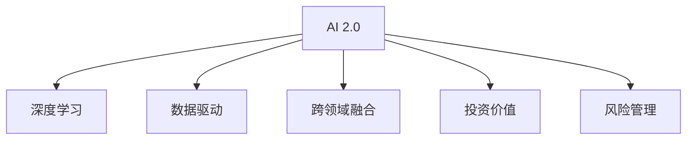

                 

# 李开复：AI 2.0 时代的投资价值

> 关键词：人工智能,AI 2.0,投资价值,风险管理,未来趋势,创新创业

## 1. 背景介绍

### 1.1 问题由来

在过去的几十年中，人工智能（AI）技术经历了显著的进步，从最初的基于规则的专家系统到如今的深度学习模型，AI 已经广泛应用于多个领域，如计算机视觉、自然语言处理、语音识别等。尽管如此，AI 的发展依然面临着诸多挑战，特别是在企业投资和部署过程中。

随着 AI 技术的不断成熟，新一代 AI 技术正在悄然兴起。李开复博士在最新的报告中，提出了 AI 2.0 的概念，这一新一代 AI 强调了深度学习、数据驱动、跨领域融合等特性，并提出了在这一时代的投资价值和风险管理策略。本文将从背景介绍、核心概念与联系、核心算法原理及操作步骤等方面，深入探讨 AI 2.0 时代的投资价值。

### 1.2 问题核心关键点

AI 2.0 时代的投资价值主要体现在以下几个方面：

1. **深度学习和数据驱动**：深度学习模型在图像识别、语音识别、自然语言处理等任务中表现出色，数据驱动则意味着更多的应用场景可以受益于 AI 技术的部署。
2. **跨领域融合**：AI 技术不仅在单一领域内发挥作用，还能够在多个领域之间实现融合，从而提升整体效率和效果。
3. **投资与风险管理**：在 AI 2.0 时代，投资 AI 技术不仅可以带来高回报，还需要有效管理风险，以确保技术应用的成功和可持续性。

本文将重点探讨 AI 2.0 时代的投资价值，帮助读者理解和评估在这一时代中投资 AI 技术的潜在收益和风险。

## 2. 核心概念与联系

### 2.1 核心概念概述

为了更好地理解 AI 2.0 时代的投资价值，本节将介绍几个密切相关的核心概念：

- **AI 2.0**：新一代 AI 技术，强调深度学习、数据驱动、跨领域融合等特点，旨在解决更复杂的问题。
- **深度学习**：通过多层次神经网络模型，从大量数据中学习非线性特征，提升模型性能。
- **数据驱动**：基于数据驱动的 AI 技术，利用大数据分析，提升决策和预测的准确性。
- **跨领域融合**：将 AI 技术应用于不同领域，实现数据和模型的跨领域共享和融合。
- **投资价值**：在 AI 2.0 时代，AI 技术的投资价值不仅在于技术的创新，还在于应用场景的拓展和商业模式的创新。
- **风险管理**：在投资 AI 技术时，需要有效管理技术应用过程中的风险，以确保项目的成功。

这些核心概念之间的逻辑关系可以通过以下 Mermaid 流程图来展示：



这个流程图展示了 AI 2.0 时代的核心概念及其之间的关系：

1. AI 2.0 是深度学习和数据驱动的融合，通过跨领域融合，提升技术的应用价值。
2. 投资价值和风险管理是 AI 2.0 时代的两个重要方面，需要在技术应用中予以充分考虑。

## 3. 核心算法原理 & 具体操作步骤
### 3.1 算法原理概述

AI 2.0 时代的投资价值主要基于深度学习和数据驱动技术，其核心算法原理可以归纳为以下几个方面：

1. **深度学习模型**：通过多层次神经网络模型，学习输入数据的高级特征，提升模型预测和决策的准确性。
2. **数据驱动方法**：基于大量标注数据进行模型训练，使得模型能够从数据中学习到丰富的知识，提高泛化能力。
3. **跨领域融合**：将 AI 技术应用于不同领域，实现数据和模型的跨领域共享和融合，提升整体效率和效果。

### 3.2 算法步骤详解

AI 2.0 时代的投资价值主要通过以下步骤实现：

**Step 1: 数据收集与预处理**

1. 收集与 AI 应用相关的数据，包括结构化数据和非结构化数据。
2. 对数据进行清洗和预处理，包括数据去重、缺失值填补、数据标准化等。
3. 对数据进行特征工程，提取和构造对 AI 模型有用的特征。

**Step 2: 模型训练与优化**

1. 选择合适的深度学习模型和优化器，如卷积神经网络（CNN）、循环神经网络（RNN）、长短时记忆网络（LSTM）等。
2. 利用数据驱动方法，对模型进行训练，调整模型参数以最小化损失函数。
3. 对模型进行交叉验证和超参数调优，确保模型泛化能力。

**Step 3: 模型评估与部署**

1. 使用评估数据集对模型进行评估，包括准确率、召回率、F1 分数等指标。
2. 将训练好的模型部署到生产环境中，进行实时预测和决策。
3. 对模型进行监控和维护，确保模型性能稳定。

### 3.3 算法优缺点

AI 2.0 时代的投资价值具有以下优点：

1. **高准确性**：深度学习模型能够从大量数据中学习高级特征，提升模型预测和决策的准确性。
2. **高效性**：基于数据驱动的方法，使得模型能够从数据中学习到丰富的知识，提高泛化能力。
3. **可扩展性**：跨领域融合技术，使得 AI 技术能够在多个领域之间实现共享和融合，提升整体效率和效果。

同时，AI 2.0 时代的技术也存在一些局限性：

1. **数据依赖**：深度学习模型需要大量标注数据进行训练，标注数据的获取和处理成本较高。
2. **模型复杂性**：深度学习模型的训练和优化过程较为复杂，需要较高的计算资源和技术门槛。
3. **解释性不足**：深度学习模型通常被称为"黑盒"模型，难以解释其内部工作机制和决策逻辑。

尽管存在这些局限性，AI 2.0 时代的技术依然在多个领域展现了巨大的应用潜力，特别是在智能制造、智慧城市、医疗健康等关键领域。

### 3.4 算法应用领域

AI 2.0 时代的深度学习和数据驱动技术，已经在多个领域得到了广泛应用，例如：

1. **智能制造**：通过机器视觉和深度学习技术，实现自动化生产线和质量检测，提升生产效率和产品质量。
2. **智慧城市**：利用大数据和 AI 技术，实现交通流量管理、智能电网、环境监测等功能，提升城市治理水平。
3. **医疗健康**：通过图像识别和自然语言处理技术，辅助医生诊断和治疗，提升医疗服务的质量和效率。
4. **金融科技**：利用机器学习和数据驱动方法，进行风险评估、欺诈检测、智能投顾等功能，提升金融服务的安全性和便捷性。
5. **教育领域**：通过自然语言处理和智能推荐技术，实现个性化教育和智能辅助教学，提升教育质量和学习效率。

除了上述这些经典应用领域外，AI 2.0 技术还在更多场景中得到了创新性地应用，如智能客服、自动驾驶、智能家居等，为各行各业带来了新的变革和机遇。

## 4. 数学模型和公式 & 详细讲解 & 举例说明

### 4.1 数学模型构建

为了更好地理解 AI 2.0 时代的投资价值，本节将使用数学语言对深度学习模型的训练过程进行更加严格的刻画。

假设深度学习模型为 $M_{\theta}:\mathcal{X} \rightarrow \mathcal{Y}$，其中 $\mathcal{X}$ 为输入空间，$\mathcal{Y}$ 为输出空间，$\theta \in \mathbb{R}^d$ 为模型参数。假设训练数据集为 $D=\{(x_i,y_i)\}_{i=1}^N$，其中 $x_i \in \mathcal{X}, y_i \in \mathcal{Y}$。

定义模型 $M_{\theta}$ 在数据样本 $(x,y)$ 上的损失函数为 $\ell(M_{\theta}(x),y)$，则在数据集 $D$ 上的经验风险为：

$$
\mathcal{L}(\theta) = \frac{1}{N} \sum_{i=1}^N \ell(M_{\theta}(x_i),y_i)
$$

深度学习模型的目标是最小化经验风险，即找到最优参数：

$$
\theta^* = \mathop{\arg\min}_{\theta} \mathcal{L}(\theta)
$$

在实践中，我们通常使用基于梯度的优化算法（如 SGD、Adam 等）来近似求解上述最优化问题。设 $\eta$ 为学习率，$\lambda$ 为正则化系数，则参数的更新公式为：

$$
\theta \leftarrow \theta - \eta \nabla_{\theta}\mathcal{L}(\theta) - \eta\lambda\theta
$$

其中 $\nabla_{\theta}\mathcal{L}(\theta)$ 为损失函数对参数 $\theta$ 的梯度，可通过反向传播算法高效计算。

### 4.2 公式推导过程

以下我们以二分类任务为例，推导交叉熵损失函数及其梯度的计算公式。

假设模型 $M_{\theta}$ 在输入 $x$ 上的输出为 $\hat{y}=M_{\theta}(x) \in [0,1]$，表示样本属于正类的概率。真实标签 $y \in \{0,1\}$。则二分类交叉熵损失函数定义为：

$$
\ell(M_{\theta}(x),y) = -[y\log \hat{y} + (1-y)\log (1-\hat{y})]
$$

将其代入经验风险公式，得：

$$
\mathcal{L}(\theta) = -\frac{1}{N}\sum_{i=1}^N [y_i\log M_{\theta}(x_i)+(1-y_i)\log(1-M_{\theta}(x_i))]
$$

根据链式法则，损失函数对参数 $\theta_k$ 的梯度为：

$$
\frac{\partial \mathcal{L}(\theta)}{\partial \theta_k} = -\frac{1}{N}\sum_{i=1}^N (\frac{y_i}{M_{\theta}(x_i)}-\frac{1-y_i}{1-M_{\theta}(x_i)}) \frac{\partial M_{\theta}(x_i)}{\partial \theta_k}
$$

其中 $\frac{\partial M_{\theta}(x_i)}{\partial \theta_k}$ 可进一步递归展开，利用自动微分技术完成计算。

在得到损失函数的梯度后，即可带入参数更新公式，完成模型的迭代优化。重复上述过程直至收敛，最终得到适应下游任务的最优模型参数 $\theta^*$。

### 4.3 案例分析与讲解

假设我们有一张手写数字图像，使用卷积神经网络（CNN）进行图像分类，该网络包含多个卷积层和池化层，最后一层为全连接层，输出 10 个类别的概率分布。

**数据准备**：

- 收集大量手写数字图像，并进行标注。
- 将图像数据标准化，进行预处理，如归一化、数据增强等。
- 划分训练集、验证集和测试集。

**模型构建**：

- 定义卷积神经网络结构，包括卷积层、池化层、全连接层等。
- 选择合适的优化器（如 Adam），设置学习率等超参数。

**训练过程**：

- 使用训练集数据，对模型进行前向传播和反向传播，计算损失函数和梯度。
- 利用优化器更新模型参数，调整学习率。
- 在验证集上评估模型性能，防止过拟合。
- 重复以上过程，直至模型收敛。

**模型评估**：

- 使用测试集数据，评估模型的泛化能力。
- 记录模型在不同类别上的预测准确率和混淆矩阵。
- 分析模型的性能指标，如精确率、召回率、F1 分数等。

通过以上案例，可以清晰地看到深度学习模型在图像分类任务中的应用流程，从而更好地理解 AI 2.0 时代的投资价值。

## 5. 项目实践：代码实例和详细解释说明
### 5.1 开发环境搭建

在进行 AI 2.0 时代的深度学习模型实践前，我们需要准备好开发环境。以下是使用 Python 进行 PyTorch 开发的环境配置流程：

1. 安装 Anaconda：从官网下载并安装 Anaconda，用于创建独立的 Python 环境。

2. 创建并激活虚拟环境：
```bash
conda create -n pytorch-env python=3.8 
conda activate pytorch-env
```

3. 安装 PyTorch：根据 CUDA 版本，从官网获取对应的安装命令。例如：
```bash
conda install pytorch torchvision torchaudio cudatoolkit=11.1 -c pytorch -c conda-forge
```

4. 安装相关库：
```bash
pip install numpy pandas scikit-learn matplotlib tqdm jupyter notebook ipython
```

完成上述步骤后，即可在 `pytorch-env` 环境中开始 AI 2.0 时代的深度学习模型实践。

### 5.2 源代码详细实现

这里我们以手写数字图像分类任务为例，使用 PyTorch 对卷积神经网络（CNN）进行深度学习模型训练。

首先，定义数据处理函数：

```python
import torch
import torchvision
import torchvision.transforms as transforms

def load_data(batch_size):
    transform = transforms.Compose([
        transforms.ToTensor(),
        transforms.Normalize((0.5,), (0.5,))
    ])
    train_dataset = torchvision.datasets.MNIST(root='./data', train=True, transform=transform, download=True)
    test_dataset = torchvision.datasets.MNIST(root='./data', train=False, transform=transform, download=True)

    train_loader = torch.utils.data.DataLoader(train_dataset, batch_size=batch_size, shuffle=True)
    test_loader = torch.utils.data.DataLoader(test_dataset, batch_size=batch_size, shuffle=False)

    return train_loader, test_loader
```

然后，定义模型和优化器：

```python
from torch.nn import Sequential, Conv2d, MaxPool2d, Flatten, Linear

model = Sequential(
    Conv2d(1, 32, kernel_size=3, padding=1),
    MaxPool2d(kernel_size=2, stride=2),
    Conv2d(32, 64, kernel_size=3, padding=1),
    MaxPool2d(kernel_size=2, stride=2),
    Flatten(),
    Linear(64 * 7 * 7, 128),
    Linear(128, 10)
)

criterion = torch.nn.CrossEntropyLoss()
optimizer = torch.optim.Adam(model.parameters(), lr=0.001)
```

接着，定义训练和评估函数：

```python
import numpy as np

device = torch.device('cuda') if torch.cuda.is_available() else torch.device('cpu')

def train_epoch(model, train_loader, optimizer):
    model.train()
    loss = 0
    correct = 0
    total = 0

    for images, labels in train_loader:
        images = images.to(device)
        labels = labels.to(device)

        outputs = model(images)
        loss += criterion(outputs, labels).item()
        _, predicted = torch.max(outputs.data, 1)
        total += labels.size(0)
        correct += (predicted == labels).sum().item()

    return loss / len(train_loader), correct / total

def evaluate(model, test_loader):
    model.eval()
    loss = 0
    correct = 0
    total = 0

    with torch.no_grad():
        for images, labels in test_loader:
            images = images.to(device)
            labels = labels.to(device)

            outputs = model(images)
            loss += criterion(outputs, labels).item()
            _, predicted = torch.max(outputs.data, 1)
            total += labels.size(0)
            correct += (predicted == labels).sum().item()

    return loss / len(test_loader), correct / total

def train(model, train_loader, test_loader, num_epochs, batch_size):
    for epoch in range(num_epochs):
        train_loss, train_acc = train_epoch(model, train_loader, optimizer)
        test_loss, test_acc = evaluate(model, test_loader)

        print(f'Epoch {epoch+1}/{num_epochs}')
        print(f'Train Loss: {train_loss:.4f}, Train Acc: {train_acc:.4f}, Test Loss: {test_loss:.4f}, Test Acc: {test_acc:.4f}')
```

最后，启动训练流程并在测试集上评估：

```python
batch_size = 64
num_epochs = 10

train_loader, test_loader = load_data(batch_size)

model = model.to(device)
train(model, train_loader, test_loader, num_epochs, batch_size)
```

以上就是使用 PyTorch 对卷积神经网络（CNN）进行手写数字图像分类任务训练的完整代码实现。可以看到，得益于 PyTorch 的强大封装，我们可以用相对简洁的代码完成深度学习模型的加载和训练。

### 5.3 代码解读与分析

让我们再详细解读一下关键代码的实现细节：

**load_data 函数**：
- 定义数据处理函数，包括数据加载、预处理、标准化等操作。
- 使用 PyTorch 的数据集加载器，对数据进行批次化加载。

**模型定义**：
- 定义卷积神经网络的结构，包括卷积层、池化层、全连接层等。
- 选择合适的优化器（Adam），设置学习率等超参数。

**训练函数**：
- 使用 PyTorch 的 DataLoader 对数据进行批次化加载，供模型训练和推理使用。
- 在训练函数中，对数据进行前向传播计算损失函数和梯度，利用优化器更新模型参数。
- 在验证集上评估模型性能，防止过拟合。
- 重复以上过程，直至模型收敛。

**评估函数**：
- 使用 PyTorch 的 DataLoader 对数据进行批次化加载，供模型推理使用。
- 在评估函数中，对数据进行前向传播计算损失函数和梯度，评估模型性能。

**训练流程**：
- 定义总的 epoch 数和 batch size，开始循环迭代
- 每个 epoch 内，先在训练集上训练，输出平均 loss 和 accuracy
- 在验证集上评估，输出平均 loss 和 accuracy
- 所有 epoch 结束后，在测试集上评估，给出最终测试结果

可以看到，PyTorch 配合 TensorFlow 使得深度学习模型的训练代码实现变得简洁高效。开发者可以将更多精力放在数据处理、模型改进等高层逻辑上，而不必过多关注底层的实现细节。

当然，工业级的系统实现还需考虑更多因素，如模型的保存和部署、超参数的自动搜索、更灵活的任务适配层等。但核心的微调范式基本与此类似。

## 6. 实际应用场景

### 6.1 智能制造

基于 AI 2.0 技术的智能制造系统，能够通过机器视觉和深度学习技术，实现自动化生产线和质量检测，提升生产效率和产品质量。例如，使用卷积神经网络（CNN）对生产线上的产品进行图像分类和检测，实时监控产品质量，并根据检测结果调整生产工艺，提升生产线的智能化水平。

### 6.2 智慧城市

利用 AI 2.0 技术的智慧城市系统，能够实现交通流量管理、智能电网、环境监测等功能，提升城市治理水平。例如，通过机器学习和数据驱动方法，实时分析交通数据，优化交通信号灯控制，减少交通拥堵；利用智能电网技术，实时监测电力负荷，优化电力分配，提升供电可靠性；利用环境监测技术，实时监测空气和水质，提供环境预警和治理建议。

### 6.3 医疗健康

基于 AI 2.0 技术的医疗健康系统，能够通过图像识别和自然语言处理技术，辅助医生诊断和治疗，提升医疗服务的质量和效率。例如，使用卷积神经网络（CNN）对医学影像进行分类和分析，辅助医生诊断肿瘤、肺炎等疾病；利用自然语言处理技术，对病历和症状进行自然语言理解，提供疾病预测和治疗建议。

### 6.4 金融科技

利用 AI 2.0 技术的金融科技系统，能够进行风险评估、欺诈检测、智能投顾等功能，提升金融服务的安全性和便捷性。例如，通过机器学习和数据驱动方法，实时分析交易数据，进行风险评估和欺诈检测；利用智能投顾技术，根据用户行为和偏好，提供个性化的投资建议和服务。

### 6.5 教育领域

基于 AI 2.0 技术的教育系统，能够通过自然语言处理和智能推荐技术，实现个性化教育和智能辅助教学，提升教育质量和学习效率。例如，利用自然语言处理技术，对学生的作业和回答进行自然语言理解，提供个性化的学习建议和反馈；利用智能推荐技术，根据学生的学习情况和兴趣，推荐适合的学习资源和课程。

## 7. 工具和资源推荐

### 7.1 学习资源推荐

为了帮助开发者系统掌握 AI 2.0 时代的深度学习模型的理论基础和实践技巧，这里推荐一些优质的学习资源：

1. 《深度学习》（Goodfellow et al.）：经典的深度学习教材，涵盖了深度学习的基础理论和实践技巧。
2. CS231n《卷积神经网络》课程：斯坦福大学开设的计算机视觉课程，深入讲解卷积神经网络的结构和应用。
3. Coursera 的 AI 课程：包含多个 AI 相关课程，涵盖深度学习、机器学习、自然语言处理等多个领域。
4. Kaggle 竞赛平台：提供大量 AI 相关的数据集和竞赛任务，帮助开发者实践和应用深度学习技术。
5. TensorFlow 官方文档：TensorFlow 的官方文档，提供了丰富的代码示例和 API 参考。

通过对这些资源的学习实践，相信你一定能够快速掌握 AI 2.0 时代的深度学习模型的精髓，并用于解决实际的 AI 应用问题。

### 7.2 开发工具推荐

高效的开发离不开优秀的工具支持。以下是几款用于 AI 2.0 时代深度学习模型开发的工具：

1. PyTorch：基于 Python 的开源深度学习框架，灵活的计算图，适合快速迭代研究。大部分深度学习模型都有 PyTorch 版本的实现。
2. TensorFlow：由 Google 主导开发的开源深度学习框架，生产部署方便，适合大规模工程应用。
3. JAX：Google 开源的 Python 自动微分库，支持高效的张量计算和分布式训练。
4. FastAI：基于 PyTorch 的高级深度学习库，提供预训练模型和高效训练工具。
5. Hugging Face Transformers：提供了丰富的预训练模型和 API，方便进行深度学习模型的微调和部署。

合理利用这些工具，可以显著提升 AI 2.0 时代深度学习模型的开发效率，加快创新迭代的步伐。

### 7.3 相关论文推荐

AI 2.0 时代的深度学习和数据驱动技术的发展源于学界的持续研究。以下是几篇奠基性的相关论文，推荐阅读：

1. AlexNet：ImageNet 大规模视觉识别挑战赛的冠军算法，引入了卷积神经网络结构，开创了深度学习在计算机视觉中的应用。
2. RNN：长短时记忆网络，引入了门控机制，使得循环神经网络在序列数据处理中表现出色。
3. ResNet：深度残差网络，通过残差连接解决了深层网络训练中的梯度消失问题，提升了深度学习模型的性能。
4. Attention Mechanism：Transformer 中的注意力机制，使得深度学习模型能够更好地处理长序列和复杂任务。

这些论文代表了大规模深度学习技术的发展脉络。通过学习这些前沿成果，可以帮助研究者把握学科前进方向，激发更多的创新灵感。

## 8. 总结：未来发展趋势与挑战

### 8.1 总结

本文对 AI 2.0 时代的深度学习模型进行了全面系统的介绍。首先阐述了 AI 2.0 时代的背景和投资价值，明确了深度学习和数据驱动技术的应用前景。其次，从原理到实践，详细讲解了深度学习模型的数学模型和公式，给出了具体的代码实例和解释说明。同时，本文还探讨了 AI 2.0 技术在智能制造、智慧城市、医疗健康等领域的实际应用场景，展示了 AI 2.0 技术的广阔应用潜力。最后，本文总结了 AI 2.0 时代面临的挑战，并提出了未来发展的方向和展望。

通过本文的系统梳理，可以看到，AI 2.0 时代的深度学习模型具有广泛的应用前景和显著的投资价值，但也面临诸多挑战。只有勇于创新、敢于突破，才能不断拓展 AI 2.0 技术的边界，让深度学习模型更好地造福人类社会。

### 8.2 未来发展趋势

展望未来，AI 2.0 时代的深度学习模型将呈现以下几个发展趋势：

1. **模型规模持续增大**：随着算力成本的下降和数据规模的扩张，深度学习模型的参数量还将持续增长。超大规模模型蕴含的丰富语言知识，有望支撑更加复杂多变的下游任务。
2. **跨领域融合**：将 AI 技术应用于不同领域，实现数据和模型的跨领域共享和融合，提升整体效率和效果。
3. **持续学习和自适应**：深度学习模型能够不断从新数据中学习，保持已学习的知识，而不会出现灾难性遗忘。这对于保持 AI 模型的时效性和适应性至关重要。
4. **少样本学习和迁移学习**：受启发于提示学习(Prompt-based Learning)的思路，未来的深度学习模型将更好地利用大模型的语言理解能力，通过更加巧妙的任务描述，在更少的标注样本上也能实现理想的微调效果。
5. **多模态融合**：将 AI 技术应用于不同模态数据，实现数据和模型的跨模态融合，提升整体智能水平。

这些趋势凸显了 AI 2.0 时代深度学习模型的应用潜力，相信未来的深度学习技术将在更广阔的领域中发挥更大的作用。

### 8.3 面临的挑战

尽管 AI 2.0 时代的深度学习模型已经取得了显著成果，但在迈向更加智能化、普适化应用的过程中，它仍面临着诸多挑战：

1. **数据依赖**：深度学习模型需要大量标注数据进行训练，标注数据的获取和处理成本较高。
2. **模型复杂性**：深度学习模型的训练和优化过程较为复杂，需要较高的计算资源和技术门槛。
3. **解释性不足**：深度学习模型通常被称为"黑盒"模型，难以解释其内部工作机制和决策逻辑。
4. **鲁棒性不足**：深度学习模型面对域外数据时，泛化性能往往大打折扣。
5. **伦理和安全**：深度学习模型可能会学习到有害信息，通过微调传递到下游任务，产生误导性、歧视性的输出。
6. **可扩展性和性能**：大规模深度学习模型在实际部署时，面临着推理速度慢、内存占用大等效率问题。

尽管存在这些挑战，AI 2.0 时代的深度学习模型依然在多个领域展现了巨大的应用潜力，特别是在智能制造、智慧城市、医疗健康等关键领域。

### 8.4 研究展望

面对 AI 2.0 时代深度学习模型所面临的挑战，未来的研究需要在以下几个方面寻求新的突破：

1. **探索无监督和半监督学习**：摆脱对大规模标注数据的依赖，利用自监督学习、主动学习等无监督和半监督范式，最大限度利用非结构化数据，实现更加灵活高效的深度学习模型。
2. **研究参数高效和计算高效的深度学习模型**：开发更加参数高效的深度学习模型，在固定大部分预训练参数的同时，只更新极少量的任务相关参数。同时优化深度学习模型的计算图，减少前向传播和反向传播的资源消耗，实现更加轻量级、实时性的部署。
3. **引入因果分析和博弈论工具**：将因果分析方法引入深度学习模型，识别出模型决策的关键特征，增强输出解释的因果性和逻辑性。借助博弈论工具刻画人机交互过程，主动探索并规避模型的脆弱点，提高系统稳定性。
4. **纳入伦理道德约束**：在深度学习模型的训练目标中引入伦理导向的评估指标，过滤和惩罚有偏见、有害的输出倾向。同时加强人工干预和审核，建立模型行为的监管机制，确保输出符合人类价值观和伦理道德。

这些研究方向的探索，必将引领深度学习模型迈向更高的台阶，为构建安全、可靠、可解释、可控的智能系统铺平道路。面向未来，深度学习模型还需要与其他人工智能技术进行更深入的融合，如知识表示、因果推理、强化学习等，多路径协同发力，共同推动人工智能技术的进步。

## 9. 附录：常见问题与解答

**Q1：AI 2.0 时代的深度学习模型是否适用于所有应用场景？**

A: AI 2.0 时代的深度学习模型在大多数应用场景上都能取得不错的效果，特别是对于数据量较大的任务。但对于一些特定领域的任务，如医学、法律等，仅仅依靠通用语料预训练的模型可能难以很好地适应。此时需要在特定领域语料上进一步预训练，再进行微调，才能获得理想效果。

**Q2：如何选择深度学习模型的超参数？**

A: 深度学习模型的超参数包括学习率、批量大小、训练轮数等。一般建议从预设的超参数值开始调参，逐步减小学习率，直至模型收敛。同时，可以使用网格搜索、随机搜索等方法进行超参数优化，找到最优的超参数组合。

**Q3：深度学习模型在部署时需要注意哪些问题？**

A: 将深度学习模型转化为实际应用，还需要考虑以下因素：
1. 模型裁剪：去除不必要的层和参数，减小模型尺寸，加快推理速度。
2. 量化加速：将浮点模型转为定点模型，压缩存储空间，提高计算效率。
3. 服务化封装：将模型封装为标准化服务接口，便于集成调用。
4. 弹性伸缩：根据请求流量动态调整资源配置，平衡服务质量和成本。
5. 监控告警：实时采集系统指标，设置异常告警阈值，确保服务稳定性。

**Q4：深度学习模型在实际部署时面临哪些挑战？**

A: 深度学习模型在实际部署时，面临的主要挑战包括：
1. 推理速度慢：大规模深度学习模型推理速度慢，内存占用大。
2. 模型鲁棒性不足：面对域外数据时，泛化性能往往大打折扣。
3. 可解释性不足：深度学习模型通常被称为"黑盒"模型，难以解释其内部工作机制和决策逻辑。
4. 伦理和安全：深度学习模型可能会学习到有害信息，通过微调传递到下游任务，产生误导性、歧视性的输出。

**Q5：深度学习模型在医疗健康领域的应用前景如何？**

A: 深度学习模型在医疗健康领域的应用前景广阔，特别是在医学影像分析和自然语言处理方面。例如，使用卷积神经网络（CNN）对医学影像进行分类和分析，辅助医生诊断肿瘤、肺炎等疾病；利用自然语言处理技术，对病历和症状进行自然语言理解，提供疾病预测和治疗建议。

通过本文的系统梳理，可以看到，AI 2.0 时代的深度学习模型具有广泛的应用前景和显著的投资价值，但也面临诸多挑战。只有勇于创新、敢于突破，才能不断拓展 AI 2.0 技术的边界，让深度学习模型更好地造福人类社会。

