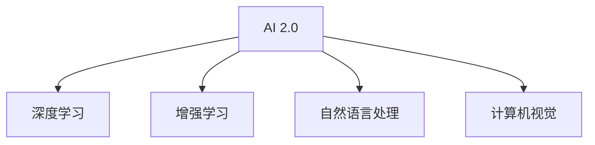

                 

# 李开复：AI 2.0 时代的科技价值

## 1. 背景介绍

### 1.1 问题由来
自21世纪以来，人工智能(AI)技术的快速发展，极大地推动了人类社会的进步。李开复博士，作为全球知名的科技领袖、人工智能领域的先驱，他的观点和思考对AI的演进有着深远的影响。在《李开复：AI 2.0 时代的科技价值》一文中，他将带领我们深入探讨AI 2.0时代的科技价值，分析其在各个领域的应用与影响。

### 1.2 问题核心关键点
AI 2.0时代的核心关键点包括以下几点：

- AI 2.0时代是指以人工智能为主导的新一轮技术革命。
- AI 2.0时代的主要技术包括深度学习、增强学习、自然语言处理、计算机视觉等。
- AI 2.0时代的技术进步将带来生产力的大幅提升，改变人类生活方式和工作方式。
- AI 2.0时代对社会伦理、法律、隐私等问题的挑战将更加严峻。
- 李开复将从技术、经济、社会等多个维度剖析AI 2.0时代的重要价值。

## 2. 核心概念与联系

### 2.1 核心概念概述

为更好地理解AI 2.0时代的科技价值，本节将介绍几个密切相关的核心概念：

- **AI 2.0**：指新一代人工智能技术，其核心是深度学习和增强学习，能够处理大规模、高维度的非结构化数据，进行复杂的模式识别和决策。
- **深度学习**：一种模拟人脑神经网络结构的机器学习方法，通过多层次的非线性变换，逐步提取数据的高级特征。
- **增强学习**：通过与环境的交互，模型通过奖励信号进行优化，能够自主学习最优策略。
- **自然语言处理**：使计算机能够理解和生成人类语言的技术，包括文本分类、情感分析、机器翻译等。
- **计算机视觉**：使计算机能够“看”和理解视觉信息的技术，包括图像识别、目标检测、场景理解等。

这些核心概念之间的逻辑关系可以通过以下Mermaid流程图来展示：



这个流程图展示了一个高层次的概念框架，其中AI 2.0为核心，其他技术均为其子集，共同构建了AI 2.0时代的技术架构。

## 3. 核心算法原理 & 具体操作步骤
### 3.1 算法原理概述

AI 2.0时代的核心算法原理主要涉及深度学习和增强学习。以下是其核心原理的概述：

- **深度学习**：基于神经网络结构，通过多层非线性变换，逐步提取数据的高级特征。深度学习在图像、语音、自然语言处理等领域展现了强大的能力。
- **增强学习**：通过与环境的交互，模型通过奖励信号进行优化，能够自主学习最优策略。增强学习在游戏、推荐系统、自动驾驶等领域应用广泛。

### 3.2 算法步骤详解

AI 2.0时代的算法步骤通常包括以下几个关键步骤：

**Step 1: 数据准备**
- 收集大量高质量的标注数据，确保数据的广泛性和多样性。
- 对数据进行预处理，包括数据清洗、特征工程等。

**Step 2: 模型选择**
- 选择合适的深度学习或增强学习模型。如卷积神经网络(CNN)、循环神经网络(RNN)、Transformer等。
- 设计合适的网络结构和损失函数，进行模型初始化。

**Step 3: 模型训练**
- 使用训练数据集对模型进行迭代优化，最小化损失函数。
- 使用梯度下降等优化算法，更新模型参数。
- 周期性在验证集上评估模型性能，避免过拟合。

**Step 4: 模型评估**
- 在测试集上评估模型的性能指标，如准确率、召回率、F1值等。
- 分析模型的优势和不足，进行进一步优化。

**Step 5: 模型应用**
- 将模型部署到实际应用场景中，进行实时预测或决策。
- 持续收集新数据，定期更新和优化模型。

### 3.3 算法优缺点

AI 2.0时代的算法具有以下优点：
1. 数据驱动：基于大规模数据进行训练，模型具有较强的泛化能力。
2. 自动学习：模型能够自主学习最优策略，减少人工干预。
3. 应用广泛：深度学习和增强学习技术广泛应用于图像、语音、自然语言处理等领域。
4. 效果好：在许多任务上，AI 2.0时代的技术已经刷新了最先进的性能指标。

同时，这些算法也存在一定的局限性：
1. 对数据依赖：数据质量和数量对模型的性能有重要影响，获取高质量数据成本较高。
2. 模型复杂：深度学习模型的复杂度较高，训练和推理成本高。
3. 可解释性差：神经网络模型的决策过程缺乏可解释性，难以进行调试和优化。
4. 对抗攻击脆弱：模型容易受到对抗样本的干扰，导致决策错误。

尽管存在这些局限性，AI 2.0时代的技术仍在持续演进，不断提升模型的性能和鲁棒性。

### 3.4 算法应用领域

AI 2.0时代的算法在多个领域得到了广泛应用，例如：

- **医疗健康**：AI 2.0技术在医学影像分析、疾病预测、个性化医疗等方面展现了巨大潜力。
- **自动驾驶**：通过增强学习，模型能够自主进行决策，提高行车安全和效率。
- **金融科技**：用于风险管理、欺诈检测、智能投顾等金融场景，提升金融服务的智能化水平。
- **自然语言处理**：在机器翻译、情感分析、智能客服等方面，AI 2.0技术能够显著提升用户体验和效率。
- **智能制造**：通过计算机视觉和自然语言处理，AI 2.0技术在工业质检、流程优化等方面实现了自动化和智能化。

## 4. 数学模型和公式 & 详细讲解 & 举例说明

### 4.1 数学模型构建

以卷积神经网络(CNN)为例，构建AI 2.0时代算法的数学模型：

卷积神经网络通常包括卷积层、池化层、全连接层等组件。其中，卷积层通过卷积核提取局部特征，池化层进行特征压缩，全连接层进行分类或回归等任务。

### 4.2 公式推导过程

以卷积神经网络为例，其前向传播和反向传播的公式如下：

- **前向传播**：
$$
y^{[l]} = f(W^{[l]}x^{[l-1]} + b^{[l]})
$$
其中，$f$ 为激活函数，$W^{[l]}$ 和 $b^{[l]}$ 分别为卷积核和偏置项。

- **反向传播**：
$$
\frac{\partial L}{\partial W^{[l]}} = \frac{\partial L}{\partial y^{[l]}}\frac{\partial y^{[l]}}{\partial z^{[l]}}\frac{\partial z^{[l]}}{\partial W^{[l]}}
$$
其中，$\frac{\partial L}{\partial y^{[l]}}$ 为损失函数对输出 $y^{[l]}$ 的导数，$\frac{\partial y^{[l]}}{\partial z^{[l]}}$ 为激活函数的导数，$\frac{\partial z^{[l]}}{\partial W^{[l]}}$ 为梯度传递。

### 4.3 案例分析与讲解

以自然语言处理中的情感分析为例，分析AI 2.0时代的技术在实际应用中的表现：

**情感分析任务**：从文本中识别情感倾向，如正面、负面、中性等。

**数据准备**：收集大量带有情感标签的文本数据，进行预处理和特征提取。

**模型选择**：使用预训练的语言模型（如BERT、GPT等）作为特征提取器，在顶部添加全连接层进行分类。

**模型训练**：在标注数据集上对模型进行训练，最小化损失函数。

**模型评估**：在测试集上评估模型性能，分析误差来源。

**模型应用**：将模型部署到实际应用中，如智能客服、舆情分析等场景。

## 5. 项目实践：代码实例和详细解释说明

### 5.1 开发环境搭建

在进行AI 2.0时代的项目实践前，我们需要准备好开发环境。以下是使用Python进行TensorFlow和PyTorch开发的环境配置流程：

1. 安装Anaconda：从官网下载并安装Anaconda，用于创建独立的Python环境。

2. 创建并激活虚拟环境：
```bash
conda create -n tf-env python=3.8 
conda activate tf-env
```

3. 安装TensorFlow和PyTorch：
```bash
pip install tensorflow==2.7
pip install torch torchvision torchaudio
```

4. 安装各类工具包：
```bash
pip install numpy pandas scikit-learn matplotlib tqdm jupyter notebook ipython
```

完成上述步骤后，即可在`tf-env`环境中开始项目实践。

### 5.2 源代码详细实现

以下是一个使用TensorFlow进行图像分类的PyTorch代码实现：

```python
import tensorflow as tf
from tensorflow.keras import layers, models

# 构建卷积神经网络
model = models.Sequential([
    layers.Conv2D(32, (3,3), activation='relu', input_shape=(28,28,1)),
    layers.MaxPooling2D((2,2)),
    layers.Conv2D(64, (3,3), activation='relu'),
    layers.MaxPooling2D((2,2)),
    layers.Conv2D(64, (3,3), activation='relu'),
    layers.Flatten(),
    layers.Dense(64, activation='relu'),
    layers.Dense(10)
])

# 编译模型
model.compile(optimizer='adam',
              loss=tf.keras.losses.SparseCategoricalCrossentropy(from_logits=True),
              metrics=['accuracy'])

# 加载数据集
(x_train, y_train), (x_test, y_test) = tf.keras.datasets.mnist.load_data()

# 数据预处理
x_train = x_train.reshape(-1, 28, 28, 1) / 255.0
x_test = x_test.reshape(-1, 28, 28, 1) / 255.0

# 训练模型
model.fit(x_train, y_train, epochs=5, batch_size=32, validation_data=(x_test, y_test))

# 评估模型
model.evaluate(x_test, y_test)
```

### 5.3 代码解读与分析

让我们再详细解读一下关键代码的实现细节：

**模型构建**：
- 使用Sequential模型构建卷积神经网络。
- 包含多个卷积层、池化层、全连接层等组件。

**数据加载**：
- 使用TensorFlow的Keras API加载MNIST数据集。

**数据预处理**：
- 将数据转化为浮点型，并进行归一化处理。

**模型训练**：
- 使用Adam优化器，交叉熵损失函数，训练5个epoch。
- 在测试集上评估模型性能。

## 6. 实际应用场景

### 6.1 智能医疗

AI 2.0时代的技术在医疗健康领域展现出了巨大潜力。通过深度学习和增强学习，AI 2.0技术能够辅助医生进行诊断、治疗和个性化医疗，提升医疗服务的智能化水平。

**诊断**：利用医学影像数据，AI 2.0技术能够自动识别和标注病变区域，辅助医生进行快速诊断。
**治疗**：通过分析患者的基因数据和生活习惯，AI 2.0技术能够制定个性化的治疗方案。
**医疗咨询**：智能客服机器人能够24小时在线回答患者的健康咨询，提供医学知识普及和健康建议。

### 6.2 自动驾驶

自动驾驶是AI 2.0技术的另一个重要应用场景。通过增强学习，AI 2.0技术能够自主进行决策，提升行车安全和效率。

**环境感知**：通过计算机视觉技术，AI 2.0技术能够实时感知周围环境，包括道路、行人、车辆等。
**路径规划**：利用增强学习，AI 2.0技术能够自主规划最优路径，避开障碍物，确保行车安全。
**自动驾驶系统**：基于AI 2.0技术，自动驾驶系统能够实现自我驾驶，减少交通事故。

### 6.3 金融科技

金融科技领域也是AI 2.0技术的重要应用场景。通过AI 2.0技术，金融行业能够实现智能投顾、风险管理、欺诈检测等。

**智能投顾**：AI 2.0技术能够根据用户的风险偏好和投资历史，自动推荐最优投资组合。
**风险管理**：通过分析市场数据，AI 2.0技术能够预测风险，辅助金融机构进行风险管理。
**欺诈检测**：AI 2.0技术能够实时监控交易行为，识别异常交易，防范欺诈行为。

### 6.4 未来应用展望

随着AI 2.0技术的不断演进，未来的应用场景将更加广阔。以下是一些可能的未来应用：

- **智慧城市**：AI 2.0技术能够应用于智慧城市的管理和优化，提高城市的智能化水平。
- **个性化教育**：AI 2.0技术能够根据学生的学习数据，提供个性化的学习方案，提升教育效果。
- **智能制造**：AI 2.0技术能够应用于工业质检、流程优化等方面，提升制造业的智能化水平。

## 7. 工具和资源推荐

### 7.1 学习资源推荐

为了帮助开发者系统掌握AI 2.0时代的技术基础和实践技巧，这里推荐一些优质的学习资源：

1. 《Deep Learning with PyTorch》系列书籍：由PyTorch官方编写，系统介绍了深度学习的基本概念和PyTorch的使用方法。
2. 《TensorFlow官方文档》：TensorFlow官方提供的文档，包含详细的API和示例代码，是学习TensorFlow的必备资源。
3. Coursera《深度学习专项课程》：由斯坦福大学教授Andrew Ng讲授，深入浅出地介绍了深度学习的基本原理和应用。
4. Kaggle平台：全球最大的数据科学竞赛平台，提供了丰富的数据集和代码示例，是实践AI 2.0技术的好去处。

通过对这些资源的学习实践，相信你一定能够快速掌握AI 2.0时代的核心技术，并用于解决实际的NLP问题。

### 7.2 开发工具推荐

高效的开发离不开优秀的工具支持。以下是几款用于AI 2.0技术开发的常用工具：

1. PyTorch：基于Python的开源深度学习框架，灵活动态的计算图，适合快速迭代研究。
2. TensorFlow：由Google主导开发的开源深度学习框架，生产部署方便，适合大规模工程应用。
3. Jupyter Notebook：支持Python、R等多种语言，能够实时展示代码执行结果，是开发AI 2.0技术的重要工具。
4. Weights & Biases：模型训练的实验跟踪工具，可以记录和可视化模型训练过程中的各项指标，方便对比和调优。
5. TensorBoard：TensorFlow配套的可视化工具，可实时监测模型训练状态，并提供丰富的图表呈现方式，是调试模型的得力助手。

合理利用这些工具，可以显著提升AI 2.0技术的开发效率，加快创新迭代的步伐。

### 7.3 相关论文推荐

AI 2.0技术的发展源于学界的持续研究。以下是几篇奠基性的相关论文，推荐阅读：

1. AlphaGo：DeepMind开发的围棋AI，利用增强学习技术，达到了人类顶尖水平。
2. GAN：生成对抗网络，利用对抗性训练，生成高质量的图像、音频、视频等数据。
3. Transformer：Google开发的自然语言处理模型，通过自注意力机制，取得了诸多NLP任务的SOTA。
4. AlphaStar：OpenAI开发的星际争霸AI，利用增强学习技术，达到了人类顶尖水平。
5. Vision Transformer：Google开发的计算机视觉模型，利用自注意力机制，取得了多项图像识别任务的SOTA。

这些论文代表了大模型微调技术的发展脉络。通过学习这些前沿成果，可以帮助研究者把握学科前进方向，激发更多的创新灵感。

## 8. 总结：未来发展趋势与挑战

### 8.1 总结

本文对AI 2.0时代的科技价值进行了全面系统的介绍。首先阐述了AI 2.0时代的背景和核心关键点，明确了其技术特点和应用前景。其次，从原理到实践，详细讲解了AI 2.0时代的核心算法和操作步骤，给出了代码实例和详细解释说明。同时，本文还探讨了AI 2.0技术在多个领域的应用场景，展示了其广阔的前景。此外，本文精选了AI 2.0技术的各类学习资源，力求为读者提供全方位的技术指引。

通过本文的系统梳理，可以看到，AI 2.0时代的技术正在深刻改变各行各业，带来新的机遇和挑战。未来，随着技术的不断进步，AI 2.0时代将更加智能化、普适化，为人类社会带来更深远的影响。

### 8.2 未来发展趋势

展望未来，AI 2.0时代的科技价值将呈现以下几个发展趋势：

1. 技术突破不断。深度学习、增强学习、自然语言处理等技术将不断突破，带来更多创新应用。
2. 应用范围更广。AI 2.0技术将应用于更多领域，如智慧医疗、自动驾驶、智能制造等。
3. 数据驱动深入。AI 2.0技术将进一步依赖数据驱动，推动大数据、云计算等技术的发展。
4. 伦理和安全问题更加重要。AI 2.0技术的应用将更加关注伦理和安全性问题，避免负面影响。
5. 跨领域融合更加深入。AI 2.0技术将与其他技术进行更深入的融合，推动技术进步。

这些趋势凸显了AI 2.0时代的广阔前景，为人工智能技术的未来发展指明了方向。

### 8.3 面临的挑战

尽管AI 2.0技术取得了巨大的成功，但在迈向更加智能化、普适化应用的过程中，仍面临着诸多挑战：

1. 数据质量问题。AI 2.0技术对数据质量有较高要求，数据标注成本高，获取高质量数据难度大。
2. 模型复杂度问题。AI 2.0模型复杂度较高，训练和推理成本高。
3. 算法透明性问题。AI 2.0模型的决策过程缺乏透明性，难以进行调试和优化。
4. 伦理和安全问题。AI 2.0技术的应用需要关注伦理和安全问题，避免负面影响。

### 8.4 研究展望

面对AI 2.0技术所面临的种种挑战，未来的研究需要在以下几个方面寻求新的突破：

1. 数据增强技术。通过数据增强技术，提升模型对数据的多样性处理能力。
2. 模型压缩技术。通过模型压缩技术，降低模型复杂度，提高推理效率。
3. 算法透明性提升。通过算法透明性提升，提高模型的可解释性。
4. 伦理和安全保障。通过伦理和安全保障，确保AI 2.0技术的应用安全。

这些研究方向的探索，必将引领AI 2.0技术迈向更高的台阶，为构建安全、可靠、可解释、可控的智能系统铺平道路。

## 9. 附录：常见问题与解答

**Q1: 什么是AI 2.0时代的核心技术？**

A: AI 2.0时代的核心技术包括深度学习、增强学习、自然语言处理和计算机视觉等。这些技术通过大规模数据训练，实现了高度自动化的数据处理和决策能力。

**Q2: AI 2.0技术在医疗健康领域的应用前景如何？**

A: AI 2.0技术在医疗健康领域的应用前景广阔，能够辅助医生进行诊断、治疗和个性化医疗，提升医疗服务的智能化水平。例如，通过医学影像数据，AI 2.0技术能够自动识别和标注病变区域，辅助医生进行快速诊断。

**Q3: AI 2.0技术的局限性有哪些？**

A: AI 2.0技术的局限性包括对高质量数据的依赖、模型复杂度较高、算法透明性差等。因此，需要持续关注这些问题，并进行技术改进和优化。

**Q4: 未来AI 2.0技术的发展方向是什么？**

A: AI 2.0技术未来的发展方向包括技术突破、应用范围扩大、数据驱动深入、伦理和安全问题重视、跨领域融合等。这些方向将推动AI 2.0技术的不断演进，带来更多的创新应用。

---

作者：禅与计算机程序设计艺术 / Zen and the Art of Computer Programming

