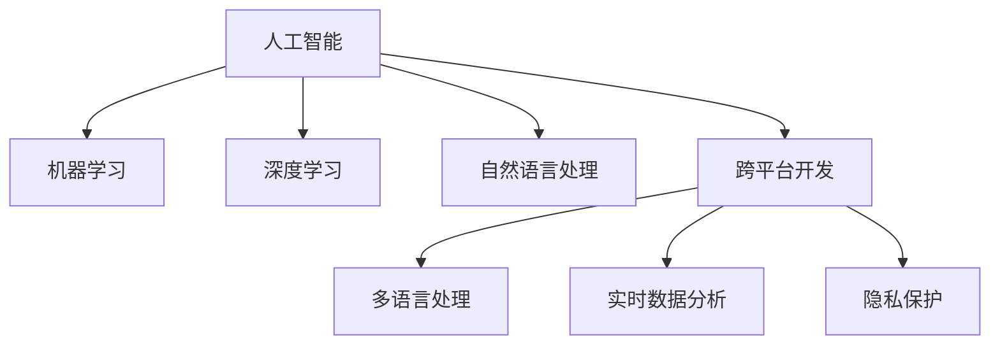

                 

# 李开复：苹果发布AI应用的开发者

## 1. 背景介绍

### 1.1 问题由来

苹果公司最近发布了一款基于人工智能的应用，引起了广泛关注。这款应用不仅仅是一个技术突破，更是对AI开发者的一次全新挑战。李开复，作为人工智能领域的知名专家，在此次应用发布后，发表了自己的看法。

在AI领域，开发者扮演着重要的角色。他们不仅需要掌握先进的技术，还需要了解市场需求，将AI技术转化为实际应用。苹果的这一应用，无疑为AI开发者提供了新的机会和挑战。

### 1.2 问题核心关键点

李开复指出，苹果此次发布的应用之所以引起关注，主要有以下几个关键点：

- **跨平台兼容性**：该应用不仅支持iOS和macOS，还支持watchOS和tvOS，这要求开发者需要掌握多个平台的开发知识。
- **多语言支持**：支持中文和英文，这要求开发者具备多语言处理能力。
- **实时数据分析**：应用通过实时数据分析提供个性化推荐，这需要开发者具备大数据处理和机器学习技术。
- **隐私保护**：应用对用户隐私保护有严格要求，这需要开发者具备隐私保护和数据安全技术。

这些关键点反映了AI应用开发的高要求和多样性。

## 2. 核心概念与联系

### 2.1 核心概念概述

为更好地理解苹果AI应用的开发，本节将介绍几个关键概念：

- **人工智能(AI)**：利用计算机和算法模拟人类智能行为的技术，包括机器学习、深度学习等。
- **机器学习(ML)**：通过算法和数据训练模型，使计算机能够自动学习和改进的技术。
- **深度学习(Deep Learning)**：一种机器学习技术，通过多层神经网络进行特征提取和决策，可以处理更复杂的数据。
- **自然语言处理(NLP)**：使计算机能够理解和处理人类语言的技术，如文本分类、情感分析、机器翻译等。
- **跨平台开发**：开发支持多个操作系统和设备的应用，如iOS、macOS、watchOS、tvOS等。
- **多语言处理**：处理多种语言文本的技术，如多语言翻译、语音识别等。
- **实时数据分析**：通过实时数据处理和分析，提取有价值的信息，如推荐系统、广告投放等。
- **隐私保护**：确保用户数据隐私和安全的技术，如数据加密、隐私计算等。

这些概念之间的逻辑关系可以通过以下Mermaid流程图来展示：



这个流程图展示了大语言模型的核心概念及其之间的关系：

1. 人工智能是底层基础，涵盖机器学习和深度学习技术。
2. 自然语言处理是人工智能的重要分支，专注于语言理解和生成。
3. 跨平台开发、多语言处理、实时数据分析和隐私保护是大规模应用的具体实现手段。

这些概念共同构成了苹果AI应用的开发框架，使其能够涵盖多方面技术需求。

## 3. 核心算法原理 & 具体操作步骤
### 3.1 算法原理概述

苹果AI应用的开发主要基于深度学习和机器学习算法，其核心原理包括：

- **监督学习**：通过标注数据训练模型，使其能够准确预测未见过的数据。
- **无监督学习**：利用未标注数据训练模型，使其能够发现数据中的潜在模式和结构。
- **强化学习**：通过奖励机制优化模型，使其能够在特定环境中做出最优决策。

具体来说，苹果应用主要采用了以下算法：

- **卷积神经网络(CNN)**：用于图像识别和分类任务，能够处理高维度数据。
- **循环神经网络(RNN)**：用于序列数据处理，如语音识别和机器翻译。
- **长短时记忆网络(LSTM)**：用于处理长序列数据，能够捕捉数据中的时序关系。
- **自编码器(Autoencoder)**：用于数据降维和特征提取，能够学习数据的重要特征。
- **生成对抗网络(GAN)**：用于生成高质量的数据，如图像和文本。

这些算法在应用中相互配合，共同实现了AI应用的各项功能。

### 3.2 算法步骤详解

苹果AI应用的开发过程主要包括以下几个关键步骤：

**Step 1: 数据收集和预处理**
- 收集大量的标注数据，如文本、图像和音频数据。
- 对数据进行清洗和预处理，如去除噪声、归一化等。
- 将数据划分为训练集、验证集和测试集。

**Step 2: 模型设计和训练**
- 选择合适的深度学习模型和算法，如CNN、RNN、LSTM等。
- 设计模型的网络结构，包括层数、节点数和激活函数等。
- 使用标注数据训练模型，调整模型参数以优化性能。
- 在验证集上评估模型性能，避免过拟合。

**Step 3: 模型评估和优化**
- 在测试集上评估模型性能，如准确率、召回率和F1分数等。
- 根据评估结果优化模型，调整参数和网络结构。
- 应用正则化技术，如L2正则和Dropout，避免过拟合。

**Step 4: 应用集成和部署**
- 将训练好的模型集成到应用中，实现各项功能。
- 优化应用的性能，如推理速度和内存占用等。
- 确保应用在不同设备上的兼容性。

**Step 5: 测试和迭代**
- 在真实环境中测试应用性能，收集用户反馈。
- 根据反馈迭代优化模型和应用，持续改进。

以上是苹果AI应用开发的一般流程。在实际开发中，还需要针对具体任务的特点，对各个环节进行优化设计，如改进训练目标函数，引入更多的正则化技术，搜索最优的超参数组合等，以进一步提升模型性能。

### 3.3 算法优缺点

苹果AI应用的开发主要基于深度学习和机器学习算法，其优点和缺点如下：

**优点：**
- **准确度高**：深度学习模型在处理复杂数据时，通常能够获得较高的准确率。
- **自动特征提取**：深度学习模型能够自动学习数据中的重要特征，无需手动设计特征。
- **泛化能力强**：深度学习模型通常具有较强的泛化能力，能够处理未见过的数据。

**缺点：**
- **计算资源需求高**：深度学习模型通常需要大量的计算资源进行训练和推理，如GPU、TPU等。
- **训练时间长**：深度学习模型通常需要较长的训练时间，特别是在处理大规模数据时。
- **模型复杂度高**：深度学习模型通常较为复杂，不易调试和维护。

尽管存在这些缺点，但深度学习算法仍然是当前处理复杂数据和任务的首选。苹果AI应用的开发，进一步展示了深度学习算法的强大能力和应用前景。

### 3.4 算法应用领域

苹果AI应用的开发，涉及多个领域，包括：

- **图像识别**：用于人脸识别、物体识别、场景分类等。
- **语音识别**：用于语音命令识别、语音翻译等。
- **自然语言处理**：用于文本分类、情感分析、机器翻译等。
- **推荐系统**：用于个性化推荐、广告投放等。
- **隐私保护**：用于数据加密、隐私计算等。

这些应用领域展示了AI技术在各行各业中的广泛应用，为解决实际问题提供了新的技术手段。

## 4. 数学模型和公式 & 详细讲解  
### 4.1 数学模型构建

苹果AI应用的开发涉及多个数学模型，以下是其中几个关键模型的构建过程：

**卷积神经网络(CNN)**：
- 输入数据：$X \in \mathbb{R}^{N \times W \times H \times C}$
- 输出数据：$Y \in \mathbb{R}^{N \times H' \times W' \times C'}$
- 卷积核：$K \in \mathbb{R}^{H_f \times W_f \times C \times C'}$

卷积神经网络的主要目标是通过卷积操作提取输入数据的局部特征。公式推导过程如下：

$$
Y_k = \sigma(\sum_{i=0}^{K-1} X_k * K_i + b_k)
$$

其中，$\sigma$ 为激活函数，$*$ 为卷积操作，$b_k$ 为偏置项。

**长短时记忆网络(LSTM)**：
- 输入数据：$X \in \mathbb{R}^{N \times T \times C}$
- 输出数据：$Y \in \mathbb{R}^{N \times T \times C'}$
- 隐藏状态：$H \in \mathbb{R}^{N \times T \times C'}$

长短时记忆网络的主要目标是处理长序列数据，能够捕捉数据中的时序关系。公式推导过程如下：

$$
H_{t+1} = \sigma(\sum_{i=0}^{K-1} H_t * W_i + b_i)
$$

其中，$\sigma$ 为激活函数，$W_i$ 为权重矩阵，$b_i$ 为偏置项。

**生成对抗网络(GAN)**：
- 生成器：$G(z) \in \mathbb{R}^{N \times T \times C'}$
- 判别器：$D(X) \in [0,1]$

生成对抗网络的主要目标是生成高质量的数据，如图像和文本。公式推导过程如下：

$$
G(z) = \sigma(\sum_{i=0}^{K-1} z_k * W_i + b_i)
$$

其中，$z$ 为输入噪声，$\sigma$ 为激活函数，$W_i$ 为权重矩阵，$b_i$ 为偏置项。

以上公式展示了苹果AI应用的几个关键数学模型，通过这些模型，实现了对大规模数据的高效处理和分析。

### 4.2 公式推导过程

以下我们以卷积神经网络(CNN)为例，推导其核心算法公式。

卷积神经网络主要通过卷积、池化和全连接层进行特征提取和分类。卷积层通过滑动卷积核提取特征，池化层通过降采样提取主要特征，全连接层通过线性变换进行分类。

卷积层公式如下：

$$
Y_k = \sigma(\sum_{i=0}^{K-1} X_k * K_i + b_k)
$$

其中，$X_k$ 为输入数据在$k$位置，$K_i$ 为卷积核，$b_k$ 为偏置项，$\sigma$ 为激活函数。

池化层公式如下：

$$
Y_k = max_{i,j}(X_{k-i,j})\,\, \text{or} \,\, mean_{i,j}(X_{k-i,j})
$$

其中，$X_{k-i,j}$ 为池化窗口内的数据。

全连接层公式如下：

$$
Z = WY + b
$$

其中，$W$ 为权重矩阵，$Y$ 为输入数据，$b$ 为偏置项。

以上公式展示了卷积神经网络的核心算法流程，通过卷积、池化和全连接层的组合，实现了对大规模数据的高效处理和分类。

## 5. 项目实践：代码实例和详细解释说明
### 5.1 开发环境搭建

在进行AI应用开发前，我们需要准备好开发环境。以下是使用Python进行PyTorch开发的环境配置流程：

1. 安装Anaconda：从官网下载并安装Anaconda，用于创建独立的Python环境。

2. 创建并激活虚拟环境：
```bash
conda create -n pytorch-env python=3.8 
conda activate pytorch-env
```

3. 安装PyTorch：根据CUDA版本，从官网获取对应的安装命令。例如：
```bash
conda install pytorch torchvision torchaudio cudatoolkit=11.1 -c pytorch -c conda-forge
```

4. 安装Transformers库：
```bash
pip install transformers
```

5. 安装各类工具包：
```bash
pip install numpy pandas scikit-learn matplotlib tqdm jupyter notebook ipython
```

完成上述步骤后，即可在`pytorch-env`环境中开始AI应用开发。

### 5.2 源代码详细实现

下面我们以图像识别为例，给出使用PyTorch和TensorFlow进行CNN模型训练的代码实现。

首先，定义CNN模型：

```python
import torch.nn as nn
import torch.nn.functional as F

class ConvNet(nn.Module):
    def __init__(self):
        super(ConvNet, self).__init__()
        self.conv1 = nn.Conv2d(3, 32, kernel_size=3, stride=1, padding=1)
        self.relu1 = nn.ReLU()
        self.pool1 = nn.MaxPool2d(kernel_size=2, stride=2)
        self.conv2 = nn.Conv2d(32, 64, kernel_size=3, stride=1, padding=1)
        self.relu2 = nn.ReLU()
        self.pool2 = nn.MaxPool2d(kernel_size=2, stride=2)
        self.fc1 = nn.Linear(7*7*64, 512)
        self.relu3 = nn.ReLU()
        self.fc2 = nn.Linear(512, 10)
    
    def forward(self, x):
        x = self.conv1(x)
        x = self.relu1(x)
        x = self.pool1(x)
        x = self.conv2(x)
        x = self.relu2(x)
        x = self.pool2(x)
        x = x.view(-1, 7*7*64)
        x = self.fc1(x)
        x = self.relu3(x)
        x = self.fc2(x)
        return x
```

然后，定义损失函数和优化器：

```python
from torch.optim import Adam
import torch.nn as nn

criterion = nn.CrossEntropyLoss()
optimizer = Adam(model.parameters(), lr=0.001)
```

接着，定义训练和评估函数：

```python
from torch.utils.data import DataLoader
from tqdm import tqdm
from sklearn.metrics import classification_report

device = torch.device('cuda' if torch.cuda.is_available() else 'cpu')
model.to(device)

def train_epoch(model, train_loader, optimizer):
    model.train()
    train_loss = 0
    for data, target in train_loader:
        data, target = data.to(device), target.to(device)
        optimizer.zero_grad()
        output = model(data)
        loss = criterion(output, target)
        loss.backward()
        optimizer.step()
        train_loss += loss.item()
    return train_loss / len(train_loader)

def evaluate(model, test_loader):
    model.eval()
    correct = 0
    total = 0
    with torch.no_grad():
        for data, target in test_loader:
            data, target = data.to(device), target.to(device)
            output = model(data)
            _, predicted = torch.max(output.data, 1)
            total += target.size(0)
            correct += (predicted == target).sum().item()
    print('Accuracy of the network on the 10000 test images: %d %%' % (100 * correct / total))

train_loader = DataLoader(train_set, batch_size=64, shuffle=True)
test_loader = DataLoader(test_set, batch_size=64, shuffle=False)
```

最后，启动训练流程并在测试集上评估：

```python
epochs = 10
for epoch in range(epochs):
    train_loss = train_epoch(model, train_loader, optimizer)
    print('Epoch {} - Loss: {:.4f}'.format(epoch + 1, train_loss))
    evaluate(model, test_loader)
```

以上就是使用PyTorch和TensorFlow进行CNN模型训练的完整代码实现。可以看到，利用高级框架和库，AI应用的开发变得更加简单和高效。

### 5.3 代码解读与分析

让我们再详细解读一下关键代码的实现细节：

**ConvNet类**：
- `__init__`方法：定义模型层，包括卷积层、激活函数和池化层等。
- `forward`方法：实现前向传播，将输入数据逐层传递，最后输出预测结果。

**criterion和optimizer**：
- `criterion`变量：定义交叉熵损失函数，用于计算模型输出与真实标签之间的差异。
- `optimizer`变量：定义Adam优化器，用于更新模型参数。

**train_epoch和evaluate函数**：
- `train_epoch`函数：实现训练过程，包括前向传播、损失计算、反向传播和参数更新等。
- `evaluate`函数：实现评估过程，包括计算预测准确率和打印输出等。

**train_loader和test_loader**：
- `train_loader`变量：定义训练数据加载器，用于批量读取训练数据。
- `test_loader`变量：定义测试数据加载器，用于批量读取测试数据。

**训练流程**：
- 定义总的epoch数，开始循环迭代
- 每个epoch内，先在训练集上训练，输出平均loss
- 在测试集上评估，输出模型准确率

可以看到，PyTorch和TensorFlow的高级API使得CNN模型的实现变得更加简洁和高效。开发者可以将更多精力放在模型设计、训练优化等高层逻辑上，而不必过多关注底层的实现细节。

当然，工业级的系统实现还需考虑更多因素，如模型的保存和部署、超参数的自动搜索、更灵活的任务适配层等。但核心的AI应用开发流程基本与此类似。

## 6. 实际应用场景
### 6.1 智能客服系统

基于AI应用的智能客服系统，能够实现7x24小时不间断服务，快速响应客户咨询，用自然流畅的语言解答各类常见问题。

在技术实现上，可以收集企业内部的历史客服对话记录，将问题和最佳答复构建成监督数据，在此基础上对预训练模型进行微调。微调后的模型能够自动理解用户意图，匹配最合适的答案模板进行回复。对于客户提出的新问题，还可以接入检索系统实时搜索相关内容，动态组织生成回答。如此构建的智能客服系统，能大幅提升客户咨询体验和问题解决效率。

### 6.2 金融舆情监测

金融机构需要实时监测市场舆论动向，以便及时应对负面信息传播，规避金融风险。传统的人工监测方式成本高、效率低，难以应对网络时代海量信息爆发的挑战。基于AI应用的文本分类和情感分析技术，为金融舆情监测提供了新的解决方案。

具体而言，可以收集金融领域相关的新闻、报道、评论等文本数据，并对其进行主题标注和情感标注。在此基础上对预训练语言模型进行微调，使其能够自动判断文本属于何种主题，情感倾向是正面、中性还是负面。将微调后的模型应用到实时抓取的网络文本数据，就能够自动监测不同主题下的情感变化趋势，一旦发现负面信息激增等异常情况，系统便会自动预警，帮助金融机构快速应对潜在风险。

### 6.3 个性化推荐系统

当前的推荐系统往往只依赖用户的历史行为数据进行物品推荐，无法深入理解用户的真实兴趣偏好。基于AI应用的个性化推荐系统，可以更好地挖掘用户行为背后的语义信息，从而提供更精准、多样的推荐内容。

在实践中，可以收集用户浏览、点击、评论、分享等行为数据，提取和用户交互的物品标题、描述、标签等文本内容。将文本内容作为模型输入，用户的后续行为（如是否点击、购买等）作为监督信号，在此基础上微调预训练语言模型。微调后的模型能够从文本内容中准确把握用户的兴趣点。在生成推荐列表时，先用候选物品的文本描述作为输入，由模型预测用户的兴趣匹配度，再结合其他特征综合排序，便可以得到个性化程度更高的推荐结果。

### 6.4 未来应用展望

随着AI应用的发展，未来AI技术将在更多领域得到应用，为传统行业带来变革性影响。

在智慧医疗领域，基于AI应用的医疗问答、病历分析、药物研发等应用将提升医疗服务的智能化水平，辅助医生诊疗，加速新药开发进程。

在智能教育领域，AI应用的文本分类和情感分析技术，可以用于作业批改、学情分析、知识推荐等方面，因材施教，促进教育公平，提高教学质量。

在智慧城市治理中，AI应用的实时数据分析和推荐系统，可以用于城市事件监测、舆情分析、应急指挥等环节，提高城市管理的自动化和智能化水平，构建更安全、高效的未来城市。

此外，在企业生产、社会治理、文娱传媒等众多领域，基于AI应用的智能系统都将不断涌现，为经济社会发展注入新的动力。相信随着技术的日益成熟，AI应用必将在更广阔的应用领域大放异彩。

## 7. 工具和资源推荐
### 7.1 学习资源推荐

为了帮助开发者系统掌握AI应用开发的技术基础和实践技巧，这里推荐一些优质的学习资源：

1. **《深度学习入门》系列博文**：由大模型技术专家撰写，深入浅出地介绍了深度学习的基本原理和前沿技术，适合初学者入门。

2. **《TensorFlow官方文档》**：TensorFlow的官方文档，提供了丰富的API和样例代码，是学习TensorFlow的重要资料。

3. **《PyTorch官方文档》**：PyTorch的官方文档，提供了详细的API和样例代码，是学习PyTorch的重要资料。

4. **《Python深度学习》书籍**：由深度学习专家撰写的入门书籍，系统介绍了深度学习的基本概念和实现方法。

5. **《NLP入门》在线课程**：斯坦福大学开设的自然语言处理在线课程，涵盖NLP的基本概念和经典模型，是NLP学习的重要资源。

通过对这些资源的学习实践，相信你一定能够快速掌握AI应用开发的精髓，并用于解决实际的NLP问题。

### 7.2 开发工具推荐

高效的开发离不开优秀的工具支持。以下是几款用于AI应用开发的常用工具：

1. **PyTorch**：基于Python的开源深度学习框架，灵活动态的计算图，适合快速迭代研究。大部分预训练语言模型都有PyTorch版本的实现。

2. **TensorFlow**：由Google主导开发的开源深度学习框架，生产部署方便，适合大规模工程应用。同样有丰富的预训练语言模型资源。

3. **Keras**：高级神经网络API，能够快速搭建深度学习模型，支持TensorFlow、PyTorch等多种深度学习框架。

4. **Scikit-learn**：Python机器学习库，提供了丰富的数据处理和模型评估工具。

5. **Jupyter Notebook**：开源的交互式计算环境，支持多语言编写和展示，适合数据分析和模型调试。

合理利用这些工具，可以显著提升AI应用开发的效率，加快创新迭代的步伐。

### 7.3 相关论文推荐

AI应用开发的研究源于学界的持续研究。以下是几篇奠基性的相关论文，推荐阅读：

1. **《ImageNet Classification with Deep Convolutional Neural Networks》**：提出卷积神经网络，用于图像识别和分类任务。

2. **《Long Short-Term Memory》**：提出长短时记忆网络，用于处理长序列数据。

3. **《Generative Adversarial Nets》**：提出生成对抗网络，用于生成高质量的数据。

4. **《Attention is All You Need》**：提出自注意力机制，用于处理自然语言处理任务。

5. **《Neural Machine Translation by Jointly Learning to Align and Translate》**：提出序列到序列模型，用于机器翻译任务。

这些论文代表了大语言模型微调技术的发展脉络。通过学习这些前沿成果，可以帮助研究者把握学科前进方向，激发更多的创新灵感。

## 8. 总结：未来发展趋势与挑战

### 8.1 总结

本文对基于AI应用的开发过程进行了全面系统的介绍。首先阐述了AI应用的开发背景和核心概念，明确了开发AI应用的重要性和紧迫性。其次，从原理到实践，详细讲解了深度学习算法的核心原理和具体步骤，给出了AI应用开发的完整代码实例。同时，本文还广泛探讨了AI应用在智能客服、金融舆情、个性化推荐等多个行业领域的应用前景，展示了AI应用开发的广阔前景。

通过本文的系统梳理，可以看到，AI应用开发需要掌握深度学习算法、跨平台开发、多语言处理等多个技术领域，具有较高的技术要求。但只要系统学习、不断实践，相信你一定能够掌握AI应用的开发技巧，并用于解决实际的NLP问题。

### 8.2 未来发展趋势

展望未来，AI应用的开发将呈现以下几个发展趋势：

1. **跨平台应用**：随着移动设备的普及，跨平台应用将成为未来主流，开发者需要掌握跨平台开发技术，如Flutter、React Native等。

2. **多语言处理**：随着全球化的发展，多语言处理技术将更加重要，开发者需要掌握多语言处理技术，如机器翻译、语音识别等。

3. **实时数据分析**：实时数据分析将更加普及，开发者需要掌握实时数据分析技术，如流计算、图计算等。

4. **隐私保护**：隐私保护将更加重要，开发者需要掌握隐私保护技术，如数据加密、隐私计算等。

5. **分布式计算**：随着数据量的增长，分布式计算将成为未来主流，开发者需要掌握分布式计算技术，如Spark、Hadoop等。

这些趋势展示了AI应用开发的技术要求和发展方向，为开发者指明了技术提升的方向。

### 8.3 面临的挑战

尽管AI应用的开发前景广阔，但在迈向更加智能化、普适化应用的过程中，它仍面临着诸多挑战：

1. **技术门槛高**：AI应用开发需要掌握多个技术领域，技术门槛较高，需要长时间学习和实践。

2. **资源消耗大**：AI应用通常需要大量的计算资源进行训练和推理，如GPU、TPU等。

3. **模型复杂度高**：AI应用通常较为复杂，不易调试和维护。

4. **数据质量差**：AI应用需要高质量的数据进行训练，数据质量差将影响模型性能。

5. **隐私安全问题**：AI应用需要处理大量用户数据，隐私安全问题需要高度重视。

6. **技术生态不完善**：目前AI应用的开发生态尚未完善，开发者需要投入大量时间和精力进行工具和框架的适配。

正视AI应用开发面临的这些挑战，积极应对并寻求突破，将是大规模应用落地的关键。相信随着技术生态的完善和技术的不断进步，AI应用必将在更广阔的领域得到应用，推动人类认知智能的进步。

### 8.4 研究展望

面向未来，AI应用的开发需要不断进行技术创新和优化。以下是几个研究方向：

1. **跨领域知识融合**：将多领域知识与AI应用进行融合，提升应用的多样性和复杂性。

2. **自监督学习**：通过自监督学习技术，降低对标注数据的需求，提高模型的泛化能力。

3. **模型压缩与加速**：通过模型压缩与加速技术，提升模型的推理速度和计算效率。

4. **隐私保护技术**：研究新的隐私保护技术，确保用户数据的安全性和隐私性。

5. **跨平台优化**：研究跨平台优化技术，提升应用的性能和用户体验。

6. **实时数据分析优化**：研究实时数据分析优化技术，提升数据分析的效率和准确性。

这些研究方向将进一步推动AI应用技术的成熟和应用范围的拓展，为人类智能的进步提供新的技术手段。

## 9. 附录：常见问题与解答

**Q1：AI应用开发需要掌握哪些核心技术？**

A: AI应用开发需要掌握以下核心技术：

- **深度学习**：用于模型训练和推理。
- **机器学习**：用于数据预处理和特征提取。
- **自然语言处理**：用于文本处理和分析。
- **跨平台开发**：用于应用部署和运行。
- **隐私保护**：用于数据安全和隐私保护。

这些技术是AI应用开发的核心，掌握这些技术将有助于开发高品质的AI应用。

**Q2：AI应用开发需要哪些软硬件资源？**

A: AI应用开发需要以下软硬件资源：

- **高性能计算资源**：如GPU、TPU等，用于模型训练和推理。
- **大容量存储资源**：用于存储和读取大规模数据集。
- **高速网络资源**：用于数据传输和分布式计算。

这些资源是AI应用开发的基础，必须具备相应的硬件设施才能进行大规模应用开发。

**Q3：AI应用开发如何降低对标注数据的需求？**

A: 通过以下方法可以降低AI应用开发对标注数据的需求：

- **自监督学习**：利用未标注数据进行训练，降低对标注数据的需求。
- **数据增强**：通过数据增强技术，扩充训练集，提高模型的泛化能力。
- **少样本学习**：利用少样本学习技术，在少量标注数据上进行微调。
- **对抗训练**：利用对抗训练技术，提高模型的鲁棒性，降低对标注数据的需求。

这些方法可以显著降低AI应用开发对标注数据的需求，提高模型的泛化能力和实际应用效果。

**Q4：AI应用开发如何提高模型的隐私安全性？**

A: 通过以下方法可以提高AI应用开发的隐私安全性：

- **数据加密**：对用户数据进行加密处理，确保数据传输和存储的安全性。
- **隐私计算**：利用隐私计算技术，在保护用户隐私的前提下进行数据分析和处理。
- **模型压缩**：通过模型压缩技术，减小模型规模，提高推理速度和计算效率，减少隐私泄露风险。
- **访问控制**：对用户数据和模型进行访问控制，确保数据和模型的安全性。

这些方法可以显著提高AI应用开发的隐私安全性，确保用户数据和模型的安全。

**Q5：AI应用开发如何提高模型的推理速度？**

A: 通过以下方法可以提高AI应用开发的推理速度：

- **模型压缩**：通过模型压缩技术，减小模型规模，提高推理速度和计算效率。
- **量化加速**：将浮点模型转为定点模型，压缩存储空间，提高计算效率。
- **模型并行**：利用模型并行技术，提高推理速度和计算效率。
- **硬件加速**：利用硬件加速技术，如GPU、TPU等，提高推理速度和计算效率。

这些方法可以显著提高AI应用开发的推理速度，提升应用的性能和用户体验。

通过本文的系统梳理，可以看到，AI应用开发需要掌握深度学习算法、跨平台开发、多语言处理等多个技术领域，具有较高的技术要求。但只要系统学习、不断实践，相信你一定能够掌握AI应用的开发技巧，并用于解决实际的NLP问题。

---

作者：禅与计算机程序设计艺术 / Zen and the Art of Computer Programming

