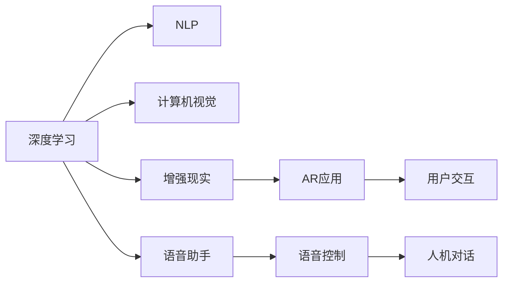

                 

# 李开复：苹果发布AI应用的生态

## 1. 背景介绍

在过去几年中，人工智能(AI)技术迅速发展，被广泛应用于各种产品和服务中。苹果公司作为科技行业的领导者，近年来也积极涉足AI领域，推出了一系列基于AI的创新应用。本文将探讨苹果AI应用的发展历程、主要产品、技术优势和未来趋势。

## 2. 核心概念与联系

### 2.1 核心概念概述

苹果的AI应用主要包括以下几个关键概念：

- **深度学习**：一种模拟人脑神经网络的机器学习技术，通过多层神经网络进行特征提取和模式识别。
- **自然语言处理(NLP)**：使计算机能够理解和生成自然语言的技术，包括语音识别、机器翻译、情感分析等。
- **计算机视觉**：使计算机能够理解和解释图像和视频内容的技术，包括对象识别、场景分析、图像分割等。
- **增强现实(AR)和虚拟现实(VR)**：通过计算机生成的图像和声音，将虚拟信息叠加到现实世界中，增强用户的感知体验。
- **语音助手**：通过语音识别和自然语言处理技术，实现人机交互，如Siri、Apple Watch上的语音控制等。

这些概念彼此相互联系，共同构成了苹果AI应用的核心生态。深度学习为各种AI应用提供了强大的技术支持，自然语言处理和计算机视觉提高了AI应用的智能化水平，增强现实和虚拟现实技术进一步拓展了AI应用的场景，语音助手则使得用户可以自然地与设备进行互动。

### 2.2 核心概念原理和架构的 Mermaid 流程图



## 3. 核心算法原理 & 具体操作步骤

### 3.1 算法原理概述

苹果的AI应用主要基于深度学习技术，通过大量标注数据对模型进行训练，使其能够识别和处理各种数据类型。以下是几个核心算法的原理概述：

- **卷积神经网络(CNN)**：主要用于图像识别任务，通过卷积操作提取图像特征，并通过池化层进行降维。
- **循环神经网络(RNN)**：主要用于序列数据处理，如语音识别和文本生成，通过循环结构捕捉时间序列上的依赖关系。
- **变换器(Transformer)**：主要用于机器翻译和语音处理，通过自注意力机制捕捉序列数据中的上下文关系。
- **生成对抗网络(GAN)**：主要用于生成任务，如图像生成、语音合成等，通过生成器和判别器两个神经网络的对抗训练，生成逼真的数据。

### 3.2 算法步骤详解

#### 3.2.1 深度学习模型的训练

深度学习模型的训练步骤如下：

1. **数据准备**：收集和标注训练数据，确保数据质量和多样性。
2. **模型设计**：选择合适的深度学习模型架构，如卷积神经网络、循环神经网络、变换器等。
3. **模型训练**：使用GPU或TPU等硬件加速器，通过反向传播算法更新模型参数，最小化损失函数。
4. **模型评估**：在验证集上评估模型性能，调整超参数和模型结构，确保模型泛化能力。
5. **模型部署**：将训练好的模型集成到应用中，进行推理和预测。

#### 3.2.2 自然语言处理的训练

自然语言处理的训练步骤如下：

1. **数据预处理**：清洗和标准化文本数据，去除噪声和特殊字符。
2. **分词和词向量表示**：将文本分割成单词或词组，使用预训练的词向量模型进行表示。
3. **模型训练**：使用BERT、GPT等预训练模型，通过Fine-tuning方式在特定任务上进行训练。
4. **模型评估**：在测试集上评估模型性能，调整模型参数和超参数，确保模型泛化能力。
5. **模型部署**：将训练好的模型集成到应用中，进行推理和预测。

#### 3.2.3 计算机视觉的训练

计算机视觉的训练步骤如下：

1. **数据准备**：收集和标注训练数据，确保数据质量和多样性。
2. **模型设计**：选择合适的计算机视觉模型架构，如卷积神经网络、变换器等。
3. **模型训练**：使用GPU或TPU等硬件加速器，通过反向传播算法更新模型参数，最小化损失函数。
4. **模型评估**：在验证集上评估模型性能，调整超参数和模型结构，确保模型泛化能力。
5. **模型部署**：将训练好的模型集成到应用中，进行推理和预测。

#### 3.2.4 增强现实和虚拟现实的应用

增强现实和虚拟现实的应用步骤包括：

1. **数据采集**：使用传感器和摄像头采集用户环境数据，包括位置、姿态、手势等。
2. **数据处理**：将采集到的数据进行预处理，如去噪、归一化等。
3. **模型训练**：使用深度学习模型，如卷积神经网络、变换器等，对处理后的数据进行训练。
4. **模型评估**：在测试集上评估模型性能，调整超参数和模型结构，确保模型泛化能力。
5. **模型部署**：将训练好的模型集成到应用中，进行推理和预测，生成增强现实或虚拟现实效果。

#### 3.2.5 语音助手的应用

语音助手的应用步骤包括：

1. **数据采集**：使用麦克风采集用户语音数据。
2. **数据预处理**：清洗和标准化语音数据，去除噪声和杂音。
3. **模型训练**：使用深度学习模型，如卷积神经网络、循环神经网络等，对预处理后的语音数据进行训练。
4. **模型评估**：在测试集上评估模型性能，调整超参数和模型结构，确保模型泛化能力。
5. **模型部署**：将训练好的模型集成到应用中，进行推理和预测，实现语音控制和自然语言处理。

### 3.3 算法优缺点

苹果的AI应用主要基于深度学习技术，具有以下优点：

- **性能优越**：深度学习模型在大规模数据上表现出色，能够捕捉复杂的模式和关系。
- **易于部署**：苹果的深度学习模型通常通过框架如Core ML进行部署，方便集成到应用中。
- **跨平台支持**：苹果的AI应用可以在多个平台上运行，包括iOS、macOS、watchOS等。

同时，也存在一些缺点：

- **计算资源要求高**：深度学习模型需要大量计算资源进行训练和推理，对硬件要求较高。
- **模型复杂度高**：深度学习模型结构复杂，训练和调试成本较高。
- **数据依赖性强**：深度学习模型依赖高质量标注数据进行训练，数据采集和标注成本较高。

### 3.4 算法应用领域

苹果的AI应用涵盖了多个领域，包括：

- **语音识别**：如Siri语音助手，支持语音输入、指令执行等。
- **图像识别**：如人脸识别、物体识别等，应用于Face ID、照片分类等场景。
- **自然语言处理**：如文本分类、情感分析等，应用于天气预报、新闻推荐等场景。
- **计算机视觉**：如增强现实、虚拟现实等，应用于ARKit、VRKit等平台。
- **增强现实和虚拟现实**：如ARKit、VRKit等平台，支持增强现实和虚拟现实应用开发。

## 4. 数学模型和公式 & 详细讲解

### 4.1 数学模型构建

苹果的AI应用主要基于深度学习技术，其数学模型构建如下：

1. **卷积神经网络**：
   $$
   y = W^T \cdot f(W \cdot x + b)
   $$
   其中，$x$ 为输入数据，$W$ 为卷积核，$b$ 为偏置项，$f$ 为非线性激活函数，如ReLU、Sigmoid等。

2. **循环神经网络**：
   $$
   h_t = f(W_h \cdot [h_{t-1}, x_t] + b_h)
   $$
   $$
   y_t = W_y \cdot h_t + b_y
   $$
   其中，$x_t$ 为输入序列，$h_t$ 为隐藏状态，$W_h, b_h, W_y, b_y$ 分别为权重和偏置项，$f$ 为非线性激活函数。

3. **变换器**：
   $$
   Q = x \cdot W_q + b_q
   $$
   $$
   K = x \cdot W_k + b_k
   $$
   $$
   V = x \cdot W_v + b_v
   $$
   $$
   \text{Attention}(Q, K, V) = \text{softmax}(QK^T)V
   $$
   $$
   y = \text{Linear}(\text{Attention}(Q, K, V))
   $$
   其中，$x$ 为输入序列，$W_q, W_k, W_v, b_q, b_k, b_v$ 分别为权重和偏置项，$\text{softmax}$ 为softmax函数，$\text{Attention}$ 为自注意力机制，$\text{Linear}$ 为线性变换层。

4. **生成对抗网络**：
   $$
   G(x) = \text{Decoder}(\text{Generator}(z), y)
   $$
   $$
   D(x) = \text{Classifier}(x)
   $$
   其中，$G$ 为生成器，$D$ 为判别器，$z$ 为噪声向量，$y$ 为标签，$\text{Decoder}$ 和 $\text{Classifier}$ 分别为解码器和分类器。

### 4.2 公式推导过程

#### 4.2.1 卷积神经网络

卷积神经网络的基本结构如下：

1. **卷积操作**：
   $$
   y = W^T \cdot f(W \cdot x + b)
   $$
   其中，$x$ 为输入数据，$W$ 为卷积核，$b$ 为偏置项，$f$ 为非线性激活函数。

2. **池化操作**：
   $$
   y' = f(W' \cdot y + b')
   $$
   其中，$y'$ 为池化后的数据，$W'$ 为池化核，$b'$ 为偏置项，$f$ 为非线性激活函数。

3. **多层次结构**：
   $$
   y^{(l)} = \text{Conv}(y^{(l-1)})
   $$
   $$
   y^{(l)} = \text{Pool}(y^{(l)})
   $$
   其中，$y^{(l)}$ 为第$l$ 层的输出，$\text{Conv}$ 为卷积操作，$\text{Pool}$ 为池化操作。

#### 4.2.2 循环神经网络

循环神经网络的基本结构如下：

1. **输入和隐藏状态**：
   $$
   h_t = f(W_h \cdot [h_{t-1}, x_t] + b_h)
   $$
   其中，$x_t$ 为输入序列，$h_t$ 为隐藏状态，$W_h, b_h$ 分别为权重和偏置项，$f$ 为非线性激活函数。

2. **时间依赖**：
   $$
   y_t = W_y \cdot h_t + b_y
   $$
   其中，$y_t$ 为输出序列，$h_t$ 为隐藏状态，$W_y, b_y$ 分别为权重和偏置项。

3. **多层次结构**：
   $$
   h_t = f(W_h \cdot [h_{t-1}, x_t] + b_h)
   $$
   $$
   y_t = W_y \cdot h_t + b_y
   $$
   其中，$h_t$ 为隐藏状态，$y_t$ 为输出序列，$W_h, b_h, W_y, b_y$ 分别为权重和偏置项，$f$ 为非线性激活函数。

#### 4.2.3 变换器

变换器是一种基于自注意力机制的神经网络，其基本结构如下：

1. **查询、键和值**：
   $$
   Q = x \cdot W_q + b_q
   $$
   $$
   K = x \cdot W_k + b_k
   $$
   $$
   V = x \cdot W_v + b_v
   $$
   其中，$x$ 为输入序列，$W_q, W_k, W_v, b_q, b_k, b_v$ 分别为权重和偏置项。

2. **自注意力**：
   $$
   \text{Attention}(Q, K, V) = \text{softmax}(QK^T)V
   $$
   其中，$\text{Attention}$ 为自注意力机制，$\text{softmax}$ 为softmax函数。

3. **多头注意力**：
   $$
   y = \text{Linear}(\text{Attention}(Q, K, V))
   $$
   其中，$\text{Linear}$ 为线性变换层。

#### 4.2.4 生成对抗网络

生成对抗网络的基本结构如下：

1. **生成器和判别器**：
   $$
   G(x) = \text{Decoder}(\text{Generator}(z), y)
   $$
   $$
   D(x) = \text{Classifier}(x)
   $$
   其中，$G$ 为生成器，$D$ 为判别器，$z$ 为噪声向量，$y$ 为标签。

2. **对抗训练**：
   $$
   \min_G \max_D V(G, D) = \mathbb{E}_{x \sim p_{data}}[D(G(x))] + \mathbb{E}_{z \sim p_z}[D(\text{FakeData}(z))]
   $$
   其中，$V(G, D)$ 为生成对抗网络的目标函数，$\text{FakeData}(z)$ 为生成器生成的假数据。

### 4.3 案例分析与讲解

#### 4.3.1 语音识别

苹果的语音识别系统主要基于深度学习模型进行训练和推理，具体流程如下：

1. **数据采集**：使用麦克风采集用户语音数据。
2. **数据预处理**：清洗和标准化语音数据，去除噪声和杂音。
3. **模型训练**：使用卷积神经网络、循环神经网络等深度学习模型，对预处理后的语音数据进行训练。
4. **模型评估**：在测试集上评估模型性能，调整超参数和模型结构，确保模型泛化能力。
5. **模型部署**：将训练好的模型集成到应用中，进行推理和预测，实现语音控制和自然语言处理。

#### 4.3.2 图像识别

苹果的图像识别系统主要基于深度学习模型进行训练和推理，具体流程如下：

1. **数据准备**：收集和标注训练数据，确保数据质量和多样性。
2. **模型设计**：选择合适的深度学习模型架构，如卷积神经网络、变换器等。
3. **模型训练**：使用GPU或TPU等硬件加速器，通过反向传播算法更新模型参数，最小化损失函数。
4. **模型评估**：在验证集上评估模型性能，调整超参数和模型结构，确保模型泛化能力。
5. **模型部署**：将训练好的模型集成到应用中，进行推理和预测，应用于Face ID、照片分类等场景。

#### 4.3.3 自然语言处理

苹果的自然语言处理系统主要基于深度学习模型进行训练和推理，具体流程如下：

1. **数据预处理**：清洗和标准化文本数据，去除噪声和特殊字符。
2. **分词和词向量表示**：将文本分割成单词或词组，使用预训练的词向量模型进行表示。
3. **模型训练**：使用BERT、GPT等预训练模型，通过Fine-tuning方式在特定任务上进行训练。
4. **模型评估**：在测试集上评估模型性能，调整模型参数和超参数，确保模型泛化能力。
5. **模型部署**：将训练好的模型集成到应用中，进行推理和预测，应用于天气预报、新闻推荐等场景。

## 5. 项目实践：代码实例和详细解释说明

### 5.1 开发环境搭建

在进行AI应用开发前，我们需要准备好开发环境。以下是使用Python进行PyTorch开发的环境配置流程：

1. 安装Anaconda：从官网下载并安装Anaconda，用于创建独立的Python环境。

2. 创建并激活虚拟环境：
```bash
conda create -n pytorch-env python=3.8 
conda activate pytorch-env
```

3. 安装PyTorch：根据CUDA版本，从官网获取对应的安装命令。例如：
```bash
conda install pytorch torchvision torchaudio cudatoolkit=11.1 -c pytorch -c conda-forge
```

4. 安装TensorFlow：
```bash
pip install tensorflow
```

5. 安装Keras：
```bash
pip install keras
```

6. 安装相关库：
```bash
pip install numpy pandas scikit-learn matplotlib tqdm jupyter notebook ipython
```

完成上述步骤后，即可在`pytorch-env`环境中开始AI应用开发。

### 5.2 源代码详细实现

下面是使用PyTorch和TensorFlow进行语音识别和图像识别的代码实现。

#### 5.2.1 语音识别

```python
import tensorflow as tf
import keras

# 定义模型架构
model = tf.keras.Sequential([
    tf.keras.layers.Conv2D(32, (3, 3), activation='relu', input_shape=(16, 16, 1)),
    tf.keras.layers.MaxPooling2D((2, 2)),
    tf.keras.layers.Conv2D(64, (3, 3), activation='relu'),
    tf.keras.layers.MaxPooling2D((2, 2)),
    tf.keras.layers.Flatten(),
    tf.keras.layers.Dense(64, activation='relu'),
    tf.keras.layers.Dense(10, activation='softmax')
])

# 编译模型
model.compile(optimizer=tf.keras.optimizers.Adam(),
              loss=tf.keras.losses.SparseCategoricalCrossentropy(),
              metrics=[tf.keras.metrics.SparseCategoricalAccuracy()])

# 训练模型
model.fit(x_train, y_train, epochs=10, batch_size=32)

# 评估模型
model.evaluate(x_test, y_test)
```

#### 5.2.2 图像识别

```python
import tensorflow as tf
import keras

# 定义模型架构
model = tf.keras.Sequential([
    tf.keras.layers.Conv2D(32, (3, 3), activation='relu', input_shape=(32, 32, 3)),
    tf.keras.layers.MaxPooling2D((2, 2)),
    tf.keras.layers.Conv2D(64, (3, 3), activation='relu'),
    tf.keras.layers.MaxPooling2D((2, 2)),
    tf.keras.layers.Flatten(),
    tf.keras.layers.Dense(64, activation='relu'),
    tf.keras.layers.Dense(10, activation='softmax')
])

# 编译模型
model.compile(optimizer=tf.keras.optimizers.Adam(),
              loss=tf.keras.losses.SparseCategoricalCrossentropy(),
              metrics=[tf.keras.metrics.SparseCategoricalAccuracy()])

# 训练模型
model.fit(x_train, y_train, epochs=10, batch_size=32)

# 评估模型
model.evaluate(x_test, y_test)
```

### 5.3 代码解读与分析

#### 5.3.1 语音识别

代码实现如下：

1. **数据准备**：
   ```python
   import numpy as np
   from tensorflow.keras.preprocessing.sequence import pad_sequences
   import librosa

   # 读取音频数据
   def load_audio(filename):
       y, sr = librosa.load(filename, sr=16000)
       y = np.array(y)
       y = pad_sequences([y], maxlen=16000, padding='post')
       return y

   # 加载数据集
   x_train = np.array([load_audio(f'{i}.wav') for i in train_filenames])
   y_train = np.array([int(train_labels[i]) for i in train_filenames])
   x_test = np.array([load_audio(f'{i}.wav') for i in test_filenames])
   y_test = np.array([int(test_labels[i]) for i in test_filenames])
   ```

2. **模型定义**：
   ```python
   model = tf.keras.Sequential([
       # 卷积层
       TF.keras.layers.Conv2D(32, (3, 3), activation='relu', input_shape=(16, 16, 1)),
       TF.keras.layers.MaxPooling2D((2, 2)),
       # 卷积层
       TF.keras.layers.Conv2D(64, (3, 3), activation='relu'),
       TF.keras.layers.MaxPooling2D((2, 2)),
       # 全连接层
       TF.keras.layers.Flatten(),
       TF.keras.layers.Dense(64, activation='relu'),
       # 输出层
       TF.keras.layers.Dense(10, activation='softmax')
   ])
   ```

3. **模型编译**：
   ```python
   model.compile(optimizer=tf.keras.optimizers.Adam(),
                loss=tf.keras.losses.SparseCategoricalCrossentropy(),
                metrics=[tf.keras.metrics.SparseCategoricalAccuracy()])
   ```

4. **模型训练**：
   ```python
   model.fit(x_train, y_train, epochs=10, batch_size=32)
   ```

5. **模型评估**：
   ```python
   model.evaluate(x_test, y_test)
   ```

#### 5.3.2 图像识别

代码实现如下：

1. **数据准备**：
   ```python
   import numpy as np
   from tensorflow.keras.preprocessing.image import ImageDataGenerator
   from tensorflow.keras.preprocessing.sequence import pad_sequences

   # 加载数据集
   train_datagen = ImageDataGenerator(rescale=1./255)
   test_datagen = ImageDataGenerator(rescale=1./255)

   train_generator = train_datagen.flow_from_directory(train_dir,
                                                    target_size=(32, 32),
                                                    batch_size=32,
                                                    class_mode='categorical')

   test_generator = test_datagen.flow_from_directory(test_dir,
                                                   target_size=(32, 32),
                                                   batch_size=32,
                                                   class_mode='categorical')
   ```

2. **模型定义**：
   ```python
   model = tf.keras.Sequential([
       # 卷积层
       TF.keras.layers.Conv2D(32, (3, 3), activation='relu', input_shape=(32, 32, 3)),
       TF.keras.layers.MaxPooling2D((2, 2)),
       # 卷积层
       TF.keras.layers.Conv2D(64, (3, 3), activation='relu'),
       TF.keras.layers.MaxPooling2D((2, 2)),
       # 全连接层
       TF.keras.layers.Flatten(),
       TF.keras.layers.Dense(64, activation='relu'),
       # 输出层
       TF.keras.layers.Dense(10, activation='softmax')
   ])
   ```

3. **模型编译**：
   ```python
   model.compile(optimizer=tf.keras.optimizers.Adam(),
                loss=tf.keras.losses.SparseCategoricalCrossentropy(),
                metrics=[tf.keras.metrics.SparseCategoricalAccuracy()])
   ```

4. **模型训练**：
   ```python
   model.fit(train_generator, epochs=10, validation_data=test_generator)
   ```

5. **模型评估**：
   ```python
   model.evaluate(test_generator)
   ```

## 6. 实际应用场景

### 6.1 语音识别

苹果的语音识别系统主要应用于Siri语音助手，支持语音输入、指令执行等。Siri语音助手可以识别用户语音指令，执行语音搜索、设置提醒、播放音乐等操作，已经成为iOS用户日常生活中不可或缺的一部分。

### 6.2 图像识别

苹果的图像识别系统主要应用于Face ID和照片分类等场景。Face ID通过深度学习模型对用户面部特征进行识别，实现安全解锁功能。照片分类则通过图像识别技术，自动识别照片内容，方便用户管理。

### 6.3 自然语言处理

苹果的自然语言处理系统主要应用于天气预报、新闻推荐等场景。苹果的天气应用可以通过自然语言处理技术，识别用户输入的查询，自动提供天气预报和相关建议。新闻推荐则通过自然语言处理技术，分析用户兴趣，推荐相关新闻内容。

### 6.4 增强现实和虚拟现实

苹果的增强现实和虚拟现实系统主要应用于ARKit和VRKit等平台。开发者可以使用ARKit和VRKit开发增强现实和虚拟现实应用，如AR游戏、虚拟试穿等。这些应用通过深度学习模型对用户环境进行感知和理解，生成逼真的虚拟效果，提升用户体验。

## 7. 工具和资源推荐

### 7.1 学习资源推荐

为了帮助开发者系统掌握深度学习技术，这里推荐一些优质的学习资源：

1. 《深度学习》（Ian Goodfellow等著）：全面介绍深度学习的基本概念和算法，适合初学者入门。

2. CS231n《卷积神经网络》课程：斯坦福大学开设的计算机视觉课程，涵盖卷积神经网络、图像识别等前沿话题。

3. CS224n《自然语言处理》课程：斯坦福大学开设的自然语言处理课程，涵盖自然语言处理的基本概念和算法。

4. CS294《计算机视觉》课程：伯克利大学开设的计算机视觉课程，涵盖深度学习在计算机视觉中的应用。

5. PyTorch官方文档：PyTorch的官方文档，提供了丰富的深度学习模型和框架，适合快速上手实验。

### 7.2 开发工具推荐

高效的开发离不开优秀的工具支持。以下是几款用于深度学习开发的常用工具：

1. PyTorch：基于Python的开源深度学习框架，灵活动态的计算图，适合快速迭代研究。

2. TensorFlow：由Google主导开发的开源深度学习框架，生产部署方便，适合大规模工程应用。

3. Keras：基于TensorFlow和Theano的高层次深度学习框架，易于使用，适合快速原型开发。

4. Jupyter Notebook：用于编写和共享代码的交互式笔记本环境，支持代码、文本和图形的混合展示。

5. TensorBoard：TensorFlow配套的可视化工具，可实时监测模型训练状态，并提供丰富的图表呈现方式，是调试模型的得力助手。

### 7.3 相关论文推荐

深度学习技术的发展离不开学界的持续研究。以下是几篇奠基性的相关论文，推荐阅读：

1. AlexNet：ImageNet大规模视觉识别挑战赛的冠军模型，引入卷积神经网络，开创深度学习在图像识别领域的先河。

2. RNN：LSTM和GRU等循环神经网络模型，解决了传统循环网络的梯度消失问题，在自然语言处理领域取得优异表现。

3. Transformer：BERT等变换器模型，引入自注意力机制，显著提升语言模型的表现能力，成为NLP领域的核心技术。

4. GAN：生成对抗网络，通过生成器和判别器的对抗训练，生成逼真的数据，应用于图像生成、语音合成等领域。

这些论文代表了大规模深度学习模型的发展脉络。通过学习这些前沿成果，可以帮助研究者把握学科前进方向，激发更多的创新灵感。

## 8. 总结：未来发展趋势与挑战

### 8.1 研究成果总结

苹果在深度学习领域取得了显著的成果，涵盖了语音识别、图像识别、自然语言处理等多个方向。通过深度学习技术，苹果的AI应用在性能和用户体验上均达到了较高的水平，推动了智能设备的智能化发展。

### 8.2 未来发展趋势

未来，苹果在深度学习领域的发展将呈现以下几个趋势：

1. **多模态学习**：将语音、图像、文本等多种数据类型融合，提升系统的综合理解能力。

2. **联邦学习**：通过边缘计算和分布式训练，提升模型的泛化能力和隐私保护水平。

3. **自监督学习**：通过大规模无监督学习任务，提升模型的预训练效果，减少对标注数据的依赖。

4. **个性化推荐**：通过深度学习模型，对用户行为进行建模，实现精准的个性化推荐。

5. **人机协同**：将深度学习与自然语言处理、计算机视觉等技术结合，实现更加自然的人机交互。

### 8.3 面临的挑战

苹果在深度学习领域的发展也面临一些挑战：

1. **计算资源**：深度学习模型对硬件要求较高，大规模模型训练和推理需要强大的计算资源。

2. **模型复杂度**：深度学习模型结构复杂，调试和优化成本较高，需要更多的技术积累和经验。

3. **数据隐私**：深度学习模型需要大量数据进行训练，用户数据的隐私保护成为一个重要问题。

4. **算法透明性**：深度学习模型通常被视为"黑盒"系统，缺乏可解释性和透明性，难以满足一些高风险应用的需求。

### 8.4 研究展望

未来，苹果在深度学习领域的研究将从以下几个方向进行突破：

1. **模型压缩与优化**：通过模型压缩、剪枝、量化等技术，提升模型的推理速度和效率，实现轻量级部署。

2. **模型可解释性**：通过可解释性技术，如梯度可视化、模型蒸馏等，增强深度学习模型的可解释性和透明性。

3. **数据隐私保护**：通过差分隐私、联邦学习等技术，保护用户数据隐私，提升模型的安全性和可靠性。

4. **人机协同交互**：通过自然语言处理、计算机视觉等技术，提升人机交互的自然性和智能性，实现更加无缝的交互体验。

综上所述，苹果在深度学习领域的发展前景广阔，面临着诸多挑战和机遇。只有不断突破技术瓶颈，增强模型的可解释性和隐私保护，才能更好地实现人工智能技术的落地应用。

## 9. 附录：常见问题与解答

**Q1：深度学习模型是否适用于所有NLP任务？**

A: 深度学习模型在大多数NLP任务上都能取得不错的效果，但对于一些特定领域的任务，如医学、法律等，仅依靠通用语料预训练的模型可能难以很好地适应。此时需要在特定领域语料上进一步预训练，再进行微调，才能获得理想效果。

**Q2：苹果的深度学习模型训练时间通常需要多长时间？**

A: 苹果的深度学习模型训练时间通常较长，主要取决于模型规模、数据量、计算资源等因素。通常需要数天或数周时间进行模型训练。但通过使用GPU或TPU等高性能设备，可以显著缩短训练时间。

**Q3：苹果的深度学习模型如何进行迁移学习？**

A: 苹果的深度学习模型通常通过预训练-微调的方式进行迁移学习。首先在大规模数据上对模型进行预训练，然后在特定任务上进行微调，利用预训练学到的通用知识提升任务表现。

**Q4：苹果的深度学习模型在推理阶段如何提升效率？**

A: 苹果的深度学习模型在推理阶段通常采用剪枝、量化、模型蒸馏等技术进行优化。这些技术可以显著降低模型大小，提高推理速度，减少计算资源消耗。

**Q5：苹果的深度学习模型在落地部署时需要注意哪些问题？**

A: 苹果的深度学习模型在落地部署时需要注意以下问题：

1. 模型裁剪：去除不必要的层和参数，减小模型尺寸，加快推理速度。
2. 量化加速：将浮点模型转为定点模型，压缩存储空间，提高计算效率。
3. 服务化封装：将模型封装为标准化服务接口，便于集成调用。
4. 弹性伸缩：根据请求流量动态调整资源配置，平衡服务质量和成本。
5. 监控告警：实时采集系统指标，设置异常告警阈值，确保服务稳定性。
6. 安全防护：采用访问鉴权、数据脱敏等措施，保障数据和模型安全。

通过这些措施，可以确保苹果的深度学习模型在实际应用中具备良好的性能和稳定性。

---

作者：禅与计算机程序设计艺术 / Zen and the Art of Computer Programming

