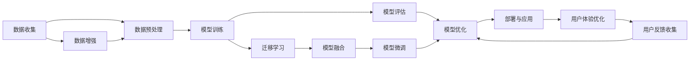

                 

# 李开复：苹果发布AI应用的科技价值

## 1. 背景介绍

近年来，人工智能（AI）技术在各行业的应用越来越广泛，科技巨头如苹果公司也在积极布局AI领域。本文将深入探讨苹果公司最新发布的AI应用，分析其科技价值、应用场景及未来发展趋势。

## 2. 核心概念与联系

### 2.1 核心概念概述

人工智能（Artificial Intelligence, AI）：通过模拟人类的智能行为，利用计算机算法和数据进行问题解决和决策。其核心技术包括机器学习、深度学习、自然语言处理（NLP）、计算机视觉等。

AI应用：指将AI技术应用到具体业务场景中的解决方案。常见的AI应用包括智能客服、语音识别、图像识别、推荐系统等。

苹果AI应用：指苹果公司开发和发布的各类AI应用，如Siri语音助手、Face ID人脸识别、图像识别等。

### 2.2 核心概念原理和架构的 Mermaid 流程图



该图展示了AI应用从数据收集到部署的完整流程，其中：

- **数据收集**：从不同渠道获取数据，为AI模型训练提供原始数据源。
- **数据预处理**：清洗、标注、划分数据集，为模型训练准备数据。
- **模型训练**：使用深度学习算法训练模型，学习数据的特征表示。
- **模型评估**：评估模型的性能指标，如准确率、召回率、F1分数等。
- **模型优化**：根据评估结果，调整模型参数，提升模型效果。
- **部署与应用**：将模型部署到实际应用场景中，为用户服务。
- **数据增强**：通过数据扩充、生成对抗网络（GAN）等方式增加数据量，提升模型鲁棒性。
- **迁移学习**：使用预训练模型或已有模型知识，减少新模型的训练时间。
- **用户体验优化**：根据用户反馈，不断迭代优化模型和应用界面。
- **模型融合**：将多个模型组合使用，提升整体性能。
- **用户反馈收集**：通过用户使用反馈，优化模型性能。
- **模型微调**：根据新数据，对模型进行微调，保持模型时效性。

### 2.3 核心概念联系

苹果AI应用的技术原理可以概括为“数据驱动 + 算法驱动”，即利用大量数据训练深度学习模型，并通过优化算法提升模型效果。苹果的AI应用涵盖了语音识别、图像处理、自然语言处理等多个领域，通过技术融合和用户体验优化，实现了跨场景的智能化服务。

## 3. 核心算法原理 & 具体操作步骤

### 3.1 算法原理概述

苹果公司的AI应用主要基于深度学习算法，通过大量标注数据训练模型，学习数据的特征表示，并通过优化算法提升模型效果。其主要算法包括：

- **卷积神经网络（CNN）**：用于图像识别和计算机视觉任务，通过卷积操作提取图像特征。
- **循环神经网络（RNN）和长短期记忆网络（LSTM）**：用于序列数据处理，如自然语言处理和语音识别任务。
- **生成对抗网络（GAN）**：用于数据增强和生成任务，通过生成逼真数据提升模型鲁棒性。
- **强化学习**：用于智能决策和推荐系统，通过模拟奖励机制优化模型。

### 3.2 算法步骤详解

苹果公司的AI应用开发主要包括以下几个关键步骤：

**Step 1: 数据收集与预处理**
- 从不同渠道收集数据，如摄像头、麦克风、文本输入等。
- 对数据进行清洗、去噪、标注，确保数据质量。
- 将数据划分为训练集、验证集和测试集，供模型训练和评估。

**Step 2: 模型训练与优化**
- 选择合适的深度学习模型，如CNN、RNN、LSTM等。
- 使用大量标注数据训练模型，学习数据特征。
- 应用优化算法（如Adam、SGD等）和正则化技术（如Dropout、L2正则化），提升模型效果。
- 在验证集上评估模型性能，调整超参数，优化模型。

**Step 3: 模型部署与应用**
- 将训练好的模型部署到实际应用场景中，如iOS、macOS、watchOS等。
- 集成模型到应用中，如Siri、Face ID、相机等。
- 根据用户反馈，不断优化模型和应用界面，提升用户体验。

**Step 4: 模型微调和更新**
- 根据新数据和新需求，对模型进行微调，保持模型时效性。
- 结合用户反馈，优化模型参数，提升模型效果。
- 定期更新模型，保持模型性能。

### 3.3 算法优缺点

苹果AI应用的优点包括：

- **高效性**：通过深度学习算法和大数据训练，模型效果显著，能够快速响应用户需求。
- **稳定性**：通过优化算法和正则化技术，模型具有较好的鲁棒性和泛化能力。
- **可扩展性**：能够支持多场景、多模态数据的处理，适应复杂应用需求。

其缺点包括：

- **数据依赖**：模型效果高度依赖于数据质量，数据获取和标注成本较高。
- **模型复杂性**：深度学习模型结构复杂，调试和优化难度较大。
- **资源消耗**：模型训练和推理需要大量计算资源，如GPU、TPU等，成本较高。

### 3.4 算法应用领域

苹果AI应用广泛覆盖了以下几个领域：

- **语音识别**：如Siri语音助手，能够理解自然语言指令，提供多种应用场景的智能交互。
- **人脸识别**：如Face ID人脸解锁功能，具有高精度和高安全性。
- **图像识别**：如相机的智能拍照功能，能够自动识别人物、场景等。
- **自然语言处理**：如Siri的自然语言理解能力，能够进行智能问答、语音翻译等。
- **推荐系统**：如App Store的推荐算法，能够根据用户行为推荐应用和内容。

## 4. 数学模型和公式 & 详细讲解 & 举例说明

### 4.1 数学模型构建

苹果公司AI应用的核心数学模型是深度神经网络，其结构如图：

```
Input Layer (Input layer)
Hidden Layer (Hidden layer)
Output Layer (Output layer)
```

输入层接收原始数据，经过一系列变换（如卷积、池化、全连接等）后进入隐藏层，隐藏层进行特征提取和编码，最终输出层输出预测结果。

### 4.2 公式推导过程

以Siri语音识别为例，其核心模型为卷积神经网络（CNN），公式如下：

$$
y = f(Wx + b)
$$

其中，$W$ 为权重矩阵，$b$ 为偏置向量，$f$ 为激活函数，$x$ 为输入，$y$ 为输出。

### 4.3 案例分析与讲解

以Face ID为例，其核心模型为卷积神经网络（CNN），用于识别人脸特征。该模型的训练过程分为以下几个步骤：

1. **数据收集**：从手机摄像头收集人脸图像数据，并进行标注。
2. **数据预处理**：对数据进行去噪、归一化、划分数据集。
3. **模型训练**：使用标注数据训练CNN模型，学习人脸特征。
4. **模型评估**：在验证集上评估模型性能，调整超参数。
5. **模型部署**：将训练好的模型部署到手机中，实现人脸解锁功能。
6. **模型微调**：根据新数据和新需求，对模型进行微调，保持模型时效性。

## 5. 项目实践：代码实例和详细解释说明

### 5.1 开发环境搭建

在苹果AI应用开发中，通常使用Python和PyTorch框架进行模型训练和部署。以下是开发环境搭建步骤：

1. 安装Python：建议使用Python 3.7及以上版本。
2. 安装PyTorch：使用以下命令安装PyTorch：

   ```
   pip install torch torchvision torchaudio
   ```

3. 安装TensorFlow：如果使用TensorFlow进行模型训练，可以使用以下命令安装：

   ```
   pip install tensorflow
   ```

4. 安装其他库：根据需要安装其他相关库，如Numpy、Pandas、Scikit-learn等。

### 5.2 源代码详细实现

以Siri语音识别为例，其代码实现如下：

```python
import torch
import torch.nn as nn
import torch.optim as optim
from torch.utils.data import DataLoader

class CNN(nn.Module):
    def __init__(self):
        super(CNN, self).__init__()
        self.conv1 = nn.Conv2d(3, 32, kernel_size=3, stride=1, padding=1)
        self.relu = nn.ReLU()
        self.pool = nn.MaxPool2d(kernel_size=2, stride=2)
        self.fc1 = nn.Linear(32 * 28 * 28, 128)
        self.fc2 = nn.Linear(128, num_classes)
    
    def forward(self, x):
        x = self.conv1(x)
        x = self.relu(x)
        x = self.pool(x)
        x = x.view(-1, 32 * 28 * 28)
        x = self.fc1(x)
        x = self.relu(x)
        x = self.fc2(x)
        return x

model = CNN()
criterion = nn.CrossEntropyLoss()
optimizer = optim.Adam(model.parameters(), lr=0.001)

train_loader = DataLoader(train_dataset, batch_size=64, shuffle=True)
val_loader = DataLoader(val_dataset, batch_size=64, shuffle=False)

for epoch in range(num_epochs):
    for i, (images, labels) in enumerate(train_loader):
        images = images.view(-1, 3, 28, 28)
        outputs = model(images)
        loss = criterion(outputs, labels)
        optimizer.zero_grad()
        loss.backward()
        optimizer.step()
    
    val_loss = 0
    val_acc = 0
    for images, labels in val_loader:
        images = images.view(-1, 3, 28, 28)
        outputs = model(images)
        loss = criterion(outputs, labels)
        val_loss += loss.item()
        _, predicted = torch.max(outputs.data, 1)
        correct = (predicted == labels).sum().item()
        val_acc += correct / labels.size(0)
    
    print(f"Epoch {epoch+1}, train loss: {loss:.3f}, val loss: {val_loss/len(val_loader):.3f}, val acc: {val_acc/len(val_loader):.3f}")
```

### 5.3 代码解读与分析

上述代码实现了卷积神经网络（CNN）的训练过程，其主要步骤包括：

1. **定义模型**：使用nn.Module类定义CNN模型，包含卷积层、激活函数、池化层和全连接层。
2. **定义损失函数和优化器**：使用CrossEntropyLoss作为损失函数，Adam作为优化器。
3. **数据加载**：使用DataLoader加载训练集和验证集数据。
4. **训练过程**：在每个epoch内，对训练集进行前向传播和反向传播，更新模型参数。
5. **评估过程**：在验证集上计算损失和准确率，输出结果。

## 6. 实际应用场景

### 6.1 智能客服系统

苹果的智能客服系统利用AI技术，能够自动回答用户常见问题，提升客户满意度。具体实现如下：

1. **数据收集**：收集用户的历史查询数据和常见问题。
2. **数据预处理**：对数据进行清洗、标注、划分数据集。
3. **模型训练**：使用标注数据训练模型，学习问题-回答映射。
4. **模型评估**：在验证集上评估模型性能，调整超参数。
5. **模型部署**：将训练好的模型部署到智能客服系统中，实现自动问答。

### 6.2 图像识别

苹果的图像识别技术广泛应用于相机、相册等应用中，能够自动识别人物、场景等。具体实现如下：

1. **数据收集**：从相机中收集图像数据，并进行标注。
2. **数据预处理**：对数据进行去噪、归一化、划分数据集。
3. **模型训练**：使用标注数据训练CNN模型，学习图像特征。
4. **模型评估**：在验证集上评估模型性能，调整超参数。
5. **模型部署**：将训练好的模型部署到相机中，实现智能拍照功能。

### 6.3 自然语言处理

苹果的自然语言处理技术广泛应用于Siri、消息应用等，能够理解自然语言指令，提供智能交互。具体实现如下：

1. **数据收集**：收集用户的历史语音数据和文本数据。
2. **数据预处理**：对数据进行清洗、标注、划分数据集。
3. **模型训练**：使用标注数据训练RNN或LSTM模型，学习语言特征。
4. **模型评估**：在验证集上评估模型性能，调整超参数。
5. **模型部署**：将训练好的模型部署到Siri中，实现语音识别和自然语言理解。

## 7. 工具和资源推荐

### 7.1 学习资源推荐

苹果AI应用的开发需要掌握深度学习、计算机视觉、自然语言处理等技术，以下是一些推荐的资源：

1. **《深度学习》课程**：斯坦福大学提供的深度学习课程，涵盖深度学习基础和最新技术。
2. **《TensorFlow实战》书籍**：由TensorFlow官方编写，详细介绍了TensorFlow的使用方法和应用场景。
3. **《自然语言处理综论》书籍**：由斯坦福大学教授编写的自然语言处理经典教材，涵盖自然语言处理的基础理论和前沿技术。

### 7.2 开发工具推荐

苹果AI应用的开发需要借助深度学习框架和工具进行模型训练和部署，以下是一些推荐的工具：

1. **PyTorch**：由Facebook开发的深度学习框架，支持GPU加速，高效易用。
2. **TensorFlow**：由Google开发的深度学习框架，支持分布式计算，灵活高效。
3. **Keras**：基于TensorFlow和Theano开发的高级深度学习框架，易于上手。
4. **Jupyter Notebook**：轻量级的交互式编程环境，支持Python和多种库的快速开发。

### 7.3 相关论文推荐

苹果AI应用的开发需要借鉴最新的研究成果，以下是一些推荐的论文：

1. **《深度卷积神经网络》论文**：提出卷积神经网络（CNN）架构，广泛应用于图像识别任务。
2. **《循环神经网络》论文**：提出循环神经网络（RNN）架构，广泛应用于自然语言处理任务。
3. **《生成对抗网络》论文**：提出生成对抗网络（GAN）架构，用于数据增强和生成任务。
4. **《强化学习》论文**：提出强化学习算法，用于智能决策和推荐系统。

## 8. 总结：未来发展趋势与挑战

### 8.1 研究成果总结

苹果公司通过发布各类AI应用，展示了AI技术的强大潜力和广泛应用场景。其主要研究成果包括：

- **高效性**：利用深度学习和大数据训练，实现快速响应和高精度预测。
- **稳定性**：通过优化算法和正则化技术，提升模型鲁棒性和泛化能力。
- **可扩展性**：支持多场景、多模态数据的处理，适应复杂应用需求。

### 8.2 未来发展趋势

未来苹果AI应用的发展趋势如下：

1. **智能交互**：利用自然语言处理技术，提升智能客服、语音助手等应用的交互体验。
2. **智能决策**：利用强化学习技术，提升推荐系统、游戏等应用的智能决策能力。
3. **跨模态融合**：结合图像、语音、文本等多种模态数据，提升AI应用的多场景适应能力。
4. **隐私保护**：加强数据隐私保护，避免数据泄露和滥用。
5. **普适性**：提升AI应用的普适性，适应更多人群和场景。

### 8.3 面临的挑战

苹果AI应用在发展过程中也面临以下挑战：

1. **数据隐私**：在数据收集和使用过程中，如何保护用户隐私，避免数据滥用。
2. **模型鲁棒性**：模型在复杂场景下的鲁棒性，如对抗攻击、噪声干扰等。
3. **计算资源**：大规模深度学习模型的计算需求高，如何降低计算成本。
4. **用户体验**：在保证模型效果的同时，如何提升用户体验，避免过度复杂。

### 8.4 研究展望

未来苹果AI应用的研究展望如下：

1. **数据隐私保护**：开发隐私保护技术，如差分隐私、联邦学习等，保护用户隐私。
2. **模型鲁棒性提升**：研究鲁棒性增强技术，如对抗训练、鲁棒性正则化等，提升模型鲁棒性。
3. **计算资源优化**：研究模型压缩、量化加速等技术，降低计算成本。
4. **用户体验优化**：研究界面设计、交互逻辑等，提升用户体验。

## 9. 附录：常见问题与解答

**Q1：苹果公司发布的AI应用有哪些？**

A: 苹果公司发布的AI应用包括Siri语音助手、Face ID人脸识别、智能相机、智能客服等。

**Q2：苹果AI应用的开发流程是什么？**

A: 苹果AI应用的开发流程包括数据收集、数据预处理、模型训练、模型评估、模型部署、模型微调等步骤。

**Q3：苹果AI应用的核心算法是什么？**

A: 苹果AI应用的核心算法包括卷积神经网络（CNN）、循环神经网络（RNN）、长短期记忆网络（LSTM）、生成对抗网络（GAN）、强化学习等。

**Q4：苹果AI应用在实际应用中面临哪些挑战？**

A: 苹果AI应用在实际应用中面临数据隐私、模型鲁棒性、计算资源、用户体验等挑战。

**Q5：苹果AI应用未来有哪些发展方向？**

A: 苹果AI应用未来将朝着智能交互、智能决策、跨模态融合、隐私保护、普适性等方向发展。

**Q6：苹果AI应用在智能客服系统中如何提升用户体验？**

A: 苹果AI应用在智能客服系统中通过自然语言处理技术，提升自动问答的准确性和流畅性，提升用户体验。

**Q7：苹果AI应用在图像识别中如何提升鲁棒性？**

A: 苹果AI应用在图像识别中通过对抗训练等技术，提升模型对噪声、对抗攻击等鲁棒性。

**Q8：苹果AI应用在推荐系统中如何提升智能决策？**

A: 苹果AI应用在推荐系统中通过强化学习技术，提升推荐算法的智能决策能力，提升用户体验。

**Q9：苹果AI应用在隐私保护中如何保护用户数据？**

A: 苹果AI应用在隐私保护中使用差分隐私、联邦学习等技术，保护用户数据隐私。

**Q10：苹果AI应用在计算资源优化中如何降低计算成本？**

A: 苹果AI应用在计算资源优化中使用模型压缩、量化加速等技术，降低计算成本。

---

作者：禅与计算机程序设计艺术 / Zen and the Art of Computer Programming

