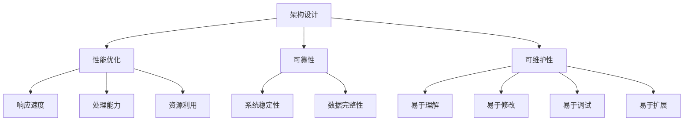

                 

# 架构设计与幻觉相关问题

> 关键词：架构设计, 系统重构, 软件工程, 性能优化, 可靠性, 可维护性, 架构幻觉, 软件架构师, 软件开发

## 1. 背景介绍

### 1.1 问题由来
在软件开发中，架构设计是构建复杂系统时的一个核心环节。一个良好的架构不仅能够确保系统的可维护性和可扩展性，还能够显著提升系统的性能和可靠性。然而，在实际的项目开发中，我们经常会发现，尽管架构设计被广泛推崇，但不少项目在后期维护、扩展或升级时仍面临诸多问题，性能瓶颈、系统崩溃、功能漏洞等现象屡见不鲜。这让我们不得不反思：究竟在架构设计中存在哪些常见的误区，哪些因素导致了架构设计的失败，以及如何在实践中避免这些问题。

### 1.2 问题核心关键点
架构设计失败的原因多种多样，但大部分问题都与对架构设计本质的误解有关。以下是一些典型的架构设计误区，其核心在于对架构设计的基本概念和原则理解不足：

1. **架构幻觉**：错误地认为架构设计一劳永逸，一旦设计完成即可自动解决所有问题。
2. **过早优化**：在初期架构设计阶段过早引入优化，忽略了核心业务功能的实现。
3. **需求泛化**：将需求泛化，不充分考虑未来业务变化，导致架构无法适应变化。
4. **技术栈冲突**：过度追求新技术栈，忽视了技术栈的兼容性和成熟度。
5. **性能误区**：对性能优化有误解，认为微调算法比架构设计更重要。
6. **可靠性忽视**：过度关注功能开发，忽视了系统的可靠性和稳定性。
7. **可维护性缺失**：代码和系统设计缺乏可维护性，导致后期维护困难。
8. **缺乏测试**：缺乏系统测试和架构评估，导致架构设计存在缺陷。

### 1.3 问题研究意义
通过对架构设计中常见误区的研究，我们可以更好地理解架构设计的本质和重要性，从而在实际项目中做出更科学的决策。这不仅有助于提升系统的性能和可靠性，还能显著提高开发效率和可维护性，为企业的长期发展奠定坚实的基础。

## 2. 核心概念与联系

### 2.1 核心概念概述

为了深入理解架构设计与相关问题的关联，我们需要先回顾一些核心概念：

- **架构设计**：架构设计是构建复杂系统的蓝图，它涉及系统的整体结构、组件划分、交互机制、数据流等方面，旨在提供一个灵活、可扩展、高性能的系统框架。
- **性能优化**：性能优化是指在保证系统功能完整性的前提下，通过合理的设计和实现手段，提升系统的响应速度、处理能力和资源利用效率。
- **可靠性**：可靠性是指系统在各种异常情况下能够稳定运行，不出现数据丢失、系统崩溃等问题。
- **可维护性**：可维护性是指系统易于理解、修改、调试和扩展，使得开发团队能够高效地进行代码维护和功能更新。
- **架构幻觉**：架构幻觉是指错误地认为架构设计可以解决所有问题，一旦设计完成即可自动解决系统中的各种问题。

这些概念之间存在着密切的联系，共同构成了架构设计的核心要素。下面将通过Mermaid流程图来展示这些概念之间的联系：



这个流程图展示了架构设计、性能优化、可靠性、可维护性四个核心概念之间的联系。

## 3. 核心算法原理 & 具体操作步骤
### 3.1 算法原理概述

架构设计与相关的算法原理紧密相连，具体包括以下几个方面：

1. **模块化设计**：将系统划分为多个独立的模块，每个模块负责单一的功能，模块之间通过接口进行通信，提升系统的可维护性和可扩展性。
2. **分层架构**：将系统分为多个层次，每个层次处理特定类型的任务，减少层次之间的依赖，提高系统的灵活性和可扩展性。
3. **负载均衡**：合理分配系统的负载，避免单点故障，提升系统的稳定性和可扩展性。
4. **异步通信**：通过异步通信减少系统耦合，提升系统的响应速度和资源利用效率。
5. **缓存机制**：利用缓存机制减少数据库访问次数，提升系统的响应速度和处理能力。
6. **错误处理**：设计合理的错误处理机制，确保系统在异常情况下的稳定性和可靠性。

### 3.2 算法步骤详解

架构设计与相关的算法步骤主要包括以下几个环节：

**Step 1: 需求分析与定义**
- 与业务方沟通，理解业务需求和目标。
- 定义系统的功能、性能、可靠性、可维护性等要求。
- 明确系统的边界和接口，确保系统与其他系统的交互符合规范。

**Step 2: 系统架构设计**
- 确定系统的高层结构，包括模块划分、层次设计、接口定义等。
- 设计系统的数据流和控制流，确保数据传递和处理符合规范。
- 确定系统的负载分布和缓存机制，提升系统的响应速度和资源利用效率。

**Step 3: 性能评估与优化**
- 使用性能评估工具，对系统进行负载测试和压力测试。
- 根据测试结果，识别系统性能瓶颈，优化代码和架构设计。
- 设计合理的负载均衡和缓存机制，提升系统的响应速度和处理能力。

**Step 4: 可靠性设计**
- 设计系统的错误处理机制，确保系统在异常情况下的稳定性。
- 实现系统的数据备份和恢复机制，防止数据丢失。
- 进行系统测试，确保系统的可靠性符合要求。

**Step 5: 可维护性优化**
- 设计清晰的代码结构和命名规范，提升代码的可读性和可维护性。
- 实现模块化和组件化设计，提升系统的可扩展性和可维护性。
- 进行代码审查和测试，确保系统的可维护性符合要求。

### 3.3 算法优缺点

架构设计与相关的算法具有以下优点：

1. **提升系统的可维护性和可扩展性**：通过合理的模块化和分层架构设计，系统更加易于理解、修改和扩展。
2. **提高系统的性能和资源利用效率**：通过缓存机制、异步通信、负载均衡等优化手段，提升系统的响应速度和处理能力。
3. **增强系统的稳定性和可靠性**：通过设计合理的错误处理机制和数据备份恢复机制，确保系统在异常情况下的稳定性和可靠性。

同时，架构设计与相关的算法也存在一些缺点：

1. **初期设计成本高**：架构设计需要大量的时间和精力，初期设计成本较高。
2. **设计与实现的偏差**：架构设计与实际实现可能存在偏差，需要进行多次迭代和调整。
3. **技术栈选择困难**：选择合适的技术栈和工具，需要综合考虑系统的需求、性能、可靠性、可维护性等多个因素。

### 3.4 算法应用领域

架构设计与相关的算法应用广泛，主要包括以下几个领域：

1. **Web应用架构设计**：包括Web应用的前端架构和后端架构设计，如MVC、RESTful API、微服务架构等。
2. **分布式系统架构设计**：包括分布式系统的高可用架构、负载均衡、数据同步等设计。
3. **大数据架构设计**：包括大数据系统的分布式计算架构、数据存储架构、数据处理架构等设计。
4. **云计算架构设计**：包括云计算平台的服务架构、容器化架构、微服务架构等设计。
5. **移动应用架构设计**：包括移动应用的模块化设计、异步通信、本地缓存等设计。

## 4. 数学模型和公式 & 详细讲解 & 举例说明

### 4.1 数学模型构建

为了更好地理解架构设计与相关的算法原理，我们采用数学语言对系统性能优化进行严格的描述。

设系统在某段时间内的负载为 $L(t)$，响应时间为 $R(t)$，响应速度为 $V$，系统可靠性和可用性为 $A$，数据完整性为 $I$。系统的总体性能 $P$ 可以表示为：

$$
P = \frac{V}{L(t)} \times A \times I
$$

其中，响应速度 $V$ 与负载 $L(t)$ 成正比，与响应时间 $R(t)$ 成反比，即：

$$
V = \frac{C}{R(t)}
$$

其中 $C$ 为系统常数。

系统的可靠性 $A$ 可以表示为：

$$
A = \frac{U(t)}{T(t)}
$$

其中 $U(t)$ 为系统的正常运行时间，$T(t)$ 为系统故障时间。

系统的数据完整性 $I$ 可以表示为：

$$
I = \frac{D(t)}{D_{max}(t)}
$$

其中 $D(t)$ 为系统的数据完整时间，$D_{max}(t)$ 为系统最大数据完整时间。

### 4.2 公式推导过程

以下我们将对上述公式进行详细推导：

设系统的正常运行时间为 $U(t)$，故障时间为 $T(t)$，则系统的可靠性 $A$ 可以表示为：

$$
A = \frac{U(t)}{T(t)} = \frac{U(t)}{T(t) - U(t)}
$$

系统的响应时间 $R(t)$ 可以表示为：

$$
R(t) = R_{fixed} + R_{variable}
$$

其中 $R_{fixed}$ 为固定响应时间，$R_{variable}$ 为可变响应时间。

系统的响应速度 $V$ 可以表示为：

$$
V = \frac{C}{R(t)} = \frac{C}{R_{fixed} + R_{variable}}
$$

系统的数据完整性 $I$ 可以表示为：

$$
I = \frac{D(t)}{D_{max}(t)} = \frac{D(t)}{D_{max}(t) - D(t)}
$$

综合上述公式，我们可以得到系统的总体性能 $P$：

$$
P = \frac{V}{L(t)} \times A \times I = \frac{C}{R_{fixed} + R_{variable}} \times \frac{U(t)}{T(t) - U(t)} \times \frac{D(t)}{D_{max}(t) - D(t)}
$$

### 4.3 案例分析与讲解

假设某电商网站系统的负载为 $L(t) = 2000$ 并发请求，固定响应时间为 $R_{fixed} = 1$ 秒，可变响应时间为 $R_{variable} = 0.5 * \ln(2000)$ 秒，正常运行时间为 $U(t) = 24 * 3600 = 86400$ 秒，故障时间为 $T(t) = 24 * 3600 * 0.01 = 864$ 秒，最大数据完整时间为 $D_{max}(t) = 24 * 3600 = 86400$ 秒，数据完整时间为 $D(t) = 24 * 3600 * 0.99 = 86384$ 秒。

则系统的响应速度 $V$ 为：

$$
V = \frac{C}{R_{fixed} + R_{variable}} = \frac{C}{1 + 0.5 * \ln(2000)}
$$

系统的可靠性 $A$ 为：

$$
A = \frac{U(t)}{T(t) - U(t)} = \frac{86400}{864 - 86400} = 0.9995
$$

系统的数据完整性 $I$ 为：

$$
I = \frac{D(t)}{D_{max}(t) - D(t)} = \frac{86384}{86400 - 86384} = 1
$$

系统的总体性能 $P$ 为：

$$
P = \frac{V}{L(t)} \times A \times I = \frac{C}{1 + 0.5 * \ln(2000)} \times 0.9995 \times 1
$$

假设系统常数 $C = 2000$，则系统的总体性能 $P$ 为：

$$
P = \frac{2000}{1 + 0.5 * \ln(2000)} \times 0.9995 = 1862.23
$$

## 5. 项目实践：代码实例和详细解释说明

### 5.1 开发环境搭建

在进行架构设计与相关的算法实践前，我们需要准备好开发环境。以下是使用Python进行Flask框架开发的环境配置流程：

1. 安装Anaconda：从官网下载并安装Anaconda，用于创建独立的Python环境。

2. 创建并激活虚拟环境：
```bash
conda create -n flask-env python=3.8 
conda activate flask-env
```

3. 安装Flask：
```bash
pip install Flask
```

4. 安装SQLAlchemy：
```bash
pip install SQLAlchemy
```

5. 安装Flask-RESTful：
```bash
pip install Flask-RESTful
```

6. 安装Flask-RESTX：
```bash
pip install Flask-RESTX
```

完成上述步骤后，即可在`flask-env`环境中开始架构设计与相关的算法实践。

### 5.2 源代码详细实现

下面以一个简单的Web应用为例，展示如何使用Flask框架进行架构设计与相关的算法实践。

首先，定义Web应用的路由和控制器：

```python
from flask import Flask, jsonify
app = Flask(__name__)

@app.route('/')
def index():
    return jsonify({'message': 'Hello, World!'})

@app.route('/users')
def users():
    users = [{'name': 'Alice'}, {'name': 'Bob'}, {'name': 'Charlie'}]
    return jsonify(users)

if __name__ == '__main__':
    app.run(debug=True)
```

然后，定义Web应用的数据库模型：

```python
from flask_sqlalchemy import SQLAlchemy

app.config['SQLALCHEMY_DATABASE_URI'] = 'sqlite:///test.db'
db = SQLAlchemy(app)

class User(db.Model):
    id = db.Column(db.Integer, primary_key=True)
    name = db.Column(db.String(50), nullable=False)

db.create_all()
```

最后，启动Web应用并测试：

```bash
flask run
```

打开浏览器访问 `http://127.0.0.1:5000/`，应该可以看到 `Hello, World!` 的输出，访问 `http://127.0.0.1:5000/users`，应该可以看到三个用户的信息。

### 5.3 代码解读与分析

让我们再详细解读一下关键代码的实现细节：

**Flask框架**：
- 通过 `Flask` 创建应用对象 `app`。
- 定义路由和控制器，使用 `@app.route` 装饰器将函数绑定到特定URL。
- 通过 `jsonify` 函数将数据转换为JSON格式响应。
- 使用 `app.run` 启动应用，并设置调试模式。

**SQLAlchemy库**：
- 通过 `Flask_sqlalchemy` 扩展，使用 `SQLAlchemy` 创建数据库连接。
- 定义数据库模型 `User`，包含 `id` 和 `name` 两个字段。
- 使用 `db.create_all()` 创建数据库表。

以上代码展示了如何使用Flask框架进行基本的Web应用开发，并进行架构设计。在实际应用中，还需要进一步扩展和优化，如引入缓存机制、异步通信、错误处理机制等。

## 6. 实际应用场景

### 6.1 智能推荐系统

智能推荐系统是一个典型的应用场景，通过架构设计与相关的算法优化，可以显著提升推荐系统的性能和可靠性。推荐系统通常涉及大量的用户行为数据和商品数据，需要设计合理的架构和算法来处理这些数据。

**模块化设计**：
- 将推荐系统划分为用户模块、商品模块、推荐算法模块、缓存模块等独立模块。
- 每个模块负责单一的功能，模块之间通过接口进行通信。
- 用户模块负责处理用户行为数据，生成用户画像。
- 商品模块负责处理商品数据，生成商品特征。
- 推荐算法模块负责生成推荐结果。
- 缓存模块负责缓存推荐结果，提升系统响应速度。

**异步通信**：
- 使用异步通信技术，如异步请求、消息队列等，减少系统耦合，提升系统响应速度和处理能力。
- 通过消息队列实现推荐算法模块与其他模块的异步通信，避免阻塞。

**缓存机制**：
- 利用缓存机制，减少数据库访问次数，提升系统响应速度和处理能力。
- 使用Redis等缓存工具，存储推荐结果，提升系统响应速度。

### 6.2 实时数据处理系统

实时数据处理系统是一个高要求的应用场景，通过架构设计与相关的算法优化，可以显著提升系统的稳定性和可靠性。实时数据处理系统通常涉及大量的数据流和复杂的数据处理逻辑，需要设计合理的架构和算法来处理这些数据。

**分层架构**：
- 将系统分为数据采集层、数据清洗层、数据存储层、数据处理层等独立层次。
- 每个层次处理特定类型的任务，减少层次之间的依赖。
- 数据采集层负责数据采集和初步清洗。
- 数据清洗层负责数据清洗和预处理。
- 数据存储层负责数据存储和备份。
- 数据处理层负责数据处理和计算。

**负载均衡**：
- 设计合理的负载均衡机制，确保系统在高负载情况下的稳定性和可靠性。
- 使用负载均衡技术，如Nginx、HAProxy等，将请求分发到多个数据处理节点。
- 使用心跳机制，监控数据处理节点的状态，避免单点故障。

**错误处理**：
- 设计合理的错误处理机制，确保系统在异常情况下的稳定性。
- 使用try-catch语句，捕获异常并进行处理。
- 使用日志记录和监控工具，记录系统异常情况，及时发现和解决故障。

### 6.3 分布式系统

分布式系统是一个复杂的应用场景，通过架构设计与相关的算法优化，可以显著提升系统的可扩展性和可靠性。分布式系统通常涉及多个节点和复杂的节点间通信，需要设计合理的架构和算法来处理这些节点间的通信和数据共享。

**微服务架构**：
- 将系统划分为多个独立的微服务，每个微服务负责单一的功能。
- 每个微服务通过RESTful API进行通信，确保系统的可扩展性和可维护性。
- 使用容器化技术，如Docker、Kubernetes等，确保系统的稳定性和可扩展性。

**异步通信**：
- 使用异步通信技术，如消息队列、gRPC等，减少系统耦合，提升系统响应速度和处理能力。
- 通过消息队列实现微服务之间的异步通信，避免阻塞。

**负载均衡**：
- 设计合理的负载均衡机制，确保系统在高负载情况下的稳定性和可靠性。
- 使用负载均衡技术，如Nginx、HAProxy等，将请求分发到多个微服务节点。
- 使用心跳机制，监控微服务节点的状态，避免单点故障。

**数据同步**：
- 设计合理的数据同步机制，确保数据一致性和可靠性。
- 使用分布式事务和数据复制技术，确保数据一致性。
- 使用数据同步工具，如etcd、Zookeeper等，监控数据同步状态，及时发现和解决故障。

## 7. 工具和资源推荐

### 7.1 学习资源推荐

为了帮助开发者系统掌握架构设计与相关的算法，这里推荐一些优质的学习资源：

1. 《Clean Architecture: A Craftsman's Guide to Software Structure and Design》：由Robert C. Martin所写，深入浅出地介绍了Clean Architecture的设计原则和实践。
2. 《Designing Distributed Systems》：由Brenco Kang和Sam Newman所写，系统介绍了分布式系统的设计原则和实践。
3. 《Building Microservices: Designing Fine-Grained Systems》：由Sam Newman所写，介绍了微服务架构的设计原则和实践。
4. 《Flask Web Development》：由MitsKopecek所写，详细介绍了Flask框架的使用方法和最佳实践。
5. 《Flask-SQLAlchemy》：由Kenneth Reitz所写，详细介绍了SQLAlchemy库的使用方法和最佳实践。

通过对这些资源的学习实践，相信你一定能够系统掌握架构设计与相关的算法，并在实际项目中做出更科学的决策。

### 7.2 开发工具推荐

高效的开发离不开优秀的工具支持。以下是几款用于架构设计与相关的算法开发的常用工具：

1. Flask：基于Python的轻量级Web框架，适合快速迭代研究。
2. SQLAlchemy：基于Python的ORM框架，支持多种数据库。
3. Redis：基于内存的数据库，适合实时数据缓存。
4. Nginx：高性能的反向代理和负载均衡服务器。
5. HAProxy：高性能的负载均衡服务器。
6. Docker：轻量级的容器化技术，支持分布式系统部署。
7. Kubernetes：开源的容器编排平台，支持大规模分布式系统部署。

合理利用这些工具，可以显著提升架构设计与相关的算法开发的效率，加速技术创新迭代的步伐。

### 7.3 相关论文推荐

架构设计与相关的算法研究源于学界的持续研究。以下是几篇奠基性的相关论文，推荐阅读：

1. Clean Architecture: A Craftsman's Guide to Software Structure and Design：由Robert C. Martin所写，深入浅出地介绍了Clean Architecture的设计原则和实践。
2. Designing Distributed Systems：由Brenco Kang和Sam Newman所写，系统介绍了分布式系统的设计原则和实践。
3. Building Microservices: Designing Fine-Grained Systems：由Sam Newman所写，介绍了微服务架构的设计原则和实践。
4. Architectural blueprints for secure and scalable large-scale software systems：由Lars Grüter和Holger Lehmann所写，系统介绍了大型软件系统的架构设计原则和实践。
5. Software Architecture Survivability：由David C. Schmidt和Lars Grüter所写，系统介绍了软件架构的可靠性设计原则和实践。

这些论文代表了大语言模型微调技术的发展脉络。通过学习这些前沿成果，可以帮助研究者把握学科前进方向，激发更多的创新灵感。

## 8. 总结：未来发展趋势与挑战

### 8.1 总结

本文对架构设计与相关的算法进行了全面系统的介绍。首先阐述了架构设计在软件开发中的重要性，明确了架构设计的基本概念和原则。其次，从原理到实践，详细讲解了架构设计与相关的算法步骤和优化手段，给出了架构设计与相关的算法实践的完整代码实例。同时，本文还广泛探讨了架构设计与相关的算法在实际项目中的应用场景，展示了架构设计与相关的算法在软件开发中的巨大潜力。

通过本文的系统梳理，可以看到，架构设计与相关的算法在软件开发中扮演着越来越重要的角色。这些方向的探索发展，必将进一步提升系统的性能和可靠性，为软件开发提供科学的方法论指导。

### 8.2 未来发展趋势

展望未来，架构设计与相关的算法将呈现以下几个发展趋势：

1. 模块化和组件化设计：更多的系统将采用模块化和组件化设计，提升系统的可维护性和可扩展性。
2. 异步通信和微服务架构：异步通信和微服务架构将得到广泛应用，提升系统的响应速度和处理能力。
3. 分布式架构和容器化技术：分布式架构和容器化技术将得到广泛应用，支持大规模分布式系统部署。
4. 数据同步和分布式事务：数据同步和分布式事务技术将得到广泛应用，确保数据一致性和可靠性。
5. 性能优化和缓存机制：性能优化和缓存机制将得到广泛应用，提升系统的响应速度和处理能力。
6. 错误处理和故障恢复：错误处理和故障恢复机制将得到广泛应用，确保系统在异常情况下的稳定性。
7. 自动化测试和持续集成：自动化测试和持续集成技术将得到广泛应用，提升系统开发和测试的效率。

这些趋势凸显了架构设计与相关的算法的广泛应用前景，将为软件开发提供科学的方法论指导。

### 8.3 面临的挑战

尽管架构设计与相关的算法已经取得了显著成果，但在迈向更加智能化、普适化应用的过程中，它仍面临诸多挑战：

1. 设计与实现偏差：架构设计与实际实现可能存在偏差，需要进行多次迭代和调整。
2. 技术栈选择困难：选择合适的技术栈和工具，需要综合考虑系统的需求、性能、可靠性、可维护性等多个因素。
3. 性能优化困难：在高负载情况下，系统性能优化难度较大，需要设计合理的缓存机制和异步通信机制。
4. 系统复杂性增加：随着系统规模的增加，系统复杂性也会增加，需要设计合理的模块化和组件化架构。
5. 数据一致性问题：在分布式系统中，数据一致性问题难以解决，需要设计合理的数据同步和分布式事务机制。
6. 系统稳定性问题：在实时系统中，系统稳定性问题难以解决，需要设计合理的错误处理和故障恢复机制。

这些挑战需要开发者在实践中不断探索和解决，才能真正实现架构设计与相关的算法的应用价值。

### 8.4 研究展望

面对架构设计与相关的算法面临的挑战，未来的研究需要在以下几个方面寻求新的突破：

1. 设计自动化工具：开发自动化设计工具，帮助开发者快速进行架构设计和代码生成，提升设计效率。
2. 引入数据驱动设计：引入数据驱动设计方法，通过数据分析和建模，提升系统的性能和可维护性。
3. 引入机器学习设计：引入机器学习设计方法，通过机器学习算法优化系统的设计和实现。
4. 引入DevOps文化：引入DevOps文化，通过持续集成和持续交付，提升系统的开发和测试效率。
5. 引入DevSecOps：引入DevSecOps文化，通过自动化安全测试，提升系统的安全性和可靠性。

这些研究方向将引领架构设计与相关的算法迈向更高的台阶，为软件开发提供科学的方法论指导。

## 9. 附录：常见问题与解答

**Q1：架构设计与相关算法是否适用于所有类型的系统？**

A: 架构设计与相关算法可以应用于绝大多数类型的系统，尤其是复杂的大型系统。然而，对于一些简单的系统或嵌入式系统，设计过度复杂的架构可能反而会降低系统的效率和性能。

**Q2：架构设计与相关算法的初期设计成本如何？**

A: 架构设计与相关算法的初期设计成本较高，需要大量的时间和精力。但一旦设计完成，后续的维护和扩展成本会显著降低。因此，在初期设计阶段，需要投入足够的时间和精力，确保设计的科学性和合理性。

**Q3：如何避免架构设计与相关算法的设计偏差？**

A: 避免架构设计与相关算法的设计偏差，需要进行多次迭代和优化。设计阶段需要与业务方和开发团队充分沟通，明确系统的需求和目标。实施阶段需要定期进行回顾和评估，根据实际情况进行调整和优化。

**Q4：如何选择适合的技术栈？**

A: 选择适合的技术栈需要综合考虑系统的需求、性能、可靠性、可维护性等多个因素。可以参考业界成熟的技术栈，同时结合项目实际情况进行选择。

**Q5：如何进行性能优化？**

A: 性能优化需要从多个方面入手，包括设计合理的缓存机制、异步通信机制、负载均衡机制等。同时，需要进行多次测试和评估，找到系统的瓶颈并进行优化。

**Q6：如何设计系统的稳定性？**

A: 设计系统的稳定性需要引入合理的错误处理机制和故障恢复机制，如心跳机制、日志记录机制、自动重启机制等。同时，需要进行全面的测试和评估，确保系统在异常情况下的稳定性。

**Q7：如何进行系统可维护性优化？**

A: 系统可维护性优化需要设计清晰的代码结构和命名规范，引入代码审查和测试机制，确保系统的可维护性符合要求。同时，需要进行持续的优化和改进，提升系统的可维护性。

通过回答这些问题，希望能进一步帮助开发者理解架构设计与相关算法的重要性，并在实际项目中做出更科学的决策。

