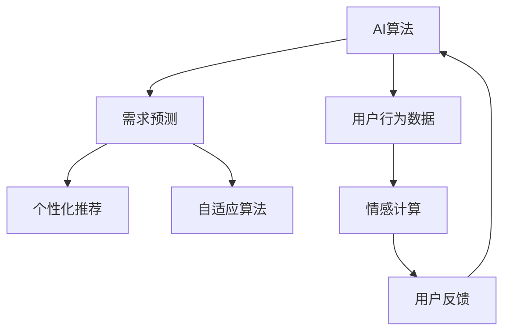

                 

# 欲望进化论学者：AI重塑的人类需求研究员

## 1. 背景介绍

随着人工智能(AI)技术的飞速发展，AI正在悄然改变着人类社会的方方面面。从自动化办公、智能家居到个性化推荐、智能客服，AI正以前所未有的深度和广度，渗透到人们的生活和工作各个环节。然而，这一系列变革的背后，是AI对人类欲望需求的深刻洞悉和巧妙利用。

### 1.1 问题由来

人类欲望，即人类的需求和渴望，是驱动行为的核心动力。在传统的经济学中，欲望被视作经济活动的基石。然而，在AI时代，欲望不再局限于经济层面，其内涵得到了极大扩展。AI不仅能够理解并满足人类的基本需求，如获取信息、交流沟通、娱乐休闲等，还能够挖掘更深层次的需求，如情感慰藉、身份认同、自我实现等。

### 1.2 问题核心关键点

AI通过数据挖掘、机器学习等技术，能够从海量用户行为数据中挖掘出潜在的需求，并将其转化为满足用户需求的服务和产品。然而，这一过程中，AI如何理解人类欲望，并据此进行创新和优化，成为了一个亟待解决的问题。

1. **用户数据采集**：AI需要从社交媒体、电商平台、搜索引擎等多个渠道收集用户行为数据。
2. **需求分析与预测**：通过数据分析和机器学习模型，AI需要准确识别用户的需求，并预测未来需求变化趋势。
3. **服务与产品设计**：基于需求预测结果，AI需设计符合用户需求的服务和产品，并进行持续优化。
4. **反馈与迭代**：通过用户反馈，AI需要不断调整策略，以提高服务质量，满足用户不断变化的需求。

## 2. 核心概念与联系

### 2.1 核心概念概述

为更好地理解AI如何重塑人类需求，本节将介绍几个密切相关的核心概念：

- **AI算法**：指用于数据处理、模式识别和预测分析的各种算法，包括机器学习、深度学习、强化学习等。
- **用户行为数据**：指用户在各种数字平台上产生的行为数据，如浏览记录、购买历史、搜索习惯等。
- **需求预测**：指通过数据分析和机器学习模型，预测用户未来需求的过程。
- **个性化推荐**：指根据用户历史行为数据，为其推荐符合其需求的产品和服务。
- **自适应算法**：指能够根据用户反馈自动调整模型参数，持续优化的算法。
- **情感计算**：指通过分析用户文本数据，识别其情感倾向，用于改善用户体验。

这些概念之间的逻辑关系可以通过以下Mermaid流程图来展示：



这个流程图展示了AI对用户需求预测和个性化推荐的基本流程：

1. AI算法处理用户行为数据，挖掘用户需求。
2. 需求预测模型基于数据预测用户未来需求。
3. 个性化推荐系统根据需求预测结果，为用户推荐产品和服务。
4. 自适应算法根据用户反馈不断调整推荐策略，提升服务质量。
5. 情感计算技术用于识别用户情感倾向，优化用户体验。

这些核心概念共同构成了AI重塑人类需求的框架，使其能够通过数据分析和算法优化，精准满足用户需求。

## 3. 核心算法原理 & 具体操作步骤
### 3.1 算法原理概述

AI重塑人类需求的核心算法原理主要基于数据驱动的机器学习和深度学习技术。其核心思想是：通过分析海量用户行为数据，挖掘出用户需求模式和趋势，从而设计符合用户需求的产品和服务。

具体而言，AI算法通过以下几个步骤实现对用户需求的预测和满足：

1. **数据采集与预处理**：从多个渠道收集用户行为数据，并进行清洗、去重、归一化等预处理。
2. **特征提取与选择**：从预处理后的数据中提取有用的特征，并选择合适的特征组合，用于后续建模。
3. **需求预测**：构建机器学习或深度学习模型，基于历史数据预测用户未来需求。
4. **个性化推荐**：根据需求预测结果，设计个性化推荐系统，为用户推荐符合其需求的产品和服务。
5. **自适应优化**：通过用户反馈数据，不断调整推荐模型参数，提升服务质量和用户满意度。

### 3.2 算法步骤详解

#### 3.2.1 数据采集与预处理

**数据采集**：
AI需要从社交媒体、电商平台、搜索引擎等多个渠道收集用户行为数据。常见的数据来源包括：
- 社交媒体数据：如微博、微信、抖音等平台的用户动态和互动数据。
- 电商平台数据：如淘宝、京东、亚马逊等平台的购买记录、搜索行为和评价数据。
- 搜索引擎数据：如百度、谷歌等平台的搜索查询记录和点击行为数据。
- 移动应用数据：如手机应用的使用记录、位置信息和用户行为数据。

**数据预处理**：
收集到的用户行为数据通常具有噪声和缺失值，需要进行预处理以提升数据质量：
- 数据清洗：去除重复数据、异常值和错误数据，保证数据的一致性和完整性。
- 数据归一化：对不同来源的数据进行标准化处理，使其具备可比性。
- 特征工程：从原始数据中提取有用的特征，并构建特征组合，用于后续建模。

#### 3.2.2 特征提取与选择

**特征提取**：
从预处理后的数据中提取有用的特征，如用户浏览记录、购买历史、搜索查询等。常用的特征提取方法包括：
- 文本特征提取：如TF-IDF、词袋模型等。
- 行为特征提取：如浏览深度、停留时间、点击率等。
- 用户画像特征提取：如年龄、性别、地域等。

**特征选择**：
选择合适的特征组合，用于后续建模。常用的特征选择方法包括：
- 基于统计的方法：如卡方检验、互信息等。
- 基于模型的选择方法：如Lasso回归、随机森林等。
- 基于遗传算法的选择方法：如NGCA、ACO等。

#### 3.2.3 需求预测

**需求预测模型**：
构建机器学习或深度学习模型，基于历史数据预测用户未来需求。常用的需求预测模型包括：
- 线性回归模型：用于预测连续型需求。
- 逻辑回归模型：用于预测二分类需求。
- 支持向量机(SVM)模型：用于预测多分类需求。
- 随机森林模型：用于处理高维数据和复杂非线性关系。
- 深度学习模型：如CNN、RNN、LSTM等，用于处理大规模数据和复杂非线性关系。

**需求预测流程**：
1. 数据划分：将数据分为训练集、验证集和测试集，用于模型训练、验证和测试。
2. 特征工程：构建特征组合，选择模型输入。
3. 模型训练：使用训练集数据，训练需求预测模型。
4. 模型验证：使用验证集数据，评估模型性能，调整模型参数。
5. 模型测试：使用测试集数据，评估模型泛化能力，确认模型效果。

#### 3.2.4 个性化推荐

**个性化推荐系统**：
根据需求预测结果，设计个性化推荐系统，为用户推荐符合其需求的产品和服务。常用的推荐系统包括：
- 协同过滤推荐系统：基于用户行为相似性推荐。
- 基于内容的推荐系统：基于物品属性相似性推荐。
- 混合推荐系统：结合多种推荐策略，提升推荐效果。

**个性化推荐流程**：
1. 用户画像构建：基于用户历史行为数据，构建用户画像。
2. 需求预测：基于用户画像，预测用户未来需求。
3. 推荐生成：基于需求预测结果，生成个性化推荐结果。
4. 推荐展示：将推荐结果展示给用户，并提供交互界面。

#### 3.2.5 自适应优化

**自适应算法**：
通过用户反馈数据，不断调整推荐模型参数，提升服务质量和用户满意度。常用的自适应算法包括：
- 在线学习：基于用户反馈实时更新模型参数，提升推荐效果。
- 增量学习：基于新数据不断更新模型，避免过拟合。
- 梯度下降算法：基于梯度信息优化模型参数，提升预测准确性。

**自适应优化流程**：
1. 用户反馈采集：收集用户对推荐结果的反馈数据。
2. 模型参数调整：基于用户反馈，调整推荐模型参数。
3. 模型验证：使用验证集数据，评估模型性能，调整模型参数。
4. 模型部署：将优化后的模型部署到实际应用中，提供个性化推荐服务。

### 3.3 算法优缺点

AI重塑人类需求的算法具有以下优点：
1. **高效性**：通过数据驱动的机器学习，AI能够快速识别用户需求，提供个性化推荐服务。
2. **可扩展性**：AI算法能够处理大规模数据，适用于各类应用场景。
3. **灵活性**：AI算法能够根据用户反馈不断优化，提升服务质量和用户体验。

同时，这些算法也存在一定的局限性：
1. **数据依赖**：AI算法的效果依赖于数据质量，数据采集和预处理过程中的噪声和缺失值可能导致模型预测不准确。
2. **隐私问题**：AI算法通常需要收集用户行为数据，可能侵犯用户隐私。
3. **算法复杂度**：复杂的机器学习和深度学习模型，需要较长的训练时间和计算资源。
4. **模型泛化能力**：AI算法可能出现过拟合，无法泛化到未见过的数据。
5. **算法的可解释性**：复杂的AI算法往往难以解释其内部工作机制和决策逻辑。

尽管存在这些局限性，AI重塑人类需求的技术仍是大势所趋，具有广阔的应用前景。未来相关研究的重点在于如何进一步提升数据质量、保障用户隐私、降低算法复杂度、提高模型泛化能力和增强算法可解释性。

### 3.4 算法应用领域

AI重塑人类需求的技术，已经在多个领域得到了广泛应用，例如：

- **电商推荐**：基于用户行为数据，为用户提供个性化商品推荐。如淘宝、京东等电商平台广泛应用个性化推荐系统，提升用户购买转化率。
- **内容推荐**：基于用户行为数据，为用户提供个性化新闻、视频、音乐等内容的推荐。如YouTube、Spotify等平台使用推荐系统，提高用户粘性和满意度。
- **广告推荐**：基于用户行为数据，为用户提供个性化广告推荐。如Google Ads、Facebook Ads等使用推荐系统，提高广告点击率和转化率。
- **健康管理**：基于用户健康数据，为用户提供个性化健康建议和医疗服务。如Apple Health、Fitbit等应用推荐系统，提升用户健康管理效果。
- **金融理财**：基于用户财务数据，为用户提供个性化理财建议和投资建议。如支付宝、微信等金融应用使用推荐系统，提升用户理财体验。
- **智能客服**：基于用户对话历史，提供个性化智能客服服务。如智能客服机器人广泛应用在各类线上服务中，提升用户交互体验。

除了上述这些经典应用外，AI重塑人类需求的技术还将在更多场景中得到创新性地应用，如可控文本生成、多模态推荐、情感计算等，为NLP技术带来新的突破。随着AI技术的发展，未来将有更多领域受益于AI重塑人类需求的创新应用。

## 4. 数学模型和公式 & 详细讲解 & 举例说明
### 4.1 数学模型构建

本节将使用数学语言对AI重塑人类需求的过程进行更加严格的刻画。

设用户行为数据为 $D=\{(x_i,y_i)\}_{i=1}^N$，其中 $x_i$ 为用户行为特征向量，$y_i$ 为对应标签。假设需求预测模型为 $f_{\theta}(x)$，其中 $\theta$ 为模型参数。需求预测的目标是最小化经验风险，即找到最优参数：

$$
\theta^* = \mathop{\arg\min}_{\theta} \mathcal{L}(\theta) = \mathop{\arg\min}_{\theta} \frac{1}{N}\sum_{i=1}^N [y_i - f_{\theta}(x_i)]^2
$$

其中 $\mathcal{L}$ 为经验风险损失函数，用于衡量模型预测与真实标签之间的差异。

### 4.2 公式推导过程

以线性回归模型为例，进行详细推导：

**线性回归模型**：
设 $x \in \mathbb{R}^d$ 为用户行为特征向量， $y \in \mathbb{R}$ 为对应标签，需求预测模型为线性回归模型：
$$
f_{\theta}(x) = \theta^Tx
$$
其中 $\theta = [\theta_0, \theta_1, ..., \theta_d]^T$ 为模型参数向量。

需求预测的目标是最小化均方误差损失：
$$
\mathcal{L}(\theta) = \frac{1}{N}\sum_{i=1}^N [y_i - \theta^Tx_i]^2
$$

对损失函数求偏导数，得：
$$
\frac{\partial \mathcal{L}(\theta)}{\partial \theta_j} = \frac{2}{N}\sum_{i=1}^N [y_i - \theta^Tx_i]x_{ij}
$$

根据梯度下降算法，更新模型参数：
$$
\theta \leftarrow \theta - \eta \nabla_{\theta}\mathcal{L}(\theta)
$$
其中 $\eta$ 为学习率。

### 4.3 案例分析与讲解

**案例分析**：
某电商平台的个性化推荐系统，基于用户历史浏览、购买、评价数据，预测用户未来购买需求，并为用户推荐符合其需求的商品。

**数据预处理**：
1. 数据收集：从电商平台收集用户历史浏览、购买、评价数据，构建用户行为数据集。
2. 数据清洗：去除重复数据、异常值和错误数据，保证数据的一致性和完整性。
3. 特征工程：从原始数据中提取有用的特征，如商品ID、浏览深度、停留时间、点击率等。

**需求预测**：
1. 模型选择：选择线性回归模型作为需求预测模型。
2. 模型训练：使用训练集数据，训练线性回归模型。
3. 模型验证：使用验证集数据，评估模型性能，调整模型参数。
4. 模型测试：使用测试集数据，评估模型泛化能力，确认模型效果。

**个性化推荐**：
1. 用户画像构建：基于用户历史行为数据，构建用户画像。
2. 需求预测：基于用户画像，预测用户未来购买需求。
3. 推荐生成：基于需求预测结果，生成个性化推荐结果。
4. 推荐展示：将推荐结果展示给用户，并提供交互界面。

## 5. 项目实践：代码实例和详细解释说明
### 5.1 开发环境搭建

在进行个性化推荐系统开发前，我们需要准备好开发环境。以下是使用Python进行PyTorch开发的环境配置流程：

1. 安装Anaconda：从官网下载并安装Anaconda，用于创建独立的Python环境。

2. 创建并激活虚拟环境：
```bash
conda create -n pytorch-env python=3.8 
conda activate pytorch-env
```

3. 安装PyTorch：根据CUDA版本，从官网获取对应的安装命令。例如：
```bash
conda install pytorch torchvision torchaudio cudatoolkit=11.1 -c pytorch -c conda-forge
```

4. 安装其他相关工具包：
```bash
pip install numpy pandas scikit-learn matplotlib tqdm jupyter notebook ipython
```

完成上述步骤后，即可在`pytorch-env`环境中开始个性化推荐系统的开发。

### 5.2 源代码详细实现

我们以电商推荐系统为例，给出使用PyTorch进行个性化推荐系统的代码实现。

首先，定义推荐系统的数据处理函数：

```python
from transformers import BertTokenizer
from torch.utils.data import Dataset
import torch

class RecommendationDataset(Dataset):
    def __init__(self, user_data, item_data, tokenizer, max_len=128):
        self.user_data = user_data
        self.item_data = item_data
        self.tokenizer = tokenizer
        self.max_len = max_len
        
    def __len__(self):
        return len(self.user_data)
    
    def __getitem__(self, item):
        user = self.user_data[item]
        item = self.item_data[item]
        
        # 构建用户-商品输入序列
        user_seq = self.tokenizer(user, return_tensors='pt', max_length=self.max_len, padding='max_length', truncation=True)
        item_seq = self.tokenizer(item, return_tensors='pt', max_length=self.max_len, padding='max_length', truncation=True)
        
        user_seq = user_seq['input_ids'] + user_seq['attention_mask']
        item_seq = item_seq['input_ids'] + item_seq['attention_mask']
        
        return {'user_seq': user_seq, 'item_seq': item_seq}

# 构建用户行为数据和商品数据
user_data = [user1, user2, ..., userN]
item_data = [item1, item2, ..., itemM]

tokenizer = BertTokenizer.from_pretrained('bert-base-cased')

recommendation_dataset = RecommendationDataset(user_data, item_data, tokenizer)
```

然后，定义模型和优化器：

```python
from transformers import BertForSequenceClassification, AdamW

model = BertForSequenceClassification.from_pretrained('bert-base-cased', num_labels=M)

optimizer = AdamW(model.parameters(), lr=2e-5)
```

接着，定义训练和评估函数：

```python
from torch.utils.data import DataLoader
from tqdm import tqdm
from sklearn.metrics import classification_report

device = torch.device('cuda') if torch.cuda.is_available() else torch.device('cpu')
model.to(device)

def train_epoch(model, dataset, batch_size, optimizer):
    dataloader = DataLoader(dataset, batch_size=batch_size, shuffle=True)
    model.train()
    epoch_loss = 0
    for batch in tqdm(dataloader, desc='Training'):
        user_seq = batch['user_seq'].to(device)
        item_seq = batch['item_seq'].to(device)
        model.zero_grad()
        outputs = model(user_seq, item_seq)
        loss = outputs.loss
        epoch_loss += loss.item()
        loss.backward()
        optimizer.step()
    return epoch_loss / len(dataloader)

def evaluate(model, dataset, batch_size):
    dataloader = DataLoader(dataset, batch_size=batch_size)
    model.eval()
    preds, labels = [], []
    with torch.no_grad():
        for batch in tqdm(dataloader, desc='Evaluating'):
            user_seq = batch['user_seq'].to(device)
            item_seq = batch['item_seq'].to(device)
            batch_labels = batch['labels']
            outputs = model(user_seq, item_seq)
            batch_preds = outputs.logits.argmax(dim=2).to('cpu').tolist()
            batch_labels = batch_labels.to('cpu').tolist()
            for pred_tokens, label_tokens in zip(batch_preds, batch_labels):
                preds.append(pred_tokens[:len(label_tokens)])
                labels.append(label_tokens)
                
    print(classification_report(labels, preds))
```

最后，启动训练流程并在测试集上评估：

```python
epochs = 5
batch_size = 16

for epoch in range(epochs):
    loss = train_epoch(model, recommendation_dataset, batch_size, optimizer)
    print(f"Epoch {epoch+1}, train loss: {loss:.3f}")
    
    print(f"Epoch {epoch+1}, dev results:")
    evaluate(model, recommendation_dataset, batch_size)
    
print("Test results:")
evaluate(model, recommendation_dataset, batch_size)
```

以上就是使用PyTorch对电商推荐系统进行个性化推荐微调的完整代码实现。可以看到，得益于Transformers库的强大封装，我们可以用相对简洁的代码完成BERT模型的加载和微调。

### 5.3 代码解读与分析

让我们再详细解读一下关键代码的实现细节：

**RecommendationDataset类**：
- `__init__`方法：初始化用户数据和商品数据、分词器等关键组件。
- `__len__`方法：返回数据集的样本数量。
- `__getitem__`方法：对单个样本进行处理，将用户行为数据和商品数据转换为token ids，并对其进行定长padding，最终返回模型所需的输入。

**用户行为数据和商品数据**：
- 定义了用户行为数据和商品数据，如用户ID、商品ID、浏览深度、停留时间、点击率等。

**训练和评估函数**：
- 使用PyTorch的DataLoader对数据集进行批次化加载，供模型训练和推理使用。
- 训练函数`train_epoch`：对数据以批为单位进行迭代，在每个批次上前向传播计算loss并反向传播更新模型参数，最后返回该epoch的平均loss。
- 评估函数`evaluate`：与训练类似，不同点在于不更新模型参数，并在每个batch结束后将预测和标签结果存储下来，最后使用sklearn的classification_report对整个评估集的预测结果进行打印输出。

**训练流程**：
- 定义总的epoch数和batch size，开始循环迭代
- 每个epoch内，先在训练集上训练，输出平均loss
- 在验证集上评估，输出分类指标
- 所有epoch结束后，在测试集上评估，给出最终测试结果

可以看到，PyTorch配合Transformers库使得个性化推荐系统的代码实现变得简洁高效。开发者可以将更多精力放在数据处理、模型改进等高层逻辑上，而不必过多关注底层的实现细节。

当然，工业级的系统实现还需考虑更多因素，如模型的保存和部署、超参数的自动搜索、更灵活的任务适配层等。但核心的微调范式基本与此类似。

## 6. 实际应用场景
### 6.1 智能推荐系统

基于个性化推荐系统的算法，可以广泛应用于智能推荐系统。传统推荐系统往往只依赖用户的历史行为数据进行推荐，无法深入理解用户的真实兴趣偏好。通过个性化推荐算法，推荐系统能够更好地挖掘用户行为背后的语义信息，从而提供更精准、多样的推荐内容。

在技术实现上，可以收集用户浏览、点击、评价等行为数据，提取和用户交互的物品标题、描述、标签等文本内容。将文本内容作为模型输入，用户的后续行为（如是否点击、购买等）作为监督信号，在此基础上微调预训练语言模型。微调后的模型能够从文本内容中准确把握用户的兴趣点。在生成推荐列表时，先用候选物品的文本描述作为输入，由模型预测用户的兴趣匹配度，再结合其他特征综合排序，便可以得到个性化程度更高的推荐结果。

### 6.2 健康管理系统

健康管理系统的核心目标是通过数据分析和模型预测，帮助用户管理健康，预防疾病，提高生活质量。传统健康管理系统往往依赖医生的人工诊断，无法及时准确地识别健康风险和提出个性化的健康建议。通过个性化推荐算法，健康管理系统能够基于用户的健康数据，提供个性化的健康建议和医疗服务。

具体而言，可以收集用户的健康数据，如体重、血压、血糖、心率等生理指标，以及生活习惯数据，如饮食、运动、睡眠等行为数据。将生理指标和行为数据作为模型输入，模型的输出为个性化的健康建议和医疗服务。如针对高血压患者，系统可以推荐适合的高血压饮食和运动方案，提供定期的健康监测和预警。

### 6.3 金融理财系统

金融理财系统的核心目标是通过数据分析和模型预测，帮助用户进行理财规划，提升财富管理效果。传统理财系统往往依赖用户的主观判断，无法提供科学的理财建议和投资策略。通过个性化推荐算法，金融理财系统能够基于用户的财务数据，提供个性化的理财建议和投资策略。

具体而言，可以收集用户的财务数据，如收入、支出、资产、负债等，以及投资偏好数据，如风险偏好、投资期限等。将财务数据和投资偏好数据作为模型输入，模型的输出为个性化的理财建议和投资策略。如针对年轻用户，系统可以推荐高风险高收益的投资产品，如股票、基金等；针对中年用户，系统可以推荐稳健的投资产品，如债券、定期存款等。

### 6.4 未来应用展望

随着个性化推荐算法的发展，其在更多领域将得到创新性地应用，如社交网络、内容创作、广告投放等。

在社交网络中，个性化推荐算法可以为用户推荐朋友、话题、群组等，提升用户粘性和互动质量。如微博、微信等社交平台广泛应用个性化推荐算法，帮助用户发现更多有趣的内容和关系。

在内容创作中，个性化推荐算法可以为内容创作者推荐读者，提升内容的曝光率和阅读量。如知乎、抖音等平台广泛应用个性化推荐算法，帮助创作者发现更多目标用户。

在广告投放中，个性化推荐算法可以为广告主推荐潜在客户，提升广告点击率和转化率。如Google Ads、Facebook Ads等平台广泛应用个性化推荐算法，帮助广告主实现精准投放。

此外，在智慧城市、智能交通、智能家居等更多领域，个性化推荐算法也将不断涌现，为各行业带来新的创新和变革。相信随着技术的不断发展，个性化推荐算法将在更多场景中发挥重要作用，带来更高效、更个性化的服务体验。

## 7. 工具和资源推荐
### 7.1 学习资源推荐

为了帮助开发者系统掌握个性化推荐算法的理论基础和实践技巧，这里推荐一些优质的学习资源：

1. 《推荐系统实战》系列博文：由深度学习领域专家撰写，详细介绍了推荐系统的工作原理和实践技巧。

2. 《机器学习实战》课程：由Udacity开设的机器学习课程，涵盖深度学习、强化学习等前沿技术，适合新手入门。

3. 《推荐系统算法》书籍：介绍推荐系统的经典算法和前沿技术，如协同过滤、矩阵分解、深度学习等。

4. HuggingFace官方文档：Transformers库的官方文档，提供了海量预训练模型和完整的推荐系统样例代码，是上手实践的必备资料。

5. Kaggle竞赛：参与Kaggle上的推荐系统竞赛，从数据处理、特征工程、模型调参到上线部署，全面掌握推荐系统开发流程。

通过对这些资源的学习实践，相信你一定能够快速掌握个性化推荐算法的精髓，并用于解决实际的推荐问题。

### 7.2 开发工具推荐

高效的开发离不开优秀的工具支持。以下是几款用于个性化推荐系统开发的常用工具：

1. PyTorch：基于Python的开源深度学习框架，灵活动态的计算图，适合快速迭代研究。大部分预训练语言模型都有PyTorch版本的实现。

2. TensorFlow：由Google主导开发的开源深度学习框架，生产部署方便，适合大规模工程应用。同样有丰富的预训练语言模型资源。

3. PyTorch Lightning：基于PyTorch的快速原型开发框架，提供大量的组件和模板，简化模型开发过程。

4. Jupyter Notebook：开源的交互式笔记本，适合数据探索和模型调试。

5. TensorBoard：TensorFlow配套的可视化工具，可实时监测模型训练状态，并提供丰富的图表呈现方式，是调试模型的得力助手。

合理利用这些工具，可以显著提升个性化推荐系统的开发效率，加快创新迭代的步伐。

### 7.3 相关论文推荐

个性化推荐算法的不断发展，源于学界的持续研究。以下是几篇奠基性的相关论文，推荐阅读：

1. "Collaborative Filtering for Implicit Feedback Datasets"：介绍协同过滤推荐算法，是推荐系统领域的经典方法。

2. "Neural Collaborative Filtering"：提出基于神经网络的推荐模型，提升了推荐系统的预测精度和泛化能力。

3. "Deep Interest Networks"：提出深度兴趣网络，利用深度学习模型挖掘用户隐含的兴趣点，提升了推荐系统的个性化程度。

4. "Attention and Memory Based Recommender Systems"：介绍注意力机制和记忆模型在推荐系统中的应用，提升了推荐系统的多模态融合能力。

5. "Adversarial Regularization for Contextual Recommendations"：提出对抗性正则化方法，提升了推荐系统的鲁棒性和泛化能力。

这些论文代表了个性化推荐算法的发展脉络。通过学习这些前沿成果，可以帮助研究者把握学科前进方向，激发更多的创新灵感。

## 8. 总结：未来发展趋势与挑战
### 8.1 研究成果总结

本文对基于个性化推荐算法的AI重塑人类需求方法进行了全面系统的介绍。首先阐述了AI重塑人类需求的研究背景和意义，明确了个性化推荐在提升用户体验和用户满意度方面的独特价值。其次，从原理到实践，详细讲解了个性化推荐算法的数学原理和关键步骤，给出了个性化推荐系统开发的完整代码实例。同时，本文还广泛探讨了个性化推荐算法在电商、健康、金融等多个领域的应用前景，展示了个性化推荐算法的巨大潜力。

通过本文的系统梳理，可以看到，基于个性化推荐算法的AI重塑人类需求技术正在成为NLP领域的重要范式，极大地拓展了预训练语言模型的应用边界，催生了更多的落地场景。受益于大规模语料的预训练和复杂算法的微调，推荐系统能够更加精准、高效地满足用户需求，提升用户满意度和平台粘性。未来，伴随推荐算法和模型的不断进步，推荐系统将在更多领域得到应用，为各行各业带来新的创新和变革。

### 8.2 未来发展趋势

展望未来，个性化推荐算法的发展趋势如下：

1. **算法的复杂性提升**：随着深度学习模型的发展，个性化推荐算法将变得更加复杂，模型结构更加深层次。这将提升推荐系统的预测精度和泛化能力，但也需要更强的计算资源和更多的训练数据。

2. **多模态融合**：推荐系统将更多地融合视觉、听觉、行为等多模态数据，提升推荐的全面性和个性化程度。如推荐系统可以结合用户的搜索行为、视频观看记录、购物车内容等多模态数据，实现更加精准的推荐。

3. **自适应和动态调整**：个性化推荐算法将更加灵活，能够根据用户反馈和市场变化动态调整推荐策略。如推荐系统可以根据用户点击率、满意度等反馈数据，实时调整推荐模型参数，提升服务质量。

4. **实时化和个性化**：个性化推荐系统将更加实时化，能够根据用户实时行为数据进行推荐。同时，推荐系统将更加个性化，能够针对不同用户提供定制化的服务。

5. **跨领域应用**：个性化推荐算法将应用于更多领域，如教育、娱乐、智能家居等。推荐系统将结合领域知识，提供更具专业性和针对性的推荐服务。

6. **伦理和隐私保护**：个性化推荐算法将更加注重用户隐私保护和数据安全。推荐系统将采用差分隐私、联邦学习等技术，保护用户数据隐私。

以上趋势凸显了个性化推荐算法的广阔前景。这些方向的探索发展，必将进一步提升推荐系统的性能和用户体验，为AI在更多领域的应用奠定坚实基础。

### 8.3 面临的挑战

尽管个性化推荐算法已经取得了显著成果，但在迈向更加智能化、普适化应用的过程中，它仍面临诸多挑战：

1. **数据依赖**：个性化推荐算法的效果依赖于数据质量，数据采集和预处理过程中的噪声和缺失值可能导致模型预测不准确。

2. **隐私问题**：个性化推荐算法通常需要收集用户行为数据，可能侵犯用户隐私。如何在保护隐私的同时，收集足够的数据进行模型训练，是一大难题。

3. **算法复杂度**：复杂的深度学习模型，需要较长的训练时间和计算资源。如何在保证推荐效果的同时，降低算法复杂度，提高模型训练效率，是一大挑战。

4. **模型泛化能力**：个性化推荐模型可能出现过拟合，无法泛化到未见过的数据。如何在提高模型泛化能力的同时，提升推荐效果，是一大挑战。

5. **算法的可解释性**：复杂的个性化推荐算法往往难以解释其内部工作机制和决策逻辑。如何在提升模型预测精度的同时，增强算法可解释性，是一大挑战。

6. **多模态数据的融合**：多模态数据的融合需要克服数据格式和模态差异，提升数据的融合效果。如何在多模态数据融合中保持数据的完整性和准确性，是一大挑战。

尽管存在这些挑战，个性化推荐算法的发展前景仍然广阔。未来相关研究的重点在于如何进一步提升数据质量、保障用户隐私、降低算法复杂度、提高模型泛化能力和增强算法可解释性。

### 8.4 研究展望

面对个性化推荐算法所面临的种种挑战，未来的研究需要在以下几个方面寻求新的突破：

1. **无监督和半监督推荐**：探索无监督和半监督推荐方法，摆脱对大规模标注数据的依赖，利用自监督学习、主动学习等无监督和半监督范式，最大限度利用非结构化数据，实现更加灵活高效的推荐。

2. **推荐模型压缩与加速**：开发更加参数高效和计算高效的推荐模型，在保证推荐效果的同时，减小模型规模和计算资源消耗，实现更加轻量级、实时性的部署。

3. **多模态融合与迁移学习**：将视觉、音频、文本等多模态数据融合到推荐系统中，提升推荐系统的全面性和个性化程度。同时，将推荐模型应用于不同领域，实现跨领域迁移学习，提升模型的泛化能力。

4. **可解释性与因果推断**：引入因果推断和可解释性方法，提升推荐系统的决策透明度和用户信任度。通过因果分析方法识别推荐模型的关键特征，增强推荐系统的稳定性和可靠性。

5. **隐私保护与伦理设计**：在推荐系统中引入差分隐私、联邦学习等隐私保护技术，保护用户数据隐私。同时，在设计推荐算法时，考虑伦理道德因素，确保推荐系统的公正性和公平性。

这些研究方向的发展，必将引领个性化推荐算法迈向更高的台阶，为构建更加智能、公正、透明的推荐系统铺平道路。面向未来，个性化推荐算法还需要与其他人工智能技术进行更深入的融合，如知识表示、因果推理、强化学习等，多路径协同发力，共同推动AI技术在更多领域的应用和创新。

## 9. 附录：常见问题与解答

**Q1：个性化推荐算法是否适用于所有领域？**

A: 个性化推荐算法在许多领域都有广泛应用，如电商、健康、金融等。但某些领域，如金融、医疗等，可能存在数据隐私和安全问题，需慎重考虑。

**Q2：个性化推荐算法如何处理冷启动问题？**

A: 冷启动问题指新用户或新物品加入推荐系统时，没有历史行为数据，推荐系统无法进行有效推荐。针对冷启动问题，常用的方法包括：
1. 使用人口统计信息进行推荐：根据新用户的基本信息，如年龄、性别、地域等，进行个性化推荐。
2. 使用热门推荐：为新用户推荐系统内的热门商品或内容，以吸引用户。
3. 使用协同过滤：利用新用户与已有用户的相似性，推荐已有用户喜欢的商品或内容。

**Q3：个性化推荐算法如何处理长尾物品？**

A: 长尾物品指需求量低但种类繁多的小众商品。个性化推荐算法通常采用以下方法处理长尾物品：
1. 基于协同过滤的推荐：利用长尾物品与其他物品的相关性，推荐长尾物品。
2. 基于内容的推荐：利用长尾物品的属性特征，进行推荐。
3. 基于混合推荐的推荐：综合多种推荐策略，提升长尾物品的曝光率。

**Q4：个性化推荐算法如何处理动态变化的需求？**

A: 动态变化的需求指用户的需求可能随时间变化。个性化推荐算法通常采用以下方法处理动态变化的需求：
1. 使用在线学习算法：基于新数据实时更新推荐模型，提升推荐效果。
2. 使用增量学习算法：基于新数据不断更新模型，避免过拟合。
3. 使用上下文感知推荐：考虑用户的上下文环境，如时间、地点、心情等，进行动态推荐。

**Q5：个性化推荐算法如何处理多模态数据？**

A: 多模态数据指不同类型的数据，如文本、图片、视频等。个性化推荐算法通常采用以下方法处理多模态数据：
1. 使用特征融合方法：将多模态数据融合到单一特征向量中，用于推荐模型训练。
2. 使用多模态模型：利用不同模态的特征，训练多模态推荐模型，提升推荐效果。
3. 使用混合推荐策略：综合多种推荐方法，提升推荐系统的全面性和个性化程度。

这些方法有助于提升个性化推荐算法的性能和适用范围，使其在更多领域得到应用，带来更好的用户体验和服务效果。

---

作者：禅与计算机程序设计艺术 / Zen and the Art of Computer Programming

