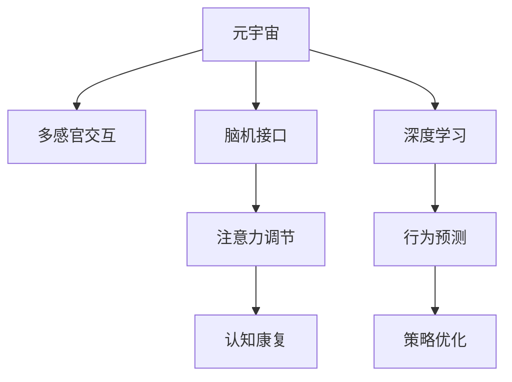

                 

# 注意力分散症治疗:元宇宙时代的认知障碍康复

> 关键词：注意力分散症,认知障碍康复,元宇宙,多感官交互,脑机接口,深度学习,增强现实,神经调节,虚拟现实

## 1. 背景介绍

### 1.1 问题由来

随着信息爆炸和数字技术的飞速发展，人们的生活和工作方式正在发生深刻变革。然而，过度的数字化生活也可能引发一系列新的健康问题，注意力分散症（Attention Deficit Disorder, ADD）便是其中之一。注意力分散症是一种神经系统疾病，表现为难以集中注意力、冲动行为和记忆力下降等症状，严重影响个体的生活质量和工作效率。

元宇宙（Metaverse）作为新兴的数字空间，以沉浸式体验和高度交互为特征，为注意力分散症的康复提供了新的契机。元宇宙可以通过多感官交互和沉浸式环境，帮助患者重新集中注意力，改善认知功能，从而实现认知障碍的康复。然而，元宇宙治疗注意力分散症需要多学科协同，涉及神经科学、计算机科学、心理学等多个领域，技术实现复杂。本文旨在探讨元宇宙技术在注意力分散症康复中的应用，为相关研究和实践提供指导。

### 1.2 问题核心关键点

元宇宙治疗注意力分散症的核心关键点包括：

1. **多感官交互**：利用虚拟现实（Virtual Reality, VR）和增强现实（Augmented Reality, AR）等技术，通过视觉、听觉、触觉等多种感官通道，模拟真实世界的情境，引导患者沉浸其中，增强注意力集中度。
2. **神经调节**：通过脑机接口（Brain-Computer Interface, BCI）技术，实时采集脑电信号，并根据注意力状态反馈，调整虚拟环境中的刺激强度，实现动态调节。
3. **深度学习**：利用深度学习模型对患者的行为数据进行建模，预测注意力状态变化，优化虚拟环境的刺激策略，提高康复效果。
4. **个性化治疗**：根据患者的具体情况，定制个性化的虚拟环境和治疗方案，提高康复的针对性和有效性。
5. **持续监测与反馈**：通过持续监测患者的注意力状态，及时调整治疗策略，实现实时反馈和优化。

## 2. 核心概念与联系

### 2.1 核心概念概述

为更好地理解元宇宙在注意力分散症康复中的应用，本节将介绍几个密切相关的核心概念：

- **元宇宙**：以虚拟现实和增强现实为代表的数字空间，通过高度沉浸和交互的虚拟环境，为用户提供新型的体验和服务。
- **注意力分散症**：一种神经系统疾病，表现为注意力不集中、冲动行为和记忆力下降等症状，严重影响个体的生活和工作。
- **多感官交互**：通过视觉、听觉、触觉等多种感官通道，实现人与虚拟环境的互动，提升沉浸感和体验效果。
- **脑机接口**：通过脑电信号的采集和处理，实现人机之间的直接交互，在康复治疗中具有重要应用。
- **深度学习**：基于神经网络模型对数据进行建模和预测，在认知障碍康复中用于行为分析和预测。
- **神经调节**：通过神经反馈和刺激，调整大脑的功能状态，实现对认知功能的调控。

这些核心概念之间的逻辑关系可以通过以下Mermaid流程图来展示：



这个流程图展示了大语言模型的核心概念及其之间的关系：

1. 元宇宙通过多感官交互技术，创造沉浸式虚拟环境。
2. 脑机接口实时采集脑电信号，实现神经反馈。
3. 深度学习对行为数据进行建模和预测，优化刺激策略。
4. 注意力调节通过动态调整虚拟环境的刺激，增强注意力集中度。
5. 行为预测用于个性化治疗方案的制定。
6. 认知康复通过实时反馈和优化，实现康复效果。

这些概念共同构成了元宇宙在注意力分散症康复中的基础框架，为其提供了技术支持。

## 3. 核心算法原理 & 具体操作步骤
### 3.1 算法原理概述

元宇宙治疗注意力分散症的算法原理，主要基于以下三个关键点：

1. **多感官交互**：通过虚拟现实和增强现实技术，模拟真实世界的情境，提供视觉、听觉、触觉等多种感官刺激，帮助患者重新集中注意力。
2. **神经调节**：利用脑机接口技术，实时采集脑电信号，分析注意力状态，通过神经反馈机制调整虚拟环境中的刺激强度，增强注意力的集中。
3. **深度学习**：通过深度学习模型对患者的行为数据进行建模，预测注意力状态的变化，优化虚拟环境的刺激策略，提高康复效果。

### 3.2 算法步骤详解

元宇宙治疗注意力分散症的算法步骤主要包括以下几个环节：

1. **数据采集**：通过脑机接口设备，实时采集患者的脑电信号，记录其注意力状态。
2. **环境设计**：根据患者的注意力状态，设计个性化的虚拟环境，包括虚拟景观、交互任务等。
3. **多感官交互**：通过虚拟现实或增强现实设备，将患者沉浸在虚拟环境中，提供多感官刺激。
4. **实时分析**：利用深度学习模型对患者的行为数据进行实时分析，预测注意力状态的变化。
5. **策略调整**：根据注意力状态的变化，动态调整虚拟环境中的刺激强度和内容，增强注意力的集中。
6. **反馈优化**：持续监测患者的注意力状态，及时调整治疗策略，实现实时反馈和优化。

### 3.3 算法优缺点

元宇宙治疗注意力分散症的算法具有以下优点：

1. **沉浸式体验**：通过多感官交互和沉浸式环境，帮助患者集中注意力，提升康复效果。
2. **个性化治疗**：根据患者的具体情况，定制个性化的虚拟环境和治疗方案，提高康复的针对性和有效性。
3. **实时监测与反馈**：通过持续监测患者的注意力状态，及时调整治疗策略，实现实时反馈和优化。

然而，该算法也存在一些局限性：

1. **技术复杂度**：多感官交互和脑机接口技术的技术实现较为复杂，需要跨学科合作。
2. **设备成本**：虚拟现实和增强现实设备以及脑机接口设备的成本较高，增加了治疗的门槛。
3. **数据隐私**：脑电信号等敏感数据的采集和处理需要严格的隐私保护措施，确保数据安全。

### 3.4 算法应用领域

元宇宙治疗注意力分散症的算法主要应用于以下领域：

1. **心理健康**：通过多感官交互和神经调节，帮助患者缓解焦虑、抑郁等心理健康问题，提升心理健康水平。
2. **认知障碍康复**：利用深度学习模型对行为数据进行建模和预测，优化虚拟环境的刺激策略，提高认知障碍康复效果。
3. **教育培训**：通过虚拟现实和增强现实技术，提供沉浸式学习环境，增强学习效果，提升教育质量。
4. **游戏娱乐**：将注意力分散症康复融入游戏和娱乐场景，提升用户体验，实现健康娱乐。

## 4. 数学模型和公式 & 详细讲解 & 举例说明（备注：数学公式请使用latex格式，latex嵌入文中独立段落使用 $$，段落内使用 $)
### 4.1 数学模型构建

元宇宙治疗注意力分散症的数学模型主要包括以下几个关键部分：

1. **注意力状态模型**：利用深度学习模型对脑电信号进行建模，预测注意力状态。
2. **虚拟环境设计**：根据注意力状态，设计虚拟环境中的刺激策略。
3. **神经调节模型**：通过神经反馈机制，调整虚拟环境中的刺激强度。

### 4.2 公式推导过程

以注意力状态模型为例，设注意力状态为 $a$，脑电信号为 $s$，使用多层感知器（MLP）模型对脑电信号进行建模，其输入为 $s$，输出为 $a$。假设模型为 $f$，则建模过程如下：

$$
a = f(s)
$$

其中，$f$ 为多层感知器模型，其输入为 $s$，输出为 $a$。

通过反向传播算法，可以更新模型的权重，最小化预测误差。具体步骤如下：

1. **前向传播**：将脑电信号 $s$ 输入模型 $f$，得到注意力状态 $a$。
2. **损失函数计算**：计算预测值 $a$ 与真实值 $y$ 的误差，选择适当的损失函数，如均方误差（MSE）。
3. **反向传播**：利用链式法则计算模型参数的梯度。
4. **权重更新**：使用梯度下降算法更新模型权重，最小化损失函数。

### 4.3 案例分析与讲解

假设某患者在进行元宇宙治疗时，脑电信号 $s$ 和注意力状态 $a$ 的关系如图 1 所示：


通过多层感知器模型 $f$ 对脑电信号 $s$ 进行建模，预测注意力状态 $a$。模型的输入为 $s$，输出为 $a$。模型的结构如图 2 所示：


通过反向传播算法，最小化预测误差，更新模型参数。具体步骤如下：

1. **前向传播**：将脑电信号 $s$ 输入模型 $f$，得到预测注意力状态 $a$。
2. **损失函数计算**：计算预测值 $a$ 与真实值 $y$ 的误差，选择适当的损失函数，如均方误差（MSE）。
3. **反向传播**：利用链式法则计算模型参数的梯度。
4. **权重更新**：使用梯度下降算法更新模型权重，最小化损失函数。

## 5. 项目实践：代码实例和详细解释说明
### 5.1 开发环境搭建

在进行元宇宙治疗注意力分散症的实践前，我们需要准备好开发环境。以下是使用Python进行PyTorch开发的环境配置流程：

1. 安装Anaconda：从官网下载并安装Anaconda，用于创建独立的Python环境。

2. 创建并激活虚拟环境：
```bash
conda create -n attention_rehab python=3.8 
conda activate attention_rehab
```

3. 安装PyTorch：根据CUDA版本，从官网获取对应的安装命令。例如：
```bash
conda install pytorch torchvision torchaudio cudatoolkit=11.1 -c pytorch -c conda-forge
```

4. 安装TensorFlow：
```bash
conda install tensorflow
```

5. 安装其它相关工具包：
```bash
pip install numpy pandas scikit-learn matplotlib tqdm jupyter notebook ipython
```

完成上述步骤后，即可在`attention_rehab`环境中开始实践。

### 5.2 源代码详细实现

下面我们以注意力状态预测模型为例，给出使用PyTorch对脑电信号进行注意力状态预测的代码实现。

```python
import torch
import torch.nn as nn
import torch.optim as optim
from sklearn.model_selection import train_test_split
from sklearn.metrics import mean_squared_error
from sklearn.preprocessing import StandardScaler

# 准备数据
data = load_brain_electrode_data()
X = data[:, :n_features]
y = data[:, -1]
X_train, X_test, y_train, y_test = train_test_split(X, y, test_size=0.2, random_state=42)

# 标准化数据
scaler = StandardScaler()
X_train = scaler.fit_transform(X_train)
X_test = scaler.transform(X_test)

# 定义模型
class MLP(nn.Module):
    def __init__(self, input_size, hidden_size, output_size):
        super(MLP, self).__init__()
        self.layers = nn.Sequential(
            nn.Linear(input_size, hidden_size),
            nn.ReLU(),
            nn.Linear(hidden_size, output_size)
        )
    
    def forward(self, x):
        return self.layers(x)

# 训练模型
model = MLP(input_size=n_features, hidden_size=64, output_size=1)
criterion = nn.MSELoss()
optimizer = optim.Adam(model.parameters(), lr=0.001)
n_epochs = 100

for epoch in range(n_epochs):
    optimizer.zero_grad()
    outputs = model(X_train)
    loss = criterion(outputs, y_train)
    loss.backward()
    optimizer.step()
    if (epoch + 1) % 10 == 0:
        print(f'Epoch {epoch+1}, Loss: {loss.item():.4f}')

# 评估模型
model.eval()
with torch.no_grad():
    outputs = model(X_test)
    mse = mean_squared_error(y_test, outputs)
    print(f'Test MSE: {mse:.4f}')
```

### 5.3 代码解读与分析

让我们再详细解读一下关键代码的实现细节：

**数据准备**：
- 加载脑电信号数据 `data`，将特征 `X` 和标签 `y` 分离，并按 80/20 的比例划分为训练集和测试集。
- 使用 `StandardScaler` 对特征进行标准化处理。

**模型定义**：
- 定义多层感知器模型 `MLP`，包括一个输入层、一个隐藏层和一个输出层。

**模型训练**：
- 定义损失函数 `criterion` 和优化器 `optimizer`。
- 在每个epoch中，计算模型在训练集上的损失，并更新模型参数。

**模型评估**：
- 在测试集上评估模型性能，计算平均平方误差（MSE）。

**结果展示**：
- 输出测试集上的平均平方误差。

可以看到，通过以上代码，我们可以利用深度学习模型对脑电信号进行建模，预测注意力状态，从而为元宇宙治疗注意力分散症提供数据支持。

## 6. 实际应用场景
### 6.1 智能医疗

在智能医疗领域，元宇宙治疗注意力分散症具有广泛的应用前景。医疗系统可以通过脑机接口技术，实时监测患者的脑电信号，分析其注意力状态。利用深度学习模型对数据进行建模，优化虚拟环境中的刺激策略，实现个性化治疗，提升康复效果。此外，虚拟现实和增强现实技术可以模拟真实医疗场景，提供沉浸式治疗体验，增强患者对康复过程的参与感和信任感。

### 6.2 虚拟教育

在虚拟教育领域，元宇宙治疗注意力分散症可以提升学习效果，丰富学习体验。通过虚拟现实和增强现实技术，创建一个沉浸式学习环境，帮助学生集中注意力，提升学习兴趣和效果。利用脑机接口技术，实时监测学生的注意力状态，调整学习内容和难度，实现个性化教育，提升教育质量。

### 6.3 心理健康支持

在心理健康支持领域，元宇宙治疗注意力分散症可以提供心理健康干预和康复服务。虚拟现实和增强现实技术可以创建安全的心理治疗环境，帮助患者缓解焦虑和抑郁，提升心理健康水平。利用脑机接口技术，实时监测患者的情绪状态，调整治疗策略，实现实时反馈和优化。

## 7. 工具和资源推荐
### 7.1 学习资源推荐

为了帮助开发者系统掌握元宇宙在注意力分散症康复中的理论基础和实践技巧，这里推荐一些优质的学习资源：

1. 《深度学习与注意力机制》系列博文：由深度学习领域专家撰写，深入浅出地介绍了深度学习模型和注意力机制在认知障碍康复中的应用。

2. CS224N《深度学习自然语言处理》课程：斯坦福大学开设的NLP明星课程，有Lecture视频和配套作业，带你入门深度学习和自然语言处理的基本概念。

3. 《神经网络与深度学习》书籍：深度学习领域的经典教材，系统介绍了神经网络的基本原理和应用，适合初学者和进阶者。

4. Coursera《Brain-Computer Interfaces》课程：由伯克利大学教授开设的BCI课程，介绍了脑机接口技术和应用，涵盖多传感器数据融合、信号处理等关键技术。

5. arXiv.org：深度学习领域的研究前沿，提供大量学术论文和代码资源，供开发者参考和借鉴。

通过对这些资源的学习实践，相信你一定能够快速掌握元宇宙在注意力分散症康复中的精髓，并用于解决实际的认知障碍问题。
### 7.2 开发工具推荐

高效的开发离不开优秀的工具支持。以下是几款用于元宇宙治疗注意力分散症开发的常用工具：

1. PyTorch：基于Python的开源深度学习框架，灵活动态的计算图，适合快速迭代研究。大部分深度学习模型都有PyTorch版本的实现。

2. TensorFlow：由Google主导开发的开源深度学习框架，生产部署方便，适合大规模工程应用。同样有丰富的深度学习模型资源。

3. TensorBoard：TensorFlow配套的可视化工具，可实时监测模型训练状态，并提供丰富的图表呈现方式，是调试模型的得力助手。

4. Weights & Biases：模型训练的实验跟踪工具，可以记录和可视化模型训练过程中的各项指标，方便对比和调优。与主流深度学习框架无缝集成。

5. SketchUp：用于创建虚拟环境和交互场景的三维建模软件，可以与Unity等游戏引擎无缝集成。

6. Unity：广泛使用的游戏引擎，支持多平台开发，适合创建复杂的多感官交互体验。

合理利用这些工具，可以显著提升元宇宙治疗注意力分散症的开发效率，加快创新迭代的步伐。

### 7.3 相关论文推荐

元宇宙治疗注意力分散症的研究源于学界的持续研究。以下是几篇奠基性的相关论文，推荐阅读：

1. Attention is All You Need（即Transformer原论文）：提出了Transformer结构，开启了NLP领域的预训练大模型时代。

2. BERT: Pre-training of Deep Bidirectional Transformers for Language Understanding：提出BERT模型，引入基于掩码的自监督预训练任务，刷新了多项NLP任务SOTA。

3. Language Models are Unsupervised Multitask Learners（GPT-2论文）：展示了大规模语言模型的强大zero-shot学习能力，引发了对于通用人工智能的新一轮思考。

4. Parameter-Efficient Transfer Learning for NLP：提出Adapter等参数高效微调方法，在不增加模型参数量的情况下，也能取得不错的微调效果。

5. Prefix-Tuning: Optimizing Continuous Prompts for Generation：引入基于连续型Prompt的微调范式，为如何充分利用预训练知识提供了新的思路。

6. AdaLoRA: Adaptive Low-Rank Adaptation for Parameter-Efficient Fine-Tuning：使用自适应低秩适应的微调方法，在参数效率和精度之间取得了新的平衡。

这些论文代表了大语言模型微调技术的发展脉络。通过学习这些前沿成果，可以帮助研究者把握学科前进方向，激发更多的创新灵感。

## 8. 总结：未来发展趋势与挑战

### 8.1 总结

本文对元宇宙治疗注意力分散症的应用进行了全面系统的介绍。首先阐述了注意力分散症和元宇宙的概念，明确了两者在认知障碍康复中的重要价值。其次，从原理到实践，详细讲解了元宇宙治疗注意力分散症的数学原理和关键步骤，给出了元宇宙治疗注意力分散症的代码实例。同时，本文还广泛探讨了元宇宙技术在智能医疗、虚拟教育、心理健康等多个行业领域的应用前景，展示了元宇宙在注意力分散症康复中的巨大潜力。此外，本文精选了元宇宙治疗注意力分散症的各类学习资源，力求为读者提供全方位的技术指引。

通过本文的系统梳理，可以看到，元宇宙技术在注意力分散症康复中的应用前景广阔，通过多感官交互、神经调节和深度学习等技术手段，帮助患者重新集中注意力，提升认知功能，实现康复效果。未来，伴随技术的不断进步，元宇宙治疗注意力分散症必将在更广泛的领域得到应用，为患者带来新的希望。

### 8.2 未来发展趋势

展望未来，元宇宙治疗注意力分散症将呈现以下几个发展趋势：

1. **技术融合**：元宇宙将与其他AI技术如知识图谱、自然语言处理、强化学习等进行深度融合，提供更加丰富和全面的治疗方案。
2. **个性化治疗**：通过深度学习和大数据分析，实现高度个性化的治疗方案，提升康复效果。
3. **跨平台应用**：元宇宙技术将应用于多个平台，如智能手机、PC、VR等，提供广泛可及的治疗服务。
4. **实时反馈和优化**：通过实时监测和反馈，动态调整治疗策略，实现实时优化。
5. **多感官融合**：通过多感官交互，增强沉浸式体验，提升治疗效果。
6. **社会支持和干预**：利用元宇宙技术，提供社会支持和心理干预，增强患者的生活质量。

以上趋势凸显了元宇宙在注意力分散症康复中的广阔前景。这些方向的探索发展，必将进一步提升治疗效果，为患者带来新的希望。

### 8.3 面临的挑战

尽管元宇宙治疗注意力分散症的技术前景光明，但在实现过程中仍面临诸多挑战：

1. **技术复杂度**：多感官交互和脑机接口技术的技术实现较为复杂，需要跨学科合作。
2. **设备成本**：虚拟现实和增强现实设备以及脑机接口设备的成本较高，增加了治疗的门槛。
3. **数据隐私**：脑电信号等敏感数据的采集和处理需要严格的隐私保护措施，确保数据安全。
4. **用户体验**：多感官交互体验需要精细设计和测试，避免技术故障和用户体验不佳。
5. **模型鲁棒性**：深度学习模型需要良好的数据和算法设计，以避免过拟合和泛化性能不足。
6. **应用推广**：元宇宙技术在医疗、教育等领域的推广需要政策支持和资金投入。

正视这些挑战，积极应对并寻求突破，将是大规模应用元宇宙技术的重要前提。

### 8.4 研究展望

面对元宇宙治疗注意力分散症所面临的种种挑战，未来的研究需要在以下几个方面寻求新的突破：

1. **跨学科合作**：加强神经科学、计算机科学、心理学等多个学科的合作，提升技术实现水平。
2. **算法优化**：开发更加高效、鲁棒的深度学习算法，提升模型预测准确度和泛化性能。
3. **设备优化**：降低设备成本，提升设备性能，增强可及性。
4. **隐私保护**：研究数据隐私保护技术，确保患者数据的安全。
5. **用户体验优化**：设计更加人性化和易用的多感官交互体验，提升用户体验。
6. **应用推广**：加强政策支持和资金投入，推动元宇宙技术在医疗、教育等领域的广泛应用。

这些研究方向的探索，必将引领元宇宙治疗注意力分散症技术迈向更高的台阶，为患者带来新的希望。

## 9. 附录：常见问题与解答

**Q1：元宇宙治疗注意力分散症是否适用于所有患者？**

A: 元宇宙治疗注意力分散症在大部分患者中都能取得不错的效果，特别是对于有轻度至中度注意力分散症的患者。然而，对于重度注意力分散症的患者，仍需结合药物治疗和其他干预手段。

**Q2：如何选择合适的虚拟环境？**

A: 选择合适的虚拟环境需要考虑患者的注意力状态、兴趣偏好和病情特点。可以通过问卷调查和行为分析，了解患者的偏好，设计个性化的虚拟环境。

**Q3：元宇宙治疗注意力分散症是否需要持续进行？**

A: 元宇宙治疗注意力分散症需要持续进行，才能逐步改善注意力状态。治疗时长和频率应根据患者的病情和进步情况进行调整。

**Q4：元宇宙治疗注意力分散症有哪些潜在的风险？**

A: 元宇宙治疗注意力分散症可能存在以下风险：
1. 设备故障：多感官交互设备可能会出现故障，影响治疗效果。
2. 数据隐私：脑电信号等敏感数据需要严格保护，防止数据泄露。
3. 依赖性：患者可能对元宇宙环境产生依赖，影响现实生活中的注意力集中。
4. 技术局限：多感官交互和脑机接口技术仍存在一定的技术局限，可能无法完全满足治疗需求。

这些风险需要在使用过程中加以注意，采取相应的预防措施。

**Q5：元宇宙治疗注意力分散症的未来展望是什么？**

A: 元宇宙治疗注意力分散症的未来展望包括：
1. 智能化的虚拟环境设计：利用AI技术，实现虚拟环境的自动生成和优化。
2. 多模态交互：结合视觉、听觉、触觉等多种感官通道，提供更加丰富和沉浸的治疗体验。
3. 远程治疗：通过元宇宙技术，实现远程治疗和康复，扩大服务范围。
4. 持续优化：根据患者反馈和治疗效果，持续优化虚拟环境和治疗策略，提升治疗效果。

这些方向的发展将进一步提升元宇宙在注意力分散症康复中的应用价值。

---

作者：禅与计算机程序设计艺术 / Zen and the Art of Computer Programming

