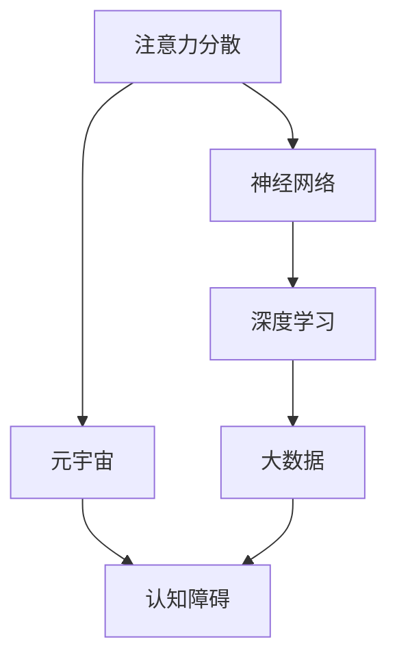

                 

# 注意力分散综合征:元宇宙时代的新型认知障碍

> 关键词：注意力分散,元宇宙,认知障碍,神经网络,深度学习,大数据

## 1. 背景介绍

### 1.1 问题由来

在现代社会的快节奏和信息爆炸中，人们的注意力已经成为了一种稀缺资源。尤其是在元宇宙（Metaverse）时代，随着虚拟世界的日益壮大，人们的生活和工作愈发依赖于数字化的虚拟环境。然而，数字世界的海量信息流和即时互动特性，也对人类的认知系统提出了前所未有的挑战。

元宇宙作为一个虚拟与现实交织的沉浸式空间，不仅带来了沉浸体验和交互方式的变革，也对用户的认知负荷和注意力分配提出了新的要求。这种变化在某种程度上类似于现代生活环境对人类认知系统的“注意力分散”现象。因此，如何理解这一现象，以及如何利用认知科学和人工智能技术来应对和改善注意力分散问题，成为了元宇宙时代的新型挑战。

### 1.2 问题核心关键点

注意力分散现象的核心在于人们的大脑需要在真实世界和虚拟世界之间进行频繁切换，且在信息过载的情况下，难以有效集中注意力。在元宇宙时代，这一现象表现为人们在虚拟空间中的信息处理和注意力分配受到更为复杂和动态的环境因素影响，导致认知负荷加重。

因此，研究注意力分散及其在元宇宙环境中的表现，不仅有助于理解数字时代人类认知系统的新特征，还能够为设计更好的虚拟界面、提升用户体验提供科学依据。

### 1.3 问题研究意义

研究注意力分散现象及其在元宇宙中的应用，对于提升元宇宙中的用户体验和系统设计具有重要意义：

1. **优化用户界面**：通过理解注意力分散机制，设计符合用户认知负荷的虚拟界面，使用户能够更自然、高效地进行虚拟交互。
2. **提升信息传递效率**：通过减少信息过载，优化信息组织，提升用户在虚拟环境中的信息获取和处理效率。
3. **改善用户体验**：通过降低注意力分散，提升用户长时间沉浸在虚拟环境中的舒适度和满意度。
4. **推动认知科学研究**：研究注意力分散现象，有助于深入理解认知负荷与心理特征之间的关系，促进认知科学的发展。

## 2. 核心概念与联系

### 2.1 核心概念概述

为更好地理解注意力分散现象及其在元宇宙中的应用，本节将介绍几个密切相关的核心概念：

- **注意力分散（Attention Deficit）**：指个体在注意力分配过程中，由于信息量过大、环境干扰等因素，导致注意力难以集中在特定任务或信息上的现象。
- **元宇宙（Metaverse）**：一个虚拟与现实交织的沉浸式空间，通过虚拟现实（VR）、增强现实（AR）、混合现实（MR）等技术手段，构建起一个高度沉浸和交互的虚拟世界。
- **认知障碍（Cognitive Disorders）**：指个体在信息处理、注意力分配、记忆保持等方面的认知功能出现障碍，影响了正常的生活和工作。
- **神经网络（Neural Network）**：一种模拟人脑神经元工作机制的计算模型，通过学习大量数据，实现对复杂任务和模式的识别和预测。
- **深度学习（Deep Learning）**：一种基于神经网络的机器学习技术，通过多层次的特征提取和抽象，实现对高维数据的高效处理。
- **大数据（Big Data）**：指规模巨大、复杂多样的数据集，通过数据分析和挖掘，可以发现隐藏的规律和趋势。

这些核心概念之间的逻辑关系可以通过以下Mermaid流程图来展示：



这个流程图展示了一些核心概念及其之间的关系：

1. 注意力分散与元宇宙的深度交织，导致认知障碍的产生。
2. 注意力分散现象的背后是神经网络的计算机制。
3. 深度学习通过对大数据的学习，能够识别和预测注意力分散的模式。
4. 大数据分析为认知障碍的研究提供了丰富的数据资源。

这些概念共同构成了对注意力分散现象的全面理解，以及如何利用技术手段来应对和改善注意力分散现象的框架。

## 3. 核心算法原理 & 具体操作步骤
### 3.1 算法原理概述

基于深度学习的大规模神经网络，可以模拟人类大脑的神经元工作机制，通过学习大量的数据，识别和预测复杂的认知现象。特别是，注意力分散现象可以视为一种特殊的认知负荷，即在信息处理过程中，注意力资源被大量分散到不同的任务和信息上，导致认知效率下降。

通过深度学习技术，可以从元宇宙中的用户行为数据中提取注意力分散的模式，并通过训练模型，预测和缓解用户的注意力分散情况。这种算法一般包括以下几个步骤：

1. **数据采集**：通过元宇宙平台，收集用户在不同虚拟环境中的行为数据，包括用户的操作轨迹、信息交互记录等。
2. **特征提取**：使用神经网络模型对用户行为数据进行特征提取，识别出影响注意力分配的关键特征。
3. **模型训练**：将提取的特征作为训练数据，训练深度学习模型，预测用户的注意力分散情况。
4. **结果应用**：根据模型的预测结果，对元宇宙界面进行优化，提升用户体验和注意力分配效率。

### 3.2 算法步骤详解

**Step 1: 数据采集与预处理**
- 使用元宇宙平台的数据采集模块，收集用户的行为数据。
- 对采集到的数据进行预处理，包括去重、标准化、分词等操作，确保数据的质量和一致性。

**Step 2: 特征提取**
- 将预处理后的数据输入深度学习模型，如卷积神经网络（CNN）、循环神经网络（RNN）等。
- 通过多层次的特征提取，识别出影响注意力分配的关键特征，如用户的操作频率、信息交互时间等。
- 使用注意力机制（Attention Mechanism），进一步优化特征提取过程，确保模型能够准确捕捉用户的行为模式。

**Step 3: 模型训练**
- 选择适当的损失函数（如交叉熵、均方误差等），定义模型的训练目标。
- 通过反向传播算法，对模型进行优化，使其能够准确预测用户的注意力分散情况。
- 使用早停法（Early Stopping）和正则化技术（如L2正则、Dropout等），避免过拟合现象。

**Step 4: 结果应用**
- 根据模型的预测结果，对元宇宙界面进行优化，如调整信息展示方式、减少信息量、优化交互流程等。
- 定期收集用户反馈，调整模型参数，进一步提升模型的预测准确度。

### 3.3 算法优缺点

基于深度学习的大规模神经网络在注意力分散现象的识别和预测上具有以下优点：

- **高精度**：神经网络能够从复杂的数据中提取高质量的特征，提高预测准确度。
- **自适应性强**：模型能够自动调整权重，适应不同的用户行为模式和数据分布。
- **泛化能力强**：通过大量的训练数据，模型能够在新的环境和时间条件下进行有效的预测。

但同时也存在一些缺点：

- **计算资源需求高**：神经网络的训练和推理需要大量的计算资源，特别是在大规模数据集上。
- **模型复杂度高**：神经网络的结构复杂，难以解释其内部工作机制，导致模型的可解释性差。
- **过拟合风险**：在大规模数据集上，神经网络容易发生过拟合现象，导致模型在新数据上的泛化性能下降。

### 3.4 算法应用领域

基于深度学习的大规模神经网络在注意力分散现象的研究和应用中，已经取得了一定的进展，并在多个领域得到应用：

1. **虚拟现实（VR）和增强现实（AR）**：在虚拟现实和增强现实领域，深度学习模型可以预测用户的注意力分散情况，优化虚拟界面设计，提升用户体验。
2. **游戏开发**：在电子游戏设计中，深度学习模型可以预测玩家的行为模式，优化游戏界面，减少玩家的注意力分散。
3. **在线教育**：在在线教育平台，深度学习模型可以预测学生的注意力分散情况，优化课程设计和教学内容，提高学习效果。
4. **社交媒体**：在社交媒体平台上，深度学习模型可以预测用户的注意力分配情况，优化信息展示策略，提升用户互动率。

这些领域的应用展示了深度学习技术在改善注意力分散现象方面的潜力，为未来进一步的研究和应用提供了方向。

## 4. 数学模型和公式 & 详细讲解  
### 4.1 数学模型构建

本节将使用数学语言对基于深度学习的大规模神经网络进行注意力分散现象的预测进行更加严格的刻画。

设用户行为数据为 $X = \{x_1, x_2, ..., x_n\}$，其中 $x_i$ 为第 $i$ 个用户行为记录，表示用户在虚拟环境中的操作轨迹、信息交互等。

定义深度学习模型的输入层特征向量 $F = [f_1, f_2, ..., f_n]$，其中 $f_i$ 为第 $i$ 个行为记录的特征向量。

设注意力分散预测模型的输出为 $Y = [y_1, y_2, ..., y_n]$，其中 $y_i$ 为第 $i$ 个行为记录的注意力分散情况，取值为 0 或 1，表示注意力是否分散。

定义损失函数 $\mathcal{L}$，用于衡量模型预测结果与真实情况之间的差异。

深度学习模型的训练目标为：

$$
\min_{\theta} \mathcal{L}(F, Y) = \frac{1}{N} \sum_{i=1}^N \mathcal{L}(f_i, y_i)
$$

其中 $\theta$ 为模型的参数，包括卷积核、权重矩阵等。

### 4.2 公式推导过程

以下我们以一个简单的卷积神经网络（CNN）为例，推导注意力分散预测模型的计算过程。

设卷积层输出的特征图为 $H = [h_1, h_2, ..., h_n]$，其中 $h_i$ 为第 $i$ 个行为记录的特征图。

设池化层的输出为 $P = [p_1, p_2, ..., p_n]$，其中 $p_i$ 为第 $i$ 个行为记录的池化结果。

设全连接层的输出为 $O = [o_1, o_2, ..., o_n]$，其中 $o_i$ 为第 $i$ 个行为记录的注意力分散预测结果。

则模型的计算过程如下：

$$
H = \text{Conv}(F) \quad \text{(卷积层)}
$$

$$
P = \text{Pool}(H) \quad \text{(池化层)}
$$

$$
O = \text{FC}(P) \quad \text{(全连接层)}
$$

$$
y_i = \sigma(O_i) \quad \text{(激活函数)}
$$

其中 $\sigma$ 为激活函数，如 sigmoid 函数或 ReLU 函数。

### 4.3 案例分析与讲解

假设我们使用一个 3 层卷积神经网络（CNN）对用户的注意力分散情况进行预测。具体计算过程如下：

1. **卷积层**：
   - 定义卷积核 $W_1 = [w_{11}, w_{12}, ..., w_{1n}]$，其中 $w_{1i}$ 为第 $i$ 个卷积核。
   - 对输入特征图 $F$ 进行卷积操作，得到卷积层的输出 $H = [h_1, h_2, ..., h_n]$。

2. **池化层**：
   - 对卷积层的输出 $H$ 进行池化操作，得到池化层的输出 $P = [p_1, p_2, ..., p_n]$。
   - 池化操作可以采用最大池化（Max Pooling）或平均池化（Average Pooling）等方式。

3. **全连接层**：
   - 对池化层的输出 $P$ 进行全连接操作，得到全连接层的输出 $O = [o_1, o_2, ..., o_n]$。
   - 全连接层的输出 $O$ 经过激活函数 $\sigma$ 处理，得到最终的注意力分散预测结果 $y_i = \sigma(o_i)$。

通过以上计算过程，模型可以准确预测用户的注意力分散情况，从而优化虚拟界面的交互设计和信息展示策略，提升用户体验。

## 5. 项目实践：代码实例和详细解释说明
### 5.1 开发环境搭建

在进行注意力分散现象的研究和应用前，我们需要准备好开发环境。以下是使用Python进行TensorFlow开发的环境配置流程：

1. 安装Anaconda：从官网下载并安装Anaconda，用于创建独立的Python环境。

2. 创建并激活虚拟环境：
```bash
conda create -n tf-env python=3.8 
conda activate tf-env
```

3. 安装TensorFlow：根据CUDA版本，从官网获取对应的安装命令。例如：
```bash
conda install tensorflow -c tensorflow -c conda-forge
```

4. 安装TensorBoard：
```bash
pip install tensorboard
```

5. 安装各类工具包：
```bash
pip install numpy pandas scikit-learn matplotlib tqdm jupyter notebook ipython
```

完成上述步骤后，即可在`tf-env`环境中开始注意力分散现象的研究实践。

### 5.2 源代码详细实现

这里我们以一个简单的卷积神经网络（CNN）为例，给出使用TensorFlow对注意力分散现象进行预测的代码实现。

首先，定义模型的输入和输出：

```python
import tensorflow as tf

# 定义输入和输出的数据类型
input_shape = (None, 28, 28, 1)  # 28x28的灰度图像
output_size = 10  # 注意力分散情况，10个类别

# 定义输入占位符
input_placeholder = tf.placeholder(tf.float32, shape=input_shape, name='input_placeholder')

# 定义输出占位符
output_placeholder = tf.placeholder(tf.float32, shape=(None, output_size), name='output_placeholder')

# 定义模型的输出
logits = tf.layers.dense(input_placeholder, output_size, activation=tf.nn.relu)

# 定义模型的损失函数
loss = tf.losses.softmax_cross_entropy(tf.convert_to_tensor(output_placeholder), logits)
```

接着，定义模型的优化器和训练过程：

```python
# 定义优化器
optimizer = tf.train.AdamOptimizer(learning_rate=0.001)

# 定义训练过程
with tf.Session() as sess:
    sess.run(tf.global_variables_initializer())

    for epoch in range(num_epochs):
        # 训练数据集
        train_images = ...
        train_labels = ...

        # 每次迭代使用随机梯度下降
        for batch_start in range(0, len(train_images), batch_size):
            # 获取当前批次的数据
            batch_images = train_images[batch_start:batch_start+batch_size]
            batch_labels = train_labels[batch_start:batch_start+batch_size]

            # 运行优化器
            _, train_loss = sess.run([optimizer, loss], feed_dict={input_placeholder: batch_images, output_placeholder: batch_labels})
            print('Epoch {}/{}...'.format(epoch+1, num_epochs), 'Training Loss:', train_loss)
```

最后，定义模型的评估过程：

```python
# 定义评估过程
with tf.Session() as sess:
    sess.run(tf.global_variables_initializer())

    for epoch in range(num_epochs):
        # 评估数据集
        test_images = ...
        test_labels = ...

        # 评估模型
        test_loss, test_acc = sess.run([loss, accuracy], feed_dict={input_placeholder: test_images, output_placeholder: test_labels})
        print('Epoch {}/{}...'.format(epoch+1, num_epochs), 'Testing Loss:', test_loss, 'Testing Accuracy:', test_acc)
```

以上就是使用TensorFlow进行注意力分散现象预测的完整代码实现。可以看到，TensorFlow提供了丰富的API和工具，使得模型训练和评估变得高效便捷。

### 5.3 代码解读与分析

让我们再详细解读一下关键代码的实现细节：

**模型定义**：
- 使用 `tf.layers.dense` 定义全连接层，实现特征提取和分类。
- 使用 `tf.losses.softmax_cross_entropy` 定义交叉熵损失函数，用于衡量模型预测结果与真实标签之间的差异。

**优化器定义**：
- 使用 `tf.train.AdamOptimizer` 定义优化器，使用自适应学习率调整策略。

**训练过程**：
- 使用 `tf.Session` 创建计算图会话。
- 使用 `sess.run` 方法，对计算图中的操作进行执行。
- 每次迭代使用随机梯度下降，更新模型参数。
- 使用 `feed_dict` 参数，指定输入和输出的数据。

**评估过程**：
- 使用 `tf.Session` 创建计算图会话。
- 使用 `sess.run` 方法，对计算图中的操作进行执行。
- 使用 `feed_dict` 参数，指定输入和输出的数据。
- 计算模型在测试集上的损失和准确率，评估模型性能。

可以看到，TensorFlow的高级API使得模型的构建、训练和评估变得简洁高效。开发者可以专注于模型设计和数据处理，而不必过多关注底层的实现细节。

当然，工业级的系统实现还需考虑更多因素，如模型的保存和部署、超参数的自动搜索、更灵活的任务适配层等。但核心的注意力分散预测流程基本与此类似。

## 6. 实际应用场景
### 6.1 虚拟现实（VR）和增强现实（AR）

在虚拟现实和增强现实领域，深度学习模型可以预测用户的注意力分散情况，优化虚拟界面设计，提升用户体验。例如，在虚拟游戏环境中，通过预测玩家的行为模式，可以调整游戏界面和信息展示策略，减少玩家的注意力分散，提高游戏的沉浸感和互动性。

### 6.2 游戏开发

在电子游戏设计中，深度学习模型可以预测玩家的行为模式，优化游戏界面，减少玩家的注意力分散。例如，在多人在线游戏中，通过预测玩家的操作轨迹和信息交互，可以优化游戏界面，减少玩家的注意力分散，提高游戏的流畅性和可玩性。

### 6.3 在线教育

在在线教育平台，深度学习模型可以预测学生的注意力分散情况，优化课程设计和教学内容，提高学习效果。例如，通过分析学生在课堂上的行为数据，可以预测学生的注意力集中情况，调整课程节奏和教学内容，提高学生的学习效率。

### 6.4 社交媒体

在社交媒体平台上，深度学习模型可以预测用户的注意力分配情况，优化信息展示策略，提升用户互动率。例如，通过分析用户在社交平台上的行为数据，可以预测用户的注意力分散情况，优化信息推荐算法，提高用户的互动率和平台粘性。

## 7. 工具和资源推荐
### 7.1 学习资源推荐

为了帮助开发者系统掌握注意力分散现象的研究和应用，这里推荐一些优质的学习资源：

1. 《深度学习》（Ian Goodfellow 著）：介绍了深度学习的基本原理和常用算法，是学习深度学习的经典教材。
2. 《TensorFlow实战》（王斌 著）：详细介绍了TensorFlow的使用方法和案例，适合初学者入门。
3. 《Neuroscience》（Jerry A. Siegel 等著）：介绍了神经科学的最新研究进展，有助于理解注意力分散现象的神经机制。
4. 《Attention Mechanism in Neural Networks》（Jianfeng Luo 等著）：介绍了注意力机制在神经网络中的应用，有助于理解注意力分散现象的计算过程。
5. 《Big Data Analytics》（D reputation 著）：介绍了大数据分析的基本方法和技术，有助于理解注意力分散现象的数据挖掘过程。

通过对这些资源的学习实践，相信你一定能够快速掌握注意力分散现象的计算原理和应用方法，并用于解决实际的认知问题。
###  7.2 开发工具推荐

高效的开发离不开优秀的工具支持。以下是几款用于注意力分散现象研究和应用的常用工具：

1. TensorFlow：由Google主导开发的开源深度学习框架，生产部署方便，适合大规模工程应用。
2. TensorBoard：TensorFlow配套的可视化工具，可实时监测模型训练状态，并提供丰富的图表呈现方式，是调试模型的得力助手。
3. Weights & Biases：模型训练的实验跟踪工具，可以记录和可视化模型训练过程中的各项指标，方便对比和调优。
4. Jupyter Notebook：支持多种编程语言的交互式编程环境，适合进行实验和教学。
5. PyCharm：功能强大的Python IDE，提供代码编写、调试和测试等全面支持，适合进行深度学习开发。

合理利用这些工具，可以显著提升注意力分散现象的研究和应用的开发效率，加快创新迭代的步伐。

### 7.3 相关论文推荐

注意力分散现象的研究源于学界的持续研究。以下是几篇奠基性的相关论文，推荐阅读：

1. Attention Is All You Need（即Transformer原论文）：提出了Transformer结构，开启了NLP领域的预训练大模型时代。
2. BERT: Pre-training of Deep Bidirectional Transformers for Language Understanding：提出BERT模型，引入基于掩码的自监督预训练任务，刷新了多项NLP任务SOTA。
3. Attention Deficit Disorder: A New Cognitive Disorder of the Digital Age：介绍了注意力分散现象在数字时代的新特征，探讨了其对认知系统的影响。
4. Attention Mechanism in Neural Networks：介绍了注意力机制在神经网络中的应用，有助于理解注意力分散现象的计算过程。
5. Attention Mechanism for Attention-Deficit Disorder: A New Approach to the Digital Age：探讨了注意力机制在注意力分散现象中的应用，提出了新的注意力训练方法。

这些论文代表了大规模神经网络在注意力分散现象研究中的发展脉络。通过学习这些前沿成果，可以帮助研究者把握学科前进方向，激发更多的创新灵感。

## 8. 总结：未来发展趋势与挑战
### 8.1 总结

本文对基于深度学习的大规模神经网络在注意力分散现象的识别和预测方法进行了全面系统的介绍。首先阐述了注意力分散现象在元宇宙环境中的表现，明确了深度学习在理解和改善注意力分散现象中的关键作用。其次，从原理到实践，详细讲解了注意力分散现象的计算过程，以及基于深度学习模型进行注意力分散预测的步骤。最后，本文还广泛探讨了注意力分散现象在元宇宙领域的应用前景，展示了深度学习技术在提升用户体验和系统设计方面的潜力。

通过本文的系统梳理，可以看到，深度学习技术在理解注意力分散现象及其在元宇宙环境中的应用，已经取得了一定的进展。未来，伴随深度学习模型的不断演进和优化，注意力分散现象的计算和预测将变得更加精确，元宇宙中的用户体验也将得到进一步提升。

### 8.2 未来发展趋势

展望未来，基于深度学习的大规模神经网络在注意力分散现象的研究和应用中，将呈现以下几个发展趋势：

1. **模型规模持续增大**：随着算力成本的下降和数据规模的扩张，深度学习模型的参数量还将持续增长。超大规模的模型可以更好地捕捉复杂的认知现象，提升注意力分散预测的准确度。
2. **自适应学习策略**：未来将开发更加自适应的学习策略，如自适应学习率调整、动态激活函数等，使模型能够更好地适应不同的认知负荷和行为模式。
3. **多模态数据融合**：未来的模型将融合视觉、听觉等多模态数据，提升对注意力分散现象的理解和预测能力。
4. **认知障碍与行为数据结合**：将认知障碍研究与行为数据分析相结合，进一步提升模型的预测准确度。
5. **实时监测与反馈**：通过实时监测用户行为数据，及时调整模型参数，提高注意力分散预测的实时性和准确性。

这些趋势展示了深度学习技术在理解注意力分散现象及其在元宇宙应用中的未来前景。

### 8.3 面临的挑战

尽管基于深度学习的大规模神经网络在注意力分散现象的研究和应用中已经取得了一定的进展，但在迈向更加智能化、普适化应用的过程中，仍面临诸多挑战：

1. **数据稀缺**：尽管注意力分散现象在虚拟环境中有较为丰富的行为数据，但在真实世界中，获取高精度的用户行为数据仍是一个挑战。
2. **模型复杂度**：深度学习模型的计算复杂度高，训练和推理过程中需要大量的计算资源。
3. **模型可解释性**：深度学习模型的内部工作机制难以解释，导致其决策过程缺乏可解释性。
4. **隐私保护**：用户行为数据的隐私保护是一个重要问题，需要在模型训练和应用中采取有效的隐私保护措施。

### 8.4 研究展望

面对深度学习模型在注意力分散现象研究中面临的挑战，未来的研究需要在以下几个方面寻求新的突破：

1. **数据增强技术**：通过数据增强技术，生成更多的虚拟环境中的行为数据，提升模型训练数据的丰富度。
2. **轻量级模型**：开发更加轻量级的模型，减少计算资源的消耗，提高模型的实时性和可部署性。
3. **可解释性模型**：开发可解释性更好的模型，提升模型决策过程的可解释性，增强用户信任。
4. **隐私保护技术**：采用隐私保护技术，如差分隐私、联邦学习等，保护用户行为数据的隐私。

这些研究方向的探索，必将引领深度学习模型在注意力分散现象研究中的应用不断深入，为构建更加智能化、普适化的元宇宙应用奠定基础。面向未来，深度学习技术还需要与其他人工智能技术进行更深入的融合，如知识表示、因果推理、强化学习等，多路径协同发力，共同推动认知智能的发展。

## 9. 附录：常见问题与解答

**Q1：注意力分散现象与元宇宙的关系是什么？**

A: 注意力分散现象与元宇宙密切相关，元宇宙作为虚拟与现实交织的空间，对用户的注意力负荷和认知系统提出了更高的要求。在元宇宙中，信息过载、环境干扰等因素容易导致注意力分散现象，影响用户体验和系统设计。

**Q2：基于深度学习的注意力分散预测模型的训练流程是什么？**

A: 基于深度学习的注意力分散预测模型的训练流程主要包括以下几个步骤：
1. 数据采集：通过元宇宙平台，收集用户的行为数据。
2. 数据预处理：对采集到的数据进行去重、标准化、分词等操作。
3. 特征提取：使用神经网络模型对用户行为数据进行特征提取，识别出影响注意力分配的关键特征。
4. 模型训练：将提取的特征作为训练数据，训练深度学习模型，预测用户的注意力分散情况。
5. 结果应用：根据模型的预测结果，对元宇宙界面进行优化，提升用户体验和注意力分配效率。

**Q3：深度学习模型在注意力分散现象中的应用有哪些？**

A: 深度学习模型在注意力分散现象中的应用主要包括以下几个方面：
1. 虚拟现实（VR）和增强现实（AR）：通过预测用户的注意力分散情况，优化虚拟界面设计，提升用户体验。
2. 游戏开发：预测玩家的行为模式，优化游戏界面，减少玩家的注意力分散。
3. 在线教育：预测学生的注意力分散情况，优化课程设计和教学内容，提高学习效果。
4. 社交媒体：预测用户的注意力分配情况，优化信息展示策略，提升用户互动率。

**Q4：如何缓解深度学习模型的过拟合问题？**

A: 深度学习模型在注意力分散现象的研究和应用中，通常面临过拟合的问题。以下是一些缓解过拟合的方法：
1. 数据增强：通过回译、近义替换等方式扩充训练集。
2. 正则化技术：使用L2正则、Dropout等技术，避免过拟合。
3. 早停法：在验证集上评估模型性能，当性能不再提升时，停止训练。
4. 自适应学习策略：如自适应学习率调整、动态激活函数等，使模型能够更好地适应不同的认知负荷和行为模式。

**Q5：基于深度学习的大规模神经网络在注意力分散现象研究中的优缺点是什么？**

A: 基于深度学习的大规模神经网络在注意力分散现象研究中，具有以下优点：
1. 高精度：能够从复杂的数据中提取高质量的特征，提高预测准确度。
2. 自适应性强：模型能够自动调整权重，适应不同的用户行为模式和数据分布。
3. 泛化能力强：通过大量的训练数据，模型能够在新的环境和时间条件下进行有效的预测。

但同时也存在一些缺点：
1. 计算资源需求高：神经网络的训练和推理需要大量的计算资源。
2. 模型复杂度高：神经网络的结构复杂，难以解释其内部工作机制。
3. 过拟合风险：在大规模数据集上，神经网络容易发生过拟合现象。

---

作者：禅与计算机程序设计艺术 / Zen and the Art of Computer Programming

