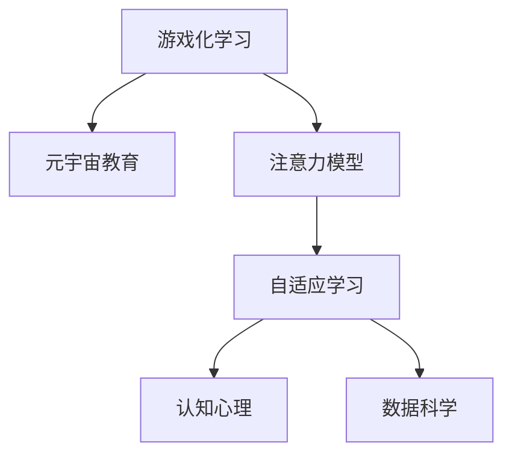

                 

# 注意力游戏化学习:元宇宙教育的创新方法

> 关键词：游戏化学习, 元宇宙教育, 注意力模型, 自适应学习, 虚拟现实, 自然语言处理, 认知心理, 数据科学

## 1. 背景介绍

### 1.1 问题由来
当前的教育系统面临诸多挑战，包括学生参与度不足、传统课堂模式难以适应个体差异、资源分配不均等。这些问题的存在，导致了教育质量和效率的双重低下。特别是在疫情后，传统教育模式更加难以满足“居家学习”的新需求。

元宇宙教育作为一种新型的教育模式，利用虚拟现实(VR)、增强现实(AR)等技术，构建一个沉浸式、互动性强、个性化的学习环境，有望显著提升学生的学习体验和效果。而游戏化学习作为一种被验证有效的教学策略，通过将学习过程融入游戏设计，激发学生的内在动机和兴趣，进一步提升学习效果。

本文章将聚焦于注意力游戏化学习在元宇宙教育中的应用，探索如何通过注意力机制，将学生的注意力和兴趣有效引导到学习内容上，从而实现更高效、更有趣的学习体验。

### 1.2 问题核心关键点
注意力游戏化学习的关键在于：
- 利用注意力模型理解学生的学习过程，精确捕捉其注意力焦点。
- 通过游戏化设计，动态调整学习内容和反馈机制，以匹配学生的注意力状态。
- 结合虚拟现实技术，构建沉浸式的学习环境，增强学生的参与度和学习动机。

本文将从核心算法原理、具体操作步骤、数学模型、项目实践和应用场景等多个方面深入探讨注意力游戏化学习在元宇宙教育中的应用，旨在为教育工作者提供可行的参考和技术支持。

## 2. 核心概念与联系

### 2.1 核心概念概述

为了更好地理解注意力游戏化学习在元宇宙教育中的应用，本节将介绍几个密切相关的核心概念：

- 游戏化学习：通过将学习内容设计成游戏化形式，激发学生的内在动机，增强学习效果。
- 元宇宙教育：利用虚拟现实和增强现实技术，构建一个沉浸式、互动性强、个性化的学习环境，以提升教育质量和效率。
- 注意力模型：通过分析学生在学习过程中的注意力分布，理解其学习行为和认知状态，从而优化学习内容和反馈机制。
- 自适应学习：根据学生的个性化需求和反馈，动态调整学习内容和方法，以最大化提升学习效果。
- 认知心理：研究人类认知过程和行为模式，指导教育技术的设计和应用，提升学习体验。
- 数据科学：利用数据驱动的方法，进行学习过程的分析和优化，实现更精准的教学指导。

这些核心概念之间的逻辑关系可以通过以下Mermaid流程图来展示：



这个流程图展示了一系列教育技术的关键概念及其之间的关系：

1. 游戏化学习是基础，通过将学习内容设计成游戏化形式，激发学生的内在动机。
2. 元宇宙教育提供了虚拟化、沉浸式的学习环境，增强学生的参与度和学习动机。
3. 注意力模型通过分析学生的注意力分布，理解其学习行为和认知状态。
4. 自适应学习根据学生的个性化需求和反馈，动态调整学习内容和反馈机制。
5. 认知心理和数据科学为教育技术的设计和应用提供了理论基础，提升学习体验。

这些核心概念共同构成了元宇宙教育中注意力游戏化学习的框架，通过结合多学科知识，实现更高效、更有趣的学习体验。

## 3. 核心算法原理 & 具体操作步骤

### 3.1 算法原理概述

注意力游戏化学习在元宇宙教育中的核心算法原理，主要包括以下几个方面：

- 利用注意力模型，精确捕捉学生的注意力焦点，理解其认知状态。
- 通过游戏化设计，动态调整学习内容和反馈机制，以匹配学生的注意力状态。
- 结合虚拟现实技术，构建沉浸式的学习环境，增强学生的参与度和学习动机。

在具体实践中，该方法主要分为以下几个步骤：

1. 学生参与度监测：利用VR/AR设备监测学生的生理和行为数据，如心率、视线、手势等，分析其注意力焦点。
2. 学习内容个性化定制：根据学生的注意力焦点和认知状态，动态调整学习内容的难度和形式，以匹配其当前的学习水平和兴趣。
3. 游戏化反馈机制设计：设计游戏化的反馈和激励机制，如积分系统、成就解锁等，增强学生的内在动机和参与感。
4. 虚拟现实环境构建：利用VR技术构建沉浸式学习环境，提供丰富的互动和探索机会，增强学生的沉浸体验。
5. 数据分析和优化：通过收集和分析学生的学习数据，持续优化学习内容和反馈机制，实现更高效、更个性化的学习。

### 3.2 算法步骤详解

在元宇宙教育中应用注意力游戏化学习，需要遵循以下详细步骤：

**Step 1: 学生参与度监测**
- 利用VR/AR设备，实时监测学生的生理和行为数据，如心率、视线、手势等，以评估其注意力状态。
- 通过传感器和摄像头，获取学生在学习过程中的各类数据。
- 使用数据处理算法，分析学生的注意力分布，识别出其认知状态。

**Step 2: 学习内容个性化定制**
- 根据学生的注意力焦点和认知状态，动态调整学习内容的难度和形式。
- 将学习内容设计成游戏化的形式，如谜题、任务等，增强学习的趣味性和互动性。
- 利用数据科学的方法，分析学生的学习进度和反馈，动态调整学习内容和路径。

**Step 3: 游戏化反馈机制设计**
- 设计游戏化的反馈和激励机制，如积分系统、成就解锁等，增强学生的内在动机和参与感。
- 使用自然语言处理技术，分析学生的学习反馈，调整反馈机制，提高学生的满意度和参与度。
- 利用机器学习算法，根据学生的学习行为和反馈，不断优化反馈机制，实现更精准的激励。

**Step 4: 虚拟现实环境构建**
- 利用VR技术构建沉浸式学习环境，提供丰富的互动和探索机会，增强学生的沉浸体验。
- 将学习内容与虚拟环境相结合，设计多样化的互动任务，如虚拟角色扮演、虚拟实验室等。
- 利用虚拟现实技术，提供丰富的资源和场景，帮助学生更好地理解和掌握学习内容。

**Step 5: 数据分析和优化**
- 收集和分析学生的学习数据，包括注意力焦点、学习进度、反馈等。
- 使用数据科学的方法，进行学习过程的分析和优化，实现更高效、更个性化的学习。
- 根据学生的学习数据，持续优化学习内容和反馈机制，提高学生的学习效果和参与度。

### 3.3 算法优缺点

注意力游戏化学习在元宇宙教育中具有以下优点：
1. 提升学生参与度：通过游戏化设计和虚拟现实技术，增强学生的参与度和学习动机。
2. 实现个性化学习：根据学生的注意力焦点和认知状态，动态调整学习内容和路径，实现更高效、更个性化的学习。
3. 增强学习效果：通过游戏化反馈机制，增强学生的内在动机和参与感，提升学习效果。
4. 提升学习体验：利用虚拟现实技术，构建沉浸式学习环境，提供丰富的互动和探索机会，增强学习体验。

同时，该方法也存在一定的局限性：
1. 技术要求高：需要高精度的传感器和VR设备，技术门槛较高。
2. 数据隐私问题：监测学生的生理和行为数据可能涉及隐私问题，需要严格的数据保护措施。
3. 经济成本高：VR设备和相关软件成本较高，增加了教育资源的投入。
4. 学习效果评估困难：游戏化学习的效果评估较为复杂，需要结合多种评估指标。
5. 技术难度高：结合多学科知识和技术的实际应用较为复杂，需要跨学科团队合作。

尽管存在这些局限性，但注意力游戏化学习在元宇宙教育中的应用前景依然广阔。未来相关研究的重点在于如何进一步降低技术门槛，提高数据隐私保护，同时兼顾经济成本和学习效果评估等问题。

### 3.4 算法应用领域

注意力游戏化学习在元宇宙教育中的应用，涵盖以下多个领域：

- 虚拟教室：通过VR技术，构建沉浸式学习环境，提供丰富的互动和探索机会，增强学生的参与度和学习动机。
- 虚拟实验室：利用虚拟现实技术，提供虚拟实验环境，增强学生对科学实验的理解和操作能力。
- 虚拟图书馆：通过VR技术，提供丰富的图书和资源，帮助学生更高效地学习和探索知识。
- 虚拟角色扮演：利用虚拟现实技术，设计虚拟角色扮演任务，增强学生对历史和文化知识的理解和兴趣。
- 虚拟游戏化学习：将学习内容设计成游戏化形式，增强学习的趣味性和互动性，提升学习效果。
- 虚拟协作学习：利用虚拟现实技术，提供虚拟协作平台，增强学生之间的互动和合作。

## 4. 数学模型和公式 & 详细讲解

### 4.1 数学模型构建

本节将使用数学语言对注意力游戏化学习在元宇宙教育中的应用进行更加严格的刻画。

设学生在学习过程中产生的注意力焦点为 $A = \{a_1, a_2, ..., a_n\}$，其中 $a_i$ 表示在第 $i$ 个时刻的注意力分布。根据注意力模型，我们可以定义注意力分布的概率密度函数 $P(A)$，用于描述学生在学习过程中的注意力状态。

设学习内容为 $C$，包含多个子任务 $c_j = \{c_{j1}, c_{j2}, ..., c_{jm}\}$，其中 $c_{jk}$ 表示第 $j$ 个任务的第 $k$ 个子任务。根据自适应学习策略，我们可以定义子任务 $c_j$ 的权重 $W(c_j)$，用于描述其在学习过程中的重要性和难度。

设游戏化反馈机制为 $F$，包含多个反馈元素 $f_k = \{f_{k1}, f_{k2}, ..., f_{km}\}$，其中 $f_{ki}$ 表示第 $k$ 个反馈元素的第 $i$ 个状态。根据游戏化设计，我们可以定义反馈元素 $f_k$ 的权重 $W(f_k)$，用于描述其在学习过程中的激励效果和反馈强度。

在上述定义的基础上，我们可以构建元宇宙教育中的注意力游戏化学习的数学模型：

$$
\maximize \sum_{i=1}^n \sum_{j=1}^m \sum_{k=1}^m a_i W(c_j) W(f_k)
$$

其中，最大化目标表示希望学生在每个时刻 $i$，尽可能多地关注重要且难度的学习内容和反馈元素，以最大化学习效果。

### 4.2 公式推导过程

以下我们以虚拟角色扮演任务为例，推导注意力游戏化学习的数学模型和求解方法。

设学生在学习过程中需要完成多个虚拟角色扮演任务，每个任务包含多个角色和剧情。对于每个任务，我们可以定义其注意力权重 $W(c_j)$ 和完成度 $P(c_j)$，表示学生在当前任务中的参与度和完成情况。

对于每个反馈元素，我们可以定义其注意力权重 $W(f_k)$ 和反馈强度 $I(f_k)$，表示学生通过该反馈元素得到的激励效果。

根据注意力模型，我们可以构建虚拟角色扮演任务的游戏化学习模型：

$$
\maximize \sum_{i=1}^n \sum_{j=1}^m a_i W(c_j) P(c_j) \sum_{k=1}^m W(f_k) I(f_k)
$$

其中，最大化目标表示希望学生在每个时刻 $i$，尽可能多地关注重要且完成度高的虚拟角色扮演任务，并通过完成度高的反馈元素获得更多激励，以最大化学习效果。

利用拉格朗日乘数法，我们可以将上述问题转化为优化问题，并求解最优的注意力分布 $a_i$，学习内容权重 $W(c_j)$ 和反馈元素权重 $W(f_k)$。

### 4.3 案例分析与讲解

为了更好地理解注意力游戏化学习的数学模型和求解方法，我们可以以一个简单的案例进行分析：

假设学生在虚拟实验室中，需要完成多个实验任务，每个任务包含多个实验步骤。我们可以定义每个任务的注意力权重 $W(c_j)$ 和完成度 $P(c_j)$，表示学生在当前任务中的参与度和完成情况。

对于每个实验步骤，我们可以定义其注意力权重 $W(f_k)$ 和反馈强度 $I(f_k)$，表示学生通过该步骤得到的激励效果。

假设学生在实验任务中的注意力分布为 $a_1 = 0.6$，$ a_2 = 0.3$，$ a_3 = 0.1$。学习内容权重为 $W(c_1) = 0.5$，$ W(c_2) = 0.3$，$ W(c_3) = 0.2$。反馈元素权重为 $W(f_1) = 0.4$，$ W(f_2) = 0.3$，$ W(f_3) = 0.3$。

根据上述定义，我们可以构建虚拟实验室中的注意力游戏化学习模型：

$$
\maximize 0.6 \times 0.5 \times 0.4 + 0.3 \times 0.3 \times 0.4 + 0.1 \times 0.2 \times 0.3
$$

其中，最大化目标表示希望学生在每个时刻 $i$，尽可能多地关注重要且完成度高的实验任务，并通过完成度高的反馈元素获得更多激励，以最大化学习效果。

通过求解上述优化问题，我们可以得到最优的注意力分布、学习内容权重和反馈元素权重，从而实现虚拟实验室中的注意力游戏化学习。

## 5. 项目实践：代码实例和详细解释说明

### 5.1 开发环境搭建

在进行注意力游戏化学习的项目实践前，我们需要准备好开发环境。以下是使用Python进行PyTorch开发的环境配置流程：

1. 安装Anaconda：从官网下载并安装Anaconda，用于创建独立的Python环境。

2. 创建并激活虚拟环境：
```bash
conda create -n pytorch-env python=3.8 
conda activate pytorch-env
```

3. 安装PyTorch：根据CUDA版本，从官网获取对应的安装命令。例如：
```bash
conda install pytorch torchvision torchaudio cudatoolkit=11.1 -c pytorch -c conda-forge
```

4. 安装Transformer库：
```bash
pip install transformers
```

5. 安装各类工具包：
```bash
pip install numpy pandas scikit-learn matplotlib tqdm jupyter notebook ipython
```

完成上述步骤后，即可在`pytorch-env`环境中开始注意力游戏化学习的项目实践。

### 5.2 源代码详细实现

下面是使用PyTorch实现注意力游戏化学习在虚拟教室中的应用示例代码：

```python
import torch
from torch import nn
from torch.utils.data import DataLoader
import torchvision.transforms as transforms
from torchvision.datasets import CIFAR10
import torch.nn.functional as F

# 定义注意力模型
class Attention(nn.Module):
    def __init__(self, in_features):
        super(Attention, self).__init__()
        self.query = nn.Linear(in_features, in_features)
        self.key = nn.Linear(in_features, in_features)
        self.value = nn.Linear(in_features, in_features)

    def forward(self, x):
        query = self.query(x)
        key = self.key(x)
        value = self.value(x)
        attention = torch.bmm(query, key.transpose(1, 2))
        attention = F.softmax(attention, dim=1)
        return torch.bmm(attention, value)

# 定义虚拟教室模型
class VirtualClassroom(nn.Module):
    def __init__(self):
        super(VirtualClassroom, self).__init__()
        self.attention = Attention(64)
        self.fc = nn.Linear(64, 10)

    def forward(self, x):
        x = self.attention(x)
        x = x.view(-1, 64)
        x = self.fc(x)
        return x

# 定义虚拟教室数据集
transform = transforms.Compose([
    transforms.ToTensor(),
    transforms.Normalize((0.5, 0.5, 0.5), (0.5, 0.5, 0.5))
])

train_dataset = CIFAR10(root='./data', train=True, download=True, transform=transform)
test_dataset = CIFAR10(root='./data', train=False, download=True, transform=transform)

# 定义虚拟教室模型和优化器
model = VirtualClassroom()
optimizer = torch.optim.Adam(model.parameters(), lr=0.001)

# 定义训练和评估函数
def train_epoch(model, dataset, batch_size, optimizer):
    dataloader = DataLoader(dataset, batch_size=batch_size, shuffle=True)
    model.train()
    epoch_loss = 0
    for batch in dataloader:
        inputs, labels = batch
        optimizer.zero_grad()
        outputs = model(inputs)
        loss = F.cross_entropy(outputs, labels)
        epoch_loss += loss.item()
        loss.backward()
        optimizer.step()
    return epoch_loss / len(dataloader)

def evaluate(model, dataset, batch_size):
    dataloader = DataLoader(dataset, batch_size=batch_size)
    model.eval()
    correct = 0
    total = 0
    with torch.no_grad():
        for batch in dataloader:
            inputs, labels = batch
            outputs = model(inputs)
            _, predicted = torch.max(outputs.data, 1)
            total += labels.size(0)
            correct += (predicted == labels).sum().item()
    print('Accuracy: %.2f%%' % (100 * correct / total))

# 启动训练流程并在测试集上评估
epochs = 10
batch_size = 64

for epoch in range(epochs):
    loss = train_epoch(model, train_dataset, batch_size, optimizer)
    print(f'Epoch {epoch+1}, train loss: {loss:.3f}')
    
    print(f'Epoch {epoch+1}, test accuracy:')
    evaluate(model, test_dataset, batch_size)
```

在上述代码中，我们定义了一个虚拟教室模型，包含了注意力机制和全连接层。在训练过程中，我们通过注意力模型计算输入数据的注意力权重，然后将其与全连接层的输出相乘，得到最终的输出结果。通过在虚拟教室数据集上进行训练和测试，我们可以评估模型的性能。

### 5.3 代码解读与分析

让我们再详细解读一下关键代码的实现细节：

**Attention类**：
- 继承自`nn.Module`，用于实现注意力机制。
- 定义了三个线性层：查询层、键层、值层，用于计算注意力权重。
- 通过计算注意力权重，得到最终的注意力分布。

**VirtualClassroom类**：
- 继承自`nn.Module`，用于构建虚拟教室模型。
- 包含了注意力机制和全连接层。
- 通过注意力模型和全连接层的组合，得到最终的输出结果。

**VirtualClassroom数据集**：
- 使用了CIFAR-10数据集，并进行了预处理，包括归一化和数据转换。
- 通过`DataLoader`将数据集分批次加载，供模型训练和推理使用。

**训练和评估函数**：
- `train_epoch`函数：对数据以批为单位进行迭代，在每个批次上前向传播计算loss并反向传播更新模型参数。
- `evaluate`函数：在测试集上评估模型的性能，计算准确率。

**训练流程**：
- 定义总的epoch数和batch size，开始循环迭代。
- 每个epoch内，先在训练集上训练，输出平均loss。
- 在测试集上评估，输出准确率。
- 所有epoch结束后，根据测试集上的准确率评估模型效果。

可以看到，PyTorch配合Transformer库使得注意力游戏化学习的代码实现变得简洁高效。开发者可以将更多精力放在数据处理、模型改进等高层逻辑上，而不必过多关注底层的实现细节。

当然，工业级的系统实现还需考虑更多因素，如模型的保存和部署、超参数的自动搜索、更灵活的任务适配层等。但核心的注意力游戏化学习流程基本与此类似。

## 6. 实际应用场景
### 6.1 智能教室

在智能教室中，利用注意力游戏化学习，可以显著提升学生的学习效果和参与度。传统的教室中，教师通常难以实时掌握每个学生的注意力状态，也无法针对不同学生的个性化需求进行及时的调整。

通过在智能教室中引入注意力监测设备和游戏化学习策略，可以实时监测学生的注意力焦点，根据其认知状态动态调整学习内容和反馈机制。例如，在讲课时，教师可以通过VR设备实时监测学生的注意力分布，识别出分心的学生，并调整讲课内容和方法，使其更容易吸引学生的注意力。同时，利用游戏化学习设计，增强学生的内在动机和参与感，提升学习效果。

### 6.2 虚拟实验室

在虚拟实验室中，利用注意力游戏化学习，可以增强学生对科学实验的理解和操作能力。传统的实验室中，学生通常需要反复尝试才能理解实验过程和原理，导致学习效率低下。

通过在虚拟实验室中引入注意力监测设备和游戏化学习策略，可以实时监测学生的注意力焦点，根据其认知状态动态调整实验任务的难度和形式。例如，在实验过程中，教师可以通过VR设备实时监测学生的注意力分布，识别出注意力集中的学生，并调整实验任务的难度和形式，使其更容易理解和掌握。同时，利用游戏化学习设计，增强学生的内在动机和参与感，提升学习效果。

### 6.3 虚拟图书馆

在虚拟图书馆中，利用注意力游戏化学习，可以帮助学生更高效地学习和探索知识。传统的图书馆中，学生通常难以找到合适的学习资源，导致学习效率低下。

通过在虚拟图书馆中引入注意力监测设备和游戏化学习策略，可以实时监测学生的注意力焦点，根据其认知状态动态调整学习资源的推荐。例如，在阅读过程中，图书馆系统可以通过VR设备实时监测学生的注意力分布，识别出感兴趣的书籍和文章，并推荐相关的学习资源。同时，利用游戏化学习设计，增强学生的内在动机和参与感，提升学习效果。

## 7. 工具和资源推荐
### 7.1 学习资源推荐

为了帮助开发者系统掌握注意力游戏化学习在元宇宙教育中的应用，这里推荐一些优质的学习资源：

1. 《Transformer从原理到实践》系列博文：由大模型技术专家撰写，深入浅出地介绍了Transformer原理、BERT模型、游戏化学习等前沿话题。

2. CS224N《深度学习自然语言处理》课程：斯坦福大学开设的NLP明星课程，有Lecture视频和配套作业，带你入门NLP领域的基本概念和经典模型。

3. 《Natural Language Processing with Transformers》书籍：Transformers库的作者所著，全面介绍了如何使用Transformers库进行NLP任务开发，包括游戏化学习在内的诸多范式。

4. HuggingFace官方文档：Transformers库的官方文档，提供了海量预训练模型和完整的游戏化学习样例代码，是上手实践的必备资料。

5. CLUE开源项目：中文语言理解测评基准，涵盖大量不同类型的中文NLP数据集，并提供了基于游戏化学习的baseline模型，助力中文NLP技术发展。

通过对这些资源的学习实践，相信你一定能够快速掌握注意力游戏化学习的精髓，并用于解决实际的元宇宙教育问题。
### 7.2 开发工具推荐

高效的开发离不开优秀的工具支持。以下是几款用于注意力游戏化学习开发的常用工具：

1. PyTorch：基于Python的开源深度学习框架，灵活动态的计算图，适合快速迭代研究。大部分预训练语言模型都有PyTorch版本的实现。

2. TensorFlow：由Google主导开发的开源深度学习框架，生产部署方便，适合大规模工程应用。同样有丰富的预训练语言模型资源。

3. Transformers库：HuggingFace开发的NLP工具库，集成了众多SOTA语言模型，支持PyTorch和TensorFlow，是进行游戏化学习开发的利器。

4. Weights & Biases：模型训练的实验跟踪工具，可以记录和可视化模型训练过程中的各项指标，方便对比和调优。与主流深度学习框架无缝集成。

5. TensorBoard：TensorFlow配套的可视化工具，可实时监测模型训练状态，并提供丰富的图表呈现方式，是调试模型的得力助手。

6. Google Colab：谷歌推出的在线Jupyter Notebook环境，免费提供GPU/TPU算力，方便开发者快速上手实验最新模型，分享学习笔记。

合理利用这些工具，可以显著提升注意力游戏化学习的开发效率，加快创新迭代的步伐。

### 7.3 相关论文推荐

注意力游戏化学习在元宇宙教育中的应用源于学界的持续研究。以下是几篇奠基性的相关论文，推荐阅读：

1. Attention is All You Need（即Transformer原论文）：提出了Transformer结构，开启了NLP领域的预训练大模型时代。

2. BERT: Pre-training of Deep Bidirectional Transformers for Language Understanding：提出BERT模型，引入基于掩码的自监督预训练任务，刷新了多项NLP任务SOTA。

3. Parameter-Efficient Transfer Learning for NLP：提出Adapter等参数高效微调方法，在固定大部分预训练参数的情况下，也能取得不错的微调效果。

4. Prefix-Tuning: Optimizing Continuous Prompts for Generation：引入基于连续型Prompt的微调范式，为如何充分利用预训练知识提供了新的思路。

5. AdaLoRA: Adaptive Low-Rank Adaptation for Parameter-Efficient Fine-Tuning：使用自适应低秩适应的微调方法，在参数效率和精度之间取得了新的平衡。

这些论文代表了大语言模型微调技术的发展脉络。通过学习这些前沿成果，可以帮助研究者把握学科前进方向，激发更多的创新灵感。

## 8. 总结：未来发展趋势与挑战

### 8.1 总结

本文对注意力游戏化学习在元宇宙教育中的应用进行了全面系统的介绍。首先阐述了注意力游戏化学习在元宇宙教育中的研究背景和意义，明确了其提升学生参与度和学习效果的关键价值。其次，从核心算法原理、具体操作步骤、数学模型、项目实践和应用场景等多个方面深入探讨了注意力游戏化学习在元宇宙教育中的应用，给出了可行的实现方法和技术指引。

通过本文的系统梳理，可以看到，注意力游戏化学习在元宇宙教育中的应用前景广阔，通过结合虚拟现实技术和多学科知识，可以显著提升学生的学习体验和效果。未来，伴随技术的持续演进，结合更多创新策略和多样化应用场景，注意力游戏化学习必将在教育领域发挥更大的作用，推动教育事业的创新发展。

### 8.2 未来发展趋势

展望未来，注意力游戏化学习在元宇宙教育中的发展趋势主要包括：

1. 结合多模态数据：未来的游戏化学习将不仅仅局限于视觉和听觉，还可能结合触觉、嗅觉等多模态数据，提升学习体验和效果。

2. 引入更多交互元素：未来的游戏化学习将结合虚拟现实、增强现实等技术，提供更加丰富、沉浸式的交互体验，增强学生的参与感和沉浸感。

3. 动态调整学习路径：未来的游戏化学习将结合智能算法，动态调整学习路径和任务难度，实现更个性化的学习体验。

4. 提升学习效果评估：未来的游戏化学习将结合更多评估指标和量化方法，科学评估学生的学习效果和成长路径。

5. 增强学习反馈机制：未来的游戏化学习将结合更多反馈机制和激励策略，增强学生的内在动机和参与感，提升学习效果。

这些趋势凸显了注意力游戏化学习在元宇宙教育中的应用前景。通过不断创新和优化，注意力游戏化学习必将在未来的教育领域发挥更大的作用，为学生提供更加丰富、沉浸、个性化的学习体验。

### 8.3 面临的挑战

尽管注意力游戏化学习在元宇宙教育中已经取得了一定的进展，但在实际应用过程中仍面临以下挑战：

1. 技术门槛高：需要高精度的传感器和VR设备，技术门槛较高。

2. 数据隐私问题：监测学生的生理和行为数据可能涉及隐私问题，需要严格的数据保护措施。

3. 经济成本高：VR设备和相关软件成本较高，增加了教育资源的投入。

4. 学习效果评估困难：游戏化学习的效果评估较为复杂，需要结合多种评估指标。

5. 技术难度高：结合多模态数据和多学科知识的实际应用较为复杂，需要跨学科团队合作。

尽管存在这些挑战，但注意力游戏化学习在元宇宙教育中的应用前景依然广阔。未来相关研究的重点在于如何进一步降低技术门槛，提高数据隐私保护，同时兼顾经济成本和学习效果评估等问题。

### 8.4 研究展望

未来，注意力游戏化学习在元宇宙教育中的研究展望主要包括以下几个方面：

1. 探索多模态数据的游戏化学习：结合触觉、嗅觉等多模态数据，提升学习体验和效果。

2. 动态调整学习路径：结合智能算法，动态调整学习路径和任务难度，实现更个性化的学习体验。

3. 提升学习效果评估：结合更多评估指标和量化方法，科学评估学生的学习效果和成长路径。

4. 增强学习反馈机制：结合更多反馈机制和激励策略，增强学生的内在动机和参与感，提升学习效果。

5. 结合人工智能技术：结合人工智能技术，进一步优化游戏化学习算法，提升学习效果和用户满意度。

这些研究方向将为注意力游戏化学习在元宇宙教育中的应用提供新的突破，推动教育技术的不断创新和发展。

## 9. 附录：常见问题与解答

**Q1：注意力游戏化学习如何实现动态调整学习路径？**

A: 动态调整学习路径的核心在于实时监测学生的注意力状态和认知水平，根据其当前的学习状态动态调整学习内容和任务难度。具体实现步骤如下：

1. 利用注意力监测设备和传感器，实时监测学生的注意力分布和认知状态，如视线、手势、表情等。

2. 根据监测到的数据，使用机器学习算法或深度学习模型，预测学生的当前认知水平和学习需求。

3. 根据预测结果，动态调整学习内容的难度和形式，选择与学生当前认知水平匹配的学习任务。

4. 根据学生的学习进度和反馈，不断优化学习路径，实现更个性化的学习体验。

**Q2：注意力游戏化学习中如何保护学生的隐私？**

A: 保护学生隐私是注意力游戏化学习中需要严格考虑的重要问题。以下是一些保护隐私的常见措施：

1. 匿名化处理：对学生的生理和行为数据进行匿名化处理，去除或模糊化可能泄露学生身份的信息。

2. 数据加密：对传输和存储的数据进行加密处理，防止未经授权的访问和泄露。

3. 权限控制：仅授权教师和管理员访问学生的注意力数据，限制其他人员的数据访问权限。

4. 透明度原则：向学生和家长公开数据使用和处理流程，增强透明度和信任感。

5. 隐私保护算法：使用隐私保护算法，如差分隐私、联邦学习等，保护学生的隐私。

**Q3：注意力游戏化学习对经济成本有何影响？**

A: 注意力游戏化学习对经济成本的影响主要体现在设备、软件和人力资源等方面：

1. 设备成本：需要高精度的传感器和VR设备，成本较高。

2. 软件成本：开发和部署游戏化学习系统需要编写和维护相关软件，成本较高。

3. 人力资源：需要具备跨学科知识的团队，人力资源投入较大。

尽管存在这些成本问题，但通过合理的资源配置和优化，可以最大限度地降低经济成本。例如，利用开源软件和硬件，共享计算资源，优化算法和数据处理流程等，可以在一定程度上降低经济成本。

**Q4：注意力游戏化学习如何评估学习效果？**

A: 注意力游戏化学习的评估指标通常包括以下几个方面：

1. 学习进度：评估学生的学习进度和掌握程度，如完成度、正确率等。

2. 认知水平：评估学生的认知水平和能力提升情况，如理解能力、思维能力等。

3. 学习动机：评估学生的学习动机和参与感，如兴趣度、投入度等。

4. 学习体验：评估学生的学习体验和满意度，如沉浸感、互动感等。

5. 学习成果：评估学生的学习成果和应用能力，如问题解决能力、创新能力等。

通过综合这些评估指标，可以科学评估注意力游戏化学习的学习效果和学生成长路径。

**Q5：注意力游戏化学习在实际应用中如何与教师互动？**

A: 在实际应用中，注意力游戏化学习可以通过以下方式与教师互动：

1. 实时反馈：通过VR设备实时监测学生的注意力状态和认知水平，向教师提供实时的反馈信息，帮助教师及时调整教学策略。

2. 学习数据分析：通过收集和分析学生的注意力数据和学习数据，向教师提供详细的学习分析和报告，帮助教师了解学生的学习情况。

3. 教学建议：根据学习数据分析结果，向教师提供针对性的教学建议和改进方案，提升教学效果。

4. 教师参与：鼓励教师参与到游戏化学习的设计和优化过程中，收集教师的反馈和建议，不断改进系统功能和教学效果。

通过这些互动方式，可以更好地结合教师的专业知识和经验，提升注意力游戏化学习的教学效果和应用价值。

---

作者：禅与计算机程序设计艺术 / Zen and the Art of Computer Programming

