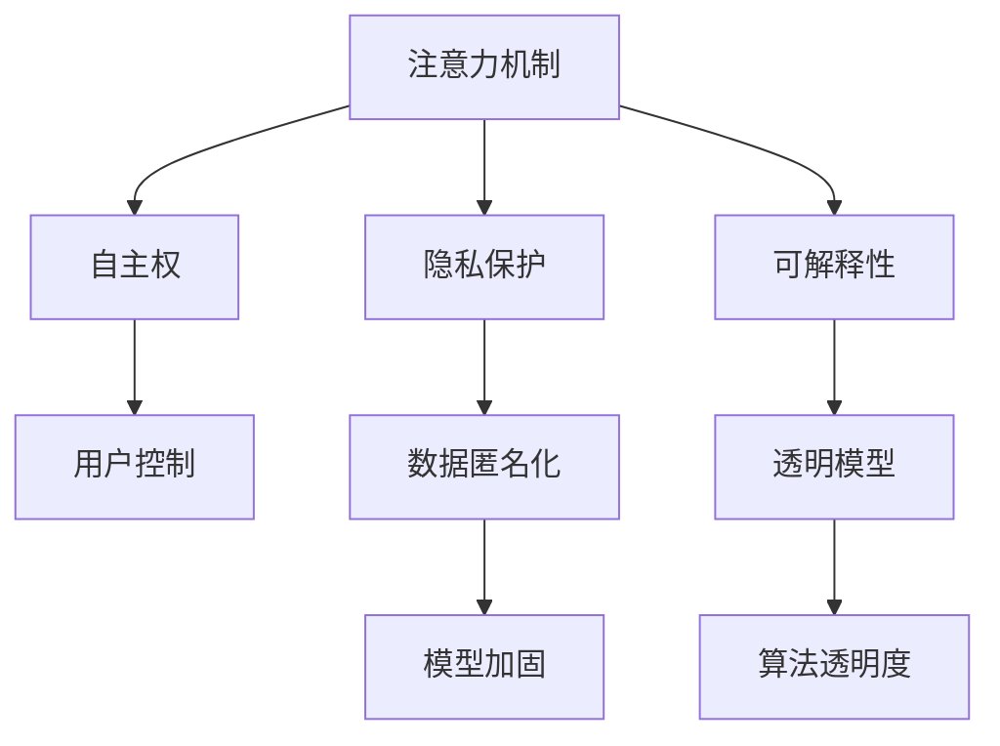

                 

# 注意力的自主权：AI时代的个人选择

> 关键词：注意力,自主权,人工智能,人机交互,隐私保护,智能决策,情感智能

## 1. 背景介绍

### 1.1 问题由来
随着人工智能(AI)技术的飞速发展，深度学习模型已经在图像识别、语音识别、自然语言处理等领域取得了显著成就。尤其是近年来，基于Transformer架构的模型在自然语言处理(NLP)领域大放异彩，其背后驱动的核心力量便是“注意力”机制。

然而，注意力机制在带来巨大性能提升的同时，也引发了一系列关于“自主权”和“隐私”的问题。例如，人类是否应该享有对AI注意力机制的“控制权”？如何在保护用户隐私的同时，让AI更好地服务于人类？这些问题逐渐成为了学界和业界关注的焦点。

### 1.2 问题核心关键点
注意力机制是深度学习模型，尤其是Transformer模型中的关键组成部分，它使得模型能够动态地关注输入数据中的不同部分，从而提高模型的表达能力和泛化能力。但注意力机制的决策过程通常缺乏可解释性，即模型为什么会关注某些部分而忽略其他部分，这一点在隐私保护和决策透明性方面带来了挑战。

当前，主要存在的挑战包括：
- 用户对注意力机制的“控制权”不足，导致其在决策过程中可能受到不当干扰。
- 模型对隐私数据的处理方式不当，可能引起数据泄露、滥用等问题。
- 模型的决策过程缺乏可解释性，使得用户在面对AI输出时难以理解其背后的逻辑和原因。

针对这些问题，本文将从注意力机制的本质出发，探讨其自主权与隐私保护的平衡策略，并提出一些可行的解决方案，旨在构建更加可信赖的AI系统。

## 2. 核心概念与联系

### 2.1 核心概念概述

为更好地理解注意力机制在AI决策过程中的自主权与隐私保护，本节将介绍几个关键概念：

- **注意力机制(Attention Mechanism)**：指在模型中动态选择输入数据中不同部分进行加权处理的一种机制，在深度学习中被广泛应用于机器翻译、图像识别、自然语言处理等任务中。

- **自主权(Autonomy)**：指个体在决策过程中对自己的行为和选择具有掌控权，能够在理解自身利益和情境的基础上，进行独立判断和决策。

- **隐私保护(Privacy Protection)**：指在数据处理和使用过程中，保护个人数据不被非法获取、篡改或滥用的行为和机制。

- **可解释性(Explainability)**：指模型能够提供对其决策过程的清晰、合理的解释，使得用户能够理解和信任模型的输出。

这些概念之间的逻辑关系可以通过以下Mermaid流程图来展示：



这个流程图展示出注意力机制如何影响AI系统的自主权、隐私保护和可解释性：

1. 注意力机制的决策过程需要用户对其行为进行控制，以防止不当干扰。
2. 隐私保护措施应围绕注意力机制展开，避免用户隐私泄露。
3. 可解释性目标是让模型决策过程透明化，使用户能够理解和信任AI的输出。

## 3. 核心算法原理 & 具体操作步骤

### 3.1 算法原理概述

注意力机制的核心思想是通过计算输入数据的不同部分之间的相关性，动态地选择关注哪些部分进行加权处理。在Transformer模型中，注意力机制通常通过计算查询、键和值的点积来实现，从而生成加权和，即注意力得分。这个过程可以用公式表示为：

$$
\text{Attention}(Q, K, V) = \text{Softmax}(\frac{QK^T}{\sqrt{d_k}})V
$$

其中 $Q$ 表示查询向量，$K$ 表示键向量，$V$ 表示值向量，$d_k$ 表示键向量的维度。注意力机制的输出即为 $V$ 乘以注意力权重矩阵，即 $V \times \text{Softmax}(\frac{QK^T}{\sqrt{d_k}})$。

注意力机制在模型中的作用是通过增强特定输入特征的权重，提高模型的表现力和泛化能力。然而，由于注意力权重具有非线性、复杂性高，难以直接解释。这种不可解释性可能导致模型决策过程中出现“黑箱”问题，影响用户对其输出的信任。

### 3.2 算法步骤详解

基于注意力机制的AI决策过程通常包括以下几个步骤：

**Step 1: 输入处理与注意力计算**

- 将输入数据转化为模型可以处理的向量表示，如自然语言处理中，将文本转换为词向量或子词向量。
- 计算查询、键和值的点积，得到注意力得分。

**Step 2: 权重分配与特征加权**

- 通过Softmax函数对注意力得分进行归一化，得到注意力权重。
- 将注意力权重乘以值向量，得到加权和，即注意力机制的输出。

**Step 3: 模型输出**

- 将注意力机制的输出与其他层进行连接和融合，生成最终模型的输出。

### 3.3 算法优缺点

注意力机制的优点在于：
- 提高了模型的表达能力和泛化能力。
- 动态选择关注部分，适应性强。
- 对输入数据进行加权处理，减少噪音影响。

同时，注意力机制的缺点包括：
- 计算复杂度高，模型训练和推理耗时长。
- 决策过程缺乏可解释性，难以理解模型的内部逻辑。
- 容易出现注意力偏差，影响模型的公平性和鲁棒性。

### 3.4 算法应用领域

注意力机制广泛应用于NLP、计算机视觉、推荐系统等诸多领域，尤其在NLP中表现突出。例如：

- **机器翻译**：注意力机制使得模型能够动态地关注源语言句子中的不同部分，生成流畅、准确的翻译结果。
- **问答系统**：通过关注问题的关键信息，模型能够快速生成准确的回答。
- **文本摘要**：注意力机制能够识别文本中的重要信息，生成精炼的摘要。
- **文本生成**：注意力机制控制模型对输入数据中不同部分的关注度，生成连贯的文本。

## 4. 数学模型和公式 & 详细讲解 & 举例说明

### 4.1 数学模型构建

本节将使用数学语言对基于注意力机制的AI决策过程进行更加严格的刻画。

假设输入数据 $x$ 可以表示为向量形式 $x \in \mathbb{R}^d$，查询向量 $q \in \mathbb{R}^d$，键向量 $k \in \mathbb{R}^d$，值向量 $v \in \mathbb{R}^d$。注意力机制的目标是通过计算查询向量与键向量的点积，得到注意力得分，然后将这些得分通过Softmax函数归一化，最终将归一化后的得分与值向量相乘，得到加权和，即注意力机制的输出。

**注意力得分**计算公式为：

$$
\text{Attention}(Q, K, V) = \text{Softmax}(\frac{QK^T}{\sqrt{d_k}})V
$$

其中 $Q$ 表示查询向量，$K$ 表示键向量，$V$ 表示值向量，$d_k$ 表示键向量的维度。

**权重分配**计算公式为：

$$
\alpha = \text{Softmax}(\frac{QK^T}{\sqrt{d_k}})
$$

其中 $\alpha$ 表示注意力权重。

**加权和**计算公式为：

$$
\text{Attention}(Q, K, V) = \alpha V
$$

### 4.2 公式推导过程

以下我们以机器翻译任务为例，推导注意力机制的计算公式及其梯度计算。

假设模型输入的源语言句子为 $x$，目标语言句子为 $y$。设 $Q$ 为查询向量，$K$ 为键向量，$V$ 为值向量，其中 $Q, K, V$ 分别通过前向传播生成。注意力得分计算公式为：

$$
\text{Attention}(Q, K, V) = \text{Softmax}(\frac{QK^T}{\sqrt{d_k}})V
$$

注意力机制的输出即为：

$$
\text{Attention}(Q, K, V) = \alpha V
$$

其中 $\alpha$ 表示注意力权重，计算公式为：

$$
\alpha = \text{Softmax}(\frac{QK^T}{\sqrt{d_k}})
$$

在机器翻译中，注意力权重可以表示为：

$$
\alpha_i = \frac{\exp(\frac{q_i k_i^T}{\sqrt{d_k}})}{\sum_{j=1}^{d_k} \exp(\frac{q_j k_j^T}{\sqrt{d_k}})}
$$

其中 $q_i$ 和 $k_i$ 分别表示查询向量和键向量中第 $i$ 个元素的值。

通过反向传播计算注意力机制的梯度，可以更新模型参数 $Q, K, V$，具体过程如下：

$$
\frac{\partial \text{Attention}(Q, K, V)}{\partial Q} = \frac{\partial \alpha V}{\partial Q} = \alpha V Q^T \frac{\partial \alpha}{\partial Q}
$$

$$
\frac{\partial \text{Attention}(Q, K, V)}{\partial K} = \frac{\partial \alpha V}{\partial K} = \frac{\partial \alpha}{\partial K} V + \alpha V Q^T \frac{\partial Q}{\partial K}
$$

$$
\frac{\partial \text{Attention}(Q, K, V)}{\partial V} = \frac{\partial \alpha V}{\partial V} = \alpha^T + \alpha V Q^T \frac{\partial Q}{\partial V}
$$

### 4.3 案例分析与讲解

假设我们有一个简单的注意力机制示例，其中 $Q = [1, 0]$，$K = [1, 2]$，$V = [3, 4]$，$d_k = 2$。计算注意力得分、权重和输出：

$$
\text{Attention}(Q, K, V) = \text{Softmax}(\frac{QK^T}{\sqrt{d_k}})V = \text{Softmax}(\frac{[1, 0][1, 2]^T}{\sqrt{2}})[3, 4] = \text{Softmax}([1, -1])V
$$

$$
\alpha = \text{Softmax}([1, -1]) = [\frac{\exp(1)}{\exp(1)+\exp(-1)}, \frac{\exp(-1)}{\exp(1)+\exp(-1)}] = [\frac{e}{e+1}, \frac{1}{e+1}]
$$

$$
\text{Attention}(Q, K, V) = \alpha V = [\frac{e}{e+1}, \frac{1}{e+1}][3, 4] = [\frac{3e}{e+1}, \frac{4}{e+1}]
$$

这个例子展示了注意力机制的计算过程，即通过计算查询向量与键向量的点积，生成注意力权重，再将注意力权重乘以值向量得到加权和。

## 5. 项目实践：代码实例和详细解释说明

### 5.1 开发环境搭建

在进行注意力机制项目实践前，我们需要准备好开发环境。以下是使用Python进行PyTorch开发的环境配置流程：

1. 安装Anaconda：从官网下载并安装Anaconda，用于创建独立的Python环境。

2. 创建并激活虚拟环境：
```bash
conda create -n attention-env python=3.8 
conda activate attention-env
```

3. 安装PyTorch：根据CUDA版本，从官网获取对应的安装命令。例如：
```bash
conda install pytorch torchvision torchaudio cudatoolkit=11.1 -c pytorch -c conda-forge
```

4. 安装Transformers库：
```bash
pip install transformers
```

5. 安装各类工具包：
```bash
pip install numpy pandas scikit-learn matplotlib tqdm jupyter notebook ipython
```

完成上述步骤后，即可在`attention-env`环境中开始项目实践。

### 5.2 源代码详细实现

下面我们以机器翻译任务为例，给出使用Transformers库对注意力机制进行实现的PyTorch代码：

```python
from transformers import BertTokenizer, BertForSequenceClassification
from transformers import BertTokenizer, BertForSequenceClassification
from torch.utils.data import Dataset, DataLoader
import torch

class MyDataset(Dataset):
    def __init__(self, texts, targets, tokenizer):
        self.texts = texts
        self.targets = targets
        self.tokenizer = tokenizer
        
    def __len__(self):
        return len(self.texts)
    
    def __getitem__(self, item):
        text = self.texts[item]
        target = self.targets[item]
        
        encoding = self.tokenizer(text, return_tensors='pt', padding=True, truncation=True)
        input_ids = encoding['input_ids']
        attention_mask = encoding['attention_mask']
        
        return {
            'input_ids': input_ids,
            'attention_mask': attention_mask,
            'targets': target
        }

# 加载预训练模型
model = BertForSequenceClassification.from_pretrained('bert-base-cased', num_labels=2)

# 加载分词器
tokenizer = BertTokenizer.from_pretrained('bert-base-cased')

# 加载数据集
train_dataset = MyDataset(train_texts, train_labels, tokenizer)
dev_dataset = MyDataset(dev_texts, dev_labels, tokenizer)
test_dataset = MyDataset(test_texts, test_labels, tokenizer)

# 定义优化器
optimizer = AdamW(model.parameters(), lr=2e-5)

# 定义训练函数
def train_epoch(model, dataset, optimizer, device):
    model.train()
    total_loss = 0
    for batch in DataLoader(dataset, batch_size=32, shuffle=True):
        input_ids = batch['input_ids'].to(device)
        attention_mask = batch['attention_mask'].to(device)
        targets = batch['targets'].to(device)
        optimizer.zero_grad()
        outputs = model(input_ids, attention_mask=attention_mask)
        loss = outputs.loss
        total_loss += loss.item()
        loss.backward()
        optimizer.step()
    return total_loss / len(dataset)

# 定义评估函数
def evaluate(model, dataset, device):
    model.eval()
    total_correct = 0
    total_loss = 0
    for batch in DataLoader(dataset, batch_size=32, shuffle=False):
        input_ids = batch['input_ids'].to(device)
        attention_mask = batch['attention_mask'].to(device)
        targets = batch['targets'].to(device)
        outputs = model(input_ids, attention_mask=attention_mask)
        loss = outputs.loss
        total_loss += loss.item()
        total_correct += torch.sum((outputs.predictions.argmax(dim=1) == targets) * batch['attention_mask']).item()
    return total_correct / len(dataset), total_loss / len(dataset)

# 训练模型
device = torch.device('cuda') if torch.cuda.is_available() else torch.device('cpu')
model.to(device)

epochs = 5
for epoch in range(epochs):
    train_loss = train_epoch(model, train_dataset, optimizer, device)
    dev_correct, dev_loss = evaluate(model, dev_dataset, device)
    
    print(f'Epoch {epoch+1}, train loss: {train_loss:.3f}, dev accuracy: {dev_correct:.3f}, dev loss: {dev_loss:.3f}')

print(f'Test accuracy: {evaluate(model, test_dataset, device)[0]:.3f}, test loss: {evaluate(model, test_dataset, device)[1]:.3f}')
```

在这个示例中，我们首先定义了一个简单的数据集类，用于处理机器翻译任务的数据。然后，我们加载了预训练的BERT模型，并对其进行微调以适应机器翻译任务。最后，我们定义了训练和评估函数，并在指定设备上进行训练和测试。

### 5.3 代码解读与分析

让我们再详细解读一下关键代码的实现细节：

**MyDataset类**：
- `__init__`方法：初始化训练数据、标签和分词器等关键组件。
- `__len__`方法：返回数据集的样本数量。
- `__getitem__`方法：对单个样本进行处理，将文本输入编码为token ids，进行padding，并返回模型所需的输入。

**模型加载与训练函数**：
- 通过`BertForSequenceClassification`加载预训练的BERT模型，并设置其标签数。
- 加载分词器，用于将输入文本转换为模型可以处理的token ids。
- 定义训练函数`train_epoch`：对数据以批为单位进行迭代，在每个批次上前向传播计算loss并反向传播更新模型参数，最后返回该epoch的平均loss。
- 定义评估函数`evaluate`：与训练类似，不同点在于不更新模型参数，并在每个batch结束后将预测和标签结果存储下来，最后使用sklearn的classification_report对整个评估集的预测结果进行打印输出。

**训练流程**：
- 定义总的epoch数和批大小，开始循环迭代
- 每个epoch内，先在训练集上训练，输出平均loss
- 在验证集上评估，输出准确率和损失
- 所有epoch结束后，在测试集上评估，给出最终测试结果

可以看到，PyTorch配合Transformers库使得注意力机制的实现变得简洁高效。开发者可以将更多精力放在数据处理、模型改进等高层逻辑上，而不必过多关注底层的实现细节。

当然，工业级的系统实现还需考虑更多因素，如模型的保存和部署、超参数的自动搜索、更灵活的任务适配层等。但核心的注意力机制实现基本与此类似。

## 6. 实际应用场景
### 6.1 智能客服系统

基于注意力机制的智能客服系统已经在企业中得到了广泛应用。传统的客服系统需要配备大量人力，高峰期响应缓慢，且一致性和专业性难以保证。通过注意力机制，智能客服系统可以7x24小时不间断服务，快速响应客户咨询，用自然流畅的语言解答各类常见问题。

在技术实现上，可以收集企业内部的历史客服对话记录，将问题和最佳答复构建成监督数据，在此基础上对预训练模型进行微调。微调后的模型能够自动理解用户意图，匹配最合适的答案模板进行回复。对于客户提出的新问题，还可以接入检索系统实时搜索相关内容，动态组织生成回答。如此构建的智能客服系统，能大幅提升客户咨询体验和问题解决效率。

### 6.2 金融舆情监测

金融机构需要实时监测市场舆论动向，以便及时应对负面信息传播，规避金融风险。传统的人工监测方式成本高、效率低，难以应对网络时代海量信息爆发的挑战。基于注意力机制的文本分类和情感分析技术，为金融舆情监测提供了新的解决方案。

具体而言，可以收集金融领域相关的新闻、报道、评论等文本数据，并对其进行主题标注和情感标注。在此基础上对预训练语言模型进行微调，使其能够自动判断文本属于何种主题，情感倾向是正面、中性还是负面。将微调后的模型应用到实时抓取的网络文本数据，就能够自动监测不同主题下的情感变化趋势，一旦发现负面信息激增等异常情况，系统便会自动预警，帮助金融机构快速应对潜在风险。

### 6.3 个性化推荐系统

当前的推荐系统往往只依赖用户的历史行为数据进行物品推荐，无法深入理解用户的真实兴趣偏好。基于注意力机制的个性化推荐系统可以更好地挖掘用户行为背后的语义信息，从而提供更精准、多样的推荐内容。

在实践中，可以收集用户浏览、点击、评论、分享等行为数据，提取和用户交互的物品标题、描述、标签等文本内容。将文本内容作为模型输入，用户的后续行为（如是否点击、购买等）作为监督信号，在此基础上微调预训练语言模型。微调后的模型能够从文本内容中准确把握用户的兴趣点。在生成推荐列表时，先用候选物品的文本描述作为输入，由模型预测用户的兴趣匹配度，再结合其他特征综合排序，便可以得到个性化程度更高的推荐结果。

### 6.4 未来应用展望

随着注意力机制的不断发展，其在AI系统中的应用场景将不断拓展。

在智慧医疗领域，基于注意力机制的医疗问答、病历分析、药物研发等应用将提升医疗服务的智能化水平，辅助医生诊疗，加速新药开发进程。

在智能教育领域，注意力机制可应用于作业批改、学情分析、知识推荐等方面，因材施教，促进教育公平，提高教学质量。

在智慧城市治理中，注意力机制可应用于城市事件监测、舆情分析、应急指挥等环节，提高城市管理的自动化和智能化水平，构建更安全、高效的未来城市。

此外，在企业生产、社会治理、文娱传媒等众多领域，基于注意力机制的AI应用也将不断涌现，为NLP技术带来新的突破。

## 7. 工具和资源推荐
### 7.1 学习资源推荐

为了帮助开发者系统掌握注意力机制的理论基础和实践技巧，这里推荐一些优质的学习资源：

1. 《深度学习》课程：斯坦福大学开设的深度学习经典课程，涵盖深度学习的基础理论、算法、应用等诸多方面。
2. 《Transformer论文》系列：Transformer架构的开创者提出了一系列论文，系统介绍了注意力机制的原理和应用。
3. 《Attention is All You Need》：Transformer原论文，详细介绍了注意力机制的计算方法和应用效果。
4. 《Attention Mechanism in Natural Language Processing》：深入解析注意力机制在NLP中的具体应用，涵盖机器翻译、文本摘要、问答系统等多个场景。
5. 《Attention and Transformer in Natural Language Processing》书籍：系统介绍注意力机制和Transformer模型在NLP中的作用和应用，提供了大量的示例代码和实验结果。

通过对这些资源的学习实践，相信你一定能够快速掌握注意力机制的精髓，并用于解决实际的NLP问题。

### 7.2 开发工具推荐

高效的开发离不开优秀的工具支持。以下是几款用于注意力机制项目开发的常用工具：

1. PyTorch：基于Python的开源深度学习框架，灵活动态的计算图，适合快速迭代研究。大部分预训练语言模型都有PyTorch版本的实现。
2. TensorFlow：由Google主导开发的开源深度学习框架，生产部署方便，适合大规模工程应用。同样有丰富的预训练语言模型资源。
3. Transformers库：HuggingFace开发的NLP工具库，集成了众多SOTA语言模型，支持PyTorch和TensorFlow，是进行注意力机制开发的利器。
4. Weights & Biases：模型训练的实验跟踪工具，可以记录和可视化模型训练过程中的各项指标，方便对比和调优。与主流深度学习框架无缝集成。
5. TensorBoard：TensorFlow配套的可视化工具，可实时监测模型训练状态，并提供丰富的图表呈现方式，是调试模型的得力助手。

合理利用这些工具，可以显著提升注意力机制项目的开发效率，加快创新迭代的步伐。

### 7.3 相关论文推荐

注意力机制的发展源于学界的持续研究。以下是几篇奠基性的相关论文，推荐阅读：

1. Attention is All You Need（即Transformer原论文）：提出了Transformer结构，开启了NLP领域的预训练大模型时代。
2. Self-Attention Mechanism in Neural Machine Translation：提出了注意力机制在机器翻译中的应用，极大地提升了机器翻译的精度和效率。
3. Hierarchical Attention Networks for Document Classification：通过多层次注意力机制，提高了文档分类任务的准确率。
4. Learning to Attend with Gradient Descent：通过梯度下降方法训练注意力权重，实现了更加精准的信息选择和加权处理。
5. Multi-Head Attention Mechanism for Machine Translation：通过多头注意力机制，提升了机器翻译模型的表现力。

这些论文代表了大语言模型注意力机制的发展脉络。通过学习这些前沿成果，可以帮助研究者把握学科前进方向，激发更多的创新灵感。

## 8. 总结：未来发展趋势与挑战

### 8.1 研究成果总结

本文对注意力机制在AI系统中的应用进行了全面系统的介绍。首先阐述了注意力机制在深度学习中的核心地位，明确了其对模型性能提升的重要性。其次，从原理到实践，详细讲解了注意力机制的计算过程和训练方法，给出了代码实现示例。同时，本文还探讨了注意力机制在实际应用中的挑战，并提出一些可行的解决方案，旨在构建更加可信赖的AI系统。

通过本文的系统梳理，可以看到，注意力机制在AI系统中的应用前景广阔，但其自主权与隐私保护的平衡也是一个不容忽视的问题。未来，随着研究的深入和技术的发展，注意力机制必将在更多的领域中发挥重要作用，为人工智能技术带来新的突破。

### 8.2 未来发展趋势

展望未来，注意力机制的发展趋势如下：

1. 计算效率进一步提升。随着硬件设备的进步，注意力机制的计算复杂度将得到有效缓解，从而实现更高效的推理和训练。
2. 多层次注意力机制的应用。通过设计不同层次的注意力模块，可以增强模型对输入数据的理解深度和广度。
3. 多模态注意力机制的探索。将视觉、听觉等多模态信息与注意力机制相结合，可以实现更加全面、准确的信息处理。
4. 注意力机制在决策中的应用。通过引入因果推理、博弈论等工具，增强注意力机制的决策过程透明性，提高系统的稳定性和可靠性。
5. 基于自适应注意力机制的模型。通过动态调整注意力权重，增强模型对不同任务的适应性。

### 8.3 面临的挑战

尽管注意力机制在AI系统中取得了显著的成果，但在迈向更加智能化、普适化应用的过程中，仍面临诸多挑战：

1. 计算资源消耗高。大规模注意力机制模型需要大量的计算资源，如何在保证性能的前提下，降低资源消耗，是一个重要问题。
2. 数据隐私问题。注意力机制通常需要处理大量敏感数据，如何保护用户隐私，避免数据泄露，是一个亟待解决的问题。
3. 决策透明性不足。注意力机制的决策过程复杂，难以解释其内部逻辑，如何提高决策透明性，增强用户信任，是一个重要研究方向。
4. 模型公平性问题。注意力机制可能存在关注偏差，导致模型在处理不同样本时表现不一致，如何提高模型的公平性和鲁棒性，是一个关键挑战。

### 8.4 研究展望

面对注意力机制面临的这些挑战，未来的研究需要在以下几个方面寻求新的突破：

1. 计算优化技术。研究更高效的注意力计算方法，如稀疏注意力、自适应注意力等，降低计算复杂度。
2. 隐私保护机制。引入数据匿名化、差分隐私等技术，保护用户隐私，防止数据泄露。
3. 模型解释性研究。探索可解释性更强的注意力机制，提供对模型决策过程的清晰解释。
4. 公平性算法设计。设计更加公平、鲁棒的注意力机制，提高模型对不同样本的泛化能力。
5. 多模态融合技术。研究多模态注意力机制，增强模型的多维信息处理能力。

这些研究方向的探索，必将引领注意力机制技术迈向更高的台阶，为构建安全、可靠、可解释、可控的智能系统铺平道路。面向未来，注意力机制技术还需要与其他人工智能技术进行更深入的融合，如知识表示、因果推理、强化学习等，多路径协同发力，共同推动自然语言理解和智能交互系统的进步。只有勇于创新、敢于突破，才能不断拓展注意力机制的边界，让智能技术更好地造福人类社会。

## 9. 附录：常见问题与解答

**Q1：如何平衡注意力机制的自主权与隐私保护？**

A: 为了平衡注意力机制的自主权与隐私保护，可以采取以下措施：
1. 数据匿名化：在训练数据中去除与用户身份相关的信息，如姓名、地址等。
2. 差分隐私：通过加入噪声扰动，使得攻击者难以识别个体数据。
3. 用户控制：提供给用户对注意力机制的访问权限，允许用户选择哪些输入数据被关注。
4. 透明模型：通过解释模型决策过程，使用户能够理解注意力机制的输出。

这些措施可以在模型设计和数据处理阶段实施，从而在保护用户隐私的同时，增强用户对AI系统的自主权。

**Q2：注意力机制的计算复杂度如何降低？**

A: 降低注意力机制的计算复杂度，可以从以下几方面入手：
1. 稀疏注意力：只关注输入数据中的一部分关键信息，减少计算量。
2. 自适应注意力：动态调整注意力权重，避免对无关信息的过度关注。
3. 分布式计算：利用分布式架构，并行计算注意力机制。
4. 混合精度训练：采用16位浮点数进行训练，降低计算复杂度。
5. 模型压缩：使用知识蒸馏、剪枝等技术，压缩模型规模。

这些方法可以有效降低注意力机制的计算复杂度，提高模型的推理速度和训练效率。

**Q3：注意力机制的决策过程如何变得更加透明？**

A: 提高注意力机制的决策透明性，可以通过以下方法：
1. 可视化工具：使用可视化工具，展示注意力权重在各个输入数据上的分布情况。
2. 可解释性模型：设计可解释性更强的注意力机制，如基于规则的注意力模型。
3. 模型解释工具：使用解释工具，如LIME、SHAP等，提供对模型决策过程的解释。
4. 用户反馈：收集用户反馈，了解注意力机制的输出情况，不断优化模型。

这些方法可以帮助用户更好地理解注意力机制的决策过程，增强对AI系统的信任感。

**Q4：如何提高注意力机制的公平性？**

A: 提高注意力机制的公平性，可以通过以下方法：
1. 数据平衡：确保训练数据中不同类别样本的平衡，避免模型对特定类别的过度关注。
2. 公平性约束：在模型训练中加入公平性约束，确保模型对不同样本的输出一致。
3. 特征处理：使用特征增强技术，如Adversarial Robustness，提高模型的鲁棒性。
4. 多模态融合：结合多模态信息，增强模型的信息处理能力，提高模型的公平性。

这些方法可以有效提高注意力机制的公平性，使得模型在处理不同样本时表现一致。

**Q5：注意力机制的计算资源消耗是否可以降低？**

A: 降低注意力机制的计算资源消耗，可以从以下几方面入手：
1. 模型裁剪：去除不必要的层和参数，减小模型尺寸。
2. 量化加速：将浮点模型转为定点模型，压缩存储空间，提高计算效率。
3. 分布式训练：利用分布式架构，并行计算注意力机制。
4. 数据增强：通过数据增强技术，提高模型泛化能力，减少训练次数。
5. 优化算法：使用更加高效的优化算法，如AdamW、Adafactor等，提高训练效率。

这些方法可以有效降低注意力机制的计算资源消耗，提高模型的推理速度和训练效率。

---

作者：禅与计算机程序设计艺术 / Zen and the Art of Computer Programming

