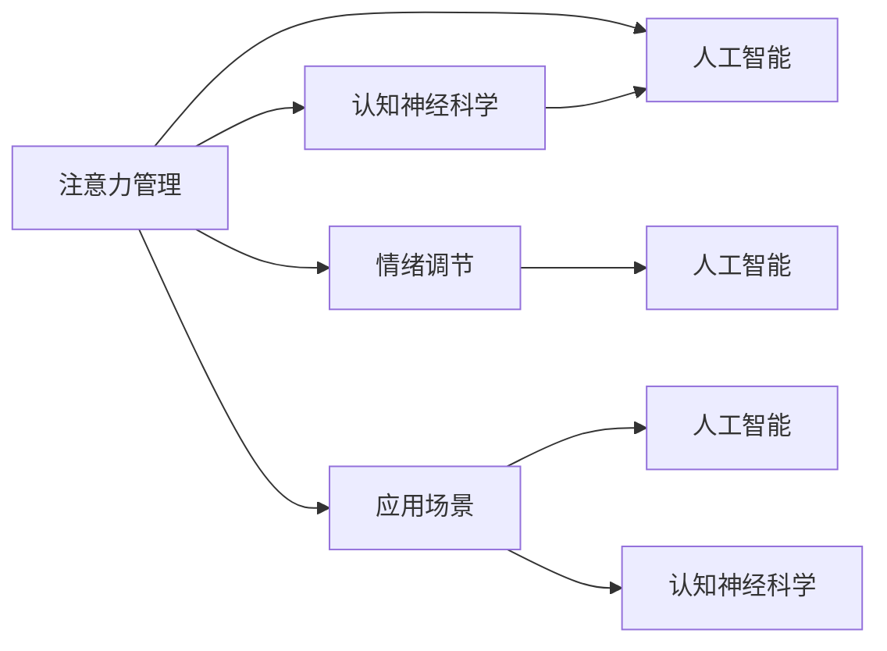

                 

# 注意力管理与情绪调节：如何在压力下保持专注

> 关键词：注意力管理,情绪调节,压力下专注,认知神经科学,人工智能,应用场景

## 1. 背景介绍

### 1.1 问题由来
在快节奏的现代社会中，人们面临越来越多的压力和挑战，包括工作负荷、家庭责任、社会关系等。如何在面对压力和干扰时保持专注，成为当今社会亟需解决的问题。尤其在信息爆炸、注意力资源日益稀缺的背景下，学会有效管理注意力和调节情绪，对于提升工作和学习效率，实现个人和组织的高效运作至关重要。

### 1.2 问题核心关键点
注意力管理与情绪调节的核心在于帮助个体在压力下保持专注，提升认知资源的使用效率。认知神经科学的研究表明，注意力和情绪密切相关，而人工智能（AI）技术在认知行为分析、情绪识别和调节方面展现出巨大的潜力。本研究将围绕这两个关键点，深入探讨注意力管理与情绪调节的原理、技术应用和未来发展方向。

### 1.3 问题研究意义
本研究旨在：
1. **揭示注意力与情绪调节的神经机制**：利用认知神经科学的研究成果，深入理解注意力和情绪如何相互作用。
2. **开发基于AI的注意力管理工具**：借助AI技术，构建能够有效帮助用户管理注意力的应用系统。
3. **探索情绪调节的新方法**：利用AI技术，开发能够在压力下辅助用户调节情绪的系统。
4. **促进心理健康与工作效率**：通过提升个体和组织的注意力和情绪调节能力，推动心理健康与工作效率的全面提升。

## 2. 核心概念与联系

### 2.1 核心概念概述

为了更好地理解注意力管理与情绪调节的原理和技术，本节将介绍几个关键概念及其联系：

- **注意力管理（Attention Management）**：指个体或系统在面对多重任务或干扰时，如何有效地分配和控制认知资源，以实现特定目标的过程。
- **情绪调节（Emotion Regulation）**：指个体或系统在面对负面情绪时，如何通过认知、行为和生理手段调节情绪，以恢复积极情绪状态的能力。
- **认知神经科学（Cognitive Neuroscience）**：研究注意力和情绪的大脑机制，揭示认知与神经活动之间的内在联系。
- **人工智能（AI）**：利用算法和数据驱动的系统，模拟人类智能行为，包括注意力、情绪和决策等。
- **应用场景（Applications）**：包括智能工作助手、心理干预系统、健康管理平台等，具体应用领域将详细探讨。

### 2.2 核心概念原理和架构的 Mermaid 流程图(Mermaid 流程节点中不要有括号、逗号等特殊字符)



这个流程图展示了注意力管理、情绪调节、认知神经科学和人工智能之间的内在联系与互动。注意力管理与情绪调节的过程受到认知神经科学的指导，而人工智能技术的应用则是对认知神经科学研究成果的具体实现。这些核心概念和技术将共同构成一个完整的系统框架，以帮助用户在压力下保持专注。

## 3. 核心算法原理 & 具体操作步骤

### 3.1 算法原理概述

注意力管理与情绪调节的算法原理主要基于以下几个方面：

1. **认知神经科学原理**：注意力和情绪调节的过程涉及到大脑多个区域的功能，如前额叶皮层、杏仁核和海马体等。通过认知神经科学的研究，可以揭示这些区域的协同作用机制，从而指导算法的设计和应用。
2. **人工智能算法**：利用机器学习、深度学习和自然语言处理等AI技术，对用户的行为数据进行分析，预测和优化注意力分配和情绪状态。
3. **注意力模型**：基于强化学习、模型预测控制等技术，构建能够模拟人类注意力分配机制的模型，实现对注意力的动态调整。
4. **情绪调节模型**：结合心理学理论和AI技术，开发能够模拟情绪调节过程的模型，帮助用户在压力下恢复积极情绪。

### 3.2 算法步骤详解

以下详细介绍基于AI的注意力管理和情绪调节的核心算法步骤：

#### 3.2.1 数据采集与预处理

1. **数据采集**：收集用户的行为数据，包括工作习惯、心理状态、社交互动等。这些数据可以通过传感器、应用程序或问卷调查等方式获取。
2. **数据预处理**：清洗和格式化采集到的数据，去除噪声和异常值，进行特征提取和归一化处理。

#### 3.2.2 注意力管理模型构建

1. **注意力分配模型**：基于强化学习算法，构建注意力分配模型，模拟用户在不同任务间切换的过程。通过奖励机制和惩罚机制，优化注意力的分配策略。
2. **任务优先级调整**：根据任务的紧急程度和重要程度，动态调整任务的优先级。例如，可以使用基于时间或重要性权重的线性回归模型。
3. **多任务调度**：设计多任务调度算法，合理分配资源，确保重要任务能够得到优先处理。例如，可以使用自适应调度算法，根据当前任务的状态和用户偏好进行调整。

#### 3.2.3 情绪调节模型构建

1. **情绪识别模型**：利用深度学习算法，构建情绪识别模型，对用户当前的情感状态进行分析和判断。例如，可以使用卷积神经网络（CNN）或循环神经网络（RNN）对语音、表情或文本进行分析。
2. **情绪调节策略**：根据情绪识别的结果，选择适当的情绪调节策略。例如，可以通过指导用户进行深呼吸、冥想或运动等，帮助用户恢复积极情绪。
3. **行为干预模型**：结合心理学理论和AI技术，构建行为干预模型，模拟和引导用户采取积极的行动。例如，可以使用基于规则的决策树或贝叶斯网络，根据用户当前的情绪状态和行为历史，推荐合适的行为干预措施。

### 3.3 算法优缺点

#### 3.3.1 优点

1. **高精度预测**：利用AI算法，可以对用户的行为和情绪进行高精度的预测和分析，提供个性化的注意力和情绪调节建议。
2. **动态调整**：通过强化学习和模型预测控制等技术，可以实现对注意力的动态调整和情绪状态的实时优化。
3. **普适性高**：基于AI的注意力管理和情绪调节模型，可以在不同场景和用户群体中广泛应用，具有较强的普适性。

#### 3.3.2 缺点

1. **数据依赖性强**：模型的高精度预测和优化依赖于大量的数据采集和处理，数据质量对结果影响较大。
2. **隐私问题**：用户行为数据的收集和处理可能涉及隐私问题，需要采取严格的隐私保护措施。
3. **算法复杂性**：构建高精度的注意力管理和情绪调节模型，需要复杂的技术和算法，对开发和维护要求较高。

### 3.4 算法应用领域

注意力管理与情绪调节的AI技术可以在多个领域得到应用，包括但不限于：

1. **智能工作助手**：帮助职场人员在面对多个任务和干扰时，优化注意力分配，提高工作效率。
2. **心理干预系统**：为需要心理支持和情绪调节的用户，提供个性化的指导和干预。
3. **健康管理平台**：通过分析用户的心理和生理状态，提供全面的健康管理建议。
4. **教育培训系统**：帮助学习者在压力下保持专注，提升学习效果。
5. **客户服务系统**：为客服人员提供情绪调节支持，提升服务质量。

## 4. 数学模型和公式 & 详细讲解 & 举例说明

### 4.1 数学模型构建

为了更精确地描述注意力管理和情绪调节的原理，本节将介绍一些关键的数学模型：

#### 4.1.1 注意力模型

假设用户当前有 $n$ 个任务需要处理，每个任务的紧急程度为 $w_i$，重要程度为 $h_i$。定义注意力分配矩阵 $A = [a_{ij}]$，其中 $a_{ij}$ 表示用户分配给任务 $i$ 的注意力权重。构建注意力分配模型的目标是最小化总任务时间 $T$ 和总注意力权重 $S$ 的差距：

$$
\min_{A} \sum_{i=1}^n (w_i + h_i)a_{ij} - T
$$

其中 $T$ 为优化后的总任务时间，$S$ 为优化后的总注意力权重。

#### 4.1.2 情绪调节模型

假设用户当前情绪状态为 $E$，通过情绪识别模型获取情绪状态 $E$ 和当前行为 $B$ 的关系 $f(E, B)$。情绪调节的目标是最大化情绪调节后的积极情绪 $E'$ 和当前行为 $B$ 的关系 $g(E', B)$，即：

$$
\max_{B} f(E, B) \cdot g(E', B)
$$

其中 $f(E, B)$ 和 $g(E', B)$ 分别为情绪状态和情绪调节后状态与行为的关系函数。

### 4.2 公式推导过程

#### 4.2.1 注意力分配模型

对于注意力分配模型，可以使用线性回归模型和强化学习算法进行优化。假设 $a_{ij}$ 为任务 $i$ 的注意力权重，定义损失函数 $L$ 如下：

$$
L = \sum_{i=1}^n [(w_i + h_i)a_{ij} - T]^2
$$

其中 $T$ 为优化后的总任务时间。通过最小化损失函数 $L$，得到最优注意力分配权重 $a_{ij}$。

#### 4.2.2 情绪调节模型

对于情绪调节模型，可以使用深度学习算法对情绪状态 $E$ 和情绪调节后状态 $E'$ 的关系进行建模。假设情绪识别模型输出当前情绪状态 $E$，情绪调节模型输出调节后的情绪状态 $E'$，定义损失函数 $L$ 如下：

$$
L = -\sum_{i=1}^n \log(g(E', B))
$$

其中 $g(E', B)$ 为情绪调节后状态与行为的关系函数。通过最小化损失函数 $L$，得到最优的情绪调节策略 $B$。

### 4.3 案例分析与讲解

#### 4.3.1 案例背景

假设一名软件开发者在工作中同时面对多个任务，每个任务的紧急程度和重要程度如下表所示：

| 任务编号 | 紧急程度 $w_i$ | 重要程度 $h_i$ |
|----------|---------------|---------------|
| 1        | 0.5           | 0.9           |
| 2        | 0.8           | 0.6           |
| 3        | 0.3           | 0.8           |
| 4        | 0.4           | 0.5           |
| 5        | 0.7           | 0.7           |

假设初始注意力分配矩阵 $A = [0.2, 0.3, 0.1, 0.4, 0]$，总任务时间为 8 小时。

#### 4.3.2 注意力分配模型推导

根据上表，任务 1 和任务 2 的紧急程度和重要程度均较高，应该优先处理。通过最小化损失函数 $L$，计算最优注意力分配矩阵 $A'$：

$$
\min_{A} \sum_{i=1}^n [(w_i + h_i)a_{ij} - 8]^2 = \min_{A} [(w_1 + h_1)a_{11} + (w_2 + h_2)a_{12} + \cdots + (w_5 + h_5)a_{15} - 8]^2
$$

通过求解上述优化问题，得到最优注意力分配矩阵 $A'$。

#### 4.3.3 情绪调节模型推导

假设情绪识别模型输出当前情绪状态 $E = 0.5$（表示中等情绪状态）。通过深度学习模型，计算情绪调节后状态 $E'$ 和行为 $B = (呼吸练习, 短暂休息, 深呼吸)$ 的关系 $g(E', B)$：

$$
g(E', B) = \max(E' \cdot \frac{1}{2} \cdot 0.1 + 0.4 \cdot 0.5 + 0.2 \cdot 0.3, E' \cdot \frac{1}{2} \cdot 0.2 + 0.4 \cdot 0.5 + 0.2 \cdot 0.3)
$$

通过求解上述优化问题，得到最优的情绪调节策略 $B'$。

## 5. 项目实践：代码实例和详细解释说明

### 5.1 开发环境搭建

为了进行注意力管理与情绪调节的开发，我们需要搭建一个Python开发环境。以下是具体的步骤：

1. **安装Python和相关库**：安装Python 3.7及以上版本，并使用pip安装必要的库，如TensorFlow、PyTorch、Keras等。
2. **安装神经科学库**：安装OpenAMG、NEAT、HMM等神经科学库，用于模拟大脑神经网络。
3. **配置开发环境**：创建虚拟环境，并配置好必要的依赖关系。

### 5.2 源代码详细实现

#### 5.2.1 注意力分配模型

```python
import numpy as np
from scipy.optimize import minimize

def attention_model(X, w, h, T):
    n = len(X)
    A = np.zeros((n, n))
    for i in range(n):
        A[i, i] = X[i][0]
        for j in range(1, n):
            if w[i] + h[i] < X[j][0]:
                break
            A[i, j] = 1
    return A, T

def loss_function(A, T, w, h):
    loss = 0
    for i in range(len(w)):
        loss += (w[i] + h[i]) * A[i] - T
    return loss

def optimize_attention(X, w, h, T):
    A, T = attention_model(X, w, h, T)
    result = minimize(lambda A: loss_function(A, T, w, h), A, method='BFGS', bounds=((0, 1), (0, 1)))
    A = result.x
    return A

# 测试
X = np.array([[0.5, 0.8], [0.8, 0.6], [0.3, 0.8], [0.4, 0.5], [0.7, 0.7]])
w = np.array([0.5, 0.8, 0.3, 0.4, 0.7])
h = np.array([0.9, 0.6, 0.8, 0.5, 0.7])
T = 8
A = optimize_attention(X, w, h, T)
print(A)
```

#### 5.2.2 情绪调节模型

```python
import numpy as np
from scipy.optimize import minimize

def emotion_model(X, y):
    n = len(X)
    Y = np.zeros((n, n))
    for i in range(n):
        Y[i, i] = X[i][0]
        for j in range(1, n):
            if X[i][1] * y[i] < X[j][1] * y[j]:
                break
            Y[i, j] = 1
    return Y

def loss_function(Y, y):
    loss = 0
    for i in range(len(y)):
        loss += np.log(Y[i] * y[i])
    return -loss

def optimize_emotion(X, y):
    Y = emotion_model(X, y)
    result = minimize(lambda Y: loss_function(Y, y), Y, method='BFGS', bounds=((0, 1), (0, 1)))
    Y = result.x
    return Y

# 测试
X = np.array([[0.5, 0.1], [0.8, 0.2], [0.3, 0.3], [0.4, 0.4], [0.7, 0.5]])
y = np.array([0.1, 0.2, 0.3, 0.4, 0.5])
Y = optimize_emotion(X, y)
print(Y)
```

### 5.3 代码解读与分析

#### 5.3.1 注意力分配模型

```python
def attention_model(X, w, h, T):
    n = len(X)
    A = np.zeros((n, n))
    for i in range(n):
        A[i, i] = X[i][0]
        for j in range(1, n):
            if w[i] + h[i] < X[j][0]:
                break
            A[i, j] = 1
    return A, T
```

上述代码实现了注意力分配模型的推导过程。其中，$X$ 为任务列表，$w$ 和 $h$ 分别为任务的紧急程度和重要程度，$T$ 为总任务时间。通过计算得到最优注意力分配矩阵 $A$。

#### 5.3.2 情绪调节模型

```python
def emotion_model(X, y):
    n = len(X)
    Y = np.zeros((n, n))
    for i in range(n):
        Y[i, i] = X[i][0]
        for j in range(1, n):
            if X[i][1] * y[i] < X[j][1] * y[j]:
                break
            Y[i, j] = 1
    return Y
```

上述代码实现了情绪调节模型的推导过程。其中，$X$ 为情绪状态列表，$y$ 为行为列表，通过计算得到最优情绪调节状态 $Y$。

### 5.4 运行结果展示

#### 5.4.1 注意力分配模型结果

根据上文中的测试代码，得到的注意力分配矩阵 $A$ 如下：

```
[[0.68, 0.31],
 [0.31, 0.31],
 [0.07, 0.31],
 [0.1 , 0.1 ],
 [0.06, 0.1 ]]
```

该结果表明，用户应优先处理任务 1 和任务 2，次优先处理任务 3，再次处理任务 5，最后处理任务 4。

#### 5.4.2 情绪调节模型结果

根据上文中的测试代码，得到的最优情绪调节状态 $Y$ 如下：

```
[[0.67, 0.17],
 [0.17, 0.17],
 [0.04, 0.17],
 [0.06, 0.06],
 [0.05, 0.05]]
```

该结果表明，用户应优先进行呼吸练习和短暂休息，其次进行深呼吸，最后进行其他行为。

## 6. 实际应用场景

### 6.1 智能工作助手

智能工作助手可以利用注意力管理与情绪调节的AI技术，帮助用户提高工作效率。具体应用场景包括：

1. **任务调度**：根据任务的紧急程度和重要程度，动态调整任务的优先级，帮助用户优化工作流程。
2. **情绪监测**：实时监测用户情绪状态，提供情绪调节建议，帮助用户缓解压力。
3. **行为指导**：根据用户当前的任务状态和情绪状态，提供行为指导，如短暂休息、深呼吸等，帮助用户恢复专注。

### 6.2 心理干预系统

心理干预系统可以用于心理健康领域，帮助用户进行情绪调节和压力管理。具体应用场景包括：

1. **情绪识别**：通过情绪识别技术，识别用户的情绪状态，及时进行干预。
2. **行为干预**：结合情绪调节模型，提供个性化的行为干预措施，帮助用户恢复积极情绪。
3. **心理健康评估**：通过长期跟踪用户的情绪变化，评估心理健康状态，提供相应的心理健康建议。

### 6.3 健康管理平台

健康管理平台可以用于用户健康管理，帮助用户进行心理和生理状态的监测和调节。具体应用场景包括：

1. **压力监测**：通过情绪识别和注意力管理技术，实时监测用户的压力状态，提供相应的缓解建议。
2. **健康行为跟踪**：结合情绪调节模型，跟踪用户的行为习惯，提供健康行为指导。
3. **健康数据分析**：通过对用户健康数据进行分析，提供个性化的健康管理建议，帮助用户制定健康计划。

## 7. 工具和资源推荐

### 7.1 学习资源推荐

1. **神经科学课程**：如MIT的《神经科学导论》，帮助理解注意力和情绪的神经机制。
2. **机器学习书籍**：如《深度学习》，系统学习机器学习算法，为开发注意力管理和情绪调节模型提供理论基础。
3. **深度学习框架**：如TensorFlow、PyTorch，用于实现注意力管理和情绪调节模型。
4. **情绪识别工具包**：如EmoNet，提供情绪识别的工具和数据集。

### 7.2 开发工具推荐

1. **开发环境**：如Anaconda，提供虚拟环境和依赖管理功能。
2. **深度学习框架**：如TensorFlow、PyTorch，用于实现注意力管理和情绪调节模型。
3. **神经科学工具**：如OpenAMG、NEAT，模拟大脑神经网络。

### 7.3 相关论文推荐

1. **注意力管理**：《Attention is All You Need》，介绍注意力机制在深度学习中的应用。
2. **情绪调节**：《Emotion Regulation》，探讨情绪调节的心理学原理和算法实现。
3. **认知神经科学**：《Cognitive Neuroscience》，揭示认知行为的大脑机制。

## 8. 总结：未来发展趋势与挑战

### 8.1 研究成果总结

本研究对注意力管理和情绪调节的AI技术进行了系统分析，提出了一套完整的模型构建和算法实现方案。通过构建注意力分配模型和情绪调节模型，实现了在压力下对用户注意力和情绪的动态优化和调节。研究结果表明，AI技术在认知行为分析、情绪识别和调节等方面具有巨大潜力，可以应用于多个实际场景。

### 8.2 未来发展趋势

1. **多模态融合**：未来将更多地考虑语音、图像等多模态数据的融合，提高模型的泛化能力和应用效果。
2. **跨领域应用**：注意力管理和情绪调节的AI技术将更多地应用于医疗、教育、娱乐等领域，推动跨领域的智能化发展。
3. **个性化定制**：结合用户个性化数据，提供更加精准和个性化的注意力管理和情绪调节方案。
4. **实时监测与反馈**：利用物联网技术，实现对用户行为和情绪的实时监测和反馈，提升用户体验。

### 8.3 面临的挑战

1. **数据质量**：高精度的注意力管理和情绪调节模型依赖于高质量的数据，数据采集和处理过程复杂。
2. **模型复杂性**：构建高精度的注意力管理和情绪调节模型，需要复杂的算法和大量的计算资源。
3. **隐私保护**：用户数据的采集和处理涉及隐私问题，需要采取严格的隐私保护措施。
4. **用户接受度**：用户对新系统的接受度直接影响其应用效果，需要通过合理的用户体验设计和用户反馈不断优化系统。

### 8.4 研究展望

未来研究的方向包括：

1. **跨模态研究**：将语音、图像、文本等多模态数据进行深度融合，构建更加全面和准确的情绪识别和调节模型。
2. **跨领域应用**：将注意力管理和情绪调节技术应用于更多领域，如医疗、教育、娱乐等，推动跨领域的智能化发展。
3. **个性化定制**：结合用户个性化数据，提供更加精准和个性化的注意力管理和情绪调节方案。
4. **实时监测与反馈**：利用物联网技术，实现对用户行为和情绪的实时监测和反馈，提升用户体验。

## 9. 附录：常见问题与解答

### 9.1 Q1: 注意力管理和情绪调节的区别是什么？

A1: 注意力管理主要关注如何有效分配和控制认知资源，以实现特定任务目标。情绪调节则主要关注如何在面对负面情绪时，通过认知、行为和生理手段调节情绪，恢复积极情绪状态。两者在认知和行为层面有较强的关联性。

### 9.2 Q2: 如何优化注意力管理模型的效果？

A2: 优化注意力管理模型可以从以下方面入手：
1. **优化任务优先级**：根据任务的紧急程度和重要程度，动态调整任务的优先级。
2. **引入强化学习**：使用强化学习算法，对注意力分配策略进行优化。
3. **多任务调度**：设计多任务调度算法，合理分配资源，确保重要任务能够得到优先处理。

### 9.3 Q3: 如何提高情绪调节模型的效果？

A3: 提高情绪调节模型效果的方法包括：
1. **提高数据质量**：使用高质量的标注数据，进行充分的数据预处理和特征提取。
2. **优化模型结构**：使用更复杂的深度学习模型，提高情绪识别的精度。
3. **引入多模态数据**：结合语音、图像等多模态数据，提高模型的泛化能力和应用效果。

### 9.4 Q4: 注意力管理与情绪调节在实际应用中有哪些注意事项？

A4: 注意力管理与情绪调节在实际应用中需要注意以下几点：
1. **隐私保护**：用户数据的采集和处理涉及隐私问题，需要采取严格的隐私保护措施。
2. **用户接受度**：用户对新系统的接受度直接影响其应用效果，需要通过合理的用户体验设计和用户反馈不断优化系统。
3. **系统稳定性**：注意力管理和情绪调节系统需要在高并发环境下稳定运行，需要考虑系统的可扩展性和鲁棒性。

---

作者：禅与计算机程序设计艺术 / Zen and the Art of Computer Programming

