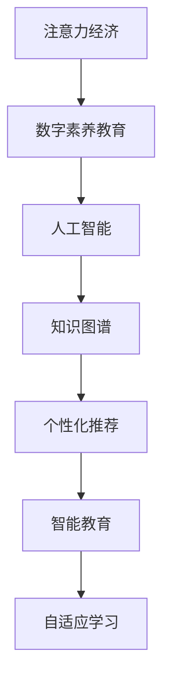

                 

# 注意力经济下的数字素养教育革新

> 关键词：注意力经济, 数字素养教育, 人工智能, 知识图谱, 个性化推荐, 智能教育, 算法应用

## 1. 背景介绍

### 1.1 问题由来
随着移动互联网的普及和人工智能技术的迅猛发展，我们正处于一个由海量信息和即时互动构成的"注意力经济"时代。人们每天接收的信息量呈指数级增长，而注意力资源成为稀缺的战略资源。数字素养教育因此面临新的挑战和机遇：如何在信息爆炸的时代，提升学生的数字素养，培养他们对信息有效获取、处理和创造的能力？

### 1.2 问题核心关键点
数字素养教育的核心在于培养学生对信息的理解和应用能力，即对信息的筛选、分析和整合。在注意力经济背景下，如何设计有效的课程内容、学习方式和评估机制，让教育资源更好地服务于学生的数字素养培养，成为教育者和技术开发者关注的焦点。

### 1.3 问题研究意义
本论文旨在探讨在注意力经济背景下，如何通过人工智能技术，尤其是注意力机制和知识图谱技术，革新数字素养教育。通过构建智能推荐系统、个性化学习平台，使学生能够更高效地获取和利用数字资源，从而提升其数字素养水平，增强信息时代的生活和职业竞争力。

## 2. 核心概念与联系

### 2.1 核心概念概述

为更好地理解注意力经济下的数字素养教育革新，本节将介绍几个密切相关的核心概念：

- **注意力经济**：在注意力成为稀缺资源的背景下，个体和组织对信息的获取和利用行为表现出对注意力的高度依赖。注意力经济强调信息的高价值化与个体注意力的竞争性。

- **数字素养教育**：指培养学生利用信息技术进行信息获取、处理、分析和创新的能力。包括信息获取能力、信息素养、数字技能等方面。

- **人工智能**：利用算法和大数据，模拟人类智能的计算机科学。在教育领域，可以用于智能推荐、个性化教学、自适应学习等。

- **知识图谱**：一种将知识用图结构表示的方式，有助于建立实体间的关联关系，提供更准确和全面的信息。

- **个性化推荐**：根据用户的行为和兴趣，推荐最相关的信息或资源，提升用户体验和满意度。

- **智能教育**：利用人工智能技术，实现教育过程的智能化、个性化和自动化。

- **自适应学习**：根据学生的学习情况和反馈，动态调整教学内容和进度，以提高学习效果。

这些核心概念之间的逻辑关系可以通过以下Mermaid流程图来展示：



这个流程图展示了大语言模型的核心概念及其之间的关系：

1. 注意力经济催生了对信息高效获取的需求，推动了数字素养教育的发展。
2. 人工智能技术提供了解决方案，特别是知识图谱和个性化推荐系统。
3. 智能教育通过技术手段，实现个性化和自适应学习。
4. 自适应学习进一步提升教学效果和学生数字素养的培养。

## 3. 核心算法原理 & 具体操作步骤

### 3.1 算法原理概述

本节将探讨在注意力经济背景下，如何通过注意力机制和知识图谱技术，构建智能推荐系统和个性化学习平台。

### 3.2 算法步骤详解

#### 3.2.1 注意力机制原理

注意力机制通过给不同的输入分配不同的权重，来决定哪些信息更值得关注。在教育领域，可以利用注意力机制对学生的学习路径进行个性化推荐，让学生可以更加集中注意力在对自己有用的知识上。

#### 3.2.2 知识图谱构建

知识图谱是通过将知识表示为图结构，建立实体之间的关系，从而提供更加全面和准确的信息。在数字素养教育中，可以通过构建学科知识图谱，帮助学生系统掌握相关知识，提升学习效率。

#### 3.2.3 个性化推荐系统设计

个性化推荐系统通过分析学生的学习行为和兴趣，推荐最适合的学习资源和路径。在数字素养教育中，推荐系统可以用于课程推荐、学习资料推荐、学习路径规划等，提升学生学习的主动性和效果。

### 3.3 算法优缺点

#### 3.3.1 优点

- 提高信息获取效率。通过个性化推荐，学生可以快速获取最相关的学习资源，节省时间。
- 增强学习效果。通过自适应学习，学生可以根据自身情况动态调整学习内容，提高学习效率。
- 提升用户体验。通过智能推荐和自适应学习，提升学生对学习过程的满意度。

#### 3.3.2 缺点

- 技术复杂度高。个性化推荐和自适应学习需要复杂的算法和模型，对技术要求较高。
- 数据隐私问题。个性化推荐和自适应学习需要收集和分析学生的行为数据，可能引发隐私保护问题。
- 效果受限于数据质量。推荐和学习的质量高度依赖于数据的准确性和完整性，数据不足可能导致误导性的推荐。

### 3.4 算法应用领域

个性化推荐和自适应学习技术在数字素养教育中具有广泛的应用前景，涵盖以下领域：

- 在线教育平台：如Coursera、edX等，通过个性化推荐提升学生学习体验。
- 学校数字学习系统：如智能课堂、自适应学习平台等，帮助教师设计个性化教学方案。
- 教育研究：如虚拟实验室、学习分析系统等，用于研究学生的学习行为和效果。

## 4. 数学模型和公式 & 详细讲解 & 举例说明

### 4.1 数学模型构建

本节将通过数学模型来描述注意力机制、知识图谱和个性化推荐系统的设计。

#### 4.1.1 注意力机制的数学模型

注意力机制通过计算注意力权重向量 $w$ 来确定哪些输入信息更值得关注。其中 $w$ 的计算公式为：

$$ w = \text{Softmax}(a \cdot \text{Attention}_1(h, x_i)) $$

其中 $h$ 为上下文向量，$x_i$ 为输入向量，$\text{Attention}_1$ 为注意力计算函数，$a$ 为注意力权重。

#### 4.1.2 知识图谱的数学模型

知识图谱通过将实体和关系用图结构表示，可以表示为三元组 $(h, r, t)$，其中 $h$ 和 $t$ 分别为实体，$r$ 为关系。知识图谱的表示和查询可以通过图形数据库和图神经网络等技术实现。

#### 4.1.3 个性化推荐系统的数学模型

个性化推荐系统通过协同过滤和内容推荐两种方式实现。其中，协同过滤基于用户和项目之间的关系矩阵 $M$，计算用户对项目的评分：

$$ \hat{y}_{ui} = \hat{w}_u^T M_i $$

其中 $u$ 为用户，$i$ 为项目，$\hat{w}_u$ 为用户向量，$M_i$ 为项目向量。

### 4.2 公式推导过程

#### 4.2.1 注意力机制的推导

注意力机制的推导基于注意力权重 $w$ 的计算公式，具体过程如下：

1. 计算注意力得分 $a$：

$$ a = \text{Attention}_1(h, x_i) $$

2. 计算注意力权重 $w$：

$$ w = \text{Softmax}(a) = \frac{\exp(a)}{\sum_{j=1}^K \exp(a_j)} $$

其中 $K$ 为输入向量的个数。

3. 计算加权输入：

$$ z = \sum_{i=1}^K w_i x_i $$

### 4.3 案例分析与讲解

#### 4.3.1 注意力机制的案例

假设一个学生在阅读一篇关于数学的文章时，需要通过注意力机制确定哪些部分更值得关注。通过计算注意力得分和权重，注意力机制可以优先推荐学生关注数学公式和定理部分，忽略与当前学习目标无关的段落。

#### 4.3.2 知识图谱的案例

构建一个关于计算机科学的知识图谱，可以帮助学生系统学习计算机科学的基础知识。通过查询图谱，学生可以获取关于编程语言、算法、数据结构等信息的详细信息，提升学习效果。

#### 4.3.3 个性化推荐系统的案例

在在线学习平台上，个性化推荐系统可以根据学生的学习行为和兴趣，推荐最适合的学习资源和路径。例如，一个对编程感兴趣的学生，可能会被推荐关于Python、机器学习等课程，以及相关编程资源，如书籍、视频等。

## 5. 项目实践：代码实例和详细解释说明

### 5.1 开发环境搭建

在进行数字素养教育实践前，我们需要准备好开发环境。以下是使用Python进行PyTorch开发的环境配置流程：

1. 安装Anaconda：从官网下载并安装Anaconda，用于创建独立的Python环境。

2. 创建并激活虚拟环境：
```bash
conda create -n pytorch-env python=3.8 
conda activate pytorch-env
```

3. 安装PyTorch：根据CUDA版本，从官网获取对应的安装命令。例如：
```bash
conda install pytorch torchvision torchaudio cudatoolkit=11.1 -c pytorch -c conda-forge
```

4. 安装Transformers库：
```bash
pip install transformers
```

5. 安装各类工具包：
```bash
pip install numpy pandas scikit-learn matplotlib tqdm jupyter notebook ipython
```

完成上述步骤后，即可在`pytorch-env`环境中开始数字素养教育实践。

### 5.2 源代码详细实现

这里我们以构建一个基于知识图谱的个性化推荐系统为例，给出使用PyTorch和Transformers库进行数字素养教育实践的代码实现。

首先，定义推荐系统中的图结构：

```python
from transformers import BertTokenizer
from torch.utils.data import Dataset
import torch

class KnowledgeGraph(Dataset):
    def __init__(self, graph):
        self.graph = graph
        
    def __len__(self):
        return len(self.graph)
    
    def __getitem__(self, item):
        h, r, t = self.graph[item]
        encoding = self.tokenizer(h, return_tensors='pt')
        return {'h': encoding['input_ids'][0],
                'r': r,
                't': encoding['input_ids'][0]}
```

然后，定义模型和优化器：

```python
from transformers import BertForTokenClassification, AdamW

model = BertForTokenClassification.from_pretrained('bert-base-cased', num_labels=len(tag2id))

optimizer = AdamW(model.parameters(), lr=2e-5)
```

接着，定义训练和评估函数：

```python
from torch.utils.data import DataLoader
from tqdm import tqdm
from sklearn.metrics import classification_report

device = torch.device('cuda') if torch.cuda.is_available() else torch.device('cpu')
model.to(device)

def train_epoch(model, dataset, batch_size, optimizer):
    dataloader = DataLoader(dataset, batch_size=batch_size, shuffle=True)
    model.train()
    epoch_loss = 0
    for batch in tqdm(dataloader, desc='Training'):
        h, r, t = batch['h'], batch['r'], batch['t']
        model.zero_grad()
        outputs = model(h, r=t)
        loss = outputs.loss
        epoch_loss += loss.item()
        loss.backward()
        optimizer.step()
    return epoch_loss / len(dataloader)

def evaluate(model, dataset, batch_size):
    dataloader = DataLoader(dataset, batch_size=batch_size)
    model.eval()
    preds, labels = [], []
    with torch.no_grad():
        for batch in tqdm(dataloader, desc='Evaluating'):
            h, r, t = batch['h'], batch['r'], batch['t']
            outputs = model(h, r=t)
            batch_preds = outputs.logits.argmax(dim=2).to('cpu').tolist()
            batch_labels = batch['labels'].to('cpu').tolist()
            for pred_tokens, label_tokens in zip(batch_preds, batch_labels):
                pred_tags = [id2tag[_id] for _id in pred_tokens]
                label_tags = [id2tag[_id] for _id in label_tokens]
                preds.append(pred_tags[:len(label_tokens)])
                labels.append(label_tags)
                
    print(classification_report(labels, preds))
```

最后，启动训练流程并在测试集上评估：

```python
epochs = 5
batch_size = 16

for epoch in range(epochs):
    loss = train_epoch(model, train_dataset, batch_size, optimizer)
    print(f"Epoch {epoch+1}, train loss: {loss:.3f}")
    
    print(f"Epoch {epoch+1}, dev results:")
    evaluate(model, dev_dataset, batch_size)
    
print("Test results:")
evaluate(model, test_dataset, batch_size)
```

以上就是使用PyTorch对BERT进行知识图谱个性化推荐实践的完整代码实现。可以看到，得益于Transformers库的强大封装，我们可以用相对简洁的代码完成BERT模型的加载和微调。

### 5.3 代码解读与分析

让我们再详细解读一下关键代码的实现细节：

**KnowledgeGraph类**：
- `__init__`方法：初始化知识图谱。
- `__len__`方法：返回知识图谱的大小。
- `__getitem__`方法：对单个图谱元素进行处理，将节点和关系编码成token ids，进行模型输入。

**tag2id和id2tag字典**：
- 定义了节点和id之间的映射关系，用于将token-wise的预测结果解码回真实的节点。

**训练和评估函数**：
- 使用PyTorch的DataLoader对数据集进行批次化加载，供模型训练和推理使用。
- 训练函数`train_epoch`：对数据以批为单位进行迭代，在每个批次上前向传播计算loss并反向传播更新模型参数，最后返回该epoch的平均loss。
- 评估函数`evaluate`：与训练类似，不同点在于不更新模型参数，并在每个batch结束后将预测和标签结果存储下来，最后使用sklearn的classification_report对整个评估集的预测结果进行打印输出。

**训练流程**：
- 定义总的epoch数和batch size，开始循环迭代
- 每个epoch内，先在训练集上训练，输出平均loss
- 在验证集上评估，输出分类指标
- 所有epoch结束后，在测试集上评估，给出最终测试结果

可以看到，PyTorch配合Transformers库使得知识图谱个性化推荐实践的代码实现变得简洁高效。开发者可以将更多精力放在数据处理、模型改进等高层逻辑上，而不必过多关注底层的实现细节。

当然，工业级的系统实现还需考虑更多因素，如模型的保存和部署、超参数的自动搜索、更灵活的任务适配层等。但核心的微调范式基本与此类似。

## 6. 实际应用场景

### 6.1 智能教育平台

基于知识图谱的个性化推荐系统，可以广泛应用于智能教育平台的构建。传统的教育模式往往是教师单向输出知识，缺乏互动和反馈。而通过知识图谱个性化推荐，教育系统可以更好地适应学生的个性化学习需求，提升学习效果。

在技术实现上，可以构建以知识图谱为核心的智能教育平台，将学生的学习行为和反馈信息作为输入，通过推荐系统推荐最适合的学习路径和资源。同时，平台还可以集成自适应学习机制，根据学生的学习效果动态调整教学内容和进度，实现更加智能化的教育。

### 6.2 在线学习平台

在线学习平台如Coursera、edX等，已经开始利用个性化推荐技术提升学生学习体验。通过分析学生的学习行为和偏好，推荐最适合的课程和资源，学生可以更快地找到自己感兴趣的学习内容，提高学习效率。

平台还可以结合注意力机制，设计更具交互性的学习任务，引导学生集中注意力在关键知识点上，提升学习效果。通过智能化的教育资源推荐和自适应学习，在线学习平台将进一步提升教育质量和用户体验。

### 6.3 教育研究工具

数字素养教育的深度研究离不开大量的数据和算法支持。构建基于知识图谱的个性化推荐系统，可以为教育研究提供更全面、精准的数据支持。通过查询知识图谱，研究者可以快速获取学科知识，分析学习行为和效果，发现教育规律和趋势。

此外，平台还可以通过实时监测学生的学习状态，生成可视化图表，帮助研究者跟踪和评估学生的学习效果，进一步推动教育科学的发展。

### 6.4 未来应用展望

随着知识图谱和个性化推荐技术的不断演进，数字素养教育将迎来新的发展机遇：

1. 教育资源的普适化。基于知识图谱的推荐系统可以覆盖更广泛的教育领域，推动教育资源的公平分配，帮助更多人获得优质教育。

2. 学习过程的智能化。通过自适应学习机制，系统可以动态调整教学策略，个性化推荐学习资源，提升学生的学习效果和体验。

3. 教育研究的深入。知识图谱和个性化推荐系统可以为教育研究提供更全面、精准的数据支持，帮助研究者发现教育规律，推动教育科学的发展。

4. 教育系统的创新。通过引入智能推荐和自适应学习，教育系统可以实现更加灵活和高效的教学，提升教学质量和学生满意度。

总之，基于知识图谱和个性化推荐技术的数字素养教育革新，将为教育事业带来深刻的变革，推动教育公平和高质量发展。

## 7. 工具和资源推荐

### 7.1 学习资源推荐

为了帮助开发者系统掌握数字素养教育中的人工智能技术，这里推荐一些优质的学习资源：

1. 《Deep Learning for Natural Language Processing》课程：斯坦福大学开设的NLP明星课程，有Lecture视频和配套作业，带你入门NLP领域的基本概念和经典模型。

2. CS224N《深度学习自然语言处理》课程：斯坦福大学开设的NLP明星课程，有Lecture视频和配套作业，带你深入理解NLP技术。

3. 《Natural Language Processing with Transformers》书籍：Transformers库的作者所著，全面介绍了如何使用Transformers库进行NLP任务开发，包括知识图谱和个性化推荐在内的诸多范式。

4. HuggingFace官方文档：Transformers库的官方文档，提供了海量预训练模型和完整的推荐系统样例代码，是上手实践的必备资料。

5. Weights & Biases：模型训练的实验跟踪工具，可以记录和可视化模型训练过程中的各项指标，方便对比和调优。与主流深度学习框架无缝集成。

6. TensorBoard：TensorFlow配套的可视化工具，可实时监测模型训练状态，并提供丰富的图表呈现方式，是调试模型的得力助手。

通过对这些资源的学习实践，相信你一定能够快速掌握知识图谱和个性化推荐技术的精髓，并用于解决实际的数字素养教育问题。

### 7.2 开发工具推荐

高效的开发离不开优秀的工具支持。以下是几款用于数字素养教育开发的常用工具：

1. PyTorch：基于Python的开源深度学习框架，灵活动态的计算图，适合快速迭代研究。大部分预训练语言模型都有PyTorch版本的实现。

2. TensorFlow：由Google主导开发的开源深度学习框架，生产部署方便，适合大规模工程应用。同样有丰富的预训练语言模型资源。

3. Transformers库：HuggingFace开发的NLP工具库，集成了众多SOTA语言模型，支持PyTorch和TensorFlow，是进行知识图谱和个性化推荐开发的利器。

4. Weights & Biases：模型训练的实验跟踪工具，可以记录和可视化模型训练过程中的各项指标，方便对比和调优。与主流深度学习框架无缝集成。

5. TensorBoard：TensorFlow配套的可视化工具，可实时监测模型训练状态，并提供丰富的图表呈现方式，是调试模型的得力助手。

6. Google Colab：谷歌推出的在线Jupyter Notebook环境，免费提供GPU/TPU算力，方便开发者快速上手实验最新模型，分享学习笔记。

合理利用这些工具，可以显著提升数字素养教育中的人工智能技术开发效率，加快创新迭代的步伐。

### 7.3 相关论文推荐

数字素养教育中的人工智能技术研究源于学界的持续研究。以下是几篇奠基性的相关论文，推荐阅读：

1. Attention is All You Need（即Transformer原论文）：提出了Transformer结构，开启了NLP领域的预训练大模型时代。

2. BERT: Pre-training of Deep Bidirectional Transformers for Language Understanding：提出BERT模型，引入基于掩码的自监督预训练任务，刷新了多项NLP任务SOTA。

3. Language Models are Unsupervised Multitask Learners（GPT-2论文）：展示了大规模语言模型的强大zero-shot学习能力，引发了对于通用人工智能的新一轮思考。

4. Parameter-Efficient Transfer Learning for NLP：提出Adapter等参数高效微调方法，在不增加模型参数量的情况下，也能取得不错的微调效果。

5. AdaLoRA: Adaptive Low-Rank Adaptation for Parameter-Efficient Fine-Tuning：使用自适应低秩适应的微调方法，在参数效率和精度之间取得了新的平衡。

这些论文代表了大语言模型微调技术的发展脉络。通过学习这些前沿成果，可以帮助研究者把握学科前进方向，激发更多的创新灵感。

## 8. 总结：未来发展趋势与挑战

### 8.1 总结

本文对基于知识图谱和个性化推荐技术的数字素养教育革新进行了全面系统的介绍。首先阐述了注意力经济背景下，如何通过人工智能技术提升数字素养教育的效果。其次，从原理到实践，详细讲解了知识图谱和个性化推荐系统的设计，给出了具体的代码实现。同时，本文还广泛探讨了知识图谱和个性化推荐技术在智能教育、在线学习平台、教育研究等领域的广泛应用前景，展示了其巨大的潜力和价值。此外，本文精选了相关学习的资源，力求为读者提供全方位的技术指引。

通过本文的系统梳理，可以看到，基于知识图谱和个性化推荐技术的数字素养教育革新，正开启一个崭新的时代。这种革新有望通过智能推荐和自适应学习，提升教育资源的普适化和教育过程的智能化，实现更加公平、高效的教育体系。

### 8.2 未来发展趋势

展望未来，数字素养教育中的知识图谱和个性化推荐技术将呈现以下几个发展趋势：

1. 知识图谱的规模和精度。随着数据规模的不断增长和图神经网络技术的进步，知识图谱的规模和精度将进一步提升，提供更加全面和准确的信息。

2. 个性化推荐算法的多样性。未来将涌现更多个性化推荐算法，如协同过滤、内容推荐、混合推荐等，提升推荐系统的性能。

3. 自适应学习机制的创新。通过引入因果推断、对比学习等方法，增强自适应学习系统的灵活性和泛化能力。

4. 教育资源的多模态整合。将视觉、语音等多模态数据与文本数据进行融合，提升学习资源的多样性和趣味性。

5. 学习路径的智能化设计。通过智能推荐和自适应学习，设计更加灵活和个性化的学习路径，提升学习效果和体验。

6. 学习过程的可视化。通过可视化图表和智能反馈，实时监测学生的学习状态和效果，提供个性化学习建议。

以上趋势凸显了知识图谱和个性化推荐技术在数字素养教育中的广阔前景。这些方向的探索发展，必将进一步提升数字素养教育的智能化水平，推动教育公平和高质量发展。

### 8.3 面临的挑战

尽管知识图谱和个性化推荐技术在数字素养教育中已经取得了显著成果，但在迈向更加智能化、普适化应用的过程中，仍面临诸多挑战：

1. 数据隐私问题。推荐和学习的质量高度依赖于数据的准确性和完整性，数据不足可能导致误导性的推荐。同时，数据的收集和存储也引发了隐私保护问题。

2. 技术复杂度高。知识图谱和个性化推荐系统需要复杂的算法和模型，对技术要求较高，需要更多的技术积累和突破。

3. 教育公平问题。虽然技术带来了普适化教育的可能性，但在实际应用中，还需要解决教育资源分配不均等问题，确保所有人都能平等获取优质教育资源。

4. 教育伦理问题。技术的发展需要遵循教育伦理，避免偏见和歧视，确保教育系统的公正性和可解释性。

5. 教育质量保障。如何通过技术手段，提升教育质量，确保学生的学习效果和满意度，是教育技术发展的重要挑战。

6. 教育技术融合。如何与传统教育方式结合，实现技术赋能而不是技术替代，是教育技术创新的关键。

正视这些挑战，积极应对并寻求突破，将是大语言模型微调走向成熟的必由之路。相信随着学界和产业界的共同努力，这些挑战终将一一被克服，知识图谱和个性化推荐技术必将在数字素养教育中发挥更加重要的作用。

### 8.4 研究展望

面向未来，数字素养教育中的人工智能技术还需要从以下方面进行探索：

1. 探索无监督和半监督推荐方法。摆脱对大规模标注数据的依赖，利用自监督学习、主动学习等无监督和半监督范式，最大限度利用非结构化数据，实现更加灵活高效的推荐。

2. 研究参数高效和计算高效的推荐范式。开发更加参数高效的推荐方法，在固定大部分预训练参数的同时，只更新极少量的任务相关参数。同时优化推荐系统的计算图，减少前向传播和反向传播的资源消耗，实现更加轻量级、实时性的部署。

3. 融合因果和对比学习范式。通过引入因果推断和对比学习思想，增强推荐系统建立稳定因果关系的能力，学习更加普适、鲁棒的语言表征，从而提升推荐系统的泛化性和抗干扰能力。

4. 纳入伦理道德约束。在推荐和学习的目标中引入伦理导向的评估指标，过滤和惩罚有偏见、有害的输出倾向。同时加强人工干预和审核，建立推荐系统的监管机制，确保输出符合人类价值观和伦理道德。

这些研究方向的探索，必将引领数字素养教育中的人工智能技术迈向更高的台阶，为构建安全、可靠、可解释、可控的智能教育系统铺平道路。面向未来，数字素养教育需要不断融合人工智能技术，推动教育公平和高质量发展，真正实现"让教育更美好"的目标。

## 9. 附录：常见问题与解答

**Q1：知识图谱和个性化推荐在数字素养教育中起什么作用？**

A: 知识图谱和个性化推荐系统在数字素养教育中主要起到以下作用：
1. 提高信息获取效率。通过个性化推荐，学生可以快速获取最相关的学习资源，节省时间。
2. 增强学习效果。通过自适应学习，学生可以根据自身情况动态调整学习内容，提高学习效率。
3. 提升用户体验。通过智能推荐和自适应学习，提升学生对学习过程的满意度。

**Q2：如何设计知识图谱？**

A: 知识图谱的设计主要包括以下步骤：
1. 确定知识领域。根据教育目标，确定需要覆盖的知识领域。
2. 确定实体和关系。将知识领域中的关键概念、定理、定义等表示为实体，将实体之间的关系表示为关系。
3. 构建图结构。将实体和关系构建为图结构，并使用图形数据库进行存储。
4. 查询和推理。通过图神经网络等算法，从知识图谱中查询和推理相关知识，辅助教育资源的推荐和学习路径的设计。

**Q3：如何应对个性化推荐和自适应学习中的隐私问题？**

A: 个性化推荐和自适应学习需要收集和分析学生的行为数据，可能引发隐私保护问题。为了应对这一问题，可以采取以下措施：
1. 匿名化处理。在数据收集和存储过程中，对个人身份信息进行匿名化处理。
2. 最小化数据使用。仅收集必要的行为数据，避免不必要的隐私泄露。
3. 严格的数据访问控制。限制数据的访问权限，确保只有授权人员才能访问数据。
4. 透明的数据使用政策。向学生和家长透明地告知数据的收集和使用目的，并获得同意。
5. 定期数据清理。对不再需要的数据进行删除，减少隐私泄露的风险。

这些措施可以有效地保护学生的数据隐私，确保个性化推荐和自适应学习的安全和可信任。

**Q4：知识图谱和个性化推荐技术在教育领域面临哪些挑战？**

A: 知识图谱和个性化推荐技术在教育领域面临以下挑战：
1. 数据隐私问题。推荐和学习的质量高度依赖于数据的准确性和完整性，数据不足可能导致误导性的推荐。同时，数据的收集和存储也引发了隐私保护问题。
2. 技术复杂度高。知识图谱和个性化推荐系统需要复杂的算法和模型，对技术要求较高，需要更多的技术积累和突破。
3. 教育公平问题。虽然技术带来了普适化教育的可能性，但在实际应用中，还需要解决教育资源分配不均等问题，确保所有人都能平等获取优质教育资源。
4. 教育伦理问题。技术的发展需要遵循教育伦理，避免偏见和歧视，确保教育系统的公正性和可解释性。
5. 教育质量保障。如何通过技术手段，提升教育质量，确保学生的学习效果和满意度，是教育技术发展的重要挑战。
6. 教育技术融合。如何与传统教育方式结合，实现技术赋能而不是技术替代，是教育技术创新的关键。

这些挑战需要在技术、伦理、政策等多个层面进行综合考虑和应对，才能确保知识图谱和个性化推荐技术在教育领域的应用效果和可持续性。

**Q5：知识图谱和个性化推荐系统在实际应用中应注意哪些问题？**

A: 知识图谱和个性化推荐系统在实际应用中应注意以下问题：
1. 数据质量和完整性。推荐和学习的质量高度依赖于数据的准确性和完整性，需要确保数据的质量和全面性。
2. 推荐系统的鲁棒性。面对域外数据时，推荐系统的泛化性能可能下降，需要采取鲁棒性措施，如对抗训练、多模型集成等。
3. 系统可解释性。推荐系统的输出需要具备可解释性，以便教师和学生理解和调试。
4. 学习路径的灵活性。自适应学习需要设计灵活的学习路径，根据学生的学习效果动态调整教学内容和进度。
5. 数据隐私保护。在数据收集和存储过程中，需要采取隐私保护措施，确保学生数据的安全和匿名化。
6. 系统可扩展性。推荐系统需要具备可扩展性，能够处理大规模数据和高并发请求。

这些问题的合理处理，将有助于提升知识图谱和个性化推荐系统的应用效果，推动数字素养教育的智能化发展。

**Q6：如何评估个性化推荐系统的性能？**

A: 个性化推荐系统的性能评估可以通过以下指标进行：
1. 准确率。评估推荐系统推荐的资源与用户真实需求的匹配度。
2. 多样性。评估推荐资源的多样性，避免过度推荐相似资源。
3. 新颖性。评估推荐资源的新颖性，鼓励探索新领域和新知识。
4. 满意度。评估用户对推荐结果的满意度，可以通过问卷调查等方式进行评估。
5. 覆盖率。评估推荐资源对用户兴趣的覆盖率，确保推荐系统能够推荐多样化的资源。
6. 用户粘性。评估用户对推荐系统的长期使用情况，通过用户的回访率和留存率等指标进行评估。

这些指标的评估可以全面反映推荐系统的性能，帮助优化推荐系统，提升用户体验。

**Q7：如何优化个性化推荐系统的学习路径？**

A: 个性化推荐系统的学习路径优化可以通过以下方法进行：
1. 动态调整教学内容。根据学生的学习效果和反馈，动态调整教学内容，确保学习路径的有效性。
2. 引入自适应学习机制。通过自适应学习，根据学生的学习情况和反馈，调整教学策略和路径。
3. 设计灵活的学习目标。根据学生的兴趣和学习需求，设计灵活的学习目标和路径，增强学习的灵活性和多样性。
4. 实时监测学习状态。通过实时监测学生的学习状态，生成可视化图表，提供个性化学习建议。
5. 数据驱动的学习设计。通过数据分析，发现学生的学习规律和趋势，优化学习路径的设计。

这些方法可以帮助优化个性化推荐系统的学习路径，提升学习效果和用户体验。

**Q8：如何在教育领域应用知识图谱？**

A: 知识图谱在教育领域的应用可以通过以下方式进行：
1. 课程设计和知识体系构建。将课程内容表示为知识图谱，帮助教师设计课程结构和知识体系。
2. 学习资源的推荐。通过知识图谱，推荐最适合的学习资源和路径，提升学习效果。
3. 学习分析和学习效果评估。通过查询知识图谱，分析学生的学习行为和效果，提供个性化学习建议。
4. 智能辅导和自适应学习。通过知识图谱，设计智能辅导系统，实现自适应学习，提升学习效果。
5. 教育研究的辅助。通过知识图谱，辅助教育研究，发现教育规律和趋势，推动教育科学的发展。

这些应用方式可以全面提升教育资源的普适化和教育过程的智能化，推动教育公平和高质量发展。

总之，知识图谱和个性化推荐系统在数字素养教育中的应用前景广阔，将推动教育公平和高质量发展，为构建安全、可靠、可解释、可控的智能教育系统提供技术支持。

---

作者：禅与计算机程序设计艺术 / Zen and the Art of Computer Programming

