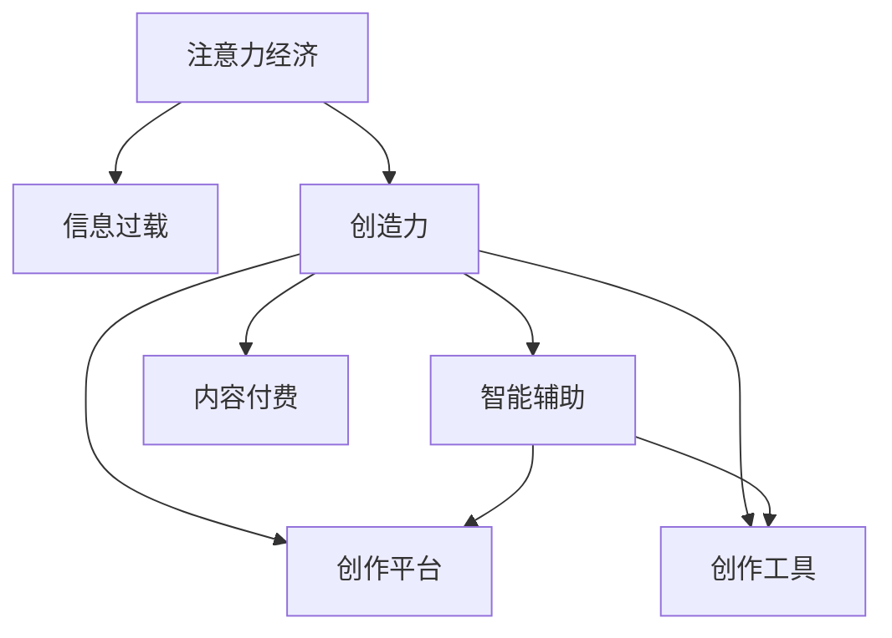

                 

# 注意力经济与个人创造力的关系

## 1. 背景介绍

### 1.1 问题由来

在互联网时代，注意力成为了一种稀缺资源。一方面，用户每天面对海量的信息流，需要花费大量时间进行筛选和分类，才能接触到真正有用的内容；另一方面，内容创作者也面临着用户注意力的极大挑战，必须想方设法吸引和保持用户的注意力，才能获得传播和收益。这种以注意力为核心的经济模式，被称为"注意力经济"。

随着注意力经济的发展，如何提高个人创造力的产出，成为了一个重要议题。个人创造力包括了创作、设计、编程、写作等各种类型的产出，是推动社会进步和创新的关键力量。然而，高强度的注意力负荷和信息过载，可能导致个人创造力下降，甚至产生创作瓶颈。

因此，本文将探讨注意力经济与个人创造力的关系，分析在信息过载和注意力稀缺的双重压力下，如何提升个人创造力，实现高效创作。

### 1.2 问题核心关键点

1. **注意力负荷与创意生成**：注意力负荷过高可能导致思维固化，创意生成能力下降。如何降低注意力负荷，保持思维的灵活性，是提升创造力的关键。
2. **信息过载与信息筛选**：信息过载可能导致信息混淆，难以区分重要和次要信息。如何高效筛选信息，提取关键要素，是保持高效创作的重要手段。
3. **注意力经济与内容传播**：注意力经济要求内容创作者不断创新，吸引用户注意力，才能实现内容的传播和收益。如何把握用户需求，提升内容传播效果，是创作者必须面对的问题。
4. **创作平台与创作工具**：创作平台和创作工具的智能化和自动化水平，直接影响创作效率和创造力的发挥。如何优化创作平台和工具，提升创作体验，是提升个人创造力的重要途径。

### 1.3 问题研究意义

研究注意力经济与个人创造力的关系，对于提升信息时代的内容创作质量和效率，推动人工智能技术与人类创造力的深度融合，具有重要意义：

1. **优化内容创作**：通过分析注意力负荷和信息过载对创作的影响，提出优化策略，帮助创作者提高创作效率，提升作品质量。
2. **促进内容传播**：分析注意力经济规律，指导创作者制定符合用户心理的内容策略，实现更有效的内容传播和收益。
3. **推动创新发展**：研究人工智能如何辅助人类创作，探索AI与人类创造力结合的新模式，推动创新发展的持续性。
4. **保障创作权益**：分析注意力经济中创作者与用户的关系，制定合理的内容付费机制，保障创作者权益，提升创作积极性。
5. **促进社会进步**：通过提升创作质量和社会影响，促进文化繁荣和科技发展，推动社会进步和文明进步。

## 2. 核心概念与联系

### 2.1 核心概念概述

为更好地理解注意力经济与个人创造力的关系，本节将介绍几个密切相关的核心概念：

- **注意力经济**：以注意力为核心的经济模式，主要通过吸引和保持用户注意力，实现内容的传播和收益。
- **信息过载**：用户每天面对的信息量远远超出了个人处理能力，导致注意力的分散，影响决策和行为。
- **创造力**：指个人或群体创造出新颖、有价值、有独特性的产品或服务的智力活动。
- **创作平台**：指提供内容创作、编辑、发布、传播的在线平台，如博客、社交媒体、视频网站等。
- **创作工具**：指辅助创作者进行内容创作的软件工具，如文本编辑器、绘图工具、编程IDE等。
- **智能辅助**：指通过人工智能技术，辅助创作者进行信息筛选、内容创作、数据分析等工作，提升创作效率和质量。
- **内容付费**：指用户为优质内容付费，实现创作者与用户之间价值交换的经济模式。

这些核心概念之间的逻辑关系可以通过以下Mermaid流程图来展示：



这个流程图展示了大语言模型微调的核心概念及其之间的关系：

1. 注意力经济通过吸引用户注意力，实现内容的传播和收益。
2. 信息过载是注意力经济面临的主要挑战，可能导致创作效率下降。
3. 创造力是内容创作的核心动力，受到注意力负荷和信息过载的影响。
4. 创作平台和工具是创作者进行内容创作的环境和工具，帮助提升创作效率。
5. 智能辅助通过人工智能技术，减轻创作者的信息过载和注意力负荷，提升创作效果。
6. 内容付费实现创作者与用户之间的价值交换，保障创作者权益，提升创作积极性。

这些概念共同构成了注意力经济与个人创造力互动的框架，有助于理解其中的机制和挑战。

## 3. 核心算法原理 & 具体操作步骤
### 3.1 算法原理概述

注意力经济与个人创造力的关系，本质上是注意力负荷和信息过载对创造力产生影响的过程。通过合理的算法设计，可以有效降低注意力负荷，提升信息筛选和处理能力，从而提高个人创造力。

具体而言，可以采用以下几种策略：

1. **注意力负荷降低**：通过时间管理和任务调度，减少持续高强度的注意力负荷，避免思维固化和疲劳。
2. **信息过载管理**：利用推荐系统和智能过滤算法，帮助用户高效筛选信息，减少信息干扰。
3. **内容创作优化**：使用生成对抗网络(GANs)、自然语言处理(NLP)等技术，辅助创作者进行内容创作，提升创作质量和效率。
4. **创作平台和工具优化**：通过用户行为分析和模型训练，优化创作平台和工具的用户体验，提高创作效率和满意度。

### 3.2 算法步骤详解

基于上述策略，大语言模型微调过程中的关键步骤如下：

**Step 1: 时间管理和任务调度**
- 设定工作和学习计划，合理安排工作和休息时间，避免长时间高强度注意力负荷。
- 使用番茄工作法、Kanban等工具，将任务细化并按时序执行，减少任务切换的注意力消耗。

**Step 2: 信息过载管理**
- 使用推荐系统，根据用户历史行为和兴趣，推荐相关内容，减少信息干扰。
- 利用智能过滤算法，如TF-IDF、协同过滤等，帮助用户筛选信息，提取关键要素。

**Step 3: 内容创作优化**
- 使用生成对抗网络(GANs)等模型，生成创意提示，辅助创作者进行内容创作。
- 使用自然语言处理(NLP)技术，进行文本生成、语义分析等，提升创作效率和质量。

**Step 4: 创作平台和工具优化**
- 通过用户行为分析和模型训练，优化创作平台的界面设计和功能模块，提升用户体验。
- 开发智能创作工具，如代码编辑器、文本编辑器、绘图工具等，提高创作效率和舒适度。

**Step 5: 评估和反馈**
- 使用KPI指标（如内容质量、用户满意度等）评估创作效果，进行持续优化。
- 收集用户反馈，优化创作平台和工具的功能，提升用户满意度。

### 3.3 算法优缺点

基于上述策略的大语言模型微调方法具有以下优点：

1. **高效创作**：通过降低注意力负荷和信息过载，提升内容创作的效率和质量。
2. **用户定制化**：利用推荐系统和智能过滤算法，满足用户的个性化需求，提升用户体验。
3. **辅助创作**：利用生成对抗网络和自然语言处理技术，辅助创作者进行内容创作，提升创作水平。
4. **平台优化**：通过用户行为分析和模型训练，优化创作平台和工具的功能，提升创作体验。

同时，该方法也存在一些局限性：

1. **技术依赖**：需要依赖推荐系统、智能过滤算法、生成对抗网络等技术，可能增加开发成本。
2. **用户隐私**：在推荐系统和智能过滤过程中，需要收集和分析用户数据，可能涉及用户隐私问题。
3. **模型复杂性**：生成对抗网络等模型训练复杂，需要大量的数据和计算资源。
4. **算法透明性**：智能过滤和推荐算法的决策过程不够透明，可能难以解释和调试。
5. **创作依赖**：创作内容仍依赖于创作者本身的能力和创意，技术辅助无法完全替代人类创造力。

尽管存在这些局限性，但通过合理的技术应用和管理策略，可以显著提升个人创造力和创作效果，进一步推动信息时代的创新发展。

### 3.4 算法应用领域

基于大语言模型微调的注意力经济与个人创造力的关系方法，已经在以下几个领域得到了广泛的应用：

1. **内容创作平台**：如博客、社交媒体、视频网站等，通过智能推荐和内容生成，提升平台内容质量，吸引用户关注。
2. **在线教育**：通过智能化的推荐系统和内容生成，帮助学生高效学习，提升教学效果。
3. **文化娱乐**：利用智能创作工具和内容生成技术，推动文化创意产业的发展，提升内容传播效果。
4. **创意产业**：如广告、设计、音乐等领域，通过智能辅助和创作工具，提升创意产出，推动行业创新。
5. **科技研发**：在软件工程、人工智能等领域，通过智能化的工具和平台，提升研发效率和质量。

这些领域的应用展示了注意力经济与个人创造力结合的巨大潜力，未来有望在更多行业和场景中得到进一步拓展和深化。

## 4. 数学模型和公式 & 详细讲解  
### 4.1 数学模型构建

为更精确地描述注意力经济与个人创造力的关系，我们可以构建如下数学模型：

设注意力负荷为 $A$，信息过载为 $I$，创造力为 $C$，内容传播效果为 $S$。

其中 $A$ 和 $I$ 都是连续变量，$C$ 和 $S$ 都是非负变量。

注意力负荷和信息过载对创造力的影响可以表示为：

$$
C = f(A, I)
$$

其中 $f$ 是单调递减的函数，即注意力负荷和信息过载增加时，创造力会下降。

内容传播效果可以表示为：

$$
S = g(C)
$$

其中 $g$ 是单调递增的函数，即创造力越高，内容传播效果越好。

### 4.2 公式推导过程

根据上述模型，我们可以进行以下推导：

1. **注意力负荷对创造力的影响**：
   假设注意力负荷为 $A$，创造力为 $C$，信息过载为 $I$。根据创造力函数 $f(A, I)$，当 $A$ 增加时，创造力 $C$ 会下降。因此，有：

   $$
   \frac{\partial C}{\partial A} < 0
   $$

2. **信息过载对创造力的影响**：
   假设信息过载为 $I$，创造力为 $C$。根据创造力函数 $f(A, I)$，当 $I$ 增加时，创造力 $C$ 会下降。因此，有：

   $$
   \frac{\partial C}{\partial I} < 0
   $$

3. **内容传播效果对创造力的影响**：
   假设内容传播效果为 $S$，创造力为 $C$。根据内容传播效果函数 $g(C)$，当 $C$ 增加时，内容传播效果 $S$ 会上升。因此，有：

   $$
   \frac{\partial S}{\partial C} > 0
   $$

4. **内容传播效果对注意力负荷和信息过载的影响**：
   假设内容传播效果为 $S$，注意力负荷为 $A$，信息过载为 $I$。根据内容传播效果函数 $g(C)$，当 $C$ 增加时，内容传播效果 $S$ 会上升。而创造力 $C$ 与注意力负荷 $A$ 和信息过载 $I$ 有关，因此有：

   $$
   \frac{\partial S}{\partial A} = \frac{\partial S}{\partial C} \cdot \frac{\partial C}{\partial A} = \frac{\partial C}{\partial A} \cdot \frac{\partial S}{\partial C} < 0
   $$

   $$
   \frac{\partial S}{\partial I} = \frac{\partial S}{\partial C} \cdot \frac{\partial C}{\partial I} = \frac{\partial C}{\partial I} \cdot \frac{\partial S}{\partial C} < 0
   $$

从上述推导可以看出，注意力负荷和信息过载对创造力的负面影响，以及内容传播效果对注意力负荷和信息过载的正向影响。这些推导结果为我们制定策略提供了理论依据。

### 4.3 案例分析与讲解

以在线教育平台为例，分析注意力经济与个人创造力的关系。

在线教育平台的目标是吸引用户关注，提供优质的教育内容。用户通过观看视频、参与互动等方式，提升知识水平和技能。

**Step 1: 时间管理和任务调度**

在线教育平台通过任务调度系统，帮助用户制定学习计划，合理安排学习时间。例如，可以设置每日学习时长、休息间隔、课程切换等，避免长时间高强度的注意力负荷。

**Step 2: 信息过载管理**

平台利用推荐系统，根据用户的学习历史和兴趣，推荐相关的视频和课程。同时，使用智能过滤算法，如TF-IDF、协同过滤等，帮助用户筛选信息，提取关键要素，减少信息干扰。

**Step 3: 内容创作优化**

平台使用自然语言处理(NLP)技术，生成视频解说、课后习题等辅助内容，提升学习效果。使用生成对抗网络(GANs)生成创意提示，辅助视频制作和课程设计。

**Step 4: 创作平台和工具优化**

平台优化界面设计和功能模块，提升用户体验。开发智能学习工具，如在线测试、智能笔记等，帮助用户高效学习。

**Step 5: 评估和反馈**

平台使用KPI指标（如学习时间、学习效果、用户满意度等）评估学习效果，进行持续优化。收集用户反馈，优化平台功能和工具，提升用户满意度。

通过上述策略，在线教育平台可以提升内容创作质量和用户学习效果，实现高效教学。

## 5. 项目实践：代码实例和详细解释说明
### 5.1 开发环境搭建

在进行微调实践前，我们需要准备好开发环境。以下是使用Python进行PyTorch开发的环境配置流程：

1. 安装Anaconda：从官网下载并安装Anaconda，用于创建独立的Python环境。

2. 创建并激活虚拟环境：
```bash
conda create -n pytorch-env python=3.8 
conda activate pytorch-env
```

3. 安装PyTorch：根据CUDA版本，从官网获取对应的安装命令。例如：
```bash
conda install pytorch torchvision torchaudio cudatoolkit=11.1 -c pytorch -c conda-forge
```

4. 安装TensorFlow：
```bash
pip install tensorflow
```

5. 安装各类工具包：
```bash
pip install numpy pandas scikit-learn matplotlib tqdm jupyter notebook ipython
```

完成上述步骤后，即可在`pytorch-env`环境中开始微调实践。

### 5.2 源代码详细实现

这里我们以在线教育平台的内容推荐系统为例，给出使用TensorFlow进行推荐算法的PyTorch代码实现。

首先，定义推荐系统的模型：

```python
import tensorflow as tf

class RecommendationModel(tf.keras.Model):
    def __init__(self, vocab_size, embed_dim, num_users, num_items, hidden_dim):
        super(RecommendationModel, self).__init__()
        self.embedding_layer = tf.keras.layers.Embedding(vocab_size, embed_dim)
        self.dot_product = tf.keras.layers.Dot(axes=(1, 1))
        self.dense_layer = tf.keras.layers.Dense(hidden_dim)
        self.dropout = tf.keras.layers.Dropout(0.2)
        self.output_layer = tf.keras.layers.Dense(num_items, activation='softmax')
        
    def call(self, user_ids, item_ids):
        user_embeddings = self.embedding_layer(user_ids)
        item_embeddings = self.embedding_layer(item_ids)
        dot_product = self.dot_product([user_embeddings, item_embeddings])
        hidden = self.dense_layer(dot_product)
        hidden = self.dropout(hidden)
        return self.output_layer(hidden)
```

然后，定义训练和评估函数：

```python
from tensorflow.keras.datasets import imdb
from tensorflow.keras.preprocessing.sequence import pad_sequences

def train_epoch(model, dataset, batch_size, optimizer):
    dataloader = tf.data.Dataset.from_tensor_slices((dataset[0], dataset[1])).batch(batch_size).shuffle(buffer_size=1000)
    model.train()
    for batch in dataloader:
        user_ids, item_ids, labels = batch
        with tf.GradientTape() as tape:
            logits = model(user_ids, item_ids)
            loss = tf.keras.losses.sparse_categorical_crossentropy(labels, logits)
        gradients = tape.gradient(loss, model.trainable_variables)
        optimizer.apply_gradients(zip(gradients, model.trainable_variables))
    return loss.numpy()

def evaluate(model, dataset, batch_size):
    dataloader = tf.data.Dataset.from_tensor_slices((dataset[0], dataset[1])).batch(batch_size)
    model.eval()
    correct_predictions = 0
    total_predictions = 0
    for batch in dataloader:
        user_ids, item_ids, labels = batch
        logits = model(user_ids, item_ids)
        predictions = tf.argmax(logits, axis=1)
        total_predictions += len(labels)
        correct_predictions += tf.reduce_sum(tf.cast(predictions == labels, tf.int32))
    accuracy = correct_predictions / total_predictions
    return accuracy.numpy()
```

接着，加载数据集并进行训练：

```python
(vocab_size, embed_dim), (user_ids, item_ids, labels) = imdb.load_data(num_words=10000, max_len=100)
user_ids = pad_sequences(user_ids, maxlen=100)
item_ids = pad_sequences(item_ids, maxlen=100)

model = RecommendationModel(vocab_size, embed_dim, user_ids.shape[0], item_ids.shape[1], 256)
optimizer = tf.keras.optimizers.Adam(learning_rate=0.001)

epochs = 10
batch_size = 32

for epoch in range(epochs):
    loss = train_epoch(model, (user_ids, item_ids, labels), batch_size, optimizer)
    print(f"Epoch {epoch+1}, train loss: {loss:.3f}")
    
    print(f"Epoch {epoch+1}, dev accuracy: {evaluate(model, (user_ids, item_ids, labels), batch_size):.3f}")
```

以上就是使用TensorFlow对推荐系统进行微调的完整代码实现。可以看到，TensorFlow提供了强大的分布式计算和自动微分功能，使得推荐算法的开发和训练更加高效。

### 5.3 代码解读与分析

让我们再详细解读一下关键代码的实现细节：

**RecommendationModel类**：
- `__init__`方法：初始化模型参数，包括嵌入层、点积层、密集层、Dropout层和输出层。
- `call`方法：定义模型的前向传播过程，通过嵌入层和点积层计算用户和物品的相似度，经过密集层和Dropout层后输出推荐结果。

**train_epoch和evaluate函数**：
- `train_epoch`函数：对数据集进行批次化加载，在每个批次上进行前向传播和反向传播，计算损失并更新模型参数。
- `evaluate`函数：在测试集上计算模型预测的准确率，输出评估结果。

**数据集加载**：
- 使用`imdb.load_data`加载IMDB评论数据集，并对用户ID和物品ID进行padding。
- 使用`pad_sequences`对padding后的序列进行填充，使其统一长度。

**模型训练**：
- 定义模型和优化器，使用`Adam`优化器进行训练。
- 循环迭代训练过程，计算每个epoch的损失和准确率。
- 在每个epoch结束后，输出训练结果和评估结果。

可以看到，TensorFlow提供了完整的工具链支持，使得推荐系统的开发和训练变得更加简洁高效。

## 6. 实际应用场景
### 6.1 智能推荐系统

智能推荐系统是注意力经济的重要应用之一。通过推荐算法，平台能够精准推荐用户感兴趣的内容，提升用户粘性和平台收益。

智能推荐系统通过分析用户行为数据，构建用户画像和兴趣模型，进而推荐相关内容。常见的方法包括基于协同过滤、基于内容的推荐、混合推荐等。

智能推荐系统不仅应用于在线教育平台，还广泛应用于电商、社交媒体、视频网站等领域。例如，电商平台通过分析用户浏览、购买记录，推荐相关商品；社交媒体通过分析用户互动信息，推荐相关内容；视频网站通过分析用户观看历史，推荐相关视频。

### 6.2 在线内容创作平台

在线内容创作平台也是注意力经济的重要应用之一。平台通过吸引用户注意力，展示高质量内容，实现广告收入和用户付费。

在线内容创作平台主要分为两大类：

1. **内容展示平台**：如微信公众号、微博、YouTube等，通过展示高质量内容，吸引用户关注。平台通过广告收入和用户付费实现盈利。
2. **内容生成平台**：如知乎、Quora、Wikipedia等，通过鼓励用户创作内容，形成知识分享社区。平台通过用户打赏、广告收入等实现盈利。

这些平台利用推荐算法和智能过滤算法，提升内容推荐效果，吸引用户关注和参与。同时，通过用户行为分析和模型训练，优化平台界面和功能，提升用户体验。

### 6.3 智能客服系统

智能客服系统通过自然语言处理(NLP)技术，实现自动化客户服务。通过分析用户咨询内容，智能客服能够快速响应用户需求，提升客户满意度。

智能客服系统通过分析用户历史咨询记录，构建用户画像和意图模型，进而实现智能答复。常见的方法包括基于规则的答复、基于机器学习的答复、基于深度学习的答复等。

智能客服系统不仅应用于电商平台，还广泛应用于银行、保险、医疗等领域。例如，电商平台通过分析用户购物咨询，推荐相关商品；银行通过分析客户金融咨询，提供个性化理财建议；医院通过分析病人咨询，提供精准诊疗方案。

## 7. 工具和资源推荐
### 7.1 学习资源推荐

为了帮助开发者系统掌握大语言模型微调的理论基础和实践技巧，这里推荐一些优质的学习资源：

1. **深度学习与推荐系统**：课程涵盖了推荐系统的原理和算法，适合初学者入门。
2. **TensorFlow官方文档**：全面介绍了TensorFlow的API和使用方法，是TensorFlow开发的必备参考。
3. **NLP相关书籍**：如《深度学习与自然语言处理》，详细介绍了NLP的算法和模型。
4. **NLP开源项目**：如HuggingFace Transformers库，提供了大量的预训练模型和微调样例，适合快速上手实验。
5. **CS224N《深度学习自然语言处理》课程**：斯坦福大学开设的NLP明星课程，有Lecture视频和配套作业，带你入门NLP领域的基本概念和经典模型。

通过对这些资源的学习实践，相信你一定能够快速掌握大语言模型微调的精髓，并用于解决实际的NLP问题。
### 7.2 开发工具推荐

高效的开发离不开优秀的工具支持。以下是几款用于大语言模型微调开发的常用工具：

1. **TensorFlow**：基于Python的开源深度学习框架，生产部署方便，适合大规模工程应用。
2. **PyTorch**：基于Python的开源深度学习框架，灵活动态的计算图，适合快速迭代研究。
3. **HuggingFace Transformers库**：提供了丰富的预训练语言模型和微调样例，支持PyTorch和TensorFlow。
4. **Scikit-learn**：Python机器学习库，适合进行数据预处理和模型训练。
5. **Keras**：高级神经网络API，支持TensorFlow和Theano，适合快速搭建和训练模型。

合理利用这些工具，可以显著提升大语言模型微调任务的开发效率，加快创新迭代的步伐。

### 7.3 相关论文推荐

大语言模型和微调技术的发展源于学界的持续研究。以下是几篇奠基性的相关论文，推荐阅读：

1. Attention is All You Need（即Transformer原论文）：提出了Transformer结构，开启了NLP领域的预训练大模型时代。
2. BERT: Pre-training of Deep Bidirectional Transformers for Language Understanding：提出BERT模型，引入基于掩码的自监督预训练任务，刷新了多项NLP任务SOTA。
3. Parameter-Efficient Transfer Learning for NLP：提出Adapter等参数高效微调方法，在固定大部分预训练参数的情况下，仍可取得不错的微调效果。
4. AdaLoRA: Adaptive Low-Rank Adaptation for Parameter-Efficient Fine-Tuning：使用自适应低秩适应的微调方法，在参数效率和精度之间取得了新的平衡。
5. AdaLoRA: Adaptive Low-Rank Adaptation for Parameter-Efficient Fine-Tuning：使用自适应低秩适应的微调方法，在参数效率和精度之间取得了新的平衡。

这些论文代表了大语言模型微调技术的发展脉络。通过学习这些前沿成果，可以帮助研究者把握学科前进方向，激发更多的创新灵感。

## 8. 总结：未来发展趋势与挑战

### 8.1 总结

本文对注意力经济与个人创造力的关系进行了全面系统的介绍。首先阐述了注意力负荷和信息过载对创造力的影响，明确了注意力负荷降低和信息过载管理的重要性。其次，从原理到实践，详细讲解了注意力负荷和信息过载对创造力的影响，给出了优化策略。最后，通过推荐系统的案例分析，展示了如何利用大语言模型微调技术，提升内容创作质量和用户体验。

通过本文的系统梳理，可以看到，注意力经济与个人创造力的关系是多维度的，涉及时间管理、信息筛选、内容创作、平台优化等多个方面。通过合理的技术应用和管理策略，可以有效提升个人创造力和创作效果，进一步推动信息时代的创新发展。

### 8.2 未来发展趋势

展望未来，注意力经济与个人创造力的关系将呈现以下几个发展趋势：

1. **智能推荐系统普及**：随着推荐算法的优化和智能过滤技术的发展，智能推荐系统将广泛应用于更多场景，提升用户满意度和平台收益。
2. **内容创作工具智能化**：随着自然语言处理和生成对抗网络技术的发展，内容创作工具将智能化水平提升，辅助创作者提升创作效果。
3. **平台界面和功能优化**：通过用户行为分析和模型训练，平台界面和功能将不断优化，提升用户体验。
4. **用户隐私保护**：随着用户数据隐私意识的增强，平台将在推荐系统和智能过滤过程中，更加注重用户隐私保护。
5. **多模态融合**：内容创作将不仅仅局限于文本形式，还将涉及图像、视频、音频等多模态信息，内容创作平台将实现多模态信息的融合。
6. **创作模式多样化**：创作者将采用多种创作模式，如协作创作、众包创作、虚拟创作等，创作模式将更加多元化。
7. **内容传播和收益多样化**：内容传播和收益将不仅仅局限于广告和付费，还将涉及知识付费、版权收益、内容版权交易等多样化模式。

这些趋势展示了注意力经济与个人创造力的广阔前景，未来有望在更多领域和场景中得到进一步拓展和深化。

### 8.3 面临的挑战

尽管注意力经济与个人创造力之间的关系的研究取得了一定的成果，但仍面临诸多挑战：

1. **技术瓶颈**：推荐算法和智能过滤算法的优化，需要依赖大量的数据和计算资源，算法复杂度较高，开发成本较高。
2. **用户隐私**：推荐系统和智能过滤过程中，需要收集和分析用户数据，可能涉及用户隐私问题。
3. **模型透明性**：智能过滤和推荐算法的决策过程不够透明，难以解释和调试。
4. **创作依赖**：创作内容仍依赖于创作者本身的能力和创意，技术辅助无法完全替代人类创造力。
5. **平台用户依赖**：平台用户粘性依赖于推荐系统的效果，平台运营和推荐系统的效果密切相关。
6. **内容同质化**：推荐算法可能导致内容同质化，平台内容多样性下降。
7. **创作者权益**：内容创作者与平台之间的利益分配机制不够透明，创作者权益难以保障。

尽管存在这些挑战，但通过技术创新和应用优化，可以逐步克服这些挑战，进一步提升个人创造力和创作效果。

### 8.4 研究展望

未来，在大语言模型微调技术的研究中，将面临以下几个研究方向的探索：

1. **多模态内容创作**：将视觉、音频等多模态信息与文本信息进行协同建模，提升内容创作的效果。
2. **跨平台协作创作**：利用跨平台协作创作技术，提升内容创作效率和质量。
3. **智能辅助创作**：通过智能辅助工具，提升创作者的内容创作效率和质量。
4. **内容生成与知识整合**：结合知识图谱和逻辑推理等技术，提升内容的生成和整合效果。
5. **内容伦理与监管**：制定内容创作的伦理和监管机制，保障用户权益，提升平台的社会责任。

这些研究方向展示了大语言模型微调技术的广阔前景，未来有望在更多领域和场景中得到进一步探索和应用。

## 9. 附录：常见问题与解答

**Q1：推荐系统的算法原理是什么？**

A: 推荐系统的主要算法原理是基于协同过滤和基于内容的推荐。协同过滤通过分析用户历史行为数据，找出与用户兴趣相似的物品，进行推荐。基于内容的推荐通过分析物品的特征信息，找出与用户兴趣相符的物品，进行推荐。常见的协同过滤算法包括矩阵分解、SVD等。基于内容的推荐算法包括TF-IDF、Word2Vec等。

**Q2：如何优化推荐系统的效果？**

A: 优化推荐系统的效果可以从以下几个方面入手：
1. 数据预处理：对用户历史行为数据进行清洗、归一化等预处理，减少噪音和异常值的影响。
2. 特征工程：提取和构建高质量的特征信息，提升模型的预测能力。
3. 模型选择：选择合适的推荐算法，如协同过滤、基于内容的推荐、混合推荐等。
4. 模型调参：通过交叉验证等方法，调整模型的超参数，提升模型的预测效果。
5. 用户行为分析：利用用户行为分析，优化推荐策略，提升用户满意度。

**Q3：推荐系统如何保护用户隐私？**

A: 推荐系统在保护用户隐私方面可以采取以下措施：
1. 数据匿名化：对用户历史行为数据进行匿名化处理，保护用户隐私。
2. 数据加密：对用户数据进行加密处理，防止数据泄露。
3. 用户控制权：提供用户控制权限，让用户自主选择是否参与推荐系统。
4. 数据访问控制：对推荐系统的数据访问进行严格控制，防止未经授权的访问。

通过以上措施，可以更好地保护用户隐私，提升用户信任感。

**Q4：推荐系统对内容创作有什么影响？**

A: 推荐系统对内容创作有以下影响：
1. 提升内容曝光度：推荐系统能够提升优质内容在平台上的曝光度，吸引更多用户关注和点击，提升内容创作的效果。
2. 引导内容创作：推荐系统通过分析用户兴趣，引导创作者创作符合用户兴趣的内容，提升内容创作的质量和方向性。
3. 内容传播与收益：推荐系统能够实现高效的内容传播，帮助创作者获取更多的收益，提升内容创作的动力和积极性。
4. 用户反馈优化：推荐系统通过用户反馈，优化内容推荐策略，提升用户体验，促进内容创作水平的提升。

总之，推荐系统能够提升内容创作的曝光度、质量和收益，但也需要防止内容同质化和推荐算法偏见等问题。

**Q5：如何提升内容创作的质量？**

A: 提升内容创作的质量可以从以下几个方面入手：
1. 内容多样性：增加内容的多样性，避免内容同质化，提升用户满意度。
2. 内容原创性：鼓励创作者创作原创内容，避免抄袭和重复，提升内容质量。
3. 内容更新频率：提高内容更新频率，保持内容的时效性和相关性，提升内容质量。
4. 内容互动性：增加用户与内容的互动性，如评论、点赞、分享等，提升内容的影响力和传播效果。
5. 内容深度与广度：提升内容的深度和广度，增加内容的知识性和趣味性，提升用户粘性和满意度。

通过以上措施，可以提升内容创作的质量和用户满意度，推动信息时代的创新发展。

---

作者：禅与计算机程序设计艺术 / Zen and the Art of Computer Programming

