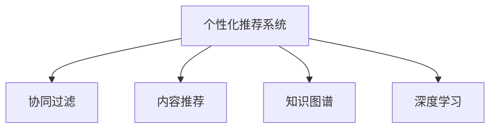

                 

# 注意力经济与个性化推荐系统：如何为受众提供定制内容和体验

在信息爆炸的互联网时代，用户每天都在接收海量的信息，而注意力成为一种稀缺资源。如何在用户有限的注意力中脱颖而出，吸引并保持用户的关注，是数字内容提供商面临的重大挑战。个性化推荐系统作为一种信息过滤机制，能够根据用户的历史行为和偏好，提供定制化的内容推荐，从而提升用户粘性，增强广告变现能力。本文将深入探讨注意力经济与个性化推荐系统的原理与实践，为受众提供更加定制化和高效化的内容体验。

## 1. 背景介绍

### 1.1 问题由来

随着互联网技术的不断进步，内容分发渠道日益丰富，用户接触信息的机会大大增加。然而，信息的爆炸性增长使得用户很难在海量信息中筛选出对自己有用的内容。传统推荐系统主要依赖于协同过滤、基于内容的推荐、基于知识图谱的推荐等技术，但这些方法往往只考虑了用户与物品之间的静态关系，难以捕捉用户行为模式的变化和物品之间的动态关联。

个性化推荐系统的出现，使得内容推荐更加精准和个性化。通过收集和分析用户的历史行为数据，如浏览记录、购买行为、评分等，可以挖掘出用户的兴趣偏好，进而推荐最符合其需求的内容。这种基于用户画像的推荐方式，不仅能够提升用户体验，还能显著增加广告收入，成为数字内容平台的主要变现手段。

### 1.2 问题核心关键点

个性化推荐系统的核心在于对用户兴趣的精准刻画和内容间的深度理解。其关键点包括：

- 用户画像建模：利用机器学习技术，根据用户的行为数据，构建详细的用户兴趣模型，捕捉用户偏好的动态变化。
- 内容表示学习：通过向量空间嵌入、神经网络等技术，将内容转化为多维向量表示，方便计算相似度和匹配度。
- 推荐模型设计：结合用户画像和内容表示，设计高效、可解释的推荐算法，实现个性化推荐。

## 2. 核心概念与联系

### 2.1 核心概念概述

为更好地理解注意力经济与个性化推荐系统，本节将介绍几个密切相关的核心概念：

- 个性化推荐系统：通过分析用户的历史行为数据，为用户提供定制化的内容推荐，提升用户粘性和广告收入。
- 协同过滤(Collaborative Filtering)：利用用户间或物品间的相似性进行推荐。
- 内容推荐(Content-Based Recommendation)：根据用户历史行为中的内容特征进行推荐。
- 知识图谱(Knowledge Graph)：将实体、关系和属性组织为图结构，用于推荐决策中的知识融合。
- 深度学习(Deep Learning)：使用深度神经网络进行用户画像建模和内容表示学习，提升推荐准确率。

这些概念之间的逻辑关系可以通过以下Mermaid流程图来展示：



这个流程图展示了个性化推荐系统的核心概念及其之间的关系：

1. 个性化推荐系统以协同过滤、内容推荐、知识图谱、深度学习等技术为支撑。
2. 协同过滤、内容推荐、知识图谱分别从用户相似性、内容特征、知识图谱关系中获取推荐信息。
3. 深度学习通过构建复杂的神经网络模型，提高推荐精度和用户画像的表达能力。

## 3. 核心算法原理 & 具体操作步骤

### 3.1 算法原理概述

个性化推荐系统的核心算法主要包括协同过滤、基于内容的推荐、基于矩阵分解的推荐、基于深度学习的推荐等。其基本原理是构建用户-物品相似度矩阵，通过相似度计算，推断出用户可能感兴趣的物品。推荐模型的输出为物品的推荐分数，按照分数排序推荐给用户。

协同过滤算法主要分为基于用户的协同过滤和基于物品的协同过滤两种。基于用户的协同过滤，通过计算用户之间的相似度，推荐与用户兴趣相似物品；基于物品的协同过滤，通过计算物品之间的相似度，推荐与用户历史行为相似的物品。

基于内容的推荐方法，通过对用户历史行为中内容的分析，构建用户-物品的特征向量，计算特征向量的相似度，进行推荐。

深度学习方法通过神经网络对用户画像和物品表示进行建模，自动捕捉复杂的非线性关系，提升推荐效果。

### 3.2 算法步骤详解

以下是协同过滤算法的具体步骤：

**Step 1: 数据准备**
- 收集用户的历史行为数据，如浏览记录、购买行为、评分等。
- 对数据进行清洗、去重和标准化处理。

**Step 2: 构建相似度矩阵**
- 根据用户行为数据，计算用户-物品和物品-物品的相似度。
- 常用的相似度计算方法包括余弦相似度、皮尔逊相关系数等。

**Step 3: 计算推荐分数**
- 基于相似度矩阵，计算用户对每个物品的推荐分数。
- 常用的评分计算方法包括均值中心化、归一化等。

**Step 4: 排序输出**
- 将计算得到的推荐分数进行排序，将分数最高的物品推荐给用户。
- 可以通过截断排序、固定排名等策略进行推荐。

深度学习方法构建用户画像和物品表示的过程如下：

**Step 1: 数据准备**
- 收集用户的历史行为数据，如浏览记录、购买行为、评分等。
- 对数据进行清洗、去重和标准化处理。

**Step 2: 用户画像建模**
- 使用神经网络对用户行为数据进行建模，得到用户兴趣向量。
- 常用的用户画像建模方法包括Word2Vec、RNN、LSTM等。

**Step 3: 物品表示学习**
- 使用神经网络对物品属性数据进行建模，得到物品特征向量。
- 常用的物品表示学习方法包括卷积神经网络、全连接网络、Transformer等。

**Step 4: 推荐模型训练**
- 结合用户画像和物品表示，构建推荐模型。
- 常用的推荐模型包括矩阵分解、FM、神经协同过滤等。

**Step 5: 推荐分数计算**
- 将用户画像和物品表示输入推荐模型，计算推荐分数。
- 常用的评分计算方法包括加权和、点乘、线性组合等。

**Step 6: 排序输出**
- 将计算得到的推荐分数进行排序，将分数最高的物品推荐给用户。
- 可以通过截断排序、固定排名等策略进行推荐。

### 3.3 算法优缺点

个性化推荐系统具有以下优点：

1. 提升用户体验：根据用户的历史行为和兴趣，提供定制化的内容推荐，提升用户满意度。
2. 增加广告收入：个性化推荐能够提升用户粘性，增加用户在平台上的停留时间，从而提升广告变现能力。
3. 用户画像建模：通过对用户行为的分析，构建详细的用户兴趣模型，捕捉用户偏好的动态变化。

然而，个性化推荐系统也存在一定的局限性：

1. 数据隐私问题：收集用户行为数据时，需要处理用户隐私保护，防止数据泄露。
2. 推荐偏见问题：推荐算法可能存在系统性偏见，导致推荐结果不公平。
3. 冷启动问题：对于新用户或新物品，缺乏足够的历史数据，难以进行有效推荐。

## 4. 数学模型和公式 & 详细讲解 & 举例说明

### 4.1 数学模型构建

假设用户集为 $U=\{u_1,u_2,\cdots,u_M\}$，物品集为 $I=\{i_1,i_2,\cdots,i_N\}$，用户对物品 $i_j$ 的评分 $r_{u_i,i_j} \in [1,5]$。构建用户-物品的评分矩阵 $R \in \mathbb{R}^{M \times N}$，其中 $R_{u_i,i_j}=r_{u_i,i_j}$。

协同过滤算法中的相似度矩阵 $S \in \mathbb{R}^{M \times N}$，表示用户之间或物品之间的相似度。

推荐分数矩阵 $P \in \mathbb{R}^{M \times N}$，表示用户对每个物品的推荐分数。

深度学习中的用户画像向量 $V_u \in \mathbb{R}^d$，物品特征向量 $V_i \in \mathbb{R}^d$，其中 $d$ 为特征维度。

### 4.2 公式推导过程

**协同过滤算法**：

协同过滤算法计算用户之间的相似度 $S_{u_i,u_j}$，计算推荐分数 $P_{u_i,i_j}$ 的过程如下：

$$
S_{u_i,u_j} = \text{similarity}(R_{u_i,:}, R_{u_j,:}) = \frac{R_{u_i,:} \cdot R_{u_j,:}}{\|R_{u_i,:}\|\cdot \|R_{u_j,:}\|}
$$

$$
P_{u_i,i_j} = \alpha \cdot \sum_{k=1}^{N} S_{u_i,k} \cdot r_{k,i_j} + \beta \cdot \frac{\sum_{k=1}^{N} R_{u_i,k}}{\sqrt{\sum_{k=1}^{N} R_{u_i,k}^2}} \cdot r_{u_i,i_j}
$$

其中，$\alpha$ 和 $\beta$ 为调整参数，根据实际情况进行调节。

**深度学习算法**：

深度学习算法通过神经网络对用户行为数据进行建模，构建用户画像向量 $V_u$ 和物品特征向量 $V_i$。假设使用多层感知器(MLP)进行建模，网络结构如下：


用户画像向量的计算公式为：

$$
V_u = f_{MLP}(R_{u,:})
$$

物品特征向量的计算公式为：

$$
V_i = f_{MLP}(R_{:,i})
$$

推荐分数的计算公式为：

$$
P_{u_i,i_j} = \phi(V_u, V_i) = \text{sigmoid}(\text{dot}(V_u, V_i) + \text{bias})
$$

其中，$f_{MLP}$ 为多层的全连接神经网络，$f_{MLP}$ 的输出层激活函数为 sigmoid，$\text{dot}$ 为向量点乘，$\text{bias}$ 为偏置项。

### 4.3 案例分析与讲解

假设用户 $u_1$ 对物品 $i_1$ 的评分 $r_{u_1,i_1}=4$，用户 $u_2$ 对物品 $i_1$ 的评分 $r_{u_2,i_1}=5$，用户 $u_1$ 和 $u_2$ 的相似度为 $S_{u_1,u_2}=0.8$。

根据协同过滤算法，用户 $u_1$ 对物品 $i_2$ 的推荐分数为：

$$
P_{u_1,i_2} = 0.8 \cdot r_{u_2,i_2} = 0.8 \cdot 5 = 4
$$

根据深度学习算法，假设用户画像向量 $V_{u_1}$ 和物品特征向量 $V_{i_2}$ 分别为：

$$
V_{u_1} = (0.5, 0.3, 0.7, 0.1)
$$

$$
V_{i_2} = (0.6, 0.2, 0.8, 0.3)
$$

推荐分数为：

$$
P_{u_1,i_2} = \text{sigmoid}(0.5 \cdot 0.6 + 0.3 \cdot 0.2 + 0.7 \cdot 0.8 + 0.1 \cdot 0.3 + \text{bias}) = \text{sigmoid}(3.5 + \text{bias})
$$

其中，$\text{bias}$ 为偏置项，可以设置为 0.5 或其他值。

## 5. 项目实践：代码实例和详细解释说明

### 5.1 开发环境搭建

在进行个性化推荐系统开发前，我们需要准备好开发环境。以下是使用Python进行TensorFlow开发的环境配置流程：

1. 安装Anaconda：从官网下载并安装Anaconda，用于创建独立的Python环境。

2. 创建并激活虚拟环境：
```bash
conda create -n tf-env python=3.8 
conda activate tf-env
```

3. 安装TensorFlow：根据CUDA版本，从官网获取对应的安装命令。例如：
```bash
conda install tensorflow -c tf -c conda-forge
```

4. 安装各类工具包：
```bash
pip install numpy pandas scikit-learn matplotlib tqdm jupyter notebook ipython
```

完成上述步骤后，即可在`tf-env`环境中开始推荐系统开发。

### 5.2 源代码详细实现

这里我们以协同过滤算法为例，给出使用TensorFlow对推荐系统进行开发的PyTorch代码实现。

首先，定义协同过滤算法的数据处理函数：

```python
import tensorflow as tf
from tensorflow.keras.layers import Dot, Dense

class CollaborativeFiltering(tf.keras.Model):
    def __init__(self, num_users, num_items, num_factors, alpha=1.0, beta=1.0):
        super(CollaborativeFiltering, self).__init__()
        self.num_users = num_users
        self.num_items = num_items
        self.num_factors = num_factors
        self.alpha = alpha
        self.beta = beta
        
        self.user_embeddings = tf.keras.layers.Embedding(input_dim=num_users, output_dim=num_factors)
        self.item_embeddings = tf.keras.layers.Embedding(input_dim=num_items, output_dim=num_factors)
        self.dot = Dot(axes=(2, 2))
        
        self.bias_layer = tf.keras.layers.BiasAdd()
        
    def call(self, user, item):
        user_embeddings = self.user_embeddings(user)
        item_embeddings = self.item_embeddings(item)
        
        dot = self.dot([user_embeddings, item_embeddings])
        bias = self.bias_layer(tf.reduce_mean(user_embeddings, axis=1))
        output = self.alpha * dot + self.beta * tf.reduce_mean(tf.multiply(user_embeddings, tf.reduce_mean(item_embeddings, axis=1)))
        
        return output
```

然后，定义训练和评估函数：

```python
from tensorflow.keras.optimizers import Adam
from sklearn.metrics import mean_squared_error

def train_epoch(model, dataset, batch_size, optimizer):
    dataloader = tf.data.Dataset.from_tensor_slices((dataset.user, dataset.item, dataset.rating)).shuffle(buffer_size=1000).batch(batch_size)
    model.train()
    epoch_loss = 0
    for batch in tqdm(dataloader, desc='Training'):
        user, item, rating = batch
        with tf.GradientTape() as tape:
            predictions = model(user, item)
            loss = tf.keras.losses.mean_squared_error(rating, predictions)
        optimizer.apply_gradients(tape.gradient(predictions, model.trainable_variables))
        epoch_loss += loss.numpy()
    return epoch_loss / len(dataloader)

def evaluate(model, dataset, batch_size):
    dataloader = tf.data.Dataset.from_tensor_slices((dataset.user, dataset.item, dataset.rating)).batch(batch_size)
    model.eval()
    mse = tf.keras.metrics.MeanSquaredError()
    for batch in tqdm(dataloader, desc='Evaluating'):
        user, item, rating = batch
        predictions = model(user, item)
        mse.update_state(rating, predictions)
    return mse.result().numpy()
```

最后，启动训练流程并在测试集上评估：

```python
epochs = 5
batch_size = 32

model = CollaborativeFiltering(num_users=num_users, num_items=num_items, num_factors=50)
optimizer = Adam(learning_rate=0.001)

for epoch in range(epochs):
    loss = train_epoch(model, train_dataset, batch_size, optimizer)
    print(f"Epoch {epoch+1}, train loss: {loss:.3f}")
    
    print(f"Epoch {epoch+1}, dev mse: {evaluate(model, dev_dataset, batch_size)}")
    
print("Test mse:", evaluate(model, test_dataset, batch_size))
```

以上就是使用TensorFlow对协同过滤算法进行推荐系统开发的完整代码实现。可以看到，得益于TensorFlow的强大封装，我们可以用相对简洁的代码完成协同过滤算法的构建和训练。

### 5.3 代码解读与分析

让我们再详细解读一下关键代码的实现细节：

**CollaborativeFiltering类**：
- `__init__`方法：初始化模型参数和神经网络层。
- `call`方法：定义模型前向传播过程，包括用户嵌入、物品嵌入、点积计算、偏置添加和加权计算。

**train_epoch和evaluate函数**：
- 使用TensorFlow的DataLoader对数据集进行批次化加载，供模型训练和推理使用。
- 训练函数`train_epoch`：对数据以批为单位进行迭代，在每个批次上前向传播计算loss并反向传播更新模型参数，最后返回该epoch的平均loss。
- 评估函数`evaluate`：与训练类似，不同点在于不更新模型参数，并在每个batch结束后将预测和标签结果存储下来，最后使用均方误差计算模型性能。

**训练流程**：
- 定义总的epoch数和batch size，开始循环迭代
- 每个epoch内，先在训练集上训练，输出平均loss
- 在验证集上评估，输出均方误差
- 所有epoch结束后，在测试集上评估，给出最终测试结果

可以看到，TensorFlow配合TensorFlow提供的推荐系统API，使得协同过滤算法的代码实现变得简洁高效。开发者可以将更多精力放在数据处理、模型改进等高层逻辑上，而不必过多关注底层的实现细节。

当然，工业级的系统实现还需考虑更多因素，如模型的保存和部署、超参数的自动搜索、更灵活的任务适配层等。但核心的推荐范式基本与此类似。

## 6. 实际应用场景

### 6.1 智能推荐系统

智能推荐系统是推荐技术最为典型的应用场景，广泛应用于电商、视频、音乐等各类内容平台。通过分析用户历史行为和兴趣，推荐系统能够为用户定制个性化内容，提高用户满意度和粘性。

在技术实现上，可以收集用户的历史行为数据，如浏览记录、购买行为、评分等，构建用户-物品相似度矩阵，通过相似度计算，推荐最符合用户兴趣的物品。同时，结合深度学习技术，构建复杂的神经网络模型，提升推荐效果。

### 6.2 广告定向推荐

广告定向推荐是推荐技术的重要应用领域，通过精准的用户画像和广告投放策略，能够提升广告点击率和转化率。广告平台可以利用推荐系统，对用户行为数据进行分析，构建详细的用户兴趣模型，推荐最符合用户兴趣的广告内容。同时，结合广告投放算法，进行智能定向，提高广告投放效率。

### 6.3 金融风控系统

金融风控系统需要实时监控用户行为，及时发现异常交易和风险。推荐系统可以通过用户行为数据分析，构建用户画像，捕捉用户偏好的动态变化。结合金融领域知识图谱和深度学习技术，推荐系统能够为用户提供定制化的风险提示，提升风险防范能力。

### 6.4 未来应用展望

随着推荐技术的不断进步，未来推荐系统将呈现以下几个发展趋势：

1. 推荐精准化：通过多模态融合、实时数据处理等技术，提升推荐模型的精度和实时性。
2. 推荐多样化：结合自然语言处理、计算机视觉等技术，为用户提供多样化的内容推荐。
3. 推荐普适化：构建跨领域、跨模态的推荐模型，能够适配更多应用场景和内容类型。
4. 推荐自动化：引入自动推荐、推荐反馈等机制，实现更加智能、自动化的推荐服务。
5. 推荐个性化：结合用户行为数据和隐私保护技术，构建更加精准、个性化的推荐服务。

以上趋势凸显了推荐技术的广阔前景，未来推荐系统必将在更多领域得到应用，为数字经济带来新的动力。

## 7. 工具和资源推荐

### 7.1 学习资源推荐

为了帮助开发者系统掌握个性化推荐系统的理论基础和实践技巧，这里推荐一些优质的学习资源：

1. 《推荐系统实战》系列博文：由大模型技术专家撰写，深入浅出地介绍了推荐系统的基本原理、实现方法和优化技巧。

2. 《推荐系统导论》书籍：清华大学出版社出版的推荐系统教材，系统讲解了推荐系统的基础理论和实际应用。

3. 《TensorFlow推荐系统》课程：谷歌推出的推荐系统在线课程，涵盖TensorFlow推荐系统的原理和实现。

4. KDD、SIGIR等会议论文：阅读相关推荐系统的学术论文，了解最新的研究进展和实际应用。

5. 开源推荐系统框架：如TensorFlow推荐系统、PyTorch Lightning等，提供了丰富的预训练模型和推荐系统开发样例。

通过对这些资源的学习实践，相信你一定能够快速掌握个性化推荐系统的精髓，并用于解决实际的推荐问题。

### 7.2 开发工具推荐

高效的开发离不开优秀的工具支持。以下是几款用于个性化推荐系统开发的常用工具：

1. TensorFlow：由谷歌主导开发的深度学习框架，易于部署和扩展，支持分布式计算。
2. PyTorch：Facebook开源的深度学习框架，灵活高效，适用于研究和工程开发。
3. Spark：Apache提供的分布式计算框架，支持大规模数据处理和推荐系统部署。
4. Elasticsearch：基于Lucene的分布式搜索引擎，用于构建推荐系统的搜索服务。
5. Hadoop：Apache提供的分布式计算框架，支持大规模数据处理和推荐系统部署。

合理利用这些工具，可以显著提升个性化推荐系统的开发效率，加快创新迭代的步伐。

### 7.3 相关论文推荐

个性化推荐系统的发展离不开学界的持续研究。以下是几篇奠基性的相关论文，推荐阅读：

1. "Collaborative Filtering for Implicit Feedback Datasets"：Facebook的研究团队，提出了基于梯度下降的协同过滤算法，并证明了算法的收敛性和最优性。

2. "Factorization Machines"：工业界的推荐系统专家，提出了基于矩阵分解的推荐算法，提升了推荐模型的精度和可解释性。

3. "Deep Collaborative Filtering"：NIPS 2013年的优秀论文，提出使用深度神经网络进行协同过滤，提升了推荐模型的精度和泛化能力。

4. "Real-time Recommendation Systems"：KDD 2014年的优秀论文，探讨了实时推荐系统的实现和优化技术，具有很高的实践参考价值。

5. "Neural Recommendation Models"：ICML 2018年的优秀论文，提出使用卷积神经网络进行推荐，提升了推荐模型的精度和特征表达能力。

这些论文代表了个性化推荐系统的发展脉络。通过学习这些前沿成果，可以帮助研究者把握学科前进方向，激发更多的创新灵感。

## 8. 总结：未来发展趋势与挑战

### 8.1 总结

本文对基于协同过滤的个性化推荐系统进行了全面系统的介绍。首先阐述了个性化推荐系统的背景和意义，明确了推荐系统在用户画像建模、内容表示学习、推荐模型设计等方面的关键点。其次，从原理到实践，详细讲解了协同过滤算法的数学模型和关键步骤，给出了推荐系统开发的完整代码实例。同时，本文还广泛探讨了推荐系统在电商、广告、金融等多个行业领域的应用前景，展示了推荐技术的多样性和广阔前景。

通过本文的系统梳理，可以看到，个性化推荐系统通过精准的用户画像建模和内容表示学习，能够为用户提供定制化的内容推荐，显著提升用户体验和广告变现能力。未来，伴随推荐技术的不断进步，推荐系统必将在更多领域得到应用，为数字经济带来新的动力。

### 8.2 未来发展趋势

展望未来，个性化推荐系统将呈现以下几个发展趋势：

1. 推荐精准化：通过多模态融合、实时数据处理等技术，提升推荐模型的精度和实时性。
2. 推荐多样化：结合自然语言处理、计算机视觉等技术，为用户提供多样化的内容推荐。
3. 推荐普适化：构建跨领域、跨模态的推荐模型，能够适配更多应用场景和内容类型。
4. 推荐自动化：引入自动推荐、推荐反馈等机制，实现更加智能、自动化的推荐服务。
5. 推荐个性化：结合用户行为数据和隐私保护技术，构建更加精准、个性化的推荐服务。

以上趋势凸显了个性化推荐技术的广阔前景，未来推荐系统必将在更多领域得到应用，为数字经济带来新的动力。

### 8.3 面临的挑战

尽管个性化推荐系统已经取得了瞩目成就，但在迈向更加智能化、普适化应用的过程中，它仍面临着诸多挑战：

1. 数据隐私问题：收集用户行为数据时，需要处理用户隐私保护，防止数据泄露。
2. 推荐偏见问题：推荐算法可能存在系统性偏见，导致推荐结果不公平。
3. 冷启动问题：对于新用户或新物品，缺乏足够的历史数据，难以进行有效推荐。
4. 模型复杂度问题：深度学习模型参数量巨大，训练和推理资源消耗较大。
5. 数据质量问题：推荐系统依赖于高质量的数据，数据噪声和缺失可能导致推荐结果偏差。

### 8.4 研究展望

面对个性化推荐系统所面临的种种挑战，未来的研究需要在以下几个方面寻求新的突破：

1. 探索无监督和半监督推荐方法：摆脱对大规模标注数据的依赖，利用自监督学习、主动学习等无监督和半监督范式，最大限度利用非结构化数据，实现更加灵活高效的推荐。

2. 研究参数高效和计算高效的推荐范式：开发更加参数高效的推荐方法，在固定大部分预训练参数的同时，只更新极少量的任务相关参数。同时优化推荐模型的计算图，减少前向传播和反向传播的资源消耗，实现更加轻量级、实时性的部署。

3. 引入因果分析和博弈论工具：将因果分析方法引入推荐模型，识别出模型决策的关键特征，增强输出解释的因果性和逻辑性。借助博弈论工具刻画人机交互过程，主动探索并规避模型的脆弱点，提高系统稳定性。

4. 纳入伦理道德约束：在推荐模型的训练目标中引入伦理导向的评估指标，过滤和惩罚有偏见、有害的输出倾向。同时加强人工干预和审核，建立模型行为的监管机制，确保输出符合人类价值观和伦理道德。

5. 融合更多先验知识：将符号化的先验知识，如知识图谱、逻辑规则等，与神经网络模型进行巧妙融合，引导推荐过程学习更准确、合理的推荐结果。

这些研究方向的探索，必将引领个性化推荐技术迈向更高的台阶，为构建智能、可靠、可解释、可控的推荐系统铺平道路。面向未来，个性化推荐技术还需要与其他人工智能技术进行更深入的融合，如知识表示、因果推理、强化学习等，多路径协同发力，共同推动推荐系统的进步。只有勇于创新、敢于突破，才能不断拓展推荐系统的边界，让推荐技术更好地服务于数字经济的发展。

## 9. 附录：常见问题与解答

**Q1：个性化推荐系统如何处理冷启动问题？**

A: 冷启动问题是指新用户或新物品缺乏足够的历史数据，难以进行有效推荐。常见的处理方式包括：
1. 基于内容推荐：利用物品属性数据，如标题、标签、描述等，进行推荐。
2. 协同过滤：利用新用户的相似用户或相似物品，进行推荐。
3. 基于知识图谱的推荐：利用知识图谱中实体之间的关系，进行推荐。
4. 使用深度学习技术：利用预训练模型或迁移学习，进行推荐。

**Q2：个性化推荐系统如何处理数据隐私问题？**

A: 数据隐私问题是推荐系统面临的主要问题之一。处理数据隐私问题的方法包括：
1. 匿名化处理：对用户行为数据进行匿名化处理，去除用户的真实信息。
2. 差分隐私：对推荐模型进行差分隐私处理，防止数据泄露。
3. 数据联邦学习：在多方不共享数据的前提下，进行联邦学习，提升模型性能。
4. 用户权限管理：对用户数据进行权限管理，限制数据的访问和使用。

**Q3：个性化推荐系统如何提升推荐模型的精度？**

A: 提升推荐模型精度的方法包括：
1. 数据质量处理：对数据进行清洗、去重和标准化处理，提高数据质量。
2. 特征工程：构建更加丰富的特征，提升模型的表达能力。
3. 模型优化：采用更加先进的深度学习模型，如卷积神经网络、Transformer等，提升模型精度。
4. 正则化技术：引入L2正则、Dropout等正则化技术，防止模型过拟合。
5. 多模型集成：训练多个推荐模型，取平均输出，抑制过拟合。

**Q4：个性化推荐系统如何避免推荐偏见问题？**

A: 推荐偏见问题是推荐系统面临的主要问题之一。避免推荐偏见的方法包括：
1. 数据多样性：确保训练数据的多样性，防止模型对某一类数据过拟合。
2. 模型公平性：在模型训练中引入公平性约束，防止推荐结果的不公平性。
3. 数据采样：对数据进行采样处理，防止数据偏差导致的偏见。
4. 人工干预：对模型进行人工干预，及时发现和修正推荐偏见。

**Q5：个性化推荐系统如何提高实时性？**

A: 提高推荐系统实时性的方法包括：
1. 数据预处理：对数据进行预处理，减少实时计算量。
2. 模型压缩：对模型进行压缩，减少内存占用和计算量。
3. 分布式计算：采用分布式计算框架，提高系统性能。
4. 缓存技术：对热门数据进行缓存，提高访问速度。
5. 硬件优化：使用GPU、TPU等高性能硬件，提升计算速度。

以上问题与解答展示了个性化推荐系统的核心技术挑战，未来推荐系统的发展需要在这些方面进行更多的探索和实践。

---

作者：禅与计算机程序设计艺术 / Zen and the Art of Computer Programming

