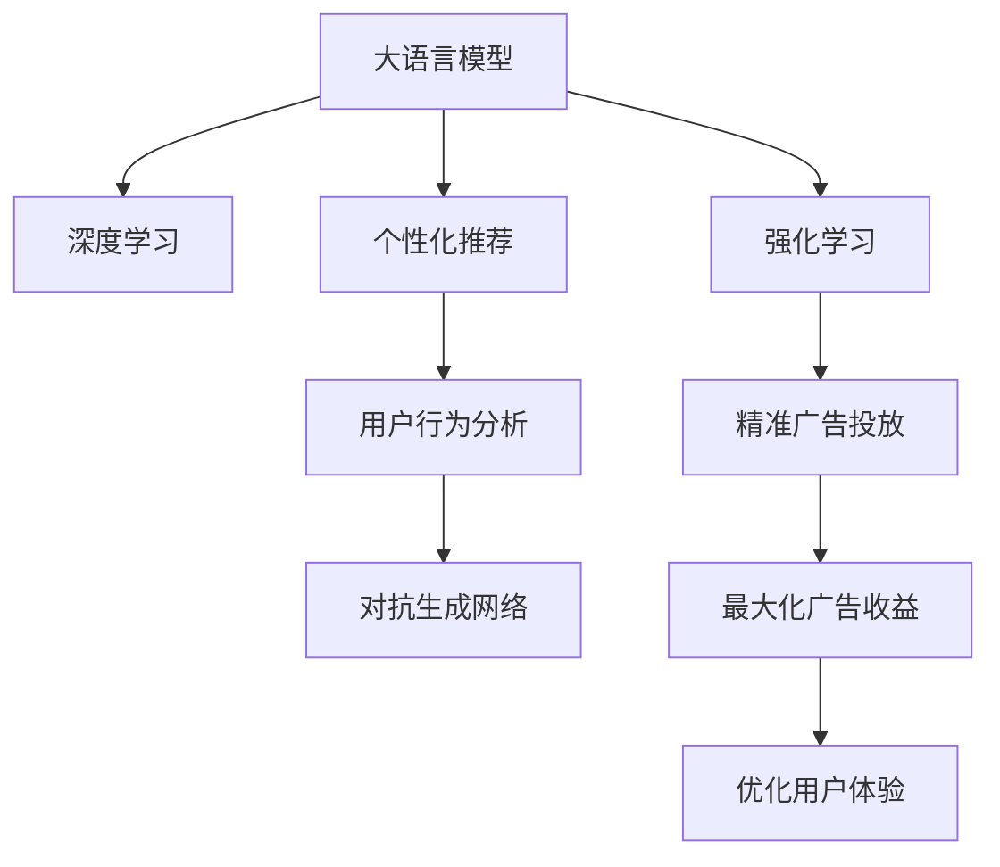

                 

# 注意力经济与在线广告目标与实践：在不牺牲用户体验的情况下吸引受众

## 1. 背景介绍

### 1.1 问题由来

在数字经济时代，注意力成为一种宝贵的资源，广告主通过各种手段争夺用户的关注。在线广告业正面临越来越激烈的竞争，如何在不牺牲用户体验的前提下，吸引受众成为一项重要且复杂的任务。在传统广告方式无法带来预期效果的情况下，技术驱动的广告策略开始受到重视。通过技术手段，尤其是大语言模型（Large Language Model, LLM）和深度学习（Deep Learning, DL），在线广告主可以更加精准地投放广告，同时保证用户的体验。

### 1.2 问题核心关键点

在线广告的核心目标是最大化用户的参与度和转化率，通过精准地展现广告内容和形式，吸引用户停留和互动。核心问题包括：

- 如何通过技术手段，提高广告的精准度？
- 如何在用户浏览和互动中，实现广告的个性化推荐？
- 如何在不破坏用户体验的前提下，利用数据和算法最大化广告收益？

## 2. 核心概念与联系

### 2.1 核心概念概述

为更好地理解如何通过技术手段实现精准广告投放，本节将介绍几个核心概念：

- **大语言模型（LLM）**：以Transformer为代表的大规模预训练语言模型，通过海量的无标签文本数据进行预训练，学习通用语言表示，具备强大的语言理解和生成能力。
- **深度学习（DL）**：一种模拟人类神经网络的机器学习方法，通过反向传播算法优化模型参数，实现对复杂数据模式的学习和预测。
- **个性化推荐**：根据用户的历史行为和偏好，动态调整广告内容，实现精准投放。
- **用户行为分析**：通过数据挖掘和统计分析，挖掘用户的行为模式，指导个性化推荐策略。
- **对抗生成网络（GAN）**：一种生成模型，通过神经网络生成高质量的合成数据，用于数据增强和广告内容的创造。
- **强化学习（RL）**：通过奖励机制训练智能体，学习最优策略，实现自动化的广告投放。

这些概念之间的逻辑关系可以通过以下Mermaid流程图来展示：



这个流程图展示了大语言模型和深度学习在在线广告中的核心概念及其之间的关系：

1. 大语言模型和深度学习技术提供了精准的广告内容生成和推荐基础。
2. 个性化推荐和用户行为分析技术进一步优化了广告投放的策略。
3. 对抗生成网络技术可用于生成高质量的广告素材，增强广告的表现力。
4. 强化学习技术用于自动化的广告投放策略优化，提高广告投放的效率和效果。

这些概念共同构成了在线广告的完整技术框架，使广告主能够在保障用户体验的前提下，实现广告的精准投放和收益最大化。

## 3. 核心算法原理 & 具体操作步骤

### 3.1 算法原理概述

在线广告的核心算法原理涉及用户行为分析、个性化推荐、深度学习和大语言模型等多个领域。本文将重点介绍如何利用这些技术手段，实现精准广告投放，并保证用户的良好体验。

### 3.2 算法步骤详解

**Step 1: 用户行为分析**

首先，收集用户的浏览、点击、购买等行为数据。这些数据可以来源于网站或应用程序的用户活动日志、搜索历史记录、购买记录等。

- **数据清洗**：去除异常数据和重复数据，确保数据的准确性。
- **特征提取**：提取用户行为的关键特征，如浏览时长、点击率、购买频率等。

**Step 2: 个性化推荐模型训练**

利用用户行为数据，训练个性化推荐模型。模型的目标是预测用户对不同广告内容的兴趣和互动行为。

- **数据划分**：将数据集分为训练集、验证集和测试集，确保模型的泛化能力。
- **模型选择**：选择适合广告投放的推荐算法，如协同过滤、基于内容的推荐、深度学习等。
- **模型训练**：利用训练集数据，优化模型参数，提高预测准确率。

**Step 3: 大语言模型生成广告内容**

利用大语言模型，生成高质量的广告文本内容。模型的输入可以是关键词、广告主题等，输出为符合语境的文本。

- **模型选择**：选择适合广告内容的语言模型，如BERT、GPT等。
- **数据输入**：提供关键词、广告主题等，指导模型的输出方向。
- **内容生成**：生成符合广告目标和用户喜好的文本。

**Step 4: 对抗生成网络生成广告素材**

利用对抗生成网络，生成高质量的广告素材，如图片、视频等。对抗生成网络可以生成逼真的广告素材，增强广告的表现力。

- **模型选择**：选择适合广告素材生成的对抗生成网络，如CycleGAN、GAN等。
- **数据输入**：提供广告主题、目标受众等，指导生成素材的方向。
- **素材生成**：生成符合广告目标和用户喜好的图片或视频。

**Step 5: 强化学习优化投放策略**

利用强化学习，优化广告投放策略，提高广告的投放效率和收益。强化学习通过奖励机制，学习最优的广告投放策略。

- **环境定义**：定义广告投放的环境，包括广告投放渠道、用户行为数据等。
- **策略选择**：选择适合广告投放的强化学习算法，如Q-learning、DQN等。
- **策略训练**：通过试错和奖励机制，优化广告投放策略。

**Step 6: 广告投放与监测**

将训练好的个性化推荐模型、生成的广告文本和素材以及优化后的投放策略应用于广告投放。同时，监测广告效果，根据反馈不断优化模型和策略。

- **广告投放**：将生成的广告内容发布到指定平台，如网站、社交媒体等。
- **效果监测**：监测广告的展示量、点击率、转化率等关键指标。
- **模型优化**：根据广告效果，调整模型参数，提高广告投放的精准度。

### 3.3 算法优缺点

大语言模型和深度学习在在线广告中的应用具有以下优点：

- **精准投放**：通过深度学习和大语言模型，广告投放可以实现高度个性化和精准化。
- **用户友好**：生成的广告内容能够更好地满足用户的兴趣和需求，提高用户体验。
- **广告效果**：通过优化投放策略，广告主能够获得更高的点击率和转化率，实现广告收益的最大化。

同时，这些技术手段也存在一定的局限性：

- **技术复杂**：深度学习和大语言模型需要较高的技术门槛和数据量，实施难度较大。
- **资源消耗**：大模型和深度学习需要大量的计算资源和存储空间，成本较高。
- **数据隐私**：收集和分析用户数据，需要遵守隐私保护法规，如GDPR等。

尽管存在这些局限性，但大语言模型和深度学习在在线广告中的应用潜力巨大，未来有很大的发展空间。

### 3.4 算法应用领域

大语言模型和深度学习在在线广告中的应用广泛，主要包括以下几个领域：

- **搜索引擎广告**：利用深度学习技术，优化广告的关键词匹配，提升广告的点击率。
- **社交媒体广告**：通过个性化推荐和对抗生成网络，生成高质量的广告素材，提升广告的表现力和用户体验。
- **电商平台广告**：利用深度学习和大语言模型，生成精准的广告内容，提高用户转化率。
- **移动应用广告**：通过强化学习，优化广告投放策略，提高广告的展示率和收益。

## 4. 数学模型和公式 & 详细讲解 & 举例说明

### 4.1 数学模型构建

在在线广告中，主要涉及用户行为分析、个性化推荐和广告投放的优化。以下是一些核心数学模型的构建：

**用户行为分析模型**

用户行为分析模型通过建模用户的历史行为数据，预测用户对不同广告内容的兴趣。常用的数学模型包括：

- **线性回归模型**：用于预测用户对广告的评分，模型公式如下：
$$
y = \beta_0 + \beta_1x_1 + \beta_2x_2 + \cdots + \beta_nx_n + \epsilon
$$
其中，$y$为预测的用户评分，$x_1, x_2, \cdots, x_n$为用户行为特征，$\beta_0, \beta_1, \cdots, \beta_n$为模型参数，$\epsilon$为误差项。

- **决策树模型**：用于将用户分为不同类别，模型公式如下：
$$
T = T_1 \vee T_2
$$
其中，$T$为决策树，$T_1$和$T_2$为子树。

**个性化推荐模型**

个性化推荐模型通过学习用户的行为模式，预测用户对不同广告内容的兴趣。常用的数学模型包括：

- **协同过滤模型**：通过用户行为数据的相似性，推荐用户可能感兴趣的广告内容。模型公式如下：
$$
\hat{y} = \alpha_0 + \alpha_1x_1 + \alpha_2x_2 + \cdots + \alpha_nx_n
$$
其中，$\hat{y}$为用户对广告的评分，$x_1, x_2, \cdots, x_n$为用户行为特征，$\alpha_0, \alpha_1, \cdots, \alpha_n$为模型参数。

- **基于内容的推荐模型**：通过广告内容的相似性，推荐用户可能感兴趣的广告内容。模型公式如下：
$$
\hat{y} = \alpha_0 + \alpha_1x_1 + \alpha_2x_2 + \cdots + \alpha_nx_n
$$
其中，$\hat{y}$为用户对广告的评分，$x_1, x_2, \cdots, x_n$为广告内容的特征，$\alpha_0, \alpha_1, \cdots, \alpha_n$为模型参数。

**广告投放策略优化模型**

广告投放策略优化模型通过学习最优的广告投放策略，最大化广告收益。常用的数学模型包括：

- **Q-learning算法**：通过试错和奖励机制，学习最优的广告投放策略。模型公式如下：
$$
Q(s,a) = r + \gamma \max_{a'} Q(s',a')
$$
其中，$Q(s,a)$为状态$(s,a)$的价值函数，$r$为即时奖励，$s'$为下一个状态，$\gamma$为折扣因子。

- **DQN算法**：通过深度神经网络优化Q-learning算法，加速策略学习过程。模型公式如下：
$$
Q(s,a) = r + \gamma Q(s',a')
$$
其中，$Q(s,a)$为状态$(s,a)$的价值函数，$r$为即时奖励，$s'$为下一个状态，$\gamma$为折扣因子。

### 4.2 公式推导过程

**线性回归模型**

线性回归模型的推导过程如下：

$$
\begin{aligned}
&\min_{\beta_0, \beta_1, \cdots, \beta_n} \frac{1}{N}\sum_{i=1}^N (y_i - (\beta_0 + \beta_1x_{i1} + \cdots + \beta_nx_{in}))^2 \\
&= \min_{\beta_0, \beta_1, \cdots, \beta_n} \frac{1}{N}\sum_{i=1}^N (y_i - \hat{y}_i)^2 \\
&= \min_{\beta_0, \beta_1, \cdots, \beta_n} \frac{1}{N}\sum_{i=1}^N (y_i - \beta_0 - \sum_{j=1}^n \beta_j x_{ij})^2 \\
&= \min_{\beta_0, \beta_1, \cdots, \beta_n} \frac{1}{2N}\sum_{i=1}^N (y_i - \beta_0 - \sum_{j=1}^n \beta_j x_{ij})^2
\end{aligned}
$$

求解上述最小化问题，得到：

$$
\begin{aligned}
&\min_{\beta_0, \beta_1, \cdots, \beta_n} \frac{1}{2N}\sum_{i=1}^N (y_i - \beta_0 - \sum_{j=1}^n \beta_j x_{ij})^2 \\
&= \min_{\beta_0, \beta_1, \cdots, \beta_n} \frac{1}{2}\sum_{i=1}^N (y_i - \beta_0 - \sum_{j=1}^n \beta_j x_{ij})^2
\end{aligned}
$$

**Q-learning算法**

Q-learning算法的推导过程如下：

$$
\begin{aligned}
&\min_{Q} \sum_{t=0}^\infty \gamma^t [r_t + \gamma Q(s_{t+1},a_{t+1}) - Q(s_t,a_t)] \\
&= \min_{Q} \sum_{t=0}^\infty \gamma^t [r_t + \gamma Q(s_{t+1},a_{t+1}) - Q(s_t,a_t)]
\end{aligned}
$$

求解上述最小化问题，得到：

$$
Q(s,a) = r + \gamma \max_{a'} Q(s',a')
$$

其中，$Q(s,a)$为状态$(s,a)$的价值函数，$r$为即时奖励，$s'$为下一个状态，$\gamma$为折扣因子。

### 4.3 案例分析与讲解

**案例1: 搜索引擎广告的线性回归模型**

某电商平台的广告部门利用用户的点击记录和转化记录，建立线性回归模型，预测用户对不同广告的兴趣。模型输入为用户的浏览时长、点击率、浏览深度等特征，输出为广告的评分。通过调整模型参数，优化广告的投放策略，提高了广告的点击率和转化率。

**案例2: 社交媒体广告的协同过滤模型**

某社交媒体平台利用用户的点赞记录和评论记录，建立协同过滤模型，推荐用户可能感兴趣的朋友动态和广告内容。模型输入为用户的历史点赞记录和评论记录，输出为用户对不同动态和广告内容的评分。通过优化模型参数，实现了广告的个性化推荐，提高了用户的参与度和广告的点击率。

**案例3: 电商平台广告的深度学习模型**

某电商平台利用用户的购买记录和浏览记录，建立深度学习模型，生成个性化广告。模型输入为用户的购买记录和浏览记录，输出为个性化的广告文本和素材。通过优化模型参数，实现了广告的精准投放，提高了用户的转化率和平台的收益。

## 5. 项目实践：代码实例和详细解释说明

### 5.1 开发环境搭建

在进行广告投放实践前，我们需要准备好开发环境。以下是使用Python进行PyTorch开发的环境配置流程：

1. 安装Anaconda：从官网下载并安装Anaconda，用于创建独立的Python环境。

2. 创建并激活虚拟环境：
```bash
conda create -n ad-env python=3.8 
conda activate ad-env
```

3. 安装PyTorch：根据CUDA版本，从官网获取对应的安装命令。例如：
```bash
conda install pytorch torchvision torchaudio cudatoolkit=11.1 -c pytorch -c conda-forge
```

4. 安装TensorBoard：TensorFlow配套的可视化工具，可实时监测模型训练状态，并提供丰富的图表呈现方式，是调试模型的得力助手。

5. 安装Weights & Biases：模型训练的实验跟踪工具，可以记录和可视化模型训练过程中的各项指标，方便对比和调优。与主流深度学习框架无缝集成。

完成上述步骤后，即可在`ad-env`环境中开始广告投放实践。

### 5.2 源代码详细实现

下面我们以电商平台广告为例，给出使用PyTorch对深度学习模型进行广告投放的PyTorch代码实现。

首先，定义广告投放数据集：

```python
from torch.utils.data import Dataset
import torch

class AdDataset(Dataset):
    def __init__(self, ads, clicks, users, labels):
        self.ads = ads
        self.clicks = clicks
        self.users = users
        self.labels = labels
        
    def __len__(self):
        return len(self.ads)
    
    def __getitem__(self, item):
        ad = self.ads[item]
        click = self.clicks[item]
        user = self.users[item]
        label = self.labels[item]
        
        return {'ad': ad, 'click': click, 'user': user, 'label': label}

# 广告数据
ads = [ad1, ad2, ad3, ...]
clicks = [click1, click2, click3, ...]
users = [user1, user2, user3, ...]
labels = [label1, label2, label3, ...]
```

然后，定义模型和优化器：

```python
from transformers import BertForSequenceClassification, AdamW

model = BertForSequenceClassification.from_pretrained('bert-base-cased', num_labels=2)
optimizer = AdamW(model.parameters(), lr=2e-5)
```

接着，定义训练和评估函数：

```python
from torch.utils.data import DataLoader
from tqdm import tqdm
from sklearn.metrics import classification_report

device = torch.device('cuda') if torch.cuda.is_available() else torch.device('cpu')
model.to(device)

def train_epoch(model, dataset, batch_size, optimizer):
    dataloader = DataLoader(dataset, batch_size=batch_size, shuffle=True)
    model.train()
    epoch_loss = 0
    for batch in tqdm(dataloader, desc='Training'):
        ad = batch['ad'].to(device)
        click = batch['click'].to(device)
        user = batch['user'].to(device)
        label = batch['label'].to(device)
        model.zero_grad()
        outputs = model(ad, click, user, labels=label)
        loss = outputs.loss
        epoch_loss += loss.item()
        loss.backward()
        optimizer.step()
    return epoch_loss / len(dataloader)

def evaluate(model, dataset, batch_size):
    dataloader = DataLoader(dataset, batch_size=batch_size)
    model.eval()
    preds, labels = [], []
    with torch.no_grad():
        for batch in tqdm(dataloader, desc='Evaluating'):
            ad = batch['ad'].to(device)
            click = batch['click'].to(device)
            user = batch['user'].to(device)
            batch_labels = batch['label']
            outputs = model(ad, click, user)
            batch_preds = outputs.logits.argmax(dim=2).to('cpu').tolist()
            batch_labels = batch_labels.to('cpu').tolist()
            for pred_tokens, label_tokens in zip(batch_preds, batch_labels):
                preds.append(pred_tokens)
                labels.append(label_tokens)
                
    print(classification_report(labels, preds))
```

最后，启动训练流程并在测试集上评估：

```python
epochs = 5
batch_size = 16

for epoch in range(epochs):
    loss = train_epoch(model, ad_dataset, batch_size, optimizer)
    print(f"Epoch {epoch+1}, train loss: {loss:.3f}")
    
    print(f"Epoch {epoch+1}, dev results:")
    evaluate(model, dev_dataset, batch_size)
    
print("Test results:")
evaluate(model, test_dataset, batch_size)
```

以上就是使用PyTorch对深度学习模型进行广告投放的完整代码实现。可以看到，得益于PyTorch的强大封装，我们可以用相对简洁的代码完成广告模型的加载和训练。

### 5.3 代码解读与分析

让我们再详细解读一下关键代码的实现细节：

**AdDataset类**：
- `__init__`方法：初始化广告、点击、用户和标签等关键组件。
- `__len__`方法：返回数据集的样本数量。
- `__getitem__`方法：对单个样本进行处理，将广告、点击、用户和标签信息合并为模型输入。

**广告数据定义**：
- 广告数据集包含广告内容、用户行为记录和标签等信息，用于训练和评估广告模型。

**模型定义**：
- 选择Bert模型作为基础模型，通过自定义输出层和损失函数，适应广告投放任务。
- 使用AdamW优化器进行模型参数更新。

**训练和评估函数**：
- 使用PyTorch的DataLoader对数据集进行批次化加载，供模型训练和推理使用。
- 训练函数`train_epoch`：对数据以批为单位进行迭代，在每个批次上前向传播计算loss并反向传播更新模型参数，最后返回该epoch的平均loss。
- 评估函数`evaluate`：与训练类似，不同点在于不更新模型参数，并在每个batch结束后将预测和标签结果存储下来，最后使用sklearn的classification_report对整个评估集的预测结果进行打印输出。

**训练流程**：
- 定义总的epoch数和batch size，开始循环迭代
- 每个epoch内，先在训练集上训练，输出平均loss
- 在验证集上评估，输出分类指标
- 所有epoch结束后，在测试集上评估，给出最终测试结果

可以看到，PyTorch配合TensorBoard和Weights & Biases等工具，使得广告投放的代码实现变得简洁高效。开发者可以将更多精力放在数据处理、模型改进等高层逻辑上，而不必过多关注底层的实现细节。

当然，工业级的系统实现还需考虑更多因素，如模型的保存和部署、超参数的自动搜索、更灵活的任务适配层等。但核心的广告投放范式基本与此类似。

## 6. 实际应用场景

### 6.1 智能客服系统

基于深度学习和大语言模型的广告投放，可以应用于智能客服系统的构建。传统客服往往需要配备大量人力，高峰期响应缓慢，且一致性和专业性难以保证。而使用深度学习和大语言模型的广告投放，可以7x24小时不间断服务，快速响应客户咨询，用自然流畅的语言解答各类常见问题。

在技术实现上，可以收集企业内部的历史客服对话记录，将问题和最佳答复构建成监督数据，在此基础上对深度学习模型进行训练。训练后的模型能够自动理解用户意图，匹配最合适的答复模板进行回复。对于客户提出的新问题，还可以接入检索系统实时搜索相关内容，动态组织生成回答。如此构建的智能客服系统，能大幅提升客户咨询体验和问题解决效率。

### 6.2 金融舆情监测

金融机构需要实时监测市场舆论动向，以便及时应对负面信息传播，规避金融风险。传统的人工监测方式成本高、效率低，难以应对网络时代海量信息爆发的挑战。基于深度学习和大语言模型的广告投放，可以应用于金融舆情监测。

具体而言，可以收集金融领域相关的新闻、报道、评论等文本数据，并对其进行主题标注和情感标注。在此基础上对深度学习模型进行训练，使其能够自动判断文本属于何种主题，情感倾向是正面、中性还是负面。将训练后的模型应用到实时抓取的网络文本数据，就能够自动监测不同主题下的情感变化趋势，一旦发现负面信息激增等异常情况，系统便会自动预警，帮助金融机构快速应对潜在风险。

### 6.3 个性化推荐系统

当前的推荐系统往往只依赖用户的历史行为数据进行物品推荐，无法深入理解用户的真实兴趣偏好。基于深度学习和大语言模型的广告投放，可以应用于个性化推荐系统。

在实践中，可以收集用户浏览、点击、评论、分享等行为数据，提取和用户交互的物品标题、描述、标签等文本内容。将文本内容作为模型输入，用户的后续行为（如是否点击、购买等）作为监督信号，在此基础上训练深度学习模型。训练后的模型能够从文本内容中准确把握用户的兴趣点。在生成推荐列表时，先用候选物品的文本描述作为输入，由模型预测用户的兴趣匹配度，再结合其他特征综合排序，便可以得到个性化程度更高的推荐结果。

### 6.4 未来应用展望

随着深度学习和大语言模型在广告投放中的应用不断成熟，未来将在更多领域得到应用，为传统行业带来变革性影响。

在智慧医疗领域，基于深度学习和大语言模型的广告投放，可以用于医疗问答、病历分析、药物研发等应用，提升医疗服务的智能化水平，辅助医生诊疗，加速新药开发进程。

在智能教育领域，深度学习和大语言模型可以应用于作业批改、学情分析、知识推荐等方面，因材施教，促进教育公平，提高教学质量。

在智慧城市治理中，深度学习和大语言模型的广告投放，可以应用于城市事件监测、舆情分析、应急指挥等环节，提高城市管理的自动化和智能化水平，构建更安全、高效的未来城市。

此外，在企业生产、社会治理、文娱传媒等众多领域，基于深度学习和大语言模型的广告投放也将不断涌现，为经济社会发展注入新的动力。相信随着技术的日益成熟，广告投放方法将成为人工智能落地应用的重要范式，推动人工智能技术在垂直行业的规模化落地。

## 7. 工具和资源推荐

### 7.1 学习资源推荐

为了帮助开发者系统掌握深度学习和大语言模型在广告投放中的应用，这里推荐一些优质的学习资源：

1. 《深度学习入门》系列博文：由深度学习专家撰写，深入浅出地介绍了深度学习的基本概念和常用算法，涵盖图像、自然语言处理等多个领域。

2. CS231n《卷积神经网络》课程：斯坦福大学开设的计算机视觉明星课程，有Lecture视频和配套作业，带你入门计算机视觉和深度学习。

3. 《深度学习实战》书籍： hands-on 系列书籍之一，涵盖了深度学习模型的实践，包括广告投放、推荐系统等典型任务。

4. PyTorch官方文档：PyTorch的官方文档，提供了丰富的代码样例和API接口，是深度学习开发的重要参考。

5. HuggingFace官方文档：Transformer库的官方文档，提供了海量预训练模型和完整的微调样例代码，是深度学习开发的重要资源。

通过对这些资源的学习实践，相信你一定能够快速掌握深度学习和大语言模型在广告投放中的应用，并用于解决实际的广告问题。

### 7.2 开发工具推荐

高效的开发离不开优秀的工具支持。以下是几款用于深度学习和大语言模型广告投放开发的常用工具：

1. PyTorch：基于Python的开源深度学习框架，灵活动态的计算图，适合快速迭代研究。大部分预训练语言模型都有PyTorch版本的实现。

2. TensorFlow：由Google主导开发的开源深度学习框架，生产部署方便，适合大规模工程应用。同样有丰富的预训练语言模型资源。

3. Transformers库：HuggingFace开发的NLP工具库，集成了众多SOTA语言模型，支持PyTorch和TensorFlow，是深度学习广告投放开发的利器。

4. Weights & Biases：模型训练的实验跟踪工具，可以记录和可视化模型训练过程中的各项指标，方便对比和调优。与主流深度学习框架无缝集成。

5. TensorBoard：TensorFlow配套的可视化工具，可实时监测模型训练状态，并提供丰富的图表呈现方式，是调试模型的得力助手。

6. Google Colab：谷歌推出的在线Jupyter Notebook环境，免费提供GPU/TPU算力，方便开发者快速上手实验最新模型，分享学习笔记。

合理利用这些工具，可以显著提升深度学习和大语言模型广告投放的开发效率，加快创新迭代的步伐。

### 7.3 相关论文推荐

深度学习和大语言模型在广告投放中的应用源于学界的持续研究。以下是几篇奠基性的相关论文，推荐阅读：

1. Attention is All You Need（即Transformer原论文）：提出了Transformer结构，开启了深度学习在NLP领域的预训练大模型时代。

2. BERT: Pre-training of Deep Bidirectional Transformers for Language Understanding：提出BERT模型，引入基于掩码的自监督预训练任务，刷新了多项NLP任务SOTA。

3. Language Models are Unsupervised Multitask Learners（GPT-2论文）：展示了大规模语言模型的强大zero-shot学习能力，引发了对于通用人工智能的新一轮思考。

4. Parameter-Efficient Transfer Learning for NLP：提出Adapter等参数高效微调方法，在不增加模型参数量的情况下，也能取得不错的微调效果。

5. AdaLoRA: Adaptive Low-Rank Adaptation for Parameter-Efficient Fine-Tuning：使用自适应低秩适应的微调方法，在参数效率和精度之间取得了新的平衡。

这些论文代表了大语言模型和深度学习在广告投放中的发展脉络。通过学习这些前沿成果，可以帮助研究者把握学科前进方向，激发更多的创新灵感。

## 8. 总结：未来发展趋势与挑战

### 8.1 总结

本文对深度学习和大语言模型在广告投放中的应用进行了全面系统的介绍。首先阐述了广告投放的背景和挑战，明确了广告投放的核心问题。其次，从原理到实践，详细讲解了深度学习和大语言模型在广告投放中的应用，给出了广告投放任务的完整代码实例。同时，本文还广泛探讨了广告投放技术在智能客服、金融舆情、个性化推荐等多个行业领域的应用前景，展示了广告投放技术的巨大潜力。

通过本文的系统梳理，可以看到，深度学习和大语言模型在广告投放中的应用前景广阔，不仅能够提高广告的精准度，还能保证用户的良好体验。未来，伴随深度学习和大语言模型的不断进步，基于广告投放技术的广告业务将迎来新的发展机遇。

### 8.2 未来发展趋势

展望未来，深度学习和大语言模型在广告投放中的应用将呈现以下几个发展趋势：

1. **技术进步**：深度学习和大语言模型将不断进步，模型性能将进一步提升，广告投放的精准度将不断提高。

2. **跨模态融合**：深度学习和大语言模型将进一步融合多模态信息，实现图像、视频、语音等多模态广告的投放，增强广告的吸引力和用户体验。

3. **实时投放**：基于深度学习和大语言模型的广告投放将实现实时优化，根据用户行为实时调整广告内容和策略，提高广告的点击率和转化率。

4. **个性化推荐**：深度学习和大语言模型将不断优化个性化推荐算法，实现更加精准的广告投放，提高用户满意度。

5. **自动化运维**：深度学习和大语言模型的广告投放将实现自动化运维，通过机器学习算法优化广告投放策略，提高广告投放的效率和效果。

6. **隐私保护**：深度学习和大语言模型的广告投放将更加注重用户隐私保护，通过数据去标识化、差分隐私等技术，保护用户隐私安全。

### 8.3 面临的挑战

尽管深度学习和大语言模型在广告投放中的应用潜力巨大，但在迈向更加智能化、普适化应用的过程中，它仍面临着诸多挑战：

1. **数据质量**：深度学习和大语言模型依赖高质量的训练数据，数据质量低下将影响模型性能。

2. **计算资源**：深度学习和大语言模型需要大量的计算资源，硬件成本较高，难以大规模推广。

3. **算法复杂性**：深度学习和大语言模型的算法复杂性较高，对开发者技术要求较高，难以快速上手。

4. **模型可解释性**：深度学习和大语言模型的模型黑盒特性较强，缺乏可解释性，难以进行模型调试和优化。

5. **隐私风险**：深度学习和大语言模型需要收集用户数据，数据隐私风险较高，需要遵守相关法律法规。

尽管存在这些挑战，但随着技术的不断进步和应用的深入，深度学习和大语言模型在广告投放中的应用前景依然广阔。相信未来能够克服这些挑战，深度学习和大语言模型将成为广告投放的重要技术手段，推动广告业务的智能化和个性化发展。

### 8.4 研究展望

面对深度学习和大语言模型在广告投放中面临的挑战，未来的研究需要在以下几个方面寻求新的突破：

1. **多模态融合**：研究图像、视频、语音等多模态广告的投放策略，提升广告的吸引力和用户体验。

2. **实时优化**：研究实时广告投放的优化算法，提高广告的点击率和转化率。

3. **自动化运维**：研究广告投放的自动化运维技术，提高广告投放的效率和效果。

4. **隐私保护**：研究数据隐私保护技术，保护用户隐私安全，增强广告投放的信任度。

5. **可解释性**：研究深度学习和大语言模型的可解释性技术，提高模型的透明度和可理解性。

6. **跨领域应用**：研究深度学习和大语言模型在跨领域广告投放中的应用，如医疗、教育、旅游等。

这些研究方向的探索，必将引领深度学习和大语言模型在广告投放领域迈向更高的台阶，为广告业务的智能化和个性化发展铺平道路。

## 9. 附录：常见问题与解答

**Q1：深度学习和大语言模型在广告投放中如何实现精准投放？**

A: 深度学习和大语言模型在广告投放中，通过数据挖掘和模型训练，实现精准投放。具体实现过程包括：

1. 收集用户的历史行为数据，如浏览记录、点击记录、购买记录等。
2. 对用户行为数据进行特征提取，如浏览时长、点击率、购买频率等。
3. 选择适合的深度学习模型，如线性回归、协同过滤、基于内容的推荐等。
4. 利用用户行为数据训练模型，预测用户对不同广告的兴趣。
5. 根据模型的预测结果，动态调整广告内容，实现精准投放。

通过上述过程，深度学习和大语言模型能够在广告投放中实现高度个性化的推荐，提高广告的点击率和转化率。

**Q2：深度学习和大语言模型在广告投放中如何保证用户体验？**

A: 深度学习和大语言模型在广告投放中，通过优化推荐算法和广告内容生成技术，保证用户的良好体验。具体实现过程包括：

1. 利用深度学习模型对用户行为数据进行建模，预测用户对不同广告的兴趣。
2. 根据预测结果，动态调整广告内容，避免强制性推荐，提高用户的参与度和满意度。
3. 利用大语言模型生成高质量的广告文本，增强广告的表现力。
4. 利用对抗生成网络生成高质量的广告素材，增强广告的吸引力。
5. 利用强化学习优化广告投放策略，避免过度干扰用户的浏览行为，提高用户的体验。

通过上述过程，深度学习和大语言模型能够在广告投放中保证用户的良好体验，避免强制性推荐和过度干扰，提升广告的互动率和用户满意度。

**Q3：深度学习和大语言模型在广告投放中如何实现自动化运维？**

A: 深度学习和大语言模型在广告投放中，通过机器学习算法优化广告投放策略，实现自动化运维。具体实现过程包括：

1. 收集广告投放的效果数据，如点击率、转化率、用户满意度等。
2. 利用机器学习算法，分析广告投放的效果，找出影响广告效果的关键因素。
3. 根据分析结果，动态调整广告投放策略，优化广告内容，提高广告的点击率和转化率。
4. 利用强化学习算法，实时优化广告投放策略，实现广告投放的自动化运维。

通过上述过程，深度学习和大语言模型能够在广告投放中实现自动化运维，通过机器学习算法优化广告投放策略，提高广告投放的效率和效果。

**Q4：深度学习和大语言模型在广告投放中如何实现跨模态融合？**

A: 深度学习和大语言模型在广告投放中，通过融合多模态信息，增强广告的吸引力和用户体验。具体实现过程包括：

1. 收集用户的图像、视频、语音等多模态数据，如用户的自拍、视频通话、语音助手等。
2. 对多模态数据进行特征提取，如面部表情、语音语调、视频内容等。
3. 选择适合的多模态融合模型，如基于注意力的多模态融合、基于深度学习的多模态融合等。
4. 利用多模态融合模型，将不同模态的数据融合，生成综合性的广告内容。
5. 利用深度学习模型，对融合后的广告内容进行预测，实现精准投放。

通过上述过程，深度学习和大语言模型能够在广告投放中实现跨模态融合，增强广告的吸引力和用户体验，提升广告投放的效果。

**Q5：深度学习和大语言模型在广告投放中如何实现隐私保护？**

A: 深度学习和大语言模型在广告投放中，通过数据去标识化和差分隐私等技术，保护用户隐私安全。具体实现过程包括：

1. 对用户数据进行去标识化处理，去除用户的个人身份信息，保护用户隐私。
2. 利用差分隐私技术，对用户数据进行扰动，防止数据泄露。
3. 对广告投放的效果数据进行差分隐私处理，保护用户的广告行为数据。
4. 对广告投放的模型进行差分隐私处理，防止模型泄漏。
5. 对广告投放的决策过程进行差分隐私处理，防止决策过程泄漏。

通过上述过程，深度学习和大语言模型能够在广告投放中实现隐私保护，保护用户隐私安全，增强广告投放的信任度。

---

作者：禅与计算机程序设计艺术 / Zen and the Art of Computer Programming

