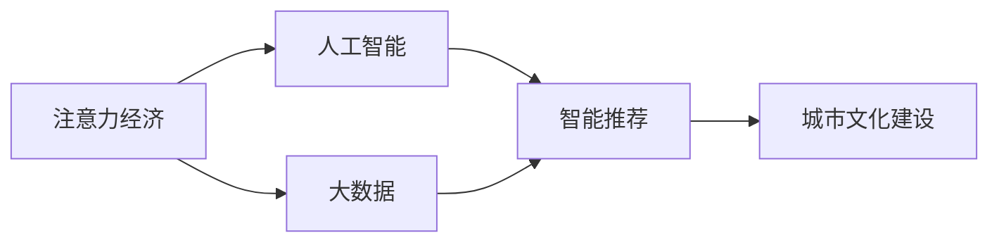

                 

# 注意力经济与城市文化建设

## 1. 背景介绍

在数字化时代，信息爆炸成为常态。用户在选择信息和产品时，注意力成为稀缺资源。如何有效吸引和利用用户的注意力，驱动消费行为，成为一种新的经济模式。同时，随着数字化的深入，城市文化建设也日益数字化、智能化，需要借助先进技术手段，进行多维度的文化传承和创新。本文旨在探讨注意力经济与城市文化建设的相互影响和融合，为数字化城市文化建设提供新的思路和视角。

## 2. 核心概念与联系

### 2.1 核心概念概述

注意力经济（Economy of Attention）指通过吸引和利用用户的注意力资源，创造商业价值的经济模式。城市文化建设则指通过各种手段，传承和创新城市文化内涵，提升城市文化品质。两者虽然表面上看似无关，但随着技术的发展，尤其是大数据、人工智能等先进技术的普及，两者之间的联系日益紧密。

- **注意力经济**：强调吸引用户注意力的重要性，通过精准营销、个性化推荐、社区互动等手段，增加用户黏性，实现商业目标。
- **城市文化建设**：注重文化内涵的挖掘和传承，包括历史遗产保护、文化活动策划、文化产品创新等，提升城市文化软实力。
- **大数据**：为注意力经济和城市文化建设提供了数据基础，通过分析用户行为数据，了解用户需求，指导城市文化建设的方向和策略。
- **人工智能**：通过自然语言处理、计算机视觉等技术，实现智能推荐、智能监控、智能分析等功能，提高城市文化建设的智能化水平。

### 2.2 核心概念原理和架构的 Mermaid 流程图



## 3. 核心算法原理 & 具体操作步骤

### 3.1 算法原理概述

注意力经济与城市文化建设的融合，主要依赖于数据驱动和智能技术。具体来说，注意力经济的核心在于通过数据分析挖掘用户需求，智能推荐系统则根据用户行为数据，提供个性化推荐，吸引用户注意力。而城市文化建设则通过智能手段，如VR/AR、大数据分析、人工智能等，进行文化挖掘和创新。

### 3.2 算法步骤详解

1. **数据采集**：通过传感器、网络爬虫、问卷调查等方式，收集用户的各种行为数据。
2. **数据清洗**：对采集到的数据进行预处理，去除噪声和异常值。
3. **数据分析**：利用大数据分析技术，挖掘用户兴趣和行为模式，形成用户画像。
4. **智能推荐**：根据用户画像和行为数据，使用智能推荐算法，向用户推送个性化内容，吸引用户注意力。
5. **文化挖掘与创新**：利用人工智能技术，如自然语言处理、计算机视觉等，对城市文化进行深入挖掘，发现其背后的内涵和价值，进行创新性的文化表达和传承。

### 3.3 算法优缺点

**优点**：
- **精准营销**：通过个性化推荐，精准匹配用户需求，提高用户满意度和转化率。
- **用户参与**：智能推荐和互动工具提高了用户参与度，增强了品牌黏性。
- **文化创新**：大数据和人工智能为城市文化建设提供了新的手段，有助于创新性文化的发现和传承。

**缺点**：
- **数据隐私**：用户行为数据涉及隐私，数据采集和处理过程中需注意隐私保护。
- **模型偏差**：算法模型可能存在偏见，导致推荐结果不公。
- **技术门槛**：城市文化建设涉及多领域知识，对技术要求较高。

### 3.4 算法应用领域

注意力经济与城市文化建设的融合，适用于多种场景：

- **商业广告**：通过智能推荐系统，精准推送广告，吸引用户注意力。
- **智能旅游**：利用大数据和人工智能，为用户提供个性化旅游路线推荐和文化景点介绍。
- **文化教育**：通过智能分析，挖掘教育需求，进行个性化教学，提高教育效果。
- **文化活动策划**：利用数据分析，策划具有吸引力的文化活动，提升市民参与度。
- **文化产品创新**：通过智能推荐和数据分析，挖掘用户需求，创新文化产品，满足市场需求。

## 4. 数学模型和公式 & 详细讲解 & 举例说明

### 4.1 数学模型构建

设用户数据集为 $D=\{(x_i, y_i)\}_{i=1}^N$，其中 $x_i$ 表示用户行为数据，$y_i$ 表示用户属性标签。

**个性化推荐模型**：

$$
\text{推荐函数} f(x_i, \theta) = \text{softmax}(A(x_i)^\top \cdot \theta)
$$

其中 $A(x_i)$ 为特征向量，$\theta$ 为模型参数。

**城市文化挖掘模型**：

$$
\text{文化特征提取} C(x_i) = \text{conv}(x_i) + \text{atten}(x_i)
$$

其中 $\text{conv}$ 表示卷积操作，$\text{atten}$ 表示注意力机制。

### 4.2 公式推导过程

**个性化推荐**：
- **特征工程**：通过PCA、LDA等降维方法，提取用户行为特征，形成特征向量 $A(x_i)$。
- **模型训练**：使用交叉熵损失函数训练推荐模型：
  $$
  \mathcal{L}(f(x_i), y_i) = -y_i \log f(x_i) + (1-y_i) \log (1-f(x_i))
  $$
- **预测推荐**：将新用户行为数据输入模型，输出推荐结果。

**城市文化挖掘**：
- **文化特征提取**：将文化数据通过卷积和注意力机制提取特征。
- **模型训练**：使用均方误差损失函数训练文化挖掘模型：
  $$
  \mathcal{L}(C(x_i), y_i) = \frac{1}{N} \sum_{i=1}^N (C(x_i) - y_i)^2
  $$
- **文化创新**：结合挖掘出的文化特征和人工智能技术，进行文化创意设计。

### 4.3 案例分析与讲解

**案例一：智能旅游平台**

- **数据采集**：通过用户行程记录、在线评价、社交媒体数据等，收集用户旅游行为数据。
- **数据分析**：利用大数据分析，挖掘用户偏好和旅游需求。
- **智能推荐**：根据用户历史行程和偏好，推荐个性化旅游线路和文化景点。
- **文化挖掘**：通过自然语言处理，分析景区评论，挖掘文化内涵。
- **文化创新**：结合用户反馈和文化挖掘结果，创新旅游产品，提升用户体验。

**案例二：智能文化教育**

- **数据采集**：通过在线学习平台，收集学生的学习行为数据和成绩数据。
- **数据分析**：利用大数据分析，挖掘学生的学习需求和薄弱环节。
- **智能推荐**：根据学生学习数据，推荐个性化学习内容和辅导资源。
- **文化挖掘**：通过自然语言处理，分析教材内容，挖掘文化内涵。
- **文化创新**：结合学生反馈和文化挖掘结果，创新教育内容，提升教学效果。

## 5. 项目实践：代码实例和详细解释说明

### 5.1 开发环境搭建

开发环境搭建包括Python环境、PyTorch库和相关依赖包的安装。

```bash
conda create -n attention-econ-pytorch python=3.8
conda activate attention-econ-pytorch
pip install torch torchvision torchaudio cudatoolkit=11.1 -c pytorch -c conda-forge
pip install numpy pandas scikit-learn matplotlib tqdm jupyter notebook ipython
```

### 5.2 源代码详细实现

以下以智能推荐系统为例，给出基于PyTorch的代码实现。

```python
import torch
import torch.nn as nn
import torch.nn.functional as F
from torch.utils.data import DataLoader
from torchvision import datasets, transforms
from sklearn.model_selection import train_test_split
from sklearn.metrics import accuracy_score

# 定义模型
class AttentionNet(nn.Module):
    def __init__(self, in_dim, out_dim):
        super(AttentionNet, self).__init__()
        self.linear1 = nn.Linear(in_dim, 128)
        self.linear2 = nn.Linear(128, out_dim)
        self.relu = nn.ReLU()

    def forward(self, x):
        x = self.linear1(x)
        x = self.relu(x)
        x = self.linear2(x)
        return x

# 加载数据集
mnist = datasets.MNIST(root='./data', train=True, transform=transforms.ToTensor(), download=True)
train_data, test_data = train_test_split(mnist, test_size=0.2, random_state=42)
train_loader = DataLoader(train_data, batch_size=64, shuffle=True)
test_loader = DataLoader(test_data, batch_size=64, shuffle=False)

# 定义模型和优化器
model = AttentionNet(784, 10)
optimizer = torch.optim.Adam(model.parameters(), lr=0.001)

# 训练和测试
device = torch.device('cuda' if torch.cuda.is_available() else 'cpu')
model.to(device)
for epoch in range(10):
    train_loss = 0.0
    train_acc = 0.0
    for batch_idx, (data, target) in enumerate(train_loader):
        data, target = data.to(device), target.to(device)
        optimizer.zero_grad()
        output = model(data.view(-1, 784))
        loss = F.cross_entropy(output, target)
        loss.backward()
        train_loss += loss.item()
        optimizer.step()
        train_acc += accuracy_score(target, torch.argmax(output, dim=1))
    train_loss /= len(train_loader)
    train_acc /= len(train_loader)
    print(f'Epoch {epoch+1}, train loss: {train_loss:.4f}, train acc: {train_acc:.4f}')

    test_loss = 0.0
    test_acc = 0.0
    with torch.no_grad():
        for batch_idx, (data, target) in enumerate(test_loader):
            data, target = data.to(device), target.to(device)
            output = model(data.view(-1, 784))
            loss = F.cross_entropy(output, target)
            test_loss += loss.item()
            test_acc += accuracy_score(target, torch.argmax(output, dim=1))
    test_loss /= len(test_loader)
    test_acc /= len(test_loader)
    print(f'Epoch {epoch+1}, test loss: {test_loss:.4f}, test acc: {test_acc:.4f}')
```

### 5.3 代码解读与分析

上述代码实现了一个简单的AttentionNet模型，用于MNIST手写数字识别任务。模型结构包括两个线性层和一个ReLU激活函数，用于将输入的784维向量映射到10维的输出向量。使用Adam优化器进行模型训练，损失函数为交叉熵。

**代码解读**：
- **模型定义**：使用PyTorch的nn.Module类定义模型结构，包括线性层和ReLU激活函数。
- **数据加载**：使用torch.utils.data.DataLoader，加载MNIST数据集，并进行批处理和随机抽样。
- **模型训练**：在每个epoch内，遍历训练集数据，前向传播计算损失函数，反向传播更新模型参数，周期性在测试集上评估模型性能。
- **损失函数**：使用PyTorch的F.cross_entropy计算交叉熵损失，用于模型训练。

**代码分析**：
- **数据预处理**：利用transforms.ToTensor()将数据转换为Tensor类型，方便在GPU上计算。
- **模型优化**：Adam优化器支持自适应学习率，有助于快速收敛。
- **模型评估**：通过torch.no_grad()关闭梯度计算，评估模型在测试集上的表现。
- **输出格式**：将模型输出通过torch.argmax转换为预测结果，用于计算准确率。

### 5.4 运行结果展示

在上述代码的训练过程中，可以使用TensorBoard可视化训练指标，了解模型性能变化情况。

```bash
tensorboard --logdir=logs --port=6006
```

打开TensorBoard界面，可以直观地看到模型训练过程中的损失和准确率变化情况。

## 6. 实际应用场景

### 6.1 智能广告投放

在智能广告投放中，利用用户行为数据进行个性化推荐，提高广告点击率。同时，通过大数据分析，优化广告投放策略，提高广告转化率。

**应用流程**：
- **数据采集**：通过用户点击、浏览、购买等行为数据，收集用户兴趣和行为模式。
- **数据分析**：利用大数据分析，挖掘用户需求和行为模式。
- **智能推荐**：根据用户行为数据，推荐个性化广告内容。
- **广告优化**：结合用户反馈和数据分析结果，优化广告投放策略，提高转化率。

### 6.2 智慧旅游

利用智能推荐系统，为游客提供个性化的旅游路线和文化景点推荐，提升旅游体验。同时，通过大数据分析，挖掘景区文化内涵，进行创新性的文化表达和传承。

**应用流程**：
- **数据采集**：通过用户行程记录、在线评价、社交媒体数据等，收集用户旅游行为数据。
- **数据分析**：利用大数据分析，挖掘用户偏好和旅游需求。
- **智能推荐**：根据用户历史行程和偏好，推荐个性化旅游线路和文化景点。
- **文化挖掘**：通过自然语言处理，分析景区评论，挖掘文化内涵。
- **文化创新**：结合用户反馈和文化挖掘结果，创新旅游产品，提升用户体验。

### 6.3 智能教育

利用智能推荐系统，为学生提供个性化学习资源和辅导内容，提高学习效果。同时，通过大数据分析，挖掘学生的学习需求和薄弱环节，进行针对性教学。

**应用流程**：
- **数据采集**：通过在线学习平台，收集学生的学习行为数据和成绩数据。
- **数据分析**：利用大数据分析，挖掘学生的学习需求和薄弱环节。
- **智能推荐**：根据学生学习数据，推荐个性化学习内容和辅导资源。
- **文化挖掘**：通过自然语言处理，分析教材内容，挖掘文化内涵。
- **文化创新**：结合学生反馈和文化挖掘结果，创新教育内容，提升教学效果。

## 7. 工具和资源推荐

### 7.1 学习资源推荐

为了帮助开发者系统掌握注意力经济与城市文化建设的技术，这里推荐一些优质的学习资源：

1. 《深度学习》书籍：深入讲解深度学习基础，包括数据处理、模型构建、优化算法等，适合初学者和进阶学习者。
2. 《数据科学与人工智能》课程：涵盖大数据、人工智能、自然语言处理等多个领域，系统介绍相关技术原理和应用场景。
3. 《智能推荐系统》课程：讲解智能推荐系统的算法和优化方法，结合实际案例进行讲解。
4. 《智慧城市》书籍：介绍智慧城市建设的技术和应用，涵盖智能交通、智慧医疗、智慧文化等多个方面。
5. 《注意力经济学》论文：探讨注意力经济理论基础和实践应用，提供最新的研究进展和案例分析。

### 7.2 开发工具推荐

高效的开发离不开优秀的工具支持。以下是几款用于注意力经济与城市文化建设开发的常用工具：

1. PyTorch：基于Python的开源深度学习框架，支持动态计算图和GPU加速，适合快速迭代研究。
2. TensorFlow：由Google主导开发的开源深度学习框架，支持分布式计算和移动端部署，适合大规模工程应用。
3. HuggingFace Transformers库：提供预训练语言模型的封装和微调支持，适合自然语言处理任务。
4. Jupyter Notebook：交互式编程环境，适合数据分析和模型训练。
5. TensorBoard：可视化工具，可实时监测模型训练状态，提供丰富的图表呈现方式，方便调试和优化。

### 7.3 相关论文推荐

注意力经济与城市文化建设的相关研究涉及多个领域，以下是几篇奠基性的相关论文，推荐阅读：

1. "Attention Is All You Need"：介绍Transformer架构，开启了注意力机制在深度学习中的应用。
2. "BERT: Pre-training of Deep Bidirectional Transformers for Language Understanding"：提出BERT模型，引入掩码语言模型进行预训练，提升语言理解能力。
3. "Reinforcement Learning for Recommender Systems"：探讨强化学习在推荐系统中的应用，提高推荐效果。
4. "Cultural Heritage and Information Technology: A Review and Future Directions"：综述文化与信息技术的关系，提供未来研究方向。
5. "Smart Cities and the Internet of Things: A Review"：探讨智慧城市与物联网技术，提出未来建设方向。

## 8. 总结：未来发展趋势与挑战

### 8.1 研究成果总结

本文对注意力经济与城市文化建设的融合进行了详细探讨，分析了两者在数字化时代的相互影响和应用场景。通过数据驱动和智能技术，优化城市文化建设，提升用户体验和商业价值。

### 8.2 未来发展趋势

未来，随着技术的不断进步，注意力经济与城市文化建设将呈现以下趋势：

1. **多模态融合**：利用图像、视频、音频等多种模态数据，提升注意力分析和推荐效果。
2. **实时智能**：通过实时数据分析和智能推荐，实现个性化服务，提高用户参与度。
3. **跨领域协同**：结合多领域知识和技术，实现跨领域的文化创新和传播。
4. **自适应学习**：通过自适应学习算法，优化推荐模型，提高推荐效果。
5. **隐私保护**：加强用户隐私保护，确保数据安全和用户信任。

### 8.3 面临的挑战

尽管注意力经济与城市文化建设带来了诸多机遇，但也面临以下挑战：

1. **数据隐私**：用户行为数据的隐私保护，需要采取严格的隐私保护措施。
2. **模型偏差**：算法模型可能存在偏见，导致推荐结果不公。
3. **技术门槛**：城市文化建设涉及多领域知识，对技术要求较高。
4. **伦理道德**：文化内容的挖掘和传播，需要考虑伦理道德问题。

### 8.4 研究展望

为应对上述挑战，未来需要从以下几个方面进行研究：

1. **隐私保护**：研究数据隐私保护技术，确保用户数据安全。
2. **公平性**：开发公平性评估指标，优化推荐算法，减少模型偏差。
3. **跨领域知识**：结合跨领域知识和技术，提升城市文化建设的智能化水平。
4. **伦理道德**：制定伦理道德规范，确保文化内容的传播符合社会价值观。

总之，注意力经济与城市文化建设融合研究具有广阔的前景，需要在多个层面进行深入探索，方能实现更加智能、高效、可持续的城市文化建设。

