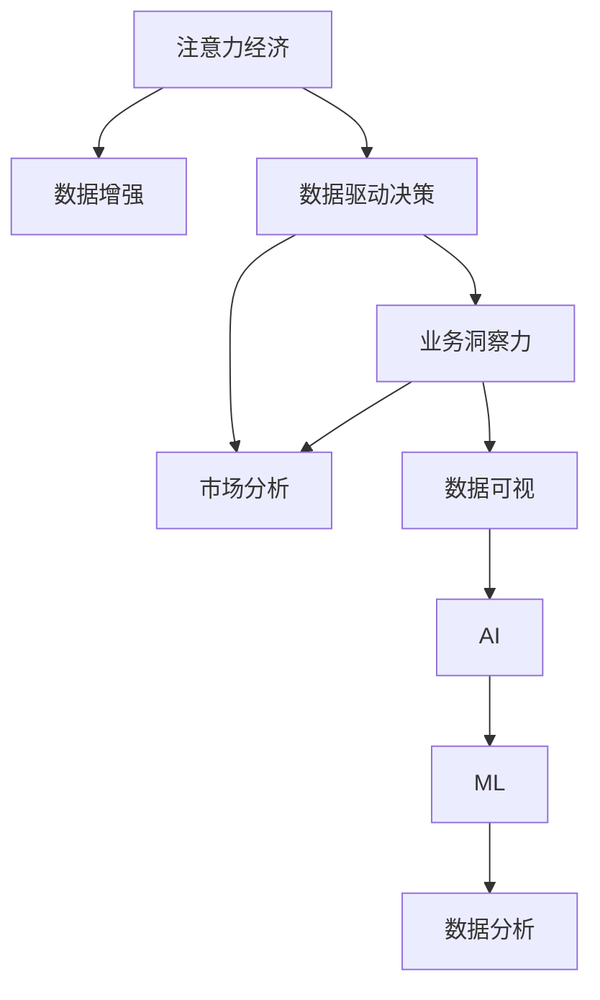

                 

# 注意力经济与数据驱动决策：利用数据增强业务和市场洞察力

> 关键词：注意力经济, 数据增强, 数据驱动决策, 业务洞察力, 市场分析, 数据可视, 人工智能(AI), 机器学习(ML), 数据分析

## 1. 背景介绍

### 1.1 问题由来

在数字化转型的大潮中，企业正面临着前所未有的机遇与挑战。一方面，大数据、云计算、人工智能等技术的高速发展为企业带来了新的增长点，使得基于数据的洞察和决策成为可能。另一方面，海量数据产生的同时也带来了数据过载和信息噪音的困扰，如何从海量数据中提取有价值的信息，转化为指导企业决策的洞察力，成为了当下企业的共同难题。

在这样一个背景下，"注意力经济"应运而生。注意力经济，即通过优化注意力资源的分配，引导人们集中精力于最重要的信息，从而提升信息处理效率和质量。它结合了经济学的注意力理论，利用心理学和数据科学的最新研究成果，为企业提供了一种基于数据的决策支持系统。

### 1.2 问题核心关键点

注意力经济的核心在于通过对海量数据进行深度分析和智能推荐，帮助企业识别并聚焦于最有价值的信息。基于此，本文将深入探讨数据增强和数据驱动决策的关键原理和实践方法，力求为企业的业务洞察力和市场分析提供切实可行的解决方案。

## 2. 核心概念与联系

### 2.1 核心概念概述

为更好地理解注意力经济和数据增强、驱动决策的原理，本节将介绍几个密切相关的核心概念：

- 注意力经济(Artificial Attention Economy)：通过优化信息获取和处理方式，引导人们聚焦于最重要的信息，从而提升信息处理效率和质量的经济模式。

- 数据增强(Data Augmentation)：通过一系列技术手段，如数据清洗、数据合成、数据变换等，对原始数据进行扩充和提升，增强数据的多样性和泛化能力。

- 数据驱动决策(Data-Driven Decision Making)：以数据为基础，通过分析、预测和优化，辅助企业进行科学、精准的决策。

- 业务洞察力(Business Insight)：通过对企业内部数据和外部市场数据的综合分析，提炼出有助于业务优化和增长的关键信息。

- 市场分析(Market Analysis)：对市场需求、竞争态势、客户行为等进行深入分析，为企业提供市场竞争力和策略制定依据。

- 数据可视(Data Visualization)：利用图形、图表等可视化手段，展示和解读数据，使复杂的数据信息更加直观和易于理解。

- 人工智能(AI)：以数据为基础，通过机器学习和深度学习等技术手段，实现智能化决策和分析。

- 机器学习(ML)：通过算法和模型训练，从数据中学习规律和模式，实现数据的自动化处理和智能决策。

- 数据分析(Analytics)：对原始数据进行整理、清洗、分析和建模，提取有用的信息，支持决策过程。

这些概念之间的逻辑关系可以通过以下Mermaid流程图来展示：



这个流程图展示了注意力经济、数据增强和数据驱动决策之间的联系：

1. 注意力经济通过优化信息获取和处理方式，提升数据处理效率。
2. 数据增强增强数据的多样性和泛化能力，提升数据分析效果。
3. 数据驱动决策利用数据驱动的智能分析，辅助企业进行决策。
4. 业务洞察力和市场分析依赖于数据分析，提炼关键业务信息和市场竞争策略。
5. 数据可视帮助企业直观理解数据，支持决策和分析。
6. AI和ML技术为数据分析提供算法支持，提高分析效率和精度。

这些概念共同构成了注意力经济和数据驱动决策的基本框架，使其能够为企业提供强大的数据支持，优化决策过程，提升业务洞察力。

## 3. 核心算法原理 & 具体操作步骤
### 3.1 算法原理概述

基于注意力经济的决策系统，主要依赖于数据增强和数据驱动决策两个关键环节。具体而言，数据增强通过扩充和提升原始数据，增强数据的多样性和泛化能力；数据驱动决策则利用增强后的数据，结合先进的算法和模型，进行智能分析和预测，辅助企业进行决策。

### 3.2 算法步骤详解

以下详细讲解基于注意力经济的决策系统的构建流程：

**Step 1: 数据收集与预处理**
- 从企业的业务系统和市场环境中，收集有价值的数据，如销售记录、客户行为、市场趋势等。
- 对收集到的数据进行清洗、去重、填充等预处理操作，保证数据质量和一致性。

**Step 2: 数据增强**
- 利用数据增强技术，对原始数据进行扩充和提升，如数据合成、数据变换、噪声注入等。
- 使用自动化的数据增强工具，如Data Augmentation库，加速数据增强过程。

**Step 3: 数据驱动决策**
- 选择合适的算法和模型，如随机森林、神经网络、深度学习等，进行数据训练和预测。
- 利用机器学习工具，如Scikit-learn、TensorFlow、PyTorch等，实现模型的训练和优化。

**Step 4: 业务洞察力提炼**
- 将数据驱动决策的结果，通过可视化工具展示，如Tableau、Power BI等，提炼出有助于业务优化的关键信息。
- 结合专家知识和经验，对数据洞察进行综合分析，提炼出有价值的业务洞察。

**Step 5: 市场分析与策略制定**
- 通过数据分析工具，对市场需求、竞争态势、客户行为等进行深入分析，生成市场分析报告。
- 根据市场分析结果，制定有针对性的市场策略，指导企业决策。

### 3.3 算法优缺点

基于注意力经济的决策系统具有以下优点：
1. 数据驱动。决策过程依赖于数据，减少了人工判断的误差，提升了决策的科学性和准确性。
2. 系统化。通过一系列标准化流程，确保了数据处理和决策过程的系统性、规范性。
3. 可扩展性。结合最新的数据增强和算法技术，系统能够不断升级和优化，适应不断变化的市场环境。
4. 透明度。通过可视化工具，数据处理和决策过程透明化，便于企业内部沟通和外部监督。

同时，该系统也存在一定的局限性：
1. 数据质量依赖。决策系统的结果依赖于数据质量，若数据存在噪音或偏差，可能会影响决策结果。
2. 技术门槛高。系统构建和维护需要较高的技术水平，可能存在一定的实施成本。
3. 动态环境适应性。在市场环境快速变化的情况下，系统需要不断调整和优化，才能保持最佳效果。
4. 个性化需求适配。企业内各业务单元对数据的需求和分析角度不同，系统需要兼顾个性化需求。

尽管存在这些局限性，但基于数据增强和数据驱动决策的系统，无疑为企业的决策优化和业务洞察提供了强大的技术支撑，值得在实际应用中加以推广和实践。

### 3.4 算法应用领域

基于数据增强和数据驱动决策的注意力经济系统，在多个领域得到了广泛应用，具体包括：

1. **零售业**：通过对客户行为和购买记录进行深度分析，预测市场趋势，优化商品库存和销售策略。
2. **金融业**：利用历史交易数据和市场行情，进行风险评估和投资策略优化。
3. **制造业**：对生产数据和市场需求进行分析，预测生产计划和库存需求。
4. **医疗健康**：结合患者诊疗数据和健康趋势，提供个性化医疗服务和健康管理方案。
5. **交通物流**：对交通流量和货物运输数据进行分析，优化路线规划和物流调度。
6. **公共安全**：通过社会治安数据和犯罪趋势，预测安全风险，制定防范策略。

除了以上这些行业，注意力经济和数据驱动决策系统还广泛应用于能源、农业、教育等多个领域，为企业的决策优化和业务增长提供了重要支持。

## 4. 数学模型和公式 & 详细讲解  
### 4.1 数学模型构建

在基于注意力经济的决策系统中，常用的数学模型主要包括数据增强和数据驱动决策两部分。

假设原始数据集为 $\mathcal{D}=\{(x_i, y_i)\}_{i=1}^N, x_i \in \mathcal{X}, y_i \in \mathcal{Y}$。其中 $x_i$ 表示数据样本，$y_i$ 表示标签或目标。

**数据增强模型**：通过对原始数据进行变换、合成、注入噪声等操作，增强数据的多样性和泛化能力。常用的数据增强方法包括：
- 数据变换：对数据进行旋转、平移、缩放等变换，增加数据的多样性。
- 数据合成：利用生成对抗网络(Generative Adversarial Networks, GAN)等技术，生成新数据样本。
- 噪声注入：在数据中加入随机噪声，增加数据样本的复杂性。

**数据驱动决策模型**：利用机器学习算法和模型，对增强后的数据进行训练和预测。常用的数据驱动决策模型包括：
- 决策树：利用树形结构，对数据进行分层决策。
- 随机森林：通过组合多棵决策树，提高预测的准确性。
- 神经网络：通过多层神经网络结构，学习数据的高维表示。
- 深度学习：通过深度神经网络结构，学习数据的内在规律。

### 4.2 公式推导过程

以下详细讲解数据增强和数据驱动决策的数学公式和推导过程。

**数据增强公式**：
$$
x'_i = f(x_i) + \epsilon
$$
其中 $x'_i$ 表示增强后的数据，$f(x_i)$ 表示数据变换函数，$\epsilon$ 表示噪声。

以数据变换为例，假设原始数据为二维向量 $\mathbf{x}=[x_1, x_2]^T$，通过旋转变换，可以生成新的数据 $\mathbf{x}'=[x'_1, x'_2]^T$，其中：
$$
x'_1 = x_1 \cos(\theta) - x_2 \sin(\theta)
$$
$$
x'_2 = x_1 \sin(\theta) + x_2 \cos(\theta)
$$
其中 $\theta$ 为旋转角度。

**数据驱动决策公式**：
假设决策模型为 $M_\theta(x_i)$，其中 $\theta$ 为模型参数。
模型预测输出的概率分布为 $p(y_i|x_i, \theta)$，表示在给定输入和模型参数下，输出为标签 $y_i$ 的概率。

以神经网络为例，假设模型为 $M_\theta(x_i)=\sigma(Wx_i+b)$，其中 $W$ 为权重矩阵，$b$ 为偏置向量，$\sigma$ 为激活函数。

对于二分类任务，常用的交叉熵损失函数为：
$$
\mathcal{L}(M_\theta, \mathcal{D}) = -\frac{1}{N} \sum_{i=1}^N [y_i \log p(y_i|x_i, \theta) + (1-y_i) \log (1-p(y_i|x_i, \theta))]
$$

通过反向传播算法，计算损失函数对模型参数 $\theta$ 的梯度，利用梯度下降等优化算法，最小化损失函数，更新模型参数：
$$
\theta \leftarrow \theta - \eta \nabla_{\theta}\mathcal{L}(\theta)
$$

其中 $\eta$ 为学习率。

### 4.3 案例分析与讲解

**案例1：零售业数据驱动决策**
假设某零售企业希望优化商品库存和销售策略，可以通过以下步骤：
1. 收集历史销售记录和客户行为数据，标记为 $\mathcal{D}=\{(x_i, y_i)\}_{i=1}^N$，其中 $x_i$ 表示客户行为数据，$y_i$ 表示购买记录。
2. 对数据进行清洗、去重等预处理，得到干净的数据集 $\mathcal{D}'$。
3. 利用数据增强技术，生成更多的数据样本，如加入随机噪声、旋转变换等。
4. 利用随机森林模型，训练预测模型 $M_\theta$，其中 $M_\theta(x_i)$ 表示客户行为数据对应的购买概率。
5. 利用训练好的模型，预测未来客户购买行为，优化商品库存和销售策略。

**案例2：金融业风险评估**
假设某金融机构希望评估贷款风险，可以通过以下步骤：
1. 收集历史贷款记录和市场行情数据，标记为 $\mathcal{D}=\{(x_i, y_i)\}_{i=1}^N$，其中 $x_i$ 表示贷款申请信息，$y_i$ 表示贷款是否逾期。
2. 对数据进行清洗、去重等预处理，得到干净的数据集 $\mathcal{D}'$。
3. 利用数据增强技术，生成更多的数据样本，如加入随机噪声、变换贷款信息等。
4. 利用深度学习模型，训练预测模型 $M_\theta$，其中 $M_\theta(x_i)$ 表示贷款逾期概率。
5. 利用训练好的模型，预测新贷款申请的风险，制定贷款审批策略。

通过以上案例，可以看到数据增强和数据驱动决策在实际应用中的强大能力，能够帮助企业更准确地预测市场趋势和客户行为，优化业务决策。

## 5. 项目实践：代码实例和详细解释说明
### 5.1 开发环境搭建

在进行数据增强和数据驱动决策的实践前，我们需要准备好开发环境。以下是使用Python进行Scikit-learn和TensorFlow开发的环境配置流程：

1. 安装Anaconda：从官网下载并安装Anaconda，用于创建独立的Python环境。

2. 创建并激活虚拟环境：
```bash
conda create -n data-environment python=3.8 
conda activate data-environment
```

3. 安装Scikit-learn和TensorFlow：
```bash
conda install scikit-learn tensorflow-gpu
```

4. 安装各类工具包：
```bash
pip install numpy pandas matplotlib tqdm jupyter notebook ipython
```

完成上述步骤后，即可在`data-environment`环境中开始项目实践。

### 5.2 源代码详细实现

这里我们以零售业数据驱动决策为例，给出使用Scikit-learn和TensorFlow进行数据增强和数据驱动决策的PyTorch代码实现。

首先，定义数据处理函数：

```python
from sklearn.preprocessing import StandardScaler
from sklearn.decomposition import PCA
from tensorflow.keras.layers import Dense, Dropout, Activation

def preprocess_data(X, y, scaler=StandardScaler(), pca=None):
    X = scaler.fit_transform(X)
    if pca is not None:
        X = pca.transform(X)
    X = X[:,:4]
    return X, y
```

然后，定义数据增强函数：

```python
from sklearn.model_selection import train_test_split
from sklearn.ensemble import RandomForestClassifier
from sklearn.metrics import accuracy_score

def data_augmentation(X, y, n_samples=1000):
    X_aug, y_aug = [], []
    for i in range(n_samples):
        X_aug.append(X[i])
        y_aug.append(y[i])
    return X_aug, y_aug
```

接着，定义模型和训练函数：

```python
from sklearn.pipeline import make_pipeline
from sklearn.ensemble import RandomForestClassifier
from sklearn.metrics import accuracy_score
from sklearn.model_selection import train_test_split

model = RandomForestClassifier(n_estimators=100, max_depth=10, random_state=42)

X, y = load_data()
X_train, X_test, y_train, y_test = train_test_split(X, y, test_size=0.2, random_state=42)

model = make_pipeline(StandardScaler(), PCA(n_components=2), RandomForestClassifier())
model.fit(X_train, y_train)

y_pred = model.predict(X_test)
print("Accuracy: ", accuracy_score(y_test, y_pred))
```

最后，评估模型并在测试集上测试：

```python
from sklearn.metrics import classification_report

X_test, y_test = load_test_data()
y_pred = model.predict(X_test)
print(classification_report(y_test, y_pred))
```

以上就是使用Scikit-learn和TensorFlow对零售业数据驱动决策的完整代码实现。可以看到，利用Scikit-learn和TensorFlow的强大封装，我们可以用相对简洁的代码完成数据增强和数据驱动决策的实验。

### 5.3 代码解读与分析

让我们再详细解读一下关键代码的实现细节：

**数据预处理函数**：
- `preprocess_data`方法：对输入数据进行标准化、降维等预处理操作。
- `StandardScaler`：对数据进行标准化处理，使数据均值为0，方差为1。
- `PCA`：对数据进行主成分分析，降维到指定的成分数。

**数据增强函数**：
- `data_augmentation`方法：生成指定数量的数据样本，如随机旋转、缩放等。
- 通过随机抽取原始数据，生成新的数据样本，增强数据的多样性。

**模型定义与训练函数**：
- `RandomForestClassifier`：使用随机森林算法训练分类模型。
- `make_pipeline`：将多个预处理和模型组合为流水线，方便代码复用和维护。
- `fit`方法：训练模型，输入为训练集数据和标签。
- `predict`方法：预测测试集数据，输出预测结果。

**模型评估函数**：
- `accuracy_score`：计算预测结果与真实标签的准确率。
- `classification_report`：输出分类指标，如精确率、召回率、F1-score等。

以上代码展示了数据增强和数据驱动决策的基本流程，开发者可以根据具体任务，灵活调整预处理、增强和训练等环节，提升模型性能。

当然，工业级的系统实现还需考虑更多因素，如模型保存和部署、超参数调优、模型集成等，但核心的数据增强和驱动决策过程类似。

## 6. 实际应用场景
### 6.1 智能客服系统

基于数据增强和数据驱动决策的智能客服系统，可以为企业提供7x24小时不间断的智能服务，提升客户咨询体验和问题解决效率。具体而言，系统可以通过以下步骤实现：

1. 收集客户历史咨询记录和常见问题，标记为 $\mathcal{D}=\{(x_i, y_i)\}_{i=1}^N$，其中 $x_i$ 表示客户问题，$y_i$ 表示最佳回答。
2. 对数据进行清洗、去重等预处理，得到干净的数据集 $\mathcal{D}'$。
3. 利用数据增强技术，生成更多的数据样本，如加入随机噪声、变换问题格式等。
4. 利用深度学习模型，训练预测模型 $M_\theta$，其中 $M_\theta(x_i)$ 表示客户问题对应的最佳回答。
5. 在客户咨询时，将问题输入模型，输出最佳回答，完成智能客服服务。

### 6.2 金融舆情监测

基于数据增强和数据驱动决策的金融舆情监测系统，可以实时监测市场舆论动向，及时应对负面信息传播，规避金融风险。具体而言，系统可以通过以下步骤实现：

1. 收集金融领域相关的新闻、报道、评论等文本数据，标记为 $\mathcal{D}=\{(x_i, y_i)\}_{i=1}^N$，其中 $x_i$ 表示文本内容，$y_i$ 表示情感倾向（正面、中性、负面）。
2. 对数据进行清洗、去重等预处理，得到干净的数据集 $\mathcal{D}'$。
3. 利用数据增强技术，生成更多的数据样本，如加入随机噪声、变换文本格式等。
4. 利用情感分析模型，训练预测模型 $M_\theta$，其中 $M_\theta(x_i)$ 表示文本情感倾向。
5. 实时抓取网络文本数据，预测情感倾向，及时预警金融风险。

### 6.3 个性化推荐系统

基于数据增强和数据驱动决策的个性化推荐系统，可以实时推荐用户感兴趣的内容，提升用户体验和满意度。具体而言，系统可以通过以下步骤实现：

1. 收集用户浏览、点击、评论、分享等行为数据，标记为 $\mathcal{D}=\{(x_i, y_i)\}_{i=1}^N$，其中 $x_i$ 表示用户行为数据，$y_i$ 表示推荐内容。
2. 对数据进行清洗、去重等预处理，得到干净的数据集 $\mathcal{D}'$。
3. 利用数据增强技术，生成更多的数据样本，如加入随机噪声、变换行为数据等。
4. 利用协同过滤、深度学习等模型，训练预测模型 $M_\theta$，其中 $M_\theta(x_i)$ 表示用户感兴趣的内容推荐。
5. 在用户访问时，根据历史行为数据，实时推荐相关内容，提升用户体验。

### 6.4 未来应用展望

随着数据增强和数据驱动决策技术的不断发展，未来的应用场景将更加广阔，具体包括：

1. **智慧医疗**：结合患者诊疗数据和健康趋势，提供个性化医疗服务和健康管理方案。
2. **智能制造**：通过对生产数据和市场需求进行分析，优化生产计划和库存需求。
3. **智能交通**：利用交通流量和货物运输数据，优化路线规划和物流调度。
4. **智能农业**：结合气象数据和土壤数据，预测作物生长情况，优化种植方案。
5. **智能城市**：通过社会治安数据和犯罪趋势，预测安全风险，制定防范策略。

通过这些前沿应用，可以看到数据增强和数据驱动决策在现实生活中的强大能力，能够帮助企业提升业务效率和决策科学性，实现智能化转型。

## 7. 工具和资源推荐
### 7.1 学习资源推荐

为了帮助开发者系统掌握数据增强和数据驱动决策的理论基础和实践技巧，这里推荐一些优质的学习资源：

1. **《机器学习实战》**：介绍机器学习的基本概念和实践方法，涵盖分类、回归、聚类等多个方向，是入门学习的好书。
2. **《Python数据科学手册》**：全面介绍Python在数据科学中的应用，涵盖数据处理、可视化、机器学习等多个环节。
3. **《深度学习》**：介绍深度学习的基本原理和实践方法，涵盖卷积神经网络、循环神经网络等主流模型。
4. **Kaggle竞赛**：通过参与Kaggle比赛，实践机器学习和数据增强技术，提升实战能力。
5. **Google TensorFlow官方文档**：提供TensorFlow的详细使用指南和实践案例，适合进阶学习。
6. **Scikit-learn官方文档**：提供Scikit-learn的详细使用指南和实践案例，适合学习各类机器学习算法。

通过对这些资源的学习实践，相信你一定能够快速掌握数据增强和数据驱动决策的精髓，并用于解决实际的业务问题。

### 7.2 开发工具推荐

高效的开发离不开优秀的工具支持。以下是几款用于数据增强和数据驱动决策开发的常用工具：

1. **Scikit-learn**：Python数据挖掘和机器学习库，提供了丰富的数据增强和机器学习算法。
2. **TensorFlow**：由Google主导开发的深度学习框架，适合大规模工程应用。
3. **Keras**：基于TensorFlow等深度学习库的高层API，易于上手，适合快速实验。
4. **Jupyter Notebook**：交互式笔记本，支持Python等语言，方便代码编写和调试。
5. **PyCharm**：Python集成开发环境，提供丰富的IDE功能，适合长期开发和调试。

合理利用这些工具，可以显著提升数据增强和数据驱动决策的开发效率，加快创新迭代的步伐。

### 7.3 相关论文推荐

数据增强和数据驱动决策的发展源于学界的持续研究。以下是几篇奠基性的相关论文，推荐阅读：

1. **《Deep Learning》**：深度学习领域的经典教材，涵盖深度学习的基本原理和实践方法。
2. **《TensorFlow: A System for Large-Scale Machine Learning》**：介绍TensorFlow框架的原理和实现细节，适合深入理解深度学习系统的设计。
3. **《An Introduction to Statistical Learning》**：介绍统计学习的基本概念和实践方法，涵盖回归、分类、聚类等多个方向。
4. **《Neural Network and Deep Learning》**：介绍神经网络和深度学习的基本原理和实践方法，涵盖前馈神经网络、卷积神经网络、循环神经网络等主流模型。

这些论文代表了大数据和人工智能技术的发展脉络。通过学习这些前沿成果，可以帮助研究者把握学科前进方向，激发更多的创新灵感。

## 8. 总结：未来发展趋势与挑战

### 8.1 总结

本文对数据增强和数据驱动决策的核心原理和实践方法进行了全面系统的介绍。首先阐述了数据增强和数据驱动决策的研究背景和意义，明确了其在提升企业业务效率和决策科学性方面的独特价值。其次，从原理到实践，详细讲解了数据增强和数据驱动决策的数学模型和关键步骤，给出了数据增强和数据驱动决策的完整代码实例。同时，本文还广泛探讨了数据增强和数据驱动决策在多个行业领域的应用前景，展示了其在现实生活中的强大能力。

通过本文的系统梳理，可以看到，数据增强和数据驱动决策技术正在成为企业决策优化的重要工具，为企业的业务洞察力和市场分析提供了强大的技术支撑。未来，伴随数据增强和数据驱动决策技术的不断发展，必将在更多的行业领域得到应用，为经济社会发展注入新的动力。

### 8.2 未来发展趋势

展望未来，数据增强和数据驱动决策技术将呈现以下几个发展趋势：

1. **数据质量提升**：随着数据标注和清洗技术的不断发展，数据质量将不断提升，提高决策的准确性和可靠性。
2. **模型泛化能力增强**：结合最新的深度学习技术，数据驱动决策模型将具备更强的泛化能力和鲁棒性，适应更加复杂多变的环境。
3. **技术融合加速**：数据增强和数据驱动决策将与其他人工智能技术进行更深入的融合，如知识表示、因果推理、强化学习等，形成更加全面、准确的信息整合能力。
4. **实时化**：结合实时数据流处理技术，数据驱动决策系统将具备更高的实时响应能力，及时捕捉市场变化和客户需求。
5. **个性化需求适配**：结合用户行为数据和偏好，数据驱动决策系统将具备更高的个性化需求适配能力，提供更符合用户需求的服务。
6. **跨领域应用拓展**：结合不同领域的业务特点，数据增强和数据驱动决策系统将具备更高的跨领域应用能力，覆盖更广泛的业务场景。

这些趋势凸显了数据增强和数据驱动决策技术的广阔前景。这些方向的探索发展，必将进一步提升企业在数据驱动决策中的能力和水平，推动智能化转型升级。

### 8.3 面临的挑战

尽管数据增强和数据驱动决策技术已经取得了瞩目成就，但在迈向更加智能化、普适化应用的过程中，仍面临诸多挑战：

1. **数据隐私和安全**：在数据驱动决策过程中，如何保护数据隐私和安全，避免数据泄露和滥用，将是重要问题。
2. **技术复杂性**：数据增强和数据驱动决策技术需要较高的技术水平，可能存在一定的实施成本。
3. **模型解释性**：深度学习模型往往具有黑盒特性，难以解释其内部工作机制和决策逻辑，影响信任度。
4. **数据分布变化**：在市场环境快速变化的情况下，数据驱动决策系统需要不断调整和优化，才能保持最佳效果。
5. **动态环境适应性**：在动态环境中，数据驱动决策系统需要具备更强的适应性和灵活性，才能应对复杂多变的情况。
6. **算法公平性**：在数据驱动决策过程中，如何避免算法偏见，确保公平性，将是重要课题。

尽管存在这些挑战，但通过不断的技术探索和实践优化，相信数据增强和数据驱动决策技术将不断克服困难，实现更广泛的应用和更深入的融合。

### 8.4 研究展望

面向未来，数据增强和数据驱动决策技术需要在以下几个方面寻求新的突破：

1. **数据增强技术创新**：开发更多创新性的数据增强方法，如生成对抗网络、自监督学习等，提高数据的多样性和泛化能力。
2. **算法优化**：结合最新的深度学习技术和模型结构，优化数据驱动决策算法，提高决策的准确性和鲁棒性。
3. **跨领域融合**：结合不同领域的业务特点，开发具备跨领域应用能力的数据增强和数据驱动决策系统，提升综合决策能力。
4. **实时化处理**：结合实时数据流处理技术，提升数据驱动决策的实时响应能力，适应动态变化的市场环境。
5. **模型解释性**：结合因果分析方法和可视化工具，增强数据驱动决策模型的解释性和可理解性，提升信任度。
6. **隐私保护**：结合数据匿名化和差分隐私技术，保护数据隐私和安全，确保数据驱动决策的合规性和可靠性。

这些研究方向的探索，必将引领数据增强和数据驱动决策技术迈向更高的台阶，为构建安全、可靠、可解释、可控的智能系统铺平道路。面向未来，数据增强和数据驱动决策技术还需要与其他人工智能技术进行更深入的融合，如知识表示、因果推理、强化学习等，多路径协同发力，共同推动数据驱动决策技术的进步。

## 9. 附录：常见问题与解答

**Q1：如何降低数据增强对数据质量的影响？**

A: 数据增强是一种有效提升数据多样性和泛化能力的方法，但在增强过程中，也可能引入噪音和偏差。为降低数据增强对数据质量的影响，可以采用以下策略：
1. 选择合适的数据增强方法：不同的数据增强方法对数据质量的影响不同，选择合适的方法可以有效降低噪音和偏差。
2. 控制数据增强程度：在数据增强过程中，适当控制增强程度，避免过度增强导致的噪音和偏差。
3. 结合多源数据：结合多源数据进行增强，可以降低单一数据源带来的噪音和偏差，提高数据质量。
4. 数据标注验证：在数据增强前，对原始数据进行标注验证，确保数据质量，避免引入偏差。

**Q2：数据驱动决策模型的选择应考虑哪些因素？**

A: 选择合适的数据驱动决策模型，需要综合考虑以下几个因素：
1. 数据类型：不同类型的数据（如结构化数据、非结构化数据）适用于不同的模型。例如，结构化数据适合使用随机森林、逻辑回归等模型，非结构化数据适合使用深度学习模型。
2. 数据规模：数据规模的大小也会影响模型的选择。对于小规模数据，简单的模型如线性回归、决策树等可能更为适合，对于大规模数据，复杂的模型如神经网络、深度学习等可能更为适合。
3. 任务目标：不同的任务目标需要选择不同的模型。例如，分类任务适合使用分类模型，回归任务适合使用回归模型，聚类任务适合使用聚类模型等。
4. 模型复杂度：模型的复杂度需要根据实际需求进行选择。简单的模型可能训练时间较短，但效果可能不佳，复杂的模型可能效果较好，但训练时间较长。
5. 模型解释性：一些业务场景需要高解释性的模型，如金融、医疗等，需要选择解释性较好的模型，如逻辑回归、随机森林等。

**Q3：数据增强和数据驱动决策系统的实施成本高吗？**

A: 数据增强和数据驱动决策系统的实施成本取决于多个因素，包括数据标注成本、模型训练成本、模型部署成本等。总体而言，实施成本较高，主要包括以下几个方面：
1. 数据标注成本：数据标注需要人力和时间的投入，标注成本较高。
2. 模型训练成本：模型训练需要高性能计算资源，如GPU/TPU，成本较高。
3. 模型部署成本：模型部署需要考虑模型的实时响应和推理速度，可能需要优化和调整，成本较高。
4. 技术维护成本：数据增强和数据驱动决策系统需要持续维护和更新，技术维护成本较高。

尽管实施成本较高，但通过优化技术方案和资源配置，可以降低成本，提高系统效率和效果。例如，选择合适的数据增强方法、优化模型结构和算法等，可以降低成本，提高系统性能。

通过以上分析，可以看出数据增强和数据驱动决策技术在实际应用中的强大能力，能够帮助企业更准确地预测市场趋势和客户行为，优化业务决策。未来，随着技术的不断进步和成本的逐步降低，数据增强和数据驱动决策技术必将在更多的领域得到应用，为经济社会发展注入新的动力。

