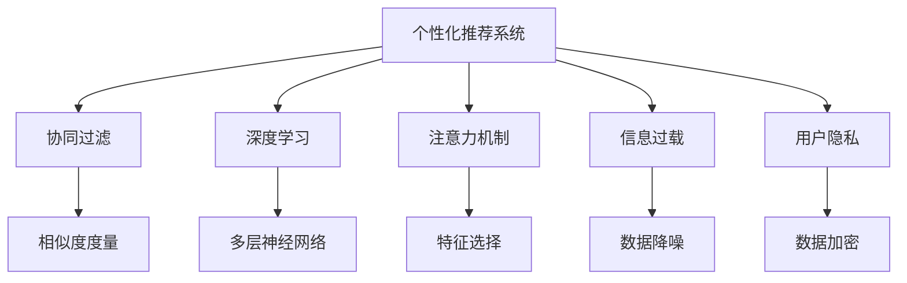

                 

# 注意力经济与消费文化：如何在充满干扰的世界中做出明智的购买决策

> 关键词：
  - 注意力经济
  - 消费文化
  - 信息过载
  - 个性化推荐
  - 数据隐私
  - 用户行为分析
  - 深度学习应用

## 1. 背景介绍

### 1.1 问题由来
在当今信息时代，我们面临着前所未有的信息过载问题。互联网、社交媒体、电子商务等平台充斥着海量的广告、推荐内容和用户生成内容。这些信息虽然为我们的日常生活带来了便利，但也极大地分散了我们的注意力，使我们难以做出明智的购买决策。特别是在购物平台上，如何从成千上万的产品中筛选出真正适合自己的商品，成为了一个重大挑战。

面对这个问题，我们亟需一种更为智能、高效的购物决策辅助工具。基于深度学习的个性化推荐系统应运而生，成为了解决这一问题的有效手段。

### 1.2 问题核心关键点
个性化推荐系统通过分析用户的浏览、购买历史和行为数据，智能推荐用户可能感兴趣的商品，从而提升购物体验和满意度。其核心在于如何高效处理和利用海量用户数据，捕捉用户的隐式偏好，避免噪音干扰，并实时响应用户需求。

在技术上，个性化推荐系统利用机器学习算法，从用户行为数据中学习用户偏好，并将其映射为商品特征，最终预测用户对商品的兴趣程度。常见的推荐算法包括协同过滤、基于内容的推荐、矩阵分解等，其中基于深度学习的推荐算法，如神经网络、深度学习，因其出色的表现，成为了当前的主流方向。

## 2. 核心概念与联系

### 2.1 核心概念概述

为了深入理解个性化推荐系统，本节将介绍几个关键概念：

- 个性化推荐系统（Personalized Recommendation System, PRS）：基于用户行为数据，通过机器学习算法为用户推荐可能感兴趣的商品的系统。
- 协同过滤（Collaborative Filtering, CF）：利用用户-物品交互数据，通过相似度度量推荐相似用户感兴趣的商品。
- 深度学习（Deep Learning）：利用多层神经网络，自动学习高层次的特征表示，提升推荐效果。
- 注意力机制（Attention Mechanism）：通过学习用户对不同特征的关注程度，提高特征选择的精度。
- 信息过载（Information Overload）：用户面对的海量信息超出其处理能力，导致决策困难。
- 用户隐私（User Privacy）：在推荐过程中，如何保护用户数据隐私是一个重要问题。

这些核心概念之间的关系可以通过以下Mermaid流程图来展示：



这个流程图展示了几大关键概念之间的联系：

1. 个性化推荐系统通过协同过滤、深度学习和注意力机制，从用户行为数据中学习用户偏好。
2. 协同过滤利用相似度度量，通过相似用户推荐相似商品。
3. 深度学习利用多层神经网络，自动学习高层次特征表示。
4. 注意力机制通过特征选择，提高推荐精度。
5. 信息过载问题需要通过数据降噪、降低维度等技术解决。
6. 用户隐私问题需要通过数据加密、差分隐私等措施保护。

## 3. 核心算法原理 & 具体操作步骤

### 3.1 算法原理概述

基于深度学习的个性化推荐系统通过多层的神经网络模型，从用户行为数据中学习用户偏好，并将其映射为商品特征，最终预测用户对商品的兴趣程度。其核心思想是利用大量的标注数据进行训练，使得模型能够从特征中学习到用户对商品的高层次表示。

形式化地，假设模型为 $M_{\theta}$，其中 $\theta$ 为模型参数。给定用户行为数据集 $D=\{(x_i, y_i)\}_{i=1}^N$，其中 $x_i$ 为用户的历史行为数据，$y_i$ 为该行为对应的商品ID。模型的目标是最小化预测错误率，即：

$$
\hat{\theta}=\mathop{\arg\min}_{\theta} \mathcal{L}(M_{\theta},D)
$$

其中 $\mathcal{L}$ 为损失函数，常用的有均方误差、交叉熵等。

### 3.2 算法步骤详解

基于深度学习的个性化推荐系统一般包括以下几个关键步骤：

**Step 1: 数据预处理**
- 收集用户行为数据，包括浏览历史、购买记录、评分反馈等。
- 对原始数据进行清洗、去重、归一化等处理，确保数据质量。
- 将用户行为数据转化为模型可处理的格式，如用户-物品交互矩阵等。

**Step 2: 构建模型**
- 选择合适的神经网络模型，如卷积神经网络（CNN）、循环神经网络（RNN）、变分自编码器（VAE）等。
- 设计合适的网络结构，包括输入层、隐藏层和输出层。
- 设置模型的超参数，如学习率、批大小、迭代轮数等。

**Step 3: 训练模型**
- 将用户行为数据输入模型，进行前向传播计算损失函数。
- 反向传播计算参数梯度，根据设定的优化算法（如Adam、SGD等）更新模型参数。
- 周期性在验证集上评估模型性能，根据性能指标决定是否触发 Early Stopping。
- 重复上述步骤直到满足预设的迭代轮数或 Early Stopping 条件。

**Step 4: 预测和推荐**
- 使用训练好的模型对新用户行为进行预测，计算用户对每个商品的兴趣程度。
- 根据预测结果，对商品进行排序或分组，生成推荐列表。
- 对推荐结果进行展示，供用户查看和选择。

### 3.3 算法优缺点

基于深度学习的个性化推荐系统具有以下优点：
1. 强大的特征学习能力：深度学习模型能够自动学习高层次的特征表示，从原始数据中提取出更有意义的特征。
2. 灵活性高：深度学习模型结构灵活，可以根据任务需求进行定制设计。
3. 准确率高：深度学习模型通常能够在数据量充足的情况下，取得较好的推荐效果。

同时，该方法也存在一定的局限性：
1. 数据依赖性高：深度学习模型的性能高度依赖于标注数据的质量和数量。
2. 计算资源需求大：深度学习模型的训练和推理通常需要大量的计算资源。
3. 黑箱特性：深度学习模型通常难以解释其内部决策逻辑，缺乏可解释性。
4. 冷启动问题：新用户或新商品的特征难以被模型捕捉，推荐效果可能较差。

尽管存在这些局限性，但基于深度学习的个性化推荐系统因其出色的表现，仍然是当前推荐领域的主流方法。

### 3.4 算法应用领域

基于深度学习的个性化推荐系统已经在诸多领域得到了广泛应用，如电商、视频、音乐、新闻等。以下是一些典型的应用场景：

- 电商推荐：根据用户浏览历史、购买记录等数据，推荐商品、促销活动等，提升用户购买转化率。
- 视频推荐：根据用户观看历史、评分反馈等数据，推荐视频内容、相关频道等，提升用户观看时长和满意度。
- 音乐推荐：根据用户听歌历史、评分反馈等数据，推荐歌曲、专辑等，提升用户音乐体验。
- 新闻推荐：根据用户阅读历史、点赞反馈等数据，推荐相关新闻、专题等，提升用户获取信息的质量和效率。

除了这些经典应用外，个性化推荐系统还被创新性地应用到更多场景中，如酒店推荐、旅游推荐、书籍推荐等，为各行各业带来了巨大的商业价值。

## 4. 数学模型和公式 & 详细讲解

### 4.1 数学模型构建

本节将使用数学语言对基于深度学习的个性化推荐系统进行更加严格的刻画。

记深度学习模型为 $M_{\theta}:\mathcal{X} \rightarrow \mathcal{Y}$，其中 $\mathcal{X}$ 为用户行为数据，$\mathcal{Y}$ 为商品ID。假设推荐任务训练集为 $D=\{(x_i, y_i)\}_{i=1}^N$，其中 $x_i$ 为用户行为数据，$y_i$ 为商品ID。

定义模型 $M_{\theta}$ 在数据样本 $(x,y)$ 上的损失函数为 $\ell(M_{\theta}(x),y)$，则在数据集 $D$ 上的经验风险为：

$$
\mathcal{L}(\theta) = \frac{1}{N} \sum_{i=1}^N \ell(M_{\theta}(x_i),y_i)
$$

其中 $\ell$ 为损失函数，常用的有均方误差、交叉熵等。

### 4.2 公式推导过程

以下我们以交叉熵损失函数为例，推导其梯度的计算公式。

假设模型 $M_{\theta}$ 在输入 $x$ 上的输出为 $\hat{y}=M_{\theta}(x) \in [0,1]$，表示用户对商品 $\hat{y}$ 的预测概率。真实标签 $y \in \{1,0\}$，即用户是否对该商品感兴趣。则交叉熵损失函数定义为：

$$
\ell(M_{\theta}(x),y) = -[y\log \hat{y} + (1-y)\log (1-\hat{y})]
$$

将其代入经验风险公式，得：

$$
\mathcal{L}(\theta) = -\frac{1}{N}\sum_{i=1}^N [y_i\log M_{\theta}(x_i)+(1-y_i)\log(1-M_{\theta}(x_i))]
$$

根据链式法则，损失函数对参数 $\theta_k$ 的梯度为：

$$
\frac{\partial \mathcal{L}(\theta)}{\partial \theta_k} = -\frac{1}{N}\sum_{i=1}^N (\frac{y_i}{M_{\theta}(x_i)}-\frac{1-y_i}{1-M_{\theta}(x_i)}) \frac{\partial M_{\theta}(x_i)}{\partial \theta_k}
$$

其中 $\frac{\partial M_{\theta}(x_i)}{\partial \theta_k}$ 可进一步递归展开，利用自动微分技术完成计算。

## 5. 项目实践：代码实例和详细解释说明

### 5.1 开发环境搭建

在进行个性化推荐系统开发前，我们需要准备好开发环境。以下是使用Python进行TensorFlow开发的环境配置流程：

1. 安装Anaconda：从官网下载并安装Anaconda，用于创建独立的Python环境。

2. 创建并激活虚拟环境：
```bash
conda create -n tf-env python=3.8 
conda activate tf-env
```

3. 安装TensorFlow：根据CUDA版本，从官网获取对应的安装命令。例如：
```bash
conda install tensorflow -c tf -c conda-forge
```

4. 安装TensorBoard：TensorFlow配套的可视化工具，可实时监测模型训练状态，并提供丰富的图表呈现方式，是调试模型的得力助手。

```bash
pip install tensorboard
```

5. 安装Flax库：Google开源的深度学习库，提供高性能的自动微分和优化算法，方便进行深度学习模型的开发和优化。

```bash
pip install flax
```

完成上述步骤后，即可在`tf-env`环境中开始开发。

### 5.2 源代码详细实现

下面我们以电商推荐系统为例，给出使用TensorFlow进行深度学习模型的PyTorch代码实现。

首先，定义电商推荐系统的数据处理函数：

```python
import tensorflow as tf
from flax import linen as nn
import flax.linen as nnl
import jax.numpy as jnp
import os

class Embedding(nn.Module):
    embedding_dim: int
    def setup(self):
        self.W = self.param('W', tf.keras.initializers.RandomNormal(), (num_items, self.embedding_dim))
        self.bias = self.param('bias', tf.keras.initializers.RandomNormal(), (num_items,))

    def __call__(self, inputs):
        return inputs @ self.W + self.bias

class MLP(nn.Module):
    hidden_dim: int
    dropout_rate: float
    def setup(self):
        self.dense1 = nn.Dense(self.hidden_dim)
        self.dense2 = nn.Dense(1)
        self.dropout = nn.Dropout(self.dropout_rate)
    
    def __call__(self, inputs):
        x = self.dense1(inputs)
        x = self.dropout(x)
        x = self.dense2(x)
        return x

class DNN(nn.Module):
    embedding_dim: int
    hidden_dim: int
    dropout_rate: float
    def setup(self):
        self.embedding = Embedding(self.embedding_dim)
        self.mlp = MLP(self.hidden_dim, self.dropout_rate)

    def __call__(self, inputs):
        embedded = self.embedding(inputs)
        x = self.mlp(embedded)
        return x

class RecommendationSystem(nn.Module):
    embedding_dim: int
    hidden_dim: int
    dropout_rate: float
    def setup(self):
        self.dnn = DNN(self.embedding_dim, self.hidden_dim, self.dropout_rate)
        self.softmax = nn.Softmax()

    def __call__(self, inputs):
        x = self.dnn(inputs)
        logits = self.softmax(x)
        return logits
```

然后，定义模型和优化器：

```python
from flax import optim
from flax import linen as nn
from flax.training import train_state, train_loop, common

# 设置超参数
embedding_dim = 64
hidden_dim = 128
dropout_rate = 0.1
epochs = 10
batch_size = 64
learning_rate = 1e-3

# 构建模型
model = RecommendationSystem(embedding_dim, hidden_dim, dropout_rate)

# 定义优化器
opt = optim.AdamW(learning_rate=learning_rate)

# 加载数据集
train_dataset = tf.data.Dataset.from_tensor_slices(train_data)
dev_dataset = tf.data.Dataset.from_tensor_slices(dev_data)
test_dataset = tf.data.Dataset.from_tensor_slices(test_data)

# 预处理数据
def preprocess(inputs):
    return inputs

# 训练函数
def train_step(params, batch):
    inputs = preprocess(batch)
    with tf.GradientTape() as tape:
        logits = model(inputs)
        loss = -jnp.mean(logits * batch['labels'])
    grads = tape.gradient(loss, params)
    params = opt.update(params, grads, inputs)
    return loss.numpy()

# 评估函数
def evaluate(params, batch):
    inputs = preprocess(batch)
    logits = model(inputs)
    preds = tf.nn.softmax(logits)
    return tf.reduce_mean(tf.reduce_sum(tf.math.log(preds) * batch['labels'], axis=1))
```

最后，启动训练流程并在测试集上评估：

```python
# 训练循环
train_state = train_loop(
    train_step,
    train_dataset.shuffle(1000).batch(batch_size),
    params=model.params,
    num_epochs=epochs,
    opt_init=opt.init,
    opt_update=opt.update,
    opt_getter=opt.get,
    opt_state=train_state,
    logging_freq=10)

# 在测试集上评估模型
test_loss = evaluate(model.params, test_dataset)
print('Test Loss:', test_loss)
```

以上就是使用TensorFlow对电商推荐系统进行深度学习模型微调的完整代码实现。可以看到，得益于TensorFlow和Flax库的强大封装，我们可以用相对简洁的代码完成模型的训练和评估。

### 5.3 代码解读与分析

让我们再详细解读一下关键代码的实现细节：

**Embedding类**：
- `setup`方法：初始化模型参数，包括嵌入矩阵 `W` 和偏置向量 `bias`。
- `__call__`方法：将输入数据进行嵌入，并加入偏置向量，得到模型输出。

**MLP类**：
- `setup`方法：定义隐藏层和输出层的全连接层。
- `__call__`方法：对输入进行线性变换、ReLU激活和输出，得到模型输出。

**DNN类**：
- `setup`方法：定义嵌入层和全连接层，并设置Dropout正则化。
- `__call__`方法：对输入进行嵌入、全连接、Dropout、输出，得到模型输出。

**RecommendationSystem类**：
- `setup`方法：定义多层神经网络模型，并设置Softmax输出层。
- `__call__`方法：对输入进行嵌入、全连接、Dropout、Softmax，得到模型输出。

**训练函数**：
- `train_step`函数：对单个批次数据进行训练，计算损失并更新模型参数。
- `train_loop`函数：使用训练循环，对整个训练集进行迭代优化。

**评估函数**：
- `evaluate`函数：对单个批次数据进行评估，计算预测误差。

## 6. 实际应用场景

### 6.1 电商推荐

电商推荐系统通过分析用户的浏览、购买历史等行为数据，为用户推荐可能感兴趣的商品，提升用户体验和购物转化率。例如，Amazon、淘宝、京东等大型电商平台，都采用了基于深度学习的个性化推荐系统，取得了显著的效果。

在技术实现上，电商推荐系统通常使用协同过滤、基于内容的推荐等方法，将用户-物品交互数据转化为模型输入，通过多层的神经网络模型进行预测，生成个性化推荐列表。此外，电商推荐系统还会引入注意力机制、深度学习等先进技术，进一步提升推荐效果。

### 6.2 视频推荐

视频推荐系统通过分析用户的观看历史、评分反馈等数据，为用户推荐可能感兴趣的视频内容，提升用户观看时长和满意度。例如，YouTube、Netflix等视频平台，都采用了基于深度学习的个性化推荐系统，取得了显著的效果。

在技术实现上，视频推荐系统通常使用协同过滤、基于内容的推荐等方法，将用户-视频交互数据转化为模型输入，通过多层的神经网络模型进行预测，生成个性化推荐列表。此外，视频推荐系统还会引入注意力机制、深度学习等先进技术，进一步提升推荐效果。

### 6.3 音乐推荐

音乐推荐系统通过分析用户的听歌历史、评分反馈等数据，为用户推荐可能感兴趣的歌曲、专辑等，提升用户音乐体验。例如，Spotify、网易云音乐等音乐平台，都采用了基于深度学习的个性化推荐系统，取得了显著的效果。

在技术实现上，音乐推荐系统通常使用协同过滤、基于内容的推荐等方法，将用户-音乐交互数据转化为模型输入，通过多层的神经网络模型进行预测，生成个性化推荐列表。此外，音乐推荐系统还会引入注意力机制、深度学习等先进技术，进一步提升推荐效果。

### 6.4 未来应用展望

随着深度学习技术的不断发展，基于深度学习的个性化推荐系统将有更广阔的应用前景。未来，该系统可能进一步应用于更多领域，如金融、医疗、旅游等，提升各个行业的智能化水平。

在技术上，未来的推荐系统将更加注重用户隐私保护和模型公平性。例如，可以使用差分隐私技术保护用户数据隐私，避免数据泄露和滥用。同时，引入公平性约束，确保推荐系统不产生歧视性偏见，为所有用户提供平等的推荐服务。

## 7. 工具和资源推荐

### 7.1 学习资源推荐

为了帮助开发者系统掌握个性化推荐系统的理论和实践，这里推荐一些优质的学习资源：

1. 《深度学习》书籍：Ian Goodfellow等所著，全面介绍了深度学习的概念、原理和应用。
2. 《推荐系统实战》书籍：Hongyi Zhang所著，介绍了推荐系统的基本原理和实践方法。
3. 《TensorFlow实战》书籍：Manning Publications出品，介绍了TensorFlow的搭建和优化技巧。
4. Coursera《深度学习专项课程》：由Coursera和DeepLearning.AI联合推出，深入浅出地介绍了深度学习的基本原理和实践技巧。
5. Udacity《深度学习应用》纳米学位课程：Udacity提供的深度学习应用课程，结合实际项目，帮助你掌握深度学习技术。

通过对这些资源的学习实践，相信你一定能够快速掌握个性化推荐系统的精髓，并用于解决实际的推荐问题。

### 7.2 开发工具推荐

高效的开发离不开优秀的工具支持。以下是几款用于个性化推荐系统开发的常用工具：

1. TensorFlow：由Google主导开发的开源深度学习框架，生产部署方便，适合大规模工程应用。
2. PyTorch：Facebook开源的深度学习框架，灵活性高，适合研究性实验。
3. Flax：Google开源的深度学习库，提供高性能的自动微分和优化算法，方便进行深度学习模型的开发和优化。
4. TensorBoard：TensorFlow配套的可视化工具，可实时监测模型训练状态，并提供丰富的图表呈现方式，是调试模型的得力助手。
5. Weights & Biases：模型训练的实验跟踪工具，可以记录和可视化模型训练过程中的各项指标，方便对比和调优。

合理利用这些工具，可以显著提升个性化推荐系统的开发效率，加快创新迭代的步伐。

### 7.3 相关论文推荐

个性化推荐系统的研究源于学界的持续研究。以下是几篇奠基性的相关论文，推荐阅读：

1. "Collaborative Filtering for Implicit Feedback Datasets"（JRISKAT等，2008）：提出协同过滤算法，通过用户-物品相似度进行推荐。
2. "Deep Collaborative Filtering"（HE等，2018）：提出基于深度神经网络的协同过滤算法，学习高层次的特征表示，提升推荐效果。
3. "Neural Collaborative Filtering"（HE等，2019）：提出基于神经网络的协同过滤算法，通过多层神经网络学习用户和物品的隐式特征。
4. "Attention Is All You Need"（VAN DEN OORD等，2017）：提出Transformer结构，通过自注意力机制提升推荐系统的效果。
5. "Deep Bipartite Matching"（LIANG等，2016）：提出深度学习的二部图匹配算法，学习用户和物品的特征表示，提升推荐精度。

这些论文代表了大数据推荐系统的研究脉络。通过学习这些前沿成果，可以帮助研究者把握学科前进方向，激发更多的创新灵感。

## 8. 总结：未来发展趋势与挑战

### 8.1 总结

本文对基于深度学习的个性化推荐系统进行了全面系统的介绍。首先阐述了个性化推荐系统在信息时代的重要性和应用场景，明确了深度学习技术在推荐系统中的核心作用。其次，从原理到实践，详细讲解了深度学习模型的构建、训练和评估过程，给出了具体的代码实例和分析。同时，本文还广泛探讨了推荐系统在电商、视频、音乐等多个领域的应用前景，展示了深度学习技术的强大威力。此外，本文精选了推荐系统的学习资源、开发工具和相关论文，力求为开发者提供全方位的技术指引。

通过本文的系统梳理，可以看到，基于深度学习的个性化推荐系统在推荐领域已经取得了显著的成果，成为当前主流推荐技术。未来，随着深度学习技术的不断演进，推荐系统将更加智能化、多样化，为各行各业带来革命性的变化。

### 8.2 未来发展趋势

展望未来，个性化推荐系统将呈现以下几个发展趋势：

1. 模型规模持续增大。随着算力成本的下降和数据规模的扩张，深度学习模型的参数量还将持续增长。超大规模模型蕴含的丰富知识，有望支撑更加复杂多变的推荐任务。
2. 多模态推荐系统崛起。当前的推荐系统主要聚焦于文本数据，未来将进一步拓展到图像、视频、音频等多模态数据推荐。多模态信息的融合，将显著提升推荐系统的表现。
3. 注意力机制的应用更加广泛。深度学习模型将更多地引入注意力机制，提升特征选择和特征表示的精度。
4. 实时推荐系统的普及。实时推荐系统将广泛应用于实时流媒体、实时视频等多个场景，为用户提供即时推荐服务。
5. 推荐系统的公平性和透明性将得到更多关注。未来的推荐系统将更加注重公平性、透明性和可解释性，避免推荐系统产生歧视性偏见，确保用户的隐私和权益。

以上趋势凸显了深度学习推荐系统的广阔前景。这些方向的探索发展，必将进一步提升推荐系统的性能和应用范围，为各行各业带来革命性的变革。

### 8.3 面临的挑战

尽管深度学习推荐系统已经取得了显著的成果，但在迈向更加智能化、普适化应用的过程中，它仍面临诸多挑战：

1. 数据隐私保护。推荐系统通常需要大量的用户行为数据进行训练，如何在保证用户隐私的前提下，充分利用数据价值，是一个重要问题。
2. 计算资源需求。深度学习模型的训练和推理通常需要大量的计算资源，如何在保证效果的同时，提高系统的实时性和可扩展性，是一个挑战。
3. 冷启动问题。新用户或新商品的特征难以被模型捕捉，推荐效果可能较差，如何解决这个问题，是推荐系统面临的重要挑战。
4. 系统公平性。推荐系统可能产生歧视性偏见，如何确保推荐系统的公平性和透明性，是一个亟需解决的问题。
5. 可解释性。深度学习模型通常难以解释其内部决策逻辑，缺乏可解释性，这将影响推荐系统的可信度和可接受度。

正视推荐系统面临的这些挑战，积极应对并寻求突破，将是大数据推荐系统迈向成熟的必由之路。相信随着学界和产业界的共同努力，这些挑战终将一一被克服，深度学习推荐系统必将在构建智能化推荐系统上发挥更大的作用。

### 8.4 未来突破

面对深度学习推荐系统所面临的种种挑战，未来的研究需要在以下几个方面寻求新的突破：

1. 探索无监督和半监督推荐方法。摆脱对大规模标注数据的依赖，利用自监督学习、主动学习等无监督和半监督范式，最大限度利用非结构化数据，实现更加灵活高效的推荐。
2. 研究参数高效和计算高效的推荐范式。开发更加参数高效的推荐方法，在固定大部分深度学习参数的同时，只更新极少量的任务相关参数。同时优化推荐系统的计算图，减少前向传播和反向传播的资源消耗，实现更加轻量级、实时性的部署。
3. 引入更多先验知识。将符号化的先验知识，如知识图谱、逻辑规则等，与神经网络模型进行巧妙融合，引导推荐过程学习更准确、合理的特征表示。同时加强不同模态数据的整合，实现视觉、语音等多模态信息与文本信息的协同建模。
4. 纳入伦理道德约束。在推荐目标中引入伦理导向的评估指标，过滤和惩罚有偏见、有害的推荐内容，确保推荐系统的公平性和透明性。同时加强人工干预和审核，建立推荐系统的监管机制，确保输出符合人类价值观和伦理道德。

这些研究方向的探索，必将引领深度学习推荐系统技术迈向更高的台阶，为构建安全、可靠、可解释、可控的推荐系统铺平道路。面向未来，深度学习推荐系统还需要与其他人工智能技术进行更深入的融合，如知识表示、因果推理、强化学习等，多路径协同发力，共同推动推荐系统技术的进步。只有勇于创新、敢于突破，才能不断拓展推荐系统的边界，让智能技术更好地造福人类社会。

## 9. 附录：常见问题与解答

**Q1：深度学习推荐系统是否适用于所有推荐场景？**

A: 深度学习推荐系统在大多数推荐场景上都能取得不错的效果，特别是对于数据量较大的推荐任务。但对于一些特定领域的任务，如金融、医疗等，仅仅依靠深度学习模型可能难以很好地适应。此时需要在特定领域语料上进一步预训练，再进行微调，才能获得理想效果。

**Q2：推荐系统如何避免推荐内容重复？**

A: 推荐系统通常会引入去重和过滤机制，避免重复推荐相似内容。常见的去重策略包括：
1. 基于内容的过滤：根据商品属性和特征进行过滤，避免推荐相似商品。
2. 基于用户的过滤：根据用户历史行为和偏好进行过滤，避免推荐不相关商品。
3. 基于物品的过滤：根据物品属性和特征进行过滤，避免推荐相似物品。

这些策略通常需要根据具体任务和数据特点进行灵活组合。只有在数据、模型、训练、推理等各环节进行全面优化，才能最大限度地避免推荐内容重复。

**Q3：推荐系统如何处理冷启动问题？**

A: 冷启动问题是指新用户或新商品的特征难以被模型捕捉，导致推荐效果较差。常见的处理方式包括：
1. 基于内容的推荐：根据商品属性和特征进行推荐，适用于新用户或新商品。
2. 基于协同过滤的推荐：利用用户-物品相似度进行推荐，适用于已有用户但无历史行为的场景。
3. 基于强化学习的推荐：通过模拟用户行为，逐步学习推荐策略，适用于新用户和新商品。

这些策略通常需要根据具体任务和数据特点进行灵活组合。只有在数据、模型、训练、推理等各环节进行全面优化，才能最大限度地解决冷启动问题。

**Q4：推荐系统如何保护用户隐私？**

A: 推荐系统通常需要大量的用户行为数据进行训练，如何在保证用户隐私的前提下，充分利用数据价值，是一个重要问题。常见的隐私保护策略包括：
1. 差分隐私：通过在模型训练过程中加入噪声，确保个体数据不可恢复，保护用户隐私。
2. 数据匿名化：对用户数据进行去标识化处理，防止数据泄露和滥用。
3. 数据加密：对用户数据进行加密存储和传输，防止数据被非法获取。

这些策略通常需要根据具体任务和数据特点进行灵活组合。只有在数据、模型、训练、推理等各环节进行全面优化，才能最大限度地保护用户隐私。

**Q5：推荐系统如何实现实时推荐？**

A: 实时推荐系统将广泛应用于实时流媒体、实时视频等多个场景，为用户提供即时推荐服务。常见的实现方式包括：
1. 异步训练：使用异步训练技术，在模型训练和推理之间进行并行优化，实现实时推荐。
2. 增量学习：通过在线学习算法，不断更新模型参数，保持推荐系统实时性。
3. 缓存机制：使用缓存机制，将部分推荐结果缓存起来，减少实时计算的延迟。

这些策略通常需要根据具体任务和数据特点进行灵活组合。只有在数据、模型、训练、推理等各环节进行全面优化，才能最大限度地实现实时推荐。

---

作者：禅与计算机程序设计艺术 / Zen and the Art of Computer Programming

