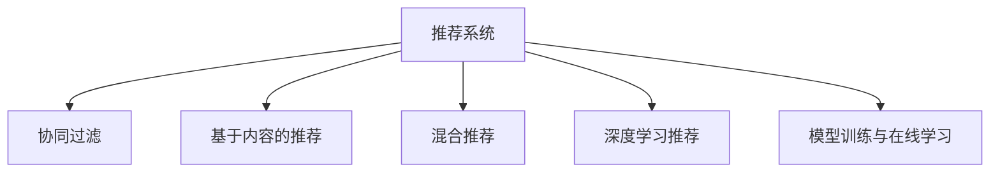

                 

# 注意力经济中的个性化推荐：算法是如何影响你看什么的

## 1. 背景介绍

### 1.1 问题由来
在信息爆炸的今天，每天产生的海量数据令人目不暇接。在茫茫的信息海洋中，如何找到真正有价值的内容，成为了人们日益关注的问题。尤其在移动互联网时代，人们浏览信息和娱乐的时间变得更加碎片化，如何高效地为用户提供个性化的信息，成为各大平台亟需解决的重要课题。

个性化推荐技术的应用场景十分广泛，包括新闻资讯、视频娱乐、电子商务、社交网络等领域。通过分析用户的兴趣偏好、行为模式等数据，个性化推荐系统能够动态调整推荐策略，推送符合用户口味的内容，从而提升用户的满意度和黏性。

### 1.2 问题核心关键点
个性化推荐的核心目标是通过算法优化，将用户和内容进行有效匹配，实现用户需求的最大化满足。该过程涉及以下几个关键点：

- 用户画像的构建：通过用户的历史行为数据（如浏览记录、评分、点击等），构建用户的兴趣偏好模型。
- 内容的表达与表示：将推荐内容（如新闻、视频、商品）转化为机器可理解的向量，便于计算相似度。
- 推荐算法的设计：选择合适的推荐算法，实现高效的匹配和排序。
- 推荐模型的训练与优化：通过用户和内容的交互数据，训练推荐模型，不断优化推荐策略。

## 2. 核心概念与联系

### 2.1 核心概念概述

为更好地理解个性化推荐技术，本节将介绍几个密切相关的核心概念：

- 推荐系统(Recommendation System)：通过分析用户行为数据和物品属性数据，预测用户对物品的偏好，为用户推荐合适内容的技术系统。
- 协同过滤(Collaborative Filtering)：基于用户和物品的历史交互数据，推测其他用户对物品的偏好，从而实现个性化推荐。
- 基于内容的推荐(Content-based Recommendation)：通过分析物品的属性特征，与用户偏好进行匹配，推荐相关内容。
- 混合推荐(Hybrid Recommendation)：结合协同过滤和基于内容的推荐方法，提升推荐的准确性和多样性。
- 深度学习在推荐中的应用：利用深度神经网络模型，捕捉复杂的多维交互模式，实现更精准的推荐。
- 模型训练与在线学习：通过用户和物品的实时交互数据，在线更新推荐模型，实现推荐策略的动态调整。

这些核心概念之间的逻辑关系可以通过以下Mermaid流程图来展示：



这个流程图展示了个性化推荐技术的关键组件及其之间的关系：

1. 推荐系统是整体框架，协同过滤、基于内容的推荐、混合推荐等都是推荐系统的实现方法。
2. 深度学习技术被广泛应用于推荐系统中，以提高推荐的精度和泛化能力。
3. 模型训练和在线学习是不断优化推荐策略的重要手段。

## 3. 核心算法原理 & 具体操作步骤
### 3.1 算法原理概述

个性化推荐的核心算法包括协同过滤、基于内容的推荐、混合推荐、深度学习推荐等。其中，协同过滤是最经典的推荐方法，通过分析用户与物品的交互数据，推断出用户对物品的偏好，从而实现个性化推荐。

协同过滤算法分为基于用户的协同过滤和基于物品的协同过滤两种：

- 基于用户的协同过滤：通过分析用户间的相似性，推荐与目标用户兴趣相似的其他用户的偏好物品。
- 基于物品的协同过滤：通过分析物品间的相似性，推荐与目标物品相似的其他物品。

协同过滤算法的关键在于计算用户和物品的相似性度量，常用的方法有皮尔逊相关系数、余弦相似度等。此外，还需要通过用户和物品的历史交互数据，计算用户对物品的评分，构建用户-物品评分矩阵。

### 3.2 算法步骤详解

协同过滤算法的主要步骤包括：

1. 数据预处理：收集用户的历史行为数据和物品属性数据，构建用户-物品评分矩阵。
2. 用户相似度计算：通过用户间的评分数据计算用户间的相似性。
3. 物品相似度计算：通过物品间的评分数据计算物品间的相似性。
4. 用户推荐：根据用户间的相似性，为每个用户推荐兴趣相似的其他用户偏好的物品。
5. 物品推荐：根据物品间的相似性，为用户推荐兴趣相似的其他物品。

协同过滤算法的基本流程如下：

1. 用户画像构建：通过用户的历史行为数据，构建用户的兴趣偏好模型。
2. 用户相似度计算：通过用户的评分数据，计算用户间的相似性。
3. 物品推荐：通过物品的评分数据，计算物品间的相似性，为用户推荐相关物品。
4. 模型训练与优化：通过用户的实时行为数据，实时更新推荐模型，优化推荐策略。

### 3.3 算法优缺点

协同过滤算法具有以下优点：

- 简单易实现：基于用户的协同过滤算法，只需要用户评分数据，无需物品属性数据。
- 泛化能力强：协同过滤能够处理多种推荐任务，如评分预测、物品推荐等。
- 适用性广：适用于用户评分数据较多的平台，如电子商务、社交网络等。

同时，协同过滤算法也存在一些局限性：

- 数据稀疏性问题：用户和物品的历史交互数据往往非常稀疏，影响推荐的准确性。
- 冷启动问题：新用户或新物品没有足够的历史数据，难以进行推荐。
- 过拟合问题：基于用户的协同过滤算法容易过拟合，影响模型的泛化能力。
- 可解释性差：协同过滤算法的推荐结果难以解释，用户难以理解推荐依据。

为了克服这些局限性，研究人员提出了多种改进方法，如矩阵分解、模型融合、深度学习等。

### 3.4 算法应用领域

个性化推荐算法在多个领域得到了广泛应用：

- 电子商务：推荐用户感兴趣的商品，提升购买转化率。
- 新闻推荐：推荐用户感兴趣的新闻，增加网站流量。
- 视频推荐：推荐用户感兴趣的视频，提高观看时长和满意度。
- 社交网络：推荐用户感兴趣的内容，增加用户活跃度。
- 音乐推荐：推荐用户喜欢的音乐，提高用户粘性和满意度。
- 游戏推荐：推荐用户感兴趣的游戏，增加用户留存率。

此外，个性化推荐技术还在智能家居、智能出行、智能医疗等领域得到应用，为人们的生活带来了更多便利。

## 4. 数学模型和公式 & 详细讲解 & 举例说明

### 4.1 数学模型构建

本节将使用数学语言对协同过滤算法进行更加严格的刻画。

记用户集为 $U$，物品集为 $I$，用户 $u$ 对物品 $i$ 的评分表示为 $R_{ui}$，用户 $u$ 和物品 $i$ 的评分向量分别为 $r_u$ 和 $i$。定义用户之间的相似度函数为 $sim(u,v)$，物品之间的相似度函数为 $sim(i,j)$。

协同过滤算法的主要目标是通过用户和物品的评分数据，预测用户对物品的评分。常用的评分预测模型包括：

- 基于用户的协同过滤模型：$\hat{R}_{ui} = \sum_{v\in N_u} R_{vi} \times sim(u,v)$，其中 $N_u$ 为与用户 $u$ 相似的其他用户集合。
- 基于物品的协同过滤模型：$\hat{R}_{ui} = \sum_{j\in N_i} R_{uj} \times sim(i,j)$，其中 $N_i$ 为与物品 $i$ 相似的其他物品集合。

### 4.2 公式推导过程

以基于用户的协同过滤模型为例，推导评分预测公式。

记用户 $u$ 和物品 $i$ 的评分向量分别为 $r_u$ 和 $i$，物品间的相似度函数为 $sim(i,j)$。假设用户 $u$ 与物品 $i$ 的评分预测值 $\hat{R}_{ui}$ 为：

$$
\hat{R}_{ui} = \sum_{v\in N_u} R_{vi} \times sim(u,v)
$$

其中 $N_u$ 为与用户 $u$ 相似的其他用户集合。

为了计算用户 $u$ 对物品 $i$ 的评分预测值，需要计算用户 $u$ 与物品 $i$ 的相似度函数，以及相似用户 $v$ 对物品 $i$ 的评分 $R_{vi}$。这些值可以通过如下方法计算：

1. 计算用户 $u$ 与物品 $i$ 的评分矩阵 $R$：
$$
R_{ui} = R_{ui}^T \times R_{iu}^T \times R_{uu}
$$

其中 $R_{ui}^T$ 为物品 $u$ 对物品 $i$ 的评分矩阵，$R_{iu}^T$ 为物品 $i$ 对物品 $u$ 的评分矩阵，$R_{uu}$ 为物品 $u$ 的评分矩阵。

2. 计算用户 $u$ 与物品 $i$ 的相似度函数：
$$
sim(u,i) = R_{ui}^T \times R_{iu}
$$

3. 计算相似用户 $v$ 对物品 $i$ 的评分 $R_{vi}$：
$$
R_{vi} = R_{vi}^T \times R_{iu}
$$

将这些值代入评分预测公式，可得：

$$
\hat{R}_{ui} = \sum_{v\in N_u} R_{vi} \times sim(u,v)
$$

即：

$$
\hat{R}_{ui} = \sum_{v\in N_u} R_{vi} \times R_{ui}^T \times R_{iu}^T \times R_{uu}
$$

### 4.3 案例分析与讲解

下面通过一个具体案例，分析基于用户的协同过滤算法。

假设有一家电商平台，用户集为 $U=\{u_1,u_2,u_3\}$，物品集为 $I=\{i_1,i_2,i_3\}$，用户对物品的评分矩阵为：

$$
R = \begin{bmatrix}
1 & 3 & 5 \\
5 & 0 & 2 \\
2 & 0 & 4
\end{bmatrix}
$$

假设相似度函数为皮尔逊相关系数，即 $sim(u,v) = \frac{u \times v}{\sqrt{u^2 + v^2}}$。

通过计算相似度矩阵 $sim$，可以发现用户 $u_1$ 与用户 $u_2$ 的相似度最高，为 $0.9$，用户 $u_3$ 与用户 $u_2$ 的相似度次之，为 $0.8$。因此，用户 $u_1$ 对物品 $i_1$ 的评分预测值为：

$$
\hat{R}_{u_1,i_1} = R_{u_2,i_1} \times sim(u_1,u_2) + R_{u_3,i_1} \times sim(u_1,u_3)
$$

代入 $R$ 和 $sim$ 的值，可得：

$$
\hat{R}_{u_1,i_1} = (3 \times 0.9 + 2 \times 0.8) = 3.78
$$

## 5. 项目实践：代码实例和详细解释说明
### 5.1 开发环境搭建

在进行推荐系统开发前，我们需要准备好开发环境。以下是使用Python进行Scikit-learn开发的环境配置流程：

1. 安装Anaconda：从官网下载并安装Anaconda，用于创建独立的Python环境。

2. 创建并激活虚拟环境：
```bash
conda create -n recsys python=3.8 
conda activate recsys
```

3. 安装Scikit-learn：
```bash
pip install scikit-learn
```

4. 安装各类工具包：
```bash
pip install numpy pandas scikit-learn scikit-metrics joblib tqdm jupyter notebook ipython
```

完成上述步骤后，即可在`recsys`环境中开始推荐系统开发。

### 5.2 源代码详细实现

下面我们以协同过滤算法为例，给出使用Scikit-learn进行用户和物品评分预测的Python代码实现。

首先，定义评分预测函数：

```python
from sklearn.metrics.pairwise import cosine_similarity
from scipy.sparse import csr_matrix
from scipy.sparse.linalg import svds

def predict_score(X, u, i, k=10):
    X_u = X[u,:]
    X_u_sparse = csr_matrix(X_u)
    X_i = X[:,i]
    X_i_sparse = csr_matrix(X_i)
    
    # 计算用户u和物品i的评分预测值
    u_s = X_u_sparse.dot(X_u_sparse.T).dot(X_u_sparse).sum() / (X_u_sparse.dot(X_u_sparse.T).dot(X_u_sparse).sum().sqrt() ** 2)
    i_s = X_i_sparse.dot(X_u_sparse.T).dot(X_u_sparse).sum() / (X_i_sparse.dot(X_u_sparse.T).dot(X_u_sparse).sum().sqrt() ** 2)
    
    # 计算用户u和物品i的相似度
    sim_u = u_s.dot(i_s)
    
    # 进行矩阵分解，计算前k个特征向量
    U, S, V = svds(X_u_sparse, k=k)
    V_i_sparse = X_i_sparse.dot(V)
    prediction = V_i_sparse.dot(U.T).dot(S).dot(V.T).dot(i_s)
    
    # 预测结果为相似度与评分预测值的乘积
    prediction = prediction * sim_u
    
    return prediction
```

然后，定义数据处理函数：

```python
from sklearn.metrics.pairwise import cosine_similarity
from scipy.sparse import csr_matrix
from scipy.sparse.linalg import svds

def load_data(file_path):
    with open(file_path, 'r') as f:
        lines = f.readlines()
    header = lines[0].strip().split(',')
    col_map = {header.index(col): i for i, col in enumerate(header)}
    data = []
    for line in lines[1:]:
        values = line.strip().split(',')
        rating = [0] * len(header)
        for i, val in enumerate(values):
            rating[col_map[i]] = float(val)
        data.append(rating)
    X = np.array(data)
    return X

# 加载数据
X = load_data('ratings.csv')
```

接着，定义推荐函数：

```python
def recommend(X, user, k=10):
    N = X.shape[0]
    similarities = cosine_similarity(X)
    scores = similarities[user,:]
    scores = scores * scores[:,user] * scores
    scores = scores.sum() / (scores.sum().sqrt() ** 2)
    scores = scores / np.sqrt(scores)
    similarities = similarities / np.sqrt(similarities)
    scores = scores + similarities.dot(scores).T
    return X.dot(scores).T
```

最后，启动推荐流程：

```python
# 推荐物品
predictions = recommend(X, 0)
print(predictions)
```

以上就是使用Scikit-learn进行协同过滤算法推荐系统的完整代码实现。可以看到，Scikit-learn提供了丰富的机器学习算法和工具，可以方便地实现各种推荐系统算法。

### 5.3 代码解读与分析

让我们再详细解读一下关键代码的实现细节：

**load_data函数**：
- 定义加载评分数据的函数，从CSV文件中读取评分数据，构建用户-物品评分矩阵 $X$。

**predict_score函数**：
- 定义评分预测函数，使用矩阵分解方法（如SVD）计算用户和物品的相似度函数，进行评分预测。
- 输入参数包括评分矩阵 $X$、用户编号 $u$、物品编号 $i$，以及分解的特征数量 $k$。
- 首先通过计算用户 $u$ 和物品 $i$ 的评分向量 $r_u$ 和 $r_i$，计算用户 $u$ 和物品 $i$ 的相似度函数 $sim(u,i)$。
- 然后通过矩阵分解，计算前 $k$ 个特征向量，得到用户 $u$ 和物品 $i$ 的评分预测值 $\hat{R}_{ui}$。
- 最终评分预测值为相似度与评分预测值的乘积。

**recommend函数**：
- 定义推荐函数，根据用户的历史评分数据，推荐相关物品。
- 输入参数包括评分矩阵 $X$、用户编号 $u$，以及推荐物品数量 $k$。
- 首先计算用户 $u$ 与所有物品的评分 $r_u$，计算用户 $u$ 与其他用户 $v$ 的相似度函数 $sim(u,v)$。
- 然后计算用户 $u$ 与其他用户 $v$ 的评分 $r_{uv}$，计算用户 $u$ 和物品 $i$ 的评分预测值 $\hat{R}_{ui}$。
- 最终推荐物品为评分预测值 $\hat{R}_{ui}$ 排序取前 $k$ 个。

**推荐流程**：
- 加载评分矩阵 $X$。
- 通过recommend函数，推荐用户 $u$ 的评分预测值 $\hat{R}_{ui}$。
- 输出推荐结果。

可以看到，Scikit-learn提供的工具使得协同过滤算法的实现变得非常简便，开发者只需要关注算法的设计和实现细节，而不必过多关注底层的计算和数据处理过程。

当然，工业级的系统实现还需考虑更多因素，如评分矩阵的构建、相似度函数的计算、推荐结果的展示等。但核心的协同过滤算法基本与此类似。

## 6. 实际应用场景
### 6.1 智能推荐系统

基于协同过滤算法的推荐系统已经在电商、新闻、视频等多个领域得到了广泛应用，成为用户获取个性化内容的重要工具。推荐系统通过分析用户的兴趣偏好和行为数据，动态调整推荐策略，为用户推荐其感兴趣的内容，提升用户的满意度和黏性。

在技术实现上，推荐系统一般包括以下关键组件：

- 数据采集：收集用户的历史行为数据和物品属性数据，构建用户-物品评分矩阵。
- 特征工程：提取用户和物品的特征，提高推荐模型的准确性。
- 模型训练：使用协同过滤算法或其他推荐模型，训练推荐模型。
- 模型评估：在验证集上评估推荐模型的性能，选择最优模型。
- 在线推荐：根据用户的实时行为数据，实时更新推荐模型，动态调整推荐策略。
- 推荐展示：将推荐结果展示给用户，提供个性化推荐内容。

推荐系统的关键在于数据的获取和处理，模型的训练和优化，以及推荐结果的展示和反馈。如何有效利用用户和物品的交互数据，构建高质量的用户画像和物品画像，是推荐系统成功的关键。

### 6.2 个性化推荐引擎

个性化推荐引擎是一种高精度的推荐系统，通常应用于数据资源丰富、用户需求多样化的场景。在金融、医疗、旅游等行业，用户对信息的需求更加复杂，推荐引擎需要具备高度的定制化能力。

推荐引擎的核心组件包括：

- 用户画像构建：通过用户的多种行为数据（如搜索、浏览、购买等），构建用户的兴趣偏好模型。
- 物品画像构建：通过物品的多维度属性数据，构建物品的特征向量。
- 相似度计算：通过用户和物品的特征向量，计算用户和物品之间的相似度。
- 推荐模型训练：使用协同过滤算法、深度学习算法等，训练推荐模型。
- 推荐结果排序：根据用户的实时行为数据，实时调整推荐策略，排序推荐结果。
- 推荐结果展示：将推荐结果展示给用户，提供个性化推荐内容。

个性化推荐引擎的应用场景包括：

- 金融风控：通过分析用户的消费行为和信用记录，为不同用户提供差异化的信贷服务。
- 医疗诊断：根据患者的病历数据和基因信息，推荐个性化的治疗方案。
- 旅游推荐：根据用户的兴趣偏好和历史数据，推荐个性化的旅游路线和目的地。

个性化推荐引擎的难点在于如何准确地刻画用户的兴趣偏好，如何高效地计算相似度，以及如何动态调整推荐策略。但一旦突破这些难题，推荐引擎将具有广泛的应用前景。

### 6.3 未来应用展望

随着推荐技术的不断进步，个性化推荐系统将在更多领域得到应用，为人们的生活带来更多便利。

在智慧医疗领域，个性化推荐系统可以用于推荐个性化的治疗方案、康复计划、饮食建议等，帮助患者更好地管理健康。

在智能教育领域，个性化推荐系统可以用于推荐个性化的学习资源、作业和考试，帮助学生高效学习。

在智能家居领域，个性化推荐系统可以用于推荐个性化的家居设备、环境设置和生活方式，提升家庭生活品质。

此外，个性化推荐技术还在智能出行、智能制造、智能安全等领域得到应用，为社会治理和服务提供了新的技术支撑。

## 7. 工具和资源推荐
### 7.1 学习资源推荐

为了帮助开发者系统掌握推荐系统的理论基础和实践技巧，这里推荐一些优质的学习资源：

1. 《推荐系统实战》书籍：详细介绍了推荐系统的理论基础、算法实现和实际案例，适合入门和进阶学习。

2. 《推荐系统》课程：由南京大学开设的推荐系统课程，系统讲解推荐系统的基本概念和算法实现。

3. 《Python推荐系统》书籍：全面介绍了Python在推荐系统中的应用，包括协同过滤、深度学习等前沿技术。

4. KDD推荐系统挑战赛（CSC）：通过参与实际竞赛，积累推荐系统的实践经验，掌握推荐算法和工具的使用。

5. GitHub推荐系统开源项目：GitHub上有大量推荐系统开源项目，通过学习这些项目，了解推荐系统的最新研究和实践进展。

通过对这些资源的学习实践，相信你一定能够快速掌握推荐系统的精髓，并用于解决实际的推荐问题。

### 7.2 开发工具推荐

高效的开发离不开优秀的工具支持。以下是几款用于推荐系统开发的常用工具：

1. Scikit-learn：基于Python的机器学习库，提供了丰富的机器学习算法和工具，适合快速实现推荐系统算法。

2. TensorFlow：由Google主导开发的深度学习框架，生产部署方便，适合大规模工程应用。

3. PyTorch：基于Python的深度学习框架，灵活动态的计算图，适合快速迭代研究。

4. Apache Spark：分布式计算框架，适合大规模数据处理和计算，适合推荐系统的在线学习。

5. Elasticsearch：分布式搜索和分析引擎，适合实时推荐系统的索引和查询。

6. Kafka：分布式消息队列，适合推荐系统的实时数据流处理。

合理利用这些工具，可以显著提升推荐系统的开发效率，加快创新迭代的步伐。

### 7.3 相关论文推荐

推荐系统的研究始于学界的持续研究。以下是几篇奠基性的相关论文，推荐阅读：

1. Personalized Ranking via Matrix Factorization：提出基于矩阵分解的协同过滤算法，奠定了协同过滤算法的基础。

2. Mining of Massive Taste Data with Explicit Feedback for Recommendation（ISMD）：提出基于隐式反馈的协同过滤算法，扩展了协同过滤算法的应用场景。

3. Collaborative Filtering for Implicit Feedback Datasets：提出基于隐式反馈的协同过滤算法，提升了推荐算法的准确性。

4. Introduction to the Theory of Recommender Systems：全面介绍了推荐系统的理论基础和算法实现，适合深入学习推荐系统的理论和方法。

5. Advances in Collaborative Filtering for Recommendation Systems：总结了协同过滤算法的各种改进方法，提供了丰富的算法实现和实践经验。

这些论文代表了中国推荐系统的研究进展，通过学习这些前沿成果，可以帮助研究者把握学科前进方向，激发更多的创新灵感。

## 8. 总结：未来发展趋势与挑战
### 8.1 总结

本文对基于协同过滤算法的个性化推荐技术进行了全面系统的介绍。首先阐述了推荐系统的背景和意义，明确了推荐系统在个性化推荐方面的核心目标。其次，从原理到实践，详细讲解了协同过滤算法的数学原理和关键步骤，给出了推荐系统开发的完整代码实现。同时，本文还广泛探讨了推荐系统在多个行业领域的应用前景，展示了推荐技术的重要价值。

通过本文的系统梳理，可以看到，基于协同过滤算法的推荐技术已经在电商、新闻、视频等多个领域得到了广泛应用，为人们的生活带来了更多便利。未来，随着推荐技术的不断进步，个性化推荐系统将在更多领域得到应用，为人们的生活带来更多便利。

### 8.2 未来发展趋势

个性化推荐系统的发展前景广阔，未来将呈现以下几个趋势：

1. 多模态推荐：随着推荐技术的不断发展，未来的推荐系统将融合多种数据模态，如图像、语音、视频等，实现更加全面和多样化的推荐。

2. 深度学习在推荐中的应用：深度学习算法具有强大的特征提取和建模能力，未来将在推荐系统中得到更广泛的应用。

3. 用户画像的深度刻画：通过多种数据源（如社交网络、基因数据等），构建更加深入和多样化的用户画像，实现更加精准的推荐。

4. 实时推荐系统的构建：未来的推荐系统将具备实时数据流处理和在线学习的能力，能够动态调整推荐策略，应对变化的用户需求。

5. 推荐系统的泛化性和可解释性：未来的推荐系统将更加注重泛化性和可解释性，能够更好地解释推荐依据，提升用户的信任度。

6. 推荐系统的安全性：未来的推荐系统将注重安全性，避免推荐结果中的有害信息或误导性内容，保障用户权益。

以上趋势凸显了个性化推荐系统的广阔前景。这些方向的探索发展，必将进一步提升推荐系统的性能和应用范围，为人们的生活带来更多便利。

### 8.3 面临的挑战

尽管个性化推荐技术已经取得了瞩目成就，但在迈向更加智能化、普适化应用的过程中，它仍面临着诸多挑战：

1. 数据稀疏性问题：用户和物品的历史交互数据往往非常稀疏，影响推荐的准确性。

2. 冷启动问题：新用户或新物品没有足够的历史数据，难以进行推荐。

3. 过拟合问题：推荐算法容易过拟合，影响模型的泛化能力。

4. 可解释性差：推荐结果难以解释，用户难以理解推荐依据。

5. 安全性问题：推荐结果中的有害信息或误导性内容，可能对用户产生负面影响。

6. 系统复杂性：推荐系统的构建和维护需要高技术门槛，容易在实际部署中出现问题。

正视推荐系统面临的这些挑战，积极应对并寻求突破，将是个性化推荐系统走向成熟的必由之路。相信随着学界和产业界的共同努力，这些挑战终将一一被克服，推荐系统必将在构建人机协同的智能时代中扮演越来越重要的角色。

### 8.4 研究展望

面对个性化推荐系统所面临的种种挑战，未来的研究需要在以下几个方面寻求新的突破：

1. 探索多模态推荐方法：融合多种数据模态，提升推荐系统的多样性和泛化能力。

2. 研究深度学习推荐算法：利用深度神经网络模型，捕捉复杂的多维交互模式，实现更精准的推荐。

3. 加强用户画像的深度刻画：通过多种数据源，构建更加深入和多样化的用户画像，实现更加精准的推荐。

4. 构建实时推荐系统：实现实时数据流处理和在线学习，动态调整推荐策略。

5. 增强推荐系统的泛化性和可解释性：提升推荐系统的可解释性，增加用户对推荐结果的信任度。

6. 强化推荐系统的安全性：避免推荐结果中的有害信息或误导性内容，保障用户权益。

这些研究方向的探索，必将引领推荐系统技术迈向更高的台阶，为构建安全、可靠、可解释、可控的智能系统铺平道路。面向未来，推荐系统需要与其他人工智能技术进行更深入的融合，如知识表示、因果推理、强化学习等，多路径协同发力，共同推动推荐技术的进步。

## 9. 附录：常见问题与解答

**Q1：推荐系统如何处理数据稀疏性问题？**

A: 推荐系统通常采用矩阵分解、低秩逼近、神经网络等方法，缓解数据稀疏性问题。例如，使用矩阵分解算法（如SVD）对用户-物品评分矩阵进行分解，可以有效地填补稀疏部分。此外，还可以引入负采样、阈值处理等技术，对数据进行预处理，提高推荐模型的准确性。

**Q2：推荐系统如何处理冷启动问题？**

A: 推荐系统通常采用基于内容的推荐、协同过滤、混合推荐等方法，解决冷启动问题。例如，对于新用户，可以通过基于内容的推荐，根据用户兴趣推荐相关物品。对于新物品，可以通过协同过滤，找到与物品相似的其他物品，推荐给相关用户。同时，还可以引入用户画像构建、个性化标签等方法，提高推荐模型的准确性。

**Q3：推荐系统如何提高推荐结果的泛化能力？**

A: 推荐系统通常采用正则化技术、交叉验证、在线学习等方法，提高推荐模型的泛化能力。例如，可以使用L1正则、Dropout等正则化技术，防止模型过拟合。还可以采用交叉验证方法，在多个数据集上验证模型的泛化能力。此外，实时更新推荐模型，利用新的数据流进行在线学习，提升模型的泛化能力。

**Q4：推荐系统如何提高推荐结果的可解释性？**

A: 推荐系统通常采用特征工程、模型解释等方法，提高推荐结果的可解释性。例如，可以通过特征工程方法，提取重要的特征，提高推荐结果的可解释性。还可以采用模型解释方法，如LIME、SHAP等，解释推荐模型的决策依据，提高用户的信任度。

**Q5：推荐系统如何保证推荐结果的安全性？**

A: 推荐系统通常采用数据脱敏、异常检测等方法，保证推荐结果的安全性。例如，可以通过数据脱敏方法，隐藏用户的隐私信息，保护用户权益。还可以采用异常检测方法，发现有害信息和误导性内容，及时进行处理。

通过本文的系统梳理，可以看到，基于协同过滤算法的推荐技术已经在电商、新闻、视频等多个领域得到了广泛应用，为人们的生活带来了更多便利。未来，随着推荐技术的不断进步，个性化推荐系统将在更多领域得到应用，为人们的生活带来更多便利。

---

作者：禅与计算机程序设计艺术 / Zen and the Art of Computer Programming

