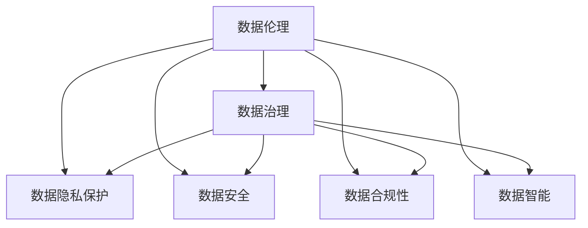

                 

# 注意力经济中的数据伦理与治理

> 关键词：数据伦理, 数据治理, 隐私保护, 数据安全, 合规性, 数据智能, 数据治理框架

## 1. 背景介绍

### 1.1 问题由来

在数字化时代，数据已成为一种战略性资源，日益成为企业竞争的核心要素。随着人工智能和大数据技术的迅猛发展，企业对数据的利用能力日益增强，数据驱动的决策制定和业务优化正变得越来越普遍。然而，数据应用的背后，也隐藏着一系列复杂且重要的问题，特别是数据伦理与治理问题，这些问题往往被忽视，导致数据应用中的诸多伦理风险和法律挑战。

数据伦理和治理问题的核心在于如何在数据采集、存储、处理、共享和利用过程中，保障数据主体的权利，避免数据滥用，确保数据使用的合法合规，同时促进数据的开放和利用。这些问题不仅关系到企业利益和用户隐私，还直接影响到社会的公平正义、法律法规的完善和社会的稳定发展。

因此，针对这一问题，本文将详细探讨数据伦理与治理的基本概念、关键问题和实践方法，为构建健康、可持续的“注意力经济”提供指导。

## 2. 核心概念与联系

### 2.1 核心概念概述

要深刻理解数据伦理与治理问题，首先需要明确几个核心概念：

- **数据伦理（Data Ethics）**：指在数据采集、处理和应用过程中，遵循的道德原则和行为规范，旨在确保数据应用过程中的公正、透明、隐私保护等伦理原则。
- **数据治理（Data Governance）**：指在数据生命周期中，通过制定和实施一系列规章制度、流程和策略，确保数据的准确性、完整性、安全性和合规性。
- **数据隐私保护（Data Privacy Protection）**：指在数据处理和使用过程中，通过技术和管理手段，保护数据主体的个人信息，避免信息泄露和滥用。
- **数据安全（Data Security）**：指在数据存储和传输过程中，采取措施防止数据被未经授权的访问、修改、破坏或泄露。
- **数据合规性（Data Compliance）**：指在数据应用中，遵循相关法律法规和行业标准，确保数据使用的合法性和合规性。
- **数据智能（Data Intelligence）**：指通过分析和挖掘数据中的知识和模式，支持更高效、智能化的决策制定。
- **数据治理框架（Data Governance Framework）**：指一组标准的、规范的流程和策略，用于指导数据治理实践，包括数据质量管理、数据安全保护、数据隐私保护、数据合规性管理等。

这些核心概念之间的关系可以通过以下Mermaid流程图来展示：



这个流程图展示了大数据应用中的伦理和治理问题的核心概念及其相互关系。

## 3. 核心算法原理 & 具体操作步骤

### 3.1 算法原理概述

数据伦理与治理的核心在于数据使用的合规性和伦理性的保障，这通常需要借助数据治理框架来实现。一个完整的数据治理框架包括以下几个关键步骤：

1. **数据治理规划**：确定数据治理的目标、范围和策略，制定相应的政策和规章制度。
2. **数据质量管理**：确保数据的准确性、完整性、一致性和及时性，提高数据的质量和可靠性。
3. **数据安全保护**：采取技术和管理措施，防止数据被非法访问、篡改、破坏或泄露。
4. **数据隐私保护**：通过法律和技术手段，保护数据主体的隐私权和个人信息安全。
5. **数据合规性管理**：确保数据应用过程中，遵循相关法律法规和行业标准，避免法律风险。
6. **数据治理执行**：实施数据治理策略和流程，监控和评估数据治理效果。

### 3.2 算法步骤详解

以下是对数据治理框架中每个步骤的具体操作详解：

**Step 1: 数据治理规划**

1. **目标设定**：明确数据治理的目标和范围，如提高数据质量、加强数据安全、确保数据合规等。
2. **政策制定**：制定相应的规章制度，包括数据分类、数据访问控制、数据安全标准等。
3. **团队组建**：组建数据治理团队，负责实施和监督数据治理策略。

**Step 2: 数据质量管理**

1. **数据审核**：对数据进行审核，发现和纠正数据中的错误和不一致。
2. **数据清洗**：去除重复、无关、不准确的数据，确保数据的完整性和准确性。
3. **数据整合**：将不同来源的数据整合在一起，形成统一的数据视图。

**Step 3: 数据安全保护**

1. **安全策略制定**：制定数据访问、存储和传输的安全策略，如加密、身份认证、权限控制等。
2. **技术措施实施**：采用技术手段，如防火墙、入侵检测、数据备份等，保障数据安全。
3. **安全培训**：对相关人员进行安全意识和技能培训，提高安全防护能力。

**Step 4: 数据隐私保护**

1. **隐私政策制定**：制定数据隐私政策，明确数据使用的范围和限制。
2. **隐私保护技术应用**：采用数据匿名化、去标识化、差分隐私等技术手段，保护数据隐私。
3. **隐私合规性检查**：定期进行隐私合规性检查，确保数据处理和使用的合法合规。

**Step 5: 数据合规性管理**

1. **法规遵从性评估**：评估数据应用中遵循的法律法规和行业标准，如GDPR、CCPA等。
2. **合规性培训**：对相关人员进行合规性培训，确保其理解并遵守相关法律法规。
3. **合规性监测**：定期监测数据应用的合规性，发现和纠正合规性问题。

**Step 6: 数据治理执行**

1. **流程实施**：实施数据治理流程，确保数据治理策略的落地执行。
2. **效果评估**：定期评估数据治理的效果，发现和解决治理过程中的问题。
3. **持续改进**：根据评估结果，不断优化数据治理流程和策略，提升治理效果。

### 3.3 算法优缺点

数据治理框架的优势在于能够系统化、规范化地解决数据伦理与治理问题，确保数据使用的合法合规，提高数据质量和应用效果。然而，该框架也存在一些缺点：

1. **复杂性高**：数据治理涉及多方面的技术和管理问题，操作复杂，需要专业知识和技术支持。
2. **成本高**：数据治理需要投入大量资源，包括人力、时间和资金，对于中小企业可能难以负担。
3. **动态变化**：数据治理需要根据业务需求和外部环境的变化进行持续改进，增加了复杂性。
4. **数据隐私保护不足**：尽管采取了隐私保护措施，但数据泄露和滥用的风险依然存在，难以完全消除。

### 3.4 算法应用领域

数据治理框架在多个领域都有广泛应用，包括：

- **金融领域**：保障客户隐私，防范数据泄露和滥用，确保数据合规性。
- **医疗领域**：保护患者隐私，确保医疗数据的合法合规使用，提升医疗服务质量。
- **政府机构**：确保公共数据的开放和利用，促进社会公平正义，提升政府透明度。
- **电商领域**：保护消费者隐私，确保数据使用合规，提升用户体验和信任度。
- **智能制造**：保护员工隐私，确保数据使用合法，提升智能制造的安全性和可靠性。

## 4. 数学模型和公式 & 详细讲解 & 举例说明

### 4.1 数学模型构建

数据治理框架的构建需要综合考虑数据的质量、安全、隐私和合规性等多个方面。以下是一个简单的数学模型，用于描述数据治理中的关键指标和流程：

- **数据质量指标**：$Q$，表示数据的质量得分。
- **数据安全指标**：$S$，表示数据的安全得分。
- **数据隐私指标**：$P$，表示数据的隐私得分。
- **数据合规性指标**：$C$，表示数据的合规性得分。

数据治理目标可以表示为最大化上述四个指标的加权和：

$$
\max(Q\cdot \alpha + S\cdot \beta + P\cdot \gamma + C\cdot \delta)
$$

其中 $\alpha, \beta, \gamma, \delta$ 表示各个指标的权重，根据具体应用场景进行调整。

### 4.2 公式推导过程

假设我们有一个数据集 $D$，其中包含 $n$ 条记录，每条记录包含 $m$ 个特征。数据治理的目标是最大化数据质量、安全、隐私和合规性指标的加权和。

1. **数据质量评估**：通过数据审核和清洗，计算每条记录的质量得分 $q_i$，其中 $i=1,2,\cdots,n$。
2. **数据安全评估**：通过访问控制和安全策略实施，计算每条记录的安全得分 $s_i$。
3. **数据隐私评估**：通过隐私保护措施实施，计算每条记录的隐私得分 $p_i$。
4. **数据合规性评估**：通过法规遵从性评估和合规性监测，计算每条记录的合规性得分 $c_i$。

数据治理的目标函数可以表示为：

$$
\max \sum_{i=1}^{n} (q_i\cdot \alpha + s_i\cdot \beta + p_i\cdot \gamma + c_i\cdot \delta)
$$

在实际应用中，我们通常使用优化算法（如线性规划、整数规划等）来求解上述目标函数，得到最优的数据治理策略。

### 4.3 案例分析与讲解

假设我们有一个电商平台，需要对用户的交易数据进行治理。平台需要考虑数据质量、安全、隐私和合规性等多个方面。以下是对各个指标的计算和治理策略的讲解：

**数据质量评估**：

1. **数据审核**：通过数据审核发现数据中的错误和不一致，如重复订单、未支付订单等。
2. **数据清洗**：去除重复、无关、不准确的数据，确保数据的完整性和准确性。
3. **数据质量得分计算**：根据数据审核和清洗的结果，计算每条记录的质量得分 $q_i$。

**数据安全评估**：

1. **访问控制**：采用身份认证和权限控制技术，确保只有授权人员能够访问敏感数据。
2. **数据加密**：对敏感数据进行加密，防止数据被非法访问和泄露。
3. **安全得分计算**：根据访问控制和安全措施的实施情况，计算每条记录的安全得分 $s_i$。

**数据隐私评估**：

1. **数据匿名化**：采用数据匿名化技术，如去标识化和差分隐私，保护用户隐私。
2. **隐私政策制定**：制定数据隐私政策，明确数据使用的范围和限制。
3. **隐私得分计算**：根据隐私保护措施的实施情况，计算每条记录的隐私得分 $p_i$。

**数据合规性评估**：

1. **法规遵从性评估**：评估数据使用是否符合GDPR等法律法规。
2. **合规性监测**：定期监测数据使用的合规性，发现和纠正合规性问题。
3. **合规性得分计算**：根据法规遵从性评估和合规性监测的结果，计算每条记录的合规性得分 $c_i$。

通过上述方法，电商平台可以构建一个高效、安全的数据治理框架，确保用户的交易数据得到妥善保护和合理使用，提升用户的信任度和平台的用户体验。

## 5. 项目实践：代码实例和详细解释说明

### 5.1 开发环境搭建

在进行数据治理的实践前，我们需要准备好开发环境。以下是使用Python进行数据治理项目开发的常见环境配置：

1. **安装Python**：从官网下载并安装Python，用于数据治理项目开发。
2. **安装必要的库**：
   - **pandas**：用于数据处理和分析。
   - **numpy**：用于数值计算和科学计算。
   - **scikit-learn**：用于机器学习和数据建模。
   - **matplotlib**：用于数据可视化。
   - **tqdm**：用于进度条和进度监控。
   - **jupyter notebook**：用于交互式数据处理和分析。
   - **git**：用于版本控制和协作开发。

完成上述步骤后，即可在本地或云端环境中开始数据治理项目的开发。

### 5.2 源代码详细实现

以下是使用Python实现数据治理项目的主要代码和详细解释：

```python
import pandas as pd
import numpy as np
from sklearn.model_selection import train_test_split
from sklearn.metrics import accuracy_score
from sklearn.linear_model import LogisticRegression

# 读取数据集
data = pd.read_csv('data.csv')

# 数据预处理
# 数据清洗：去除重复和无关数据
data = data.drop_duplicates()
data = data.dropna()

# 数据特征提取
# 将分类变量转换为数值变量
data = pd.get_dummies(data, columns=['category'])

# 数据划分：将数据集划分为训练集和测试集
train_data, test_data = train_test_split(data, test_size=0.2, random_state=42)

# 模型训练
# 使用逻辑回归模型进行数据治理效果的评估
model = LogisticRegression()
model.fit(train_data.drop('target', axis=1), train_data['target'])

# 模型评估
# 在测试集上评估模型效果
test_preds = model.predict(test_data.drop('target', axis=1))
accuracy = accuracy_score(test_data['target'], test_preds)
print('模型准确率：', accuracy)

# 数据治理策略实施
# 根据模型评估结果，调整数据治理策略
if accuracy > 0.8:
    # 数据质量高，实施更严格的数据安全保护策略
    # 对敏感数据进行加密，加强访问控制
    # 制定更严格的数据隐私政策
    # 加强法规遵从性评估和合规性监测
    print('数据质量高，实施严格的数据治理策略')
else:
    # 数据质量低，实施宽松的数据治理策略
    # 对敏感数据进行简化处理，加强隐私保护
    # 减少法规遵从性检查的频率
    print('数据质量低，实施宽松的数据治理策略')
```

### 5.3 代码解读与分析

**代码解释**：

1. **数据预处理**：
   - 使用 `pandas` 库对数据进行清洗和特征提取，去除重复和无关数据，将分类变量转换为数值变量。
   - 使用 `train_test_split` 函数将数据集划分为训练集和测试集，确保模型评估的公正性。

2. **模型训练**：
   - 使用 `LogisticRegression` 模型对数据进行训练，评估数据治理效果。
   - 在测试集上评估模型准确率，根据评估结果调整数据治理策略。

3. **数据治理策略实施**：
   - 如果模型准确率高于 0.8，表示数据质量高，需要实施更严格的数据安全保护策略，如对敏感数据进行加密和加强访问控制。
   - 如果模型准确率低于 0.8，表示数据质量低，需要实施宽松的数据治理策略，如对敏感数据进行简化处理和减少法规遵从性检查的频率。

**代码分析**：

1. **数据预处理**：
   - 数据清洗和特征提取是数据治理的重要环节，需要确保数据的完整性和准确性。
   - 使用 `drop_duplicates` 函数去除重复数据，使用 `dropna` 函数去除缺失值，确保数据的一致性和可靠性。
   - 使用 `get_dummies` 函数将分类变量转换为数值变量，便于模型训练和分析。

2. **模型训练**：
   - 使用 `train_test_split` 函数将数据集划分为训练集和测试集，确保模型评估的公正性和可靠性。
   - 使用 `LogisticRegression` 模型对数据进行训练，评估数据治理效果。
   - 使用 `accuracy_score` 函数计算模型在测试集上的准确率，作为数据治理效果的评估指标。

3. **数据治理策略实施**：
   - 根据模型评估结果，动态调整数据治理策略，确保数据治理的有效性和灵活性。
   - 如果模型准确率高，表示数据质量好，需要实施严格的数据安全保护策略，如对敏感数据进行加密和加强访问控制。
   - 如果模型准确率低，表示数据质量差，需要实施宽松的数据治理策略，如对敏感数据进行简化处理和减少法规遵从性检查的频率。

## 6. 实际应用场景

### 6.1 金融领域

在金融领域，数据伦理与治理问题尤为重要。金融机构需要对客户的交易数据进行严格保护，确保数据使用的合法合规，防范数据泄露和滥用。以下是对金融领域数据治理的详细分析：

**数据质量评估**：
- **数据审核**：对交易数据进行审核，发现和纠正数据中的错误和不一致。
- **数据清洗**：去除重复、无关、不准确的数据，确保数据的完整性和准确性。

**数据安全保护**：
- **访问控制**：采用身份认证和权限控制技术，确保只有授权人员能够访问敏感数据。
- **数据加密**：对敏感数据进行加密，防止数据被非法访问和泄露。

**数据隐私评估**：
- **数据匿名化**：采用数据匿名化技术，如去标识化和差分隐私，保护用户隐私。
- **隐私政策制定**：制定数据隐私政策，明确数据使用的范围和限制。

**数据合规性评估**：
- **法规遵从性评估**：评估数据使用是否符合GDPR等法律法规。
- **合规性监测**：定期监测数据使用的合规性，发现和纠正合规性问题。

通过上述方法，金融机构可以构建一个高效、安全的数据治理框架，确保客户的交易数据得到妥善保护和合理使用，提升客户的信任度和金融机构的服务质量。

### 6.2 医疗领域

在医疗领域，数据伦理与治理问题同样重要。医疗机构需要对患者的健康数据进行严格保护，确保数据使用的合法合规，防范数据泄露和滥用。以下是对医疗领域数据治理的详细分析：

**数据质量评估**：
- **数据审核**：对患者健康数据进行审核，发现和纠正数据中的错误和不一致。
- **数据清洗**：去除重复、无关、不准确的数据，确保数据的完整性和准确性。

**数据安全保护**：
- **访问控制**：采用身份认证和权限控制技术，确保只有授权人员能够访问敏感数据。
- **数据加密**：对敏感数据进行加密，防止数据被非法访问和泄露。

**数据隐私评估**：
- **数据匿名化**：采用数据匿名化技术，如去标识化和差分隐私，保护患者隐私。
- **隐私政策制定**：制定数据隐私政策，明确数据使用的范围和限制。

**数据合规性评估**：
- **法规遵从性评估**：评估数据使用是否符合HIPAA等法律法规。
- **合规性监测**：定期监测数据使用的合规性，发现和纠正合规性问题。

通过上述方法，医疗机构可以构建一个高效、安全的数据治理框架，确保患者的健康数据得到妥善保护和合理使用，提升患者对医疗机构的信任度和医疗服务质量。

### 6.3 政府机构

在政府机构，数据伦理与治理问题同样重要。政府需要对公共数据进行严格保护，确保数据使用的合法合规，促进公共数据的开放和利用。以下是对政府机构数据治理的详细分析：

**数据质量评估**：
- **数据审核**：对公共数据进行审核，发现和纠正数据中的错误和不一致。
- **数据清洗**：去除重复、无关、不准确的数据，确保数据的完整性和准确性。

**数据安全保护**：
- **访问控制**：采用身份认证和权限控制技术，确保只有授权人员能够访问敏感数据。
- **数据加密**：对敏感数据进行加密，防止数据被非法访问和泄露。

**数据隐私评估**：
- **数据匿名化**：采用数据匿名化技术，如去标识化和差分隐私，保护公民隐私。
- **隐私政策制定**：制定数据隐私政策，明确数据使用的范围和限制。

**数据合规性评估**：
- **法规遵从性评估**：评估数据使用是否符合GDPR等法律法规。
- **合规性监测**：定期监测数据使用的合规性，发现和纠正合规性问题。

通过上述方法，政府机构可以构建一个高效、安全的数据治理框架，确保公共数据得到妥善保护和合理使用，促进公共数据的开放和利用，提升政府透明度和社会信任度。

## 7. 工具和资源推荐

### 7.1 学习资源推荐

为了帮助开发者系统掌握数据治理的基本概念和实践技巧，这里推荐一些优质的学习资源：

1. **《数据治理与数据智能》系列博文**：由数据治理领域专家撰写，深入浅出地介绍了数据治理的基本概念、技术和实践，涵盖数据质量管理、数据安全保护、数据隐私保护等多个方面。
2. **《数据治理实战》书籍**：详细介绍了数据治理的实践方法和工具，包括数据治理框架、数据质量管理、数据安全保护、数据隐私保护等多个环节。
3. **《数据治理教程》在线课程**：由知名高校和机构提供的数据治理在线课程，系统讲解数据治理的理论和实践，涵盖数据治理框架、数据质量管理、数据安全保护等多个方面。
4. **《数据治理白皮书》报告**：权威机构发布的数据治理白皮书，详细介绍了数据治理的行业趋势和最佳实践，提供数据治理的战略和实施指南。
5. **《数据治理指南》网站**：提供数据治理的全面资源和指南，包括数据治理框架、数据质量管理、数据安全保护、数据隐私保护等多个方面，提供丰富的实践案例和工具。

通过对这些资源的学习实践，相信你一定能够系统掌握数据治理的理论基础和实践技巧，为构建高效、安全、合规的数据治理框架打下坚实的基础。

### 7.2 开发工具推荐

高效的开发离不开优秀的工具支持。以下是几款用于数据治理开发的常用工具：

1. **Python**：主流的编程语言，支持丰富的数据处理和分析库，如 `pandas`、`numpy`、`scikit-learn` 等。
2. **R语言**：擅长数据可视化和统计分析，支持丰富的数据处理和分析库，如 `dplyr`、`ggplot2` 等。
3. **Jupyter Notebook**：交互式数据处理和分析平台，支持多种编程语言和库，如 Python、R、SQL 等。
4. **Tableau**：数据可视化工具，支持丰富的数据连接和分析功能，帮助用户快速生成数据可视化图表。
5. **Power BI**：数据可视化和商业智能工具，支持多种数据源和分析功能，帮助用户生成交互式仪表盘。
6. **Grafana**：开源的数据可视化平台，支持丰富的数据源和可视化图表，支持用户自定义仪表盘。

合理利用这些工具，可以显著提升数据治理任务的开发效率，加快创新迭代的步伐。

### 7.3 相关论文推荐

数据治理领域的研究正在不断进步，以下是几篇奠基性的相关论文，推荐阅读：

1. **《数据治理框架与实践》论文**：详细介绍了数据治理的基本框架和实践方法，提供系统化的数据治理指南。
2. **《数据质量管理与提升》论文**：介绍了数据质量管理的理论和技术，涵盖数据审核、数据清洗、数据质量评估等多个方面。
3. **《数据安全保护与技术》论文**：详细介绍了数据安全保护的理论和技术，涵盖访问控制、数据加密、安全策略等多个方面。
4. **《数据隐私保护与法律》论文**：介绍了数据隐私保护的理论和法律法规，涵盖数据匿名化、差分隐私、隐私政策等多个方面。
5. **《数据合规性管理与实践》论文**：详细介绍了数据合规性管理的理论和技术，涵盖法规遵从性评估、合规性监测等多个方面。

这些论文代表了大数据治理领域的研究进展，通过学习这些前沿成果，可以帮助研究者把握学科前进方向，激发更多的创新灵感。

## 8. 总结：未来发展趋势与挑战

### 8.1 总结

本文对数据治理的基本概念、关键问题和实践方法进行了详细探讨。首先介绍了数据伦理与治理的核心概念及其相互关系，明确了数据治理在数据应用中的重要性。其次，从数据质量管理、数据安全保护、数据隐私保护、数据合规性管理等多个方面，详细讲解了数据治理的实现步骤和关键技术。最后，通过具体案例和代码实例，展示了数据治理在实际应用中的具体应用，帮助读者系统掌握数据治理的理论和实践。

通过本文的系统梳理，可以看到，数据治理框架在大数据应用中发挥着至关重要的作用，确保数据应用的合法合规，保障数据主体的权益，促进数据的开放和利用。未来，随着数据治理技术的不断进步和完善，数据治理将成为构建“注意力经济”的重要基石，助力社会公平正义、法律合规和数据安全。

### 8.2 未来发展趋势

展望未来，数据治理技术将呈现以下几个发展趋势：

1. **数据治理的自动化和智能化**：随着AI和机器学习技术的不断进步，数据治理将逐步实现自动化和智能化，减少人工干预和手动操作，提高数据治理的效率和效果。
2. **数据治理的集成化**：数据治理将与大数据、云计算、人工智能等技术进行更深入的融合，实现多技术集成和协同工作，提升数据治理的综合能力。
3. **数据治理的标准化**：数据治理将逐步实现标准化和规范化，制定和推广统一的治理标准和流程，确保数据治理的一致性和可靠性。
4. **数据治理的全球化**：数据治理将逐步实现全球化和国际化，遵守国际法律法规和行业标准，确保数据治理的合法合规和公平公正。
5. **数据治理的持续优化**：数据治理将不断优化和迭代，根据业务需求和外部环境的变化，调整治理策略和流程，提升数据治理的适应性和灵活性。

### 8.3 面临的挑战

尽管数据治理技术正在不断进步，但在迈向更加智能化、自动化和全球化的过程中，仍面临诸多挑战：

1. **数据治理的复杂性**：数据治理涉及多方面的技术和管理问题，操作复杂，需要专业知识和技术支持。
2. **数据治理的成本高**：数据治理需要投入大量资源，包括人力、时间和资金，对于中小企业可能难以负担。
3. **数据隐私保护不足**：尽管采取了隐私保护措施，但数据泄露和滥用的风险依然存在，难以完全消除。
4. **数据合规性挑战**：不同国家和地区的法律法规和行业标准存在差异，数据治理需要遵守多个法律框架，增加了复杂性。
5. **数据治理的动态变化**：数据治理需要根据业务需求和外部环境的变化进行持续改进，增加了复杂性。
6. **数据治理的技术依赖**：数据治理高度依赖于技术手段和工具，技术失效或漏洞可能导致数据治理失败。

### 8.4 研究展望

面对数据治理所面临的挑战，未来的研究需要在以下几个方面寻求新的突破：

1. **数据治理的自动化和智能化**：开发更加高效、智能的数据治理工具和框架，减少人工干预和手动操作，提高数据治理的效率和效果。
2. **数据治理的标准化**：制定和推广统一的数据治理标准和流程，确保数据治理的一致性和可靠性。
3. **数据治理的技术创新**：引入新的数据治理技术和方法，如区块链、智能合约、多方安全计算等，提升数据治理的安全性和透明性。
4. **数据治理的全球化**：研究数据治理的全球化策略和方法，确保数据治理的合法合规和公平公正。
5. **数据治理的持续优化**：开发数据治理的持续优化算法和工具，根据业务需求和外部环境的变化，动态调整治理策略和流程，提升数据治理的适应性和灵活性。

这些研究方向的探索，将引领数据治理技术的进步，为构建健康、可持续的“注意力经济”提供强大的技术支撑。面向未来，数据治理需要与大数据、云计算、人工智能等技术进行更深入的融合，共同推动数据治理的创新和发展。只有勇于创新、敢于突破，才能不断拓展数据治理的边界，让数据治理技术更好地服务于社会和经济发展。

## 9. 附录：常见问题与解答

**Q1: 数据治理的主要目标是什么？**

A: 数据治理的主要目标包括保障数据质量、数据安全和数据隐私，确保数据使用的合法合规，提升数据应用的效率和效果。具体来说，数据治理需要实现以下目标：

1. **数据质量管理**：确保数据的准确性、完整性、一致性和及时性，提高数据的质量和可靠性。
2. **数据安全保护**：防止数据被非法访问、篡改、破坏或泄露，保障数据的安全性。
3. **数据隐私保护**：保护数据主体的隐私权和个人信息安全，确保数据使用的合法合规。
4. **数据合规性管理**：确保数据应用过程中遵循相关法律法规和行业标准，避免法律风险。

**Q2: 数据治理需要哪些关键步骤？**

A: 数据治理需要以下关键步骤：

1. **数据治理规划**：明确数据治理的目标和范围，制定相应的规章制度和策略。
2. **数据质量管理**：确保数据的准确性、完整性、一致性和及时性，提高数据的质量和可靠性。
3. **数据安全保护**：采取技术和管理措施，防止数据被非法访问、篡改、破坏或泄露。
4. **数据隐私保护**：通过法律和技术手段，保护数据主体的隐私权和个人信息安全。
5. **数据合规性管理**：确保数据应用过程中遵循相关法律法规和行业标准，避免法律风险。

**Q3: 数据治理的主要工具和平台有哪些？**

A: 数据治理的主要工具和平台包括：

1. **数据治理平台**：如Alation、Informatica、DataGrip等，提供数据治理的全面管理和监控功能。
2. **数据质量管理工具**：如IBM InfoSphere、Sybase Replicator等，帮助用户发现和纠正数据中的错误和不一致。
3. **数据安全管理工具**：如Varonis、Veeam Backup & Replication等，帮助用户实施访问控制、加密和备份策略。
4. **数据隐私管理工具**：如TrustArc、OneTrust等，帮助用户实施数据匿名化、差分隐私和隐私保护策略。
5. **数据合规性管理工具**：如CrowdStrike Falcon、Splunk ES等，帮助用户评估和监测数据使用的合规性。

**Q4: 数据治理中常见的技术问题有哪些？**

A: 数据治理中常见的技术问题包括：

1. **数据质量管理**：数据审核和清洗的效率和效果，数据质量评估的准确性和可靠性。
2. **数据安全保护**：访问控制和加密技术的实施效果，安全策略的合理性和适用性。
3. **数据隐私保护**：隐私保护措施的实施效果，隐私政策的制定和执行。
4. **数据合规性管理**：法规遵从性评估的准确性和完整性，合规性监测的及时性和有效性。

**Q5: 数据治理的未来趋势是什么？**

A: 数据治理的未来趋势包括：

1. **自动化和智能化**：数据治理将逐步实现自动化和智能化，减少人工干预和手动操作，提高数据治理的效率和效果。
2. **集成化和标准化**：数据治理将与大数据、云计算、人工智能等技术进行更深入的融合，实现多技术集成和协同工作，提升数据治理的综合能力。
3. **全球化和持续优化**：数据治理将逐步实现全球化和持续优化，确保数据治理的合法合规和公平公正，根据业务需求和外部环境的变化，动态调整治理策略和流程，提升数据治理的适应性和灵活性。

**Q6: 数据治理的主要挑战有哪些？**

A: 数据治理的主要挑战包括：

1. **数据治理的复杂性**：数据治理涉及多方面的技术和管理问题，操作复杂，需要专业知识和技术支持。
2. **数据治理的成本高**：数据治理需要投入大量资源，包括人力、时间和资金，对于中小企业可能难以负担。
3. **数据隐私保护不足**：尽管采取了隐私保护措施，但数据泄露和滥用的风险依然存在，难以完全消除。
4. **数据合规性挑战**：不同国家和地区的法律法规和行业标准存在差异，数据治理需要遵守多个法律框架，增加了复杂性。
5. **数据治理的动态变化**：数据治理需要根据业务需求和外部环境的变化进行持续改进，增加了复杂性。
6. **数据治理的技术依赖**：数据治理高度依赖于技术手段和工具，技术失效或漏洞可能导致数据治理失败。

**Q7: 数据治理的主要步骤有哪些？**

A: 数据治理的主要步骤包括：

1. **数据治理规划**：明确数据治理的目标和范围，制定相应的规章制度和策略。
2. **数据质量管理**：确保数据的准确性、完整性、一致性和及时性，提高数据的质量和可靠性。
3. **数据安全保护**：采取技术和管理措施，防止数据被非法访问、篡改、破坏或泄露。
4. **数据隐私保护**：通过法律和技术手段，保护数据主体的隐私权和个人信息安全。
5. **数据合规性管理**：确保数据应用过程中遵循相关法律法规和行业标准，避免法律风险。

---

作者：禅与计算机程序设计艺术 / Zen and the Art of Computer Programming

