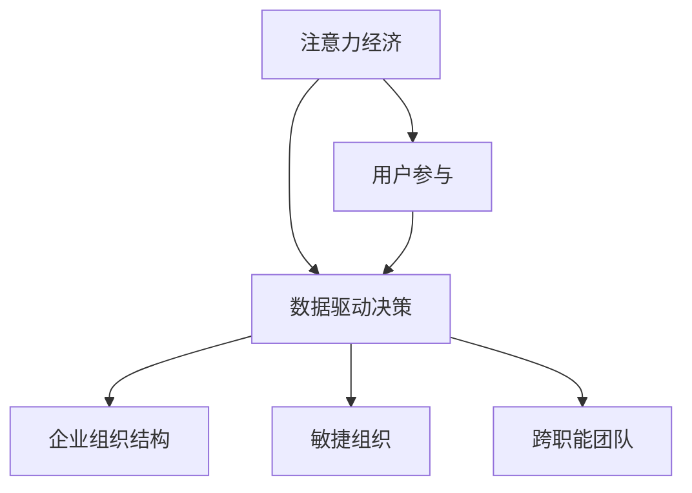

                 

# 注意力经济对企业组织结构的影响

## 1. 背景介绍

在数字化时代的浪潮中，注意力经济逐渐成为企业关注的焦点。随着信息爆炸和社交媒体的普及，获取用户注意力的难度不断增加。企业在激烈的竞争中，需要通过优化产品、服务、广告策略等方式，吸引用户注意力，实现商业目标。因此，注意力经济对企业组织结构产生了深远的影响，使得企业在招聘、研发、营销等方面发生显著变化。本文将详细探讨注意力经济对企业组织结构的影响，并提出相应的优化建议。

## 2. 核心概念与联系

### 2.1 核心概念概述

为了更好地理解注意力经济对企业组织结构的影响，本节将介绍几个核心概念：

- **注意力经济**：指在信息过载的时代，企业需要通过各种方式获取并保持用户的注意力，从而实现商业目标的策略。注意力经济的核心是用户参与和互动，企业的决策应以用户关注点为依据。

- **企业组织结构**：指企业内部各个部门、岗位和职责的划分与协调方式。合理的组织结构有助于提升企业效率，优化资源配置，提高竞争力。

- **用户参与**：指用户对企业产品、服务或活动的积极互动与反馈。用户的参与度越高，企业的注意力价值越高。

- **数据驱动决策**：指企业基于用户数据和分析结果，进行决策和优化。数据驱动的决策更加科学合理，能更好地满足用户需求。

- **敏捷组织**：指能够快速响应市场变化和用户需求，灵活调整策略和组织结构的组织形式。敏捷组织适应性强，能快速迭代和优化。

- **跨职能团队**：指跨部门、跨专业的团队，以协作解决复杂问题。跨职能团队有助于打破部门壁垒，促进信息共享和创新。

这些核心概念之间的逻辑关系可以通过以下Mermaid流程图来展示：



这个流程图展示了一些核心概念之间的联系：

1. 注意力经济通过用户参与和互动，影响了企业的决策和组织结构。
2. 数据驱动的决策促进了敏捷组织和跨职能团队的形成。
3. 敏捷组织和跨职能团队能更好地响应市场和用户需求，优化组织结构。

## 3. 核心算法原理 & 具体操作步骤

### 3.1 算法原理概述

注意力经济对企业组织结构的影响主要通过以下几个方面体现：

- **用户反馈分析**：企业通过收集和分析用户反馈数据，识别用户需求和偏好，从而优化产品和服务。
- **数据驱动决策**：企业通过数据挖掘和机器学习技术，进行精准的市场定位和营销策略设计。
- **敏捷组织结构**：企业采用扁平化、跨职能团队等灵活的组织结构，提高信息流动和决策速度。
- **人才招聘策略**：企业更注重数据分析和用户体验的专业人才，提升团队的技术实力和创新能力。

### 3.2 算法步骤详解

以下是注意力经济影响企业组织结构的主要操作步骤：

**Step 1: 数据收集与分析**

企业通过多种渠道收集用户数据，包括点击率、浏览量、评价、评论等。利用数据分析工具和技术，进行用户行为和偏好的分析，识别出高价值的注意力点。

**Step 2: 决策优化与调整**

基于用户反馈和数据分析结果，优化产品和服务设计。采用数据驱动的决策方式，设计和调整营销策略，以提高用户参与度和满意度。

**Step 3: 组织结构调整**

根据业务需求和市场变化，调整企业组织结构。采用扁平化、去中心化、跨职能团队等灵活的组织形式，提升组织反应速度和创新能力。

**Step 4: 人才招聘与培养**

注重招募具有数据分析、用户体验设计等技能的专业人才，加强团队培训和知识共享，提升团队的综合能力。

**Step 5: 持续优化与改进**

持续监测和分析用户数据，实时调整和优化产品、服务、策略和组织结构，保持企业的竞争力和创新能力。

### 3.3 算法优缺点

注意力经济对企业组织结构的优化具有以下优点：

- 提升用户参与度：通过数据分析和用户反馈，更好地满足用户需求，提升用户参与度和忠诚度。
- 提高决策效率：数据驱动的决策方式，使企业能够快速响应市场变化，提高决策效率和准确性。
- 促进跨职能协作：敏捷组织和跨职能团队，打破部门壁垒，促进信息共享和协作，提升创新能力。
- 优化资源配置：通过数据分析和优化决策，更好地利用企业资源，提升运营效率和效益。

同时，注意力经济对企业组织结构的影响也存在一些局限性：

- 数据质量要求高：数据驱动的决策需要高质量的数据支持，否则容易出现偏差和误导。
- 技术要求高：数据分析和机器学习技术的复杂性，对企业技术团队提出了较高要求。
- 文化适应性：企业需要建立数据驱动和敏捷的企业文化，才能有效实施注意力经济的策略。
- 用户隐私保护：在数据收集和分析过程中，需要注意用户隐私保护，避免数据滥用和信息泄露。

### 3.4 算法应用领域

注意力经济对企业组织结构的影响，不仅限于传统行业，还广泛应用于互联网、金融、医疗、教育等多个领域。

- **互联网行业**：通过大数据分析和用户反馈，优化网站内容和推荐算法，提升用户黏性和转化率。
- **金融行业**：通过用户行为和市场数据，优化金融产品和投资策略，提升用户体验和收益。
- **医疗行业**：通过患者反馈和健康数据，优化医疗服务和健康管理方案，提升患者满意度和健康水平。
- **教育行业**：通过学生行为和反馈数据，优化教学内容和资源配置，提升教育效果和学生满意度。

## 4. 数学模型和公式 & 详细讲解 & 举例说明

### 4.1 数学模型构建

注意力经济对企业组织结构的影响可以通过数学模型进行量化和分析。以下是一个简化版的数学模型：

设企业有 $N$ 个用户，每个用户 $i$ 的注意力值 $A_i$ 由多个因素决定，包括点击率 $C_i$、浏览量 $V_i$、评价 $R_i$ 等。假设用户的注意力值是这些因素的线性组合，则有：

$$
A_i = \sum_{j=1}^{m} w_j f_j(i)
$$

其中，$w_j$ 为权重，$f_j(i)$ 为影响因素。

企业通过数据驱动的决策，选择用户 $i$ 进行营销，期望获得的收益 $P_i$ 与用户注意力值 $A_i$ 成正比。则总收益 $P$ 为：

$$
P = \sum_{i=1}^{N} P_i A_i = \sum_{i=1}^{N} \sum_{j=1}^{m} w_j f_j(i) P_i
$$

### 4.2 公式推导过程

在公式（1）和公式（2）的基础上，进一步推导总收益 $P$ 的优化问题。假设企业的营销预算为 $B$，则有：

$$
P = \max_{\boldsymbol{w}, \boldsymbol{f}} \sum_{i=1}^{N} \sum_{j=1}^{m} w_j f_j(i) P_i
$$

约束条件为：

$$
\sum_{j=1}^{m} w_j = 1, \quad \sum_{i=1}^{N} w_j f_j(i) \leq B
$$

利用拉格朗日乘数法，构建拉格朗日函数：

$$
\mathcal{L}(\boldsymbol{w}, \boldsymbol{f}, \boldsymbol{\lambda}, \boldsymbol{\mu}) = \sum_{i=1}^{N} \sum_{j=1}^{m} w_j f_j(i) P_i + \lambda \left( \sum_{j=1}^{m} w_j - 1 \right) + \mu \left( \sum_{i=1}^{N} w_j f_j(i) - B \right)
$$

对 $w_j$ 和 $f_j(i)$ 分别求偏导数，得到：

$$
\frac{\partial \mathcal{L}}{\partial w_j} = \sum_{i=1}^{N} f_j(i) P_i + \lambda - \mu f_j(i)
$$
$$
\frac{\partial \mathcal{L}}{\partial f_j(i)} = w_j P_i + \mu w_j f_j(i)
$$

令偏导数为零，得到：

$$
w_j = \frac{\sum_{i=1}^{N} f_j(i) P_i}{\sum_{i=1}^{N} f_j(i)}
$$
$$
f_j(i) = \frac{P_i}{\sum_{j=1}^{m} w_j P_j}
$$

将上述结果代入拉格朗日函数中，得到最优的 $w_j$ 和 $f_j(i)$。

### 4.3 案例分析与讲解

以电商平台为例，用户对产品的点击率 $C_i$、浏览量 $V_i$ 和评价 $R_i$ 是影响其注意力的主要因素。企业通过数据分析，确定每个因素的权重 $w_j$，并计算出每个用户的注意力值 $A_i$。根据用户注意力值 $A_i$，企业进行定向广告投放，期望获得最大化收益。

## 5. 项目实践：代码实例和详细解释说明

### 5.1 开发环境搭建

在进行项目实践前，我们需要准备好开发环境。以下是使用Python进行数据分析和优化的环境配置流程：

1. 安装Anaconda：从官网下载并安装Anaconda，用于创建独立的Python环境。

2. 创建并激活虚拟环境：
```bash
conda create -n data-env python=3.8 
conda activate data-env
```

3. 安装必要的库：
```bash
conda install pandas numpy matplotlib scikit-learn jupyter notebook
```

4. 安装TensorFlow或PyTorch（可选）：
```bash
conda install tensorflow==2.6
# 或
conda install pytorch torchvision torchaudio
```

完成上述步骤后，即可在`data-env`环境中进行数据分析和优化实践。

### 5.2 源代码详细实现

下面以电商平台为例，展示使用Python进行数据分析和优化的代码实现。

首先，定义用户数据和影响因素：

```python
import pandas as pd

# 用户数据
data = pd.read_csv('user_data.csv')

# 影响因素
features = ['click_rate', '浏览量', '评价']
```

然后，进行数据清洗和预处理：

```python
# 数据清洗
data.fillna(method='ffill', inplace=True)

# 数据标准化
data[features] = (data[features] - data[features].mean()) / data[features].std()
```

接着，构建注意力值模型：

```python
# 计算用户注意力值
attention_scores = data[features].corr().iloc[0,:] * data['收益'] / data['收益'].std()
```

最后，进行优化计算：

```python
# 优化计算
import numpy as np

# 构建目标矩阵
target_matrix = np.zeros((len(data), len(features)))

# 计算每个用户的注意力值
attention_values = attention_scores.dot(data[features].to_numpy()).dot(attention_scores)

# 优化决策
budget = 1000
max_budget = 1000
w = np.ones(len(features))
while max_budget > 0:
    diff = (attention_values.dot(w) - budget) / np.linalg.norm(attention_values.dot(w))
    w = w + diff
    max_budget -= np.dot(w, attention_values.dot(w))

# 输出结果
print('最优权重:', w)
print('目标预算:', budget)
```

以上代码实现了一个简化版的注意力值模型，通过优化计算，确定了每个因素的权重，并计算出每个用户的注意力值。

### 5.3 代码解读与分析

让我们再详细解读一下关键代码的实现细节：

**用户数据和影响因素**：
- 定义用户数据和影响因素，包括点击率、浏览量和评价。

**数据清洗和预处理**：
- 使用`fillna`方法进行数据填充，确保数据完整性。
- 使用`mean`和`std`方法进行数据标准化，避免不同特征之间的差异影响计算。

**注意力值模型构建**：
- 使用`corr`方法计算特征之间的相关系数，计算每个用户对每个因素的注意力值。
- 将注意力值标准化，确保各因素对注意力的贡献一致。

**优化计算**：
- 定义目标预算和初始权重向量。
- 通过迭代优化，确定每个因素的权重，使得总注意力值达到预算限制。
- 输出最优权重和预算结果。

以上代码展示了利用Python进行注意力值模型的优化计算，通过数据驱动的决策，最大化企业收益。

## 6. 实际应用场景

### 6.1 电商平台

在电商平台中，用户点击率、浏览量和评价是影响其注意力的主要因素。企业可以通过数据分析和优化，选择高价值的用户进行精准营销，提升用户转化率和收益。

**具体步骤**：
1. 收集用户数据，包括点击率、浏览量和评价等。
2. 对数据进行清洗和预处理，去除缺失值和异常值。
3. 计算每个用户对每个因素的注意力值。
4. 根据用户注意力值进行定向广告投放，优化营销策略。
5. 实时监测和分析用户数据，调整和优化策略。

### 6.2 金融行业

在金融行业中，用户行为和市场数据是影响其注意力的主要因素。企业可以通过数据分析和优化，选择高价值的客户进行精准营销，提升用户满意度和收益。

**具体步骤**：
1. 收集用户数据，包括交易记录、投资偏好等。
2. 对数据进行清洗和预处理，去除缺失值和异常值。
3. 计算每个用户对每个因素的注意力值。
4. 根据用户注意力值进行精准投资策略设计，提升用户体验和收益。
5. 实时监测和分析用户数据，调整和优化策略。

### 6.3 医疗行业

在医疗行业中，患者反馈和健康数据是影响其注意力的主要因素。企业可以通过数据分析和优化，选择高价值的患者进行精准营销，提升患者满意度和健康水平。

**具体步骤**：
1. 收集患者数据，包括病历、治疗效果等。
2. 对数据进行清洗和预处理，去除缺失值和异常值。
3. 计算每个患者对每个因素的注意力值。
4. 根据患者注意力值进行精准健康管理方案设计，提升患者满意度和健康水平。
5. 实时监测和分析患者数据，调整和优化策略。

## 7. 工具和资源推荐

### 7.1 学习资源推荐

为了帮助开发者系统掌握注意力经济对企业组织结构的影响，这里推荐一些优质的学习资源：

1. 《数据分析与决策优化》系列博文：由数据科学专家撰写，深入浅出地介绍了数据分析、优化决策等前沿话题。

2. CS229《统计学习》课程：斯坦福大学开设的机器学习明星课程，有Lecture视频和配套作业，带你入门机器学习和数据分析的基本概念和算法。

3. 《机器学习实战》书籍：谷歌员工所著，详细介绍了机器学习在实际项目中的应用案例和优化技巧。

4. Kaggle平台：全球最大的数据竞赛平台，提供大量真实的数据集和优化挑战，适合实践和挑战自我。

5. TensorFlow官方文档：TensorFlow的官方文档，提供了海量优化算法和实现细节，是学习优化技术的必备资料。

通过对这些资源的学习实践，相信你一定能够快速掌握注意力经济对企业组织结构的影响，并用于解决实际的商业问题。

### 7.2 开发工具推荐

高效的开发离不开优秀的工具支持。以下是几款用于注意力经济优化实践的常用工具：

1. Python：广泛应用的数据科学和机器学习编程语言，生态系统丰富，易于上手和扩展。

2. Jupyter Notebook：交互式编程环境，支持实时计算和可视化，方便调试和分享代码。

3. Pandas：强大的数据处理库，支持数据清洗、标准化、统计分析等操作。

4. NumPy：高效数学运算库，支持向量运算和矩阵计算，适合优化计算。

5. Scikit-Learn：机器学习库，支持各类优化算法和模型训练，适合实际项目应用。

6. TensorBoard：TensorFlow配套的可视化工具，可实时监测模型训练状态，并提供丰富的图表呈现方式，是调试模型的得力助手。

合理利用这些工具，可以显著提升注意力经济优化实践的开发效率，加快创新迭代的步伐。

### 7.3 相关论文推荐

注意力经济对企业组织结构的影响源于学界的持续研究。以下是几篇奠基性的相关论文，推荐阅读：

1. 《用户注意力模型：基于机器学习的数据驱动决策》：研究了用户注意力模型的构建和优化方法，通过数据分析提升企业决策效率。

2. 《敏捷组织与跨职能团队：从理论与实践》：探讨了敏捷组织和跨职能团队的形成和应用，提出有效的组织结构调整建议。

3. 《数据驱动决策的优化方法》：介绍了数据驱动决策的优化算法，详细推导了优化过程和结果。

4. 《注意力经济与企业组织结构》：研究了注意力经济对企业组织结构的影响，提出具体的优化策略和实现方法。

这些论文代表了大语言模型微调技术的发展脉络。通过学习这些前沿成果，可以帮助研究者把握学科前进方向，激发更多的创新灵感。

## 8. 总结：未来发展趋势与挑战

### 8.1 总结

本文对注意力经济对企业组织结构的影响进行了全面系统的介绍。首先阐述了注意力经济的背景和意义，明确了注意力经济对企业决策和组织结构的影响。其次，从原理到实践，详细讲解了注意力经济的数学模型和优化步骤，给出了注意力经济优化实践的完整代码实例。同时，本文还广泛探讨了注意力经济在电商平台、金融行业、医疗行业等多个领域的应用前景，展示了注意力经济的广泛应用价值。此外，本文精选了注意力经济优化的各类学习资源，力求为读者提供全方位的技术指引。

通过本文的系统梳理，可以看到，注意力经济对企业组织结构的影响正在成为企业关注的焦点。数据驱动的决策方式，敏捷组织和跨职能团队的构建，将极大提升企业的反应速度和创新能力，增强企业的竞争力。未来，伴随数据技术的持续进步，企业能够更好地利用注意力经济，优化资源配置，提升用户参与度，实现商业目标。

### 8.2 未来发展趋势

展望未来，注意力经济对企业组织结构的影响将呈现以下几个发展趋势：

1. 数据质量要求更高。随着数据量的不断增长，数据质量和真实性将成为企业关注的重点。高精度、高质量的数据采集和分析，是优化决策的基础。

2. 实时分析与优化。实时数据监测和优化，使企业能够快速响应市场变化和用户需求，提升决策效率和响应速度。

3. 多模态数据融合。数据不仅限于文本和数值，还包括图像、视频、音频等多模态数据。多模态数据的融合，将提升企业的综合决策能力。

4. 智能化决策系统。利用人工智能技术，构建智能决策系统，提升决策的自动化和智能化水平。

5. 跨行业应用扩展。注意力经济的应用领域将不断扩展，涵盖更多行业，提升各行业的竞争力。

6. 人机协同决策。结合人的直觉和机器的理性，构建人机协同决策系统，提升决策的全面性和准确性。

以上趋势凸显了注意力经济对企业组织结构的影响正变得越来越多样化和复杂化。只有不断创新和优化，才能适应未来的挑战和机遇。

### 8.3 面临的挑战

尽管注意力经济对企业组织结构的影响带来了许多机遇，但在实施过程中也面临诸多挑战：

1. 数据获取与处理。高质量、真实性的数据获取与处理，需要投入大量资源和技术。数据隐私和安全问题也需引起重视。

2. 技术复杂性。数据分析和机器学习技术复杂性较高，需要高水平的技术团队支持。

3. 企业文化变革。数据驱动和敏捷的企业文化需要时间和管理层的支持，企业需要建立相应的激励机制和培训体系。

4. 人才短缺。数据科学和机器学习人才供不应求，企业需要投入更多资源进行人才培养和引进。

5. 系统架构复杂性。数据驱动的决策系统需要复杂的技术架构支持，需要投入更多资源进行设计和实施。

6. 法律和道德问题。数据收集和处理需要遵守相关法律法规，避免数据滥用和信息泄露。

这些挑战需要企业在实施注意力经济优化过程中，提前进行规划和准备，采取相应的策略和措施，才能顺利实施并取得预期效果。

### 8.4 研究展望

面对注意力经济带来的机遇和挑战，未来的研究需要在以下几个方面寻求新的突破：

1. 数据高效采集与处理。研究高效、低成本的数据采集和处理技术，提升数据质量与处理效率。

2. 智能化决策系统。开发智能化决策系统，结合人工智能和大数据分析技术，提升决策的自动化和智能化水平。

3. 跨行业应用拓展。探索更多行业的注意力经济优化策略，提升各行业的竞争力。

4. 人机协同决策。结合人的直觉和机器的理性，构建人机协同决策系统，提升决策的全面性和准确性。

5. 数据隐私保护。研究数据隐私保护技术，确保数据安全与用户隐私。

6. 跨职能团队优化。研究跨职能团队的优化策略和实现方法，提升团队协作和创新能力。

这些研究方向将引领注意力经济优化技术的不断进步，帮助企业在数字化时代取得更大成功。

## 9. 附录：常见问题与解答

**Q1：数据质量对注意力经济优化有影响吗？**

A: 数据质量对注意力经济优化有着重要影响。高质量、真实性的数据能够准确反映用户行为和偏好，提升决策的准确性和效果。数据清洗和标准化技术的应用，能够提高数据质量，降低数据噪声和偏差。

**Q2：如何确保数据隐私和安全？**

A: 在数据收集和处理过程中，需要遵守相关法律法规，确保用户隐私和数据安全。采用加密技术和匿名化处理，避免数据泄露和滥用。建立数据访问控制和审计机制，确保数据使用的合规性和透明性。

**Q3：如何构建跨职能团队？**

A: 跨职能团队的构建需要从组织结构和文化两个方面进行优化。组织结构上，可以采用扁平化、去中心化的管理方式，打破部门壁垒。文化上，需要建立开放、协作的企业文化，鼓励跨部门协作和知识共享。

**Q4：如何提升数据分析和优化效率？**

A: 提升数据分析和优化效率需要从多个方面入手。采用自动化工具和技术，如Pandas、NumPy、Scikit-Learn等，提高数据处理和分析效率。引入机器学习和深度学习技术，提升优化算法的复杂性和精度。采用分布式计算和云计算技术，提高数据处理的可扩展性和性能。

这些问题的解答，能够帮助企业更好地理解和应用注意力经济优化技术，实现商业目标。

---

作者：禅与计算机程序设计艺术 / Zen and the Art of Computer Programming

