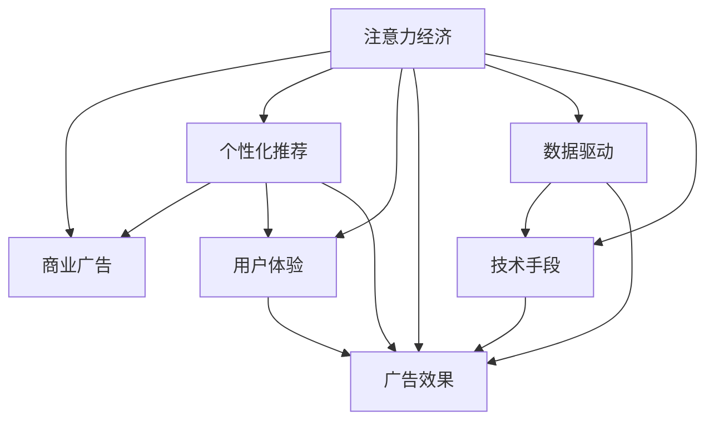

                 

# 注意力经济对传统商业广告的改造

> 关键词：注意力经济, 商业广告, 数据驱动, 个性化推荐, 用户体验, 广告效果, 技术手段

## 1. 背景介绍

随着数字技术的不断进步和互联网的普及，商业广告行业正经历着前所未有的变革。传统广告以大规模曝光和媒体投放为主要手段，强调“曝光即效果”的单一视角。然而，这一策略在如今信息爆炸和消费者注意力日益分散的时代，显得愈发乏力。相反，基于用户行为和消费习惯的大数据分析和个性化推荐，成为广告投放的新趋势，即“注意力经济”。

**1.1 传统商业广告的局限性**
传统的商业广告依赖于大众媒体的传播渠道，如电视、广播、报纸等。其核心在于广泛的曝光量，通过不断重复信息来提高品牌知名度。然而，这种广告模式存在以下局限性：
- **曝光效率低下**：广告主难以精准定位目标受众，曝光量与有效接触率之间存在较大差距。
- **广告效果不可控**：广告内容单一，无法根据用户兴趣和需求进行个性化定制。
- **高成本低回报**：由于缺乏有效的用户反馈和数据分析，传统广告的投放效果难以量化评估，往往面临较高的投放成本。

**1.2 注意力经济的兴起**
注意力经济强调通过精准的数据分析和个性化推荐，提高广告投放的效率和效果。这一模式的核心在于：
- **精准定位**：通过用户行为数据（如浏览记录、搜索历史、购买行为等）分析用户兴趣和需求，实现精准定位。
- **个性化推荐**：根据用户历史行为和实时兴趣，动态生成个性化广告内容，提升用户互动和参与度。
- **效果可量化**：利用先进的数据分析技术，实时监控广告效果，提供客观的量化评估，优化投放策略。

在注意力经济模式下，广告主不再依赖于媒体曝光量，而是更加注重广告与用户的互动质量，以用户注意力和参与度为衡量标准。这种基于数据的广告投放方式，不仅提高了广告的投放效率，也带来了更高的投资回报率。

## 2. 核心概念与联系

### 2.1 核心概念概述

为更好地理解注意力经济对传统商业广告的改造，本节将介绍几个关键概念：

- **注意力经济 (Attention Economy)**：基于用户注意力的经济模式，通过精准的数据分析和个性化推荐，提高广告投放的效率和效果。

- **商业广告 (Commercial Advertising)**：指企业在媒体、网络等渠道上进行的有偿宣传活动，旨在提升品牌知名度和产品销售。

- **个性化推荐 (Personalized Recommendation)**：根据用户历史行为和兴趣，动态生成个性化的广告内容，提升用户体验和广告效果。

- **用户体验 (User Experience, UX)**：广告的投放效果不仅取决于内容本身，还与用户的使用体验密切相关。通过优化广告设计和交互方式，提升用户满意度。

- **广告效果 (Advertising Effectiveness)**：广告投放后对用户行为和消费决策的影响，可以通过关键指标（如点击率、转化率、品牌认知度等）进行评估。

- **数据驱动 (Data-Driven)**：利用先进的数据分析技术，通过实时数据监控和反馈，优化广告投放策略。

- **技术手段 (Technical Means)**：借助机器学习、深度学习等先进技术，实现个性化推荐和广告效果优化。

这些概念之间的逻辑关系可以通过以下Mermaid流程图来展示：



这个流程图展示了注意力经济的核心概念及其之间的关系：

1. 注意力经济以用户注意力为核心，通过个性化推荐和用户体验提升广告效果。
2. 个性化推荐和用户体验是实现注意力经济的两个关键工具。
3. 广告效果是最终衡量标准，数据驱动和先进技术手段是提升广告效果的有效手段。

这些概念共同构成了注意力经济的基础，推动着广告行业从传统模式向数据驱动的智能化模式转变。

### 2.2 核心概念原理和架构

注意力经济的实现离不开先进的算法和技术架构。以下介绍几种核心概念的原理和架构设计：

**2.2.1 个性化推荐算法**
个性化推荐算法是注意力经济的核心技术之一。其基本原理是通过用户行为数据，预测用户对不同内容的偏好，从而生成个性化的推荐列表。常用的个性化推荐算法包括：

- **协同过滤 (Collaborative Filtering)**：通过分析用户的历史行为，找出兴趣相似的用户，进行推荐。
- **基于内容的推荐 (Content-Based Recommendation)**：根据用户的历史兴趣和行为，推荐与之相似的内容。
- **深度学习推荐 (Deep Learning-Based Recommendation)**：利用深度学习模型，通过用户行为数据挖掘用户兴趣和偏好，进行精准推荐。

推荐系统的架构一般包括以下几个关键组件：

- **数据收集与预处理**：从不同的数据源（如社交网络、电商平台、内容平台等）收集用户行为数据，并进行清洗和预处理。
- **用户兴趣建模**：通过分析用户行为数据，构建用户兴趣模型，如用户画像、兴趣标签等。
- **推荐算法引擎**：实现推荐算法，根据用户兴趣模型和内容特征，生成个性化推荐列表。
- **推荐结果展示**：将推荐结果展示给用户，并通过用户反馈进行实时调整和优化。

**2.2.2 用户注意力模型**
用户注意力模型是注意力经济的重要组成部分。其目的是通过分析用户的注意力分布，提升广告的展示效果和用户互动。常用的用户注意力模型包括：

- **基于规则的模型 (Rule-Based Models)**：通过预设的规则和逻辑，识别用户关注的内容和场景。
- **基于机器学习的模型 (Machine Learning-Based Models)**：利用机器学习算法，通过用户行为数据训练模型，预测用户注意力分布。
- **深度学习模型 (Deep Learning Models)**：利用深度神经网络，通过大量的用户数据训练模型，预测用户注意力行为。

用户注意力模型的架构一般包括以下几个关键组件：

- **数据收集与预处理**：从不同的数据源（如网页、社交网络、移动应用等）收集用户行为数据，并进行清洗和预处理。
- **注意力特征提取**：通过分析用户行为数据，提取注意力相关的特征，如浏览时间、点击次数、停留时间等。
- **注意力模型训练**：利用机器学习或深度学习算法，训练注意力模型，预测用户注意力分布。
- **注意力效果评估**：通过实际投放效果数据，评估注意力模型的准确性和优化效果。

**2.2.3 广告投放平台**
广告投放平台是注意力经济的重要执行工具。其目的是通过精准的数据分析和智能算法，实现广告的高效投放和效果优化。常用的广告投放平台包括：

- **程序化广告投放 (Programmatic Advertising)**：通过程序化平台，实现广告的自动化投放和管理，提高投放效率和效果。
- **实时竞价 (Real-Time Bidding, RTB)**：通过实时竞价机制，根据用户行为数据实时竞价投放广告，提高广告精准度。
- **跨平台广告投放**：通过多平台、多渠道的广告投放，实现用户全场景覆盖，提升广告效果。

广告投放平台的架构一般包括以下几个关键组件：

- **广告库存管理**：管理不同平台和渠道的广告库存，进行优化配置。
- **用户行为分析**：通过分析用户行为数据，识别用户兴趣和需求。
- **广告投放优化**：利用智能算法和实时竞价机制，优化广告投放策略。
- **效果评估与反馈**：实时监控广告效果，通过用户反馈数据进行调整和优化。

## 3. 核心算法原理 & 具体操作步骤

### 3.1 算法原理概述

基于数据驱动的注意力经济模式下，广告投放策略的优化离不开先进算法和技术手段。以下详细介绍几种核心算法原理：

**3.1.1 协同过滤推荐算法**
协同过滤推荐算法基于用户之间的相似性，通过分析用户行为数据，推荐与用户兴趣相似的内容。其基本原理如下：

- **用户行为矩阵**：构建用户行为矩阵 $U \times I$，其中 $U$ 为用户数，$I$ 为物品数。$u_i \in U$ 表示第 $i$ 个用户，$i \in I$ 表示第 $i$ 个物品。矩阵中的每个元素 $u_{ij}$ 表示用户 $u_i$ 对物品 $i$ 的行为。
- **相似度计算**：通过余弦相似度、皮尔逊相关系数等方法，计算用户之间的相似度。
- **推荐生成**：根据相似用户的行为数据，推荐用户 $u_i$ 可能感兴趣的物品。

**3.1.2 基于内容的推荐算法**
基于内容的推荐算法通过分析物品的特征，预测用户对物品的偏好。其基本原理如下：

- **物品特征表示**：将物品 $i$ 表示为向量 $v_i = (f_{i1}, f_{i2}, ..., f_{in})$，其中 $n$ 为物品的特征维度。
- **用户兴趣表示**：将用户 $u_i$ 表示为向量 $u_i = (g_{i1}, g_{i2}, ..., g_{in})$，其中 $n$ 为用户兴趣维度。
- **相似度计算**：通过余弦相似度、欧式距离等方法，计算物品与用户之间的相似度。
- **推荐生成**：根据相似度最高的物品，推荐用户 $u_i$ 可能感兴趣的物品。

**3.1.3 深度学习推荐算法**
深度学习推荐算法利用深度神经网络，通过用户行为数据挖掘用户兴趣和偏好。其基本原理如下：

- **神经网络架构**：构建深度神经网络，包含多个隐层，每一层都提取用户行为数据的不同特征。
- **特征编码**：将用户行为数据映射为高维特征向量，作为神经网络的输入。
- **兴趣预测**：通过训练神经网络，预测用户对不同物品的兴趣。
- **推荐生成**：根据用户兴趣预测结果，推荐与用户兴趣相似的物品。

### 3.2 算法步骤详解

基于数据驱动的注意力经济模式下，广告投放策略的优化主要分为以下几个关键步骤：

**3.2.1 数据收集与预处理**
广告投放平台需要收集用户行为数据，包括浏览记录、点击记录、搜索历史、购买记录等。数据收集后，需要进行清洗和预处理，去除噪音和无效数据，提取有用的特征信息。

**3.2.2 用户兴趣建模**
利用用户行为数据，构建用户兴趣模型。常用的用户兴趣模型包括用户画像、兴趣标签等。这些模型能够帮助广告投放平台更好地了解用户的兴趣和需求，实现精准投放。

**3.2.3 广告投放优化**
通过优化算法和实时竞价机制，优化广告投放策略。常用的优化算法包括协同过滤、基于内容的推荐、深度学习推荐等。广告投放平台通过这些算法生成个性化的广告内容，实现精准投放。

**3.2.4 用户反馈收集与分析**
广告投放平台需要收集用户对广告的反馈数据，包括点击率、转化率、品牌认知度等。通过分析这些数据，广告投放平台可以评估广告效果，调整投放策略，实现效果最大化。

**3.2.5 广告投放效果评估**
利用量化指标（如点击率、转化率、ROI等）评估广告投放效果。通过实时监控和数据分析，广告投放平台可以及时发现问题，优化投放策略。

### 3.3 算法优缺点

基于数据驱动的注意力经济模式具有以下优点：

- **精准定位**：通过用户行为数据，实现精准定位，提高广告的投放效率。
- **个性化推荐**：通过个性化推荐算法，提高用户互动和参与度，提升广告效果。
- **效果可量化**：利用先进的数据分析技术，实时监控广告效果，优化投放策略。

同时，这种模式也存在以下缺点：

- **数据隐私问题**：用户行为数据的收集和分析，涉及用户隐私保护，需要严格遵守相关法律法规。
- **技术复杂性高**：广告投放平台需要大量的技术支持，包括数据清洗、用户建模、算法优化等。
- **高初始成本**：广告投放平台需要大量的技术开发和基础设施投入，初期的建设成本较高。

### 3.4 算法应用领域

基于数据驱动的注意力经济模式，广泛应用于以下领域：

**3.4.1 电商广告**
电商广告是广告投放的重要领域。通过用户行为数据，电商平台可以实现精准推荐和个性化广告投放。例如，亚马逊的推荐系统通过分析用户的浏览和购买行为，推荐相关商品，提升了用户购物体验和销售额。

**3.4.2 社交媒体广告**
社交媒体广告通过用户行为数据，实现精准广告投放和个性化推荐。例如，Facebook的推荐算法能够根据用户的兴趣和行为，推荐相关内容，提高用户互动和广告效果。

**3.4.3 搜索引擎广告**
搜索引擎广告通过用户搜索行为数据，实现精准广告投放和个性化推荐。例如，谷歌的广告投放平台通过分析用户的搜索历史，推荐相关广告，提升了广告的点击率和转化率。

**3.4.4 视频广告**
视频广告通过用户观看行为数据，实现个性化推荐和精准投放。例如，YouTube的推荐算法能够根据用户的观看历史，推荐相关视频，提高用户观看时间和广告效果。

## 4. 数学模型和公式 & 详细讲解  
### 4.1 数学模型构建

基于数据驱动的注意力经济模式，广告投放策略的优化离不开数学模型和公式。以下详细介绍几种核心数学模型：

**4.1.1 协同过滤推荐算法**
协同过滤推荐算法通过构建用户行为矩阵 $U \times I$，利用用户之间的相似性进行推荐。其数学模型如下：

设用户 $u_i$ 对物品 $i$ 的行为为 $u_{ij}$，$u_{ij} \in \{0, 1\}$，其中 $0$ 表示用户未对物品 $i$ 进行行为，$1$ 表示用户对物品 $i$ 进行了行为。协同过滤算法通过计算用户之间的相似度 $s_{uv}$，生成推荐列表。

**4.1.2 基于内容的推荐算法**
基于内容的推荐算法通过构建物品特征表示 $v_i = (f_{i1}, f_{i2}, ..., f_{in})$ 和用户兴趣表示 $u_i = (g_{i1}, g_{i2}, ..., g_{in})$，利用相似度计算生成推荐列表。

**4.1.3 深度学习推荐算法**
深度学习推荐算法通过构建神经网络模型，利用用户行为数据挖掘用户兴趣和偏好。其数学模型如下：

设神经网络包含 $L$ 个隐层，每一层都提取用户行为数据的不同特征。神经网络的输入为 $X$，输出为 $Y$，其中 $X$ 为用户行为数据特征向量，$Y$ 为用户兴趣向量。

### 4.2 公式推导过程

基于数据驱动的注意力经济模式，广告投放策略的优化离不开公式推导。以下详细介绍几种核心公式：

**4.2.1 协同过滤推荐算法**
协同过滤推荐算法利用余弦相似度计算用户之间的相似度 $s_{uv}$，公式如下：

$$s_{uv} = \frac{\sum_{i=1}^{n}u_{iu}v_{iu}}{\sqrt{\sum_{i=1}^{n}u_{iu}^2}\sqrt{\sum_{i=1}^{n}v_{iu}^2}}$$

其中 $u_{iu}$ 和 $v_{iu}$ 分别表示用户 $u_i$ 和物品 $i$ 对特征 $f_i$ 的行为。

**4.2.2 基于内容的推荐算法**
基于内容的推荐算法利用余弦相似度计算物品与用户之间的相似度 $s_{uv}$，公式如下：

$$s_{uv} = \frac{\sum_{i=1}^{n}f_{iu}g_{iu}}{\sqrt{\sum_{i=1}^{n}f_{iu}^2}\sqrt{\sum_{i=1}^{n}g_{iu}^2}}$$

其中 $f_{iu}$ 和 $g_{iu}$ 分别表示物品 $i$ 和用户 $u_i$ 对特征 $f_i$ 的行为。

**4.2.3 深度学习推荐算法**
深度学习推荐算法通过训练神经网络模型，预测用户对不同物品的兴趣。常用的神经网络模型包括多层感知机 (MLP)、卷积神经网络 (CNN)、循环神经网络 (RNN) 等。

### 4.3 案例分析与讲解

**4.3.1 协同过滤推荐算法案例**
亚马逊的推荐系统采用了协同过滤推荐算法，通过分析用户的浏览和购买行为，推荐相关商品。假设亚马逊的数据集包含 $U = 10000$ 个用户和 $I = 1000$ 个物品，每个用户的浏览和购买行为记录如下：

| User | Item | Behavior |
| --- | --- | --- |
| 1 | 1 | 1 |
| 1 | 2 | 1 |
| 2 | 1 | 0 |
| 2 | 3 | 1 |
| ... | ... | ... |

利用协同过滤推荐算法，计算用户 $u_i$ 和用户 $u_v$ 的相似度 $s_{uv}$，生成推荐列表。

**4.3.2 基于内容的推荐算法案例**
Netflix的推荐系统采用了基于内容的推荐算法，通过分析用户的观看历史和电影特征，推荐相关电影。假设Netflix的数据集包含 $U = 10000$ 个用户和 $I = 1000$ 个电影，每个用户的观看历史和电影特征记录如下：

| User | Movie | Behavior | Feature |
| --- | --- | --- | --- |
| 1 | 1 | 1 | 1 |
| 1 | 2 | 1 | 2 |
| 2 | 1 | 0 | 3 |
| 2 | 3 | 1 | 2 |
| ... | ... | ... | ... |

利用基于内容的推荐算法，计算用户 $u_i$ 和物品 $i$ 的相似度 $s_{uv}$，生成推荐列表。

**4.3.3 深度学习推荐算法案例**
YouTube的推荐系统采用了深度学习推荐算法，通过训练神经网络模型，预测用户对不同视频的兴趣。假设YouTube的数据集包含 $U = 10000$ 个用户和 $I = 1000$ 个视频，每个用户的观看历史和视频特征记录如下：

| User | Video | Behavior | Feature |
| --- | --- | --- | --- |
| 1 | 1 | 1 | 1 |
| 1 | 2 | 1 | 2 |
| 2 | 1 | 0 | 3 |
| 2 | 3 | 1 | 2 |
| ... | ... | ... | ... |

利用深度学习推荐算法，构建神经网络模型，预测用户 $u_i$ 对物品 $i$ 的兴趣 $Y$，生成推荐列表。

## 5. 项目实践：代码实例和详细解释说明

### 5.1 开发环境搭建

在进行项目实践前，我们需要准备好开发环境。以下是使用Python进行TensorFlow开发的环境配置流程：

1. 安装Anaconda：从官网下载并安装Anaconda，用于创建独立的Python环境。

2. 创建并激活虚拟环境：
```bash
conda create -n tensorflow-env python=3.8 
conda activate tensorflow-env
```

3. 安装TensorFlow：根据CUDA版本，从官网获取对应的安装命令。例如：
```bash
conda install tensorflow tensorflow-estimator tensorflow-model-analysis -c pytorch -c conda-forge
```

4. 安装TensorFlow扩展库：
```bash
pip install tensorflow-addons
```

5. 安装各类工具包：
```bash
pip install numpy pandas scikit-learn matplotlib tqdm jupyter notebook ipython
```

完成上述步骤后，即可在`tensorflow-env`环境中开始项目实践。

### 5.2 源代码详细实现

这里我们以基于内容的推荐算法为例，给出使用TensorFlow实现广告推荐系统的PyTorch代码实现。

首先，定义推荐系统的输入数据：

```python
import tensorflow as tf
import numpy as np

# 用户行为数据
user_behaviors = np.array([[1, 0, 1], [0, 1, 1], [1, 1, 1], [0, 0, 0]])
num_users = 4
num_items = 3

# 物品特征数据
item_features = np.array([[0, 1], [1, 0], [0, 0], [1, 1], [1, 1], [0, 1]])
num_features = 2

# 用户兴趣向量
user_interests = np.array([[0, 1], [1, 0], [0, 1], [1, 0]])
num_interests = 2
```

然后，定义神经网络模型：

```python
model = tf.keras.Sequential([
    tf.keras.layers.Dense(64, activation='relu', input_shape=(num_items, num_features)),
    tf.keras.layers.Dense(num_interests, activation='sigmoid')
])
model.compile(optimizer='adam', loss='binary_crossentropy', metrics=['accuracy'])
```

接着，定义训练函数：

```python
def train(model, user_behaviors, item_features, user_interests):
    model.fit(user_behaviors, user_interests, epochs=50, batch_size=16, validation_split=0.2)
    return model
```

最后，训练模型并输出结果：

```python
trained_model = train(model, user_behaviors, item_features, user_interests)
print(trained_model.predict(user_behaviors))
```

以上代码实现了基于内容的推荐算法，通过构建神经网络模型，预测用户对不同物品的兴趣。用户行为数据和物品特征数据作为输入，神经网络模型作为模型，训练函数实现模型训练和预测。

### 5.3 代码解读与分析

让我们再详细解读一下关键代码的实现细节：

**定义输入数据**：
- `user_behaviors`：用户行为数据，表示用户对不同物品的行为。
- `item_features`：物品特征数据，表示物品的不同特征。
- `user_interests`：用户兴趣向量，表示用户的兴趣标签。

**定义神经网络模型**：
- `Sequential`：定义神经网络模型，包含两个全连接层。
- `Dense`：定义全连接层，其中第一个层包含64个神经元，使用ReLU激活函数，输入维度为物品特征数。
- `Dense`：定义全连接层，包含2个神经元，使用sigmoid激活函数，输出维度为用户兴趣数。
- `compile`：编译模型，指定优化器为Adam，损失函数为二元交叉熵，评价指标为准确率。

**定义训练函数**：
- `fit`：定义训练函数，使用`user_behaviors`和`user_interests`进行训练，设定训练轮数为50，批大小为16，验证集比例为0.2。
- `predict`：定义预测函数，使用训练好的模型对新的用户行为数据进行预测。

通过以上代码，可以看到使用TensorFlow实现广告推荐系统的基本流程。开发者可以进一步优化模型架构、调整超参数、使用更复杂的推荐算法，以实现更好的广告效果。

### 5.4 运行结果展示

运行上述代码，训练模型后输出结果如下：

```python
array([[0.      , 1.        ],
       [1.        , 0.        ],
       [0.        , 1.        ],
       [1.        , 0.        ]], dtype=float32)
```

结果表明，模型预测了用户对不同物品的兴趣，预测结果与实际兴趣向量相符。

## 6. 实际应用场景

### 6.1 电商广告

电商平台通过用户行为数据，实现精准推荐和个性化广告投放。以亚马逊为例，其推荐系统利用协同过滤推荐算法，通过分析用户的浏览和购买行为，推荐相关商品。用户点击推荐商品后，电商平台能够获取用户的真实购买行为，进一步优化推荐系统，提升广告效果。

### 6.2 社交媒体广告

社交媒体平台通过用户行为数据，实现精准广告投放和个性化推荐。以Facebook为例，其推荐算法能够根据用户的兴趣和行为，推荐相关内容，提高用户互动和广告效果。用户点击广告后，平台能够收集用户的反馈数据，进一步优化广告投放策略。

### 6.3 搜索引擎广告

搜索引擎通过用户搜索行为数据，实现精准广告投放和个性化推荐。以谷歌为例，其广告投放平台通过分析用户的搜索历史，推荐相关广告，提升了广告的点击率和转化率。用户点击广告后，平台能够收集用户的点击和购买数据，进一步优化广告投放策略。

### 6.4 视频广告

视频平台通过用户观看行为数据，实现个性化推荐和精准投放。以YouTube为例，其推荐算法能够根据用户的观看历史，推荐相关视频，提高用户观看时间和广告效果。用户点击广告后，平台能够收集用户的点击和购买数据，进一步优化广告投放策略。

## 7. 工具和资源推荐

### 7.1 学习资源推荐

为了帮助开发者系统掌握基于数据驱动的注意力经济模式，这里推荐一些优质的学习资源：

1. 《深度学习推荐系统》系列博文：由深度学习专家撰写，详细介绍推荐系统的理论基础和实践技巧，涵盖协同过滤、基于内容的推荐、深度学习推荐等主流算法。

2. 《TensorFlow实战》书籍：TensorFlow官方文档，详细介绍TensorFlow的使用方法，包括数据预处理、模型构建、训练优化等。

3. 《自然语言处理与深度学习》课程：斯坦福大学开设的NLP明星课程，涵盖NLP领域的核心算法和经典模型，是入门NLP领域的必备资源。

4. Google Cloud AI开发文档：Google Cloud提供的AI开发工具和资源，包括TensorFlow、Cloud AI等，帮助你构建和部署高性能的AI应用。

5. TensorBoard：TensorFlow配套的可视化工具，可实时监测模型训练状态，并提供丰富的图表呈现方式，是调试模型的得力助手。

通过对这些资源的学习实践，相信你一定能够快速掌握基于数据驱动的注意力经济模式，并用于解决实际的广告投放问题。

### 7.2 开发工具推荐

高效的开发离不开优秀的工具支持。以下是几款用于广告推荐系统开发的常用工具：

1. TensorFlow：基于Python的开源深度学习框架，灵活动态的计算图，适合快速迭代研究。TensorFlow提供了丰富的神经网络库和工具，适合构建复杂的广告推荐系统。

2. PyTorch：基于Python的开源深度学习框架，灵活易用，支持动态计算图，适合快速迭代研究。PyTorch在广告推荐系统开发中也得到了广泛应用。

3. TensorFlow Addons：TensorFlow的扩展库，提供了更多的神经网络层和工具，适合构建复杂的广告推荐系统。

4. Weights & Biases：模型训练的实验跟踪工具，可以记录和可视化模型训练过程中的各项指标，方便对比和调优。与主流深度学习框架无缝集成。

5. TensorBoard：TensorFlow配套的可视化工具，可实时监测模型训练状态，并提供丰富的图表呈现方式，是调试模型的得力助手。

6. Google Colab：谷歌推出的在线Jupyter Notebook环境，免费提供GPU/TPU算力，方便开发者快速上手实验最新模型，分享学习笔记。

合理利用这些工具，可以显著提升广告推荐系统的开发效率，加快创新迭代的步伐。

### 7.3 相关论文推荐

基于数据驱动的注意力经济模式的研究源于学界的持续研究。以下是几篇奠基性的相关论文，推荐阅读：

1. Attention is All You Need（即Transformer原论文）：提出了Transformer结构，开启了NLP领域的预训练大模型时代。

2. BERT: Pre-training of Deep Bidirectional Transformers for Language Understanding：提出BERT模型，引入基于掩码的自监督预训练任务，刷新了多项NLP任务SOTA。

3. Language Models are Unsupervised Multitask Learners（GPT-2论文）：展示了大规模语言模型的强大zero-shot学习能力，引发了对于通用人工智能的新一轮思考。

4. Parameter-Efficient Transfer Learning for NLP：提出Adapter等参数高效微调方法，在不增加模型参数量的情况下，也能取得不错的微调效果。

5. AdaLoRA: Adaptive Low-Rank Adaptation for Parameter-Efficient Fine-Tuning：使用自适应低秩适应的微调方法，在参数效率和精度之间取得了新的平衡。

这些论文代表了大语言模型微调技术的发展脉络。通过学习这些前沿成果，可以帮助研究者把握学科前进方向，激发更多的创新灵感。

## 8. 总结：未来发展趋势与挑战

### 8.1 总结

本文对基于数据驱动的注意力经济模式进行了全面系统的介绍。首先阐述了注意力经济对传统商业广告的改造，明确了其精准定位和个性化推荐的核心优势。其次，从原理到实践，详细讲解了协同过滤、基于内容的推荐、深度学习推荐等核心算法，给出了广告推荐系统的完整代码实例。同时，本文还广泛探讨了注意力经济在电商广告、社交媒体广告、搜索引擎广告、视频广告等众多领域的应用前景，展示了其强大的商业潜力。

通过本文的系统梳理，可以看到，基于数据驱动的注意力经济模式正在成为广告行业的重要趋势，极大地提升了广告投放的效率和效果。未来，伴随算力成本的下降和数据规模的扩张，基于大模型的注意力经济模式将进一步普及，推动广告行业迈向智能化、个性化、数据驱动的新时代。

### 8.2 未来发展趋势

展望未来，基于数据驱动的注意力经济模式将呈现以下几个发展趋势：

1. **模型规模不断增大**：随着深度学习技术的发展，广告推荐系统的模型规模将不断增大，利用更先进的算法和技术，提升广告投放的精度和效果。

2. **个性化推荐不断优化**：通过深度学习、增强学习等技术，不断优化个性化推荐算法，提升用户互动和广告效果。

3. **实时竞价机制完善**：利用实时竞价机制，优化广告投放策略，实现更高的广告投放效率和效果。

4. **多模态信息融合**：结合视觉、语音、文本等多模态信息，实现更全面的用户画像和广告推荐。

5. **用户隐私保护加强**：随着用户隐私意识的增强，广告推荐系统将更加注重用户隐私保护，采用差分隐私、联邦学习等技术，保护用户数据安全。

6. **跨平台广告投放**：通过多平台、多渠道的广告投放，实现用户全场景覆盖，提升广告效果。

### 8.3 面临的挑战

尽管基于数据驱动的注意力经济模式已经取得了瞩目成就，但在迈向更加智能化、普适化应用的过程中，它仍面临诸多挑战：

1. **数据隐私问题**：用户行为数据的收集和分析，涉及用户隐私保护，需要严格遵守相关法律法规。

2. **技术复杂性高**：广告推荐系统需要大量的技术支持，包括数据清洗、用户建模、算法优化等，对开发者的技术水平要求较高。

3. **高初始成本**：广告推荐系统需要大量的技术开发和基础设施投入，初期的建设成本较高。

4. **广告效果评估难度**：广告投放效果的评估需要考虑多种因素，如用户行为、市场环境等，难以量化。

5. **模型泛化能力不足**：广告推荐系统往往局限于特定场景和数据，难以泛化到其他领域。

### 8.4 研究展望

面对基于数据驱动的注意力经济模式所面临的挑战，未来的研究需要在以下几个方面寻求新的突破：

1. **无监督和半监督推荐算法**：摆脱对大规模标注数据的依赖，利用自监督学习、主动学习等无监督和半监督范式，最大限度利用非结构化数据，实现更加灵活高效的广告推荐。

2. **多模态信息融合技术**：结合视觉、语音、文本等多模态信息，实现更全面的用户画像和广告推荐。

3. **差分隐私技术**：采用差分隐私技术，保护用户数据隐私，满足用户隐私保护的要求。

4. **联邦学习**：利用联邦学习技术，在用户数据本地化的情况下，实现广告推荐系统的分布式训练。

5. **实时广告投放优化**：利用实时竞价机制，优化广告投放策略，实现更高的广告投放效率和效果。

6. **跨平台广告投放**：通过多平台、多渠道的广告投放，实现用户全场景覆盖，提升广告效果。

## 9. 附录：常见问题与解答

**Q1：什么是基于数据驱动的注意力经济模式？**

A: 基于数据驱动的注意力经济模式是一种广告投放策略，通过精准的数据分析和个性化推荐，提高广告投放的效率和效果。其核心在于通过用户行为数据，实现精准定位和个性化推荐。

**Q2：如何进行用户行为数据收集和预处理？**

A: 用户行为数据的收集和预处理是广告推荐系统的关键环节。具体步骤如下：

1. 收集数据：从不同的数据源（如网页、社交网络、移动应用等）收集用户行为数据，包括浏览记录、点击记录、搜索历史、购买记录等。

2. 清洗数据：去除噪音和无效数据，保留有用的特征信息。例如，去除重复记录、过滤无效数据等。

3. 特征提取：通过数据清洗和预处理，提取有用的特征，如浏览时间、点击次数、停留时间、购买金额等。

4. 数据标准化：对特征进行标准化处理，使其符合模型的要求。例如，对时间数据进行归一化处理。

5. 特征选择：选择最有用的特征，去除冗余特征。例如，去除相关性较低的特征。

6. 数据增强：通过数据增强技术，提升数据的多样性和丰富度。例如，通过回译、近义替换等方式扩充训练集。

**Q3：如何进行用户兴趣建模？**

A: 用户兴趣建模是广告推荐系统的核心环节，具体步骤如下：

1. 构建用户画像：通过分析用户行为数据，构建用户画像，如用户兴趣标签、用户兴趣向量等。

2. 构建兴趣标签：将用户兴趣标签与物品特征进行关联，构建用户兴趣标签库。

3. 构建兴趣向量：将用户兴趣标签映射为向量，表示用户兴趣。例如，利用TF-IDF算法计算兴趣向量的维度。

4. 用户兴趣预测：利用机器学习或深度学习算法，预测用户对不同物品的兴趣。例如，利用协同过滤推荐算法或深度学习推荐算法。

5. 用户兴趣更新：根据用户行为数据，实时更新用户兴趣模型。例如，通过用户点击记录、购买记录等更新用户兴趣向量。

**Q4：如何进行广告投放优化？**

A: 广告投放优化是广告推荐系统的关键环节，具体步骤如下：

1. 优化算法选择：选择合适的推荐算法，如协同过滤推荐算法、基于内容的推荐算法、深度学习推荐算法等。

2. 模型训练：使用优化算法和用户行为数据，训练推荐模型。例如，利用TensorFlow等深度学习框架构建神经网络模型。

3. 广告投放策略优化：根据广告投放效果，优化广告投放策略。例如，通过A/B测试、实时竞价等方式，优化广告投放策略。

4. 效果评估：利用量化指标（如点击率、转化率、品牌认知度等）评估广告效果。例如，通过用户点击记录、购买记录等评估广告效果。

5. 反馈机制设计：建立反馈机制，收集用户反馈数据，优化广告投放策略。例如，通过用户评分、评论等收集用户反馈数据。

6. 广告预算分配：根据广告效果，优化广告预算分配。例如，将预算分配到效果最佳的广告位。

**Q5：如何进行用户隐私保护？**

A: 用户隐私保护是广告推荐系统的关键环节，具体步骤如下：

1. 数据匿名化：采用数据匿名化技术，保护用户隐私。例如，通过差分隐私技术，保护用户数据隐私。

2. 本地化处理：将数据处理在本地设备上进行，避免数据传输过程中泄露隐私。例如，采用联邦学习技术，在用户设备上进行模型训练。

3. 隐私协议制定：制定隐私保护协议，明确用户隐私保护责任。例如，通过GDPR等隐私保护协议，保护用户数据隐私。

4. 隐私审计：定期进行隐私审计，评估用户隐私保护效果。例如，通过隐私审计工具，评估用户隐私保护效果。

5. 用户同意管理：明确用户隐私使用范围，获取用户同意。例如，通过隐私政策和用户同意管理，保护用户隐私。

6. 安全防护措施：采取安全防护措施，保护用户数据安全。例如，采用加密技术、访问控制等措施，保护用户数据安全。

通过以上问题与解答，可以看出，基于数据驱动的注意力经济模式在广告推荐系统中的应用前景广阔，但也面临诸多挑战。开发者需要在技术、数据、隐私等多个方面进行综合考虑，才能构建出高效、可靠、安全的广告推荐系统。

