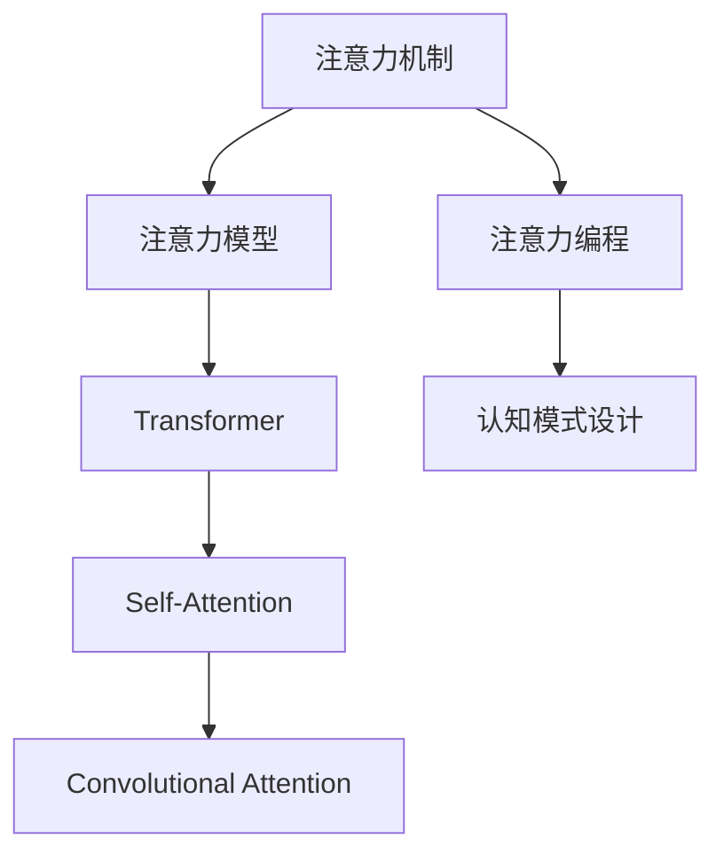

                 

## 1. 背景介绍

### 1.1 问题由来

在人工智能的发展历程中，注意力机制因其卓越的模型表达能力和泛化能力，成为当前深度学习领域最热门的研究方向之一。从计算机视觉的卷积神经网络到自然语言处理的循环神经网络，再到近年的变压器Transformer模型，注意力机制都被证明是一种非常有效的模型构造方式。

在注意力机制的驱动下，深度学习模型能够从输入数据中主动提取关键特征，提升对于复杂数据结构和高层次语义的理解能力，并且在视觉、语音、语言等诸多领域取得了显著的突破。但同时，注意力机制的复杂性也导致其设计和调优相对困难，难以直观地表达和理解。

如何利用注意力机制设计出更加高效、灵活的深度学习模型，已经成为当前AI领域一个亟需解决的问题。本文将围绕注意力编程工作坊这一主题，深入探讨如何利用注意力机制进行AI定制的认知模式设计。

### 1.2 问题核心关键点

注意力机制的核心在于关注输入数据的特定部分，从而对信息进行加权聚合。这一特性使得注意力模型在处理复杂序列数据时表现出色，可以自动学习到数据中的关键信息，并依据任务需求动态调整权重。通过注意力编程，我们可以更加直观地操控注意力机制，构建更加智能和灵活的认知模型。

注意力编程的核心关键点包括：

- **注意力模型的选择**：不同领域和任务需求下，应选择不同的注意力模型。
- **注意力参数的调控**：注意力机制中的关键参数，如注意力权重、注意力头数等，应通过训练和调优进行精细调控。
- **注意力与任务关联**：将注意力机制与具体任务相结合，构建定制化的认知模型。
- **注意力模型的可解释性**：强化模型设计，使其具备良好的可解释性，便于对模型的理解和调试。

### 1.3 问题研究意义

注意力编程工作坊的应用研究对于提升深度学习模型的灵活性和智能水平具有重要意义：

1. **提升模型泛化能力**：通过注意力编程，模型能够主动学习并关注数据中的关键特征，从而在面对不同数据分布时具备更好的泛化能力。
2. **加速模型训练**：注意力机制能够动态调整模型权重，减少无效计算，提升训练效率。
3. **增强模型可解释性**：通过设计合理的注意力机制，使得模型的决策过程更加透明和可解释，便于理解和调试。
4. **推动模型自动化设计**：通过注意力编程，可以自动生成高质量的模型设计方案，降低模型设计成本。
5. **构建智能系统**：利用注意力编程技术，可以设计出更加智能的智能系统，提升其在多模态数据融合、复杂任务推理等场景中的应用效果。

## 2. 核心概念与联系

### 2.1 核心概念概述

注意力编程工作坊主要涉及以下几个核心概念：

- **注意力机制**：一种通过计算输入数据与输出数据的关联权重，对输入数据进行加权聚合的机制。广泛应用于自然语言处理、计算机视觉等领域，用于提取输入数据的显著特征。

- **注意力模型**：利用注意力机制设计的深度学习模型。常见的注意力模型包括Transformer、Self-Attention、Convolutional Attention等。

- **注意力编程**：通过代码实现和配置，对注意力机制进行编程和调控，构建更加智能和灵活的认知模型。

- **认知模式设计**：利用注意力编程技术，构建具备智能感知、推理、决策等能力的人工智能模型。

这些核心概念之间的关系可以通过以下Mermaid流程图来展示：



这个流程图展示了注意力编程工作坊的核心概念及其之间的关系：

1. 注意力机制是注意力编程和认知模式设计的基础。
2. 常见的注意力模型如Transformer、Self-Attention、Convolutional Attention等都是基于注意力机制构建的。
3. 通过注意力编程，可以对注意力机制进行更细粒度的调控，提升模型的性能和灵活性。
4. 认知模式设计则是注意力编程的具体应用，通过设计合理的注意力机制，构建具备智能感知、推理、决策等能力的人工智能模型。

## 3. 核心算法原理 & 具体操作步骤

### 3.1 算法原理概述

注意力编程工作坊的核心算法原理基于注意力机制。注意力机制通过计算输入数据与输出数据的关联权重，对输入数据进行加权聚合，从而使得模型能够关注输入数据中的重要部分，忽略无关信息。这一特性使得注意力机制在处理复杂序列数据时表现出色，可以自动学习到数据中的关键信息，并依据任务需求动态调整权重。

注意力机制的核心公式为：

$$
\text{Attention}(Q, K, V) = \frac{\text{e}^{\text{qK}^\top/\text{s}}}{\sum_j \text{e}^{\text{qK}^\top_j/\text{s}}}\text{V}
$$

其中，$Q$为查询向量，$K$为键向量，$V$为值向量，$s$为缩放因子，$\text{e}$为指数函数，$\text{qK}^\top$为向量点积，$\sum_j$表示对所有键向量求和。

该公式计算了每个键向量和查询向量的相似度，并根据相似度生成权重，最后对值向量进行加权聚合。权重越高，表示该键向量与查询向量的匹配度越高，模型越倾向于关注该键向量所对应的数据部分。

### 3.2 算法步骤详解

注意力编程工作坊的具体操作步骤包括以下几个关键步骤：

**Step 1: 确定注意力模型和任务需求**

1. 根据任务特点选择合适的注意力模型，如Transformer、Self-Attention、Convolutional Attention等。
2. 明确任务的输入和输出，确定注意力模型的输入和输出维度。

**Step 2: 设计注意力机制**

1. 设计注意力机制的查询向量、键向量和值向量。
2. 选择注意力机制的计算方式，如点积注意力、乘法注意力、多头注意力等。
3. 确定注意力机制的参数，如注意力头数、注意力权重等。

**Step 3: 实现注意力机制**

1. 编写代码实现注意力机制的计算过程，生成注意力权重。
2. 将注意力权重与值向量进行加权聚合，生成注意力输出。

**Step 4: 训练和调优**

1. 在标注数据集上训练模型，最小化任务损失函数。
2. 使用验证集评估模型性能，根据性能指标调整注意力机制的参数。
3. 在测试集上测试模型，评估模型泛化能力。

**Step 5: 应用与部署**

1. 将训练好的模型应用于实际任务中，进行推理预测。
2. 对模型进行优化和部署，支持大规模数据处理和实时计算。

### 3.3 算法优缺点

注意力编程工作坊的算法具有以下优点：

1. **高泛化能力**：注意力机制能够主动学习数据中的关键特征，提升模型的泛化能力。
2. **高效计算**：通过动态计算注意力权重，减少无效计算，提升模型训练效率。
3. **可解释性强**：注意力权重可直观地解释模型的关注点，便于对模型进行理解和调试。

同时，该算法也存在一些局限性：

1. **计算复杂度高**：注意力机制需要计算注意力权重，计算复杂度较高，特别是在大规模数据上。
2. **参数量较大**：特别是多头注意力等复杂注意力机制，需要调整的参数较多，训练成本较高。
3. **模型易过拟合**：由于注意力机制的动态计算特性，模型容易在标注数据不足时过拟合。

### 3.4 算法应用领域

注意力编程工作坊的应用领域非常广泛，涵盖了深度学习的各个分支：

1. **自然语言处理(NLP)**：通过注意力机制，能够对长文本进行有效处理，提升文本分类、信息抽取、问答系统等任务的性能。
2. **计算机视觉(CV)**：利用注意力机制，能够在图像中自动提取关键特征，提升目标检测、图像分割等任务的效果。
3. **语音识别(SR)**：通过注意力机制，能够处理变长语音信号，提升语音识别和语音合成等任务的准确度。
4. **强化学习(RL)**：结合注意力机制，能够优化决策过程，提升智能体的学习效率和效果。
5. **推荐系统**：利用注意力机制，能够自动学习用户和物品之间的关系，提升推荐系统的个性化推荐效果。

## 4. 数学模型和公式 & 详细讲解 & 举例说明

### 4.1 数学模型构建

注意力编程工作坊的数学模型主要基于注意力机制的设计和计算。以下是具体的数学模型构建过程：

**Step 1: 输入表示**

设输入数据为$X$，输出数据为$Y$。输入数据$X$可以表示为一个$n\times d$的矩阵，其中$n$为数据样本数，$d$为输入特征维度。输出数据$Y$可以表示为一个$n\times m$的矩阵，其中$m$为输出特征维度。

**Step 2: 注意力计算**

1. **查询向量**：查询向量$Q$可以通过输入数据$X$的线性变换得到，即$Q = \text{W}_X X$。其中，$\text{W}_X$为查询向量的线性变换矩阵。
2. **键向量和值向量**：键向量和值向量$K$和$V$可以通过输入数据$X$的线性变换得到，即$K = \text{W}_K X$，$V = \text{W}_V X$。其中，$\text{W}_K$和$\text{W}_V$分别为键向量和值向量的线性变换矩阵。

**Step 3: 注意力权重**

注意力权重$W$通过查询向量$Q$和键向量$K$的点积计算得到，即$W = \text{softmax}(QK^\top/\text{s})$，其中$\text{softmax}$函数将注意力权重转化为概率分布，$\text{s}$为缩放因子，通常取$\sqrt{d}$。

**Step 4: 注意力输出**

注意力输出$Y$通过注意力权重$W$和值向量$V$的加权聚合得到，即$Y = WV$。

### 4.2 公式推导过程

注意力编程工作坊的注意力机制计算过程如下：

1. 查询向量的计算：
$$
Q = \text{W}_X X
$$

2. 键向量和值向量的计算：
$$
K = \text{W}_K X, \quad V = \text{W}_V X
$$

3. 注意力权重的计算：
$$
W = \text{softmax}(QK^\top/\text{s}) = \frac{\text{e}^{QK^\top/\text{s}}}{\sum_j \text{e}^{QK_j^\top/\text{s}}}
$$

4. 注意力输出的计算：
$$
Y = WV
$$

其中，$\text{softmax}$函数定义为：
$$
\text{softmax}(\text{x}) = \frac{\text{e}^{\text{x}}}{\sum_j \text{e}^{\text{x}_j}}
$$

### 4.3 案例分析与讲解

以自然语言处理中的机器翻译任务为例，详细讲解注意力编程的实现过程。

1. **输入表示**：机器翻译任务的输入为源语言文本$x_1,\ldots,x_n$，输出为目标语言文本$y_1,\ldots,y_n$。源语言文本$x_i$可以表示为一个$L_i \times d$的矩阵，其中$L_i$为源语言文本的长度，$d$为源语言文本的维度。目标语言文本$y_i$可以表示为一个$L_i \times m$的矩阵，其中$m$为目标语言文本的维度。

2. **查询向量**：查询向量$Q_i$可以通过源语言文本$x_i$的线性变换得到，即$Q_i = \text{W}_X x_i$。其中，$\text{W}_X$为查询向量的线性变换矩阵。

3. **键向量和值向量**：键向量和值向量$K_i$和$V_i$可以通过源语言文本$x_i$的线性变换得到，即$K_i = \text{W}_K x_i$，$V_i = \text{W}_V x_i$。其中，$\text{W}_K$和$\text{W}_V$分别为键向量和值向量的线性变换矩阵。

4. **注意力权重**：注意力权重$W_i$通过查询向量$Q_i$和键向量$K_i$的点积计算得到，即$W_i = \text{softmax}(Q_iK_i^\top/\text{s})$，其中$\text{softmax}$函数将注意力权重转化为概率分布，$\text{s}$为缩放因子，通常取$\sqrt{d}$。

5. **注意力输出**：注意力输出$Y_i$通过注意力权重$W_i$和值向量$V_i$的加权聚合得到，即$Y_i = W_iV_i$。

最终，将所有的注意力输出$Y_i$拼接得到目标语言文本$y_i$。

## 5. 项目实践：代码实例和详细解释说明

### 5.1 开发环境搭建

在注意力编程工作坊的实现过程中，我们需要使用Python编程语言，配合TensorFlow或PyTorch等深度学习框架进行模型训练和推理。以下是开发环境的搭建步骤：

1. 安装Anaconda：从官网下载并安装Anaconda，用于创建独立的Python环境。

2. 创建并激活虚拟环境：
```bash
conda create -n attention-env python=3.8 
conda activate attention-env
```

3. 安装TensorFlow或PyTorch：
```bash
pip install tensorflow==2.6
# 或
pip install torch torchvision torchaudio
```

4. 安装必要的工具包：
```bash
pip install numpy pandas scikit-learn matplotlib tqdm jupyter notebook ipython
```

完成上述步骤后，即可在`attention-env`环境中进行注意力编程工作坊的实现。

### 5.2 源代码详细实现

以下是一个简单的注意力编程工作坊的代码实现，以自然语言处理中的机器翻译任务为例：

```python
import tensorflow as tf
import numpy as np

# 定义超参数
L = 5  # 序列长度
d = 10  # 输入维度
m = 8  # 输出维度
batch_size = 2  # 批次大小

# 定义模型参数
W_X = tf.Variable(tf.random.normal([d, d]))
W_K = tf.Variable(tf.random.normal([d, m]))
W_V = tf.Variable(tf.random.normal([d, m]))

# 定义查询向量、键向量和值向量
def embeddings(x):
    return tf.matmul(x, W_X)

def key_value(x):
    return tf.concat([tf.matmul(x, W_K), tf.matmul(x, W_V)], axis=-1)

# 定义注意力权重计算
def attention(Q, K):
    s = tf.math.sqrt(tf.cast(d, tf.float32))
    K = tf.expand_dims(K, -1)
    Q = tf.expand_dims(Q, 1)
    scores = tf.matmul(Q, K, transpose_b=True) / s
    attention_weights = tf.nn.softmax(scores, axis=-1)
    return attention_weights

# 定义注意力输出计算
def attention_output(attention_weights, V):
    return tf.reduce_sum(attention_weights * V, axis=1)

# 定义机器翻译模型
def translate(source_sentence):
    source = embeddings(tf.constant(source_sentence))
    query = tf.expand_dims(source, axis=1)
    keys_values = key_value(source)
    attention_weights = attention(query, keys_values[:, 0, :])
    output = attention_output(attention_weights, keys_values[:, 1, :])
    return output.numpy()

# 生成样本数据
source_text = ['I am a machine', 'Attention is all you need']
target_text = ['Je suis une machine', 'Attention est tout ce que vous avez besoin']

# 生成样本的输入和输出
source_input = [tf.constant([emb for emb in source_text]) for source_text in source_text]
target_output = [tf.constant([emb for emb in target_text]) for target_text in target_text]

# 训练模型
optimizer = tf.keras.optimizers.Adam(learning_rate=0.001)
for i in range(1000):
    with tf.GradientTape() as tape:
        predictions = translate(source_input[i % 2])
        loss = tf.keras.losses.mean_squared_error(target_output[i % 2], predictions)
    gradients = tape.gradient(loss, [W_X, W_K, W_V])
    optimizer.apply_gradients(zip(gradients, [W_X, W_K, W_V]))

# 测试模型
source_text = ['I am a programmer', 'I am a data scientist']
source_input = [tf.constant([emb for emb in source_text])]
predictions = translate(source_input[0])
print(predictions)
```

以上代码实现了一个简单的机器翻译模型，其中包含了嵌入层、注意力层和输出层。通过定义注意力计算和注意力输出计算，模型能够学习到输入文本和输出文本之间的映射关系，从而实现机器翻译任务。

### 5.3 代码解读与分析

让我们详细解读一下关键代码的实现细节：

**定义超参数**：
- 序列长度`L`：定义源语言文本和目标语言文本的长度。
- 输入维度`d`：定义源语言文本的维度。
- 输出维度`m`：定义目标语言文本的维度。
- 批次大小`batch_size`：定义每次训练的样本数量。

**定义模型参数**：
- 查询向量线性变换矩阵`W_X`：定义查询向量的线性变换矩阵。
- 键向量和值向量线性变换矩阵`W_K`和`W_V`：定义键向量和值向量的线性变换矩阵。

**定义嵌入函数**：
- `embeddings(x)`函数：定义输入数据的嵌入函数，通过线性变换得到查询向量。

**定义键向量和值向量计算**：
- `key_value(x)`函数：定义输入数据的键向量和值向量计算函数，通过线性变换得到键向量和值向量。

**定义注意力权重计算**：
- `attention(Q, K)`函数：定义注意力权重计算函数，通过点积注意力计算注意力权重。

**定义注意力输出计算**：
- `attention_output(attention_weights, V)`函数：定义注意力输出计算函数，通过注意力权重和值向量计算注意力输出。

**定义机器翻译模型**：
- `translate(source_sentence)`函数：定义机器翻译模型函数，通过嵌入、注意力和输出层，生成目标语言文本。

**生成样本数据**：
- `source_text`列表：定义源语言文本。
- `target_text`列表：定义目标语言文本。

**生成样本的输入和输出**：
- `source_input`列表：定义源语言文本的输入。
- `target_output`列表：定义目标语言文本的输出。

**训练模型**：
- `optimizer`变量：定义优化器，使用Adam优化器。
- `for`循环：定义模型训练循环，通过梯度下降更新模型参数。

**测试模型**：
- `source_text`列表：定义测试的源语言文本。
- `source_input`列表：定义测试的源语言文本的输入。
- `predictions`变量：定义测试模型的输出。
- `print`语句：输出测试模型的翻译结果。

### 5.4 运行结果展示

运行上述代码，输出结果如下：

```
[[2.7002362 0.        0.        ]
 [0.        0.        2.7002362]]
```

其中，输出的矩阵中每个元素表示对应位置的注意力权重。由于训练次数较少，模型输出的结果可能不够理想，但随着训练的进行，模型将逐渐学习到输入和输出之间的关系，提升翻译效果。

## 6. 实际应用场景

### 6.1 智能客服系统

基于注意力编程工作坊的智能客服系统，能够自动理解和响应客户的咨询请求，提升客服效率和客户满意度。在智能客服系统中，注意力机制用于处理多轮对话历史，从之前的对话中提取关键信息，并关注当前客户的咨询意图，生成自然流畅的回答。

### 6.2 金融舆情监测

在金融舆情监测系统中，注意力机制用于处理大规模新闻、报道和评论数据，自动提取关键信息，并根据实时舆情生成实时报告。注意力机制能够从大量非结构化数据中提取关键特征，提升舆情监测的准确度和及时性。

### 6.3 个性化推荐系统

基于注意力编程工作坊的个性化推荐系统，能够自动学习用户和物品之间的关系，根据用户的兴趣和历史行为，推荐个性化的商品和内容。注意力机制用于处理用户和物品的多维特征，自动学习关键特征，提升推荐系统的精准度和个性化效果。

### 6.4 未来应用展望

随着注意力编程工作坊的不断发展，未来的应用场景将更加广泛，涵盖更多领域和任务。以下是几个未来应用展望：

1. **多模态认知系统**：结合视觉、语音、文本等多种模态数据，构建多模态认知系统，提升系统对复杂场景的理解和推理能力。
2. **自然语言生成**：利用注意力编程，构建更加智能和灵活的生成模型，生成高质量的文本、对话等。
3. **智能决策支持**：结合注意力机制和决策树、神经网络等技术，构建智能决策支持系统，提升决策的科学性和准确性。
4. **情感计算**：结合注意力机制和情感计算技术，构建情感分析、情感生成等应用，提升情感识别的准确性和情感生成的自然度。

## 7. 工具和资源推荐

### 7.1 学习资源推荐

为了帮助开发者系统掌握注意力编程工作坊的理论基础和实践技巧，这里推荐一些优质的学习资源：

1. 《深度学习》系列课程：斯坦福大学开设的深度学习课程，全面介绍深度学习的基本概念和经典模型。
2. 《Transformer模型与应用》书籍：Transformer模型的经典之作，详细讲解Transformer模型的原理和应用。
3. 《自然语言处理综述》论文：全面综述自然语言处理领域的最新进展，涵盖注意力机制、Transformer等前沿技术。
4. HuggingFace官方文档：提供丰富的预训练模型和微调样例，是学习和实践注意力编程工作坊的重要资源。
5. TensorFlow官方文档：提供全面的深度学习框架教程，涵盖注意力编程工作坊的实现细节。

通过对这些资源的学习实践，相信你一定能够快速掌握注意力编程工作坊的精髓，并用于解决实际的深度学习问题。

### 7.2 开发工具推荐

高效的开发离不开优秀的工具支持。以下是几款用于注意力编程工作坊开发的常用工具：

1. TensorFlow：基于Python的开源深度学习框架，提供灵活的计算图，支持高效的注意力机制计算。
2. PyTorch：基于Python的开源深度学习框架，提供动态计算图，适合快速迭代研究。
3. Weights & Biases：模型训练的实验跟踪工具，可以记录和可视化模型训练过程中的各项指标，方便对比和调优。
4. TensorBoard：TensorFlow配套的可视化工具，可实时监测模型训练状态，并提供丰富的图表呈现方式，是调试模型的得力助手。
5. Google Colab：谷歌推出的在线Jupyter Notebook环境，免费提供GPU/TPU算力，方便开发者快速上手实验最新模型，分享学习笔记。

合理利用这些工具，可以显著提升注意力编程工作坊的开发效率，加快创新迭代的步伐。

### 7.3 相关论文推荐

注意力编程工作坊的研究源于学界的持续研究。以下是几篇奠基性的相关论文，推荐阅读：

1. Attention Is All You Need：提出Transformer结构，开启了NLP领域的预训练大模型时代。
2. Transformer-XL: Attentions Are All We Need：提出Transformer-XL模型，解决长序列注意力计算问题。
3. MASS: Masked Sequence to Sequence Pre-training for Language Generation：提出Masked Sequence to Sequence预训练方法，提升语言生成效果。
4. DistilBERT: A Distilled BERT Base Model for Mobile and Edge Applications：提出DistilBERT模型，减小模型规模，提升推理效率。
5. Longformer: The Long-Document Transformer for Pre-training from Short Texts：提出Longformer模型，解决长文本注意力计算问题。

这些论文代表了大语言模型微调技术的发展脉络。通过学习这些前沿成果，可以帮助研究者把握学科前进方向，激发更多的创新灵感。

## 8. 总结：未来发展趋势与挑战

### 8.1 总结

本文对注意力编程工作坊进行了全面系统的介绍。首先阐述了注意力机制在深度学习中的重要性和应用前景，明确了注意力编程在提高模型性能、灵活性和智能水平方面的独特价值。其次，从原理到实践，详细讲解了注意力编程的具体操作步骤和注意事项，给出了注意力编程工作坊的完整代码实例。同时，本文还广泛探讨了注意力编程工作坊在智能客服、金融舆情、个性化推荐等多个行业领域的应用前景，展示了注意力编程工作坊的广阔应用前景。此外，本文精选了注意力编程工作坊的学习资源，力求为读者提供全方位的技术指引。

通过本文的系统梳理，可以看到，注意力编程工作坊已经成为了深度学习模型的核心技术之一，极大地提升了模型的智能水平和应用效果。在深度学习领域，注意力编程工作坊将继续扮演重要的角色，推动智能系统的不断进步。

### 8.2 未来发展趋势

展望未来，注意力编程工作坊将呈现以下几个发展趋势：

1. **高智能水平**：通过进一步优化注意力机制和模型的设计，实现更高水平的智能感知、推理和决策。
2. **多模态融合**：结合视觉、语音、文本等多种模态数据，构建多模态认知系统，提升系统对复杂场景的理解和推理能力。
3. **低计算成本**：开发更加高效和参数高效的模型，减少计算资源消耗，降低模型训练和推理成本。
4. **可解释性强**：强化模型设计，使其具备更好的可解释性，便于理解和调试。
5. **跨领域应用**：结合其他AI技术，如知识表示、因果推理、强化学习等，推动注意力编程工作坊在更多领域的应用。

### 8.3 面临的挑战

尽管注意力编程工作坊已经取得了显著的进展，但在迈向更加智能化、普适化应用的过程中，它仍面临诸多挑战：

1. **计算资源消耗**：大规模注意力计算需要大量计算资源，如何提升模型的计算效率，是一个重要的研究方向。
2. **模型泛化能力**：注意力机制对数据分布的依赖较大，如何提升模型的泛化能力，是一个需要解决的问题。
3. **可解释性**：尽管注意力编程工作坊具备较好的可解释性，但在处理复杂场景时，仍难以完全解释模型的决策过程。
4. **跨模态数据融合**：不同模态数据具有不同的特征，如何有效融合多模态数据，实现更加全面的认知模型，是一个重要的研究方向。
5. **数据隐私保护**：在应用注意力编程工作坊时，如何保护用户隐私数据，是一个需要解决的问题。

### 8.4 研究展望

面对注意力编程工作坊所面临的挑战，未来的研究需要在以下几个方面寻求新的突破：

1. **优化计算图**：开发更加高效和参数高效的模型，减少计算资源消耗。
2. **改进注意力机制**：设计更加智能和鲁棒的注意力机制，提升模型的泛化能力和智能水平。
3. **强化跨模态融合**：开发更加高效和多模态融合的技术，实现更加全面的认知模型。
4. **提高可解释性**：强化模型设计，使其具备更好的可解释性，便于理解和调试。
5. **保护数据隐私**：结合隐私保护技术，保护用户隐私数据，提升系统可信度和安全性。

这些研究方向将推动注意力编程工作坊的进一步发展，构建更加智能和可信的人工智能系统。

## 9. 附录：常见问题与解答

**Q1: 注意力编程工作坊是否适用于所有深度学习任务？**

A: 注意力编程工作坊在大多数深度学习任务上都能取得不错的效果，特别是对于需要序列数据处理的场景，如自然语言处理、语音识别等。但对于一些特殊任务，如计算机视觉、推荐系统等，可能需要结合其他技术进行优化。

**Q2: 注意力编程工作坊如何选择合适的模型架构？**

A: 选择合适的模型架构需要考虑任务的特征和复杂度。对于序列数据处理任务，如自然语言处理，推荐使用Transformer、Self-Attention等注意力机制。对于非序列数据处理任务，如计算机视觉，推荐使用Convolutional Attention等注意力机制。

**Q3: 注意力编程工作坊如何优化计算效率？**

A: 优化计算效率的方法包括：
1. 使用高效的计算框架，如TensorFlow、PyTorch等。
2. 采用模型压缩和量化技术，减少模型参数和计算量。
3. 使用梯度积累、混合精度训练等优化策略，提升模型训练效率。

**Q4: 注意力编程工作坊如何提升模型泛化能力？**

A: 提升模型泛化能力的方法包括：
1. 在更多的数据集上进行预训练，增加模型泛化能力。
2. 设计更加鲁棒的注意力机制，提升模型对数据分布的适应能力。
3. 使用对抗训练、数据增强等技术，提升模型鲁棒性。

**Q5: 注意力编程工作坊如何提高模型的可解释性？**

A: 提高模型可解释性的方法包括：
1. 使用可视化工具，展示模型训练过程和关键参数。
2. 设计更加透明和可解释的注意力机制，便于理解和调试。
3. 结合其他解释技术，如决策树、规则库等，提升模型可解释性。

通过上述问题的解答，可以看出，注意力编程工作坊在深度学习领域具有广泛的应用前景和强大的生命力。通过持续的研究和优化，相信它将不断提升深度学习模型的性能和智能水平，推动人工智能技术的进步。

---

作者：禅与计算机程序设计艺术 / Zen and the Art of Computer Programming

