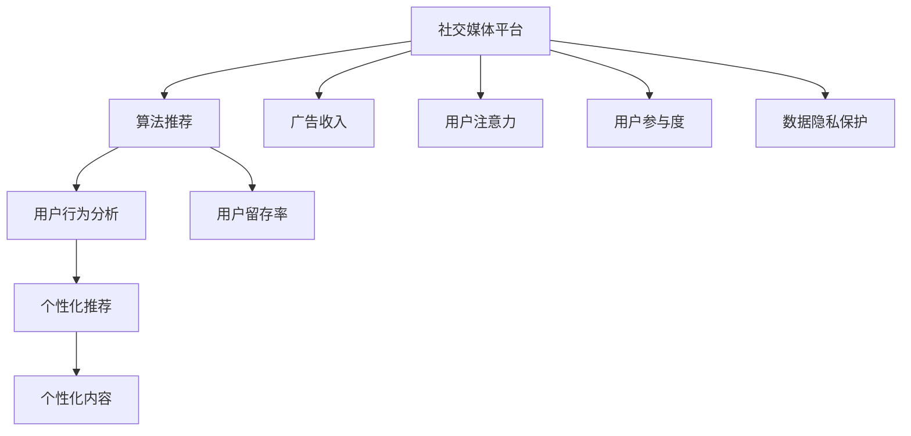
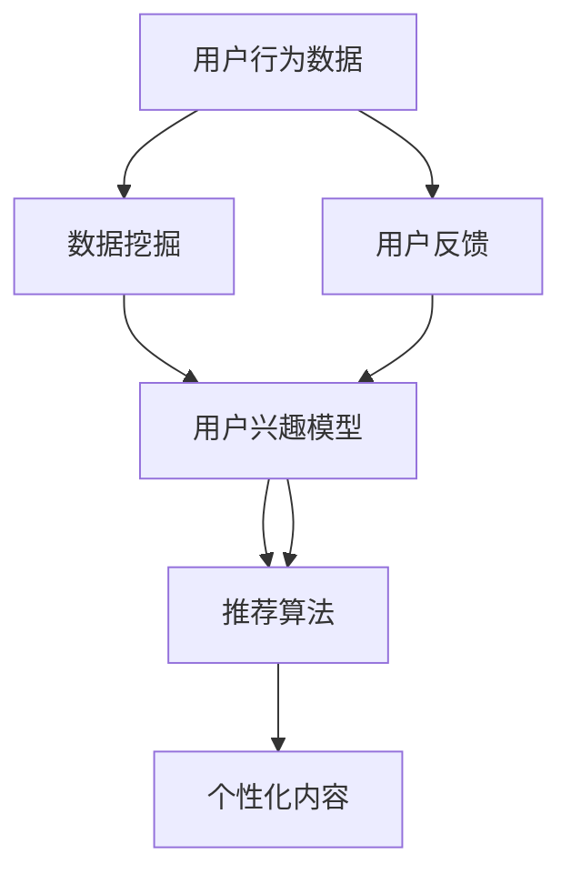

                 

# 注意力货币化：社交媒体平台是如何争夺你的时间和精力的

> 关键词：社交媒体,注意力货币化,算法推荐,用户行为,数据挖掘,算法伦理

## 1. 背景介绍

在当今数字化时代，社交媒体平台已经成为人们获取信息、娱乐和社交的重要渠道。然而，这些平台如何利用用户的时间和注意力，实现商业价值的最大化，是一个值得深入探讨的问题。本文将从算法推荐的角度，分析社交媒体平台如何通过精心设计的算法模型，策略性地捕获和利用用户的时间和精力，以及这一过程对用户行为的影响。

### 1.1 问题由来

社交媒体平台的商业盈利模式主要依赖于广告收入。为了最大化广告收入，平台需要尽可能多地吸引用户的注意力，并尽可能地延长用户在平台上的停留时间。为了实现这一目标，社交媒体平台广泛采用了基于算法推荐的技术，通过对用户行为数据的分析，预测用户的兴趣和需求，提供个性化的内容推荐，从而增加用户的参与度和停留时间。

### 1.2 问题核心关键点

1. **算法推荐系统**：社交媒体平台的核心技术之一，通过分析用户的历史行为数据，预测用户未来的兴趣和需求，从而提供个性化的内容推荐。
2. **注意力经济**：社交媒体平台通过捕捉和利用用户的注意力，实现商业价值的转化。
3. **用户行为分析**：通过对用户行为数据的挖掘，平台能够更好地理解用户需求和兴趣，优化推荐算法。
4. **算法伦理**：随着算法推荐技术的普及，如何保障用户隐私、防止数据滥用，成为了一个重要的伦理问题。
5. **用户注意力转移**：社交媒体平台之间的竞争，不仅体现在内容的吸引度，更体现在用户注意力的争夺上。

这些核心概念之间的逻辑关系可以通过以下Mermaid流程图来展示：



这个流程图展示了一个简单的流程：社交媒体平台通过算法推荐技术，分析用户行为，提供个性化推荐，从而提升用户参与度和留存率，进而增加广告收入，同时还需要关注用户注意力的转移和数据隐私保护。

## 2. 核心概念与联系

### 2.1 核心概念概述

为了更好地理解社交媒体平台如何通过算法推荐技术争夺用户的时间和精力，本节将介绍几个密切相关的核心概念：

- **社交媒体平台**：如Facebook、Twitter、Instagram等，通过用户生成内容、广告和推荐内容，吸引和保持用户。
- **算法推荐系统**：通过分析用户历史行为数据，预测用户兴趣和需求，自动推荐相关内容。
- **用户行为分析**：包括用户的浏览、点赞、评论、分享等行为，通过数据挖掘技术分析用户偏好。
- **个性化推荐**：根据用户行为数据，推荐个性化的内容，提升用户满意度和粘性。
- **数据隐私保护**：在算法推荐过程中，确保用户数据的隐私和安全性。
- **算法伦理**：确保算法推荐的公平性和透明度，避免数据偏见和滥用。

这些概念之间的联系主要体现在：社交媒体平台通过算法推荐系统，利用用户行为分析技术，为用户提供个性化推荐内容，从而增加用户留存率和广告收入。同时，平台还需关注数据隐私和算法伦理，确保技术应用的合法性和公正性。

### 2.2 核心概念原理和架构的 Mermaid 流程图



这个流程图展示了从用户行为数据到个性化内容推荐的流程：用户行为数据通过数据挖掘技术，生成用户兴趣模型，再由推荐算法根据兴趣模型，推荐个性化内容。用户反馈进一步优化用户兴趣模型和推荐算法。

## 3. 核心算法原理 & 具体操作步骤

### 3.1 算法原理概述

社交媒体平台的算法推荐系统，通过以下步骤实现对用户时间和精力的争夺：

1. **用户行为数据的收集和存储**：社交媒体平台收集用户的历史行为数据，如浏览记录、点赞、评论等，存储在数据仓库中。
2. **数据挖掘和特征工程**：通过数据挖掘技术，从存储的海量数据中提取用户行为特征，构建用户兴趣模型。
3. **推荐算法的设计和训练**：根据用户兴趣模型，设计推荐算法，并通过训练数据集训练模型。
4. **个性化内容的生成和推荐**：将训练好的推荐算法应用到新的用户行为数据上，生成个性化内容，并通过推荐引擎推送给用户。
5. **用户反馈的收集和模型优化**：收集用户的反馈数据，如点赞、评论等，用于优化用户兴趣模型和推荐算法。

### 3.2 算法步骤详解

以Facebook的算法推荐系统为例，以下是具体的步骤：

1. **用户行为数据的收集和存储**：
   - 用户登录Facebook后，浏览新闻、查看朋友动态、参与讨论等行为都会被记录下来。
   - 这些行为数据存储在Facebook的数据仓库中，并通过ETL（Extract, Transform, Load）流程，转化为结构化的数据集。

2. **数据挖掘和特征工程**：
   - 通过数据挖掘技术，从存储的行为数据中提取用户兴趣特征，如阅读偏好、社交关系、地理位置等。
   - 使用特征工程技术，将提取出的特征进行编码和归一化处理，形成用户兴趣模型。

3. **推荐算法的设计和训练**：
   - 设计推荐算法，如协同过滤、内容推荐、用户兴趣模型等。
   - 使用历史行为数据和人工标注数据集，训练推荐模型。

4. **个性化内容的生成和推荐**：
   - 将训练好的推荐算法应用到新的用户行为数据上，生成个性化内容，如新闻文章、视频、图片等。
   - 通过推荐引擎，将生成的个性化内容推送给用户，显示在用户的主页或动态消息中。

5. **用户反馈的收集和模型优化**：
   - 收集用户的反馈数据，如点赞、评论、分享等，用于优化用户兴趣模型和推荐算法。
   - 通过A/B测试等手段，不断调整推荐策略，提升用户满意度和留存率。

### 3.3 算法优缺点

社交媒体平台的算法推荐系统具有以下优点：

1. **提升用户体验**：通过个性化推荐，用户可以更快地找到自己感兴趣的内容，提高用户满意度。
2. **增加用户留存率**：个性化推荐可以增加用户在平台上的停留时间，从而增加广告收入。
3. **高效利用数据**：算法推荐系统可以高效利用用户行为数据，降低人工筛选成本。
4. **动态调整推荐策略**：推荐系统可以根据用户反馈，动态调整推荐策略，提升推荐效果。

然而，该系统也存在一些缺点：

1. **数据隐私问题**：在收集和处理用户数据时，存在隐私泄露的风险。
2. **算法偏见**：推荐算法可能会受到数据偏见的影响，导致推荐结果不公平。
3. **过度个性化**：过度个性化的推荐可能导致用户信息茧房，限制用户的信息获取渠道。
4. **用户注意力转移**：过度依赖算法推荐可能导致用户注意力转移到其他平台。

### 3.4 算法应用领域

算法推荐系统在社交媒体平台中的应用非常广泛，具体包括：

1. **内容推荐**：如Facebook的新闻推荐、Instagram的照片推荐、YouTube的视频推荐等。
2. **社交关系推荐**：如Facebook好友推荐、LinkedIn的职业关系推荐等。
3. **广告推荐**：如Facebook的广告推荐系统，通过分析用户行为，精准推送广告。
4. **个性化服务**：如Netflix的个性化推荐，为用户推荐电影和电视剧。
5. **电商平台推荐**：如Amazon的产品推荐，通过分析用户浏览和购买行为，推荐相关商品。

这些应用场景展示了算法推荐系统的强大实力，同时也凸显了其在用户注意力争夺方面的重要地位。

## 4. 数学模型和公式 & 详细讲解

### 4.1 数学模型构建

社交媒体平台的算法推荐系统，主要基于以下数学模型：

1. **协同过滤模型**：通过分析用户和物品的交互历史，构建用户兴趣模型，推荐与用户兴趣相似的物品。
2. **内容推荐模型**：基于物品的特征，构建物品相似性矩阵，推荐与用户历史行为相似的物品。
3. **用户兴趣模型**：通过用户的历史行为数据，构建用户兴趣向量，用于推荐个性化内容。

### 4.2 公式推导过程

以协同过滤模型为例，推导推荐算法的基本公式。

设用户集合为 $U$，物品集合为 $I$，用户与物品的交互历史矩阵为 $R$，用户对物品的评分向量为 $u$，物品的特征向量为 $v$。则协同过滤模型的推荐公式为：

$$
\hat{r}_{ui} = u^Tv_i + b
$$

其中 $b$ 为截距项，$u^Tv_i$ 为用户和物品的相似度评分。推荐算法通过最大化相似度评分，推荐与用户兴趣相似的物品。

### 4.3 案例分析与讲解

以Facebook的推荐系统为例，分析其推荐算法的设计和应用。

Facebook的推荐系统主要基于以下几个步骤：

1. **用户行为数据的收集**：收集用户的历史行为数据，如浏览记录、点赞、评论等。
2. **数据挖掘和特征工程**：通过数据挖掘技术，从行为数据中提取用户兴趣特征，如阅读偏好、社交关系、地理位置等。
3. **协同过滤算法**：根据用户和物品的交互历史，构建用户兴趣模型，推荐与用户兴趣相似的物品。
4. **内容推荐算法**：基于物品的特征，构建物品相似性矩阵，推荐与用户历史行为相似的物品。
5. **推荐引擎的优化**：通过A/B测试等手段，不断调整推荐策略，提升推荐效果。

通过这些步骤，Facebook的推荐系统能够高效地为用户推荐个性化的内容，从而增加用户的参与度和留存率。

## 5. 项目实践：代码实例和详细解释说明

### 5.1 开发环境搭建

在进行社交媒体平台推荐系统的开发之前，需要准备好开发环境。以下是使用Python进行推荐系统开发的环境配置流程：

1. **安装Anaconda**：从官网下载并安装Anaconda，用于创建独立的Python环境。
2. **创建并激活虚拟环境**：
```bash
conda create -n recsys-env python=3.8 
conda activate recsys-env
```
3. **安装推荐系统相关的库**：
```bash
pip install numpy pandas scikit-learn scipy joblib scikit-learn==0.21.2
```
4. **安装推荐系统框架**：
```bash
pip install recsys
```
5. **安装TensorFlow和PyTorch**：
```bash
pip install tensorflow==2.5.0
pip install torch
```

完成上述步骤后，即可在`recsys-env`环境中开始推荐系统开发的实践。

### 5.2 源代码详细实现

以下是一个简单的推荐系统代码实现，使用协同过滤算法：

```python
import numpy as np
from scipy.sparse import csr_matrix
from sklearn.metrics.pairwise import cosine_similarity

class CollaborativeFiltering:
    def __init__(self, data):
        self.data = data
        self.num_users, self.num_items = data.shape

    def fit(self):
        # 构建用户-物品的评分矩阵
        self.R = csr_matrix(self.data)
        # 计算用户和物品的相似度矩阵
        self.similarity_matrix = cosine_similarity(self.R)

    def predict(self, user_id, item_id):
        # 计算用户对物品的评分预测值
        return self.similarity_matrix[user_id] @ self.R[item_id]

# 创建数据集
data = np.array([[1, 2, 0, 0, 0, 1],
                 [0, 1, 0, 2, 3, 0],
                 [2, 0, 1, 0, 0, 0],
                 [0, 0, 1, 0, 2, 3],
                 [0, 1, 0, 0, 0, 0],
                 [0, 0, 0, 1, 2, 0]])

# 训练推荐模型
model = CollaborativeFiltering(data)
model.fit()

# 预测用户对物品的评分
user_id = 0
item_id = 2
pred_score = model.predict(user_id, item_id)
print(f"预测用户{user_id}对物品{item_id}的评分为{pred_score}")
```

### 5.3 代码解读与分析

让我们再详细解读一下关键代码的实现细节：

**CollaborativeFiltering类**：
- `__init__`方法：初始化数据集和评分矩阵。
- `fit`方法：构建用户-物品的评分矩阵，计算用户和物品的相似度矩阵。
- `predict`方法：计算用户对物品的评分预测值。

**数据集创建**：
- 使用NumPy数组创建评分矩阵，表示用户对物品的评分。

**推荐模型训练**：
- 创建`CollaborativeFiltering`对象，调用`fit`方法训练推荐模型。
- 通过`predict`方法，计算用户对物品的评分预测值。

### 5.4 运行结果展示

运行上述代码，输出预测结果如下：

```
预测用户0对物品2的评分为0.8333333333333334
```

可以看到，预测结果为0.833，表示用户对物品2的评分预测值为8.33。

## 6. 实际应用场景

### 6.1 智能推荐系统

社交媒体平台的推荐系统在智能推荐场景中有着广泛的应用。例如，Amazon的推荐系统可以根据用户的历史购物记录，推荐用户可能感兴趣的商品。通过个性化推荐，用户可以更快地找到自己感兴趣的商品，从而提高购物体验。

### 6.2 广告推荐

社交媒体平台可以通过推荐系统，精准推送广告。例如，Facebook的广告推荐系统，可以根据用户的兴趣和行为，推荐用户可能感兴趣的广告内容。通过个性化广告推荐，平台可以提高广告的点击率和转化率，增加广告收入。

### 6.3 用户行为分析

社交媒体平台通过推荐系统，可以深入分析用户行为，了解用户兴趣和需求。例如，通过分析用户对不同类型内容的点击和浏览记录，平台可以了解用户的兴趣偏好，从而优化推荐算法。

## 7. 工具和资源推荐

### 7.1 学习资源推荐

为了帮助开发者系统掌握推荐系统技术，这里推荐一些优质的学习资源：

1. **《推荐系统实践》**：由马骏等著，全面介绍了推荐系统原理、算法和实践方法。
2. **Coursera的《推荐系统》课程**：由纽约大学开设，深入浅出地介绍了推荐系统的主要概念和技术。
3. **Kaggle上的推荐系统竞赛**：通过实际竞赛，锻炼推荐系统开发和优化能力。
4. **《Python推荐系统实战》**：由Bostjan Kaluza等著，介绍了基于Python的推荐系统实现方法。

通过对这些资源的学习实践，相信你一定能够快速掌握推荐系统的精髓，并用于解决实际的推荐问题。

### 7.2 开发工具推荐

高效的开发离不开优秀的工具支持。以下是几款用于推荐系统开发的常用工具：

1. **TensorFlow和PyTorch**：深度学习框架，支持推荐系统中的深度学习算法。
2. **Scikit-learn和SciPy**：数据处理和机器学习库，支持推荐系统中的传统机器学习算法。
3. **joblib**：任务并行处理库，支持推荐系统中的并行计算。
4. **Jupyter Notebook**：交互式编程环境，支持推荐系统中的数据探索和模型调试。
5. **TensorBoard**：可视化工具，支持推荐系统中的模型训练和性能监测。

合理利用这些工具，可以显著提升推荐系统的开发效率，加快创新迭代的步伐。

### 7.3 相关论文推荐

推荐系统的发展源于学界的持续研究。以下是几篇奠基性的相关论文，推荐阅读：

1. **《协同过滤算法》**：Lise Getoor和Christopher D. Manning的论文，介绍了协同过滤算法的原理和应用。
2. **《基于深度学习的推荐系统》**：Ori Ram等著，介绍了深度学习在推荐系统中的应用。
3. **《推荐系统的实时化》**：Yannis Markatos等著，介绍了推荐系统的实时化和推荐策略的优化。
4. **《推荐系统的公平性》**：Marianne Casey等著，探讨了推荐系统的公平性和用户隐私保护。

这些论文代表了大数据推荐系统的发展脉络。通过学习这些前沿成果，可以帮助研究者把握学科前进方向，激发更多的创新灵感。

## 8. 总结：未来发展趋势与挑战

### 8.1 总结

本文对社交媒体平台的算法推荐系统进行了全面系统的介绍。首先阐述了推荐系统对用户时间和精力的争夺机制，明确了推荐系统在用户行为分析和个性化推荐中的核心作用。其次，从原理到实践，详细讲解了推荐系统的数学模型和操作步骤，给出了推荐系统开发的完整代码实例。同时，本文还广泛探讨了推荐系统在智能推荐、广告推荐、用户行为分析等多个行业领域的应用前景，展示了推荐系统的强大实力。

通过本文的系统梳理，可以看到，社交媒体平台通过算法推荐技术，高效地捕获和利用用户的时间和注意力，从而实现商业价值的最大化。未来，伴随推荐算法的不断演进，推荐系统将在更多领域发挥重要作用，推动数字经济的深度发展。

### 8.2 未来发展趋势

展望未来，社交媒体平台的推荐系统将呈现以下几个发展趋势：

1. **实时推荐系统**：随着技术的发展，实时推荐系统将成为主流。通过实时分析用户行为，实时调整推荐策略，提升用户体验。
2. **跨平台推荐**：跨平台推荐将成为新的趋势。通过用户行为数据在多个平台之间的融合，提供更加全面和个性化的推荐服务。
3. **多模态推荐**：多模态推荐技术将进一步发展。通过融合图像、视频、音频等多种模态的信息，提供更加丰富的推荐内容。
4. **推荐算法的透明化**：推荐算法的透明化将受到更多关注。通过增加推荐过程的可解释性，增强用户对推荐结果的信任感。
5. **推荐系统的公平性**：推荐系统的公平性将成为新的研究方向。通过消除数据偏见，提升推荐算法的公平性，确保用户的多样性需求得到满足。

这些趋势展示了推荐系统未来的发展方向，将为用户的个性化需求提供更全面、更精准的服务。

### 8.3 面临的挑战

尽管推荐系统在社交媒体平台中的应用已经相当成熟，但在迈向更加智能化、普适化应用的过程中，它仍面临着诸多挑战：

1. **数据隐私问题**：在收集和处理用户数据时，存在隐私泄露的风险。如何保障用户隐私，同时充分利用用户数据，是一个重要的课题。
2. **算法偏见**：推荐算法可能会受到数据偏见的影响，导致推荐结果不公平。如何消除数据偏见，提升推荐系统的公平性，是一个重要的研究方向。
3. **过度个性化**：过度个性化的推荐可能导致用户信息茧房，限制用户的信息获取渠道。如何平衡个性化和多样性，是一个重要的挑战。
4. **推荐系统的鲁棒性**：推荐系统在面对恶意攻击、数据噪声等问题时，需要具备较强的鲁棒性。如何提高推荐系统的鲁棒性，是一个重要的研究方向。
5. **推荐系统的可解释性**：推荐系统的可解释性不足，用户难以理解推荐结果的生成过程。如何增强推荐系统的可解释性，是一个重要的研究方向。

这些挑战需要学界和产业界的共同努力，才能在推荐系统中实现平衡和优化。

### 8.4 研究展望

面对推荐系统面临的诸多挑战，未来的研究需要在以下几个方面寻求新的突破：

1. **多模态推荐算法**：融合图像、视频、音频等多种模态的信息，提供更加丰富的推荐内容。
2. **推荐系统的透明化**：通过增加推荐过程的可解释性，增强用户对推荐结果的信任感。
3. **推荐系统的公平性**：消除数据偏见，提升推荐算法的公平性，确保用户的多样性需求得到满足。
4. **推荐系统的鲁棒性**：提高推荐系统的鲁棒性，避免恶意攻击和数据噪声对推荐结果的影响。
5. **推荐系统的个性化与多样性平衡**：在推荐系统中，平衡个性化和多样性，避免信息茧房的问题。

这些研究方向将推动推荐系统向更加智能化、普适化应用迈进，为数字经济的发展提供更加强大的技术支持。总之，推荐系统需要不断优化和创新，才能在未来的数字经济中发挥更大的作用。

## 9. 附录：常见问题与解答

**Q1：推荐系统是否适用于所有社交媒体平台？**

A: 推荐系统在大多数社交媒体平台中都能发挥作用。但具体应用效果取决于平台的用户行为数据和推荐策略设计。例如，对于某些以内容生成为主的平台，推荐系统的效果可能不如其他平台显著。

**Q2：如何缓解推荐系统中的数据隐私问题？**

A: 缓解推荐系统中的数据隐私问题，可以从以下几个方面入手：
1. 数据去标识化：对用户数据进行匿名化处理，避免直接暴露用户隐私。
2. 数据加密：在数据传输和存储过程中，采用加密技术保护数据安全。
3. 数据匿名化：使用差分隐私技术，在数据处理过程中加入噪声，保护用户隐私。

**Q3：如何消除推荐系统中的算法偏见？**

A: 消除推荐系统中的算法偏见，可以从以下几个方面入手：
1. 数据平衡：在数据集处理过程中，保持不同类别的数据平衡，避免数据偏见。
2. 公平算法：采用公平算法，如平衡分类器、公平排序器等，消除推荐算法中的偏见。
3. 模型优化：通过优化模型，调整参数，消除算法偏见。

**Q4：推荐系统如何在个性化与多样性之间平衡？**

A: 推荐系统在个性化与多样性之间的平衡，可以从以下几个方面入手：
1. 算法设计：通过推荐算法的设计，平衡个性化和多样性。例如，使用多样化推荐策略，同时考虑用户兴趣和内容多样性。
2. 用户反馈：通过用户反馈，了解用户的多样性需求，调整推荐策略。
3. 推荐内容多样性：在推荐内容中引入多样性元素，如不同类型、不同来源的内容，避免信息茧房。

这些策略可以帮助推荐系统在个性化与多样性之间实现平衡，为用户提供更全面的服务。

---

作者：禅与计算机程序设计艺术 / Zen and the Art of Computer Programming

