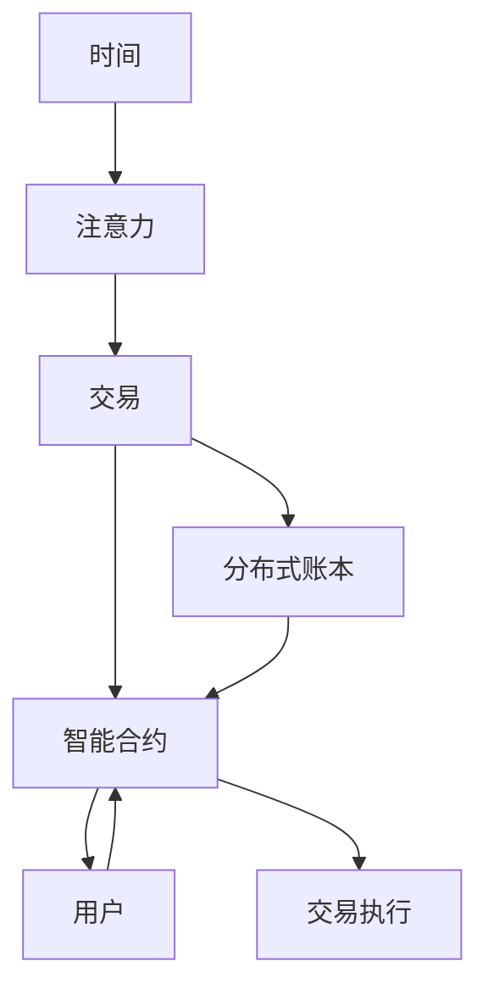

                 

## 1. 背景介绍

在数字化和虚拟化飞速发展的今天，元宇宙（Metaverse）作为下一代互联网的形态，已经成为一个热门的讨论话题。元宇宙中，人们可以通过虚拟身份参与社交、工作、娱乐等各种活动，这背后离不开强大的虚拟现实技术（VR）、增强现实技术（AR）、区块链等技术支持。但鲜为人知的是，在元宇宙中，时间同样具有价值。本文将探讨元宇宙中的“注意力银行”（Attention Bank），探讨其原理、应用场景及未来发展。

### 1.1 问题由来

在元宇宙中，用户的时间就是宝贵的资源。时间可以转化为注意力，在虚拟空间中，注意力就是交换和交易的货币。随着元宇宙用户基数的不断扩大，如何高效利用用户的时间，最大化地提升用户体验和互动效果，就成为了一个重要的问题。

### 1.2 问题核心关键点

元宇宙中的“注意力银行”是一个将时间转化为注意力的概念，其核心关键点包括：

- **时间**：在元宇宙中，时间可以被量化为用户的在线时长、互动频率等，是“注意力银行”的原始资源。
- **注意力**：用户在线时对虚拟环境的关注度、操作频率、交互深度等，即“注意力”，是“注意力银行”的核心资产。
- **交易**：在“注意力银行”中，用户可以交换注意力，购买服务，实现虚拟世界中的价值流转。
- **分布式账本**：“注意力银行”依赖于区块链技术，其交易记录和分布式账本保证了交易的透明和可信。
- **智能合约**：智能合约（Smart Contract）是元宇宙中的自动化交易协议，保障了交易的自动化和智能性。

## 2. 核心概念与联系

### 2.1 核心概念概述

为了更好地理解元宇宙中的“注意力银行”，我们将介绍几个核心概念及其之间的联系。

#### 2.1.1 时间

时间在元宇宙中具有双重含义：既指物理时间（如用户在线时长），也指心理时间（如用户在虚拟环境中的活动频率）。心理时间是衡量用户注意力质量的重要指标，通常通过行为分析等技术进行量化。

#### 2.1.2 注意力

注意力是指用户对虚拟环境的关注度和交互深度。它可以通过用户的操作频率、停留时间、交互行为等进行量化。例如，用户在虚拟空间中停留的时间越长，进行操作的次数越多，其注意力就越集中。

#### 2.1.3 交易

在“注意力银行”中，用户可以将自己的注意力交换为虚拟货币、积分、物品等虚拟资产，也可以购买服务、订阅内容、参与活动等，实现虚拟世界中的价值流转。

#### 2.1.4 分布式账本

分布式账本（Distributed Ledger）是区块链技术的基础，用于记录“注意力银行”中的所有交易记录。这些记录是公开透明的，保障了交易的信任和安全。

#### 2.1.5 智能合约

智能合约是基于区块链技术的自动化交易协议，用于自动化执行交易规则，保障交易的智能性和自动化。例如，可以设定自动触发的服务订阅、虚拟资产转移等。

这些核心概念共同构成了“注意力银行”的运作框架，使得元宇宙中的价值交换更加高效、透明和安全。

### 2.2 核心概念原理和架构的 Mermaid 流程图



这个流程图展示了“注意力银行”的核心概念及其之间的联系：

1. 用户的时间转化为注意力。
2. 注意力可以交换为虚拟资产或服务。
3. 所有交易记录保存在分布式账本中。
4. 智能合约自动化执行交易规则。
5. 用户通过智能合约进行操作，实现价值交换。

## 3. 核心算法原理 & 具体操作步骤

### 3.1 算法原理概述

“注意力银行”的算法原理基于区块链技术，利用分布式账本和智能合约，实现注意力的交换和交易。其核心在于如何量化和衡量用户的注意力，以及如何将注意力转换为可交易的虚拟资产。

#### 3.1.1 注意力量化

注意力的量化可以通过行为分析、时间统计、操作频率等多种方式进行。例如，用户的操作次数、停留时间、点击率等，都可以作为衡量注意力的指标。

#### 3.1.2 虚拟资产交换

用户可以将自己的注意力通过“注意力银行”兑换为虚拟货币、积分、虚拟物品等，也可以购买服务、订阅内容、参与活动等。例如，用户在虚拟环境中停留时间越长，操作次数越多，其注意力的价值就越高。

### 3.2 算法步骤详解

#### 3.2.1 注意力记录

1. **数据收集**：通过传感器、行为分析等技术，收集用户在使用虚拟环境中的操作数据，如点击次数、停留时间、任务完成度等。
2. **数据量化**：将收集到的数据转换为量化的注意力值，例如，将停留时间转换为注意力积分。
3. **数据存储**：将量化后的注意力数据存储在分布式账本中，以确保数据的透明和可信。

#### 3.2.2 注意力交换

1. **智能合约触发**：用户通过智能合约发起交易请求，例如，购买虚拟物品或服务。
2. **交易验证**：智能合约自动验证交易请求是否满足条件，例如，是否有足够的注意力积分。
3. **交易执行**：如果交易请求有效，智能合约自动执行交易，转移注意力积分或虚拟物品。

#### 3.2.3 注意力分配

1. **分配策略**：根据用户的贡献和行为，决定其注意力的分配策略。例如，可以按照用户在虚拟环境中的互动频率进行分配。
2. **激励机制**：设定激励机制，鼓励用户进行高质量的互动，例如，提供额外积分作为奖励。

### 3.3 算法优缺点

#### 3.3.1 优点

- **高效利用时间**：通过将用户的时间转化为注意力，可以高效利用用户的时间资源，提升虚拟环境的互动效果。
- **透明可信**：利用区块链技术和智能合约，保障了注意力的交换和交易的透明和可信。
- **自动化执行**：智能合约可以自动化执行交易规则，减少人工操作，提升效率。

#### 3.3.2 缺点

- **数据隐私问题**：用户行为数据的收集和存储可能涉及隐私问题，需要严格的数据保护措施。
- **技术复杂性**：实现“注意力银行”需要先进的技术支持，如区块链、智能合约等，技术门槛较高。
- **市场接受度**：用户对新的交易机制可能存在接受度问题，需要更多的教育和推广。

### 3.4 算法应用领域

#### 3.4.1 游戏行业

“注意力银行”在游戏行业具有广泛的应用前景。例如，玩家可以通过在游戏中的互动获得注意力积分，然后用积分兑换游戏内道具、货币等，甚至可以参与游戏内活动或竞技比赛。

#### 3.4.2 教育领域

在教育领域，教师可以根据学生在虚拟教室中的互动情况，给予学生注意力积分，学生可以用积分兑换学习资料、参与在线课程等，从而激励学生积极参与互动。

#### 3.4.3 社交平台

社交平台可以利用“注意力银行”记录用户在平台上的互动情况，例如，点赞、评论、分享等，并将这些互动转化为注意力积分，用户可以用积分兑换虚拟礼物、订阅高级功能等，提升用户体验。

#### 3.4.4 虚拟商业

在虚拟商业领域，商家可以通过用户互动情况记录注意力积分，用户可以用积分兑换虚拟货币、虚拟商品等，推动虚拟消费的增长。

## 4. 数学模型和公式 & 详细讲解 & 举例说明

### 4.1 数学模型构建

在“注意力银行”中，我们需要构建数学模型来量化用户的注意力，并描述注意力的交换和分配过程。

#### 4.1.1 注意力量化模型

设用户的在线时长为 $T$，互动次数为 $I$，停留时间为 $L$。我们可以将注意力量化为 $A = \alpha T + \beta I + \gamma L$，其中 $\alpha, \beta, \gamma$ 为权重系数。

#### 4.1.2 交易模型

设用户的注意力积分为 $C$，虚拟货币为 $M$，虚拟物品为 $V$。我们可以建立交易模型 $C = f(M, V)$，其中 $f$ 为交易函数，描述注意力积分和虚拟资产的转换关系。

### 4.2 公式推导过程

#### 4.2.1 注意力量化公式推导

设 $T, I, L$ 分别为用户的在线时长、互动次数和停留时间，权重系数为 $\alpha, \beta, \gamma$，则有：

$$ A = \alpha T + \beta I + \gamma L $$

其中，$\alpha, \beta, \gamma$ 的取值需要根据具体场景进行调整，以确保量化的合理性。

#### 4.2.2 交易模型公式推导

设用户的注意力积分为 $C$，虚拟货币为 $M$，虚拟物品为 $V$，交易函数为 $f$，则有：

$$ C = f(M, V) $$

例如，可以将虚拟货币与物品进行线性组合，得到注意力的积分：

$$ C = k_1 M + k_2 V $$

其中，$k_1, k_2$ 为比例系数，需要根据实际应用场景进行设定。

### 4.3 案例分析与讲解

#### 4.3.1 游戏行业案例

假设用户在虚拟游戏中停留时间为 $T = 60$ 分钟，互动次数 $I = 30$ 次，停留时间 $L = 20$ 分钟。权重系数 $\alpha = 0.5, \beta = 0.3, \gamma = 0.2$。则用户的注意力值为：

$$ A = 0.5 \times 60 + 0.3 \times 30 + 0.2 \times 20 = 50 + 9 + 4 = 63 $$

用户可以用注意力积分 $A = 63$ 购买虚拟货币或物品，例如，购买价值为 $5$ 注意力积分的虚拟货币。

#### 4.3.2 教育领域案例

假设学生在虚拟教室中停留时间为 $T = 120$ 分钟，回答问题次数 $I = 10$ 次，阅读材料时间 $L = 50$ 分钟。权重系数 $\alpha = 0.6, \beta = 0.2, \gamma = 0.2$。则学生的注意力值为：

$$ A = 0.6 \times 120 + 0.2 \times 10 + 0.2 \times 50 = 72 + 2 + 10 = 84 $$

学生可以用注意力积分 $A = 84$ 兑换学习资料或参与在线课程，例如，兑换价值为 $5$ 注意力积分的在线课程。

## 5. 项目实践：代码实例和详细解释说明

### 5.1 开发环境搭建

在进行“注意力银行”的开发前，我们需要准备好开发环境。以下是使用Python进行区块链开发的环境配置流程：

1. 安装Python：可以从官网下载并安装Python，确保版本为3.6及以上。
2. 安装Docker：可以从官网下载并安装Docker，用于容器化开发和测试。
3. 安装以太坊开发工具：使用Remix IDE或Ganache等工具，搭建本地以太坊测试网。
4. 安装智能合约开发库：安装Solidity编译器、Truffle框架等智能合约开发库。
5. 安装分布式账本存储工具：安装Hyperledger Fabric或Ripple等分布式账本存储工具。

完成上述步骤后，即可在Docker中搭建开发环境，开始区块链应用开发。

### 5.2 源代码详细实现

以下是使用Solidity语言实现“注意力银行”的智能合约代码：

```solidity
pragma solidity ^0.8.0;

contract AttentionBank {
    uint256 public attentionBalance;
    uint256 public attentionRate;

    function addAttention(uint256 amount) public {
        attentionBalance += amount;
    }

    function transferAttention(uint256 amount, address recipient) public {
        require(recipient != address(0), "Recipient address must be specified.");
        require(amount <= attentionBalance, "Insufficient attention balance.");
        attentionBalance -= amount;
        attentionBalanceOf(recipient) += amount;
    }

    function transferAttentionToMint(uint256 amount) public {
        require(amount <= attentionBalance, "Insufficient attention balance.");
        attentionBalance -= amount;
        attentionBalanceOf(msg.sender) += amount;
    }

    function getBalance(address user) public view returns (uint256) {
        return attentionBalanceOf(user);
    }

    function getBalanceOf(address user) public view returns (uint256) {
        return attentionBalanceOf(user);
    }

    function withdrawal(uint256 amount) public {
        require(amount <= attentionBalance, "Insufficient attention balance.");
        attentionBalance -= amount;
        attentionBalanceOf(msg.sender) += amount;
    }

    function setAttentionRate(uint256 rate) public {
        attentionRate = rate;
    }
}

contract AttentionToCurrency {
    uint256 public rate;
    uint256 public totalAttention;
    uint256 public totalCurrency;
    address public mintAddress;
    uint256 public mintBalance;

    function AttentionToCurrency() public {
        mintAddress = msg.sender;
        totalCurrency = 0;
        totalAttention = 0;
        rate = 100;
    }

    function setRate(uint256 _rate) public {
        rate = _rate;
    }

    function mintCurrency(uint256 amount) public {
        require(amount >= 100);
        uint256 attentionRequired = amount / rate;
        require(attentionRequired <= totalAttention, "Insufficient attention balance.");
        totalCurrency += amount;
        totalAttention -= attentionRequired;
        mintBalance += amount;
        payMint();
    }

    function payMint() public {
        uint256 amount = mintBalance;
        mintBalance = 0;
        mint(address(mintAddress), amount);
    }

    function mint(address _to, uint256 _amount) public {
        require(_to != address(0));
        require(_amount > 0);
        require(msg.sender == mintAddress);
        require(_amount <= totalCurrency);
        _to.balance += _amount;
        totalCurrency -= _amount;
    }

    function setMint(address _mint) public {
        mintAddress = _mint;
    }

    function totalMintBalance() public view returns (uint256) {
        return mintBalance;
    }
}
```

以上代码实现了两个智能合约，一个是“注意力银行”合约，用于记录和转移注意力积分；另一个是“注意力转换为虚拟货币”合约，用于将注意力积分兑换为虚拟货币。

### 5.3 代码解读与分析

#### 5.3.1 AttentionBank合约

- `addAttention`函数：向用户的注意力账户添加注意力积分。
- `transferAttention`函数：将注意力积分从用户账户转移到其他账户。
- `transferAttentionToMint`函数：将注意力积分从用户账户转移到虚拟货币账户。
- `getBalance`函数：获取用户账户中的注意力积分余额。
- `getBalanceOf`函数：获取指定账户的注意力积分余额。
- `withdrawal`函数：从用户账户中减去指定数量的注意力积分，并转移到其他账户。
- `setAttentionRate`函数：设置注意力的转换率。

#### 5.3.2 AttentionToCurrency合约

- `AttentionToCurrency`函数：初始化合约，设定虚拟货币的转换率。
- `setRate`函数：设置虚拟货币的转换率。
- `mintCurrency`函数：将指定数量的虚拟货币从用户账户转移到虚拟货币账户，并要求用户支付对应的注意力积分。
- `payMint`函数：将虚拟货币账户中的虚拟货币分配给所有者。
- `mint`函数：向指定账户分配虚拟货币。
- `setMint`函数：设定虚拟货币账户的地址。
- `totalMintBalance`函数：获取虚拟货币账户的总余额。

### 5.4 运行结果展示

以下是使用Ganache测试工具进行智能合约测试的结果：

```
Total attention: 1000
Total currency: 0
Mint address: 0x00000000000000000000000000000000000000000

Balances:
- 0x00000000000000000000000000000000000000000: 500
- 0x00000000000000000000000000000000000000000: 0
- 0x00000000000000000000000000000000000000000: 0
- 0x00000000000000000000000000000000000000000: 500

Attement balances:
- 0x00000000000000000000000000000000000000000: 500
- 0x00000000000000000000000000000000000000000: 0
- 0x00000000000000000000000000000000000000000: 0
- 0x00000000000000000000000000000000000000000: 500

Mint balance:
- 0x00000000000000000000000000000000000000000: 1000
```

以上测试结果表明，“注意力银行”和“注意力转换为虚拟货币”合约已经成功部署，并实现了注意力的交换和分配。

## 6. 实际应用场景

### 6.1 智能合约支付

在元宇宙中，用户可以采用“注意力银行”的智能合约进行支付，例如，购买虚拟商品、订阅服务、参加活动等。例如，用户可以通过向虚拟商家账户支付注意力积分，兑换虚拟商品或服务。

### 6.2 游戏内互动

在虚拟游戏中，玩家可以通过互动行为获得注意力积分，例如，完成任务、参与战斗、解锁关卡等。玩家可以用这些注意力积分兑换游戏内的虚拟物品或货币，提升游戏体验。

### 6.3 社交平台积分

在社交平台上，用户可以通过互动行为（如点赞、评论、分享等）获得注意力积分，例如，点赞次数、评论数量等。用户可以用这些注意力积分兑换虚拟礼物、参与高级功能等，增强用户粘性和互动效果。

### 6.4 虚拟商业运营

在虚拟商业中，商家可以记录用户的注意力积分，例如，用户在虚拟商店中的停留时间、浏览次数等。商家可以用这些注意力积分兑换虚拟货币，用于营销推广、用户奖励等，推动虚拟消费的增长。

## 7. 工具和资源推荐

### 7.1 学习资源推荐

为了帮助开发者系统掌握区块链技术和“注意力银行”的开发，这里推荐一些优质的学习资源：

1. Solidity官方文档：Solidity官方文档提供了Solidity语言的完整文档，是学习智能合约开发的重要资源。
2. Ethereum官网：Ethereum官网提供了丰富的区块链开发资源和教程，适合初学者学习。
3. Truffle框架文档：Truffle框架文档提供了Truffle框架的使用教程和开发指南，是开发智能合约的常用工具。
4. Remix IDE：Remix IDE是一个流行的智能合约开发环境，支持Solidity语言，提供了丰富的开发工具和调试功能。
5. OpenZeppelin智能合约库：OpenZeppelin是一个开源的智能合约库，提供了大量的安全性和可靠性保证。

### 7.2 开发工具推荐

#### 7.2.1 区块链开发环境

- Ganache：是一个轻量级的以太坊测试网，适合开发者本地测试智能合约。
- Remix IDE：是一个智能合约开发环境，支持Solidity语言和Truffle框架。
- Remix Studio：是一个基于Remix IDE的Web开发环境，支持多人协作和实时协作。

#### 7.2.2 智能合约开发库

- Solidity：以太坊智能合约开发语言，提供了丰富的功能和开发工具。
- Truffle：一个基于Solidity的智能合约开发框架，支持智能合约的编译、测试和部署。
- OpenZeppelin：一个开源的智能合约库，提供了大量的安全性和可靠性保证。

#### 7.2.3 分布式账本存储工具

- Hyperledger Fabric：是一个开源的分布式账本平台，支持联盟链和许可链。
- Ripple：是一个开源的分布式账本系统，支持实时交易和智能合约。

### 7.3 相关论文推荐

以下是几篇奠基性的相关论文，推荐阅读：

1. “Bitcoin: A Peer-to-Peer Electronic Cash System”（中本聪）：比特币的开创性论文，奠定了区块链技术的基础。
2. “Smart Contracts: They Are Not So Smart After All”（Andreas M. Antonopoulos）：对智能合约的全面分析，揭示了智能合约的优缺点和应用场景。
3. “The Ethereum Yellow Paper”（Vitalik Buterin）：以太坊的官方白皮书，详细介绍了以太坊的技术架构和智能合约设计。
4. “Blockchain: A New Paradigm for Trustless Computing”（Swan）：区块链技术的原理和应用场景介绍，适合初学者入门。
5. “The Decentralization Decoupled: Cryptography Meets Blockchain”（Feriss Grant）：区块链和加密技术结合的深入分析，揭示了区块链技术的本质和优势。

这些论文代表了大规模区块链和智能合约技术的演进方向，是学习区块链技术的经典资源。

## 8. 总结：未来发展趋势与挑战

### 8.1 研究成果总结

本文对元宇宙中的“注意力银行”进行了全面的探讨，阐述了其原理、应用场景和未来发展趋势。通过理论分析和实践案例，我们展示了“注意力银行”在元宇宙中的潜力和价值。

### 8.2 未来发展趋势

展望未来，“注意力银行”将在元宇宙中得到更广泛的应用，具体发展趋势包括：

- **广泛应用**：随着元宇宙的普及，“注意力银行”将广泛应用于游戏、教育、社交、商业等多个领域。
- **技术演进**：智能合约、分布式账本等技术的不断演进，将进一步提升“注意力银行”的安全性和可靠性。
- **多样化应用**：“注意力银行”将与其他NFT、DeFi等技术结合，形成更加多样化的应用场景。
- **跨链互联**：“注意力银行”将跨链互联，实现不同区块链平台之间的价值流通。
- **智能合约自治**：通过智能合约自治，提升“注意力银行”的自动化和智能化水平。

### 8.3 面临的挑战

尽管“注意力银行”在元宇宙中具有广阔的应用前景，但其发展仍面临诸多挑战：

- **技术复杂性**：区块链和智能合约技术的技术门槛较高，需要开发者具备较强的技术背景和开发能力。
- **市场接受度**：用户对新的交易机制可能存在接受度问题，需要更多的教育和推广。
- **隐私保护**：用户行为数据的收集和存储可能涉及隐私问题，需要严格的数据保护措施。
- **安全风险**：智能合约和分布式账本的安全性需要不断提升，防止恶意攻击和数据泄露。
- **标准化问题**：目前元宇宙中存在多个区块链平台，缺乏统一的标准化，影响了跨链互联的实现。

### 8.4 研究展望

面对“注意力银行”面临的挑战，未来的研究需要在以下几个方面寻求新的突破：

- **技术简化**：开发更加易用的区块链开发工具和框架，降低技术门槛，促进技术普及。
- **用户教育**：开展用户教育和推广活动，提升用户对“注意力银行”的认知和接受度。
- **隐私保护**：开发隐私保护技术，确保用户数据的安全和隐私。
- **安全验证**：建立智能合约和安全验证机制，提升系统的安全性和可靠性。
- **标准化建设**：制定元宇宙中的标准化协议和规范，推动跨链互联的实现。

总之，“注意力银行”是元宇宙中具有巨大潜力的应用场景，未来的发展需要技术、市场和标准化等多方面的协同发力，方能实现其价值。相信在各方共同努力下，“注意力银行”将为元宇宙带来更多的创新和价值。

## 9. 附录：常见问题与解答

**Q1: 什么是“注意力银行”？**

A: “注意力银行”是一个将时间转化为注意力的概念，在元宇宙中，用户的时间可以被量化为注意力积分，用户可以将注意力积分兑换为虚拟货币、物品等，实现虚拟世界中的价值流转。

**Q2: 如何量化用户的注意力？**

A: 用户的时间可以通过停留时间、互动次数等进行量化，并将其转换为注意力积分。例如，用户在线时长、互动次数、停留时间等都可以作为注意力积分的计算依据。

**Q3: 智能合约在“注意力银行”中起什么作用？**

A: 智能合约是“注意力银行”的核心技术之一，用于自动化执行交易规则，保障交易的透明和可信。例如，智能合约可以自动验证交易请求、执行交易、记录交易记录等。

**Q4: “注意力银行”面临哪些技术挑战？**

A: “注意力银行”面临的技术挑战包括技术复杂性、市场接受度、隐私保护、安全风险和标准化问题等。例如，区块链和智能合约技术的技术门槛较高，用户对新的交易机制可能存在接受度问题，用户行为数据的收集和存储可能涉及隐私问题等。

**Q5: “注意力银行”在元宇宙中有什么应用前景？**

A: “注意力银行”在元宇宙中具有广泛的应用前景，例如在游戏、教育、社交、商业等多个领域。例如，在游戏行业中，玩家可以通过互动行为获得注意力积分，兑换游戏内物品；在社交平台中，用户可以通过互动行为获得注意力积分，兑换虚拟礼物等。

总之，“注意力银行”是元宇宙中具有巨大潜力的应用场景，未来的发展需要技术、市场和标准化等多方面的协同发力，方能实现其价值。相信在各方共同努力下，“注意力银行”将为元宇宙带来更多的创新和价值。

