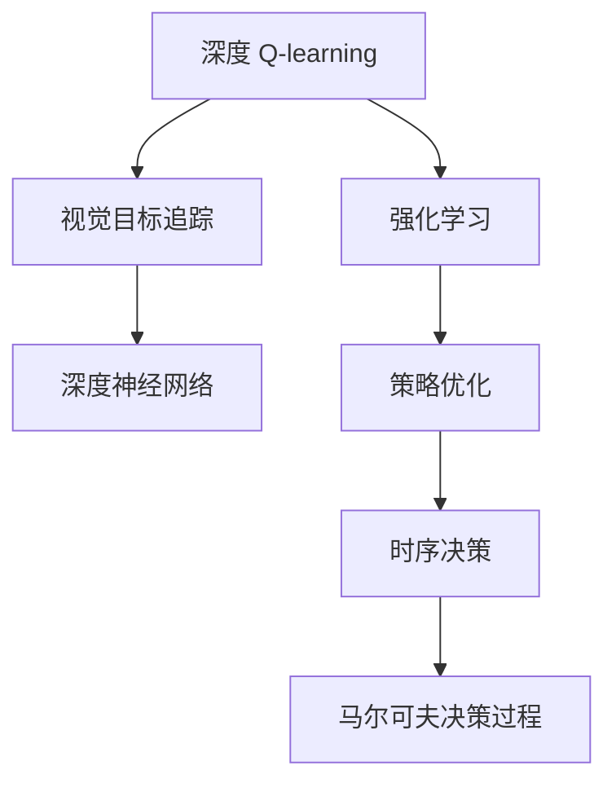

                 

# 深度 Q-learning：在视觉目标追踪领域的应用

> 关键词：深度 Q-learning, 强化学习, 视觉目标追踪, 策略优化, 时序决策, 深度神经网络, 马尔可夫决策过程, 案例分析, 模型实现, 实际应用

## 1. 背景介绍

### 1.1 问题由来

视觉目标追踪是计算机视觉领域中一项重要的任务，其目标是在视频序列中自动识别和连续地跟踪目标。这一过程面临着诸多挑战，如目标遮挡、目标形变、背景干扰、摄像头运动等。传统的基于特征的目标追踪方法，如卡尔曼滤波、粒子滤波等，虽然具有一定的精度，但往往难以应对复杂场景。近年来，强化学习在视觉目标追踪领域逐渐兴起，成为一种新的解决方案。

强化学习是一种从环境中学习最优决策序列的机器学习方法，适用于动态变化的环境。在视觉目标追踪中，强化学习可以模拟相机运动、目标状态估计等复杂的决策过程，通过不断的试错和优化，实现高效、鲁棒的目标追踪。本文将介绍深度 Q-learning 在视觉目标追踪领域的应用，重点探讨如何利用深度神经网络优化强化学习策略，并给出具体实现方法和实际应用案例。

## 2. 核心概念与联系

### 2.1 核心概念概述

为了更好地理解深度 Q-learning 在视觉目标追踪中的应用，我们首先介绍几个核心概念：

- **深度 Q-learning**：结合深度神经网络与强化学习的技术，通过强化学习的策略优化方法，使神经网络能够学习到最优的策略，以最大化期望奖励。深度 Q-learning 适用于复杂非线性问题的强化学习任务，能够处理高维连续状态和动作空间。
- **强化学习**：通过与环境交互，根据环境反馈不断调整策略，最终达到最优决策序列的学习方法。强化学习理论可追溯到马尔可夫决策过程（MDP），强调在动态变化的环境中，策略的优化和执行。
- **视觉目标追踪**：在视频序列中，通过不断更新目标位置和状态，实现对特定目标的连续跟踪。目标追踪需要处理多帧图像、目标形变、视角变化等动态信息，对算法的鲁棒性和实时性有较高要求。
- **深度神经网络**：基于多层感知器（MLP）或卷积神经网络（CNN）的神经网络结构，能够处理大规模数据和复杂任务。深度神经网络已广泛应用于图像识别、语音识别、自然语言处理等领域，并取得了巨大成功。

这些概念之间的逻辑关系可以通过以下 Mermaid 流程图来展示：



这个流程图展示了深度 Q-learning 在视觉目标追踪中的应用：

1. 深度 Q-learning 通过结合深度神经网络和强化学习，学习最优策略。
2. 强化学习利用马尔可夫决策过程，模拟目标追踪的动态决策过程。
3. 时序决策通过不断调整策略，使目标追踪适应动态变化的环境。
4. 视觉目标追踪需要处理高维图像信息，深度神经网络提供了高效的特征提取能力。

## 3. 核心算法原理 & 具体操作步骤

### 3.1 算法原理概述

深度 Q-learning 的核心思想是通过深度神经网络逼近 Q-learning 的 Q 值函数，从而实现策略优化。在强化学习中，Q 值函数表示在特定状态下，执行特定动作后获得未来奖励的期望值。Q-learning 算法通过不断迭代，更新 Q 值函数，最终找到最优策略。

在深度 Q-learning 中，Q 值函数由多层神经网络构成，网络的权重作为待优化的参数。通过反向传播算法，网络自动学习输入和输出之间的映射关系，从而得到近似最优的 Q 值函数。深度 Q-learning 的训练过程包括两个主要步骤：策略更新和目标函数优化。

策略更新通过预测下一个动作，使得神经网络学习到最大化期望奖励的策略。目标函数优化则通过最小化实际获得的奖励与预测奖励的差异，使神经网络逼近真实的 Q 值函数。具体步骤如下：

1. **策略更新**：根据当前状态和动作，预测下一个状态和奖励，更新神经网络权重。
2. **目标函数优化**：计算当前状态和动作的真实奖励，与预测奖励的差异，反向传播更新权重。
3. **重复迭代**：不断重复策略更新和目标函数优化，直到收敛。

### 3.2 算法步骤详解

深度 Q-learning 在视觉目标追踪中的应用步骤如下：

**Step 1: 初始化模型和参数**
- 初始化深度神经网络，设定网络结构、学习率等超参数。
- 设定 Q-learning 的目标函数和奖励函数。

**Step 2: 数据预处理**
- 对输入的图像进行预处理，提取关键特征。
- 将目标的位置信息转换为网络可接受的格式。

**Step 3: 策略更新**
- 在每个时间步，观察当前状态，执行一个动作。
- 预测下一个状态和奖励，计算损失函数。
- 使用反向传播算法，更新网络权重。

**Step 4: 目标函数优化**
- 在每个时间步，计算真实奖励和预测奖励的差异。
- 使用反向传播算法，更新网络权重。

**Step 5: 重复迭代**
- 不断重复策略更新和目标函数优化，直至收敛。

### 3.3 算法优缺点

深度 Q-learning 在视觉目标追踪中的应用具有以下优点：

- **高效性**：通过神经网络逼近 Q 值函数，可以处理高维、连续的状态和动作空间，适用于复杂的目标追踪任务。
- **鲁棒性**：神经网络能够适应多种目标和背景的动态变化，具有良好的鲁棒性。
- **自适应性**：神经网络能够自适应地调整策略，适应不同场景的跟踪需求。

同时，该算法也存在一些缺点：

- **计算复杂度**：深度神经网络需要大量的计算资源，训练时间较长。
- **过拟合风险**：深度神经网络容易过拟合，需要在训练过程中注意正则化和数据增强等策略。
- **稳定性问题**：神经网络在训练过程中容易收敛到局部最优解，需要通过多种优化方法提高稳定性。

### 3.4 算法应用领域

深度 Q-learning 在视觉目标追踪中的应用广泛，适用于多个领域，例如：

- 动态目标跟踪：在运动目标上，通过深度 Q-learning 实现高效、鲁棒的目标追踪。
- 行人跟踪：在复杂背景中，使用深度 Q-learning 对行人进行精准追踪。
- 物体识别和跟踪：在静态图像和视频中，通过深度 Q-learning 对物体进行识别和连续跟踪。
- 智能监控：在视频监控系统中，使用深度 Q-learning 对异常行为进行实时检测和跟踪。

此外，深度 Q-learning 还可以应用于机器人导航、自动驾驶等领域，通过优化决策策略，提升系统的智能水平。

## 4. 数学模型和公式 & 详细讲解 & 举例说明

### 4.1 数学模型构建

在深度 Q-learning 中，我们假设目标追踪的环境为马尔可夫决策过程，环境状态为 $s_t$，当前动作为 $a_t$，下一个状态为 $s_{t+1}$，奖励为 $r_{t+1}$。目标是通过优化 Q 值函数 $Q(s_t, a_t)$，最大化期望累积奖励 $\mathbb{E}[\sum_{t=0}^{\infty} \gamma^t r_{t+1}]$，其中 $\gamma$ 为折扣因子。

深度 Q-learning 使用神经网络逼近 Q 值函数，网络的输入为当前状态 $s_t$，输出为 Q 值 $Q(s_t, a_t)$。网络的权重 $\theta$ 为待优化的参数。

目标函数为均方误差损失函数：

$$
L = \mathbb{E}[(Q_{\theta}(s_t, a_t) - (r_{t+1} + \gamma Q_{\theta}(s_{t+1}, a_{t+1})))^2]
$$

其中，$Q_{\theta}(s_t, a_t)$ 为神经网络输出的 Q 值，$(s_{t+1}, a_{t+1})$ 为根据当前状态和动作预测的下一个状态和动作，$r_{t+1}$ 为真实奖励。

### 4.2 公式推导过程

在深度 Q-learning 中，我们需要通过神经网络逼近 Q 值函数，从而实现策略优化。以下是深度 Q-learning 的核心公式推导：

1. **策略更新公式**：

$$
Q_{\theta}(s_t, a_t) \leftarrow Q_{\theta}(s_t, a_t) + \alpha [r_{t+1} + \gamma Q_{\theta}(s_{t+1}, a_{t+1}) - Q_{\theta}(s_t, a_t)]
$$

其中，$\alpha$ 为学习率，$r_{t+1}$ 为当前状态和动作的真实奖励，$s_{t+1}$ 为根据当前状态和动作预测的下一个状态，$a_{t+1}$ 为根据下一个状态预测的动作。

2. **目标函数优化公式**：

$$
\theta \leftarrow \theta - \eta \nabla_{\theta}L
$$

其中，$\eta$ 为反向传播的学习率，$L$ 为目标函数。

### 4.3 案例分析与讲解

以下以一个简单的行人跟踪为例，展示深度 Q-learning 的应用过程：

1. **环境建模**：假设行人总是在一个固定区域内移动，环境状态 $s_t$ 包括行人的位置、速度、方向等。
2. **动作定义**：动作 $a_t$ 包括向左、向右、向前、向后等方向移动。
3. **状态转移**：根据当前状态和动作，预测下一个状态 $s_{t+1}$。
4. **奖励计算**：计算当前状态和动作的奖励 $r_{t+1}$，例如：
   - 行人到达目标区域得 1 分。
   - 行人偏离目标区域得 -1 分。
5. **目标函数优化**：使用反向传播算法，更新网络权重，最小化预测奖励与真实奖励的差异。

通过上述步骤，深度 Q-learning 能够自适应地调整策略，适应不同行人的移动行为，实现高效的行人跟踪。

## 5. 项目实践：代码实例和详细解释说明

### 5.1 开发环境搭建

在进行深度 Q-learning 项目实践前，我们需要准备好开发环境。以下是使用 Python 和 PyTorch 进行深度 Q-learning 开发的环境配置流程：

1. 安装 Anaconda：从官网下载并安装 Anaconda，用于创建独立的 Python 环境。

2. 创建并激活虚拟环境：
```bash
conda create -n deepq-env python=3.8 
conda activate deepq-env
```

3. 安装 PyTorch：根据 CUDA 版本，从官网获取对应的安装命令。例如：
```bash
conda install pytorch torchvision torchaudio cudatoolkit=11.1 -c pytorch -c conda-forge
```

4. 安装深度学习框架和工具包：
```bash
pip install torch nn
```

5. 安装可视化工具：
```bash
pip install tensorboard
```

完成上述步骤后，即可在 `deepq-env` 环境中开始深度 Q-learning 实践。

### 5.2 源代码详细实现

以下是一个简单的行人跟踪的深度 Q-learning 代码实现，使用了 PyTorch 框架。

```python
import torch
import torch.nn as nn
import torch.optim as optim

# 定义神经网络结构
class QNetwork(nn.Module):
    def __init__(self, input_size, output_size):
        super(QNetwork, self).__init__()
        self.fc1 = nn.Linear(input_size, 128)
        self.fc2 = nn.Linear(128, 64)
        self.fc3 = nn.Linear(64, output_size)

    def forward(self, x):
        x = torch.relu(self.fc1(x))
        x = torch.relu(self.fc2(x))
        x = self.fc3(x)
        return x

# 定义深度 Q-learning 模型
class DeepQLearning:
    def __init__(self, input_size, output_size):
        self.input_size = input_size
        self.output_size = output_size
        self.learning_rate = 0.01
        self.gamma = 0.9
        self.loss = nn.MSELoss()
        self.optimizer = optim.Adam
        self.model = QNetwork(input_size, output_size)
        self.target_model = QNetwork(input_size, output_size)
        self.target_model.load_state_dict(self.model.state_dict())
        self.target_model.eval()

    def update_target_model(self):
        self.target_model.load_state_dict(self.model.state_dict())

    def forward(self, state):
        action = self.model(state)
        return action

    def update_model(self, state, action, next_state, reward):
        target = reward + self.gamma * self.target_model(next_state).max().item()
        self.loss(self.model(state), target).backward()
        self.optimizer.step()
        self.update_target_model()
```

在上述代码中，我们定义了一个简单的神经网络结构 `QNetwork`，用于逼近 Q 值函数。深度 Q-learning 模型 `DeepQLearning` 包含神经网络结构、学习率、折扣因子、损失函数、优化器等关键组件。

### 5.3 代码解读与分析

让我们再详细解读一下关键代码的实现细节：

**QNetwork类**：
- `__init__`方法：定义神经网络的层数和参数。
- `forward`方法：前向传播，计算输出 Q 值。

**DeepQLearning类**：
- `__init__`方法：初始化模型和超参数。
- `update_target_model`方法：更新目标模型的参数。
- `forward`方法：计算神经网络的 Q 值。
- `update_model`方法：更新模型的参数，使用反向传播算法最小化预测奖励与真实奖励的差异。

**训练流程**：
- 定义神经网络结构和深度 Q-learning 模型。
- 在训练过程中，不断更新模型的参数，优化 Q 值函数。
- 在每个时间步，观察当前状态，执行一个动作，计算真实奖励和预测奖励的差异，更新神经网络权重。
- 通过不断迭代，使深度 Q-learning 模型能够学习到最优的策略。

## 6. 实际应用场景

### 6.1 智能监控

深度 Q-learning 在智能监控中的应用广泛。在视频监控系统中，可以使用深度 Q-learning 对异常行为进行实时检测和跟踪。例如，通过学习如何区分正常行人和可疑人员，能够及时发现和响应安全事件。

具体而言，可以使用行人检测算法提取监控区域中的行人位置信息，作为深度 Q-learning 的输入状态。通过训练，深度 Q-learning 可以学习到如何根据当前状态和动作，预测下一个状态和奖励，从而对异常行为进行精准跟踪。

### 6.2 自动驾驶

深度 Q-learning 在自动驾驶中也具有广泛的应用前景。自动驾驶车辆需要实时处理大量的动态信息，包括路面状态、交通信号、行人行为等。深度 Q-learning 可以用于优化车辆的决策策略，使其能够在动态环境中做出最优的行驶决策。

例如，在交叉路口，深度 Q-learning 可以学习如何根据当前位置和速度，选择最佳的加速和转向策略。通过不断调整策略，深度 Q-learning 能够使车辆更高效、更安全地行驶。

### 6.3 智能导航

深度 Q-learning 在智能导航中也具有重要应用。通过学习如何在复杂的城市道路中做出最优的驾驶决策，深度 Q-learning 可以显著提升导航系统的智能水平。

例如，在导航过程中，深度 Q-learning 可以学习如何根据当前位置和方向，选择最佳的行驶路线。通过不断调整策略，深度 Q-learning 能够使导航系统更加智能、更加人性化。

### 6.4 未来应用展望

随着深度 Q-learning 技术的发展，未来在视觉目标追踪领域的应用将更加广泛和深入。以下是一些未来应用趋势：

1. **多目标跟踪**：深度 Q-learning 可以应用于多目标跟踪，学习如何在动态环境中同时跟踪多个目标。
2. **跨模态融合**：深度 Q-learning 可以与计算机视觉、自然语言处理等其他模态技术进行融合，提升跟踪效果。
3. **跨领域应用**：深度 Q-learning 可以应用于多个领域，如医疗、金融、制造等，提升业务系统的智能水平。
4. **实时处理**：深度 Q-learning 可以在实时数据上训练和优化，满足动态变化的环境需求。
5. **自适应学习**：深度 Q-learning 可以学习环境变化规律，实现自适应调整策略，提升系统鲁棒性。

深度 Q-learning 技术的发展，将使视觉目标追踪系统更加智能、更加高效，为更多行业带来变革性影响。

## 7. 工具和资源推荐

### 7.1 学习资源推荐

为了帮助开发者系统掌握深度 Q-learning 的理论基础和实践技巧，这里推荐一些优质的学习资源：

1. 《Deep Reinforcement Learning for Agents, Game Playing and Trading》书籍：斯坦福大学出版社出版的深度强化学习经典教材，全面介绍了深度 Q-learning 算法及其应用。
2. 《Deep Q-Networks》论文：DeepMind 发表的深度 Q-learning 原始论文，阐述了深度 Q-learning 的算法原理和应用案例。
3. 《Reinforcement Learning: An Introduction》书籍：Reinforcement Learning 领域的经典教材，涵盖深度 Q-learning 及其变体的详细理论。
4. 《Introduction to Deep Reinforcement Learning》课程：斯坦福大学在线课程，系统讲解深度 Q-learning 及其在实际应用中的实现方法。
5. PyTorch官方文档：PyTorch框架的官方文档，提供了深度 Q-learning 的详细实现示例和API接口。

通过对这些资源的学习实践，相信你一定能够快速掌握深度 Q-learning 的精髓，并用于解决实际的视觉目标追踪问题。

### 7.2 开发工具推荐

高效的开发离不开优秀的工具支持。以下是几款用于深度 Q-learning 开发的常用工具：

1. PyTorch：基于Python的开源深度学习框架，灵活动态的计算图，适合快速迭代研究。深度 Q-learning 算法可以用 PyTorch 轻松实现。
2. TensorFlow：由Google主导开发的开源深度学习框架，生产部署方便，适合大规模工程应用。
3. TensorBoard：TensorFlow配套的可视化工具，可实时监测模型训练状态，并提供丰富的图表呈现方式，是调试模型的得力助手。
4. Weights & Biases：模型训练的实验跟踪工具，可以记录和可视化模型训练过程中的各项指标，方便对比和调优。
5. Jupyter Notebook：交互式编程环境，支持多种编程语言和库，适合进行深度 Q-learning 的快速原型开发和实验验证。

合理利用这些工具，可以显著提升深度 Q-learning 任务的开发效率，加快创新迭代的步伐。

### 7.3 相关论文推荐

深度 Q-learning 的发展源于学界的持续研究。以下是几篇奠基性的相关论文，推荐阅读：

1. Deep Q-Learning：一种基于深度神经网络的强化学习方法，发表在Nature论文中，奠定了深度 Q-learning 的理论基础。
2. Human-level control through deep reinforcement learning：DeepMind发表的AlphaGo论文，展示了深度 Q-learning 在复杂决策问题上的应用潜力。
3. Distributed Deep Reinforcement Learning with Importance Weighted Actor-Learner Architectures：论文提出了分布式深度强化学习算法，优化了深度 Q-learning 的训练效率。
4. Policy Distillation for Deep Reinforcement Learning：论文提出了一种基于知识蒸馏的深度强化学习算法，提高了深度 Q-learning 的稳定性和泛化能力。
5. Prioritized Experience Replay：论文提出了一种基于优先经验的深度强化学习算法，优化了深度 Q-learning 的样本选择策略，提高了学习效率。

这些论文代表了大语言模型微调技术的发展脉络。通过学习这些前沿成果，可以帮助研究者把握学科前进方向，激发更多的创新灵感。

## 8. 总结：未来发展趋势与挑战

### 8.1 总结

本文对深度 Q-learning 在视觉目标追踪领域的应用进行了全面系统的介绍。首先阐述了深度 Q-learning 的基本概念和应用背景，明确了深度 Q-learning 在视觉目标追踪中的独特价值。其次，从原理到实践，详细讲解了深度 Q-learning 的数学模型和关键步骤，给出了深度 Q-learning 项目开发的完整代码实例。同时，本文还广泛探讨了深度 Q-learning 在智能监控、自动驾驶、智能导航等多个行业领域的应用前景，展示了深度 Q-learning 范式的巨大潜力。此外，本文精选了深度 Q-learning 技术的各类学习资源，力求为读者提供全方位的技术指引。

通过本文的系统梳理，可以看到，深度 Q-learning 在视觉目标追踪领域具有广阔的应用前景。深度 Q-learning 结合深度神经网络和强化学习，能够处理高维、连续的状态和动作空间，适用于复杂的目标追踪任务。未来，伴随深度 Q-learning 技术的不断发展，其在视觉目标追踪领域的应用将更加广泛和深入，为更多行业带来变革性影响。

### 8.2 未来发展趋势

展望未来，深度 Q-learning 在视觉目标追踪中的应用将呈现以下几个发展趋势：

1. **多模态融合**：深度 Q-learning 可以与计算机视觉、自然语言处理等其他模态技术进行融合，提升跟踪效果。
2. **跨领域应用**：深度 Q-learning 可以应用于多个领域，如医疗、金融、制造等，提升业务系统的智能水平。
3. **实时处理**：深度 Q-learning 可以在实时数据上训练和优化，满足动态变化的环境需求。
4. **自适应学习**：深度 Q-learning 可以学习环境变化规律，实现自适应调整策略，提升系统鲁棒性。
5. **分布式训练**：深度 Q-learning 可以应用于分布式环境中，通过多机协同训练，提升训练效率和模型性能。

以上趋势凸显了深度 Q-learning 技术的广阔前景。这些方向的探索发展，将进一步提升视觉目标追踪系统的性能和应用范围，为更多行业带来变革性影响。

### 8.3 面临的挑战

尽管深度 Q-learning 技术已经取得了瞩目成就，但在迈向更加智能化、普适化应用的过程中，它仍面临着诸多挑战：

1. **计算资源瓶颈**：深度神经网络需要大量的计算资源，训练时间较长。如何优化训练过程，提高模型训练效率，是未来需要解决的重要问题。
2. **数据稀疏性问题**：深度 Q-learning 需要大量的训练数据，但数据获取成本高昂，且数据稀疏性问题难以解决。如何利用有限数据进行高效训练，是深度 Q-learning 需要面临的挑战。
3. **模型泛化能力**：深度 Q-learning 模型在面对新任务时，泛化能力有限。如何提高模型的泛化能力，使其能够适应更多场景，是未来需要解决的重要问题。
4. **鲁棒性不足**：深度 Q-learning 模型面对数据干扰和噪声，鲁棒性不足。如何提高模型的鲁棒性，确保在复杂环境中的稳定性能，是未来需要解决的重要问题。
5. **模型可解释性**：深度 Q-learning 模型较为复杂，难以解释其内部工作机制和决策逻辑。如何增强模型的可解释性，使其更加透明，是未来需要解决的重要问题。

### 8.4 研究展望

面对深度 Q-learning 面临的挑战，未来的研究需要在以下几个方面寻求新的突破：

1. **优化训练算法**：开发更加高效的训练算法，如分布式训练、混合精度训练、量化加速等，提高深度 Q-learning 的训练效率和模型性能。
2. **数据增强**：通过数据增强技术，扩大训练数据集，提高深度 Q-learning 的泛化能力。
3. **跨模态融合**：将计算机视觉、自然语言处理等其他模态信息与深度 Q-learning 进行融合，提升视觉目标追踪的准确性和鲁棒性。
4. **模型蒸馏**：通过知识蒸馏等方法，将复杂深度 Q-learning 模型转化为轻量级模型，降低计算资源需求，提升实时性能。
5. **自适应学习**：开发自适应学习算法，使深度 Q-learning 能够适应动态变化的环境，提高系统的稳定性和鲁棒性。

这些研究方向的探索，将引领深度 Q-learning 技术迈向更高的台阶，为视觉目标追踪系统带来更多创新和突破。面向未来，深度 Q-learning 技术需要与其他人工智能技术进行更深入的融合，如知识表示、因果推理、强化学习等，多路径协同发力，共同推动自然语言理解和智能交互系统的进步。只有勇于创新、敢于突破，才能不断拓展视觉目标追踪系统的边界，让智能技术更好地造福人类社会。

## 9. 附录：常见问题与解答

**Q1：深度 Q-learning 在视觉目标追踪中如何实现？**

A: 深度 Q-learning 在视觉目标追踪中主要通过以下步骤实现：
1. **环境建模**：将视频序列中的目标位置信息转化为神经网络可接受的输入格式。
2. **动作定义**：定义目标的移动方向和速度等动作。
3. **策略更新**：根据当前状态和动作，预测下一个状态和奖励，更新神经网络权重。
4. **目标函数优化**：计算当前状态和动作的真实奖励和预测奖励的差异，使用反向传播算法更新权重。
5. **重复迭代**：不断重复策略更新和目标函数优化，直至收敛。

通过上述步骤，深度 Q-learning 能够自适应地调整策略，适应不同场景的跟踪需求，实现高效的视觉目标追踪。

**Q2：深度 Q-learning 在智能监控中如何实现异常行为检测？**

A: 在智能监控中，深度 Q-learning 可以通过以下步骤实现异常行为检测：
1. **行人检测**：使用行人检测算法提取监控区域中的行人位置信息，作为深度 Q-learning 的输入状态。
2. **动作定义**：定义行人的移动方向和速度等动作。
3. **策略更新**：根据当前状态和动作，预测下一个状态和奖励，更新神经网络权重。
4. **目标函数优化**：计算当前状态和动作的真实奖励和预测奖励的差异，使用反向传播算法更新权重。
5. **重复迭代**：不断重复策略更新和目标函数优化，直至收敛。

通过上述步骤，深度 Q-learning 可以学习如何区分正常行人和可疑人员，实现异常行为检测和实时响应。

**Q3：深度 Q-learning 在自动驾驶中的优势是什么？**

A: 深度 Q-learning 在自动驾驶中的优势主要体现在以下几个方面：
1. **动态决策能力**：深度 Q-learning 能够处理动态环境中的复杂决策问题，如路口转向、车流避让等。
2. **鲁棒性**：深度 Q-learning 能够自适应地调整策略，适应不同道路和交通情况，提高系统的鲁棒性。
3. **实时处理**：深度 Q-learning 可以在实时数据上训练和优化，满足自动驾驶对实时性的高要求。
4. **跨模态融合**：深度 Q-learning 可以与计算机视觉、自然语言处理等其他模态技术进行融合，提升驾驶系统的智能水平。

通过深度 Q-learning 的优化决策策略，自动驾驶车辆能够更高效、更安全地行驶，提升驾驶体验。

**Q4：深度 Q-learning 在智能导航中的挑战是什么？**

A: 深度 Q-learning 在智能导航中的挑战主要包括以下几个方面：
1. **动态环境**：智能导航需要处理动态变化的城市道路，深度 Q-learning 需要学习如何在复杂环境中做出最优的驾驶决策。
2. **数据获取成本高**：智能导航需要大量高精度的地图和实时交通数据，数据获取成本高昂。
3. **计算资源需求大**：深度神经网络需要大量的计算资源，训练时间较长。
4. **泛化能力有限**：深度 Q-learning 模型在面对新环境和新任务时，泛化能力有限。

通过优化训练算法、数据增强、跨模态融合等技术，可以克服深度 Q-learning 在智能导航中的挑战，提升系统的性能和可靠性。

**Q5：深度 Q-learning 的未来研究方向是什么？**

A: 深度 Q-learning 的未来研究方向主要包括以下几个方面：
1. **分布式训练**：开发分布式深度强化学习算法，提高训练效率和模型性能。
2. **知识蒸馏**：通过知识蒸馏等方法，将复杂深度 Q-learning 模型转化为轻量级模型，降低计算资源需求。
3. **自适应学习**：开发自适应学习算法，使深度 Q-learning 能够适应动态变化的环境，提高系统的稳定性和鲁棒性。
4. **多模态融合**：将计算机视觉、自然语言处理等其他模态信息与深度 Q-learning 进行融合，提升视觉目标追踪的准确性和鲁棒性。
5. **模型蒸馏**：通过知识蒸馏等方法，将复杂深度 Q-learning 模型转化为轻量级模型，降低计算资源需求，提升实时性能。

这些研究方向将引领深度 Q-learning 技术迈向更高的台阶，为视觉目标追踪系统带来更多创新和突破。

---

作者：禅与计算机程序设计艺术 / Zen and the Art of Computer Programming

