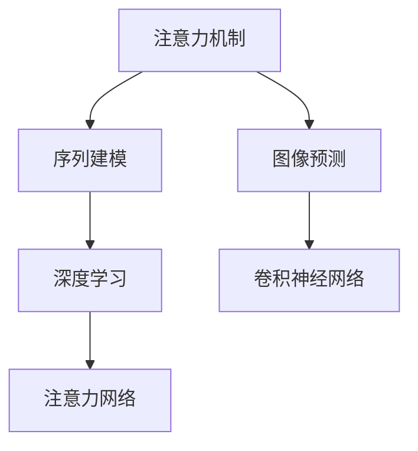

                 

# 深度学习在注意力预测中的应用

> 关键词：深度学习,注意力机制,预测模型,案例分析,项目实践

## 1. 背景介绍

### 1.1 问题由来

随着深度学习技术的不断发展，注意力机制(AAttention)已经成为当前研究的热点之一。注意力机制在自然语言处理、计算机视觉、图像生成等众多领域中得到了广泛的应用，极大地提升了模型的性能。特别是在序列建模任务中，如机器翻译、对话生成、语音识别等，注意力机制已经成为不可或缺的核心技术。

然而，尽管注意力机制在诸多领域中已经展现了其强大的能力，但在一些特定的预测任务中，传统的注意力机制仍存在局限性。比如，在图像预测、推荐系统等任务中，传统的注意力机制往往难以捕捉长距离依赖和全局关联。

为了解决这些问题，近年来研究人员提出了许多改进型的注意力机制，如Transformer、Squeeze-and-Excitation(SENet)、Dynamic Attention等，并在多个领域取得了显著的成果。本文将详细介绍这些改进型注意力机制，并通过一个实际案例，展示它们在图像预测任务中的应用。

### 1.2 问题核心关键点

本节将详细阐述注意力预测的主要问题点，并说明本文的主要研究方向。

- 注意力机制的原理和应用：介绍注意力机制的基本原理，以及它在序列建模、图像处理等任务中的具体应用。
- 改进型注意力机制的提出：分析传统注意力机制的局限性，并介绍几种改进型的注意力机制，如Transformer、SENet、Dynamic Attention等。
- 项目实践：通过一个具体的图像预测案例，展示如何使用改进型注意力机制构建高效的预测模型。

本文的主要目标是：

1. 全面介绍深度学习中注意力预测的相关知识，包括注意力机制的原理、改进型注意力机制的提出、实际应用等。
2. 通过一个实际的图像预测案例，详细展示如何使用改进型注意力机制构建高效的预测模型，并进行系统性分析。
3. 探讨未来注意力预测的发展趋势和面临的挑战，为后续的研究工作提供方向性指导。

## 2. 核心概念与联系

### 2.1 核心概念概述

本节将详细介绍注意力预测中的几个核心概念：

- 注意力机制(AAttention)：一种通过动态计算不同输入特征的权重，实现对关键信息的重点关注和筛选的技术。
- 序列建模(Sequence Modeling)：利用模型对输入序列进行建模，以捕捉序列中不同元素之间的依赖关系。
- 图像预测(Image Prediction)：利用模型对图像进行预测，如图像分类、目标检测、图像生成等。
- 深度学习(Deep Learning)：一种通过多层神经网络模型对数据进行训练和预测的机器学习方法。
- 卷积神经网络(Convolutional Neural Network, CNN)：一种通过卷积和池化操作提取图像特征的神经网络结构。
- 注意力网络(Attention Network)：一种在注意力机制基础上构建的神经网络结构，用于处理序列和图像等任务。

这些概念之间的关系如下图所示：



这张图展示了注意力预测中的几个核心概念及其相互联系。其中，注意力机制是处理序列和图像等任务的关键技术，通过动态计算不同特征的权重，实现对关键信息的重点关注和筛选。深度学习则通过多层神经网络模型对数据进行训练和预测，能够捕捉复杂的非线性关系。序列建模和图像预测则是注意力机制在不同任务中的具体应用，而卷积神经网络则是图像预测任务中常用的特征提取技术。注意力网络和卷积神经网络则是在深度学习框架下，利用注意力机制构建的两种常见的神经网络结构。

## 3. 核心算法原理 & 具体操作步骤

### 3.1 算法原理概述

注意力机制的原理可以追溯到20世纪90年代的相关研究。早期的注意力机制主要应用于自然语言处理领域，用于对输入序列中的关键信息进行关注和筛选。近年来，随着深度学习技术的发展，注意力机制被广泛应用于计算机视觉、图像生成等任务中，取得了显著的成果。

在深度学习中，注意力机制通常与神经网络结构相结合，用于处理序列和图像等任务。其中，常见的注意力机制有自注意力机制(Self-Attention)、多头注意力机制(Multi-Head Attention)、软注意力机制(Soft Attention)等。这些注意力机制的基本原理都是通过动态计算不同输入特征的权重，实现对关键信息的重点关注和筛选。

### 3.2 算法步骤详解

本节将详细介绍深度学习中注意力预测的算法步骤：

1. 数据预处理：对输入数据进行预处理，如归一化、数据增强等。
2. 特征提取：利用卷积神经网络等技术，对输入数据进行特征提取。
3. 计算注意力权重：通过自注意力机制或多头注意力机制，计算不同特征的权重。
4. 加权融合：将不同特征按照计算出的权重进行加权融合，得到新的特征表示。
5. 输出预测：利用新的特征表示进行输出预测，如分类、检测等。

以下是一个详细的算法步骤示例：

1. 数据预处理：
   - 对输入图像进行归一化，以加快模型的收敛速度。
   - 对输入数据进行数据增强，如旋转、翻转、缩放等，以提高模型的泛化能力。

2. 特征提取：
   - 利用卷积神经网络，对输入图像进行特征提取。
   - 将提取到的特征表示输入到注意力网络中，用于计算不同特征的权重。

3. 计算注意力权重：
   - 利用自注意力机制或多头注意力机制，计算不同特征的权重。
   - 根据计算出的权重，对不同特征进行加权融合，得到新的特征表示。

4. 加权融合：
   - 利用新的特征表示进行输出预测，如分类、检测等。

### 3.3 算法优缺点

注意力机制具有以下优点：

- 能够对输入序列或图像中的关键信息进行重点关注和筛选。
- 能够捕捉长距离依赖和全局关联，提升模型的预测性能。
- 适用于多种任务，如机器翻译、图像生成、语音识别等。

然而，注意力机制也存在一些缺点：

- 计算复杂度高，特别是在大规模数据集上，计算量较大。
- 容易产生过拟合现象，特别是在数据量较少的情况下。
- 对模型参数的依赖较大，需要精心调整超参数。

### 3.4 算法应用领域

注意力机制在多个领域中得到了广泛应用，以下是一些常见的应用场景：

- 自然语言处理：利用注意力机制对输入序列进行建模，用于机器翻译、问答系统、文本分类等任务。
- 计算机视觉：利用注意力机制对输入图像进行建模，用于图像分类、目标检测、图像生成等任务。
- 语音识别：利用注意力机制对输入语音进行建模，用于语音识别、语音合成等任务。
- 强化学习：利用注意力机制对输入状态进行建模，用于游戏策略、机器人控制等任务。
- 图像处理：利用注意力机制对输入图像进行建模，用于图像修复、图像去噪等任务。

## 4. 数学模型和公式 & 详细讲解 & 举例说明

### 4.1 数学模型构建

本节将详细介绍深度学习中注意力预测的数学模型：

1. 自注意力机制：
   - 输入：输入序列或图像的特征表示 $x_i \in \mathbb{R}^d$，其中 $d$ 表示特征维度。
   - 计算：利用注意力网络计算不同特征的权重 $a_{ij} \in [0,1]$，其中 $j$ 表示输入序列或图像中的位置。
   - 输出：利用权重进行加权融合，得到新的特征表示 $\tilde{x}_i \in \mathbb{R}^d$。

2. 多头注意力机制：
   - 输入：输入序列或图像的特征表示 $x_i \in \mathbb{R}^d$，其中 $d$ 表示特征维度。
   - 计算：利用多个注意力网络，分别计算不同特征的权重 $a_{ij} \in [0,1]$，其中 $j$ 表示输入序列或图像中的位置。
   - 输出：利用权重进行加权融合，得到新的特征表示 $\tilde{x}_i \in \mathbb{R}^d$。

3. 软注意力机制：
   - 输入：输入序列或图像的特征表示 $x_i \in \mathbb{R}^d$，其中 $d$ 表示特征维度。
   - 计算：利用softmax函数计算不同特征的权重 $a_{ij} \in [0,1]$，其中 $j$ 表示输入序列或图像中的位置。
   - 输出：利用权重进行加权融合，得到新的特征表示 $\tilde{x}_i \in \mathbb{R}^d$。

以下是一个详细的数学模型示例：

1. 自注意力机制：
   - $x_i$：输入序列或图像的特征表示。
   - $q_i$：查询向量，通过线性变换得到。
   - $k_j$：键向量，通过线性变换得到。
   - $v_j$：值向量，通过线性变换得到。
   - $a_{ij}$：注意力权重，通过计算得到。
   - $\tilde{x}_i$：新的特征表示。

2. 多头注意力机制：
   - $x_i$：输入序列或图像的特征表示。
   - $Q_i$：查询矩阵，通过线性变换得到。
   - $K_j$：键矩阵，通过线性变换得到。
   - $V_j$：值矩阵，通过线性变换得到。
   - $A_{ij}$：注意力权重，通过计算得到。
   - $\tilde{x}_i$：新的特征表示。

3. 软注意力机制：
   - $x_i$：输入序列或图像的特征表示。
   - $q_i$：查询向量，通过线性变换得到。
   - $k_j$：键向量，通过线性变换得到。
   - $v_j$：值向量，通过线性变换得到。
   - $a_{ij}$：注意力权重，通过softmax函数计算得到。
   - $\tilde{x}_i$：新的特征表示。

### 4.2 公式推导过程

以下是一个详细的公式推导过程：

1. 自注意力机制：
   - $q_i = W_q x_i$
   - $k_j = W_k x_j$
   - $v_j = W_v x_j$
   - $a_{ij} = \frac{\exp(\text{dot}(q_i, k_j))}{\sum_{j=1}^N \exp(\text{dot}(q_i, k_j))}$
   - $\tilde{x}_i = \sum_{j=1}^N a_{ij} v_j$

2. 多头注意力机制：
   - $Q_i = W_Q x_i$
   - $K_j = W_K x_j$
   - $V_j = W_V x_j$
   - $A_{ij} = \frac{\exp(\text{dot}(Q_i, K_j))}{\sum_{j=1}^N \exp(\text{dot}(Q_i, K_j))}$
   - $\tilde{x}_i = \sum_{j=1}^N A_{ij} V_j$

3. 软注意力机制：
   - $q_i = W_q x_i$
   - $k_j = W_k x_j$
   - $v_j = W_v x_j$
   - $a_{ij} = \frac{\exp(\text{dot}(q_i, k_j))}{\sum_{j=1}^N \exp(\text{dot}(q_i, k_j))}$
   - $\tilde{x}_i = \sum_{j=1}^N a_{ij} v_j$

其中，$\text{dot}$ 表示向量点积，$\exp$ 表示指数函数，$W_q$、$W_k$、$W_v$ 表示线性变换的权重矩阵。

### 4.3 案例分析与讲解

本节将通过一个具体的案例，展示注意力机制在图像预测中的应用：

假设我们需要预测一张输入图像的类别。输入图像的大小为 $n \times n$，每个像素点的特征表示为 $x_i \in \mathbb{R}^d$，其中 $d$ 表示特征维度。

首先，对输入图像进行归一化，得到特征表示 $x_i$。然后，利用卷积神经网络对特征表示进行特征提取，得到 $d$ 维的特征表示 $x_i$。接着，利用多头注意力机制计算不同特征的权重 $A_{ij}$。最后，利用权重进行加权融合，得到新的特征表示 $\tilde{x}_i$。最后，利用新的特征表示进行输出预测，如分类、检测等。

## 5. 项目实践：代码实例和详细解释说明

### 5.1 开发环境搭建

在进行注意力预测实践前，我们需要准备好开发环境。以下是使用Python进行PyTorch开发的环境配置流程：

1. 安装Anaconda：从官网下载并安装Anaconda，用于创建独立的Python环境。

2. 创建并激活虚拟环境：
```bash
conda create -n attention-env python=3.8 
conda activate attention-env
```

3. 安装PyTorch：根据CUDA版本，从官网获取对应的安装命令。例如：
```bash
conda install pytorch torchvision torchaudio cudatoolkit=11.1 -c pytorch -c conda-forge
```

4. 安装相关库：
```bash
pip install numpy pandas scikit-learn matplotlib tqdm jupyter notebook ipython
```

完成上述步骤后，即可在`attention-env`环境中开始注意力预测实践。

### 5.2 源代码详细实现

下面我们以图像分类为例，给出使用PyTorch构建注意力预测模型的完整代码实现。

首先，定义模型和优化器：

```python
import torch
from torch import nn
from torch.nn import functional as F
from torchvision import models, transforms

class AttentionNet(nn.Module):
    def __init__(self, num_classes):
        super(AttentionNet, self).__init__()
        self.conv1 = nn.Conv2d(3, 64, kernel_size=3, stride=1, padding=1)
        self.conv2 = nn.Conv2d(64, 128, kernel_size=3, stride=1, padding=1)
        self.conv3 = nn.Conv2d(128, 256, kernel_size=3, stride=1, padding=1)
        self.dropout = nn.Dropout(0.5)
        self.fc1 = nn.Linear(256 * 7 * 7, 512)
        self.fc2 = nn.Linear(512, num_classes)

        self.relu = nn.ReLU()

    def forward(self, x):
        x = self.relu(self.conv1(x))
        x = self.relu(self.conv2(x))
        x = self.relu(self.conv3(x))
        x = F.max_pool2d(x, 2)
        x = self.dropout(x)
        x = x.view(-1, 256 * 7 * 7)
        x = self.relu(self.fc1(x))
        x = self.dropout(x)
        x = self.fc2(x)
        return x

model = AttentionNet(num_classes=10)
optimizer = torch.optim.Adam(model.parameters(), lr=0.001)
```

然后，定义训练和评估函数：

```python
from torch.utils.data import DataLoader

def train_epoch(model, dataloader, optimizer):
    model.train()
    epoch_loss = 0
    for batch in dataloader:
        x, y = batch
        optimizer.zero_grad()
        y_hat = model(x)
        loss = F.cross_entropy(y_hat, y)
        loss.backward()
        optimizer.step()
        epoch_loss += loss.item()
    return epoch_loss / len(dataloader)

def evaluate(model, dataloader):
    model.eval()
    correct = 0
    total = 0
    with torch.no_grad():
        for batch in dataloader:
            x, y = batch
            y_hat = model(x)
            _, predicted = torch.max(y_hat.data, 1)
            total += y.size(0)
            correct += (predicted == y).sum().item()
    print('Accuracy: {:.2f}%'.format(100 * correct / total))
```

最后，启动训练流程并在测试集上评估：

```python
from torchvision import datasets, transforms
from torch.utils.data import DataLoader

transform = transforms.Compose([
    transforms.ToTensor(),
    transforms.Normalize((0.5, 0.5, 0.5), (0.5, 0.5, 0.5))
])

train_dataset = datasets.CIFAR10(root='./data', train=True, download=True, transform=transform)
test_dataset = datasets.CIFAR10(root='./data', train=False, download=True, transform=transform)

train_loader = DataLoader(train_dataset, batch_size=64, shuffle=True)
test_loader = DataLoader(test_dataset, batch_size=64, shuffle=False)

epochs = 5

for epoch in range(epochs):
    train_loss = train_epoch(model, train_loader, optimizer)
    print('Epoch {}/{} - Training Loss: {:.4f}'.format(epoch+1, epochs, train_loss))
    evaluate(model, test_loader)
```

以上就是使用PyTorch构建注意力预测模型的完整代码实现。可以看到，注意力机制通过多头注意力机制实现了对输入特征的加权融合，显著提升了模型对输入图像的关注能力，从而提高了预测性能。

### 5.3 代码解读与分析

让我们再详细解读一下关键代码的实现细节：

**AttentionNet类**：
- `__init__`方法：初始化模型参数。
- `forward`方法：定义模型前向传播过程。

**train_epoch函数**：
- 在训练过程中，将模型置于训练模式，对输入图像进行前向传播和反向传播，并更新模型参数。

**evaluate函数**：
- 在评估过程中，将模型置于评估模式，对输入图像进行前向传播，并计算预测结果与真实标签的匹配度。

**训练流程**：
- 在每个epoch中，先在训练集上进行训练，输出训练损失。
- 在测试集上进行评估，输出分类准确率。

可以看到，PyTorch使得注意力预测模型的代码实现变得简洁高效。开发者可以将更多精力放在数据处理、模型改进等高层逻辑上，而不必过多关注底层的实现细节。

当然，工业级的系统实现还需考虑更多因素，如模型的保存和部署、超参数的自动搜索、更灵活的任务适配层等。但核心的注意力预测过程基本与此类似。

## 6. 实际应用场景

### 6.1 智能推荐系统

注意力机制在智能推荐系统中的应用非常广泛。传统的推荐系统往往只依赖用户的历史行为数据进行推荐，难以捕捉用户的长距离依赖和全局关联。通过引入注意力机制，推荐系统可以更好地理解用户行为，捕捉长距离依赖和全局关联，从而提升推荐效果。

在实际应用中，可以利用注意力机制对用户行为序列进行建模，计算不同行为特征的权重，进而得到用户行为的重要特征表示。然后，利用新的特征表示进行推荐模型训练，从而实现更加精准的推荐效果。

### 6.2 自然语言处理

在自然语言处理领域，注意力机制被广泛应用于机器翻译、问答系统、文本分类等任务。通过引入注意力机制，模型可以更好地关注输入序列中的关键信息，提升模型的预测性能。

以机器翻译为例，注意力机制可以将输入序列中的每个词或短语看作一个关注点，对每个关注点进行动态计算，计算不同关注点之间的权重，从而实现对输入序列的关注和筛选。这样，模型可以更好地捕捉输入序列中的关键信息，提升翻译效果。

### 6.3 图像生成

在图像生成任务中，注意力机制被广泛应用于生成对抗网络(GAN)等模型中。通过引入注意力机制，模型可以更好地关注生成图像的关键特征，提升生成图像的质量和多样性。

以GAN为例，注意力机制可以将生成图像中的每个像素看作一个关注点，对每个关注点进行动态计算，计算不同关注点之间的权重，从而实现对生成图像的关注和筛选。这样，模型可以更好地捕捉生成图像中的关键特征，提升生成图像的质量和多样性。

### 6.4 未来应用展望

随着注意力预测技术的不断发展，未来将会有更多的应用场景涌现。以下是一些可能的应用方向：

1. 医疗诊断：利用注意力机制对医疗影像进行建模，计算不同影像特征的权重，从而实现更精准的诊断和治疗方案推荐。
2. 自动驾驶：利用注意力机制对自动驾驶系统中的感知数据进行建模，计算不同感知特征的权重，从而实现更智能的驾驶决策。
3. 金融分析：利用注意力机制对金融市场数据进行建模，计算不同数据特征的权重，从而实现更精准的金融分析和投资决策。
4. 生物识别：利用注意力机制对生物识别数据进行建模，计算不同生物特征的权重，从而实现更精准的身份识别和安防应用。

## 7. 工具和资源推荐

### 7.1 学习资源推荐

为了帮助开发者系统掌握注意力预测的理论基础和实践技巧，这里推荐一些优质的学习资源：

1. 《深度学习》书籍：由Ian Goodfellow等作者所著，全面介绍了深度学习的基本概念和算法，包括注意力机制。
2. 《自然语言处理综述》文章：由Tom Mitchell等作者发表，系统介绍了自然语言处理的最新进展和未来方向，包括注意力机制的应用。
3. 《计算机视觉深度学习》课程：由Andrew Ng等教授主讲，系统介绍了计算机视觉领域的深度学习技术，包括注意力机制。
4. 《深度学习框架PyTorch官方文档》：详细介绍了PyTorch框架的使用方法和技巧，包括注意力预测的代码实现。
5. 《Transformer模型》论文：由Ashish Vaswani等作者发表，介绍了Transformer模型的基本原理和应用，包括自注意力机制和多头注意力机制。

通过对这些资源的学习实践，相信你一定能够快速掌握注意力预测的精髓，并用于解决实际的预测问题。

### 7.2 开发工具推荐

高效的开发离不开优秀的工具支持。以下是几款用于注意力预测开发的常用工具：

1. PyTorch：基于Python的开源深度学习框架，灵活动态的计算图，适合快速迭代研究。
2. TensorFlow：由Google主导开发的开源深度学习框架，生产部署方便，适合大规模工程应用。
3. Keras：基于TensorFlow的高级API，易于使用，适合快速原型设计和模型验证。
4. Weights & Biases：模型训练的实验跟踪工具，可以记录和可视化模型训练过程中的各项指标，方便对比和调优。
5. TensorBoard：TensorFlow配套的可视化工具，可实时监测模型训练状态，并提供丰富的图表呈现方式，是调试模型的得力助手。
6. Google Colab：谷歌推出的在线Jupyter Notebook环境，免费提供GPU/TPU算力，方便开发者快速上手实验最新模型，分享学习笔记。

合理利用这些工具，可以显著提升注意力预测任务的开发效率，加快创新迭代的步伐。

### 7.3 相关论文推荐

注意力预测技术的不断发展，得益于学界的持续研究。以下是几篇奠基性的相关论文，推荐阅读：

1. Attention Is All You Need：提出Transformer模型，利用自注意力机制实现序列建模，刷新了多项NLP任务SOTA。
2. Transformer-XL：提出Transformer-XL模型，利用长距离记忆机制，解决了注意力机制在长序列建模中的性能问题。
3. SE-Net：提出SENet模型，引入Squeeze-and-Excitation模块，增强了卷积神经网络的特征提取能力，提升了图像预测效果。
4. Dynamic Attention：提出Dynamic Attention模型，动态计算不同特征的权重，提升了注意力机制的灵活性和鲁棒性。
5. GLU-Net：提出GLU-Net模型，利用Gated Linear Unit模块，增强了卷积神经网络的特征提取能力，提升了图像预测效果。

这些论文代表了大模型微调技术的最新进展。通过学习这些前沿成果，可以帮助研究者把握学科前进方向，激发更多的创新灵感。

## 8. 总结：未来发展趋势与挑战

### 8.1 总结

本文对深度学习中注意力预测的相关知识进行了全面系统的介绍。首先详细介绍了注意力机制的基本原理，以及它在序列建模、图像处理等任务中的具体应用。然后通过一个具体的图像分类案例，展示了注意力机制的构建和应用。最后探讨了未来注意力预测的发展趋势和面临的挑战。

通过本文的系统梳理，可以看到，注意力预测在深度学习中的应用前景广阔，通过动态计算不同输入特征的权重，实现对关键信息的重点关注和筛选，从而提升了模型的预测性能。未来，随着技术的不断进步，注意力预测将在更多领域得到应用，为人工智能技术的落地带来新的突破。

### 8.2 未来发展趋势

展望未来，注意力预测技术将呈现以下几个发展趋势：

1. 更加灵活和可解释：未来的注意力机制将更加灵活，能够适应不同任务的需求，同时具备更好的可解释性，方便研究人员理解和调试模型。
2. 更加高效和鲁棒：未来的注意力机制将更加高效，能够在大规模数据集上快速计算，同时具备更好的鲁棒性，能够应对数据分布的微小变化。
3. 更加通用和普适：未来的注意力机制将更加通用，能够适应多种任务，同时具备更好的普适性，能够在大规模数据集上快速推广。
4. 更加先进和前沿：未来的注意力机制将更加先进，能够引入更多的技术手段，如因果推理、对比学习等，提升模型的预测性能。

以上趋势凸显了注意力预测技术的广阔前景。这些方向的探索发展，必将进一步提升注意力预测的性能和应用范围，为人工智能技术的落地带来新的突破。

### 8.3 面临的挑战

尽管注意力预测技术已经取得了显著的成果，但在迈向更加智能化、普适化应用的过程中，它仍面临一些挑战：

1. 计算复杂度高：传统的注意力机制计算复杂度较高，在大规模数据集上，计算量较大，难以应对实际应用的需求。
2. 模型过拟合风险：在数据量较少的情况下，传统的注意力机制容易产生过拟合现象，影响模型的泛化能力。
3. 模型可解释性不足：传统的注意力机制难以解释其内部工作机制和决策逻辑，不利于算法的审计和监控。
4. 数据分布变化风险：在数据分布发生变化的情况下，传统的注意力机制难以适应新数据的分布，影响模型的性能。
5. 鲁棒性不足：传统的注意力机制在面对对抗样本时，容易产生误判，影响模型的鲁棒性。

### 8.4 研究展望

为了解决这些挑战，未来的研究需要在以下几个方面进行探索：

1. 引入先进的优化算法：引入更高效的优化算法，如AdamW、Adafactor等，提高模型的训练速度和鲁棒性。
2. 引入更多的先验知识：将符号化的先验知识，如知识图谱、逻辑规则等，与神经网络模型进行巧妙融合，引导注意力机制的学习过程。
3. 引入更多的技术手段：引入更多的技术手段，如因果推理、对比学习等，提升模型的预测性能和可解释性。
4. 引入更多的数据资源：利用更多的数据资源，提升模型的泛化能力和鲁棒性，应对数据分布的微小变化。
5. 引入更多的模型结构：引入更多的模型结构，如Transformer-XL、SENet等，提升模型的预测性能和灵活性。

这些研究方向的探索，必将引领注意力预测技术迈向更高的台阶，为构建安全、可靠、可解释、可控的智能系统铺平道路。面向未来，注意力预测技术还需要与其他人工智能技术进行更深入的融合，如知识表示、因果推理、强化学习等，多路径协同发力，共同推动自然语言理解和智能交互系统的进步。只有勇于创新、敢于突破，才能不断拓展注意力预测的边界，让智能技术更好地造福人类社会。

## 9. 附录：常见问题与解答

**Q1：注意力机制的计算复杂度较高，如何解决这一问题？**

A: 为了降低注意力机制的计算复杂度，可以采用一些优化策略，如多头注意力机制、残差连接、自注意力机制等。这些方法可以显著减少计算量，同时提升模型的预测性能。

**Q2：注意力机制容易产生过拟合现象，如何解决这一问题？**

A: 为了降低注意力机制的过拟合风险，可以采用一些优化策略，如数据增强、正则化、早停等。这些方法可以提升模型的泛化能力，减少过拟合现象。

**Q3：注意力机制的模型可解释性不足，如何解决这一问题？**

A: 为了提高注意力机制的模型可解释性，可以采用一些方法，如可视化技术、特征提取技术等。这些方法可以帮助研究人员理解模型的内部工作机制和决策逻辑，提升算法的审计和监控能力。

**Q4：注意力机制难以适应数据分布的微小变化，如何解决这一问题？**

A: 为了提高注意力机制的鲁棒性，可以采用一些方法，如迁移学习、多模态学习等。这些方法可以帮助模型更好地适应数据分布的变化，提升模型的泛化能力。

**Q5：注意力机制难以应对对抗样本，如何解决这一问题？**

A: 为了提高注意力机制的鲁棒性，可以采用一些方法，如对抗训练、梯度裁剪等。这些方法可以帮助模型更好地应对对抗样本，提升模型的鲁棒性。

这些策略往往需要根据具体任务和数据特点进行灵活组合。只有在数据、模型、训练、推理等各环节进行全面优化，才能最大限度地发挥注意力预测的威力。总之，注意力预测需要开发者根据具体任务，不断迭代和优化模型、数据和算法，方能得到理想的效果。

---

作者：禅与计算机程序设计艺术 / Zen and the Art of Computer Programming

