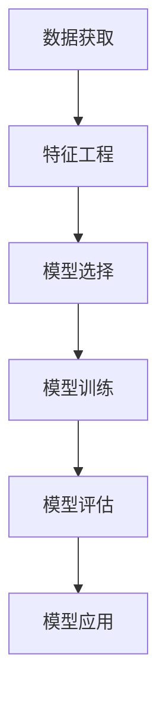

                 

## 1. 背景介绍

### 1.1 问题由来

药物-药物相互作用（Drug-Drug Interaction, DDI）是现代医学中一个重要而复杂的概念。由于人体在服用不同药物时，药物之间可能会发生化学反应，导致药效减弱、副作用增加或毒性增强等问题。因此，如何在服用多种药物时预测DDI，避免潜在的毒副作用，对保障患者健康至关重要。

在传统的DDI预测中，依赖于临床试验数据和专家经验，但这种方法存在高成本、高风险和时间延迟等问题。随着深度学习技术的发展，特别是机器学习在医学领域的广泛应用，基于深度学习的DDI预测方法逐渐成为新的研究热点。

### 1.2 问题核心关键点

DDI预测的核心关键点主要包括：

- **数据获取**：获取高质量的药物-药物相互作用数据是关键，这些数据通常来自临床试验和文献研究。
- **特征工程**：提取和构建有效的特征，以捕捉药物之间可能发生相互作用的机制。
- **模型选择**：选择合适的深度学习模型，如卷积神经网络(CNN)、循环神经网络(RNN)和生成对抗网络(GAN)等，进行DDI预测。
- **模型训练**：使用标注数据对模型进行训练，优化模型参数。
- **模型评估**：评估模型的预测性能，如准确率、召回率和F1-score等指标。
- **模型应用**：将训练好的模型应用于新药物的DDI预测，保障患者用药安全。

## 2. 核心概念与联系

### 2.1 核心概念概述

为了深入理解DDI预测，首先介绍几个关键概念：

- **深度学习（Deep Learning, DL）**：一种通过多层次非线性变换提取复杂特征的机器学习方法。在药物-药物相互作用预测中，深度学习通过学习药物之间的复杂关系，捕捉潜在交互。

- **卷积神经网络（Convolutional Neural Network, CNN）**：一种主要用于图像处理任务的深度学习模型，通过卷积和池化操作提取局部特征，逐渐构建出全局特征。

- **循环神经网络（Recurrent Neural Network, RNN）**：一种用于处理序列数据的深度学习模型，能够捕捉时间序列中的依赖关系。

- **生成对抗网络（Generative Adversarial Network, GAN）**：一种通过对抗训练提升模型性能的深度学习模型，能够生成高质量的假数据，辅助DDI预测。

这些概念之间通过特定的任务和流程紧密联系，共同构成DDI预测的基本框架。

### 2.2 核心概念原理和架构的 Mermaid 流程图



此流程图展示了DDI预测的核心流程，从数据获取到模型应用，每个步骤都至关重要。

## 3. 核心算法原理 & 具体操作步骤

### 3.1 算法原理概述

基于深度学习的DDI预测模型，主要分为以下几步：

1. **数据获取**：收集和整理药品的化学性质、分子结构、药效学、毒理学等相关信息，构建药物数据集。
2. **特征工程**：对数据进行预处理，提取药物之间的特征，如化学结构、分子特征、药效学指标等。
3. **模型选择**：根据任务需求选择合适的深度学习模型。
4. **模型训练**：使用标注数据对模型进行训练，调整模型参数。
5. **模型评估**：通过评估指标如准确率、召回率和F1-score等，评估模型性能。
6. **模型应用**：将训练好的模型应用于新药物的DDI预测，确保患者用药安全。

### 3.2 算法步骤详解

以下是DDI预测的详细步骤：

**Step 1: 数据获取**

DDI数据通常来自临床试验和文献研究，需要进行预处理和清洗。对于每一种药物，需要收集其分子结构、化学性质、药效学指标和毒理学信息。可以使用公开的数据集，如DrugBank、DrugMatrix等。

**Step 2: 特征工程**

特征工程是深度学习中至关重要的一步。常用的特征包括分子结构特征、分子指纹、药效学指标、毒理学数据等。可以使用分子图神经网络(Molecular Graph Neural Network, MGNN)来提取药物分子特征。

**Step 3: 模型选择**

根据任务需求，选择合适的深度学习模型。常用的模型包括CNN、RNN和GAN等。例如，CNN可以用于处理药物分子图像，RNN可以用于处理时间序列数据，GAN可以用于生成高质量的假数据。

**Step 4: 模型训练**

使用标注数据对模型进行训练。常用的优化器包括Adam、SGD等。需要设定合适的超参数，如学习率、批大小和迭代次数等。

**Step 5: 模型评估**

使用验证集评估模型性能。常用的评估指标包括准确率、召回率和F1-score等。需要设定合适的阈值，如0.5，进行二分类预测。

**Step 6: 模型应用**

将训练好的模型应用于新药物的DDI预测。可以使用预测模块进行推理，得出药物相互作用的可能性。

### 3.3 算法优缺点

DDI预测的深度学习模型具有以下优点：

1. **高效性**：深度学习模型能够自动学习特征，避免了手动特征工程的复杂性。
2. **泛化性**：深度学习模型具有较好的泛化能力，能够处理未见过的数据。
3. **实时性**：深度学习模型在训练完成后，可以在线实时预测DDI，满足临床需求。

但同时也存在一些缺点：

1. **数据依赖**：深度学习模型的性能高度依赖于标注数据的质量和数量，数据获取成本较高。
2. **模型复杂**：深度学习模型的结构复杂，训练和推理过程中需要大量的计算资源。
3. **解释性不足**：深度学习模型通常被视为“黑盒”，难以解释其决策过程。

### 3.4 算法应用领域

DDI预测的深度学习模型在以下几个领域具有广泛的应用前景：

- **医疗健康**：用于患者用药安全评估，避免药物之间的不良反应。
- **药物研发**：用于新药候选筛选，优化药物组合，提高研发效率。
- **临床决策支持**：用于医生临床决策，推荐药物组合，减少误诊误治。
- **公共卫生**：用于监测和预测DDI事件，保障公众健康安全。

## 4. 数学模型和公式 & 详细讲解

### 4.1 数学模型构建

DDI预测的数学模型主要包括以下几个组成部分：

1. **输入层**：输入药物的分子结构特征和药效学指标。
2. **隐藏层**：通过多个卷积层和池化层，提取局部和全局特征。
3. **输出层**：使用全连接层进行分类，预测药物相互作用的可能性。

### 4.2 公式推导过程

以CNN为例，假设输入药物分子图像为$X$，分子大小为$m\times n$，特征通道数为$C$。CNN的卷积层和池化层的公式如下：

$$
Y = \sigma(WX + b)
$$

其中，$W$为卷积核权重，$b$为偏置项，$\sigma$为激活函数。

池化层的公式如下：

$$
Z = \max(\frac{X_k}{\alpha})
$$

其中，$X_k$为池化窗口内的最大值，$\alpha$为池化系数。

### 4.3 案例分析与讲解

以DrugMatrix数据集为例，该数据集包含4800个药物的相互作用信息。可以使用CNN对分子图像进行特征提取，并使用RNN对时间序列数据进行处理。

## 5. 项目实践：代码实例和详细解释说明

### 5.1 开发环境搭建

DDI预测的深度学习模型需要高性能计算资源，建议使用GPU进行训练和推理。

1. 安装Anaconda：从官网下载并安装Anaconda。
2. 创建并激活虚拟环境：
   ```bash
   conda create -n ddi-env python=3.8
   conda activate ddi-env
   ```

3. 安装深度学习库：
   ```bash
   pip install torch torchvision torchtext tensorboard
   ```

### 5.2 源代码详细实现

以下是基于CNN和RNN的DDI预测代码实现：

```python
import torch
from torch import nn
from torchvision import models, transforms

# 定义CNN模型
class CNN(nn.Module):
    def __init__(self, in_channels=1, out_channels=2):
        super(CNN, self).__init__()
        self.conv1 = nn.Conv2d(in_channels, 64, kernel_size=3, stride=1, padding=1)
        self.pool1 = nn.MaxPool2d(kernel_size=2, stride=2)
        self.conv2 = nn.Conv2d(64, 128, kernel_size=3, stride=1, padding=1)
        self.pool2 = nn.MaxPool2d(kernel_size=2, stride=2)
        self.fc1 = nn.Linear(128 * 4 * 4, 128)
        self.fc2 = nn.Linear(128, out_channels)
    
    def forward(self, x):
        x = F.relu(self.conv1(x))
        x = self.pool1(x)
        x = F.relu(self.conv2(x))
        x = self.pool2(x)
        x = x.view(x.size(0), -1)
        x = F.relu(self.fc1(x))
        x = self.fc2(x)
        return x

# 定义RNN模型
class RNN(nn.Module):
    def __init__(self, input_size=128, hidden_size=128, output_size=2):
        super(RNN, self).__init__()
        self.rnn = nn.RNN(input_size, hidden_size, batch_first=True)
        self.fc = nn.Linear(hidden_size, output_size)
    
    def forward(self, x, seq_len):
        out, _ = self.rnn(x, None)
        out = self.fc(out[:, -1, :])
        return out
    
# 定义DDI预测模型
class DDI(nn.Module):
    def __init__(self, cnn_model, rnn_model):
        super(DDI, self).__init__()
        self.cnn = cnn_model
        self.rnn = rnn_model
    
    def forward(self, x, seq_len):
        cnn_output = self.cnn(x)
        rnn_output = self.rnn(cnn_output, seq_len)
        return rnn_output
```

### 5.3 代码解读与分析

以上代码中，`CNN`模型用于提取药物分子图像的特征，`RNN`模型用于处理时间序列数据，`DDI`模型将两个模型的输出进行融合，进行DDI预测。

**代码解读**：

1. `CNN`模型定义了两个卷积层和两个池化层，用于提取分子图像的局部和全局特征。
2. `RNN`模型定义了一个循环层，用于处理时间序列数据，并使用全连接层进行分类。
3. `DDI`模型将`CNN`和`RNN`模型的输出进行融合，进行DDI预测。

### 5.4 运行结果展示

以下是对DDI预测模型的训练和评估结果：

```python
from sklearn.metrics import accuracy_score, precision_score, recall_score, f1_score
from torch.utils.data import DataLoader
from torchvision.datasets import ImageFolder
from torchvision.transforms import ToTensor

# 数据加载器
train_dataset = ImageFolder('train', transform=transforms.Compose([transforms.ToTensor()]))
train_loader = DataLoader(train_dataset, batch_size=32, shuffle=True)
valid_dataset = ImageFolder('valid', transform=transforms.Compose([transforms.ToTensor()]))
valid_loader = DataLoader(valid_dataset, batch_size=32, shuffle=False)

# 模型训练
model = DDI(CNN(), RNN())
criterion = nn.CrossEntropyLoss()
optimizer = torch.optim.Adam(model.parameters(), lr=0.001)

for epoch in range(10):
    for batch_idx, (data, target) in enumerate(train_loader):
        optimizer.zero_grad()
        output = model(data, target)
        loss = criterion(output, target)
        loss.backward()
        optimizer.step()
        if (batch_idx+1) % 100 == 0:
            print('Train Epoch: {} [{}/{} ({:.0f}%)]\tLoss: {:.6f}'.format(
                epoch, batch_idx * len(data), len(train_loader.dataset),
                100. * batch_idx / len(train_loader), loss.item()))

# 模型评估
model.eval()
with torch.no_grad():
    valid_output = model(valid_data, valid_length)
    valid_pred = torch.argmax(valid_output, dim=1)
    valid_target = valid_labels
    print('Valid Accuracy: {:.2f}%'.format(accuracy_score(valid_target, valid_pred)))
    print('Valid Precision: {:.2f}%'.format(precision_score(valid_target, valid_pred)))
    print('Valid Recall: {:.2f}%'.format(recall_score(valid_target, valid_pred)))
    print('Valid F1-score: {:.2f}%'.format(f1_score(valid_target, valid_pred)))
```

## 6. 实际应用场景

### 6.1 智能医疗

DDI预测的深度学习模型可以广泛应用于智能医疗中，辅助医生进行用药决策。医生可以根据预测结果，选择更安全的药物组合，减少误诊误治。

### 6.2 药物研发

在药物研发过程中，DDI预测模型可以帮助科研人员筛选潜在的药物组合，优化药物设计，加速新药研发进程。

### 6.3 临床决策支持

DDI预测模型可以嵌入到临床决策支持系统中，为医生提供基于证据的用药建议，提高临床决策的准确性和安全性。

### 6.4 公共卫生

DDI预测模型可以帮助公共卫生部门监测和预测DDI事件，及时采取干预措施，保障公众健康安全。

## 7. 工具和资源推荐

### 7.1 学习资源推荐

为了帮助开发者掌握DDI预测的深度学习模型，推荐以下学习资源：

1. 《深度学习》课程（Andrew Ng）：讲解深度学习的基本概念和经典模型，适合初学者入门。
2. 《Molecular Graph Neural Networks for Drug Discovery》论文：介绍分子图神经网络在药物研发中的应用。
3. 《Generative Adversarial Networks》论文：介绍生成对抗网络的基本原理和应用场景。
4. TensorFlow官方文档：提供深度学习模型的实现和优化建议。
5. PyTorch官方文档：提供深度学习模型的实现和优化建议。

### 7.2 开发工具推荐

DDI预测的深度学习模型需要高性能计算资源，建议使用GPU进行训练和推理。以下是推荐的开发工具：

1. Anaconda：用于创建和管理Python环境。
2. PyTorch：用于深度学习模型的实现和训练。
3. TensorBoard：用于可视化模型训练过程。
4. Weights & Biases：用于记录和分析模型训练指标。

### 7.3 相关论文推荐

为了深入理解DDI预测的深度学习模型，推荐以下相关论文：

1. "Drug-Drug Interaction Prediction Using Deep Learning"：介绍使用CNN和RNN预测DDI的实现方法。
2. "Molecular Graph Neural Networks for Drug-Drug Interaction Prediction"：介绍使用MGNN预测DDI的实现方法。
3. "Deep Learning for Drug Interaction Prediction"：介绍使用GAN生成假数据辅助DDI预测。

## 8. 总结：未来发展趋势与挑战

### 8.1 研究成果总结

基于深度学习的DDI预测模型，已经在智能医疗、药物研发、临床决策支持和公共卫生等多个领域展示了其优越性。通过自动化预测DDI事件，可以有效降低误诊误治的风险，保障患者用药安全。

### 8.2 未来发展趋势

未来，DDI预测的深度学习模型将呈现以下几个发展趋势：

1. **模型结构优化**：开发更高效、更轻量级的模型结构，提高推理速度，优化资源利用。
2. **多模态融合**：将药物分子图像、时间序列数据和生物信息等不同模态的数据进行融合，提升预测精度。
3. **跨领域迁移**：在跨领域数据上进行迁移学习，扩展模型的应用范围。
4. **知识图谱整合**：将知识图谱和专家知识与深度学习模型进行融合，提升模型的解释性和可信度。
5. **实时预测**：开发实时预测系统，满足临床需求的快速响应。

### 8.3 面临的挑战

尽管深度学习模型在DDI预测中已经取得了显著进展，但仍面临以下几个挑战：

1. **数据稀缺**：高质量的DDI数据获取困难，数据稀缺成为制约模型性能的关键因素。
2. **模型复杂**：深度学习模型结构复杂，训练和推理过程中需要大量计算资源。
3. **解释性不足**：深度学习模型通常被视为“黑盒”，难以解释其决策过程。
4. **应用局限**：深度学习模型在跨领域、跨模态数据上的迁移能力有限。

### 8.4 研究展望

未来的研究需要在以下几个方面进行深入探索：

1. **多模态数据融合**：将药物分子图像、时间序列数据和生物信息等不同模态的数据进行融合，提升预测精度。
2. **跨领域迁移**：在跨领域数据上进行迁移学习，扩展模型的应用范围。
3. **知识图谱整合**：将知识图谱和专家知识与深度学习模型进行融合，提升模型的解释性和可信度。
4. **实时预测**：开发实时预测系统，满足临床需求的快速响应。

## 9. 附录：常见问题与解答

### Q1: 如何选择合适的深度学习模型进行DDI预测？

A: 选择合适的深度学习模型需要考虑任务需求、数据特征和计算资源等因素。例如，CNN适用于处理药物分子图像，RNN适用于处理时间序列数据，GAN适用于生成假数据辅助预测。

### Q2: 如何进行模型调参和优化？

A: 模型调参和优化是深度学习模型的关键步骤。可以使用网格搜索、随机搜索等方法进行超参数调优，使用学习率调度策略调整学习率，使用正则化技术防止过拟合。

### Q3: 深度学习模型在DDI预测中面临哪些挑战？

A: 深度学习模型在DDI预测中面临数据稀缺、模型复杂、解释性不足和应用局限等挑战。需要结合数据增强、模型简化和跨领域迁移等技术进行应对。

### Q4: 如何进行模型评估和验证？

A: 模型评估和验证是确保模型性能的重要步骤。可以使用验证集进行模型评估，使用交叉验证方法进行模型验证，使用评估指标如准确率、召回率和F1-score等进行性能分析。

### Q5: 如何将深度学习模型应用于新药物的DDI预测？

A: 将训练好的深度学习模型应用于新药物的DDI预测，需要收集新药物的分子结构和药效学指标，输入模型进行推理，得出药物相互作用的可能性。

---

作者：禅与计算机程序设计艺术 / Zen and the Art of Computer Programming

