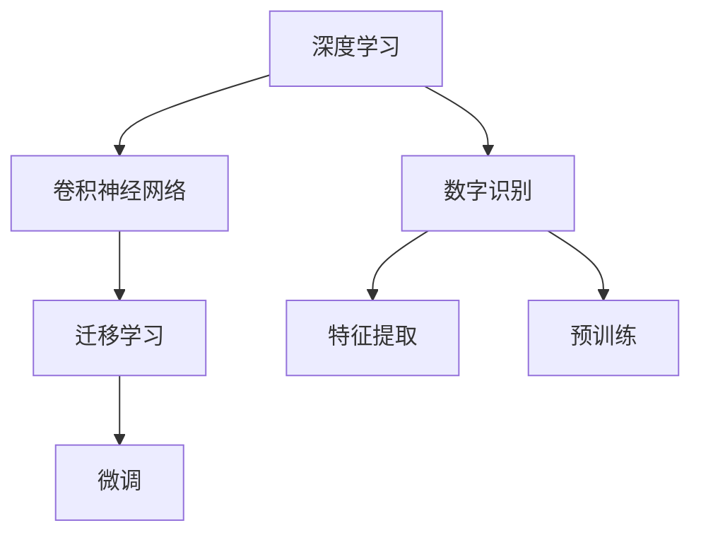

                 

# 深度学习数字识别系统原理与方法

## 1. 背景介绍

### 1.1 问题由来
数字识别技术在现代社会中有着广泛的应用，如自动录入、票务系统、信用验证、医疗影像分析等。深度学习技术的崛起，尤其是卷积神经网络(Convolutional Neural Network, CNN)的出现，使得数字识别系统取得了显著的进展。传统的基于手工设计的特征提取方法被深度学习算法所取代，数字识别系统的识别率显著提高，识别效率也得到了大幅提升。然而，深度学习模型的复杂性和高训练成本，对实际应用的推广造成了一定的障碍。

### 1.2 问题核心关键点
针对这些挑战，我们聚焦于如何设计高效、可解释性强的深度学习数字识别系统，并兼顾算法的稳定性和可扩展性。通过在实践中不断优化，希望能提出一些新的方法和思路，为数字识别系统提供更加可靠、高效的解决方案。

## 2. 核心概念与联系

### 2.1 核心概念概述

为更好地理解深度学习数字识别系统，本节将介绍几个关键概念：

- 深度学习：一种通过多层神经网络学习数据复杂分布的机器学习方法。
- 卷积神经网络：一种专门处理图像数据的神经网络，通过卷积、池化等操作提取特征，并进行分类或回归预测。
- 数字识别：将数字图像或扫描文档中的手写或打印数字自动识别转化为文本数据的过程。
- 特征提取：从原始数据中提取有意义的特征，用于分类或回归任务。
- 迁移学习：将一个领域学到的知识迁移到另一个相关领域，通过微调模型实现迁移学习。

这些核心概念之间的逻辑关系可以通过以下Mermaid流程图来展示：



这个流程图展示了一些关键概念及其之间的联系：

1. 深度学习通过卷积神经网络处理图像数据，实现数字识别。
2. 特征提取用于从原始数据中提取特征，用于训练数字识别模型。
3. 迁移学习通过微调模型实现领域知识的迁移。
4. 预训练是指在大规模数据集上对模型进行预训练，以提高其泛化能力。

## 3. 核心算法原理 & 具体操作步骤
### 3.1 算法原理概述

深度学习数字识别系统通常由特征提取模块和分类模块组成，其中卷积神经网络(CNN)是最常用的特征提取模块。CNN通过多层卷积、池化等操作，自动提取数字图像中的特征，并最终输出数字类别。深度学习数字识别系统的核心思想是通过大量标注数据进行有监督学习，使得模型能够自动识别数字。

形式化地，假设输入数字图像为 $x \in \mathbb{R}^d$，输出标签为 $y \in \{0, 1, 2, \ldots, 9\}$。深度学习数字识别系统的目标是最小化损失函数：

$$
\mathcal{L}(w, b, x, y) = \frac{1}{N} \sum_{i=1}^N \ell(y_i, M(x_i; w, b))
$$

其中 $M(x; w, b)$ 为卷积神经网络，$w$ 和 $b$ 为模型的权重和偏置，$\ell$ 为损失函数（如交叉熵）。通过梯度下降等优化算法，不断调整 $w$ 和 $b$，使得模型预测结果尽可能接近真实标签。

### 3.2 算法步骤详解

深度学习数字识别系统的训练通常包括数据准备、模型构建、训练和测试等步骤：

**Step 1: 数据准备**
- 收集数字图像数据集，包括训练集、验证集和测试集。通常需要大量标注数据来训练模型。
- 对数据进行预处理，如裁剪、缩放、归一化等，以便模型可以更好地处理输入。

**Step 2: 构建模型**
- 选择卷积神经网络作为特征提取模块。
- 设计多层卷积、池化、激活函数等操作。
- 在顶层添加全连接层，输出数字类别。

**Step 3: 设置超参数**
- 选择合适的优化算法（如Adam、SGD等）及其参数。
- 设置学习率、批大小、迭代轮数等。
- 确定是否冻结预训练权重。

**Step 4: 执行训练**
- 使用训练集数据分批次输入模型，前向传播计算损失函数。
- 反向传播计算参数梯度，根据优化算法和学习率更新模型参数。
- 周期性在验证集上评估模型性能，根据性能指标决定是否触发Early Stopping。
- 重复上述步骤直到满足预设的迭代轮数或Early Stopping条件。

**Step 5: 测试和评估**
- 在测试集上评估模型性能，输出识别准确率、召回率等指标。
- 使用模型对新的数字图像进行推理预测，集成到实际应用系统中。
- 持续收集新的数据，定期重新训练模型，以适应数据分布的变化。

### 3.3 算法优缺点

深度学习数字识别系统具有以下优点：
1. 高准确率。CNN模型通过多层卷积和池化自动提取图像特征，能够实现高识别率。
2. 可扩展性强。CNN模型可以应用于各种数字识别场景，如手写数字识别、打印数字识别等。
3. 适应性强。通过迁移学习，可以在已有模型基础上进行微调，适应新领域的数字识别任务。
4. 自动特征提取。CNN模型能够自动学习数据中的特征，无需人工设计特征。

同时，该方法也存在一定的局限性：
1. 数据依赖性强。需要大量标注数据进行训练，数据准备成本高。
2. 模型复杂度高。CNN模型参数量较大，训练和推理速度较慢。
3. 可解释性不足。CNN模型通常被视为"黑盒"模型，难以解释其内部工作机制。
4. 对噪声敏感。模型对输入图像的噪声、光照、变形等敏感，影响识别效果。

尽管存在这些局限性，但CNN模型在数字识别领域已取得了广泛应用，并显示出巨大的发展潜力。未来相关研究将集中在如何进一步降低数据依赖，提高模型的稳定性和可解释性等方面。

### 3.4 算法应用领域

深度学习数字识别系统已经在诸多领域得到了广泛应用，如：

- 银行票务系统：自动识别支票上的手写数字，提高处理效率。
- 医疗影像分析：自动识别X光、CT等影像中的数字，辅助医生诊断。
- 邮政信箱识别：自动识别邮政信箱上的数字编号，提高快递投递准确率。
- 身份证识别：自动识别身份证上的数字，用于身份验证和数据采集。
- 手写笔记识别：自动识别手写笔记中的数字，实现电子化办公。

除了上述这些经典应用外，数字识别技术还被创新性地应用于更多的场景中，如数字印鉴识别、自动驾驶车牌识别等，为数字化转型提供了新的技术手段。

## 4. 数学模型和公式 & 详细讲解
### 4.1 数学模型构建

下面，我们以手写数字识别为例，使用数学语言对CNN模型的构建进行详细阐述。

假设输入数字图像为 $x \in \mathbb{R}^d$，输出标签为 $y \in \{0, 1, 2, \ldots, 9\}$。CNN模型的基本结构如图1所示：


### 4.2 公式推导过程

以一个简单的单通道卷积神经网络为例，推导其输出公式。

假设输入图像 $x \in \mathbb{R}^d$，卷积核 $w \in \mathbb{R}^{f \times f \times c}$，激活函数 $a \in \mathbb{R} \rightarrow \mathbb{R}$，池化函数 $p \in \mathbb{R} \rightarrow \mathbb{R}$。

卷积层输出的特征图为：

$$
\begin{aligned}
h &= \sigma(\sum_{i=0}^{f-1} \sum_{j=0}^{f-1} \sum_{k=0}^{c-1} w_{i,j,k} x_{i', j', k'} \\
&= \sigma(\sum_{i=0}^{f-1} \sum_{j=0}^{f-1} \sum_{k=0}^{c-1} w_{i,j,k} x_{i', j', k'}
\end{aligned}
$$

其中 $\sigma$ 为激活函数，$i'$ 和 $j'$ 为特征图的位置索引，$k'$ 为通道索引。

### 4.3 案例分析与讲解

下面以一个手写数字识别任务为例，进行详细讲解。

**案例背景**：假设有一组手写数字图像，每个图像的尺寸为28x28，需要进行识别。

**数据准备**：收集标注数据集，包括训练集、验证集和测试集。每个图像经过预处理后，缩放成28x28，并进行归一化处理。

**模型构建**：构建一个3层卷积神经网络，包括两个卷积层和一个全连接层。第一个卷积层使用32个3x3的卷积核，第二个卷积层使用64个3x3的卷积核，池化层使用2x2的最大池化，激活函数使用ReLU。全连接层有10个神经元，输出数字类别。

**训练过程**：在训练集上使用Adam优化器，学习率为1e-3，批量大小为64，迭代100轮。在每个epoch结束时，使用验证集评估模型性能，如果性能没有提升，则停止训练。

**测试过程**：在测试集上评估模型性能，输出识别准确率和混淆矩阵。

## 5. 项目实践：代码实例和详细解释说明
### 5.1 开发环境搭建

在进行数字识别系统开发前，我们需要准备好开发环境。以下是使用Python进行PyTorch开发的环境配置流程：

1. 安装Anaconda：从官网下载并安装Anaconda，用于创建独立的Python环境。

2. 创建并激活虚拟环境：
```bash
conda create -n pytorch-env python=3.8 
conda activate pytorch-env
```

3. 安装PyTorch：根据CUDA版本，从官网获取对应的安装命令。例如：
```bash
conda install pytorch torchvision torchaudio cudatoolkit=11.1 -c pytorch -c conda-forge
```

4. 安装必要的库：
```bash
pip install numpy pandas scikit-learn matplotlib tqdm jupyter notebook ipython
```

完成上述步骤后，即可在`pytorch-env`环境中开始数字识别系统的开发。

### 5.2 源代码详细实现

下面给出使用PyTorch进行手写数字识别的代码实现。

首先，定义模型和优化器：

```python
import torch
from torch import nn, optim
from torch.utils.data import DataLoader

class CNN(nn.Module):
    def __init__(self):
        super(CNN, self).__init__()
        self.conv1 = nn.Conv2d(1, 32, 3, 1)
        self.pool = nn.MaxPool2d(2, 2)
        self.conv2 = nn.Conv2d(32, 64, 3, 1)
        self.fc1 = nn.Linear(64 * 7 * 7, 128)
        self.fc2 = nn.Linear(128, 10)

    def forward(self, x):
        x = self.pool(F.relu(self.conv1(x)))
        x = self.pool(F.relu(self.conv2(x)))
        x = x.view(-1, 64 * 7 * 7)
        x = F.relu(self.fc1(x))
        x = self.fc2(x)
        return x

model = CNN()
optimizer = optim.Adam(model.parameters(), lr=1e-3)
```

然后，定义训练和评估函数：

```python
def train(model, train_loader, optimizer, num_epochs):
    for epoch in range(num_epochs):
        for i, (images, labels) in enumerate(train_loader):
            images, labels = images.to(device), labels.to(device)
            optimizer.zero_grad()
            outputs = model(images)
            loss = F.cross_entropy(outputs, labels)
            loss.backward()
            optimizer.step()
            if (i + 1) % 100 == 0:
                print(f'Epoch {epoch+1}, Step {i+1}, Loss: {loss.item():.4f}')
    
def evaluate(model, test_loader):
    correct = 0
    total = 0
    with torch.no_grad():
        for images, labels in test_loader:
            images, labels = images.to(device), labels.to(device)
            outputs = model(images)
            _, predicted = torch.max(outputs.data, 1)
            total += labels.size(0)
            correct += (predicted == labels).sum().item()
    print(f'Test Accuracy: {100 * correct / total:.2f}%')
```

最后，启动训练流程并在测试集上评估：

```python
device = torch.device("cuda" if torch.cuda.is_available() else "cpu")

# 加载数据集
train_dataset = datasets.MNIST(root='./data', train=True, transform=transforms.ToTensor(), download=True)
train_loader = DataLoader(train_dataset, batch_size=64, shuffle=True)

# 训练模型
train(model, train_loader, optimizer, num_epochs=100)

# 加载测试集
test_dataset = datasets.MNIST(root='./data', train=False, transform=transforms.ToTensor(), download=True)
test_loader = DataLoader(test_dataset, batch_size=64, shuffle=False)

# 评估模型
evaluate(model, test_loader)
```

以上就是使用PyTorch进行手写数字识别的完整代码实现。可以看到，通过简单的卷积神经网络结构和训练函数，即可实现手写数字的识别。

### 5.3 代码解读与分析

让我们再详细解读一下关键代码的实现细节：

**CNN类**：
- `__init__`方法：初始化卷积层、池化层、全连接层等组件。
- `forward`方法：定义前向传播过程，输入图像经过卷积、池化、全连接层后输出分类概率。

**训练和评估函数**：
- `train`函数：使用训练集数据分批次输入模型，前向传播计算损失函数，反向传播更新模型参数。
- `evaluate`函数：对测试集数据进行前向传播，输出预测结果，并计算准确率。

**训练流程**：
- 在训练集上迭代100轮，使用Adam优化器，学习率为1e-3，批量大小为64。
- 在每个epoch结束时，使用测试集评估模型性能，并在每个100步输出训练进度。
- 评估结束后，在测试集上输出识别准确率。

可以看到，PyTorch的简洁语法和强大的API设计，使得CNN模型的实现非常高效和易于理解。同时，丰富的可视化工具和自动微分技术，使得模型的调试和优化变得更加方便。

当然，工业级的系统实现还需考虑更多因素，如模型的保存和部署、超参数的自动搜索、更灵活的任务适配层等。但核心的CNN模型基本与此类似。

## 6. 实际应用场景
### 6.1 数字银行票务系统

数字银行票务系统是深度学习数字识别技术的重要应用场景之一。通过识别支票上的手写数字，可以自动提取交易信息，提高处理效率。

在技术实现上，可以收集银行历史交易记录，将支票上的手写数字作为标注数据，在此基础上对预训练模型进行微调。微调后的数字识别模型能够自动识别支票上的数字，快速提取交易金额、日期等信息，辅助银行后台系统进行账务处理。对于新支票上的数字，还可以实时调用识别模型进行识别，减少人工工作量，提升银行处理能力。

### 6.2 医疗影像数字识别

医疗影像中的数字识别是数字识别技术的另一个重要应用场景。通过自动识别X光、CT等影像中的数字，可以帮助医生快速定位病灶，辅助诊断。

具体而言，可以收集医学影像数据集，将其中包含数字的影像作为标注数据。在此基础上对预训练模型进行微调，使其能够自动识别影像中的数字。微调后的模型可以快速定位病灶区域，提高诊断准确率。对于新影像中的数字，还可以实时调用识别模型进行识别，进一步提升医生的诊断效率。

### 6.3 自动识别文档数据

在办公自动化中，自动识别文档中的数字是数字识别技术的常见应用。通过自动提取文档中的数字，可以高效整理和分析数据，提高工作效率。

具体而言，可以收集文档图像数据集，将其中包含数字的文档作为标注数据。在此基础上对预训练模型进行微调，使其能够自动识别文档中的数字。微调后的模型可以快速提取文档中的关键信息，自动化处理数据，提高工作效率。对于新文档中的数字，还可以实时调用识别模型进行识别，进一步提升数据处理速度。

### 6.4 未来应用展望

随着深度学习技术的不断发展，数字识别系统在更多领域将得到广泛应用，为数字化转型提供新的技术手段。

在智慧城市中，数字识别技术可以应用于交通管理、环境监测、公共安全等领域，提高城市管理的智能化水平。例如，通过自动识别车牌号，可以提高交通监控的精准度，提升城市交通管理效率。

在工业生产中，数字识别技术可以应用于质检、自动化生产等领域，提高生产效率和产品质量。例如，通过自动识别产品标签，可以实现自动分类和存储，减少人工工作量，提高生产效率。

在农业生产中，数字识别技术可以应用于病虫害识别、作物分析等领域，提高农业生产效率。例如，通过自动识别作物图像中的病虫害，可以帮助农民及时采取措施，减少农作物损失。

## 7. 工具和资源推荐
### 7.1 学习资源推荐

为了帮助开发者系统掌握深度学习数字识别技术，这里推荐一些优质的学习资源：

1. 《深度学习》（Goodfellow, Bengio, and Courville）：深度学习领域的经典教材，涵盖深度学习的基本概念和算法，推荐作为深度学习的入门读物。

2. 《卷积神经网络：专家之路》（Nielsen, Haim, and Yu）：系统介绍卷积神经网络的基本原理和应用，适合深度学习新手入门。

3. PyTorch官方文档：PyTorch的官方文档，提供了丰富的API接口和示例代码，适合初学者和中级开发者。

4. Coursera《深度学习专项课程》（Goodfellow, Bengio, and Courville）：由深度学习领域的专家开设的课程，涵盖深度学习的基本概念和算法，推荐作为深度学习的进阶学习材料。

5. Kaggle竞赛平台：Kaggle提供的深度学习竞赛，可以锻炼深度学习模型的实际应用能力，推荐作为深度学习实践的实践平台。

通过对这些资源的学习实践，相信你一定能够快速掌握深度学习数字识别技术的精髓，并用于解决实际的数字识别问题。

### 7.2 开发工具推荐

高效的开发离不开优秀的工具支持。以下是几款用于深度学习数字识别开发的常用工具：

1. PyTorch：基于Python的开源深度学习框架，灵活动态的计算图，适合快速迭代研究。大部分预训练模型都有PyTorch版本的实现。

2. TensorFlow：由Google主导开发的开源深度学习框架，生产部署方便，适合大规模工程应用。同样有丰富的预训练模型资源。

3. Keras：基于TensorFlow的高层API，简单易用，适合初学者和中级开发者。

4. Weights & Biases：模型训练的实验跟踪工具，可以记录和可视化模型训练过程中的各项指标，方便对比和调优。与主流深度学习框架无缝集成。

5. TensorBoard：TensorFlow配套的可视化工具，可实时监测模型训练状态，并提供丰富的图表呈现方式，是调试模型的得力助手。

6. Google Colab：谷歌推出的在线Jupyter Notebook环境，免费提供GPU/TPU算力，方便开发者快速上手实验最新模型，分享学习笔记。

合理利用这些工具，可以显著提升深度学习数字识别系统的开发效率，加快创新迭代的步伐。

### 7.3 相关论文推荐

深度学习数字识别技术的发展源于学界的持续研究。以下是几篇奠基性的相关论文，推荐阅读：

1. LeCun, Yann, et al. "Gradient-based learning applied to document recognition." Proceedings of the IEEE, vol. 86, no. 11, 1998.

2. Krizhevsky, Alex, et al. "ImageNet classification with deep convolutional neural networks." Advances in neural information processing systems, 2012.

3. He, Kaiming, et al. "Delving deep into rectifiers: Surpassing human-level performance on ImageNet classification." Proceedings of the IEEE international conference on computer vision, 2015.

4. Simonyan, Kaiming, and Andrew Zisserman. "Very deep convolutional networks for large-scale image recognition." International Conference on Computer Vision, 2014.

5. Goodfellow, Ian, et al. "Generative adversarial nets." Advances in neural information processing systems, 2014.

这些论文代表了大数字识别技术的发展脉络。通过学习这些前沿成果，可以帮助研究者把握学科前进方向，激发更多的创新灵感。

## 8. 总结：未来发展趋势与挑战
### 8.1 总结

本文对深度学习数字识别系统进行了全面系统的介绍。首先阐述了深度学习数字识别系统的研究背景和意义，明确了数字识别系统在自动化、智能化方面的重要价值。其次，从原理到实践，详细讲解了CNN模型的数学原理和关键步骤，给出了数字识别系统开发的完整代码实例。同时，本文还广泛探讨了数字识别系统在金融、医疗、办公等多个行业领域的应用前景，展示了数字识别技术的巨大潜力。

通过本文的系统梳理，可以看到，深度学习数字识别系统在图像识别、自动化处理、数据提取等方面具有广阔的应用前景，通过大量标注数据的训练，可以显著提升数字识别的准确率和效率。未来，伴随深度学习技术的持续演进，数字识别技术必将在更广泛的领域大放异彩，深刻影响数字化转型进程。

### 8.2 未来发展趋势

展望未来，深度学习数字识别技术将呈现以下几个发展趋势：

1. 模型复杂度增加。随着深度学习技术的不断发展，模型复杂度将进一步提高，可以通过更深层次的网络结构，提高数字识别的准确率。

2. 多模态融合。将深度学习数字识别技术与图像、语音、文字等多模态信息结合，提升识别的准确率和鲁棒性。

3. 迁移学习应用。通过迁移学习，可以在已有模型基础上进行微调，适应新领域的数字识别任务。

4. 模型压缩与加速。通过模型压缩和加速技术，如剪枝、量化等，提高模型的效率和性能，实现实时推理。

5. 可解释性提升。通过引入可解释性技术，如可视化、特征提取等，提高模型的可解释性和可理解性。

6. 自监督学习应用。通过自监督学习技术，从无标签数据中提取特征，提高模型的泛化能力。

以上趋势凸显了深度学习数字识别技术的广阔前景。这些方向的探索发展，必将进一步提升数字识别系统的性能和应用范围，为数字化转型提供新的技术手段。

### 8.3 面临的挑战

尽管深度学习数字识别技术已经取得了瞩目成就，但在迈向更加智能化、普适化应用的过程中，它仍面临着诸多挑战：

1. 数据依赖性强。需要大量标注数据进行训练，数据准备成本高。

2. 模型复杂度高。深度学习模型参数量较大，训练和推理速度较慢。

3. 可解释性不足。深度学习模型通常被视为"黑盒"模型，难以解释其内部工作机制。

4. 对噪声敏感。模型对输入图像的噪声、光照、变形等敏感，影响识别效果。

5. 泛化能力不足。深度学习模型在泛化新场景数据时，表现往往不够理想。

6. 推理速度慢。模型推理速度较慢，难以满足实时处理需求。

尽管存在这些挑战，但深度学习数字识别技术已经取得了广泛应用，并显示出巨大的发展潜力。未来相关研究需要在如何降低数据依赖，提高模型的泛化能力、可解释性等方面寻求新的突破。

### 8.4 研究展望

面向未来，深度学习数字识别技术需要在以下几个方面寻求新的突破：

1. 探索无监督和半监督学习算法。通过自监督学习、主动学习等无监督和半监督范式，最大限度利用非结构化数据，实现更加灵活高效的数字识别。

2. 研究参数高效和计算高效的微调范式。开发更加参数高效的微调方法，在固定大部分预训练参数的同时，只更新极少量的任务相关参数。

3. 引入更多先验知识。将符号化的先验知识，如知识图谱、逻辑规则等，与神经网络模型进行巧妙融合，引导微调过程学习更准确、合理的数字模型。

4. 融合因果分析和博弈论工具。将因果分析方法引入数字识别模型，识别出模型决策的关键特征，增强输出解释的因果性和逻辑性。

5. 纳入伦理道德约束。在模型训练目标中引入伦理导向的评估指标，过滤和惩罚有偏见、有害的输出倾向。

6. 结合因果分析和博弈论工具。将因果分析方法引入数字识别模型，识别出模型决策的关键特征，增强输出解释的因果性和逻辑性。

这些研究方向的探索，必将引领深度学习数字识别技术迈向更高的台阶，为构建安全、可靠、可解释、可控的数字识别系统铺平道路。面向未来，深度学习数字识别技术还需要与其他人工智能技术进行更深入的融合，如知识表示、因果推理、强化学习等，多路径协同发力，共同推动深度学习数字识别系统的进步。只有勇于创新、敢于突破，才能不断拓展数字识别系统的边界，让智能化技术更好地造福人类社会。

## 9. 附录：常见问题与解答
**Q1: 深度学习数字识别系统的训练数据集该如何获取？**

A: 获取深度学习数字识别系统的训练数据集，一般有以下几种途径：
1. 公开数据集：如MNIST、CIFAR、ImageNet等，这些数据集经过严格的标注和验证，适合用于训练模型。
2. 自建数据集：收集特定领域的数据，进行标注和预处理，构建定制化的训练数据集。
3. 数据购买：可以购买一些标注好的数据集，如Kaggle上的公开数据集，快速搭建模型。
4. 数据爬虫：使用爬虫技术，自动抓取网络上的图像数据，进行标注和预处理。

需要注意的是，数据集的质量直接影响模型的性能，建议选择标注准确、多样性高、数量充足的数据集。

**Q2: 深度学习数字识别系统的训练过程中如何调整学习率？**

A: 深度学习数字识别系统的训练过程中，学习率的选择和调整对模型性能有着重要影响。一般来说，学习率可以通过以下方法进行调整：
1. 固定学习率：在整个训练过程中，保持学习率不变，这种方法简单易行，但需要谨慎选择学习率的大小，避免过拟合或欠拟合。
2. 学习率衰减：随着训练轮数的增加，逐渐减小学习率，这种方法可以避免模型在训练后期陷入局部最优。
3. 学习率调度：根据模型性能，动态调整学习率，例如在验证集上检测到性能下降时，减小学习率，避免过拟合。
4. 自适应学习率：如AdamW、Adagrad等，这些方法可以自动调整学习率，适合大规模数据集的训练。

在实际应用中，可以结合以上方法，选择适合特定数据集和模型的学习率策略，提升模型的训练效果。

**Q3: 如何评估深度学习数字识别系统的性能？**

A: 深度学习数字识别系统的性能评估通常包括以下几个指标：
1. 识别准确率：在测试集上，正确识别的数字占总数字的比例。
2. 召回率：在测试集上，被正确识别的数字占所有实际数字的比例。
3. 混淆矩阵：将模型预测结果与真实标签进行对比，统计正确、错误识别的数字数量，得到混淆矩阵。
4. ROC曲线：以假阳性率（False Positive Rate）为横轴，真阳性率（True Positive Rate）为纵轴，绘制出ROC曲线，评估模型的性能。

在评估过程中，建议使用多个指标进行综合评估，如准确率和召回率的加权平均，以便更全面地反映模型的性能。

**Q4: 深度学习数字识别系统在实际应用中如何部署？**

A: 深度学习数字识别系统在实际应用中，需要考虑以下几个方面：
1. 模型压缩与加速：通过模型剪枝、量化等技术，减小模型大小，提高推理速度。
2. 模型部署框架：选择合适的模型部署框架，如TensorFlow Serving、TorchServe等，支持模型在线推理。
3. 数据预处理：对输入数据进行预处理，如缩放、归一化、数据增强等，以便模型可以更好地处理输入。
4. 推理加速器：使用GPU、TPU等硬件加速器，提升模型推理速度。
5. 模型监控：实时监控模型性能，设置异常告警阈值，确保系统稳定运行。

通过以上措施，可以确保深度学习数字识别系统在实际应用中能够稳定、高效地运行，满足实时处理需求。

**Q5: 深度学习数字识别系统在实际应用中如何优化？**

A: 深度学习数字识别系统在实际应用中，可以通过以下几个方面进行优化：
1. 数据增强：通过数据增强技术，扩充训练集，提高模型的泛化能力。
2. 正则化：使用L2正则化、Dropout等方法，避免模型过拟合。
3. 迁移学习：通过在已有模型基础上进行微调，适应新领域的数据，提高模型的泛化能力。
4. 模型压缩：通过剪枝、量化等技术，减小模型大小，提高推理速度。
5. 模型融合：通过模型融合技术，提高模型的鲁棒性和准确率。

通过以上优化措施，可以进一步提升深度学习数字识别系统的性能，满足实际应用需求。

---

作者：禅与计算机程序设计艺术 / Zen and the Art of Computer Programming

