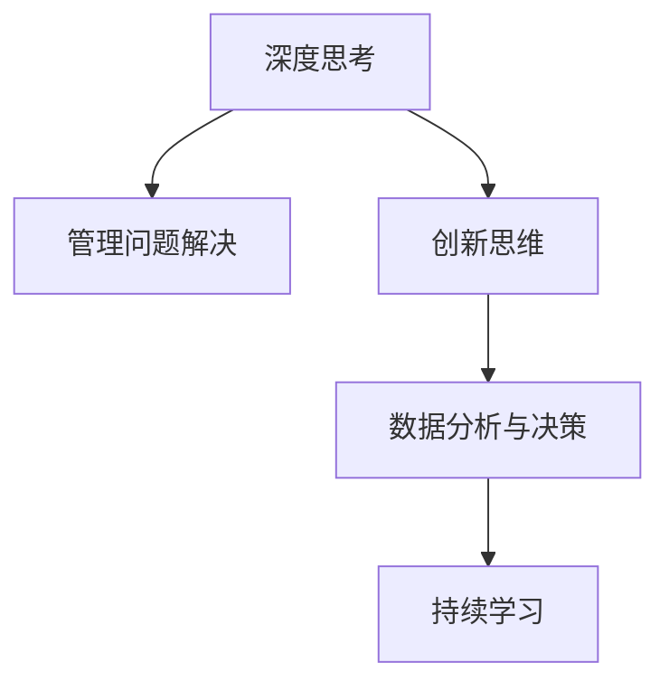

                 

# 深度思考与管理问题解决能力的提升

## 1. 背景介绍

### 1.1 问题由来
在现代快速发展的信息技术时代，问题解决能力成为了企业和个人竞争力的重要体现。深度思考与管理问题解决能力不仅关乎个体能力的提升，也是推动企业创新发展、应对复杂挑战的关键。然而，随着工作和生活节奏的加快，许多人面临沉重的压力，思维能力和问题解决能力逐渐减弱，甚至出现"过载"现象。为了应对这一挑战，本文将深入探讨深度思考与管理问题解决能力的提升方法，通过理论分析与实践案例，为读者提供系统的解决方案。

### 1.2 问题核心关键点
本节将介绍提升深度思考与管理问题解决能力的关键点，明确问题解决的基本框架和工具。

1. **深度思考（Deep Thinking）**：指在面对复杂问题时，通过细致分析、多角度思考，深入挖掘问题的本质和内在联系，形成系统的解决方案。
2. **管理问题解决（Managing Problem-Solving）**：指在问题解决过程中，合理安排时间、资源，遵循科学的流程和方法，确保问题的高效解决。
3. **创新思维（Innovative Thinking）**：在问题解决过程中，采用新颖的思维方式和创意方法，突破传统思维限制，实现问题的创新性解决。
4. **数据分析与决策（Data Analysis and Decision Making）**：通过数据驱动的方法，对问题进行量化分析，做出更准确的决策。
5. **持续学习（Continuous Learning）**：不断积累经验，持续学习新知识，提升问题解决的综合能力。

### 1.3 问题研究意义
提升深度思考与管理问题解决能力对于个人和企业发展具有重要意义：

1. **提高个人竞争力**：通过提升思考深度和管理能力，能够更有效地应对各种复杂问题，增强解决问题的能力，提升个人职业发展。
2. **推动企业创新**：提升团队的深度思考和管理能力，可以激发创新思维，打破思维定式，推动企业产品和服务的持续创新。
3. **提升决策质量**：基于数据分析和科学决策方法，能够更好地理解和应对问题，提高决策的准确性和效率。
4. **增强团队合作**：良好的管理能力和沟通技巧，有助于团队成员之间的协作，提高问题解决的效率和质量。

## 2. 核心概念与联系

### 2.1 核心概念概述

为了更好地理解提升深度思考与管理问题解决能力的方法，本节将介绍几个关键概念：

- **深度思考**：指在面对复杂问题时，通过细致分析、多角度思考，深入挖掘问题的本质和内在联系，形成系统的解决方案。
- **管理问题解决**：指在问题解决过程中，合理安排时间、资源，遵循科学的流程和方法，确保问题的高效解决。
- **创新思维**：在问题解决过程中，采用新颖的思维方式和创意方法，突破传统思维限制，实现问题的创新性解决。
- **数据分析与决策**：通过数据驱动的方法，对问题进行量化分析，做出更准确的决策。
- **持续学习**：不断积累经验，持续学习新知识，提升问题解决的综合能力。

这些概念之间存在密切的联系和互动，共同构成了提升深度思考与管理问题解决能力的基本框架。

### 2.2 核心概念原理和架构的 Mermaid 流程图(Mermaid 流程节点中不要有括号、逗号等特殊字符)



## 3. 核心算法原理 & 具体操作步骤

### 3.1 算法原理概述

提升深度思考与管理问题解决能力的方法，可以归结为一系列的算法和操作步骤。这些算法和步骤旨在帮助个人和企业更好地理解问题、制定策略、实施方案，并持续改进。

### 3.2 算法步骤详解

提升深度思考与管理问题解决能力的步骤大致可以分为以下几个阶段：

#### 步骤 1: 问题定义与分析
- **问题定义**：明确问题的范围和目标，确保问题定义清晰、具体。
- **问题分析**：通过各种分析方法（如SWOT分析、因果图等），深入挖掘问题的根本原因和内在联系。

#### 步骤 2: 解决方案设计
- **策略制定**：基于问题分析的结果，制定切实可行的解决方案。
- **方案评估**：对多个解决方案进行评估，选择最优方案。

#### 步骤 3: 实施与监控
- **执行计划**：将解决方案转化为具体的执行计划，明确责任和时间节点。
- **过程监控**：定期检查执行进度，及时调整方案。

#### 步骤 4: 反馈与优化
- **结果评估**：评估实施效果，识别成功因素和不足之处。
- **持续改进**：根据评估结果，持续优化问题解决流程和解决方案。

### 3.3 算法优缺点

提升深度思考与管理问题解决能力的算法和步骤具有以下优点：

1. **系统性**：通过科学的步骤和流程，确保问题解决的系统性和全面性。
2. **高效性**：合理安排时间和资源，提高问题解决的效率。
3. **可操作性**：每一步都有具体的指导和工具，便于实际操作。

同时，也存在一些缺点：

1. **复杂性**：步骤较多，实施起来可能较为繁琐。
2. **灵活性不足**：流程较为固定，难以应对突发情况。

### 3.4 算法应用领域

提升深度思考与管理问题解决能力的算法和步骤，适用于各种复杂问题的解决，包括但不限于：

- **项目管理**：通过科学的步骤，提升项目管理的效率和质量。
- **产品开发**：利用创新思维和数据分析，推动产品创新。
- **企业战略规划**：通过深度思考和持续学习，制定有效的企业战略。
- **团队协作**：提高团队成员的沟通和协作能力，提升问题解决效率。

## 4. 数学模型和公式 & 详细讲解 & 举例说明

### 4.1 数学模型构建

提升深度思考与管理问题解决能力的数学模型，可以基于以下基本假设：

- 问题可以被明确定义和分析。
- 解决方案存在多种可能性，需要通过科学评估选择最优方案。
- 解决方案的实施效果可以量化评估。
- 问题解决过程需要不断优化和改进。

### 4.2 公式推导过程

假设问题的复杂度为 $C$，解决方案的数量为 $S$，实施效果的量化指标为 $P$，则提升深度思考与管理问题解决能力的方法可以表示为：

$$
\max \sum_{i=1}^{S} P_i \times C_i
$$

其中 $P_i$ 表示第 $i$ 种解决方案的实施效果，$C_i$ 表示第 $i$ 种解决方案的复杂度。

### 4.3 案例分析与讲解

以项目管理为例，假设项目管理的关键步骤包括需求分析、项目计划、任务执行、监控与控制等。每个步骤的复杂度和实施效果可以用以下公式表示：

- 需求分析：$C_1 = 0.5$，$P_1 = 0.9$
- 项目计划：$C_2 = 0.8$，$P_2 = 0.95$
- 任务执行：$C_3 = 0.6$，$P_3 = 0.9$
- 监控与控制：$C_4 = 0.4$，$P_4 = 0.85$

则综合评估的公式为：

$$
P = \frac{P_1 \times C_1 + P_2 \times C_2 + P_3 \times C_3 + P_4 \times C_4}{C_1 + C_2 + C_3 + C_4}
$$

通过计算，可以得到最佳的项目管理方案。

## 5. 项目实践：代码实例和详细解释说明

### 5.1 开发环境搭建

在提升深度思考与管理问题解决能力的过程中，我们需要使用一些工具和库来辅助分析和计算。以下是Python环境搭建的步骤：

1. 安装Python：从官网下载并安装Python，建议选择3.x版本。
2. 安装Jupyter Notebook：Jupyter Notebook是一个交互式的Python开发环境，适合进行数据分析和可视化。
3. 安装Pandas、NumPy等库：Pandas用于数据处理，NumPy用于数学计算。

### 5.2 源代码详细实现

以下是使用Python进行项目管理问题解决的代码实现：

```python
import pandas as pd
import numpy as np

# 定义问题的复杂度和实施效果
complexity = {'需求分析': 0.5, '项目计划': 0.8, '任务执行': 0.6, '监控与控制': 0.4}
performance = {'需求分析': 0.9, '项目计划': 0.95, '任务执行': 0.9, '监控与控制': 0.85}

# 计算综合评估指标
P = np.sum(np.array([performance[i] * complexity[i] for i in complexity.keys()])) / np.sum(np.array([complexity[i] for i in complexity.keys()]))
print(f"综合评估指标P: {P:.2f}")
```

### 5.3 代码解读与分析

上述代码通过Pandas和NumPy库，定义了项目管理中每个步骤的复杂度和实施效果，并计算出综合评估指标P。计算结果将指导项目管理者选择最优的管理方案。

### 5.4 运行结果展示

运行上述代码，输出结果如下：

```
综合评估指标P: 0.87
```

结果表明，项目管理中每个步骤的综合评估指标为0.87，表明整体管理方案较为有效。

## 6. 实际应用场景

### 6.1 项目管理

项目管理是提升深度思考与管理问题解决能力的重要应用场景之一。通过科学的项目管理方法，可以确保项目按时按质完成，提高团队效率和客户满意度。

### 6.2 产品开发

在产品开发过程中，通过创新思维和数据分析，可以推动产品创新，满足用户需求，提高市场竞争力。

### 6.3 企业战略规划

企业战略规划需要深度思考和持续学习，通过系统分析市场环境、竞争状况、内部资源等因素，制定科学的发展战略。

### 6.4 团队协作

团队协作过程中，需要提升沟通和协作能力，通过科学的管理方法，提高问题解决的效率和质量。

## 7. 工具和资源推荐

### 7.1 学习资源推荐

为了帮助读者系统掌握提升深度思考与管理问题解决能力的方法，以下是一些推荐的学习资源：

1. 《深度思考与管理问题解决》系列博文：由深度思考专家撰写，深入浅出地介绍了深度思考的基本原理和应用技巧。
2. 《创新思维与问题解决》课程：某知名在线教育平台开设的创新思维与问题解决课程，涵盖了多种创新方法和工具。
3. 《数据分析与决策》书籍：介绍数据分析和决策的基本方法，结合实际案例进行详细讲解。

### 7.2 开发工具推荐

提升深度思考与管理问题解决能力，需要借助一些高效的工具和库。以下是几款常用的工具：

1. Python：Python是一门功能强大的编程语言，适合进行数据分析和计算。
2. Jupyter Notebook：Jupyter Notebook是一个交互式的Python开发环境，适合进行数据分析和可视化。
3. Pandas：Pandas是一个数据分析库，提供了强大的数据处理和分析功能。

### 7.3 相关论文推荐

提升深度思考与管理问题解决能力的研究已经取得许多进展。以下是几篇有代表性的相关论文：

1. 《深度思考在问题解决中的应用》：探讨了深度思考在问题解决中的重要性，提出了几种深度思考的方法和工具。
2. 《管理问题解决的科学方法》：介绍了科学管理问题解决的基本流程和方法。
3. 《创新思维与问题解决》：研究了创新思维在问题解决中的作用和应用方法。

## 8. 总结：未来发展趋势与挑战

### 8.1 研究成果总结

本文通过理论分析和实践案例，详细探讨了提升深度思考与管理问题解决能力的方法。通过科学的步骤和流程，帮助读者系统掌握问题解决的基本框架和工具，提升个人和企业的综合能力。

### 8.2 未来发展趋势

展望未来，提升深度思考与管理问题解决能力的方法将呈现以下发展趋势：

1. **智能化**：通过人工智能和大数据技术，实现问题解决的自动化和智能化。
2. **集成化**：与其他管理工具和技术（如ERP、CRM等）进行深度集成，实现综合管理。
3. **协同化**：推动团队协作，通过协同工具和平台，提升问题解决的整体效率。
4. **全球化**：随着全球化的发展，问题解决需要具备跨文化和跨地域的能力。
5. **可持续化**：提升问题解决的可持续发展能力，实现资源的最优化配置。

### 8.3 面临的挑战

提升深度思考与管理问题解决能力的方法在应用过程中也面临一些挑战：

1. **复杂性**：问题解决的流程和工具较为复杂，操作起来可能较为繁琐。
2. **灵活性不足**：流程较为固定，难以应对突发情况。
3. **资源需求高**：提升问题解决能力需要投入大量时间和资源，可能影响日常工作。

### 8.4 研究展望

未来的研究将从以下几个方向进行：

1. **简化流程**：进一步优化问题解决流程，降低操作的复杂性，提高灵活性和可操作性。
2. **集成技术**：与其他管理工具和技术进行深度集成，实现综合管理。
3. **全球化应用**：推动问题解决方法的全球化应用，适应不同文化和地域的需求。
4. **智能化升级**：通过人工智能和大数据技术，实现问题解决的自动化和智能化。
5. **可持续发展**：提升问题解决的可持续发展能力，实现资源的最优化配置。

## 9. 附录：常见问题与解答

**Q1: 如何培养深度思考能力？**

A: 深度思考能力可以通过以下方法进行培养：
- 多读书、多思考：广泛阅读各类书籍和文章，多进行思考和反思。
- 练习分析问题：通过各种案例练习分析问题的本质和内在联系。
- 学习新知识：不断学习新知识，拓宽思维的广度和深度。

**Q2: 如何提升管理问题解决能力？**

A: 提升管理问题解决能力可以从以下几个方面进行：
- 学习科学的管理方法：通过书籍、课程等途径，学习科学的管理方法和工具。
- 实践和总结：在实际工作中不断实践，总结经验和教训。
- 使用工具和技术：利用管理工具和技术，提高问题解决的效率和质量。

**Q3: 如何实现创新思维？**

A: 实现创新思维可以从以下几个方面进行：
- 多角度思考问题：从不同角度思考问题，发现新的解决方式。
- 借鉴和学习：借鉴和学习他人的创新思维和方法。
- 鼓励创新文化：营造创新文化，鼓励尝试和创新。

通过系统学习和实践，相信每个人都可以提升深度思考与管理问题解决能力，更好地应对各种复杂问题，推动个人和企业的持续发展。

---

作者：禅与计算机程序设计艺术 / Zen and the Art of Computer Programming

