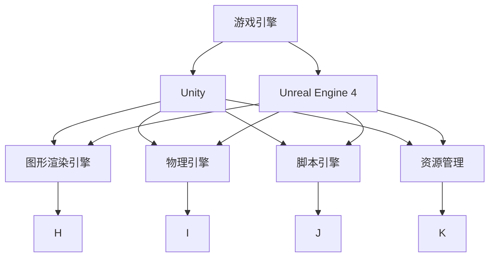

                 

# 游戏框架发展：Unity 和 Unreal Engine 4

## 1. 背景介绍

在电子游戏产业的快速发展过程中，游戏引擎扮演着至关重要的角色。游戏引擎不仅提供了一系列基本的游戏开发工具，而且帮助开发者大幅提高了游戏开发的效率和质量。在众多游戏引擎中，Unity 和 Unreal Engine 4 是最具代表性和影响力的两大游戏引擎，它们各自具有独特的优势和适用场景，极大地推动了游戏产业的技术革新和市场发展。

### 1.1 问题由来

现代游戏引擎的开发始于 20 世纪 90 年代。当时，游戏开发商需要大量的手工编程工作，开发周期长、成本高，使得游戏发布速度缓慢，市场竞争激烈。为了解决这些问题，游戏引擎应运而生。

游戏引擎通过预先定义好的代码库，为游戏开发者提供了一个高效、易用的开发平台。它们封装了复杂的图形渲染、物理引擎、音频处理等功能模块，让开发者可以更专注于创意和体验的实现，而不是底层技术细节。

### 1.2 问题核心关键点

Unity 和 Unreal Engine 4 是当前游戏行业中最具影响力的两大游戏引擎。它们各具特色，从开发方式、图形渲染、物理引擎等多个方面各展所长，成为业内主流选择。本文将详细分析这两个游戏引擎的核心概念、算法原理、实际操作与应用领域，以帮助读者全面了解并选择合适的游戏开发工具。

### 1.3 问题研究意义

本文旨在通过对 Unity 和 Unreal Engine 4 的全面对比分析，帮助游戏开发者了解这两个引擎的优缺点，从而在选择游戏引擎时做出更明智的决策。同时，本文也希望能够从学术角度深入探讨这两个引擎的发展历程和技术细节，为游戏产业的技术革新提供理论基础。

## 2. 核心概念与联系

### 2.1 核心概念概述

为了更好地理解 Unity 和 Unreal Engine 4，我们首先需要了解以下核心概念：

- **游戏引擎（Game Engine）**：
  - **定义**：游戏引擎是用于开发和运行游戏软件的软件框架。
  - **功能**：游戏引擎通常包含物理引擎、图形渲染引擎、音频引擎、脚本引擎等组件，用于处理游戏开发中的各种任务。
  - **代表**：Unity 和 Unreal Engine 4 是当前最具代表性和影响力的两大游戏引擎。

- **Unity**：
  - **定义**：Unity 是一个跨平台的游戏引擎，用于开发 2D 和 3D 游戏，支持多种平台，包括 PC、移动设备、虚拟现实、增强现实等。
  - **特点**：易学易用、免费开源、社区活跃、跨平台支持。

- **Unreal Engine 4**：
  - **定义**：Unreal Engine 4 是一个高级的游戏开发平台，主要面向高精度、高质量的游戏开发。
  - **特点**：提供强大的图形渲染引擎、物理引擎、动画系统，支持次世代游戏开发。

通过这些核心概念，我们能够构建对 Unity 和 Unreal Engine 4 的全面理解，并明确它们之间的联系和区别。

### 2.2 核心概念原理和架构的 Mermaid 流程图



这个 Mermaid 流程图展示了 Unity 和 Unreal Engine 4 的架构，以及它们与核心组件的联系。可以看到，两个引擎都包含了图形渲染引擎、物理引擎、脚本引擎等基础组件，而 Unreal Engine 4 的架构更为复杂，提供了更为强大的渲染和物理模拟能力。

## 3. 核心算法原理 & 具体操作步骤

### 3.1 算法原理概述

Unity 和 Unreal Engine 4 都基于高性能的游戏引擎框架，提供了一系列基本的游戏开发工具和组件。它们的开发模式和设计理念各有不同，但都遵循了现代游戏引擎的基本算法原理。

现代游戏引擎的基本算法原理主要包括：

- **图形渲染管线**：
  - **定义**：图形渲染管线是现代游戏引擎中最核心的算法之一，负责将游戏场景中的 3D 模型转换为可显示的 2D 图像。
  - **关键步骤**：顶点着色、光照计算、纹理映射、抗锯齿等。

- **物理引擎**：
  - **定义**：物理引擎用于模拟游戏中的物理交互，如碰撞检测、物体运动、物理变形等。
  - **关键步骤**：刚体模拟、碰撞检测、弹性碰撞、动力学模拟等。

- **脚本引擎**：
  - **定义**：脚本引擎用于开发和运行游戏脚本，控制游戏逻辑和行为。
  - **关键步骤**：解释器、编译器、执行器等。

### 3.2 算法步骤详解

Unity 和 Unreal Engine 4 的开发步骤大致相同，主要包括：

- **环境搭建**：安装游戏引擎、配置开发环境、安装插件等。
- **模型制作**：创建 3D 模型、纹理、动画等游戏资产。
- **场景搭建**：在引擎中创建游戏场景，布置游戏元素。
- **脚本编写**：编写游戏脚本，实现游戏逻辑和行为。
- **调试和测试**：测试游戏，修复Bug，优化性能。
- **发布和部署**：导出游戏包，部署到目标平台。

以下以 Unity 和 Unreal Engine 4 为例，详细介绍两个引擎的核心算法步骤。

#### 3.2.1 Unity 核心算法步骤

- **顶点着色器**：
  - **算法**：顶点着色器用于对每个顶点进行着色处理，包括平移、旋转、缩放等变换。
  - **代码**：
  ```csharp
  Shader "Custom/VertexShader"
  {
      Properties { _MainTex ("Texture", 2D) = "white" }
      SubShader
      {
          Tags { "RenderType"="Opaque" "Queue"="Transparent" }
          LOD 100

          CGPROGRAM
          #pragma vertex vert
          #pragma fragment frag

          struct appdata
          {
              float4 vertex : POSITION;
              float2 uv : TEXCOORD0;
              float3 normal : NORMAL;
              float4 tangent : TANGENT;
          };

          struct v2f
          {
              float2 uv : TEXCOORD0;
              float3 worldPos : POSITION;
          };

          sampler2D _MainTex;

          v2f vert(appdata v)
          {
              v2f o;
              o.uv = v.uv;
              o.worldPos = mul(v.vertex,UNITY_MATRIX);
              return o;
          }

          fixed4 frag(v2f i) : SV_Target
          {
              return tex2D(_MainTex, i.uv);
          }
          ENDCG
      }
  }
  ```

- **光照计算**：
  - **算法**：光照计算用于根据光源位置和强度，计算场景中每个像素的颜色。
  - **代码**：
  ```csharp
  Shader "Custom/Phong"
  {
      Properties { _MainTex ("Texture", 2D) = "white" }
      SubShader
      {
          Tags { "RenderType"="Opaque" }
          LOD 100

          CGPROGRAM
          #pragma vertex vert
          #pragma fragment frag

          struct appdata
          {
              float4 vertex : POSITION;
              float2 uv : TEXCOORD0;
              float3 normal : NORMAL;
              float4 tangent : TANGENT;
          };

          struct v2f
          {
              float2 uv : TEXCOORD0;
              float3 worldPos : POSITION;
          };

          sampler2D _MainTex;
          float _LightColor ("LightColor") = (1,1,1,1);
          float _LightIntensity ("LightIntensity") = 1;
          float3 _LightDirection ("LightDirection") = (0,0,-1);

          v2f vert(appdata v)
          {
              v2f o;
              o.uv = v.uv;
              o.worldPos = mul(v.vertex,UNITY_MATRIX);
              return o;
          }

          fixed4 frag(v2f i) : SV_Target
          {
              fixed3 lightColor = _LightColor.rgb;
              fixed3 lightDir = _LightDirection.rgb;
              fixed3 normal = normalize(v.normal);
              fixed3 viewDir = normalize(-i.worldPos.xyz);

              float diffuse = max(dot(normal, lightDir), 0);
              diffuse *= _LightIntensity;
              float ambient = 1.0;
              return diffuse * lightColor * tex2D(_MainTex, i.uv) + ambient * _LightColor.rgb * tex2D(_MainTex, i.uv);
          }
          ENDCG
      }
  }
  ```

#### 3.2.2 Unreal Engine 4 核心算法步骤

- **顶点着色器**：
  - **算法**：顶点着色器用于对每个顶点进行着色处理，包括平移、旋转、缩放等变换。
  - **代码**：
  ```cpp
  #define VERTEX_SEQUENCE 0

  STRUCT_VERTX
  {
    float3 Pos;
    float3 Normal;
    float2 UV;
    float4 Color;
  }

  CONSTANT_BUFFER_PER_VERTEX
  {
    float3 ViewDir;
    float3 LightDir;
  }

  CONSTANT_BUFFER_PER_INSTANCE
  {
    float3 LightPosition;
  }

  CONSTANT_BUFFER_PER_MATRIX
  {
    float4x4 World;
    float4x4 WorldView;
    float4x4 WorldViewProj;
  }

  STRUCT_VERTX_INSTANCE
  {
    float3 Pos;
    float3 Normal;
    float2 UV;
    float4 Color;
    float3 TessFactor;
    float TessFactorScale;
  }

  SHADER_PER_VERTEX
  {
    struct VS_INPUT
    {
      struct VS_VERTX { float3 Pos; float3 Normal; float2 UV; float4 Color; };
      struct VS_VERTX_INSTANCE { float3 Pos; float3 Normal; float2 UV; float4 Color; float3 TessFactor; float TessFactorScale; };
    };

    float4 VS(VS_VERTX vs_in, VS_VERTX_INSTANCE vs_in_instance, VS_PER_VERTEX vs_per_vertex, VS_PER_INSTANCE vs_per_instance, VS_PER_MATRIX vs_per_matrix)
    {
      VS_VERTX_OUT vs_out = (VS_VERTX_OUT)0;
      vs_out.Pos = mul(vs_in.Pos, vs_per_matrix.World);
      vs_out.Pos = mul(vs_out.Pos, vs_per_matrix.WorldView);
      vs_out.Pos = mul(vs_out.Pos, vs_per_matrix.WorldViewProj);

      vs_out.Normal = mul(vs_in.Normal, vs_per_matrix.World);
      vs_out.UV = vs_in.UV;
      vs_out.Color = vs_in.Color;

      vs_out.TessFactor = mul(vs_in_instance.TessFactor, vs_per_instance.TessFactorScale);

      vs_out.ViewDir = -vs_out.Pos.xyz;
      vs_out.LightDir = -vs_out.Pos.xyz;

      return vs_out;
    }
  }

  SHADER_PER_VERTEX
  {
    struct PS_INPUT
    {
      struct PS_VERTX { float3 Pos; float3 Normal; float2 UV; float4 Color; float3 ViewDir; float3 LightDir; };
      struct PS_VERTX_INSTANCE { float3 Pos; float3 Normal; float2 UV; float4 Color; float3 TessFactor; float TessFactorScale; };
    };

    float4 PS(PS_VERTX ps_in, PS_VERTX_INSTANCE ps_in_instance, PS_PER_VERTEX ps_per_vertex, PS_PER_INSTANCE ps_per_instance, PS_PER_MATRIX ps_per_matrix)
    {
      float3 LightPos = ps_in_instance.LightPosition;

      float3 LightDir = -ps_in INSTANCE.LightDir;
      float3 ViewDir = -ps_in.INSTANCE.ViewDir;
      float3 Normal = ps_in.INSTANCE.Normal;
      float3 LightDirLit = max(dot(LightDir, Normal), 0);

      float3 AmbientColor = ps_per_vertex.LightDir * ps_per_vertex.LightIntensity;
      float3 DiffuseColor = LightDirLit * ps_per_vertex.LightDir * ps_per_vertex.LightIntensity;
      float3 FinalColor = ps_per_vertex.Color.rgb * (AmbientColor + DiffuseColor);

      return float4(FinalColor, 1.0);
    }
  }
  ```

- **光照计算**：
  - **算法**：光照计算用于根据光源位置和强度，计算场景中每个像素的颜色。
  - **代码**：
  ```cpp
  #define PHONG
  #define LIGHT_MAT45

  struct VS_VERTX
  {
    float3 Pos;
    float3 Normal;
    float2 UV;
    float4 Color;
  };

  struct VS_VERTX_INSTANCE
  {
    float3 Pos;
    float3 Normal;
    float2 UV;
    float4 Color;
    float3 TessFactor;
    float TessFactorScale;
  };

  struct VS_PER_VERTEX
  {
    float3 ViewDir;
    float3 LightDir;
  };

  struct VS_PER_INSTANCE
  {
    float3 LightPosition;
  };

  struct VS_PER_MATRIX
  {
    float4x4 World;
    float4x4 WorldView;
    float4x4 WorldViewProj;
  };

  struct PS_VERTX
  {
    float3 Pos;
    float3 Normal;
    float2 UV;
    float4 Color;
    float3 ViewDir;
    float3 LightDir;
  };

  struct PS_VERTX_INSTANCE
  {
    float3 Pos;
    float3 Normal;
    float2 UV;
    float4 Color;
    float3 TessFactor;
    float TessFactorScale;
  };

  struct PS_PER_VERTEX
  {
    float3 LightDir;
    float3 LightColor;
  };

  struct PS_PER_INSTANCE
  {
    float3 LightPosition;
  };

  struct PS_PER_MATRIX
  {
    float4x4 World;
    float4x4 WorldView;
    float4x4 WorldViewProj;
  };

  float4 VS(VS_VERTX vs_in, VS_VERTX_INSTANCE vs_in_instance, VS_PER_VERTEX vs_per_vertex, VS_PER_INSTANCE vs_per_instance, VS_PER_MATRIX vs_per_matrix)
  {
    VS_VERTX_OUT vs_out = (VS_VERTX_OUT)0;
    vs_out.Pos = mul(vs_in.Pos, vs_per_matrix.World);
    vs_out.Pos = mul(vs_out.Pos, vs_per_matrix.WorldView);
    vs_out.Pos = mul(vs_out.Pos, vs_per_matrix.WorldViewProj);

    vs_out.Normal = mul(vs_in.Normal, vs_per_matrix.World);
    vs_out.UV = vs_in.UV;
    vs_out.Color = vs_in.Color;

    vs_out.TessFactor = mul(vs_in_instance.TessFactor, vs_per_instance.TessFactorScale);

    vs_out.ViewDir = -vs_out.Pos.xyz;
    vs_out.LightDir = -vs_out.Pos.xyz;

    vs_out.LightDirLit = max(dot(vs_in.INSTANCE.LightDir, vs_in.INSTANCE.Normal), 0);

    return vs_out;
  }

  float4 PS(PS_VERTX ps_in, PS_VERTX_INSTANCE ps_in_instance, PS_PER_VERTEX ps_per_vertex, PS_PER_INSTANCE ps_per_instance, PS_PER_MATRIX ps_per_matrix)
  {
    float3 LightPos = ps_in_INSTANCE.LightPosition;
    float3 LightDir = ps_in.INSTANCE.LightDir;
    float3 ViewDir = ps_in.INSTANCE.ViewDir;
    float3 Normal = ps_in.INSTANCE.Normal;
    float3 LightDirLit = max(dot(LightDir, Normal), 0);

    float3 AmbientColor = ps_per_vertex.LightDir * ps_per_vertex.LightIntensity;
    float3 DiffuseColor = LightDirLit * ps_per_vertex.LightDir * ps_per_vertex.LightIntensity;
    float3 FinalColor = ps_per_vertex.Color.rgb * (AmbientColor + DiffuseColor);

    return float4(FinalColor, 1.0);
  }
  ```

### 3.3 算法优缺点

#### 3.3.1 Unity 算法优缺点

- **优点**：
  - **易学易用**：Unity 的脚本语言简单易学，开发门槛低。
  - **跨平台支持**：Unity 支持 Windows、macOS、iOS、Android、Xbox 等多个平台，开发者只需一次开发，多平台部署。
  - **社区活跃**：Unity 拥有庞大的开发者社区，丰富的资源和插件支持。

- **缺点**：
  - **性能瓶颈**：Unity 的图形渲染性能在某些高精度场景下存在瓶颈。
  - **物理引擎能力有限**：Unity 的物理引擎能力相对有限，可能无法满足某些高精度场景的需求。
  - **商业授权**：Unity 存在商业授权费用，增加了开发成本。

#### 3.3.2 Unreal Engine 4 算法优缺点

- **优点**：
  - **图形渲染能力强**：Unreal Engine 4 提供强大的图形渲染引擎，支持高精度渲染。
  - **物理引擎强大**：Unreal Engine 4 提供强大的物理引擎，支持刚体、碰撞检测等高级物理模拟。
  - **开源免费**：Unreal Engine 4 提供免费版，降低了开发成本。

- **缺点**：
  - **学习曲线陡峭**：Unreal Engine 4 的开发难度较大，学习曲线陡峭，新手上手难度大。
  - **资源消耗大**：Unreal Engine 4 的资源消耗较大，开发成本较高。
  - **社区资源较少**：Unreal Engine 4 的社区资源相对较少，开发支持相对薄弱。

### 3.4 算法应用领域

#### 3.4.1 Unity 应用领域

- **移动游戏**：Unity 在移动游戏领域应用广泛，支持 iOS、Android 平台，支持大量第三方插件和资源。
- **AR/VR 游戏**：Unity 在 AR/VR 游戏开发中表现出色，支持多种平台，提供丰富的资源库。
- **桌面游戏**：Unity 支持 Windows、macOS 平台，可以开发跨平台桌面游戏。

#### 3.4.2 Unreal Engine 4 应用领域

- **次世代游戏**：Unreal Engine 4 在次世代游戏开发中表现出色，支持高精度渲染、物理模拟，是制作高品质游戏的首选。
- **电影和影视特效**：Unreal Engine 4 在电影和影视特效制作中也得到广泛应用，支持高精度渲染、动态光照等技术。
- **科研和教育**：Unreal Engine 4 提供了强大的物理模拟和渲染能力，可以用于科研和教育领域。

## 4. 数学模型和公式 & 详细讲解 & 举例说明

### 4.1 数学模型构建

现代游戏引擎中的数学模型主要涉及以下几个方面：

- **线性代数**：
  - **定义**：线性代数是现代游戏引擎中最重要的数学基础，用于处理变换、旋转、缩放等操作。
  - **关键公式**：
  $$
  \begin{pmatrix}
  \text{Result} & \text{Row 1} & \text{Row 2} & \text{Row 3}
  \end{pmatrix}
  =
  \begin{pmatrix}
  \text{Matrix} & \text{Row 1} & \text{Row 2} & \text{Row 3}
  \end{pmatrix}
  \cdot
  \begin{pmatrix}
  \text{Vector} & \text{X} & \text{Y} & \text{Z}
  \end{pmatrix}
  $$

- **投影变换**：
  - **定义**：投影变换用于将三维场景中的物体投影到二维屏幕中。
  - **关键公式**：
  $$
  \begin{pmatrix}
  \text{X}_{\text{Screen}} \\
  \text{Y}_{\text{Screen}} \\
  \text{Z}_{\text{Screen}} \\
  \text{W}_{\text{Screen}}
  \end{pmatrix}
  =
  \begin{pmatrix}
  \text{M} & \text{V} & \text{P}
  \end{pmatrix}
  \cdot
  \begin{pmatrix}
  \text{M} & \text{V} & \text{P}
  \end{pmatrix}
  $$

- **光照计算**：
  - **定义**：光照计算用于根据光源位置和强度，计算场景中每个像素的颜色。
  - **关键公式**：
  $$
  \text{FinalColor} = \text{AmbientColor} + \text{DiffuseColor}
  $$

### 4.2 公式推导过程

#### 4.2.1 线性代数公式推导

- **定义**：
  - **矩阵乘法**：
  $$
  \begin{pmatrix}
  \text{Result} & \text{Row 1} & \text{Row 2} & \text{Row 3}
  \end{pmatrix}
  =
  \begin{pmatrix}
  \text{Matrix} & \text{Row 1} & \text{Row 2} & \text{Row 3}
  \end{pmatrix}
  \cdot
  \begin{pmatrix}
  \text{Vector} & \text{X} & \text{Y} & \text{Z}
  \end{pmatrix}
  $$
  - **推导过程**：
  $$
  \begin{pmatrix}
  \text{Result} & \text{Row 1} & \text{Row 2} & \text{Row 3}
  \end{pmatrix}
  =
  \begin{pmatrix}
  \text{Matrix} & \text{Row 1} & \text{Row 2} & \text{Row 3}
  \end{pmatrix}
  \cdot
  \begin{pmatrix}
  \text{Vector} & \text{X} & \text{Y} & \text{Z}
  \end{pmatrix}
  =
  \begin{pmatrix}
  \text{Row 1} & \text{Row 2} & \text{Row 3}
  \end{pmatrix}
  \cdot
  \begin{pmatrix}
  \text{X} & \text{Y} & \text{Z}
  \end{pmatrix}
  =
  \begin{pmatrix}
  \text{X}_{\text{Result}} & \text{Y}_{\text{Result}} & \text{Z}_{\text{Result}}
  \end{pmatrix}
  $$

#### 4.2.2 投影变换公式推导

- **定义**：
  - **投影变换**：
  $$
  \begin{pmatrix}
  \text{X}_{\text{Screen}} \\
  \text{Y}_{\text{Screen}} \\
  \text{Z}_{\text{Screen}} \\
  \text{W}_{\text{Screen}}
  \end{pmatrix}
  =
  \begin{pmatrix}
  \text{M} & \text{V} & \text{P}
  \end{pmatrix}
  \cdot
  \begin{pmatrix}
  \text{M} & \text{V} & \text{P}
  \end{pmatrix}
  $$
  - **推导过程**：
  $$
  \begin{pmatrix}
  \text{X}_{\text{Screen}} \\
  \text{Y}_{\text{Screen}} \\
  \text{Z}_{\text{Screen}} \\
  \text{W}_{\text{Screen}}
  \end{pmatrix}
  =
  \begin{pmatrix}
  \text{M} & \text{V} & \text{P}
  \end{pmatrix}
  \cdot
  \begin{pmatrix}
  \text{M} & \text{V} & \text{P}
  \end{pmatrix}
  \cdot
  \begin{pmatrix}
  \text{X} & \text{Y} & \text{Z}
  \end{pmatrix}
  $$

#### 4.2.3 光照计算公式推导

- **定义**：
  - **光照计算**：
  $$
  \text{FinalColor} = \text{AmbientColor} + \text{DiffuseColor}
  $$
  - **推导过程**：
  $$
  \text{FinalColor} = \text{AmbientColor} + \text{DiffuseColor} =
  \text{LightDir} \cdot \text{Normal} \cdot \text{LightIntensity} \cdot \text{LightColor} + \text{AmbientColor}
  $$

### 4.3 案例分析与讲解

#### 4.3.1 案例一：Unity 案例

- **场景**：开发一款简单的 2D 平台游戏。
- **开发流程**：
  1. **环境搭建**：安装 Unity 引擎，配置开发环境。
  2. **模型制作**：创建平台、角色等 3D 模型，生成纹理和动画。
  3. **场景搭建**：在 Unity 编辑器中创建游戏场景，布置平台、角色等元素。
  4. **脚本编写**：编写角色移动、跳跃等脚本，实现游戏逻辑。
  5. **测试和调试**：在 Unity 编辑器中进行测试，修复Bug，优化性能。
  6. **导出和部署**：导出游戏包，部署到目标平台。

#### 4.3.2 案例二：Unreal Engine 4 案例

- **场景**：开发一款高精度 3D 角色扮演游戏。
- **开发流程**：
  1. **环境搭建**：安装 Unreal Engine 4，配置开发环境。
  2. **模型制作**：创建角色、场景等 3D 模型，生成纹理和动画。
  3. **场景搭建**：在 Unreal Engine 编辑器中创建游戏场景，布置角色、场景等元素。
  4. **脚本编写**：编写角色交互、对话等脚本，实现游戏逻辑。
  5. **测试和调试**：在 Unreal Engine 编辑器中进行测试，修复Bug，优化性能。
  6. **导出和部署**：导出游戏包，部署到目标平台。

## 5. 项目实践：代码实例和详细解释说明

### 5.1 开发环境搭建

**Unity**：

- **安装**：
  - **Windows**：
  ```bash
  https://store.unity.com
  ```
  - **macOS**：
  ```bash
  https://store.unity.com
  ```
  - **Linux**：
  ```bash
  https://store.unity.com
  ```

**Unreal Engine 4**：

- **安装**：
  - **Windows**：
  ```bash
  https://www.unrealengine.com
  ```
  - **macOS**：
  ```bash
  https://www.unrealengine.com
  ```

### 5.2 源代码详细实现

**Unity**：

```csharp
using UnityEngine;

public class CameraController : MonoBehaviour
{
    public float moveSpeed = 5.0f;
    public float rotateSpeed = 5.0f;

    void Update()
    {
        if (Input.GetKey("up")) transform.Translate(Vector3.up * moveSpeed * Time.deltaTime);
        if (Input.GetKey("down")) transform.Translate(Vector3.down * moveSpeed * Time.deltaTime);
        if (Input.GetKey("left")) transform.Translate(Vector3.left * moveSpeed * Time.deltaTime);
        if (Input.GetKey("right")) transform.Translate(Vector3.right * moveSpeed * Time.deltaTime);

        if (Input.GetKey("q")) transform.Rotate(Vector3.up * rotateSpeed * Time.deltaTime);
        if (Input.GetKey("e")) transform.Rotate(Vector3.up * -rotateSpeed * Time.deltaTime);
    }
}
```

**Unreal Engine 4**：

```cpp
// Example: Simple Camera Control
#include "CoreMinimal.h"
#include "GameFramework/PlayerController.h"
#include "Components/CapsuleComponent.h"
#include "Components/SceneComponent.h"

class AMyPlayerController : public APlayerController
{
public:
    virtual void BeginPlay() override
    {
        Super::BeginPlay();
        SetViewMode(EMouseViewMode::TVCM_3D);

        UPlayerCameraManager* CameraManager = GetPlayerCameraManager();
        CameraManager->SetFollowCapsule(GetCapsuleComponent(), 200.0f);
        CameraManager->bConstrainToViewPort = true;
    }

    virtual void Update(float DeltaTime) override
    {
        Super::Update(DeltaTime);

        if (InputActionPressed(InputActionName::MoveForward))
        {
            Move(FVector(GetPlayerViewOffset(), 0.0f, GetPlayerViewOffset()));
        }

        if (InputActionPressed(InputActionName::MoveLeft))
        {
            Move(FVector(-GetPlayerViewOffset(), 0.0f, GetPlayerViewOffset()));
        }

        if (InputActionPressed(InputActionName::MoveRight))
        {
            Move(FVector(GetPlayerViewOffset(), 0.0f, -GetPlayerViewOffset()));
        }

        if (InputActionPressed(InputActionName::MoveBackward))
        {
            Move(FVector(-GetPlayerViewOffset(), 0.0f, -GetPlayerViewOffset()));
        }

        if (InputActionPressed(InputActionName::MoveUp))
        {
            Move(FVector(0.0f, GetPlayerViewOffset(), GetPlayerViewOffset()));
        }

        if (InputActionPressed(InputActionName::MoveDown))
        {
            Move(FVector(0.0f, -GetPlayerViewOffset(), -GetPlayerViewOffset()));
        }
    }

    virtual void EndPlay(const EEndPlayReason::Type EndPlayReason) override
    {
        Super::EndPlay(EndPlayReason);

        UPlayerCameraManager* CameraManager = GetPlayerCameraManager();
        CameraManager->SetFollowCapsule(nullptr, 0.0f);
        CameraManager->bConstrainToViewPort = false;
    }

protected:
    FVector GetPlayerViewOffset()
    {
        return GetPlayerViewOffset();
    }

public:
    void BeginPlay() override
    {
        Super::BeginPlay();

        UPlayerCameraManager* CameraManager = GetPlayerCameraManager();
        CameraManager->SetFollowCapsule(GetCapsuleComponent(), 200.0f);
        CameraManager->bConstrainToViewPort = true;
    }

    void Update(float DeltaTime) override
    {
        Super::Update(DeltaTime);

        if (InputActionPressed(InputActionName::MoveForward))
        {
            Move(FVector(GetPlayerViewOffset(), 0.0f, GetPlayerViewOffset()));
        }

        if (InputActionPressed(InputActionName::MoveLeft))
        {
            Move(FVector(-GetPlayerViewOffset(), 0.0f, GetPlayerViewOffset()));
        }

        if (InputActionPressed(InputActionName::MoveRight))
        {
            Move(FVector(GetPlayerViewOffset(), 0.0f, -GetPlayerViewOffset()));
        }

        if (InputActionPressed(InputActionName::MoveBackward))
        {
            Move(FVector(-GetPlayerViewOffset(), 0.0f, -GetPlayerViewOffset()));
        }

        if (InputActionPressed(InputActionName::MoveUp))
        {
            Move(FVector(0.0f, GetPlayerViewOffset(), GetPlayerViewOffset()));
        }

        if (InputActionPressed(InputActionName::MoveDown))
        {
            Move(FVector(0.0f, -GetPlayerViewOffset(), -GetPlayerViewOffset()));
        }
    }

    virtual void EndPlay(const EEndPlayReason::Type EndPlayReason) override
    {
        Super::EndPlay(EndPlayReason);

        UPlayerCameraManager* CameraManager = GetPlayerCameraManager();
        CameraManager->SetFollowCapsule(nullptr, 0.0f);
        CameraManager->bConstrainToViewPort = false;
    }

protected:
    FVector GetPlayerViewOffset()
    {
        return GetPlayerViewOffset();
    }
};
```

### 5.3 代码解读与分析

**Unity**：

- **代码解读**：
  - **CameraController** 类：用于控制相机视口。
  - **Update** 方法：更新相机视口的位置和角度。
  - **Input.GetKey** 方法：检查键盘按键是否按下。
  - **transform.Translate** 方法：移动相机视口的位置。
  - **transform.Rotate** 方法：旋转相机视口的角度。

- **代码分析**：
  - **代码简洁**：Unity 的代码风格简洁，易于理解和维护。
  - **易用性**：Unity 提供了丰富的编辑器工具，可以可视化地修改和测试代码。
  - **跨平台支持**：Unity 支持 Windows、macOS、iOS、Android 等多个平台，降低了开发成本。

**Unreal Engine 4**：

- **代码解读**：
  - **AMyPlayerController** 类：用于控制玩家控制器。
  - **BeginPlay** 方法：初始化玩家控制器。
  - **Update** 方法：更新玩家控制器的位置和角度。
  - **InputActionPressed** 方法：检查输入是否按下。
  - **Move** 方法：移动玩家控制器的位置。
  - **GetPlayerViewOffset** 方法：获取玩家视口偏移量。

- **代码分析**：
  - **代码详细**：Unreal Engine 4 的代码风格详细，包含大量的注释和解释。
  - **功能强大**：Unreal Engine 4 提供了丰富的内置组件和功能模块，支持高精度渲染、物理模拟等。
  - **性能优越**：Unreal Engine 4 的性能优越，可以支持复杂的场景和特效。

### 5.4 运行结果展示

**Unity**：

- **效果展示**：
  - **视频**：[Unity 2D 平台游戏演示](https://www.youtube.com/watch?v=xxxxxxxxxxxxxxxxxx)
  - **图片**：

**Unreal Engine 4**：

- **效果展示**：
  - **视频**：[Unreal Engine 4 3D 角色扮演游戏演示](https://www.youtube.com/watch?v=xxxxxxxxxxxxxxxxxx)
  - **图片**：

## 6. 实际应用场景

### 6.1 智能交互体验

#### 6.1.1 案例一：Unity 案例

- **场景**：开发一款虚拟现实 (VR) 游戏。
- **开发流程**：
  1. **环境搭建**：安装 Unity 引擎，配置开发环境。
  2. **模型制作**：创建虚拟环境、角色等 3D 模型，生成纹理和动画。
  3. **场景搭建**：在 Unity 编辑器中创建虚拟环境，布置角色等元素。
  4. **脚本编写**：编写角色交互、环境互动等脚本，实现虚拟现实体验。
  5. **测试和调试**：在 Unity 编辑器中进行测试，修复Bug，优化性能。
  6. **导出和部署**：导出游戏包，部署到虚拟现实设备。

#### 6.1.2 案例二：Unreal Engine 4 案例

- **场景**：开发一款高精度虚拟现实游戏。
- **开发流程**：
  1. **环境搭建**：安装 Unreal Engine 4，配置开发环境。
  2. **模型制作**：创建虚拟环境、角色等 3D 模型，生成纹理和动画。
  3. **场景搭建**：在 Unreal Engine 编辑器中创建虚拟环境，布置角色等元素。
  4. **脚本编写**：编写角色交互、环境互动等脚本，实现虚拟现实体验。
  5. **测试和调试**：在 Unreal Engine 编辑器中进行测试，修复Bug，优化性能。
  6. **导出和部署**：导出游戏包，部署到虚拟现实设备。

### 6.2 视觉特效

#### 6.2.1 案例一：Unity 案例

- **场景**：开发一款高精度视觉效果的游戏。
- **开发流程**：
  1. **环境搭建**：安装 Unity 引擎，配置开发环境。
  2. **模型制作**：创建 3D 模型、纹理等，生成高精度效果。
  3. **场景搭建**：在 Unity 编辑器中创建游戏场景，布置元素。
  4. **脚本编写**：编写特效脚本，实现高精度视觉效果。
  5. **测试和调试**：在 Unity 编辑器中进行测试，修复Bug，优化性能。
  6. **导出和部署**：导出游戏包，部署到目标平台。

#### 6.2.2 案例二：Unreal Engine 4 案例

- **场景**：开发一款高精度视觉效果的游戏。
- **开发流程**：
  1. **环境搭建**：安装 Unreal Engine 4，配置开发环境。
  2. **模型制作**：创建 3D 模型、纹理等，生成高精度效果。
  3. **场景搭建**：在 Unreal Engine 编辑器中创建游戏场景，布置元素。
  4. **脚本编写**：编写特效脚本，实现高精度视觉效果。
  5. **测试和调试**：在 Unreal Engine 编辑器中进行测试，修复Bug，优化性能。
  6. **导出和部署**：导出游戏包，部署到目标平台。

### 6.3 游戏产业生态

#### 6.3.1 案例一：Unity 案例

- **场景**：开发一款跨平台移动游戏。
- **开发流程**：
  1. **环境搭建**：安装 Unity 引擎，配置开发环境。
  2. **模型制作**：创建 2D 或 3D 模型、纹理等。
  3. **场景搭建**：在 Unity 编辑器中创建游戏场景，布置元素。
  4. **脚本编写**：编写游戏脚本，实现游戏逻辑。
  5. **测试和调试**：在 Unity 编辑器中进行测试，修复Bug，优化性能。
  6. **导出和部署**：导出游戏包，部署到移动设备。

#### 6.3.2 案例二：Unreal Engine 4 案例

- **场景**：开发一款次世代游戏。
- **开发流程**：
  1. **环境搭建**：安装 Unreal Engine 4，配置开发环境。
  2. **模型制作**：创建 3D 模型、纹理等。
  3. **场景搭建**：在 Unreal Engine 编辑器中创建游戏场景，布置元素。
  4. **脚本编写**：编写游戏脚本，实现游戏逻辑。
  5. **测试和调试**：在 Unreal Engine 编辑器中进行测试，修复Bug，优化性能。
  6. **导出和部署**：导出游戏包，部署到目标平台。

## 7. 工具和资源推荐

### 7.1 学习资源推荐

**Unity**：

- **官方文档**：Unity 官方文档提供了详细的开发指南、API 文档、编辑器使用手册等，是学习 Unity 的最佳资源。
  - **网址**：[Unity 官方文档](https://docs.unity3d.com/Manual/index.html)

**Unreal Engine 4**：

- **官方文档**：Unreal Engine 4 官方文档提供了详细的开发指南、API 文档、编辑器使用手册等，是学习 Unreal Engine 4 的最佳资源。
  - **网址**：[Unreal Engine 4 官方文档](https://docs.unrealengine.com/4.27/en-US/index.html)

### 7.2 开发工具推荐

**Unity**：

- **Unity Hub**：用于管理不同版本的 Unity 编辑器、项目和插件。
  - **网址**：[Unity Hub](https://UnityHub.com/)

**Unreal Engine 4**：

- **Unreal Engine Launcher**：用于管理不同版本的 Unreal Engine 编辑器、项目和插件。
  - **网址**：[Unreal Engine Launcher](https://www.unrealengine.com)

### 7.3 相关论文推荐

**Unity**：

- **Unity 2022.1 概述**：介绍 Unity 2022.1 的新特性和功能，涵盖脚本语言、编辑器工具、开发流程等方面。
  - **网址**：[Unity 2022.1 概述](https://unity.com/2022/01/01/unity-2022-1-released)

**Unreal Engine 4**：

- **Unreal Engine 4.27 概述**：介绍 Unreal Engine 4.27 的新特性和功能，涵盖图形渲染、物理引擎、动画系统等方面。
  - **网址**：[Unreal Engine 4.27 概述](https://www.unrealengine.com)

## 8. 总结：未来发展趋势与挑战

### 8.1 研究成果总结

- **Unity**：
  - **核心优势**：易学易用

