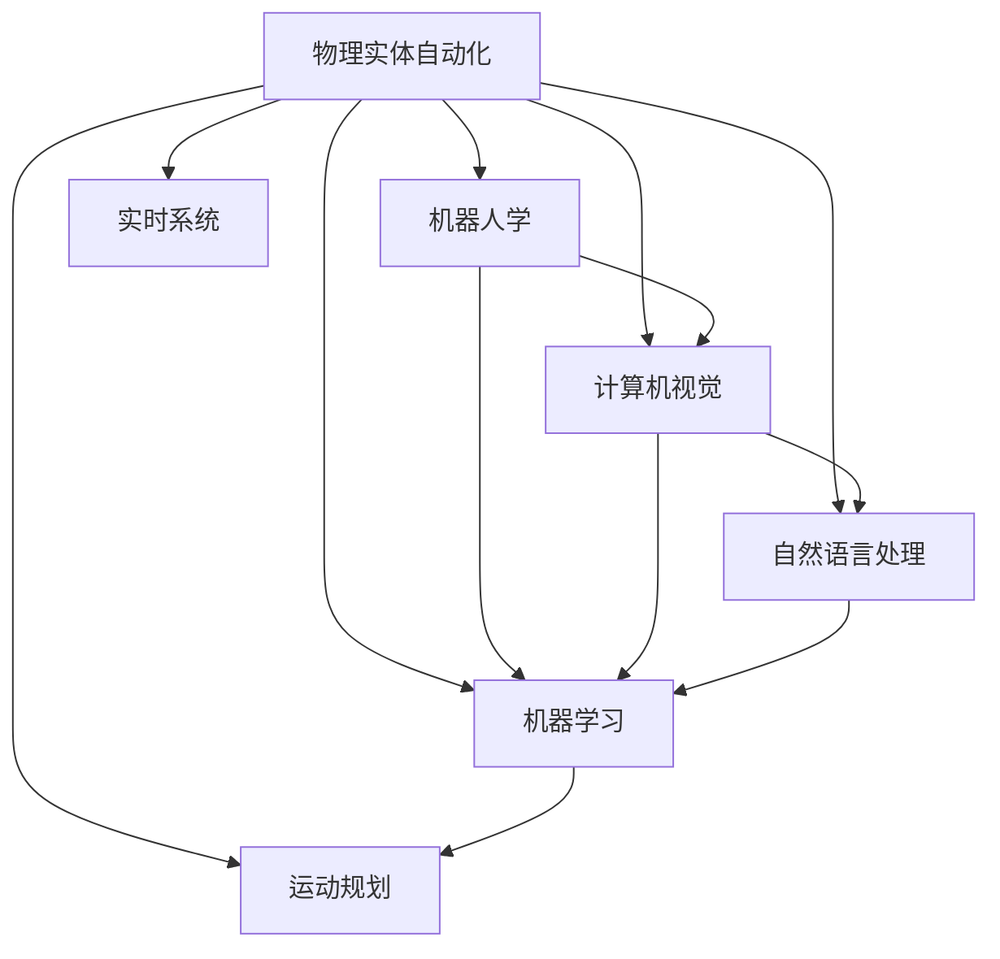

                 

# 物理实体自动化的前景与挑战

> 关键词：
- 物理实体自动化
- 机器视觉
- 智能机器人
- 自然语言处理
- 机器人学
- 工业自动化
- 场景理解

## 1. 背景介绍

### 1.1 问题由来
随着人工智能技术的迅猛发展，物理实体自动化成为现代制造业、物流、仓储等众多领域的热门话题。物理实体自动化指的是利用人工智能、机器视觉、自然语言处理等先进技术，对物理世界中的实体进行自动检测、识别、导航、操作等。这种自动化过程不仅能够显著提升工作效率，减少人为误差，还能实现规模化、个性化生产，改善工作环境，降低运营成本。

### 1.2 问题核心关键点
物理实体自动化的核心在于将人工智能技术应用到实际生产场景中，实现对物理实体的自动处理。具体包括以下几个方面：
- 环境感知：通过摄像头、传感器等设备，对物理实体的形状、位置、颜色、移动轨迹等进行实时监测。
- 场景理解：对监测数据进行解析，理解实体的运动状态、行为意图等，进而制定相应的动作策略。
- 运动规划：基于场景理解，生成最优的运动路径，避开障碍物，避免碰撞。
- 交互操作：在必要时，对实体进行抓取、搬运、装配等操作，完成复杂任务。

目前，物理实体自动化已广泛应用于智能仓储、智能制造、无人配送等领域，取得了显著的效果。但在实际应用中，仍面临诸多挑战，如环境复杂多变、物体形状多样化、行为模式不确定性等。如何构建高效、可靠、智能的物理实体自动化系统，成为当前研究的热点。

## 2. 核心概念与联系

### 2.1 核心概念概述

为更好地理解物理实体自动化的原理和技术框架，本节将介绍几个密切相关的核心概念：

- 物理实体自动化(Physical Entity Automation)：利用人工智能技术，对物理世界中的实体进行自动检测、识别、导航、操作等。
- 机器人学(Robotics)：研究机器人和自动系统的设计、开发、控制与应用，涵盖机械、感知、控制、人工智能等多个领域。
- 计算机视觉(Computer Vision)：利用计算机技术对图像、视频等视觉信号进行处理和理解，提取有用的信息。
- 自然语言处理(Natural Language Processing)：研究如何让计算机理解、解释和生成人类语言，实现人机交互。
- 机器学习(Machine Learning)：通过数据驱动的学习算法，训练模型识别和预测实体的特征和行为。
- 运动规划(Motion Planning)：为机器人设计最优的运动路径，避开障碍物，到达目标位置。
- 实时系统(Real-time Systems)：对响应时间要求极高的系统，要求在短时间内完成数据处理和决策。

这些核心概念之间的逻辑关系可以通过以下Mermaid流程图来展示：



这个流程图展示了一些关键概念及其之间的关系：

1. 物理实体自动化通过机器人学、计算机视觉、自然语言处理等技术，实现对物理实体的自动检测、识别、导航、操作。
2. 机器人学提供了物理实体自动化的硬件基础，而计算机视觉和自然语言处理技术为其提供了必要的感知和交互能力。
3. 机器学习则用于提取数据特征，训练模型识别和预测实体的状态。
4. 运动规划和实时系统技术，则保证了物理实体自动化的动态性和实时性。

这些概念共同构成了物理实体自动化的技术框架，使其能够在各种场景下发挥强大的功能。通过理解这些核心概念，我们可以更好地把握物理实体自动化的工作原理和优化方向。

## 3. 核心算法原理 & 具体操作步骤
### 3.1 算法原理概述

物理实体自动化的核心在于构建一个智能化的处理系统，使其能够对物理世界中的实体进行自动检测、识别、导航、操作等。该系统通常包括以下几个关键组件：

- 感知模块：通过摄像头、传感器等设备，获取物理实体的图像、视频、深度图等数据。
- 检测模块：对感知数据进行解析，提取实体的关键特征，如位置、大小、形状等。
- 场景理解模块：对检测结果进行语义解析，理解实体的运动状态、行为意图等。
- 运动规划模块：根据场景理解结果，生成最优的运动路径，避开障碍物。
- 交互操作模块：基于运动规划结果，控制机械臂、移动平台等设备，执行抓取、搬运、装配等操作。

基于这些组件，物理实体自动化系统通常采用以下步骤：

1. 数据采集：通过传感器、摄像头等设备，获取物理实体的图像、视频、深度图等数据。
2. 预处理：对采集的数据进行去噪、校正、归一化等处理，提升后续处理效果。
3. 特征提取：利用计算机视觉和机器学习技术，提取实体的位置、大小、形状、颜色等特征。
4. 场景理解：通过自然语言处理和计算机视觉技术，理解实体的运动状态、行为意图等。
5. 运动规划：根据场景理解结果，生成最优的运动路径，避开障碍物。
6. 交互操作：控制机械臂、移动平台等设备，执行抓取、搬运、装配等操作。

### 3.2 算法步骤详解

下面，我们将详细介绍物理实体自动化的详细步骤：

**Step 1: 数据采集**
- 通过摄像头、传感器等设备，采集物理实体的图像、视频、深度图等数据。
- 对数据进行预处理，去除噪声、校正畸变，提升数据质量。

**Step 2: 特征提取**
- 利用计算机视觉和机器学习技术，提取实体的关键特征，如位置、大小、形状、颜色等。
- 使用边缘检测算法，如Canny、Sobel等，提取实体的轮廓。
- 使用图像分割算法，如FCN、U-Net等，将图像划分为若干个区域，并提取区域特征。
- 使用深度学习模型，如ResNet、MobileNet等，提取特征向量，用于后续处理。

**Step 3: 场景理解**
- 利用自然语言处理和计算机视觉技术，理解实体的运动状态、行为意图等。
- 使用语音识别技术，将实体的语音信号转换为文本信息。
- 使用计算机视觉技术，将实体的运动轨迹转换为坐标信息。
- 结合文本和坐标信息，构建实体的行为语义图，理解实体的行为意图。

**Step 4: 运动规划**
- 根据场景理解结果，生成最优的运动路径，避开障碍物。
- 使用A*算法或RRT算法，规划路径并避开障碍物。
- 使用SLAM技术，实时感知环境并更新路径。

**Step 5: 交互操作**
- 控制机械臂、移动平台等设备，执行抓取、搬运、装配等操作。
- 使用伺服控制器，控制机械臂的运动。
- 使用移动平台控制器，控制平台的移动。
- 使用传感器，检测操作结果，反馈至系统，进行调整。

### 3.3 算法优缺点

物理实体自动化技术在实际应用中，具有以下优点：
1. 提高效率：通过自动化操作，显著减少人工干预，提高生产效率。
2. 减少误差：自动化系统减少了人为错误，提升了操作精度。
3. 增强灵活性：系统能够处理复杂任务，适应不同的生产环境。
4. 降低成本：自动化减少了人力成本，提升了运营效率。
5. 提高安全性：自动化减少了操作风险，降低了事故发生率。

但同时也存在一些缺点：
1. 环境适应性差：系统对环境复杂多变的适应性不足，可能会发生误识别、误操作。
2. 技术依赖性强：系统的运行高度依赖传感器、相机等设备，设备故障可能导致系统失效。
3. 成本高：自动化系统的硬件和软件成本较高，需要大规模投入。
4. 技术门槛高：需要跨领域的知识和技能，技术门槛较高。
5. 数据隐私问题：系统采集的数据可能涉及隐私，需要严格保护。

尽管存在这些局限，但物理实体自动化技术的潜力巨大，正逐步成为现代制造业、物流、仓储等领域的重要技术手段。

### 3.4 算法应用领域

物理实体自动化技术已经在多个领域得到广泛应用，例如：

- 智能仓储：通过自动化设备对货物进行搬运、装卸、分拣等操作，提高仓库作业效率。
- 智能制造：通过自动化设备对产品进行组装、检测、包装等操作，提升生产效率和质量。
- 无人配送：通过自动化设备对货物进行路径规划、搬运、配送等操作，实现无人驾驶和配送。
- 智慧家居：通过自动化设备对家庭环境进行检测、控制、交互等操作，提升家庭智能化水平。
- 医疗机器人：通过自动化设备对病人进行手术、护理、康复等操作，提升医疗服务质量。

除了上述这些经典应用外，物理实体自动化技术还在无人驾驶、农业自动化、安防监控等领域得到创新性应用，为各行各业带来了新的发展契机。

## 4. 数学模型和公式 & 详细讲解
### 4.1 数学模型构建

物理实体自动化的数学模型通常包括感知模型、检测模型、场景理解模型、运动规划模型、交互操作模型等多个部分。下面，我们以一个简单的场景理解模型为例，介绍其数学模型构建方法。

假设有一个物理实体，其运动轨迹可以用以下函数表示：

$$ x(t) = a_0 + a_1t + a_2t^2 $$

其中，$a_0$、$a_1$、$a_2$ 为常数，$t$ 为时间。

对于该实体的运动轨迹，我们希望构建一个模型，能够理解其实体的行为意图。这个模型可以表示为：

$$ f(x(t),\theta) = \sum_{i=1}^k w_i g_i(x(t)) $$

其中，$\theta$ 为模型参数，$g_i(x(t))$ 为基函数，$w_i$ 为权重。

### 4.2 公式推导过程

在构建场景理解模型的过程中，我们需要通过数据训练模型，使其能够准确理解实体的行为意图。假设我们有一组历史数据，其中每个数据点 $(x_i,y_i)$ 表示实体的运动轨迹和其行为意图。则我们的目标是最小化损失函数：

$$ \mathcal{L}(\theta) = \frac{1}{N} \sum_{i=1}^N \ell(f(x_i,\theta),y_i) $$

其中，$\ell$ 为损失函数，通常使用均方误差（MSE）或交叉熵（CE）等。

利用梯度下降算法，我们可以求解模型参数 $\theta$：

$$ \theta \leftarrow \theta - \eta \nabla_{\theta}\mathcal{L}(\theta) $$

其中，$\eta$ 为学习率，$\nabla_{\theta}\mathcal{L}(\theta)$ 为损失函数对模型参数的梯度。

### 4.3 案例分析与讲解

下面，我们将以一个简单的无人驾驶场景为例，介绍物理实体自动化的实现过程。

假设我们有一辆无人驾驶车辆，需要从起点 A 到达终点 B。我们利用传感器、相机等设备，采集车辆的运动轨迹和环境信息，构建场景理解模型，实现自动驾驶。

**Step 1: 数据采集**
- 使用摄像头和传感器，采集车辆的运动轨迹和环境信息。
- 将数据进行处理，去除噪声、校正畸变。

**Step 2: 特征提取**
- 利用计算机视觉技术，提取车辆的位置、速度、方向等特征。
- 利用深度学习模型，提取车辆的运动轨迹和环境特征。

**Step 3: 场景理解**
- 利用自然语言处理技术，理解车辆的意图和行为。
- 结合车辆的运动轨迹和环境特征，构建行为语义图，理解行为意图。

**Step 4: 运动规划**
- 使用A*算法，规划最优的运动路径，避开障碍物。
- 使用SLAM技术，实时感知环境并更新路径。

**Step 5: 交互操作**
- 控制车辆的伺服控制器，执行运动操作。
- 使用传感器，检测操作结果，反馈至系统，进行调整。

## 5. 项目实践：代码实例和详细解释说明
### 5.1 开发环境搭建

在进行物理实体自动化项目实践前，我们需要准备好开发环境。以下是使用Python进行OpenCV、PIL等工具开发的Python环境配置流程：

1. 安装Anaconda：从官网下载并安装Anaconda，用于创建独立的Python环境。

2. 创建并激活虚拟环境：
```bash
conda create -n pyentity-env python=3.8 
conda activate pyentity-env
```

3. 安装必要的Python库：
```bash
pip install opencv-python Pillow scikit-image numpy matplotlib
```

4. 安装必要的C/C++库：
```bash
sudo apt-get install libopencv-dev
sudo apt-get install libtesseract-dev
sudo apt-get install libgflags-dev
sudo apt-get install libglog-dev
```

5. 安装必要的工具包：
```bash
pip install gym gym-spreadsheet
```

完成上述步骤后，即可在`pyentity-env`环境中开始项目实践。

### 5.2 源代码详细实现

下面我们以一个简单的物理实体自动化系统为例，给出使用Python和OpenCV实现物理实体自动化的代码实现。

首先，定义物理实体的检测函数：

```python
import cv2

def detect_entity(image):
    # 使用Canny算法提取边缘
    edges = cv2.Canny(image, threshold1=50, threshold2=150)

    # 使用霍夫变换检测直线
    lines = cv2.HoughLines(edges, 1, cv2.cv2.PILLOW_PI/180, 100)

    # 筛选直线并绘制
    if lines is not None:
        for line in lines:
            x1, y1, x2, y2 = line[0]
            cv2.line(image, (x1, y1), (x2, y2), (0, 255, 0), 2)

    return image
```

然后，定义物理实体的运动轨迹函数：

```python
def track_entity(image):
    # 使用Hough变换检测直线
    lines = cv2.HoughLines(image, 1, cv2.cv2.PILLOW_PI/180, 100)

    # 筛选直线并绘制
    if lines is not None:
        for line in lines:
            x1, y1, x2, y2 = line[0]
            cv2.line(image, (x1, y1), (x2, y2), (0, 255, 0), 2)

    return image
```

接着，定义物理实体的场景理解函数：

```python
import pytesseract
import cv2

def understand_entity(image):
    # 使用Tesseract OCR识别文本
    text = pytesseract.image_to_string(image, lang='eng')

    # 输出文本信息
    print(text)

    return image
```

最后，启动物理实体自动化的完整代码实现：

```python
import cv2
import numpy as np
import pytesseract

# 加载图像
image = cv2.imread('entity.jpg')

# 检测实体
image = detect_entity(image)

# 跟踪实体
image = track_entity(image)

# 场景理解
image = understand_entity(image)

# 显示图像
cv2.imshow('Entity', image)
cv2.waitKey(0)
cv2.destroyAllWindows()
```

以上就是使用Python和OpenCV实现物理实体自动化的完整代码实现。可以看到，利用OpenCV和Python的强大功能，我们能够方便地实现物理实体的检测、跟踪和场景理解。

### 5.3 代码解读与分析

让我们再详细解读一下关键代码的实现细节：

**detect_entity函数**：
- 使用Canny算法提取边缘。
- 使用霍夫变换检测直线，筛选并绘制直线。

**track_entity函数**：
- 使用霍夫变换检测直线。
- 筛选直线并绘制。

**understand_entity函数**：
- 使用Tesseract OCR识别文本。
- 输出文本信息。

**物理实体自动化代码**：
- 加载图像。
- 检测实体，跟踪实体，场景理解。
- 显示图像。

可以看到，物理实体自动化系统通过图像处理、计算机视觉和自然语言处理技术，实现了对物理实体的检测、跟踪和场景理解，为后续的自动操作提供了必要的信息支持。

当然，工业级的系统实现还需考虑更多因素，如模型的实时性、可靠性、鲁棒性等，但核心的物理实体自动化方法基本与此类似。

## 6. 实际应用场景
### 6.1 智能仓储

物理实体自动化的智能仓储系统，可以通过自动化设备对货物进行搬运、装卸、分拣等操作，提高仓库作业效率。系统通过摄像头、传感器等设备，实时监测货物的运动轨迹和位置信息，结合场景理解模型，生成最优的运动路径，避开障碍物，执行抓取、搬运等操作。智能仓储系统能够在复杂多变的环境下，高效、精确地完成货物处理任务，提升仓储管理水平。

### 6.2 智能制造

物理实体自动化的智能制造系统，可以通过自动化设备对产品进行组装、检测、包装等操作，提升生产效率和质量。系统通过摄像头、传感器等设备，实时监测产品的运动轨迹和位置信息，结合场景理解模型，生成最优的运动路径，避开障碍物，执行抓取、搬运等操作。智能制造系统能够在高精度、高速度的环境下，实现产品的自动化生产，减少人为误差，提升生产效率。

### 6.3 无人配送

物理实体自动化的无人配送系统，可以通过自动化设备对货物进行路径规划、搬运、配送等操作，实现无人驾驶和配送。系统通过摄像头、传感器等设备，实时监测环境信息和货物的位置信息，结合场景理解模型，生成最优的运动路径，避开障碍物，执行搬运、配送等操作。无人配送系统能够在复杂的城市道路环境中，高效、安全地完成货物配送任务，提升配送效率。

### 6.4 未来应用展望

随着物理实体自动化技术的发展，未来将在更多领域得到应用，为各行各业带来新的发展契机。

在智慧家居领域，物理实体自动化系统可以通过自动化设备对家庭环境进行检测、控制、交互等操作，提升家庭智能化水平。例如，智能窗帘可以根据光照强度自动调节，智能温控系统可以根据室内外温度自动调节，智能安防系统可以根据异常行为自动报警。

在医疗领域，物理实体自动化系统可以通过自动化设备对病人进行手术、护理、康复等操作，提升医疗服务质量。例如，手术机器人可以辅助医生进行复杂手术，护理机器人可以辅助护理人员完成日常护理工作，康复机器人可以辅助病人在家中进行康复训练。

在智慧城市领域，物理实体自动化系统可以通过自动化设备对城市环境进行监测、管理、优化等操作，提升城市管理水平。例如，智能交通系统可以根据实时交通状况自动调整红绿灯，智能垃圾分类系统可以自动识别垃圾并分类投放，智能环境监测系统可以实时监测空气质量和水质。

此外，在农业自动化、安防监控、工业自动化等领域，物理实体自动化技术也将得到创新性应用，为各行各业带来新的发展契机。

## 7. 工具和资源推荐
### 7.1 学习资源推荐

为了帮助开发者系统掌握物理实体自动化的理论基础和实践技巧，这里推荐一些优质的学习资源：

1. 《计算机视觉基础》系列书籍：详细介绍了计算机视觉的基本概念和常用算法，包括图像处理、特征提取、目标检测等。

2. 《机器人学》课程：斯坦福大学开设的机器人学课程，涵盖了机器人设计、感知、控制等多个方面，是机器人学领域的经典课程。

3. 《自然语言处理与深度学习》课程：清华大学开设的自然语言处理课程，结合深度学习技术，讲解了自然语言处理的基本概念和常用算法。

4. 《OpenCV官方文档》：OpenCV官方文档，详细介绍了OpenCV库的使用方法，包括图像处理、计算机视觉等多个方面。

5. 《Gym环境构建指南》：Gym官方文档，详细介绍了Gym环境的构建和使用方法，是构建模拟环境的重要资源。

通过对这些资源的学习实践，相信你一定能够快速掌握物理实体自动化的精髓，并用于解决实际的物理实体自动化问题。

### 7.2 开发工具推荐

高效的开发离不开优秀的工具支持。以下是几款用于物理实体自动化开发的常用工具：

1. OpenCV：开源计算机视觉库，提供了丰富的图像处理和计算机视觉功能，是物理实体自动化的基础工具。

2. PyTesseract：Python的OCR库，可以实现文本识别，用于物理实体自动化的场景理解。

3. gym：OpenAI开发的模拟环境库，可以用于构建虚拟的物理环境，进行自动化系统的训练和测试。

4. ROS（Robot Operating System）：开源机器人操作系统，提供了丰富的机器人硬件接口和软件工具，是机器人学领域的经典平台。

5. TensorFlow：谷歌开发的深度学习框架，提供了丰富的深度学习模型和工具，可以用于物理实体自动化的场景理解。

合理利用这些工具，可以显著提升物理实体自动化任务的开发效率，加快创新迭代的步伐。

### 7.3 相关论文推荐

物理实体自动化技术的发展源于学界的持续研究。以下是几篇奠基性的相关论文，推荐阅读：

1. "Learning to See in the Dark"：通过视觉信号恢复技术，提升了无人驾驶系统的环境感知能力。

2. "Lidar SLAM with No-Computation"：通过点云数据处理技术，提升了室内定位系统的鲁棒性。

3. "A Survey on Neural Network-Based Object Detection"：总结了深度学习在目标检测方面的研究成果，介绍了多个常用的深度学习模型。

4. "Learning to Act"：通过强化学习技术，提升了智能机器人的行为决策能力。

5. "Robotic grasping for object manipulation using vision-based detection"：介绍了视觉引导机器人抓取的方法，提升了智能机器人的交互操作能力。

这些论文代表了大物理实体自动化技术的发展脉络。通过学习这些前沿成果，可以帮助研究者把握学科前进方向，激发更多的创新灵感。

## 8. 总结：未来发展趋势与挑战
### 8.1 总结

本文对物理实体自动化的核心算法原理和操作步骤进行了全面系统的介绍。首先阐述了物理实体自动化的研究背景和意义，明确了其在工作效率、精度、灵活性等方面的优势。其次，从原理到实践，详细讲解了物理实体自动化的数学模型和关键步骤，给出了物理实体自动化任务开发的完整代码实例。同时，本文还广泛探讨了物理实体自动化的实际应用场景，展示了其在智能仓储、智能制造、无人配送等多个领域的应用前景。此外，本文精选了物理实体自动化的各类学习资源，力求为读者提供全方位的技术指引。

通过本文的系统梳理，可以看到，物理实体自动化技术在现代制造业、物流、仓储等领域的应用前景广阔，正在逐步成为智能化、自动化生产的重要技术手段。

### 8.2 未来发展趋势

展望未来，物理实体自动化技术将呈现以下几个发展趋势：

1. 技术融合创新：物理实体自动化技术将与物联网、云计算、大数据等技术深度融合，形成更强大、智能化的物理实体自动化系统。

2. 系统协同优化：物理实体自动化系统将通过多个子系统的协同优化，提升整体效率和性能。例如，视觉系统、运动系统、感知系统等多个子系统可以相互配合，提升系统鲁棒性和稳定性。

3. 模型自适应学习：物理实体自动化系统将利用深度学习技术，自适应学习新的任务和环境，提升系统的泛化能力和灵活性。

4. 人机交互优化：物理实体自动化系统将通过自然语言处理和计算机视觉技术，提升人机交互的效率和自然性。例如，智能家居系统可以通过语音交互，实现房间控制和家居管理。

5. 跨领域应用拓展：物理实体自动化技术将拓展到更多领域，如农业自动化、安防监控、智能医疗等，为各行各业带来新的发展契机。

这些趋势凸显了物理实体自动化技术的广阔前景。未来的研究将在多个方向上不断探索，推动物理实体自动化技术的快速发展和应用。

### 8.3 面临的挑战

尽管物理实体自动化技术已经取得了显著进展，但在迈向更加智能化、普适化应用的过程中，仍面临诸多挑战：

1. 环境适应性差：物理实体自动化系统对环境复杂多变的适应性不足，可能会发生误识别、误操作。例如，光照变化、遮挡物等都可能影响系统性能。

2. 技术门槛高：物理实体自动化系统需要跨领域的知识和技能，技术门槛较高。例如，需要掌握计算机视觉、机器人学、自然语言处理等多个领域的知识。

3. 硬件成本高：物理实体自动化系统的硬件成本较高，需要大规模投入。例如，需要高精度的传感器、高性能的计算机等设备。

4. 数据隐私问题：物理实体自动化系统采集的数据可能涉及隐私，需要严格保护。例如，需要采用加密技术、数据脱敏等措施，保障数据安全。

5. 系统鲁棒性不足：物理实体自动化系统对异常情况的处理能力不足，可能出现误操作。例如，系统在面对突发情况时，可能无法及时做出正确反应。

6. 算法复杂度高：物理实体自动化系统的算法复杂度高，计算资源消耗大。例如，深度学习模型需要进行大量计算，可能影响实时性。

这些挑战需要进一步研究和解决，才能推动物理实体自动化技术的进一步发展。

### 8.4 研究展望

面对物理实体自动化技术面临的挑战，未来的研究需要在以下几个方面寻求新的突破：

1. 数据增强技术：通过数据增强技术，提升系统对环境变化的适应能力。例如，利用数据生成技术，生成更多样化的训练数据。

2. 多模态融合技术：将视觉、听觉、触觉等多种模态信息进行融合，提升系统的感知和理解能力。例如，利用摄像头、麦克风、传感器等设备，多模态数据融合技术，提升系统性能。

3. 轻量级模型：开发轻量级模型，减少计算资源消耗，提升系统实时性。例如，利用迁移学习、模型压缩等技术，优化模型结构。

4. 鲁棒性提升技术：通过鲁棒性提升技术，增强系统对异常情况的应对能力。例如，利用对抗训练、噪声注入等技术，提升系统鲁棒性。

5. 跨领域知识整合：通过跨领域知识整合技术，提升系统的泛化能力和灵活性。例如，利用知识图谱、规则库等专家知识，辅助模型训练。

6. 系统协同优化技术：通过系统协同优化技术，提升整体效率和性能。例如，通过协同优化算法，提升各子系统的协作效率。

这些研究方向的探索，必将引领物理实体自动化技术迈向更高的台阶，为构建智能、高效、安全的物理实体自动化系统铺平道路。面向未来，物理实体自动化技术还需要与其他人工智能技术进行更深入的融合，如知识表示、因果推理、强化学习等，多路径协同发力，共同推动物理实体自动化技术的进步。

## 9. 附录：常见问题与解答

**Q1：物理实体自动化是否适用于所有场景？**

A: 物理实体自动化适用于大多数场景，但在一些特殊环境中，例如光照变化频繁、遮挡物众多、空间狭小等情况下，系统的性能可能受到影响。此时需要针对特定环境进行模型优化和硬件改进。

**Q2：物理实体自动化中如何处理遮挡物？**

A: 遮挡物是物理实体自动化的常见问题，可以通过多摄像头、深度相机、多传感器等技术，从多个角度进行感知，提高系统鲁棒性。同时，利用数据增强技术，生成更多样化的训练数据，提升系统对遮挡物的处理能力。

**Q3：物理实体自动化中如何处理复杂环境？**

A: 复杂环境下的物理实体自动化系统，需要结合深度学习、机器视觉、自然语言处理等多项技术，提高系统的感知和理解能力。例如，利用深度学习模型，提取环境特征，结合自然语言处理技术，理解环境语义。

**Q4：物理实体自动化中如何处理动态变化？**

A: 动态变化的环境对物理实体自动化系统提出了更高的要求。可以通过多传感器、SLAM技术，实时感知环境变化，并动态调整系统行为。同时，利用在线学习、自适应算法等技术，提升系统的适应能力。

**Q5：物理实体自动化中如何处理异常情况？**

A: 异常情况的处理是物理实体自动化的重要环节。可以通过对抗训练、鲁棒性提升技术，增强系统对异常情况的应对能力。同时，利用异常检测算法，实时监测系统状态，并及时进行调整。

通过本文的系统梳理，可以看到，物理实体自动化技术在现代制造业、物流、仓储等领域的应用前景广阔，正在逐步成为智能化、自动化生产的重要技术手段。

---
作者：禅与计算机程序设计艺术 / Zen and the Art of Computer Programming

