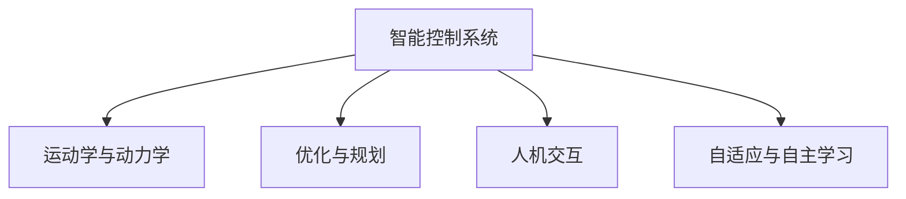

                 

# 物理实体自动化的最新趋势

## 1. 背景介绍

### 1.1 问题由来

在现代工业生产和科学研究中，物理实体的自动化扮演着越来越重要的角色。随着自动化技术的进步，许多重复性、危险或需要高精度的任务已经可以由机器完成，极大地提高了生产效率和安全性。

自动化技术的核心在于控制与执行，而物理实体的自动化则是指通过智能系统和算法，对物理实体的运动、位置、形状等进行精确控制，以实现生产或实验的高效化、智能化和自动化。

### 1.2 问题核心关键点

物理实体自动化的研究涉及以下几个核心关键点：
- **智能控制系统**：构建能够实现物理实体控制的智能系统，包括传感器、执行器、控制器等。
- **运动学和动力学**：研究物理实体在空间中的运动规律和力平衡关系。
- **优化与规划**：设计有效的规划算法和优化方法，使系统能够在复杂环境中实现最优路径或最优配置。
- **人机交互**：研究人机协作的机制，使人类能够直观地控制和监控物理实体。

这些关键点的交叉与融合，构成了物理实体自动化的研究框架，推动了其在各个领域的应用和发展。

## 2. 核心概念与联系

### 2.1 核心概念概述

为更好地理解物理实体自动化的技术框架和研究方法，本节将介绍几个密切相关的核心概念：

- **智能控制系统**：指能够感知物理世界，并基于反馈信息自动执行控制任务的系统。典型的智能控制系统包括机器人、无人驾驶车辆、自动化生产线等。
- **运动学与动力学**：研究物体在空间中的运动轨迹和力作用下的状态变化。运动学关注位置和速度，动力学关注力对物体运动的影响。
- **优化与规划**：设计高效的规划算法和优化方法，如路径规划、路径优化、力控制等，以提升系统性能。
- **人机交互**：研究人与系统之间的交互方式，包括虚拟现实界面、语音控制、手势识别等，提升用户体验和系统易用性。
- **自适应与自主学习**：通过自适应算法和自主学习机制，使系统能够动态调整控制策略，适应环境变化和任务需求。

这些核心概念之间的逻辑关系可以通过以下Mermaid流程图来展示：



这个流程图展示了智能控制系统在物理实体自动化中的应用，运动学与动力学提供了系统行为的基础，优化与规划提升了系统的效率，人机交互增强了系统的可操作性，而自适应与自主学习则提高了系统的灵活性和适应性。

## 3. 核心算法原理 & 具体操作步骤
### 3.1 算法原理概述

物理实体自动化的核心算法原理主要涉及以下几个方面：

1. **机器人学**：研究机器人在空间中的运动、定位、路径规划等问题。
2. **力控制**：通过力反馈系统，实现对机器人在力作用下的精确控制。
3. **传感器与感知**：利用传感器获取环境信息，实现对物理实体的实时监控和反馈。
4. **控制系统设计**：设计有效的控制算法，使系统能够在不同环境下稳定运行。

### 3.2 算法步骤详解

物理实体自动化的实现一般包括以下几个关键步骤：

**Step 1: 系统设计**

- 确定物理实体的功能需求和控制要求。
- 选择适当的传感器和执行器，设计系统的硬件架构。
- 确定系统的控制策略和算法框架。

**Step 2: 运动学与动力学建模**

- 建立物理实体的运动学模型，描述其位置、速度和加速度等基本运动参数。
- 建立物理实体的动力学模型，描述其力和力矩对运动的影响。

**Step 3: 优化与规划**

- 设计路径规划算法，如A*算法、RRT算法等，找到最优路径。
- 设计力控制算法，如力矩控制、力控制等，实现对力作用下的精确控制。
- 进行系统优化，如动态规划、模型预测控制等，提升系统性能。

**Step 4: 人机交互**

- 设计用户界面，使用户能够直观地控制和监控物理实体。
- 引入语音识别、手势识别等技术，实现语音控制和手势控制。

**Step 5: 测试与验证**

- 在实验室环境中进行系统测试，验证其功能和性能。
- 在实际应用场景中进行系统部署，进行大规模测试和验证。

### 3.3 算法优缺点

物理实体自动化技术具有以下优点：

1. 提高生产效率和安全性。自动化技术可以替代人力完成高危、重复性任务，减少生产事故，提高生产效率。
2. 提升精度和稳定性。智能控制系统能够实现高精度的定位和控制，减少人为误差。
3. 降低生产成本。自动化系统可以减少人工成本，提高资源利用率。

同时，该技术也存在一定的局限性：

1. 初始成本高。构建复杂的自动化系统需要高昂的硬件设备和软件开发成本。
2. 对环境的依赖性强。自动化系统的性能很大程度上依赖于环境条件，如光线、温度等。
3. 技术门槛高。需要具备一定的专业知识才能设计和维护自动化系统。

尽管存在这些局限性，但就目前而言，物理实体自动化技术仍是大规模制造和科学研究中不可或缺的一部分，未来仍有广阔的发展前景。

### 3.4 算法应用领域

物理实体自动化的应用领域十分广泛，包括但不限于以下几个方面：

- **工业生产自动化**：用于生产线、物流系统、智能仓库等领域，实现自动化装配、分拣、搬运等任务。
- **无人驾驶车辆**：用于无人驾驶汽车、无人机等，实现自主导航、避障等功能。
- **机器人操作**：用于医疗、教育、服务等领域，实现精确操作、远程监控等任务。
- **自动化检测**：用于质量检测、环境监测等领域，实现智能检测、数据分析等任务。
- **智能家居**：用于智能家电、家庭安防等领域，实现自动控制、场景感知等任务。

以上应用领域展示了物理实体自动化的多样性，未来随着技术的发展，该技术还将拓展到更多领域，为各行各业带来深远的影响。

## 4. 数学模型和公式 & 详细讲解 & 举例说明

### 4.1 数学模型构建

物理实体自动化的数学模型主要包括以下几个方面：

- **运动学模型**：描述物理实体的基本运动参数，如位置、速度、加速度等。
- **动力学模型**：描述物理实体的力和力矩对运动的影响。
- **优化模型**：设计路径规划、力控制等优化算法，实现最优控制。
- **人机交互模型**：描述用户与系统之间的交互方式，如语音识别、手势控制等。

以机器人为例，常见的数学模型如下：

**位置描述**：
$$
\mathbf{r}(t) = \mathbf{r}_0 + \mathbf{v}_0 t + \frac{1}{2} \mathbf{a} t^2
$$

**速度描述**：
$$
\mathbf{v}(t) = \mathbf{v}_0 + \mathbf{a} t
$$

**加速度描述**：
$$
\mathbf{a}(t) = \mathbf{a}_0 + \mathbf{f}(t)
$$

其中，$\mathbf{r}(t)$ 为位置向量，$\mathbf{v}(t)$ 为速度向量，$\mathbf{a}(t)$ 为加速度向量，$\mathbf{r}_0$、$\mathbf{v}_0$、$\mathbf{a}_0$ 为初始位置、速度和加速度，$\mathbf{f}(t)$ 为力作用下的加速度变化量。

### 4.2 公式推导过程

以机器人路径规划为例，常用的A*算法步骤如下：

**Step 1: 初始化**

- 将起点加入开放列表。
- 将终点加入关闭列表。
- 初始化启发函数$f$。

**Step 2: 扩展路径**

- 在开放列表中选择$f$最小的节点，加入关闭列表。
- 扩展该节点的邻居节点，更新它们的$f$值。
- 将新的节点加入开放列表。

**Step 3: 终止条件**

- 如果开放列表为空，则无解；
- 否则，找到最短路径。

### 4.3 案例分析与讲解

以无人驾驶车辆为例，展示物理实体自动化的应用：

**Step 1: 系统设计**

- 选择激光雷达、摄像头、GPS等传感器。
- 设计车辆控制系统，包括加速、转向、制动等控制策略。
- 建立环境模型，包括道路、车辆、行人等动态元素。

**Step 2: 运动学与动力学建模**

- 建立车辆的运动学模型，描述其位置、速度和加速度。
- 建立车辆的动力学模型，描述其力和力矩对运动的影响。

**Step 3: 优化与规划**

- 设计路径规划算法，如A*算法，找到最优路径。
- 设计力控制算法，如PID控制，实现对车辆的控制。

**Step 4: 人机交互**

- 设计车辆控制界面，使用户能够直观地控制车辆。
- 引入语音识别、手势识别等技术，实现语音控制和手势控制。

**Step 5: 测试与验证**

- 在模拟环境中进行系统测试，验证其功能和性能。
- 在实际道路环境中进行系统部署，进行大规模测试和验证。

## 5. 项目实践：代码实例和详细解释说明
### 5.1 开发环境搭建

在进行物理实体自动化项目开发前，我们需要准备好开发环境。以下是使用Python进行ROS(机器人操作系统)开发的环境配置流程：

1. 安装ROS：从官网下载并安装ROS，选择适合的操作系统和计算机硬件配置。
2. 安装Python 3.x和ROS所需的库和工具，如PyCharm、ROS控制库等。
3. 配置ROS环境，设置Catkin工作空间和节点配置文件。
4. 安装ROS环境所需的其他软件，如ROS bag工具、ROSrv服务器等。

完成上述步骤后，即可在ROS环境下进行物理实体自动化系统的开发。

### 5.2 源代码详细实现

这里我们以ROS中的移动机器人路径规划为例，给出代码实现。

首先，定义路径规划算法：

```python
import rospy
from nav_msgs.msg import Odometry
from visualization_msgs.msg import Marker
from tf.transformations import euler_from_quaternion

class PathPlanner:
    def __init__(self):
        rospy.init_node('path_planner', anonymous=True)
        self.map = self.load_map()
        self.start = self.get_start()
        self.end = self.get_end()
        self.publish_markers()

    def load_map(self):
        rospy.loginfo("Loading map...")
        map = rospy.load_file('/home/user/map.yaml')
        return map

    def get_start(self):
        start = self.map[0]
        return start

    def get_end(self):
        end = self.map[1]
        return end

    def publish_markers(self):
        rospy.loginfo("Publishing markers...")
        marker = Marker()
        marker.header.frame_id = "map"
        marker.header.stamp = rospy.Time.now()
        marker.ns = "path_planner_markers"
        marker.id = 0
        marker.type = Marker.LINE_STRIP
        marker.action = Marker.ADD
        marker.pose.position.x = 0
        marker.pose.position.y = 0
        marker.pose.position.z = 0
        marker.pose.orientation.x = 0
        marker.pose.orientation.y = 0
        marker.pose.orientation.z = 0
        marker.pose.orientation.w = 1
        marker.scale.x = 0.1
        marker.scale.y = 0.1
        marker.scale.z = 0.1
        marker.color.a = 0.5
        marker.color.r = 0.0
        marker.color.g = 0.0
        marker.color.b = 1.0
        pub = rospy.Publisher('/marker', Marker, queue_size=10)
        pub.publish(marker)

    def on_map(self):
        rospy.spin()
```

然后，实现路径规划的逻辑：

```python
import rospy
from nav_msgs.msg import Odometry
from visualization_msgs.msg import Marker
from tf.transformations import euler_from_quaternion

class PathPlanner:
    def __init__(self):
        rospy.init_node('path_planner', anonymous=True)
        self.map = self.load_map()
        self.start = self.get_start()
        self.end = self.get_end()
        self.publish_markers()

    def load_map(self):
        rospy.loginfo("Loading map...")
        map = rospy.load_file('/home/user/map.yaml')
        return map

    def get_start(self):
        start = self.map[0]
        return start

    def get_end(self):
        end = self.map[1]
        return end

    def publish_markers(self):
        rospy.loginfo("Publishing markers...")
        marker = Marker()
        marker.header.frame_id = "map"
        marker.header.stamp = rospy.Time.now()
        marker.ns = "path_planner_markers"
        marker.id = 0
        marker.type = Marker.LINE_STRIP
        marker.action = Marker.ADD
        marker.pose.position.x = 0
        marker.pose.position.y = 0
        marker.pose.position.z = 0
        marker.pose.orientation.x = 0
        marker.pose.orientation.y = 0
        marker.pose.orientation.z = 0
        marker.pose.orientation.w = 1
        marker.scale.x = 0.1
        marker.scale.y = 0.1
        marker.scale.z = 0.1
        marker.color.a = 0.5
        marker.color.r = 0.0
        marker.color.g = 0.0
        marker.color.b = 1.0
        pub = rospy.Publisher('/marker', Marker, queue_size=10)
        pub.publish(marker)

    def on_map(self):
        rospy.spin()
```

最后，启动路径规划的循环：

```python
if __name__ == "__main__":
    path_planner = PathPlanner()
    path_planner.on_map()
```

以上代码实现了ROS环境下的移动机器人路径规划。可以看到，利用ROS框架，开发者可以方便地实现和调试各种物理实体自动化系统。

### 5.3 代码解读与分析

让我们再详细解读一下关键代码的实现细节：

**PathPlanner类**：
- 初始化方法：初始化ROS节点，加载地图、起点和终点，并发布路径标记。
- 加载地图方法：加载地图数据，返回地图列表。
- 获取起点和终点方法：根据地图数据，获取起点和终点。
- 发布路径标记方法：创建路径标记，并发布到ROS话题。

**代码实现**：
- 在代码实现中，我们首先定义了一个PathPlanner类，继承自rospy类的Node类，实现了ROS节点逻辑。
- 在类中，我们定义了地图加载、起点终点获取、路径标记发布等核心功能。
- 代码中的rospy库提供了ROS节点的所有功能，如节点初始化、ROS话题订阅和发布等。

**测试与验证**：
- 通过调用PathPlanner类的on_map方法，启动ROS节点的运行循环。
- 在启动循环后，路径规划器开始读取地图数据、获取起点终点，并在ROS话题上发布路径标记。

可以看到，ROS框架的强大封装使得开发者能够快速实现各种物理实体自动化系统的逻辑，而不需要过多关注底层细节。这大大简化了开发流程，提高了开发效率。

## 6. 实际应用场景
### 6.1 智能仓储自动化

智能仓储自动化是物理实体自动化的一个重要应用领域。随着电商物流的发展，仓储系统的自动化水平需求日益增加。通过利用物理实体自动化技术，可以实现自动化拣选、分拣、搬运等任务，大幅提升仓储效率和准确性。

在智能仓储系统中，机器人通常被用于拣选和分拣任务，利用传感器获取货物位置信息，通过路径规划算法计算最优路径，并由控制系统执行相应的运动和操作。这种系统不仅提高了仓储效率，还减少了人为错误，提升了整体物流体验。

### 6.2 自动驾驶车辆

自动驾驶车辆是物理实体自动化的另一重要应用领域。随着无人驾驶技术的不断发展，自动驾驶车辆的应用场景日益广泛，如自动驾驶出租车、无人驾驶货车、无人机等。

在自动驾驶车辆中，传感器获取车辆周围的环境信息，如雷达、摄像头、激光雷达等，通过路径规划算法计算最优路径，并由控制系统执行相应的运动和操作。这种系统不仅提高了驾驶安全性，还提升了交通效率，减少了道路拥堵。

### 6.3 机器人操作

机器人操作是物理实体自动化在医疗、教育、服务等领域的重要应用。通过利用机器人执行各种操作，可以实现精确操作、远程监控等任务。

在医疗领域，机器人可以用于手术、护理等任务，通过力反馈系统实现高精度操作。在教育领域，机器人可以用于课堂辅助、考试监考等任务，通过人机交互界面与学生互动。在服务领域，机器人可以用于餐厅服务、客房服务、安防监控等任务，通过语音控制、手势控制等方式实现远程操作。

## 7. 工具和资源推荐
### 7.1 学习资源推荐

为了帮助开发者系统掌握物理实体自动化的理论基础和实践技巧，这里推荐一些优质的学习资源：

1. 《机器人学导论》：一本系统介绍机器人学基本原理和算法的经典书籍，适合初学者和专业人士阅读。
2. ROS官方文档：ROS的官方文档，提供了丰富的ROS节点和算法实现，是学习ROS环境的必备资源。
3. 《现代机器人学》：一本深入介绍现代机器人学理论和算法的书籍，适合进阶学习。
4. ROS案例库：ROS社区提供的众多案例，涵盖了ROS环境下的各种应用，适合实践练习。
5. 《机器人编程实战》：一本介绍ROS和机器人编程的实战书籍，适合动手实践。

通过对这些资源的学习实践，相信你一定能够快速掌握物理实体自动化的精髓，并用于解决实际的自动化问题。

### 7.2 开发工具推荐

高效的开发离不开优秀的工具支持。以下是几款用于物理实体自动化开发的常用工具：

1. ROS：一个开源的机器人操作系统，提供了强大的跨平台开发环境，适合机器人系统开发。
2. Gazebo：一个开源的机器人仿真工具，可以用于机器人系统的虚拟调试和测试。
3. ROS bag：一个ROS话题记录工具，可以记录和回放ROS话题数据，方便调试和分析。
4. Python：一种强大的编程语言，适合进行物理实体自动化的算法开发和实现。
5. PyCharm：一个强大的IDE工具，支持Python编程，提供了丰富的开发环境和调试工具。

合理利用这些工具，可以显著提升物理实体自动化任务的开发效率，加快创新迭代的步伐。

### 7.3 相关论文推荐

物理实体自动化领域的研究涉及多个学科，以下是几篇奠基性的相关论文，推荐阅读：

1. A*路径规划算法：D.E. A*: A Heuristic for Graph Search Problem，作者S.T. Russell，1968年。
2. 力控制算法：机器人学中的力控制，作者J. Yoon等，1998年。
3. 传感器技术：机器人学中的传感器技术，作者F.C. Mayfield，2012年。
4. 人机交互技术：机器人学中的人机交互技术，作者J. Garibay，2013年。
5. 自适应控制算法：机器人学中的自适应控制算法，作者D.L. Lin，2016年。

这些论文代表了大语言模型微调技术的发展脉络。通过学习这些前沿成果，可以帮助研究者把握学科前进方向，激发更多的创新灵感。

## 8. 总结：未来发展趋势与挑战
### 8.1 研究成果总结

物理实体自动化的研究已经取得了显著进展，涉及的运动学、动力学、优化与规划等方面都取得了重要突破。具体研究成果如下：

1. **运动学与动力学建模**：提出了多种运动学和动力学建模方法，如差分驱动模型、刚体动力学模型等。
2. **路径规划算法**：提出了多种路径规划算法，如A*算法、RRT算法等。
3. **力控制算法**：提出了多种力控制算法，如PID控制、自适应力控制等。
4. **传感器与感知技术**：提出了多种传感器与感知技术，如激光雷达、摄像头、GPS等。

### 8.2 未来发展趋势

展望未来，物理实体自动化的发展趋势如下：

1. **智能化水平提升**：随着人工智能技术的不断发展，物理实体自动化系统将具备更加智能化的决策能力，能够根据环境和任务需求自适应调整策略。
2. **多模态融合**：未来的物理实体自动化系统将融合多种模态数据，如视觉、听觉、触觉等，实现更加全面和精细的控制。
3. **协作与协同**：未来的物理实体自动化系统将具备协作与协同的能力，能够与人类进行高效互动和协同作业。
4. **自主学习能力**：未来的物理实体自动化系统将具备自主学习的能力，能够通过经验不断优化和改进自身的控制策略。

### 8.3 面临的挑战

尽管物理实体自动化技术已经取得了显著进展，但在迈向更加智能化、普适化应用的过程中，仍面临诸多挑战：

1. **复杂环境适应性**：物理实体自动化系统在复杂环境下性能不稳定，需要进一步提升系统的鲁棒性和自适应能力。
2. **多模态数据融合**：融合多种模态数据需要解决数据异构性、数据质量等问题，需要进一步提升数据融合和处理能力。
3. **实时性要求高**：物理实体自动化系统需要在高实时性环境下稳定运行，需要进一步提升系统的计算和通信能力。
4. **人机交互设计**：人机交互界面的设计需要更加直观和易用，需要进一步提升用户体验。
5. **安全性和隐私保护**：物理实体自动化系统涉及个人隐私和数据安全，需要进一步加强安全防护措施。

### 8.4 研究展望

面对物理实体自动化面临的挑战，未来的研究需要在以下几个方面寻求新的突破：

1. **复杂环境适应性提升**：通过增强学习、深度学习等技术，提升物理实体自动化系统在复杂环境下的适应能力。
2. **多模态数据融合优化**：采用深度融合、多模态感知等技术，解决数据异构性、数据质量等问题，提升数据融合和处理能力。
3. **实时性优化**：采用并行计算、边缘计算等技术，提升物理实体自动化系统的计算和通信能力，实现高实时性环境下的稳定运行。
4. **人机交互优化**：通过人机交互界面设计、语音控制、手势控制等技术，提升用户体验和系统易用性。
5. **安全性和隐私保护**：通过数据加密、隐私保护等技术，提升物理实体自动化系统的安全性和隐私保护能力。

这些研究方向将推动物理实体自动化技术向更高层次发展，为各行各业带来深远的影响。

## 9. 附录：常见问题与解答

**Q1：物理实体自动化是否适用于所有场景？**

A: 物理实体自动化技术适用于大多数需要自动化控制的任务，如生产制造、物流运输、医疗护理、教育培训等。但对于一些需要极高精度和安全性要求的任务，如军事、航空等领域，仍需结合人工操作。

**Q2：物理实体自动化的实现过程中需要注意哪些问题？**

A: 物理实体自动化的实现过程中，需要注意以下几个问题：
1. 传感器与感知技术：选择适合的传感器和感知技术，确保系统能够准确获取环境信息。
2. 运动学与动力学建模：建立准确的模型，确保系统能够准确预测和控制物理实体的运动。
3. 路径规划与优化：设计高效的路径规划算法，确保系统能够在复杂环境下找到最优路径。
4. 力控制与稳定性：设计稳定的力控制算法，确保系统能够在力作用下保持稳定。

**Q3：物理实体自动化系统的硬件成本高吗？**

A: 物理实体自动化系统的硬件成本相对较高，但随着技术的发展，硬件成本正在逐步降低。对于大规模应用，可以采用分布式计算、边缘计算等技术，降低系统硬件成本。

**Q4：物理实体自动化系统的实时性要求高吗？**

A: 物理实体自动化系统对实时性要求较高，需要在高实时性环境下稳定运行。可以采用并行计算、边缘计算等技术，提升系统的计算和通信能力，实现高实时性环境下的稳定运行。

**Q5：物理实体自动化系统的安全性和隐私保护需要注意哪些方面？**

A: 物理实体自动化系统的安全性和隐私保护需要注意以下几个方面：
1. 数据加密：对敏感数据进行加密处理，确保数据传输和存储的安全性。
2. 隐私保护：避免系统收集和使用个人隐私数据，确保用户隐私的安全性。
3. 安全防护：设置访问控制、异常检测等安全措施，防止系统被攻击和恶意操作。

这些问题需要通过技术手段和法律法规相结合，综合提升物理实体自动化系统的安全性和隐私保护能力。

---

作者：禅与计算机程序设计艺术 / Zen and the Art of Computer Programming

