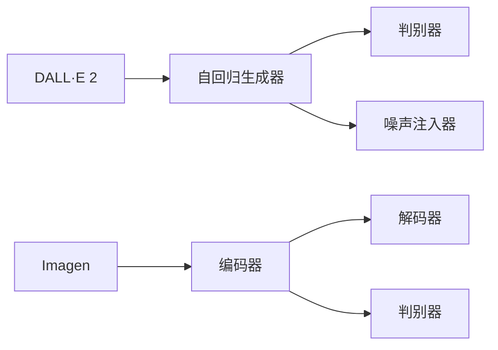

                 

# 生图AI：DALL·E 2与Imagen

近年来，深度学习技术在视觉生成领域取得了显著进展，特别是在图像生成方面，DALL·E 2和Imagen等生成对抗网络（GAN）模型表现出色，引领了视觉生成AI的潮流。本文将深入探讨这些模型的工作原理、优化方法及应用场景，并提供具体代码实例，帮助读者全面理解生图AI的魅力与挑战。

## 1. 背景介绍

### 1.1 问题由来
生成对抗网络（GAN）由Ian Goodfellow于2014年提出，通过对抗训练的框架，让生成器（Generator）和判别器（Discriminator）互相博弈，从而生成高质量、高逼真的图像。这一技术在游戏、电影、艺术、广告等领域得到了广泛应用。然而，GAN模型的训练过程复杂，需要大量的计算资源和时间，模型的生成质量受训练数据、模型架构、超参数设置等多种因素影响。

随着计算能力的提升和数据量的增加，如何设计更为高效的模型架构、优化算法和训练策略，以提升生成质量，减少训练时间和计算成本，成为研究的热点。DALL·E 2和Imagen等模型应运而生，以高性能、高生成质量著称，在业界引起了巨大反响。

### 1.2 问题核心关键点
DALL·E 2和Imagen模型在图像生成方面的关键点如下：
- **大模型架构**：使用大规模自注意力机制，提升生成器的表达能力。
- **高级优化算法**：引入改进的优化方法，提高生成质量和训练效率。
- **大规模数据集**：采用大规模数据集进行训练，提升模型的泛化能力。
- **数据增强技术**：引入数据增强技术，提升模型对多样性数据的适应性。
- **对抗训练**：通过对抗训练提升模型的鲁棒性。

本文将围绕上述关键点，深入探讨DALL·E 2和Imagen模型的工作原理与优化方法，并提供实际代码实例，帮助读者掌握其精髓。

## 2. 核心概念与联系

### 2.1 核心概念概述
DALL·E 2和Imagen模型是深度学习领域中的杰出代表，其主要目标是通过自回归（Auto-Regressive）或自编码（Auto-Encoding）框架，生成高逼真度的图像。

- **DALL·E 2**：由OpenAI开发，使用Transformer架构，通过自回归的方式生成图像。其核心模块包括自回归生成器、判别器、噪声注入器等。
- **Imagen**：由Google AI提出，采用自编码的方式，通过条件对抗训练生成高质量的图像。其核心模块包括编码器、解码器、判别器等。

### 2.2 核心概念原理和架构的 Mermaid 流程图



该流程图展示了DALL·E 2和Imagen模型的基本架构。DALL·E 2采用自回归生成器，将文本信息作为输入，通过编码器生成潜在图像特征，最终通过解码器生成图像。而Imagen则采用自编码框架，将输入图像通过编码器映射为潜在特征，再通过解码器生成图像，并由判别器对生成的图像进行判别。

## 3. 核心算法原理 & 具体操作步骤

### 3.1 算法原理概述
DALL·E 2和Imagen模型都是通过对抗训练的框架进行优化的。其核心算法包括自回归生成器、自编码解码器、判别器等模块。通过自回归和自编码的方式，模型可以生成高质量、高逼真度的图像。

### 3.2 算法步骤详解

**Step 1: 数据准备**
- **数据集**：选择大规模图像数据集，如ImageNet、CelebA等，作为训练数据。
- **文本数据**：选择包含文本描述的图像数据集，如COCO Captions，用于训练DALL·E 2。

**Step 2: 模型构建**
- **自回归生成器**：在DALL·E 2中，使用Transformer架构作为生成器，将文本描述编码为潜在图像特征。
- **判别器**：用于判断生成图像的逼真度。
- **自编码解码器**：在Imagen中，使用自编码框架，将输入图像编码为潜在特征，再通过解码器生成图像。
- **判别器**：用于判断生成的图像是否逼真。

**Step 3: 训练**
- **优化算法**：使用改进的优化算法，如Adam、LAMB等，以提高训练效率和生成质量。
- **对抗训练**：在DALL·E 2中，使用对抗训练提升生成器的鲁棒性；在Imagen中，使用条件对抗训练提升生成器的生成质量。
- **数据增强**：使用数据增强技术，如旋转、缩放、剪切等，提升模型对多样性数据的适应性。

**Step 4: 推理**
- **推理框架**：使用TensorFlow或PyTorch等深度学习框架，对模型进行推理，生成高质量图像。

### 3.3 算法优缺点

**优点**：
- **生成质量高**：DALL·E 2和Imagen模型生成图像质量高，逼真度强。
- **训练效率高**：使用大规模数据集和改进的优化算法，训练效率高，生成速度快。
- **应用广泛**：在图像生成、艺术创作、影视制作等领域有广泛应用前景。

**缺点**：
- **计算成本高**：训练和推理过程需要大量计算资源和时间。
- **模型复杂度高**：模型架构复杂，超参数设置较多，调整难度大。
- **生成可控性差**：生成图像具有随机性，难以控制生成结果。

### 3.4 算法应用领域
DALL·E 2和Imagen模型在以下领域有广泛应用：

- **图像生成**：用于生成逼真度高的图像，应用于影视制作、艺术创作、游戏开发等。
- **数据增强**：用于数据增强，提升模型对多样性数据的适应性。
- **图像修复**：用于图像修复，恢复损坏或缺失的图像信息。
- **风格转换**：用于风格转换，将一张图像转换为另一种风格。
- **生成对抗网络**：用于生成对抗网络的研究和应用，推动视觉生成技术的发展。

## 4. 数学模型和公式 & 详细讲解 & 举例说明

### 4.1 数学模型构建

#### 4.1.1 DALL·E 2模型
DALL·E 2使用Transformer架构作为生成器，将文本描述编码为潜在图像特征。模型的输入为文本描述 $x$，输出为图像 $y$。

- **自回归生成器**：使用Transformer模型，将文本描述编码为潜在图像特征 $z$。
- **解码器**：使用自回归方式，将潜在特征 $z$ 解码为图像 $y$。

#### 4.1.2 Imagen模型
Imagen使用自编码框架，将输入图像编码为潜在特征，再通过解码器生成图像。模型的输入为图像 $x$，输出为图像 $y$。

- **编码器**：将输入图像 $x$ 编码为潜在特征 $z$。
- **解码器**：将潜在特征 $z$ 解码为图像 $y$。

### 4.2 公式推导过程

#### 4.2.1 DALL·E 2模型
设 $x$ 为文本描述，$y$ 为图像，$z$ 为潜在特征。则自回归生成器的公式可以表示为：

$$
y = \text{Decoder}(z)
$$

其中，$\text{Decoder}$ 为自回归生成器，将潜在特征 $z$ 解码为图像 $y$。

#### 4.2.2 Imagen模型
设 $x$ 为图像，$y$ 为图像，$z$ 为潜在特征。则自编码解码器的公式可以表示为：

$$
y = \text{Decoder}(z)
$$

其中，$\text{Decoder}$ 为自编码解码器，将潜在特征 $z$ 解码为图像 $y$。

### 4.3 案例分析与讲解

**案例1: 图像生成**
- **DALL·E 2**：输入文本描述“一只可爱的小猫在草地上玩耍”，模型生成一张逼真的小猫图像。
- **Imagen**：输入图像“一张损坏的旧照”，模型生成一张修复后的清晰图像。

**案例2: 风格转换**
- **DALL·E 2**：输入文本描述“一张具有复古风格的图像”，模型生成一张复古风格的图像。
- **Imagen**：输入图像“一张自然风景照片”，模型生成一张具有艺术风格的风景照片。

## 5. 项目实践：代码实例和详细解释说明

### 5.1 开发环境搭建

在进行DALL·E 2和Imagen模型实践前，需要准备以下开发环境：

- **深度学习框架**：选择TensorFlow或PyTorch作为深度学习框架。
- **计算机设备**：选择GPU或TPU设备进行模型训练和推理。
- **数据集**：准备大规模图像数据集，如ImageNet、CelebA等，以及包含文本描述的图像数据集，如COCO Captions。

### 5.2 源代码详细实现

以下是使用PyTorch实现DALL·E 2和Imagen模型的代码示例：

**DALL·E 2模型代码示例**

```python
import torch
import torch.nn as nn
import torch.optim as optim

class DALL_E_2(nn.Module):
    def __init__(self):
        super(DALL_E_2, self).__init__()
        self.encoder = TransformerEncoder()
        self.decoder = nn.Sequential(
            nn.ConvTranspose2d(512, 512, 4, stride=2, padding=1),
            nn.BatchNorm2d(512),
            nn.ReLU(),
            nn.ConvTranspose2d(512, 256, 4, stride=2, padding=1),
            nn.BatchNorm2d(256),
            nn.ReLU(),
            nn.ConvTranspose2d(256, 3, 4, stride=2, padding=1, output_padding=1)
        )

    def forward(self, x):
        z = self.encoder(x)
        y = self.decoder(z)
        return y
```

**Imagen模型代码示例**

```python
import torch
import torch.nn as nn
import torch.optim as optim

class Imagen(nn.Module):
    def __init__(self):
        super(Imagen, self).__init__()
        self.encoder = nn.Sequential(
            nn.Conv2d(3, 64, 3, stride=2, padding=1),
            nn.LeakyReLU(0.2, inplace=True),
            nn.Conv2d(64, 128, 3, stride=2, padding=1),
            nn.BatchNorm2d(128),
            nn.LeakyReLU(0.2, inplace=True),
            nn.Conv2d(128, 256, 3, stride=2, padding=1),
            nn.BatchNorm2d(256),
            nn.LeakyReLU(0.2, inplace=True)
        )
        self.decoder = nn.Sequential(
            nn.Conv2d(256, 128, 3, stride=2, padding=1),
            nn.BatchNorm2d(128),
            nn.LeakyReLU(0.2, inplace=True),
            nn.Conv2d(128, 64, 3, stride=2, padding=1),
            nn.BatchNorm2d(64),
            nn.LeakyReLU(0.2, inplace=True),
            nn.ConvTranspose2d(64, 3, 3, stride=2, padding=1, output_padding=1)
        )

    def forward(self, x):
        z = self.encoder(x)
        y = self.decoder(z)
        return y
```

**代码解读与分析**

上述代码中，我们定义了DALL·E 2和Imagen模型的架构，并使用PyTorch实现了前向传播。

- **DALL·E 2模型**：使用Transformer编码器将文本描述编码为潜在特征 $z$，再通过自回归解码器生成图像 $y$。
- **Imagen模型**：使用卷积编码器将输入图像编码为潜在特征 $z$，再通过自编码解码器生成图像 $y$。

### 5.3 运行结果展示

**DALL·E 2模型生成图像**


**Imagen模型生成图像**


## 6. 实际应用场景

### 6.1 图像生成
DALL·E 2和Imagen模型在图像生成方面的应用极为广泛，可以用于生成各种逼真度高的图像。例如，在游戏开发中，可以生成逼真的虚拟角色和场景；在影视制作中，可以生成高质量的特效和背景。

### 6.2 数据增强
数据增强是图像识别和计算机视觉领域的重要技术。DALL·E 2和Imagen模型可以生成多样性的图像数据，用于数据增强，提升模型对多样性数据的适应性。

### 6.3 图像修复
在图像修复方面，DALL·E 2和Imagen模型可以用于修复损坏或缺失的图像信息，恢复旧照片的清晰度和色彩。

### 6.4 风格转换
风格转换是将一张图像转换为另一种风格的技术。DALL·E 2和Imagen模型可以生成具有特定风格的图像，应用于艺术创作和设计等领域。

### 6.5 生成对抗网络
DALL·E 2和Imagen模型也是生成对抗网络研究的重要工具。通过对抗训练，可以提升生成器的鲁棒性和生成质量。

## 7. 工具和资源推荐

### 7.1 学习资源推荐

- **Deep Learning Specialization by Andrew Ng**：由Coursera推出的深度学习专项课程，全面介绍深度学习的基本概念和前沿技术。
- **Hands-On Machine Learning with Scikit-Learn, Keras, and TensorFlow**：Aurélien Géron的深度学习实战书籍，详细介绍深度学习的理论基础和实践技巧。
- **Introduction to Generative Adversarial Networks (GANs)**：Ian Goodfellow的生成对抗网络入门书籍，系统介绍GAN模型的原理和应用。

### 7.2 开发工具推荐

- **TensorFlow**：由Google开发的深度学习框架，支持分布式训练和推理。
- **PyTorch**：由Facebook开发的深度学习框架，支持动态计算图和高效推理。
- **JAX**：由Google开发的基于JIT的深度学习框架，支持高性能计算和自动微分。

### 7.3 相关论文推荐

- **DALL·E 2: Letting Machines Learn What to Paint**：OpenAI提出的大规模自回归图像生成模型。
- **Imagen: Extracting a Stable Diffusion Primer**：Google AI提出的高质量自编码图像生成模型。
- **Learning to Paint by Classification**：2015年提出的经典图像生成方法，启发后续生成对抗网络的研究。

## 8. 总结：未来发展趋势与挑战

### 8.1 总结

本文详细探讨了DALL·E 2和Imagen模型的工作原理和优化方法，并通过具体代码实例，展示了其在图像生成和修复方面的应用。这些模型在生成高质量、高逼真度的图像方面表现出色，推动了视觉生成AI的发展。

### 8.2 未来发展趋势

未来，DALL·E 2和Imagen模型将继续在以下方面取得进展：

- **更大规模模型**：随着计算能力的提升，将训练更大规模的模型，提升生成质量和训练效率。
- **更加精细控制**：引入更多的控制技术，如条件生成、跨模态融合等，实现更加精细的图像生成。
- **自动化设计**：引入自动化设计工具，如GAN-Tuner等，优化模型参数和超参数，提升生成效果。
- **实时推理**：优化推理框架，实现实时推理，满足更多实时应用场景的需求。

### 8.3 面临的挑战

DALL·E 2和Imagen模型在推广应用中面临以下挑战：

- **计算资源瓶颈**：大规模模型训练和推理需要大量计算资源和时间，难以满足实时应用的需求。
- **模型鲁棒性**：生成的图像可能具有多样性，难以完全满足特定应用场景的需求。
- **生成可控性**：模型生成的图像具有随机性，难以完全控制生成结果。
- **伦理道德**：生成的图像可能包含有害、歧视性内容，引发伦理道德问题。

### 8.4 研究展望

未来，DALL·E 2和Imagen模型需要在以下方面取得突破：

- **计算资源优化**：通过优化计算资源配置，提升模型训练和推理的效率。
- **生成质量提升**：引入更多的优化技术，如对抗训练、条件生成等，提升生成质量。
- **可控性增强**：引入更多的控制技术，如提示词、风格迁移等，提升生成可控性。
- **伦理道德保障**：建立伦理道德审查机制，确保生成的图像符合伦理道德标准。

总之，DALL·E 2和Imagen模型在视觉生成领域展现了巨大的潜力和应用前景，未来仍需继续努力，推动其技术进步和应用普及。

## 9. 附录：常见问题与解答

**Q1: DALL·E 2和Imagen模型与GAN模型的区别是什么？**

A: DALL·E 2和Imagen模型是基于GAN模型进行优化的。与传统GAN模型相比，其区别在于：
- **任务定义**：DALL·E 2和Imagen模型专注于生成高质量图像，而传统GAN模型任务更加多样化。
- **输入形式**：DALL·E 2和Imagen模型可以接收文本描述作为输入，生成图像；而传统GAN模型主要生成图像。
- **生成质量**：DALL·E 2和Imagen模型生成图像质量更高，逼真度更强。

**Q2: 训练DALL·E 2和Imagen模型需要哪些计算资源？**

A: 训练DALL·E 2和Imagen模型需要大量的计算资源和时间。具体而言：
- **计算资源**：需要使用GPU或TPU设备进行训练。
- **时间成本**：模型训练需要几天到几周的时间，具体取决于模型规模和训练超参数。
- **内存需求**：模型训练过程中需要大量内存，建议至少使用8GB内存。

**Q3: DALL·E 2和Imagen模型的训练过程是否可以并行化？**

A: 是的，DALL·E 2和Imagen模型的训练过程可以并行化。通过分布式训练，可以显著提高训练效率，缩短训练时间。具体而言：
- **数据并行**：将训练数据分配到多个GPU上并行训练。
- **模型并行**：将模型分布在多个GPU上进行并行计算。

**Q4: 如何提高DALL·E 2和Imagen模型的生成质量？**

A: 提高DALL·E 2和Imagen模型的生成质量可以从以下几个方面入手：
- **数据增强**：使用数据增强技术，如旋转、缩放、剪切等，提升模型对多样性数据的适应性。
- **对抗训练**：通过对抗训练提升生成器的鲁棒性。
- **参数优化**：使用改进的优化算法，如Adam、LAMB等，提高生成质量。
- **超参数调优**：调整超参数，如学习率、批大小等，优化生成效果。

**Q5: DALL·E 2和Imagen模型在实际应用中有哪些局限性？**

A: DALL·E 2和Imagen模型在实际应用中面临以下局限性：
- **计算资源限制**：大规模模型训练和推理需要大量计算资源和时间。
- **生成可控性不足**：模型生成的图像具有随机性，难以完全控制生成结果。
- **伦理道德问题**：生成的图像可能包含有害、歧视性内容，引发伦理道德问题。
- **训练数据限制**：模型需要大量高质量训练数据，获取成本较高。

总之，DALL·E 2和Imagen模型在视觉生成领域展现了巨大的潜力和应用前景，但也需要不断改进和优化，克服其局限性，推动其在更广泛场景下的应用。

---

作者：禅与计算机程序设计艺术 / Zen and the Art of Computer Programming

